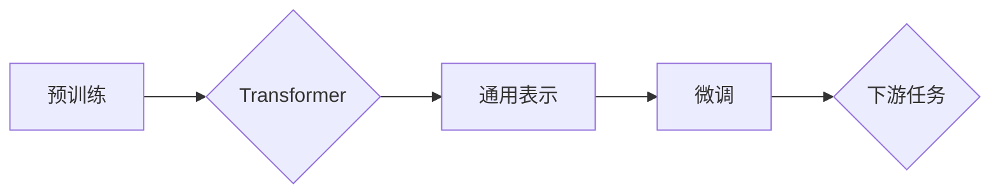

# 大规模语言模型从理论到实践 大语言模型基础

> 关键词：大规模语言模型，预训练，Transformer，自然语言处理，微调，迁移学习

## 1. 背景介绍

随着深度学习技术的飞速发展，自然语言处理（Natural Language Processing，NLP）领域取得了突破性的进展。其中，大规模语言模型（Large Language Model，LLM）的出现，为NLP应用带来了前所未有的可能性。本文将从理论到实践，深入探讨大规模语言模型的基础知识，包括其核心概念、算法原理、数学模型、实际应用以及未来发展趋势。

## 2. 核心概念与联系

### 2.1 核心概念

#### 2.1.1 预训练（Pre-training）

预训练是指在大规模无标签文本语料上进行训练，使得模型能够学习到丰富的语言知识和通用表示。预训练是大规模语言模型的基础，它为模型提供了丰富的语言背景知识。

#### 2.1.2 Transformer

Transformer是一种基于自注意力机制的深度神经网络模型，它摒弃了传统的循环神经网络（RNN）的序列处理方式，通过自注意力机制实现了并行计算，从而在NLP领域取得了显著的成果。

#### 2.1.3 微调（Fine-tuning）

微调是指在预训练模型的基础上，使用下游任务的少量标注数据，对模型进行进一步训练，以适应特定任务的需求。

#### 2.1.4 迁移学习（Transfer Learning）

迁移学习是指将一个领域学习到的知识应用到另一个不同但相关的领域。在大规模语言模型中，预训练阶段就是迁移学习的一种体现。

### 2.2 Mermaid 流程图



### 2.3 核心概念联系

预训练是大规模语言模型的基础，Transformer是预训练的主要模型结构，它学习到的通用表示可以用于微调，从而适应下游任务。

## 3. 核心算法原理 & 具体操作步骤

### 3.1 算法原理概述

大规模语言模型的算法原理主要包括预训练和微调两个阶段。

#### 3.1.1 预训练

预训练阶段，模型在大规模无标签文本语料上进行训练，学习到丰富的语言知识和通用表示。

#### 3.1.2 微调

微调阶段，模型使用下游任务的少量标注数据，对模型进行进一步训练，以适应特定任务的需求。

### 3.2 算法步骤详解

#### 3.2.1 预训练

1. 选择预训练任务，如言语建模、下一句预测等。
2. 选择预训练模型，如BERT、GPT等。
3. 在大规模无标签文本语料上进行预训练。
4. 获取预训练模型。

#### 3.2.2 微调

1. 选择下游任务，如文本分类、情感分析等。
2. 选择微调模型，如BERT、GPT等。
3. 在下游任务的少量标注数据上进行微调。
4. 获取微调模型。

### 3.3 算法优缺点

#### 3.3.1 优点

1. 预训练模型能够学习到丰富的语言知识，提高了模型的泛化能力。
2. 微调阶段只需少量标注数据，降低了数据获取成本。
3. 模型能够在多个任务上取得优异的性能。

#### 3.3.2 缺点

1. 预训练阶段需要大量的无标签文本语料。
2. 微调阶段需要下游任务的少量标注数据。
3. 模型复杂度高，计算量大。

### 3.4 算法应用领域

大规模语言模型在NLP领域有着广泛的应用，如：

1. 文本分类
2. 情感分析
3. 机器翻译
4. 文本摘要
5. 文本生成

## 4. 数学模型和公式 & 详细讲解 & 举例说明

### 4.1 数学模型构建

大规模语言模型的核心数学模型是Transformer，它由编码器和解码器组成。

#### 4.1.1 编码器

编码器由多层自注意力层和前馈神经网络组成，用于将输入序列转换为固定长度的特征向量。

#### 4.1.2 解码器

解码器由多层自注意力层、编码器-解码器注意力层和前馈神经网络组成，用于将特征向量转换为输出序列。

### 4.2 公式推导过程

#### 4.2.1 自注意力机制

自注意力机制的计算公式如下：

$$
\text{Attention}(Q, K, V) = \text{softmax}(\frac{QK^T}{\sqrt{d_k}})V
$$

其中，$Q, K, V$ 分别是查询向量、键向量和值向量，$d_k$ 是键向量的维度。

#### 4.2.2 编码器

编码器由多个自注意力层和前馈神经网络组成，其计算公式如下：

$$
\text{Encoder}(X) = \text{LayerNorm}(\text{MultiHeadAttention}(\text{LayerNorm}(XW_Q), \text{LayerNorm}(XW_K), \text{LayerNorm}(XW_V)) + X
$$

其中，$X$ 是输入序列，$W_Q, W_K, W_V$ 分别是查询矩阵、键矩阵和值矩阵。

#### 4.2.3 解码器

解码器由多个自注意力层、编码器-解码器注意力层和前馈神经网络组成，其计算公式如下：

$$
\text{Decoder}(X) = \text{LayerNorm}(\text{LayerNorm}(XW_X) + \text{MultiHeadAttention}(\text{LayerNorm}(XW_Q), \text{Encoder}(X), \text{LayerNorm}(XW_V)) + X
$$

其中，$X$ 是输入序列，$W_X, W_Q, W_K, W_V$ 分别是输入矩阵、查询矩阵、键矩阵和值矩阵。

### 4.3 案例分析与讲解

以BERT模型为例，解释其工作原理。

BERT（Bidirectional Encoder Representations from Transformers）是一种基于Transformer的预训练语言模型，它通过双向编码器学习到上下文信息，从而提高了模型对语言的理解能力。

BERT模型主要由以下几部分组成：

1. **词嵌入层**：将输入文本转换为词向量。
2. **位置编码层**：为每个词向量添加位置信息。
3. **Transformer编码器**：通过多层自注意力层和前馈神经网络，学习到上下文信息。
4. **输出层**：根据任务需求，输出相应的结果。

BERT模型在预训练阶段，使用两个任务：

1. **Masked Language Model（MLM）**：随机掩盖输入文本中的部分词，要求模型预测被掩盖的词。
2. **Next Sentence Prediction（NSP）**：判断两个句子是否是连续的。

在微调阶段，BERT模型可以应用于各种NLP任务，如文本分类、命名实体识别、情感分析等。

## 5. 项目实践：代码实例和详细解释说明

### 5.1 开发环境搭建

以下是使用PyTorch进行大规模语言模型微调的Python开发环境配置流程：

1. 安装Anaconda：从官网下载并安装Anaconda，用于创建独立的Python环境。

2. 创建并激活虚拟环境：
```bash
conda create -n torch-env python=3.8 
conda activate torch-env
```

3. 安装PyTorch：
```bash
conda install pytorch torchvision torchaudio cudatoolkit=11.1 -c pytorch -c conda-forge
```

4. 安装Hugging Face的Transformers库：
```bash
pip install transformers
```

5. 安装其他必要的库，如NumPy、Scikit-learn等。

### 5.2 源代码详细实现

以下是一个基于BERT模型进行文本分类任务的代码实例：

```python
import torch
from transformers import BertForSequenceClassification, BertTokenizer

# 加载预训练模型和分词器
model = BertForSequenceClassification.from_pretrained('bert-base-uncased')
tokenizer = BertTokenizer.from_pretrained('bert-base-uncased')

# 加载数据
train_texts = [...]  # 训练文本
train_labels = [...]  # 训练标签
dev_texts = [...]  # 验证文本
dev_labels = [...]  # 验证标签

# 编码文本
train_encodings = tokenizer(train_texts, truncation=True, padding=True)
dev_encodings = tokenizer(dev_texts, truncation=True, padding=True)

# 创建DataLoader
train_dataset = torch.utils.data.TensorDataset(torch.tensor(train_encodings['input_ids']), 
                                             torch.tensor(train_encodings['attention_mask']), 
                                             torch.tensor(train_labels))
dev_dataset = torch.utils.data.TensorDataset(torch.tensor(dev_encodings['input_ids']), 
                                             torch.tensor(dev_encodings['attention_mask']), 
                                             torch.tensor(dev_labels))
train_loader = torch.utils.data.DataLoader(train_dataset, batch_size=16, shuffle=True)
dev_loader = torch.utils.data.DataLoader(dev_dataset, batch_size=16)

# 训练模型
device = torch.device('cuda' if torch.cuda.is_available() else 'cpu')
model.to(device)
optimizer = torch.optim.AdamW(model.parameters(), lr=2e-5)

for epoch in range(3):
    model.train()
    for batch in train_loader:
        input_ids, attention_mask, labels = [t.to(device) for t in batch]
        outputs = model(input_ids, attention_mask=attention_mask, labels=labels)
        loss = outputs.loss
        loss.backward()
        optimizer.step()
        optimizer.zero_grad()
    print(f"Epoch {epoch+1}, Loss: {loss.item()}")

# 评估模型
model.eval()
with torch.no_grad():
    total_loss = 0
    for batch in dev_loader:
        input_ids, attention_mask, labels = [t.to(device) for t in batch]
        outputs = model(input_ids, attention_mask=attention_mask)
        loss = outputs.loss
        total_loss += loss.item()
    print(f"Dev Loss: {total_loss/len(dev_loader)}")
```

### 5.3 代码解读与分析

以上代码展示了如何使用PyTorch和Transformers库对BERT模型进行文本分类任务微调。

1. 首先，加载预训练的BERT模型和分词器。
2. 然后，加载数据并对其进行编码。
3. 创建DataLoader用于批量加载数据。
4. 定义优化器，如AdamW。
5. 在训练循环中，进行前向传播和反向传播，更新模型参数。
6. 在评估阶段，计算验证集上的平均损失。

## 6. 实际应用场景

大规模语言模型在NLP领域有着广泛的应用，以下列举一些典型应用场景：

1. **文本分类**：用于对文本进行分类，如情感分析、主题分类、垃圾邮件检测等。
2. **机器翻译**：将一种语言的文本翻译成另一种语言。
3. **文本摘要**：从长文本中提取关键信息，生成摘要。
4. **问答系统**：回答用户提出的问题。
5. **对话系统**：与人类进行自然语言对话。
6. **文本生成**：生成新的文本内容，如新闻报道、诗歌等。

## 7. 工具和资源推荐

### 7.1 学习资源推荐

1. 《Deep Learning for Natural Language Processing》
2. 《Transformers: State-of-the-art Models for Natural Language Processing》
3. Hugging Face的Transformers库文档

### 7.2 开发工具推荐

1. PyTorch
2. TensorFlow
3. Hugging Face的Transformers库

### 7.3 相关论文推荐

1. "Attention is All You Need"
2. "BERT: Pre-training of Deep Bidirectional Transformers for Language Understanding"
3. "Generative Language Models with Transformer"

## 8. 总结：未来发展趋势与挑战

### 8.1 研究成果总结

大规模语言模型在NLP领域取得了显著的成果，为NLP应用带来了前所未有的可能性。预训练和微调的结合，使得模型能够在多个任务上取得优异的性能。

### 8.2 未来发展趋势

1. 模型规模将越来越大，参数量将超过千亿级别。
2. 模型将更加注重可解释性和鲁棒性。
3. 多模态融合将成为研究热点。

### 8.3 面临的挑战

1. 模型规模过大，计算量和存储需求巨大。
2. 模型可解释性和鲁棒性较差。
3. 模型可能存在偏见和歧视。

### 8.4 研究展望

1. 开发更加高效的预训练和微调方法。
2. 提高模型的可解释性和鲁棒性。
3. 探索多模态融合的NLP模型。

## 9. 附录：常见问题与解答

### 9.1 常见问题

1. **什么是大规模语言模型**？
   大规模语言模型是指在大规模无标签文本语料上进行预训练，能够学习到丰富的语言知识和通用表示的深度学习模型。

2. **预训练和微调有什么区别**？
   预训练是指在大规模无标签文本语料上进行训练，学习到丰富的语言知识。微调是指在预训练模型的基础上，使用下游任务的少量标注数据，对模型进行进一步训练。

3. **大规模语言模型有哪些应用**？
   大规模语言模型在NLP领域有着广泛的应用，如文本分类、机器翻译、文本摘要、问答系统等。

### 9.2 解答

1. **什么是大规模语言模型**？
   大规模语言模型是指在大规模无标签文本语料上进行预训练，能够学习到丰富的语言知识和通用表示的深度学习模型。

2. **预训练和微调有什么区别**？
   预训练是指在大规模无标签文本语料上进行训练，学习到丰富的语言知识。微调是指在预训练模型的基础上，使用下游任务的少量标注数据，对模型进行进一步训练。

3. **大规模语言模型有哪些应用**？
   大规模语言模型在NLP领域有着广泛的应用，如文本分类、机器翻译、文本摘要、问答系统等。

---

作者：禅与计算机程序设计艺术 / Zen and the Art of Computer Programming