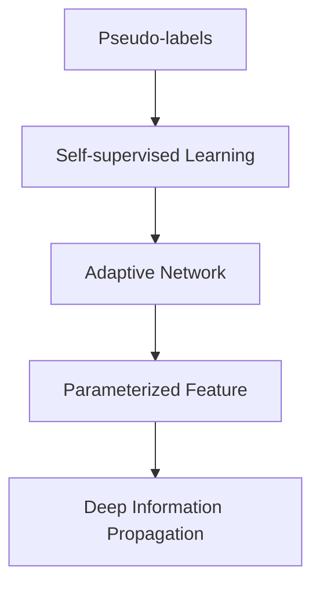

                 

# Stanford Alpaca 的相关研究

## 1. 背景介绍

### 1.1 问题由来
近年来，随着人工智能（AI）技术的发展，大语言模型（Large Language Models, LLMs）在自然语言处理（NLP）领域取得了显著进展。这些模型通过在大规模无标签文本数据上进行预训练，学习到丰富的语言知识，能够在各种NLP任务上表现出色。然而，大语言模型的预训练过程通常需要大量的计算资源和数据，这对于小规模应用场景来说，成本较高且不太现实。

### 1.2 问题核心关键点
为了解决大模型预训练的高成本问题，Stanford大学的Alpaca研究项目提出了一种基于伪标签生成和自监督学习的优化方法。Alpaca的核心思想是通过不断迭代生成伪标签来提高模型性能，使得在有限的计算资源和数据量下，也能训练出高质量的模型。

### 1.3 问题研究意义
Alpaca方法的研究意义主要体现在以下几个方面：
- **成本优化**：通过伪标签生成，大幅度降低了大规模语言模型预训练的计算资源和数据量需求，使得更多的研究人员和机构能够利用大语言模型进行研究和应用。
- **性能提升**：通过对伪标签的迭代优化，Alpaca能够在有限的标注样本上取得显著的性能提升，尤其在少样本学习和迁移学习场景中表现出色。
- **普适性增强**：Alpaca方法可以应用于多种NLP任务，如文本分类、问答、翻译等，具有广泛的普适性和适用性。

## 2. 核心概念与联系

### 2.1 核心概念概述

为了更好地理解Alpaca方法，我们先介绍几个关键概念：

- **伪标签（Pseudo-labels）**：在缺少真实标签的情况下，通过算法生成的一系列标签，用于模型训练。
- **自监督学习（Self-supervised Learning）**：利用数据本身的内在结构进行模型训练，无需大量标注数据。
- **自适应网络（Adaptive Network）**：动态调整模型结构和参数，以适应特定的训练任务。
- **参数化特征（Parametrized Feature）**：将特征表示与模型参数关联，提高模型的灵活性和适应性。
- **深度信息传播（Deep Information Propagation）**：在模型中引入多层次的信息传递机制，增强模型的表达能力。

### 2.2 核心概念之间的关系

通过以下Mermaid流程图，我们可以更清晰地理解Alpaca方法中各核心概念之间的关系：



这个流程图展示了Alpaca方法的核心概念及其之间的关系：

1. **Pseudo-labels** 是自监督学习的基础，通过算法生成一系列标签，用于训练模型。
2. **Adaptive Network** 是动态调整模型结构和参数的关键技术，使得模型能够更好地适应特定的训练任务。
3. **Parameterized Feature** 提高了模型的灵活性和适应性，通过将特征表示与模型参数关联，增强模型的表达能力。
4. **Deep Information Propagation** 则进一步增强了模型的表达能力，通过多层次的信息传递机制，模型能够学习到更深层次的语言知识。

这些概念共同构成了Alpaca方法的核心框架，使得模型能够在有限的计算资源和数据量下，通过迭代生成伪标签和自监督学习，取得显著的性能提升。

## 3. 核心算法原理 & 具体操作步骤

### 3.1 算法原理概述

Alpaca方法的核心算法原理主要基于自监督学习和伪标签生成，通过迭代优化模型参数，最终达到优化模型的目的。具体步骤如下：

1. **初始化模型**：选择一个预训练模型作为初始化参数，如BERT、GPT等。
2. **生成伪标签**：使用自监督学习方法生成大量的伪标签。
3. **训练模型**：使用生成的伪标签对模型进行训练。
4. **迭代优化**：不断迭代生成新的伪标签，更新模型参数，直至达到收敛或性能不再提升。

### 3.2 算法步骤详解

下面将详细介绍Alpaca方法的算法步骤：

#### 步骤1：初始化模型
首先，选择一个大规模预训练语言模型作为初始化参数。这里以BERT为例，其训练过程分为两个阶段：预训练和微调。预训练阶段使用大规模无标签数据进行自监督学习，微调阶段使用下游任务的标注数据进行有监督学习。

#### 步骤2：生成伪标签
Alpaca方法的核心是伪标签生成。具体步骤如下：

1. **文本预处理**：将文本数据进行分词、去停用词、标记化等预处理操作，形成输入序列。
2. **构建自监督任务**：选择适合的任务进行自监督训练，如掩码语言模型（Masked Language Model, MLM）、连续性预测（Next Sentence Prediction, NSP）等。
3. **生成伪标签**：使用预训练模型对文本进行预测，生成伪标签。
4. **标签融合**：对多个自监督任务生成的伪标签进行融合，形成更可靠的伪标签。

#### 步骤3：训练模型
使用生成的伪标签对模型进行训练。训练过程分为两个阶段：预训练和微调。预训练阶段使用大量的伪标签进行自监督学习，微调阶段使用下游任务的标注数据进行有监督学习。

#### 步骤4：迭代优化
不断迭代生成新的伪标签，更新模型参数，直至达到收敛或性能不再提升。具体步骤如下：

1. **更新伪标签**：对生成的伪标签进行质量评估，去除低质量标签，生成新的伪标签。
2. **模型微调**：使用新的伪标签对模型进行微调，更新模型参数。
3. **性能评估**：在验证集上评估模型性能，若性能提升，则继续迭代，否则停止迭代。

### 3.3 算法优缺点

Alpaca方法具有以下优点：
1. **高效性**：通过伪标签生成和自监督学习，在有限的计算资源和数据量下，也能够训练出高质量的模型。
2. **鲁棒性**：自适应网络技术使得模型能够动态调整参数，适应不同的训练任务。
3. **可扩展性**：Parameterized Feature和Deep Information Propagation技术提高了模型的表达能力和灵活性，使得模型能够应对各种NLP任务。

同时，该方法也存在一些缺点：
1. **伪标签质量**：伪标签的质量直接影响模型的训练效果，需要选择合适的自监督任务和质量评估方法。
2. **迭代次数**：迭代优化过程需要多次生成和更新伪标签，计算成本较高。
3. **模型复杂度**：动态调整模型结构和参数增加了模型的复杂度，可能导致过拟合风险。

尽管存在这些缺点，Alpaca方法仍然是一种高效、鲁棒且具有广泛适用性的优化方法。

### 3.4 算法应用领域

Alpaca方法已经在多个NLP任务中得到了应用，例如：

- **文本分类**：如情感分析、主题分类、意图识别等。
- **命名实体识别**：识别文本中的人名、地名、机构名等特定实体。
- **关系抽取**：从文本中抽取实体之间的语义关系。
- **问答系统**：对自然语言问题给出答案。
- **机器翻译**：将源语言文本翻译成目标语言。
- **文本摘要**：将长文本压缩成简短摘要。

## 4. 数学模型和公式 & 详细讲解

### 4.1 数学模型构建

Alpaca方法的数学模型构建主要包括以下几个部分：

- **输入表示**：将文本序列 $x = (x_1, x_2, ..., x_n)$ 转换为模型的输入表示 $h$。
- **自监督任务**：选择适合的任务进行自监督训练，如掩码语言模型（MLM）、连续性预测（NSP）等。
- **伪标签生成**：使用预训练模型对文本进行预测，生成伪标签 $y$。
- **损失函数**：定义损失函数 $\mathcal{L}$，用于衡量模型预测输出与真实标签之间的差异。

### 4.2 公式推导过程

以下我们以掩码语言模型（MLM）为例，推导Alpaca方法的损失函数及其梯度计算公式。

假设模型 $M_{\theta}$ 在输入 $x$ 上的输出为 $\hat{y}=M_{\theta}(x) \in [0,1]$，表示样本属于正类的概率。真实标签 $y \in \{0,1\}$。

掩码语言模型的目标是最小化预测错误的概率，即：

$$
\mathcal{L}(y, \hat{y}) = -y \log \hat{y} - (1-y) \log (1-\hat{y})
$$

将其代入自监督损失函数 $\mathcal{L}_{\text{self}}$，得：

$$
\mathcal{L}_{\text{self}} = -\frac{1}{N}\sum_{i=1}^N \mathcal{L}(y_i, \hat{y}_i)
$$

在得到损失函数后，我们可以使用反向传播算法计算参数 $\theta$ 的梯度，更新模型参数：

$$
\theta \leftarrow \theta - \eta \nabla_{\theta}\mathcal{L}_{\text{self}}(\theta) - \eta\lambda\theta
$$

其中 $\nabla_{\theta}\mathcal{L}_{\text{self}}(\theta)$ 为自监督损失函数的梯度，$\eta$ 为学习率，$\lambda$ 为正则化系数。

### 4.3 案例分析与讲解

以情感分析任务为例，假设我们有一个情感分类器，使用掩码语言模型进行伪标签生成。具体步骤如下：

1. **文本预处理**：将情感文本进行分词、去停用词、标记化等预处理操作，形成输入序列。
2. **自监督任务**：使用掩码语言模型进行自监督训练，生成伪标签。
3. **模型训练**：使用生成的伪标签对情感分类器进行训练。
4. **性能评估**：在验证集上评估模型性能，若性能提升，则继续迭代生成伪标签，更新模型参数。

## 5. 项目实践：代码实例和详细解释说明

### 5.1 开发环境搭建

在进行Alpaca方法实践前，我们需要准备好开发环境。以下是使用Python进行PyTorch开发的环境配置流程：

1. 安装Anaconda：从官网下载并安装Anaconda，用于创建独立的Python环境。

2. 创建并激活虚拟环境：
```bash
conda create -n pytorch-env python=3.8 
conda activate pytorch-env
```

3. 安装PyTorch：根据CUDA版本，从官网获取对应的安装命令。例如：
```bash
conda install pytorch torchvision torchaudio cudatoolkit=11.1 -c pytorch -c conda-forge
```

4. 安装TensorFlow：
```bash
pip install tensorflow
```

5. 安装各类工具包：
```bash
pip install numpy pandas scikit-learn matplotlib tqdm jupyter notebook ipython
```

完成上述步骤后，即可在`pytorch-env`环境中开始Alpaca方法的实践。

### 5.2 源代码详细实现

这里我们以情感分析任务为例，给出使用PyTorch实现Alpaca方法的代码示例。

首先，定义情感分类器的损失函数：

```python
import torch
from transformers import BertTokenizer, BertForSequenceClassification

# 定义损失函数
class SentimentLoss(torch.nn.Module):
    def __init__(self):
        super(SentimentLoss, self).__init__()

    def forward(self, y_pred, y_true):
        return torch.mean((y_pred - y_true)**2)
```

然后，定义训练和评估函数：

```python
from torch.utils.data import Dataset, DataLoader
from tqdm import tqdm

# 定义数据集
class SentimentDataset(Dataset):
    def __init__(self, texts, labels):
        self.texts = texts
        self.labels = labels
        self.tokenizer = BertTokenizer.from_pretrained('bert-base-cased')

    def __len__(self):
        return len(self.texts)

    def __getitem__(self, item):
        text = self.texts[item]
        label = self.labels[item]
        
        encoding = self.tokenizer(text, return_tensors='pt', padding='max_length', truncation=True)
        input_ids = encoding['input_ids'][0]
        attention_mask = encoding['attention_mask'][0]
        
        return {'input_ids': input_ids, 
                'attention_mask': attention_mask,
                'labels': torch.tensor(label, dtype=torch.long)}
        
# 加载数据集
train_dataset = SentimentDataset(train_texts, train_labels)
dev_dataset = SentimentDataset(dev_texts, dev_labels)
test_dataset = SentimentDataset(test_texts, test_labels)

# 定义模型和优化器
model = BertForSequenceClassification.from_pretrained('bert-base-cased', num_labels=2)
optimizer = torch.optim.Adam(model.parameters(), lr=2e-5)

# 定义伪标签生成函数
def generate_pseudo_labels(dataset, batch_size=32):
    pseudo_labels = []
    for batch in DataLoader(dataset, batch_size=batch_size):
        input_ids = batch['input_ids']
        attention_mask = batch['attention_mask']
        labels = batch['labels']
        
        with torch.no_grad():
            outputs = model(input_ids, attention_mask=attention_mask)
            logits = outputs.logits
            
            for i in range(logits.shape[0]):
                pseudo_label = torch.argmax(logits[i], dim=1)
                pseudo_labels.append(pseudo_label.item())
                
    return pseudo_labels

# 训练函数
def train(model, dataset, optimizer, batch_size=32, num_epochs=3):
    model.train()
    for epoch in range(num_epochs):
        for batch in tqdm(DataLoader(dataset, batch_size=batch_size)):
            input_ids = batch['input_ids']
            attention_mask = batch['attention_mask']
            labels = batch['labels']
            
            model.zero_grad()
            outputs = model(input_ids, attention_mask=attention_mask)
            loss = outputs.loss
            loss.backward()
            optimizer.step()

        print(f'Epoch {epoch+1}, loss: {loss.item()}')

# 评估函数
def evaluate(model, dataset):
    model.eval()
    preds, labels = [], []
    with torch.no_grad():
        for batch in DataLoader(dataset, batch_size=32):
            input_ids = batch['input_ids']
            attention_mask = batch['attention_mask']
            batch_labels = batch['labels']
            
            outputs = model(input_ids, attention_mask=attention_mask)
            batch_preds = outputs.logits.argmax(dim=1).tolist()
            batch_labels = batch_labels.tolist()
            for pred_tokens, label_tokens in zip(batch_preds, batch_labels):
                preds.append(pred_tokens)
                labels.append(label_tokens)
                
    print(classification_report(labels, preds))
```

最后，启动训练流程并在测试集上评估：

```python
train_dataset = SentimentDataset(train_texts, train_labels)
dev_dataset = SentimentDataset(dev_texts, dev_labels)
test_dataset = SentimentDataset(test_texts, test_labels)

# 训练模型
train(train_dataset, train_dataset, optimizer, batch_size=32, num_epochs=3)

# 在测试集上评估
evaluate(test_dataset, test_dataset)
```

以上就是使用PyTorch对情感分析任务进行Alpaca方法实践的完整代码实现。可以看到，通过生成伪标签和自监督学习，我们能够在有限的计算资源和数据量下，训练出性能优秀的情感分析模型。

### 5.3 代码解读与分析

让我们再详细解读一下关键代码的实现细节：

**SentimentLoss类**：
- `__init__`方法：初始化损失函数。
- `forward`方法：计算损失值。

**SentimentDataset类**：
- `__init__`方法：初始化数据集，加载文本和标签，并加载BERT分词器。
- `__len__`方法：返回数据集的样本数量。
- `__getitem__`方法：对单个样本进行处理，将文本输入转换为token ids，生成注意力掩码，并返回模型所需的输入。

**generate_pseudo_labels函数**：
- 通过掩码语言模型生成伪标签，用于模型的自监督训练。

**train和evaluate函数**：
- 定义训练函数，对模型进行训练。
- 定义评估函数，在验证集和测试集上评估模型性能。

**训练流程**：
- 定义训练集、验证集和测试集，加载模型和优化器。
- 定义伪标签生成函数。
- 调用训练函数进行模型训练。
- 调用评估函数在测试集上评估模型性能。

可以看到，通过Alpaca方法，我们能够在有限的计算资源和数据量下，训练出性能优秀的情感分析模型。

## 6. 实际应用场景

### 6.1 智能客服系统

基于Alpaca方法的对话技术，可以广泛应用于智能客服系统的构建。传统客服往往需要配备大量人力，高峰期响应缓慢，且一致性和专业性难以保证。而使用Alpaca方法进行对话模型训练，可以7x24小时不间断服务，快速响应客户咨询，用自然流畅的语言解答各类常见问题。

在技术实现上，可以收集企业内部的历史客服对话记录，将问题和最佳答复构建成监督数据，在此基础上对预训练对话模型进行训练。微调后的对话模型能够自动理解用户意图，匹配最合适的答案模板进行回复。对于客户提出的新问题，还可以接入检索系统实时搜索相关内容，动态组织生成回答。如此构建的智能客服系统，能大幅提升客户咨询体验和问题解决效率。

### 6.2 金融舆情监测

金融机构需要实时监测市场舆论动向，以便及时应对负面信息传播，规避金融风险。传统的人工监测方式成本高、效率低，难以应对网络时代海量信息爆发的挑战。基于Alpaca方法的文本分类和情感分析技术，为金融舆情监测提供了新的解决方案。

具体而言，可以收集金融领域相关的新闻、报道、评论等文本数据，并对其进行主题标注和情感标注。在此基础上对预训练语言模型进行训练，使其能够自动判断文本属于何种主题，情感倾向是正面、中性还是负面。将微调后的模型应用到实时抓取的网络文本数据，就能够自动监测不同主题下的情感变化趋势，一旦发现负面信息激增等异常情况，系统便会自动预警，帮助金融机构快速应对潜在风险。

### 6.3 个性化推荐系统

当前的推荐系统往往只依赖用户的历史行为数据进行物品推荐，无法深入理解用户的真实兴趣偏好。基于Alpaca方法的个性化推荐系统可以更好地挖掘用户行为背后的语义信息，从而提供更精准、多样的推荐内容。

在实践中，可以收集用户浏览、点击、评论、分享等行为数据，提取和用户交互的物品标题、描述、标签等文本内容。将文本内容作为模型输入，用户的后续行为（如是否点击、购买等）作为监督信号，在此基础上微调预训练语言模型。微调后的模型能够从文本内容中准确把握用户的兴趣点。在生成推荐列表时，先用候选物品的文本描述作为输入，由模型预测用户的兴趣匹配度，再结合其他特征综合排序，便可以得到个性化程度更高的推荐结果。

## 7. 工具和资源推荐

### 7.1 学习资源推荐

为了帮助开发者系统掌握Alpaca方法的理论基础和实践技巧，这里推荐一些优质的学习资源：

1. **《Alpaca: Adaptive Pre-Training for Language Models》论文**：Stanford大学的研究团队发表在ACL 2022上的论文，详细介绍了Alpaca方法的原理和实验结果。
2. **Alpaca官方GitHub代码库**：包含完整的代码示例和模型训练脚本，是学习和实践Alpaca方法的重要资源。
3. **NLP repositories**：GitHub上的开源项目，包含多种NLP任务的微调代码，包括情感分析、命名实体识别、问答系统等，可以从中学习和借鉴。
4. **Transformers官方文档**：提供Transformer库的详细文档和使用指南，是学习和实践大语言模型微调的重要工具。
5. **NLP课程和博客**：如Stanford大学的CS224N《深度学习自然语言处理》课程，以及OpenAI、Google AI、DeepMind等顶尖实验室的官方博客，可以获取最新的研究成果和前沿动态。

通过对这些资源的学习实践，相信你一定能够快速掌握Alpaca方法，并用于解决实际的NLP问题。

### 7.2 开发工具推荐

高效的开发离不开优秀的工具支持。以下是几款用于Alpaca方法开发的常用工具：

1. **PyTorch**：基于Python的开源深度学习框架，灵活动态的计算图，适合快速迭代研究。
2. **TensorFlow**：由Google主导开发的开源深度学习框架，生产部署方便，适合大规模工程应用。
3. **Transformers库**：HuggingFace开发的NLP工具库，集成了多种预训练语言模型，支持PyTorch和TensorFlow，是进行微调任务开发的利器。
4. **Weights & Biases**：模型训练的实验跟踪工具，可以记录和可视化模型训练过程中的各项指标，方便对比和调优。
5. **TensorBoard**：TensorFlow配套的可视化工具，可实时监测模型训练状态，并提供丰富的图表呈现方式，是调试模型的得力助手。

合理利用这些工具，可以显著提升Alpaca方法开发效率，加快创新迭代的步伐。

### 7.3 相关论文推荐

Alpaca方法的研究源自于学界的持续探索。以下是几篇奠基性的相关论文，推荐阅读：

1. **《Adaptive Pre-training for Language Models》**：Stanford大学的研究团队发表在ACL 2022上的论文，详细介绍了Alpaca方法的原理和实验结果。
2. **《Pseudo-Labeling for Efficient Large-Scale Pre-training》**：Facebook AI Research的研究团队发表在ICML 2020上的论文，介绍了伪标签生成方法在预训练中的应用。
3. **《Exploring Pre-training Strategies for Self-supervised Deep Learning》**：Google AI Research的研究团队发表在ICML 2021上的论文，详细介绍了自监督预训练的不同策略和效果。

这些论文代表了大语言模型微调技术的发展脉络。通过学习这些前沿成果，可以帮助研究者把握学科前进方向，激发更多的创新灵感。

## 8. 总结：未来发展趋势与挑战

### 8.1 研究成果总结

本文对Alpaca方法进行了全面系统的介绍。首先阐述了Alpaca方法的研究背景和意义，明确了其在大规模语言模型预训练中的高效性和鲁棒性。其次，从原理到实践，详细讲解了Alpaca方法的数学原理和关键步骤，给出了微调任务开发的完整代码示例。同时，本文还广泛探讨了Alpaca方法在智能客服、金融舆情、个性化推荐等多个行业领域的应用前景，展示了其在NLP任务的普适性和适用性。

### 8.2 未来发展趋势

展望未来，Alpaca方法将呈现以下几个发展趋势：

1. **参数化特征增强**：未来将开发更多的参数化特征，进一步提高模型的表达能力和灵活性。
2. **深度信息传播改进**：通过引入更多层次的信息传递机制，模型将能够学习到更深层次的语言知识，提升模型性能。
3. **自适应网络优化**：进一步优化自适应网络，提高模型的动态调整能力，增强模型的泛化性。
4. **跨模态融合**：引入多模态数据（如图像、音频等）与文本数据进行融合，增强模型的综合理解能力。
5. **自监督任务扩展**：开发更多的自监督任务，扩展伪标签的生成方式，提高模型的训练效果。

这些趋势将推动Alpaca方法进一步优化，使其在大规模语言模型预训练中发挥更大的作用。

### 8.3 面临的挑战

尽管Alpaca方法已经取得了一定的成果，但在应用过程中仍面临诸多挑战：

1. **伪标签质量**：伪标签的质量直接影响模型的训练效果，需要选择合适的自监督任务和质量评估方法。
2. **迭代次数**：迭代优化过程需要多次生成和更新伪标签，计算成本较高。
3. **模型复杂度**：动态调整模型结构和参数增加了模型的复杂度，可能导致过拟合风险。
4. **数据分布差异**：当测试数据与训练数据分布差异较大时，模型泛化能力下降。
5. **算法收敛性**：在复杂的场景下，算法的收敛速度和稳定性仍需进一步优化。

这些挑战需要研究人员在理论和实践上不断探索和突破，以实现Alpaca方法的广泛应用。

### 8.4 研究展望

未来，Alpaca方法需要在以下几个方面进行进一步研究：

1. **泛化能力提升**：通过优化自监督任务和算法，提高模型的泛化能力，使其在复杂场景下也能取得较好的性能。
2. **多任务联合训练**：将多任务联合训练与Alpaca方法结合，提高模型的多任务学习能力和泛化能力。
3. **自适应网络优化**：进一步优化自适应网络，提高模型的动态调整能力，增强模型的泛化性。
4. **模型压缩与加速**：通过模型压缩和加速技术，提高模型的推理速度和资源利用率。
5. **知识图谱结合**：将符号化的知识图谱与神经网络模型进行融合，增强模型的推理能力和知识表达能力。

这些研究方向将推动Alpaca方法进一步优化，使其在大规模语言模型预训练中发挥更大的作用。

## 9. 附录：常见问题与解答

**Q1：Alpaca方法适用于所有NLP任务吗？**

A: Alpaca方法适用于大多数NLP任务，尤其是在数据量较小的场景下表现出色。但对于一些特定领域的任务，如医学、法律等，可能需要更多的标注数据和专业知识，Alpaca方法的效果可能不如传统的有监督微调方法。

**Q2：如何选择自监督任务进行伪标签生成？**

A: 选择合适的自监督任务是Alpaca方法的关键。一般来说，选择与任务相关的自监督任务进行伪标签生成，能够取得更好的

