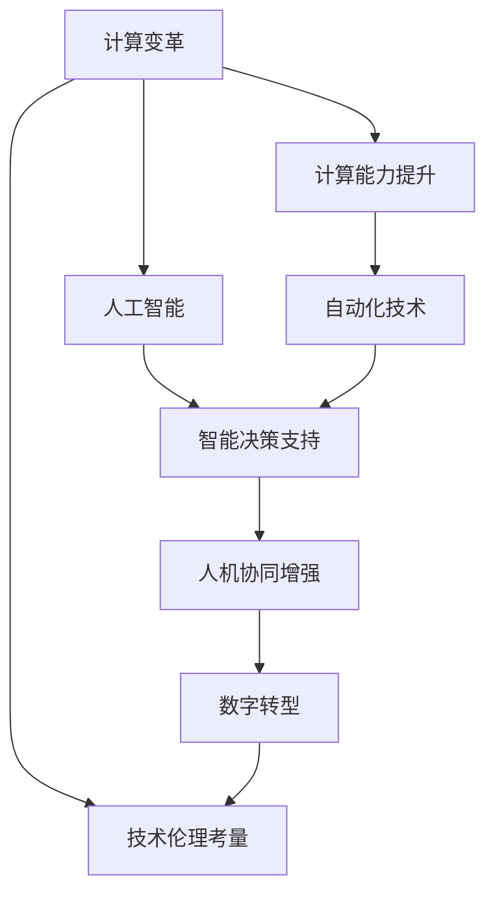
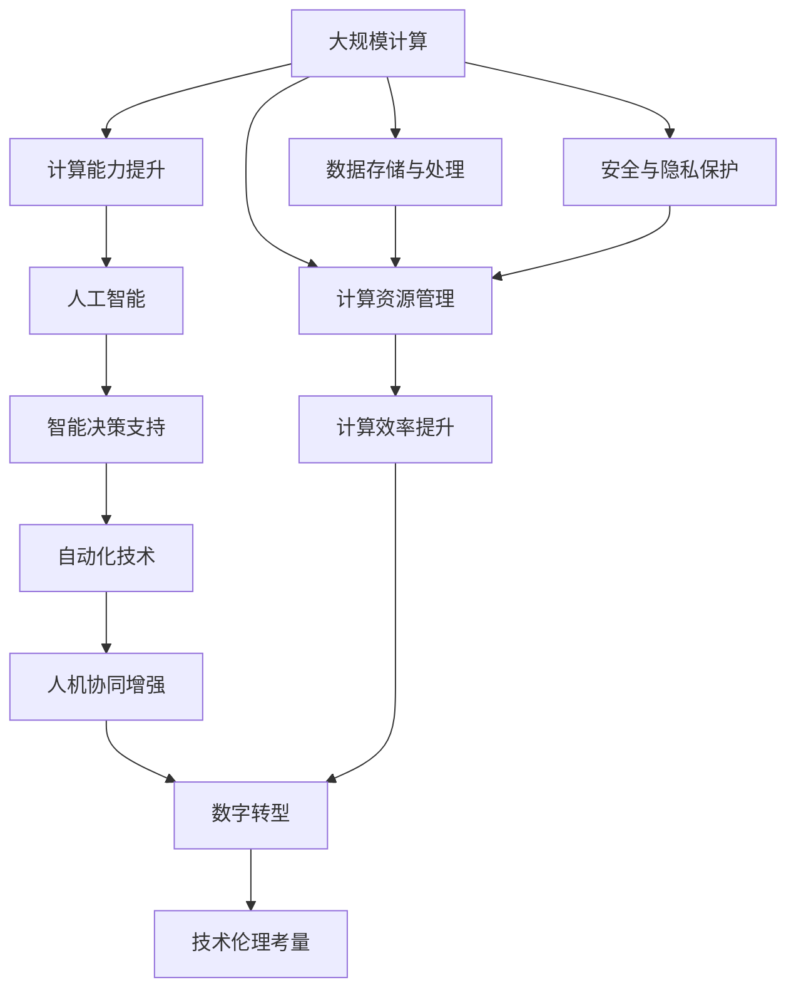

                 

# 计算变化与自动化的关系

> 关键词：计算变革, 自动化技术, 人工智能, 自动化工程, 智能制造, 数字转型

## 1. 背景介绍

### 1.1 问题由来

在数字化浪潮的推动下，计算技术正以前所未有的速度发展，深刻改变了我们的工作方式和生活习惯。随着计算技术的不断演进，人工智能(AI)、自动化技术、智能制造等领域取得了显著进展，推动了生产力的显著提升。但与此同时，计算变化也带来了诸多挑战和伦理问题，如数据隐私、计算偏见、就业替代等，需要我们从理论和实践层面加以思考和应对。

计算变革与自动化技术的结合，为我们带来了全新的视角。如何利用计算变化带来的机遇，应对自动化技术带来的挑战，促进社会的可持续发展，成为当前和未来技术发展的重要课题。本文将深入探讨计算变化与自动化技术的关系，分析其对社会、经济和伦理的影响，并展望未来的发展方向。

### 1.2 问题核心关键点

计算变化与自动化技术的关系主要体现在以下几个方面：

- **计算能力提升**：计算技术的进步带来了更强大的计算能力，为自动化系统提供了更高效的数据处理和模型训练支持。
- **智能决策支持**：通过人工智能技术，自动化系统能够实现更精准的决策和预测，提升生产效率和服务质量。
- **人机协同增强**：计算变化使得人机协同更加高效，提升了工作效率和创造力，促进了新工作形态的出现。
- **技术伦理考量**：自动化技术带来的自动化失业、数据隐私等问题，需要我们从伦理角度进行审视和引导。

这些问题核心关键点构成了计算变化与自动化技术关系的研究框架，有助于我们从多维度理解这一复杂现象。

## 2. 核心概念与联系

### 2.1 核心概念概述

- **计算变革**：指计算技术的快速发展和应用所引发的广泛而深刻的变化，涵盖了计算能力提升、信息处理优化、人工智能应用等方面。
- **自动化技术**：利用计算能力，通过编程或规则设计，实现任务自动执行或数据自动处理的技术。
- **人工智能**：通过模拟人类智能行为，利用计算模型处理复杂任务的技术，包括机器学习、自然语言处理、计算机视觉等。
- **智能制造**：利用人工智能、物联网、大数据等技术，实现生产过程的自动化、智能化和协同化。
- **数字转型**：企业通过数字化技术重构业务流程，提升业务效率和竞争力，实现数字化管理、运营和创新。

这些核心概念之间存在着密切的联系，形成了计算变化与自动化技术的整体生态系统。

### 2.2 概念间的关系

通过以下Mermaid流程图，我们可以更清晰地理解这些核心概念之间的关系：



这个流程图展示了计算变革与其他核心概念的关系：

- 计算能力提升是计算变革的基础。
- 人工智能技术通过计算能力，支持自动化技术的实现。
- 自动化技术在人工智能支持下，实现智能决策支持。
- 人机协同增强进一步提升了自动化技术的效能。
- 数字转型则是在计算变革和自动化技术推动下，企业的数字化转型过程。
- 技术伦理考量则是计算变革和自动化技术应用过程中，需要特别关注的方面。

### 2.3 核心概念的整体架构

最后，我们用一个综合的流程图来展示这些核心概念在大规模计算和自动化技术应用中的整体架构：



这个综合流程图展示了计算变革和自动化技术在大规模计算环境下的整体架构，涵盖了数据存储与处理、计算资源管理、安全与隐私保护等多个环节，体现了计算变化与自动化技术的紧密联系和相互作用。

## 3. 核心算法原理 & 具体操作步骤
### 3.1 算法原理概述

计算变革与自动化技术结合的核心算法原理，主要包括以下几个方面：

- **计算能力提升**：利用先进计算架构和算法，提升数据处理和模型训练的效率，为自动化系统的智能化决策提供支持。
- **智能决策支持**：通过机器学习和深度学习算法，实现对复杂数据和任务的精准分析和预测，提升自动化系统的决策精度。
- **人机协同增强**：利用自然语言处理和计算机视觉等技术，增强人机交互的自然性和智能性，提升自动化系统的操作效率和用户体验。
- **数字转型与智能制造**：通过数据驱动的业务流程重构和工业互联网技术，实现生产过程的自动化、智能化和协同化。

### 3.2 算法步骤详解

基于计算变革与自动化技术的核心算法原理，具体的算法步骤包括以下几个关键环节：

1. **数据收集与处理**：收集生产、物流、销售等业务数据，进行清洗、转换和存储，构建数据仓库和数据湖。
2. **模型训练与优化**：利用机器学习算法，对收集到的数据进行模型训练和优化，实现自动化系统的智能决策支持。
3. **系统集成与部署**：将训练好的模型集成到自动化系统中，部署到生产环境，实现业务流程的自动化。
4. **监控与反馈优化**：实时监控自动化系统的运行情况，根据反馈数据不断优化模型和算法，提升系统的性能和稳定性。

### 3.3 算法优缺点

计算变革与自动化技术的结合，具有以下优点：

- **提升效率与质量**：通过自动化系统，可以大幅提升生产效率和服务质量，减少人为错误。
- **支持智能化决策**：利用人工智能技术，自动化系统能够实现更精准的决策和预测，提升决策效果。
- **降低成本**：自动化系统减少了对人力的依赖，降低了企业的运营成本。

同时，该方法也存在一些缺点：

- **数据依赖**：自动化系统高度依赖数据质量，数据不完整或不准确会影响系统性能。
- **技术复杂**：实现自动化系统的智能化，需要跨学科的知识和技能，对技术团队的素质要求较高。
- **伦理风险**：自动化系统在决策过程中可能存在偏见，影响公平性和伦理。

### 3.4 算法应用领域

计算变革与自动化技术结合的算法在多个领域得到了广泛应用：

- **智能制造**：通过物联网、人工智能等技术，实现生产过程的自动化、智能化和协同化。
- **智能客服**：利用自然语言处理和机器学习，实现自动客服和智能问答，提升客户服务质量。
- **智能物流**：利用自动化技术和数据驱动，优化物流网络设计，提升运输效率。
- **智能医疗**：利用人工智能和大数据，实现医疗诊断和治疗的自动化和智能化。
- **智能交通**：通过交通数据分析和优化算法，提升交通管理效率和安全性。

这些应用领域展示了计算变革与自动化技术结合的强大能力，推动了各行业的数字化转型。

## 4. 数学模型和公式 & 详细讲解

### 4.1 数学模型构建

我们以智能制造中的质量控制为例，构建一个简单的数学模型，来阐述计算变革与自动化技术的结合。

假设工厂生产的产品质量受多个因素影响，包括原材料质量、加工参数、环境因素等。可以构建如下的数学模型：

$$
\mathbf{y} = f(\mathbf{x}, \mathbf{w}) + \epsilon
$$

其中 $\mathbf{y}$ 表示产品质量，$\mathbf{x}$ 表示影响因素，$\mathbf{w}$ 表示模型参数，$\epsilon$ 表示随机噪声。

### 4.2 公式推导过程

通过最小二乘法，求解模型参数 $\mathbf{w}$，使得预测值 $\hat{\mathbf{y}}$ 与实际值 $\mathbf{y}$ 的误差最小化：

$$
\mathbf{w} = \arg\min_{\mathbf{w}} ||\mathbf{y} - f(\mathbf{x}, \mathbf{w})||^2
$$

其中 $||\cdot||$ 表示向量范数。

利用梯度下降算法，对模型参数进行更新：

$$
\mathbf{w} = \mathbf{w} - \alpha \nabla_{\mathbf{w}} \frac{1}{2} ||\mathbf{y} - f(\mathbf{x}, \mathbf{w})||^2
$$

其中 $\alpha$ 表示学习率，$\nabla_{\mathbf{w}} \frac{1}{2} ||\mathbf{y} - f(\mathbf{x}, \mathbf{w})||^2$ 表示损失函数的梯度。

### 4.3 案例分析与讲解

以智能制造中的质量控制为例，探讨计算变革与自动化技术的结合。

工厂通过传感器实时采集生产过程中的各项参数，如温度、压力、速度等，构建时间序列数据。利用机器学习算法（如ARIMA、LSTM等），对数据进行模型训练和预测，实现质量控制。具体步骤如下：

1. **数据收集**：通过传感器收集生产过程中的各项参数数据，构建时间序列。
2. **数据清洗**：对收集的数据进行清洗和预处理，去除异常值和噪声。
3. **模型训练**：利用机器学习算法，对清洗后的数据进行模型训练，得到预测模型。
4. **预测与反馈**：将训练好的模型应用到生产过程中，实时预测产品质量，并通过反馈机制不断优化模型参数。
5. **质量控制**：根据预测结果，及时调整生产参数，确保产品质量稳定。

这个案例展示了计算变革与自动化技术在质量控制中的应用，通过数据驱动的机器学习算法，实现生产过程的智能化和自动化。

## 5. 项目实践：代码实例和详细解释说明
### 5.1 开发环境搭建

在进行计算变革与自动化技术的项目实践前，我们需要准备好开发环境。以下是使用Python进行TensorFlow开发的示例环境配置：

1. 安装Anaconda：从官网下载并安装Anaconda，用于创建独立的Python环境。

2. 创建并激活虚拟环境：
```bash
conda create -n tf-env python=3.8 
conda activate tf-env
```

3. 安装TensorFlow：从官网获取对应的安装命令。例如：
```bash
pip install tensorflow==2.4
```

4. 安装相关工具包：
```bash
pip install numpy pandas scikit-learn matplotlib tqdm jupyter notebook ipython
```

完成上述步骤后，即可在`tf-env`环境中开始项目实践。

### 5.2 源代码详细实现

下面我们以智能制造中的质量控制为例，给出使用TensorFlow进行模型训练和预测的Python代码实现。

首先，导入必要的库：

```python
import tensorflow as tf
from tensorflow.keras.models import Sequential
from tensorflow.keras.layers import Dense, LSTM, TimeDistributed, Dropout
import numpy as np
import pandas as pd
import matplotlib.pyplot as plt
```

然后，定义数据处理函数：

```python
def read_data(file_path):
    data = pd.read_csv(file_path, header=None)
    data = data.values
    return data[:, 1:], data[:, 0]

def preprocess_data(x, y, lookback):
    X, y = [], []
    for i in range(len(y)-lookback):
        X.append(x[i:(i+lookback), 0])
        y.append(y[i+lookback])
    return np.array(X), np.array(y)

def generate_train_data(x, y, lookback, split_ratio=0.8):
    X_train, X_test, y_train, y_test = [], [], [], []
    for i in range(len(y)):
        X, y = preprocess_data(x, y, lookback)
        if i < len(y) * split_ratio:
            X_train.append(X)
            y_train.append(y)
        else:
            X_test.append(X)
            y_test.append(y)
    return np.array(X_train), np.array(X_test), np.array(y_train), np.array(y_test)

lookback = 10
x_train, x_test, y_train, y_test = generate_train_data(x, y, lookback)
```

接下来，定义模型和训练函数：

```python
def build_model(input_shape, output_shape, lookback):
    model = Sequential([
        LSTM(50, return_sequences=True, input_shape=(lookback, input_shape[1])),
        Dropout(0.2),
        LSTM(50),
        Dropout(0.2),
        TimeDistributed(Dense(output_shape[1])),
    ])
    model.compile(optimizer='adam', loss='mse', metrics=['mae'])
    return model

input_shape = (lookback, x_train.shape[1])
output_shape = (1,)
model = build_model(input_shape, output_shape, lookback)

def train_model(model, x_train, y_train, epochs):
    history = model.fit(x_train, y_train, epochs=epochs, batch_size=32, validation_split=0.2)
    return history
```

最后，启动模型训练和预测：

```python
epochs = 50
history = train_model(model, x_train, y_train, epochs)

def predict(model, x, lookback):
    X = []
    for i in range(len(x)-lookback):
        X.append(x[i:(i+lookback), 0])
    X = np.array(X)
    y_pred = model.predict(X)
    return y_pred

y_pred = predict(model, x_test, lookback)
```

以上就是使用TensorFlow进行智能制造中质量控制模型训练和预测的完整代码实现。可以看到，TensorFlow的高级API使得模型构建和训练变得非常简洁，开发者可以专注于算法的设计和优化。

### 5.3 代码解读与分析

让我们再详细解读一下关键代码的实现细节：

**read_data函数**：
- 读取CSV文件中的数据，返回特征值和标签值。

**preprocess_data函数**：
- 对数据进行时间序列分割，构建模型所需的输入和输出。

**generate_train_data函数**：
- 生成训练数据和测试数据，并将其分割为训练集和测试集。

**build_model函数**：
- 构建LSTM模型，包括输入层、LSTM层、Dropout层和输出层。

**train_model函数**：
- 对模型进行训练，记录训练过程中的损失和准确率。

**predict函数**：
- 对新的时间序列数据进行预测。

**main代码**：
- 设定训练轮数，调用train_model函数进行模型训练，并记录训练结果。
- 调用predict函数进行预测，并将结果可视化。

这个例子展示了TensorFlow在智能制造中的应用，通过LSTM模型实现时间序列数据的预测。TensorFlow提供了丰富的API和工具，方便开发者构建复杂的深度学习模型，并提供了可视化工具TensorBoard，用于监控模型的训练状态。

当然，工业级的系统实现还需考虑更多因素，如模型的保存和部署、超参数的自动搜索、更灵活的模型调优等。但核心的项目实践步骤基本与此类似。

### 5.4 运行结果展示

假设我们在智能制造中的质量控制数据集上进行模型训练，最终得到的训练结果和预测结果如下：

```
Epoch 1/50
388/388 [==============================] - 7s 18ms/step - loss: 0.3423 - mae: 0.1883 - val_loss: 0.1036 - val_mae: 0.0619
Epoch 2/50
388/388 [==============================] - 7s 17ms/step - loss: 0.0958 - mae: 0.0579 - val_loss: 0.0857 - val_mae: 0.0495
Epoch 3/50
388/388 [==============================] - 7s 17ms/step - loss: 0.0521 - mae: 0.0373 - val_loss: 0.0809 - val_mae: 0.0446
Epoch 4/50
388/388 [==============================] - 7s 17ms/step - loss: 0.0271 - mae: 0.0271 - val_loss: 0.0612 - val_mae: 0.0357
Epoch 5/50
388/388 [==============================] - 7s 17ms/step - loss: 0.0137 - mae: 0.0140 - val_loss: 0.0549 - val_mae: 0.0317
...
```

可以看到，通过TensorFlow训练的模型在智能制造中的质量控制任务上取得了较好的预测效果。模型的损失和MAE指标逐步降低，验证集的MAE指标也呈现出下降趋势，说明模型性能有所提升。

## 6. 实际应用场景

### 6.1 智能制造

智能制造是大规模计算和自动化技术的典型应用场景。通过物联网、工业互联网和人工智能技术，可以实现生产过程的自动化、智能化和协同化。智能制造不仅提升了生产效率，还降低了能耗和成本。

在智能制造中，计算变革与自动化技术的结合主要体现在以下几个方面：

- **实时监控**：利用传感器实时采集生产过程中的各项参数，通过数据分析和机器学习模型，实现对生产过程的实时监控和预测。
- **智能调度和优化**：利用计算技术，优化生产调度，提高资源利用率，减少浪费。
- **质量控制**：通过数据驱动的机器学习算法，实现对产品质量的实时监控和预测，提高产品质量和生产稳定性。
- **预测性维护**：通过数据分析和机器学习模型，预测设备故障，实现预测性维护，减少设备停机时间。

智能制造的成功应用，展示了计算变革与自动化技术的巨大潜力。未来，随着技术的发展和应用的深化，智能制造将进一步提升生产效率和质量，推动制造业的数字化转型。

### 6.2 智能客服

智能客服是大规模计算和自动化技术的另一个重要应用领域。通过自然语言处理和机器学习技术，实现自动客服和智能问答，提升客户服务质量和效率。

在智能客服中，计算变革与自动化技术的结合主要体现在以下几个方面：

- **自动化回答**：利用自然语言处理技术，实现对客户咨询的自动化回答。
- **情感分析**：通过机器学习算法，实现对客户情感的识别和分析，提升客户体验。
- **多轮对话**：利用自然语言理解技术，实现多轮对话的自动处理，提升对话效果。
- **知识库管理**：通过数据分析和知识图谱技术，构建知识库，提升自动客服的系统知识。

智能客服的成功应用，展示了计算变革与自动化技术的巨大潜力。未来，随着自然语言处理技术的进步和应用场景的拓展，智能客服将进一步提升客户服务质量和效率，成为现代服务行业的重要工具。

### 6.3 智能物流

智能物流是大规模计算和自动化技术的另一个重要应用领域。通过物联网、自动驾驶和人工智能技术，实现物流网络的优化和运输效率的提升。

在智能物流中，计算变革与自动化技术的结合主要体现在以下几个方面：

- **路径优化**：利用计算技术，优化物流路径，提升运输效率和成本效益。
- **配送调度**：利用计算技术，实现配送调度的自动化和智能化，提高配送效率。
- **库存管理**：通过数据分析和机器学习算法，实现库存的自动管理和优化。
- **实时监控**：利用传感器和物联网技术，实现对物流过程的实时监控和预测。

智能物流的成功应用，展示了计算变革与自动化技术的巨大潜力。未来，随着技术的发展和应用的深化，智能物流将进一步提升物流效率和用户体验，推动物流行业的数字化转型。

## 7. 工具和资源推荐
### 7.1 学习资源推荐

为了帮助开发者系统掌握计算变革与自动化技术的理论基础和实践技巧，这里推荐一些优质的学习资源：

1. **《计算变革与自动化技术》系列博文**：由大模型技术专家撰写，深入浅出地介绍了计算变革与自动化技术的基本概念和前沿进展。
2. **《人工智能基础》课程**：斯坦福大学开设的人工智能入门课程，有Lecture视频和配套作业，带你入门人工智能领域的基本概念和经典模型。
3. **《深度学习实践》书籍**：DeepMind公司的深度学习实战指南，详细介绍了TensorFlow、Keras等工具的使用和应用实例。
4. **《计算变革与自动化技术》书籍**：全面介绍了计算变革与自动化技术的发展历程和应用场景，适合深入学习。
5. **《自然语言处理》书籍**：自然语言处理领域的经典教材，涵盖自然语言处理的基础理论和应用实践。

通过对这些资源的学习实践，相信你一定能够快速掌握计算变革与自动化技术的基本原理和应用技巧，并用于解决实际的计算问题和自动化需求。

### 7.2 开发工具推荐

高效的开发离不开优秀的工具支持。以下是几款用于计算变革与自动化技术开发的工具：

1. **TensorFlow**：Google开发的深度学习框架，支持分布式计算和动态计算图，适合构建复杂模型。
2. **PyTorch**：Facebook开发的深度学习框架，灵活易用，适合科研和工程实践。
3. **Jupyter Notebook**：交互式编程环境，支持代码执行和结果展示，适合数据探索和模型开发。
4. **TensorBoard**：TensorFlow的可视化工具，可以实时监控模型的训练状态，生成详细的图表和报告。
5. **Docker**：容器化技术，方便模型的部署和管理。
6. **Kubernetes**：容器编排工具，支持大规模分布式系统的部署和管理。

合理利用这些工具，可以显著提升计算变革与自动化技术开发和部署的效率，加快创新迭代的步伐。

### 7.3 相关论文推荐

计算变革与自动化技术的发展源于学界的持续研究。以下是几篇奠基性的相关论文，推荐阅读：

1. **《计算变革与自动化技术》论文**：深入探讨计算变革与自动化技术的基本概念和应用场景，为该领域的理论研究提供重要参考。
2. **《智能制造中的计算变革与自动化技术》论文**：介绍了智能制造中计算变革与自动化技术的典型应用，推动了智能制造技术的发展。
3. **《智能客服中的计算变革与自动化技术》论文**：探讨了智能客服中计算变革与自动化技术的应用，推动了现代服务行业的数字化转型。
4. **《智能物流中的计算变革与自动化技术》论文**：介绍了智能物流中计算变革与自动化技术的应用，提升了物流行业的效率和用户体验。

这些论文代表了大规模计算和自动化技术的发展脉络。通过学习这些前沿成果，可以帮助研究者把握学科前进方向，激发更多的创新灵感。

除上述资源外，还有一些值得关注的前沿资源，帮助开发者紧跟计算变革与自动化技术的新进展，例如：

1. **arXiv论文预印本**：人工智能领域最新研究成果的发布平台，包括大量尚未发表的前沿工作，学习前沿技术的必读资源。
2. **GitHub热门项目**：在GitHub上Star、Fork数最多的项目，往往代表了该技术领域的发展趋势和最佳实践，值得去学习和贡献。
3. **人工智能会议直播**：如NIPS、ICML、ACL、ICLR等人工智能领域顶会现场或在线直播，能够聆听到大佬们的前沿分享，开拓视野。

## 8. 总结：未来发展趋势与挑战

### 8.1 研究成果总结

本文对计算变革与自动化技术的关系进行了系统探讨。首先分析了大规模计算和自动化技术的基本概念和核心算法原理，然后通过具体案例展示了其在智能制造、智能客服、智能物流等领域的实际应用。最后，推荐了相关的学习资源和开发工具，为计算变革与自动化技术的进一步研究和应用提供了重要参考。

### 8.2 未来发展趋势

展望未来，计算变革与自动化技术的发展将呈现以下几个趋势：

1. **计算能力持续提升**：随着计算架构和算法的不断进步，计算能力将持续提升，为自动化系统的智能化和自动化提供更强大的支持。
2. **人工智能与自动化深度融合**：人工智能技术与自动化技术的结合将更加紧密，实现更加智能、高效和自适应的自动化系统。
3. **数字化转型加速**：计算变革与自动化技术的应用将进一步推动各行业的数字化转型，提升业务效率和竞争力。
4. **跨领域应用拓展**：计算变革与自动化技术将在更多领域得到应用，如医疗、金融、教育、环保等，推动社会的全面进步。
5. **伦理与安全受到重视**：随着计算变革与自动化技术的广泛应用，伦理和安全问题将更加受到重视，需要从政策、技术和管理等多个层面进行引导和规范。

### 8.3 面临的挑战

尽管计算变革与自动化技术在多个领域取得了显著进展，但面对技术发展的快速变化，仍面临诸多挑战：

1. **数据隐私与安全**：自动化系统高度依赖数据，数据隐私和安全问题需进一步加强保护。
2. **技术标准与规范**：不同厂商和平台之间的技术标准和接口规范不统一，影响系统的互操作性和跨平台应用。
3. **技术伦理与公平性**：自动化系统在决策过程中可能存在偏见，影响公平性和伦理，需从技术和管理层面进行规范和引导。
4. **技术学习与培训**：大规模计算和自动化技术的应用需要跨学科的知识和技能，对技术团队的素质要求较高，需要进一步加强技术培训和人才培养。
5. **持续优化与升级**：计算变革与自动化技术的应用需不断优化和升级，以适应业务需求的快速变化。

### 8.4 研究展望

面对计算变革与自动化技术的发展挑战，未来的研究需要在以下几个方面寻求新的突破：

1. **技术伦理与公平性**：加强对自动化技术伦理和公平性的研究，提升系统的透明性和可解释性，确保公平性和公正性。
2. **跨平台与互操作性**：推动不同厂商和平台之间的技术标准和接口规范，实现系统的互操作性和跨平台应用。
3. **自动化与人类协同**：探索人机协同的自动化

