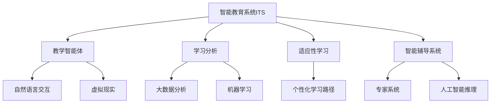
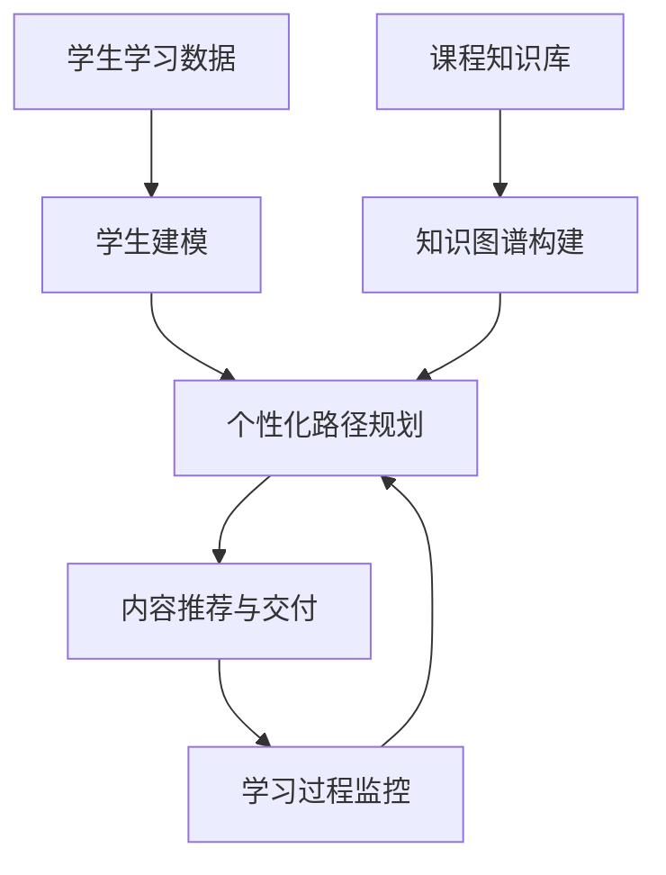

# 一切皆是映射：AI在教育领域的变革作用

## 1. 背景介绍

### 1.1 问题的由来

在当今快节奏的数字时代，教育领域正面临着前所未有的挑战。传统的教学模式难以满足学生个性化学习的需求，同时也无法跟上技术发展的步伐。因此，如何利用人工智能(AI)技术来优化教育过程、提高教学质量成为了一个亟待解决的问题。

### 1.2 研究现状

近年来,AI在教育领域的应用研究日益受到重视。一些先进的AI技术,如自然语言处理(NLP)、计算机视觉(CV)、机器学习(ML)等,已经开始在教育领域发挥作用。例如,智能教学助手可以通过NLP技术与学生进行自然语言交互,提供个性化辅导;在线课程平台利用ML算法分析学习数据,为学生推荐合适的学习资源等。

### 1.3 研究意义

AI技术在教育领域的应用具有重要意义:

1. **个性化学习**:AI可以根据每个学生的学习能力、兴趣爱好等因素,提供量身定制的学习方案,实现真正的因材施教。
2. **提高教学效率**:AI可以自动化部分教学任务,如批改作业、答疑解惑等,减轻教师的工作负担,提高教学效率。
3. **优化教学资源**:AI算法可以智能分析和整合海量教学资源,为教师和学生提供高质量的学习材料。
4. **促进教育公平**:AI技术有助于缩小城乡、区域等教育资源差距,让每个学生都能获得优质教育。

### 1.4 本文结构

本文将全面探讨AI在教育领域的应用,包括核心概念、关键技术、实践案例和未来趋势。文章主要结构如下:

1. 背景介绍
2. 核心概念与联系
3. 核心算法原理与具体操作步骤
4. 数学模型和公式详细讲解与案例分析
5. 项目实践:代码实例与解释
6. 实际应用场景
7. 工具和资源推荐
8. 总结:未来发展趋势与挑战
9. 附录:常见问题与解答

## 2. 核心概念与联系

在AI教育领域,有几个核心概念需要理解:

1. **智能教育系统(ITS)**:利用AI技术构建的教学系统,可以根据学生的学习情况动态调整教学策略,实现个性化教学。
2. **教学智能体(Pedagogical Agent)**: 一种智能虚拟教师,通过自然语言交互、动画等形式与学生互动,提供辅导和指导。
3. **学习分析(Learning Analytics)**: 利用大数据和机器学习等技术分析学习过程数据,发现学习模式,优化教学策略。
4. **适应性学习(Adaptive Learning)**: 根据学生的学习能力、兴趣等个体特征,动态调整教学内容、难度和进度。
5. **智能辅导系统(ITS)**: 结合专家系统、人工智能等技术,模拟人类导师的教学行为,为学生提供个性化指导。

这些概念相互关联,共同推动了AI在教育领域的创新应用。



## 3. 核心算法原理与具体操作步骤

### 3.1 算法原理概述

AI在教育领域的应用主要依赖于以下几种核心算法:

1. **自然语言处理(NLP)算法**:用于理解学生的自然语言输入,实现人机交互。常用算法有序列到序列模型、注意力机制等。
2. **机器学习(ML)算法**:从学习数据中发现模式,用于个性化学习、课程推荐等。常用算法有决策树、支持向量机、深度学习等。
3. **知识图谱算法**:构建结构化的知识库,支持智能问答、知识推理等功能。常用算法有知识表示学习、关系抽取等。
4. **多智能体协作算法**:多个智能体通过协作完成复杂教学任务。常用算法有马尔可夫决策过程、博弈论等。
5. **规划算法**:为学生生成个性化学习路径。常用算法有启发式搜索、时间约束规划等。

### 3.2 算法步骤详解

以自适应学习系统为例,其核心算法步骤如下:

1. **学生建模**:通过NLP和ML算法分析学生的学习行为、测试结果等数据,构建学生知识状态模型。
2. **知识图谱构建**:基于本体论和知识表示学习算法,构建结构化的课程知识图谱。
3. **个性化路径规划**:基于学生模型和知识图谱,利用规划算法为每个学生生成个性化学习路径。
4. **内容推荐与交付**:根据规划路径,推荐合适的学习资源,并通过智能教学助手以多媒体形式呈现。
5. **学习过程监控**:实时监控学生的学习进度,通过ML算法分析学习效果,动态调整个性化路径。



### 3.3 算法优缺点

上述算法在教育领域具有以下优缺点:

**优点**:
- 实现真正的因材施教,提高教学效率和质量
- 挖掘海量学习数据中的隐藏模式,优化教学策略
- 通过智能交互提升学习体验,激发学习兴趣

**缺点**:
- 算法性能受限于训练数据质量和算力条件
- 需要大量标注数据训练模型,存在算法偏差风险
- 算法决策过程缺乏透明度,难以人类理解和把控

### 3.4 算法应用领域

AI算法在教育领域的应用主要包括:

1. **个性化学习系统**:根据学生特征提供定制化学习方案
2. **智能教学助手**:基于NLP实现人机交互式辅导
3. **自动化评估**:利用ML算法自动批改作业、测试
4. **学习分析**:分析学习大数据,发现规律,优化教学
5. **课程推荐**:基于知识图谱推荐个性化学习资源
6. **教育管理决策**:利用AI技术分析学校运营数据,支持决策

## 4. 数学模型和公式详细讲解与举例说明

### 4.1 数学模型构建

在AI教育领域,数学模型主要用于描述以下几个核心问题:

1. **学生知识状态建模**
2. **课程知识图谱表示**
3. **个性化学习路径规划**
4. **教学策略优化**

以**学生知识状态建模**为例,常用的数学模型是**贝叶斯知识追踪(Bayesian Knowledge Tracing,BKT)模型**。

BKT模型将学生的知识状态视为一个隐藏的二值随机变量,用$L_t$表示时刻t学生是否掌握某个知识点,取值为0或1。该模型的状态转移方程为:

$$
P(L_{t+1}=1|L_t,O_t) = \begin{cases}
P(L_t=1)(1-\alpha_s) & \text{if } O_t=1\
P(L_t=0)(1-\alpha_g) & \text{if } O_t=0
\end{cases}
$$

其中:
- $\alpha_s$是学习率,表示已掌握知识点的遗忘率
- $\alpha_g$是猜测率,表示未掌握知识点时猜对的概率
- $O_t$是时刻t的观测值,表示学生作答是否正确(0或1)

通过观测学生的作答序列,可以使用期望最大化(EM)算法等方法估计上述参数,进而推断出学生的知识状态。

### 4.2 公式推导过程

我们来推导BKT模型中关键参数$\alpha_s$和$\alpha_g$的估计公式。

假设观测数据为$\mathcal{D}=\{O_1,O_2,...,O_T\}$,其中$O_t\in\{0,1\}$表示第t次作答是否正确。我们的目标是最大化观测数据的对数似然:

$$
\begin{aligned}
\mathcal{L}(\alpha_s,\alpha_g|\mathcal{D})&=\log P(\mathcal{D}|\alpha_s,\alpha_g)\
&=\sum_{t=1}^T\log\sum_{l_t}P(O_t|l_t,\alpha_s,\alpha_g)P(l_t|\alpha_s,\alpha_g)
\end{aligned}
$$

其中$l_t$表示时刻t的隐藏知识状态。

对$\alpha_s$和$\alpha_g$分别求偏导并令其等于0,可得:

$$
\begin{aligned}
\alpha_s&=\frac{\sum_t\gamma_t(1-O_t)}{\sum_t\gamma_t}\
\alpha_g&=\frac{\sum_t(1-\gamma_t)O_t}{\sum_t(1-\gamma_t)}
\end{aligned}
$$

这里$\gamma_t=P(l_t=1|\mathcal{D})$是后验概率,可通过前向-后向算法高效计算。

### 4.3 案例分析与讲解

我们以一个简单的例子来说明BKT模型在实践中的应用。

假设一名学生连续作答了10个判断题,其作答序列为:

```
0, 1, 0, 1, 0, 0, 1, 0, 1, 1
```

其中0表示答错,1表示答对。我们的目标是估计该学生对这个知识点的掌握程度。

首先,我们初始化$\alpha_s=0.3$和$\alpha_g=0.2$,利用前向-后向算法计算$\gamma_t$序列:

```
0.5, 0.63, 0.37, 0.7, 0.42, 0.28, 0.64, 0.36, 0.72, 0.82
```

然后,根据上述公式计算$\alpha_s$和$\alpha_g$的估计值:

$$
\begin{aligned}
\alpha_s&=\frac{0.18+0+0.36+0+0.28+0}{3.64}=0.176\
\alpha_g&=\frac{0.37+0.3+0.36+0.28}{2.36}=0.277
\end{aligned}
$$

最后,我们可以计算该学生最终掌握这个知识点的概率为0.82。

通过这个例子可以看出,BKT模型能够基于学生的作答表现,动态估计其知识掌握水平,为个性化教学提供依据。

### 4.4 常见问题解答

**Q1:为什么需要引入猜测率$\alpha_g$?**

A1:引入猜测率是为了解决"幸存者效应"问题。如果未掌握知识点时也有一定概率猜对,那么单凭作对一次题目就不能确定学生已掌握该知识点。

**Q2:如何处理多个知识点的情况?**

A2:对于涉及多个知识点的题目,可以构建"知识点与技能的Q矩阵",将每个题目拆分为多个单一知识点,分别建模和估计。

**Q3:BKT模型的局限性是什么?**

A3:BKT模型假设每个知识点是相互独立的,忽略了知识点之间的关联性。此外,它也未考虑学生的个体差异,如先验知识水平等因素的影响。

## 5. 项目实践:代码实例和详细解释说明

### 5.1 开发环境搭建

我们使用Python作为开发语言,并利用PyTorch深度学习框架实现BKT模型。首先需要安装以下依赖库:

```bash
pip install numpy pandas matplotlib pytorch
```

接下来,我们导入所需的Python库:

```python
import numpy as np
import pandas