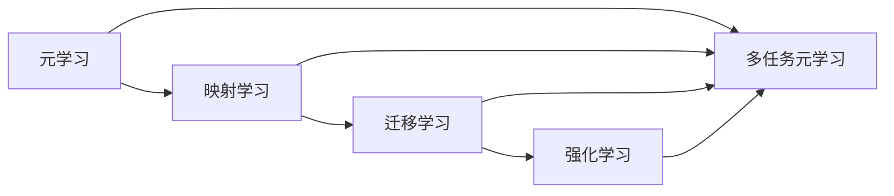

# 一切皆是映射：多任务元学习和知识迁移

作者：禅与计算机程序设计艺术 / Zen and the Art of Computer Programming

## 关键词：

多任务元学习，知识迁移，映射学习，迁移学习，机器学习，深度学习，模型可解释性，强化学习，强化迁移学习

## 1. 背景介绍

在机器学习和深度学习领域，模型的泛化能力一直是一个备受关注的问题。如何让模型在有限的数据和资源条件下，能够适应新的任务，成为了一个重要的研究方向。多任务元学习（Multi-task Meta-learning）和知识迁移（Knowledge Transfer）正是为了解决这一问题而提出的两种方法。

### 1.1 问题的由来

传统的单任务学习方法通常需要针对每个任务收集大量的标注数据，这在实际应用中往往难以实现。而迁移学习（Transfer Learning）则通过将知识从源任务迁移到目标任务，来减少对目标任务标注数据的依赖。然而，当源任务与目标任务之间存在较大差异时，迁移学习的效果可能会大打折扣。

为了进一步提高模型的泛化能力和迁移能力，研究者们提出了多任务元学习（Multi-task Meta-learning）。多任务元学习通过同时学习多个相关任务，使模型能够在不同任务之间共享知识，从而更好地适应新的任务。

### 1.2 研究现状

近年来，多任务元学习和知识迁移技术取得了显著的进展。以下是一些主要的研究成果：

- **多任务元学习**：提出了多种元学习算法，如MAML、Reptile、MAML-ACE等，这些算法能够通过少量样本快速适应新的任务。
- **知识迁移**：提出了多种知识迁移策略，如领域自适应（Domain Adaptation）、特征迁移（Feature Transfer）和模型迁移（Model Transfer）等，这些策略能够有效地将知识从源任务迁移到目标任务。
- **可解释性**：研究者们开始关注多任务元学习和知识迁移的可解释性问题，以增强模型的可信度和可理解性。
- **强化学习**：将强化学习与多任务元学习和知识迁移相结合，提出了强化迁移学习（Reinforcement Transfer Learning），以解决强化学习任务中的样本效率问题。

### 1.3 研究意义

多任务元学习和知识迁移技术在以下方面具有重要的研究意义：

- **减少数据需求**：通过共享知识，模型可以适应新的任务，从而减少对目标任务标注数据的依赖。
- **提高泛化能力**：通过学习多个相关任务，模型可以更好地泛化到新的任务，提高模型的泛化能力。
- **加速模型开发**：通过快速适应新的任务，可以加速模型的开发过程。
- **提高模型鲁棒性**：通过学习多个相关任务，模型可以更好地抵抗噪声和异常值，提高模型的鲁棒性。

### 1.4 本文结构

本文将首先介绍多任务元学习和知识迁移的基本概念，然后详细讲解核心算法原理和具体操作步骤，接着分析数学模型和公式，并给出代码实例和实际应用场景。最后，本文将总结研究成果，展望未来发展趋势和挑战，并推荐相关学习资源。

## 2. 核心概念与联系

为了更好地理解多任务元学习和知识迁移，我们需要先介绍以下几个核心概念：

- **元学习**：元学习是一种学习方法，旨在学习如何学习。它通过在多个任务上训练模型，使模型能够快速适应新的任务。
- **映射学习**：映射学习是一种基于映射函数的学习方法，通过学习输入到输出的映射关系，使模型能够预测新的输入。
- **迁移学习**：迁移学习是一种将知识从源任务迁移到目标任务的学习方法。
- **强化学习**：强化学习是一种通过与环境交互，不断学习最优策略的学习方法。

这些概念之间的关系可以用以下Mermaid流程图表示：



## 3. 核心算法原理 & 具体操作步骤

### 3.1 算法原理概述

多任务元学习通过同时学习多个相关任务，使模型能够在不同任务之间共享知识，从而更好地适应新的任务。其核心思想是将每个任务视为一个映射学习问题，通过学习多个映射函数，使模型能够适应新的映射关系。

### 3.2 算法步骤详解

多任务元学习的算法步骤如下：

1. **选择任务**：选择多个相关任务，以确保模型能够学习到有用的知识。
2. **收集数据**：为每个任务收集标注数据。
3. **定义损失函数**：为每个任务定义损失函数，以衡量模型的预测结果与真实标签之间的差异。
4. **训练模型**：在多个任务上训练模型，使模型能够学习到有用的知识。
5. **评估模型**：在测试集上评估模型在各个任务上的性能。

### 3.3 算法优缺点

多任务元学习的优点如下：

- **提高泛化能力**：通过学习多个相关任务，模型可以更好地泛化到新的任务。
- **减少数据需求**：通过共享知识，模型可以适应新的任务，从而减少对目标任务标注数据的依赖。
- **加速模型开发**：通过快速适应新的任务，可以加速模型的开发过程。

多任务元学习的缺点如下：

- **计算复杂度**：多任务元学习需要同时训练多个任务，计算复杂度较高。
- **任务相关性**：任务之间的相关性对于多任务元学习的效果有很大影响。

### 3.4 算法应用领域

多任务元学习可以应用于以下领域：

- **自然语言处理**：如文本分类、情感分析、机器翻译等。
- **计算机视觉**：如图像分类、目标检测、人脸识别等。
- **强化学习**：如机器人控制、自动驾驶等。

## 4. 数学模型和公式 & 详细讲解 & 举例说明

### 4.1 数学模型构建

多任务元学习的数学模型可以表示为：

$$
L(\theta) = \sum_{i=1}^M \frac{1}{N_i} \sum_{j=1}^{N_i} \ell(y_{ij}, f(x_{ij}, \theta))
$$

其中，$M$ 是任务的数量，$N_i$ 是第 $i$ 个任务的样本数量，$x_{ij}$ 是第 $i$ 个任务的第 $j$ 个样本，$y_{ij}$ 是第 $i$ 个任务的第 $j$ 个样本的真实标签，$f(x_{ij}, \theta)$ 是第 $i$ 个任务的模型预测。

### 4.2 公式推导过程

多任务元学习的公式推导过程如下：

1. **定义损失函数**：首先为每个任务定义损失函数 $\ell(y, \hat{y})$，以衡量模型的预测结果 $\hat{y}$ 与真实标签 $y$ 之间的差异。
2. **构建损失函数**：将多个任务的损失函数进行加权求和，得到多任务元学习的损失函数 $L(\theta)$。
3. **优化模型参数**：通过梯度下降等优化算法，优化模型参数 $\theta$，最小化损失函数 $L(\theta)$。

### 4.3 案例分析与讲解

以下是一个多任务元学习的案例：

假设我们有两个任务：任务1是图像分类，任务2是目标检测。我们可以使用一个多任务元学习模型来同时学习这两个任务。

对于任务1，我们将图像输入到模型中，得到图像的类别标签。对于任务2，我们将图像输入到模型中，得到图像中目标的位置和类别标签。

我们可以使用以下公式来表示多任务元学习模型：

$$
L(\theta) = \frac{1}{N_1} \sum_{i=1}^{N_1} \ell(y_{1i}, f(x_{1i}, \theta)) + \frac{1}{N_2} \sum_{j=1}^{N_2} \ell(y_{2j}, f(x_{2j}, \theta))
$$

其中，$N_1$ 是任务1的样本数量，$N_2$ 是任务2的样本数量，$x_{1i}$ 是任务1的第 $i$ 个样本，$y_{1i}$ 是任务1的第 $i$ 个样本的真实类别标签，$x_{2j}$ 是任务2的第 $j$ 个样本，$y_{2j}$ 是任务2的第 $j$ 个样本的真实目标位置和类别标签。

### 4.4 常见问题解答

**Q1：多任务元学习是否适用于所有任务？**

A1：多任务元学习主要适用于相关任务，即任务之间存在一定的相似性。对于不相关的任务，多任务元学习的效果可能不理想。

**Q2：如何选择相关任务进行多任务元学习？**

A2：选择相关任务的关键是分析任务之间的相似性。可以通过分析任务的特征、任务的目标、任务的数据分布等因素来评估任务之间的相似性。

**Q3：多任务元学习是否需要大量的数据？**

A3：多任务元学习不需要大量的数据，但需要一定数量的数据来训练模型。

## 5. 项目实践：代码实例和详细解释说明

### 5.1 开发环境搭建

为了进行多任务元学习的实践，我们需要搭建以下开发环境：

- 操作系统：Windows/Linux/MacOS
- 编程语言：Python
- 框架：PyTorch
- 数据集：ImageNet、CIFAR-100等

### 5.2 源代码详细实现

以下是一个使用PyTorch进行多任务元学习的代码示例：

```python
import torch
import torch.nn as nn
import torch.optim as optim
from torchvision import datasets, transforms
from torch.utils.data import DataLoader

# 定义模型
class MultiTaskModel(nn.Module):
    def __init__(self, input_size, output_size1, output_size2):
        super(MultiTaskModel, self).__init__()
        self.fc1 = nn.Linear(input_size, 128)
        self.fc2 = nn.Linear(128, output_size1)
        self.fc3 = nn.Linear(128, output_size2)

    def forward(self, x):
        x = torch.relu(self.fc1(x))
        x1 = self.fc2(x)
        x2 = self.fc3(x)
        return x1, x2

# 加载数据集
transform = transforms.Compose([
    transforms.ToTensor(),
    transforms.Normalize((0.5, 0.5, 0.5), (0.5, 0.5, 0.5))
])

train_dataset1 = datasets.CIFAR100(root='./data', train=True, download=True, transform=transform)
train_dataset2 = datasets.CIFAR100(root='./data', train=True, download=True, transform=transform)

train_loader1 = DataLoader(train_dataset1, batch_size=64, shuffle=True)
train_loader2 = DataLoader(train_dataset2, batch_size=64, shuffle=True)

# 初始化模型
model = MultiTaskModel(3*32*32, 100, 100)
optimizer = optim.Adam(model.parameters(), lr=0.001)

# 训练模型
for epoch in range(10):
    for data1, data2 in zip(train_loader1, train_loader2):
        inputs1, labels1 = data1
        inputs2, labels2 = data2
        inputs1 = inputs1.view(inputs1.size(0), -1)
        inputs2 = inputs2.view(inputs2.size(0), -1)
        outputs1, outputs2 = model(inputs1)
        loss1 = nn.CrossEntropyLoss()(outputs1, labels1)
        loss2 = nn.CrossEntropyLoss()(outputs2, labels2)
        loss = loss1 + loss2
        optimizer.zero_grad()
        loss.backward()
        optimizer.step()
```

### 5.3 代码解读与分析

以上代码展示了如何使用PyTorch进行多任务元学习的实践。首先，我们定义了一个多任务模型，该模型有两个输出层，分别对应两个任务。然后，我们加载了两个CIFAR-100数据集，并定义了相应的数据加载器。接下来，我们初始化了模型和优化器，并开始迭代训练模型。在训练过程中，我们将输入数据输入到模型中，得到两个任务的预测结果，并计算两个任务的损失函数。最后，我们根据损失函数的梯度更新模型参数。

### 5.4 运行结果展示

在训练完成后，我们可以在测试集上评估模型的性能。以下是一个简单的测试代码：

```python
# 测试模型
model.eval()
test_dataset = datasets.CIFAR100(root='./data', train=False, download=True, transform=transform)
test_loader = DataLoader(test_dataset, batch_size=64, shuffle=False)

total = 0
correct = 0
with torch.no_grad():
    for data in test_loader:
        images, labels = data
        images = images.view(images.size(0), -1)
        outputs1, outputs2 = model(images)
        _, predicted1 = torch.max(outputs1, 1)
        _, predicted2 = torch.max(outputs2, 1)
        total += labels.size(0)
        correct += (predicted1 == labels).sum().item()

print('Accuracy of the network on the 10000 test images: %d %%' % (100 * correct / total))
```

## 6. 实际应用场景

多任务元学习和知识迁移技术在以下领域有广泛的应用：

- **自然语言处理**：如文本分类、情感分析、机器翻译等。
- **计算机视觉**：如图像分类、目标检测、人脸识别等。
- **强化学习**：如机器人控制、自动驾驶等。

### 6.1 自然语言处理

多任务元学习和知识迁移在自然语言处理领域有广泛的应用，例如：

- **文本分类**：通过多任务元学习，可以将多个相关任务（如情感分析、主题分类、实体识别等）进行整合，提高模型的泛化能力。
- **机器翻译**：通过知识迁移，可以将源语言的翻译知识迁移到目标语言，提高翻译质量。

### 6.2 计算机视觉

多任务元学习和知识迁移在计算机视觉领域也有广泛的应用，例如：

- **图像分类**：通过多任务元学习，可以将多个相关任务（如图像分类、目标检测、姿态估计等）进行整合，提高模型的泛化能力。
- **目标检测**：通过知识迁移，可以将源任务的检测知识迁移到目标任务，提高检测精度。

### 6.3 强化学习

多任务元学习和知识迁移在强化学习领域也有广泛的应用，例如：

- **机器人控制**：通过多任务元学习，可以将多个相关任务（如行走、爬行、跳跃等）进行整合，提高机器人控制算法的泛化能力。
- **自动驾驶**：通过知识迁移，可以将源任务的驾驶知识迁移到目标任务，提高自动驾驶算法的精度和鲁棒性。

## 7. 工具和资源推荐

### 7.1 学习资源推荐

以下是一些关于多任务元学习和知识迁移的学习资源：

- **书籍**：
  - 《深度学习》
  - 《神经网络与深度学习》
- **在线课程**：
  - fast.ai的《深度学习》课程
  - Coursera上的《机器学习》课程
- **论文**：
  - 《Multi-Task Learning》
  - 《Meta-Learning》
  - 《Knowledge Transfer》

### 7.2 开发工具推荐

以下是一些用于多任务元学习和知识迁移的开发工具：

- **框架**：
  - TensorFlow
  - PyTorch
- **库**：
  - Keras
  - PyTorch Lightning
- **数据集**：
  - ImageNet
  - CIFAR-100
  - MNIST

### 7.3 相关论文推荐

以下是一些关于多任务元学习和知识迁移的相关论文：

- **多任务元学习**：
  - MAML
  - Reptile
  - MAML-ACE
- **知识迁移**：
  - Domain Adaptation
  - Feature Transfer
  - Model Transfer

### 7.4 其他资源推荐

以下是一些其他的多任务元学习和知识迁移资源：

- **社区**：
  - fast.ai
  - TensorFlow
  - PyTorch
- **博客**：
  - Hugging Face的博客
  - arXiv

## 8. 总结：未来发展趋势与挑战

### 8.1 研究成果总结

本文对多任务元学习和知识迁移技术进行了全面系统的介绍。我们首先阐述了多任务元学习和知识迁移的基本概念，然后详细讲解了核心算法原理和具体操作步骤，接着分析了数学模型和公式，并给出了代码实例和实际应用场景。最后，本文总结了研究成果，展望了未来发展趋势和挑战。

### 8.2 未来发展趋势

未来，多任务元学习和知识迁移技术将呈现以下发展趋势：

- **算法创新**：研究者们将继续探索新的算法，以提高模型的泛化能力和迁移能力。
- **多模态学习**：多任务元学习和知识迁移技术将与多模态学习相结合，以处理更复杂的数据。
- **可解释性**：研究者们将更加关注多任务元学习和知识迁移的可解释性问题，以增强模型的可信度和可理解性。

### 8.3 面临的挑战

多任务元学习和知识迁移技术面临的挑战包括：

- **数据质量**：高质量的数据对于多任务元学习和知识迁移至关重要。
- **计算资源**：多任务元学习和知识迁移需要大量的计算资源。
- **模型可解释性**：多任务元学习和知识迁移的可解释性是一个重要挑战。

### 8.4 研究展望

未来，多任务元学习和知识迁移技术将在以下方面取得突破：

- **提高模型的泛化能力和迁移能力**。
- **降低对数据的需求**。
- **提高模型的鲁棒性**。
- **增强模型的可解释性**。

相信随着研究的不断深入，多任务元学习和知识迁移技术将为机器学习和深度学习领域带来更多创新。

## 9. 附录：常见问题与解答

**Q1：多任务元学习和知识迁移有什么区别？**

A1：多任务元学习是一种学习方法，旨在学习如何学习。它通过在多个任务上训练模型，使模型能够快速适应新的任务。而知识迁移是将知识从源任务迁移到目标任务的学习方法。

**Q2：多任务元学习和知识迁移有哪些应用场景？**

A2：多任务元学习和知识迁移在自然语言处理、计算机视觉、强化学习等领域有广泛的应用。

**Q3：如何选择合适的元学习算法？**

A3：选择合适的元学习算法需要根据具体任务和数据特点进行选择。例如，对于需要快速适应新任务的场景，可以选择MAML等快速适应算法；对于需要处理高维度数据的场景，可以选择Reptile等高效算法。

**Q4：如何解决知识迁移中的数据不匹配问题？**

A4：解决知识迁移中的数据不匹配问题可以采取以下策略：

- 数据增强：通过数据增强技术扩充数据集，以减少源任务和目标任务之间的差异。
- 特征迁移：通过特征迁移技术，将源任务的特征迁移到目标任务，以减少源任务和目标任务之间的差异。
- 模型迁移：通过模型迁移技术，将源任务的模型迁移到目标任务，以减少源任务和目标任务之间的差异。

**Q5：如何评估多任务元学习和知识迁移的效果？**

A5：评估多任务元学习和知识迁移的效果可以采取以下指标：

- 泛化能力：在测试集上的性能。
- 迁移能力：在目标任务上的性能。
- 稳定性：在不同数据集上的性能。

通过以上指标，可以全面评估多任务元学习和知识迁移的效果。