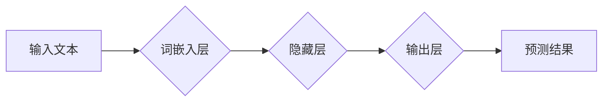

## 神经网络：自然语言处理的新突破

> 关键词：神经网络、自然语言处理、深度学习、Transformer、BERT、GPT、语言模型、文本生成

## 1. 背景介绍

自然语言处理（NLP）一直是人工智能领域的核心研究方向之一。它旨在使计算机能够理解、处理和生成人类语言。传统的NLP方法主要依赖于手工设计的规则和特征工程，但随着深度学习的兴起，基于神经网络的NLP模型取得了显著的突破。

神经网络能够学习语言的复杂模式和语义关系，从而实现更准确、更自然的语言理解和生成。近年来，深度学习在NLP领域的应用取得了令人瞩目的成果，例如机器翻译、文本摘要、情感分析、对话系统等。

## 2. 核心概念与联系

### 2.1 神经网络

神经网络是一种模仿人脑神经网络结构的计算模型。它由 interconnected 的节点（神经元）组成，这些节点通过连接和权重进行信息传递。神经网络能够通过训练学习数据中的模式和关系，从而实现各种任务。

### 2.2 自然语言处理

自然语言处理（NLP）是人工智能领域的一个分支，旨在使计算机能够理解、处理和生成人类语言。NLP的任务包括：

* **文本分类:** 将文本归类到预定义的类别中，例如情感分析、主题分类等。
* **文本摘要:** 从长文本中提取关键信息，生成简洁的摘要。
* **机器翻译:** 将文本从一种语言翻译成另一种语言。
* **问答系统:** 回答用户提出的问题。
* **对话系统:** 与用户进行自然语言对话。

### 2.3 深度学习

深度学习是机器学习的一个子领域，它使用多层神经网络来学习数据中的复杂模式。深度学习模型能够自动提取特征，无需人工特征工程，从而在许多任务中取得了优异的性能。

**Mermaid 流程图**



## 3. 核心算法原理 & 具体操作步骤

### 3.1 算法原理概述

深度学习在NLP中的核心算法是**循环神经网络（RNN）**和**Transformer**。

* **RNN**：RNN能够处理序列数据，例如文本，因为它具有记忆机制，能够记住之前处理过的信息。

* **Transformer**：Transformer是一种更先进的架构，它使用**注意力机制**来处理序列数据，能够更有效地捕捉长距离依赖关系。

### 3.2 算法步骤详解

**RNN**

1. **词嵌入:** 将每个单词转换为一个向量表示。
2. **循环计算:** 对每个单词进行循环计算，更新隐藏状态。
3. **输出:** 根据隐藏状态预测下一个单词或执行其他任务。

**Transformer**

1. **词嵌入:** 将每个单词转换为一个向量表示。
2. **多头注意力:** 使用多头注意力机制来捕捉单词之间的关系。
3. **前馈神经网络:** 对每个单词的嵌入进行处理。
4. **编码器-解码器:** 使用编码器将输入序列编码为上下文向量，解码器根据上下文向量生成输出序列。

### 3.3 算法优缺点

**RNN**

* **优点:** 能够处理序列数据，具有记忆机制。
* **缺点:** 难以处理长距离依赖关系，训练速度慢。

**Transformer**

* **优点:** 能够有效地捕捉长距离依赖关系，训练速度快。
* **缺点:** 计算量大，参数量多。

### 3.4 算法应用领域

* **机器翻译:** 将文本从一种语言翻译成另一种语言。
* **文本摘要:** 从长文本中提取关键信息，生成简洁的摘要。
* **情感分析:** 分析文本的情感倾向，例如正面、负面或中性。
* **对话系统:** 与用户进行自然语言对话。
* **文本生成:** 生成新的文本，例如文章、故事或诗歌。

## 4. 数学模型和公式 & 详细讲解 & 举例说明

### 4.1 数学模型构建

**词嵌入:**

词嵌入将每个单词映射到一个低维向量空间中，使得语义相似的单词拥有相似的向量表示。常用的词嵌入模型包括Word2Vec和GloVe。

**注意力机制:**

注意力机制允许模型关注输入序列中与当前任务最相关的部分。注意力权重表示每个单词对当前输出的贡献程度。

**Transformer编码器:**

Transformer编码器由多个编码器层组成，每个编码器层包含多头注意力层和前馈神经网络层。

**Transformer解码器:**

Transformer解码器也由多个解码器层组成，每个解码器层包含多头注意力层和前馈神经网络层。

### 4.2 公式推导过程

**词嵌入:**

假设词汇表大小为V，每个单词嵌入为d维向量。词嵌入矩阵W是一个V x d的矩阵，其中每个行向量代表一个单词的嵌入向量。

**注意力机制:**

注意力权重计算公式为：

$$
\alpha_{ij} = \frac{\exp(score(w_i, w_j))}{\sum_{k=1}^{n} \exp(score(w_i, w_k))}
$$

其中，$w_i$和$w_j$分别为输入序列中第i个和第j个单词的嵌入向量，$score(w_i, w_j)$为两个单词之间的相似度得分。

### 4.3 案例分析与讲解

**BERT模型:**

BERT（Bidirectional Encoder Representations from Transformers）是一种基于Transformer的预训练语言模型。它使用双向语言模型来训练词嵌入，能够更好地理解单词的上下文语义。BERT在许多NLP任务中取得了state-of-the-art的性能，例如文本分类、问答系统和文本蕴含。

## 5. 项目实践：代码实例和详细解释说明

### 5.1 开发环境搭建

* Python 3.6+
* TensorFlow或PyTorch深度学习框架
* NLTK自然语言处理库
* 其他必要的库，例如pandas、numpy等

### 5.2 源代码详细实现

```python
# 使用TensorFlow构建一个简单的RNN模型
import tensorflow as tf

# 定义模型参数
vocab_size = 10000
embedding_dim = 128
hidden_dim = 256

# 创建词嵌入层
embedding_layer = tf.keras.layers.Embedding(vocab_size, embedding_dim)

# 创建RNN层
rnn_layer = tf.keras.layers.LSTM(hidden_dim)

# 创建输出层
output_layer = tf.keras.layers.Dense(vocab_size, activation='softmax')

# 构建模型
model = tf.keras.Sequential([
    embedding_layer,
    rnn_layer,
    output_layer
])

# 编译模型
model.compile(optimizer='adam', loss='sparse_categorical_crossentropy', metrics=['accuracy'])

# 训练模型
model.fit(x_train, y_train, epochs=10)
```

### 5.3 代码解读与分析

* **词嵌入层:** 将每个单词转换为一个低维向量表示。
* **RNN层:** 处理序列数据，更新隐藏状态。
* **输出层:** 根据隐藏状态预测下一个单词。
* **编译模型:** 选择优化器、损失函数和评价指标。
* **训练模型:** 使用训练数据训练模型。

### 5.4 运行结果展示

训练完成后，可以使用测试数据评估模型的性能。

## 6. 实际应用场景

### 6.1 机器翻译

神经网络模型能够学习语言之间的映射关系，从而实现机器翻译。例如，Google Translate使用深度学习模型进行翻译，能够提供更准确、更自然的翻译结果。

### 6.2 文本摘要

神经网络模型能够提取文本中的关键信息，生成简洁的摘要。例如，新闻网站使用文本摘要技术生成新闻摘要，方便用户快速了解新闻内容。

### 6.3 情感分析

神经网络模型能够分析文本的情感倾向，例如正面、负面或中性。例如，社交媒体平台使用情感分析技术监测用户情绪，了解用户对产品的评价。

### 6.4 对话系统

神经网络模型能够与用户进行自然语言对话。例如，智能语音助手使用对话系统技术理解用户的指令，并提供相应的服务。

### 6.5 文本生成

神经网络模型能够生成新的文本，例如文章、故事或诗歌。例如，AI写作工具使用文本生成技术帮助用户撰写文章。

## 7. 工具和资源推荐

### 7.1 学习资源推荐

* **书籍:**
    * 《深度学习》
    * 《自然语言处理》
    * 《Transformer模型》
* **在线课程:**
    * Coursera深度学习课程
    * Udacity自然语言处理课程
    * fast.ai深度学习课程

### 7.2 开发工具推荐

* **TensorFlow:** 开源深度学习框架
* **PyTorch:** 开源深度学习框架
* **Hugging Face Transformers:** 预训练Transformer模型库

### 7.3 相关论文推荐

* **Attention Is All You Need:** https://arxiv.org/abs/1706.03762
* **BERT: Pre-training of Deep Bidirectional Transformers for Language Understanding:** https://arxiv.org/abs/1810.04805
* **GPT-3: Language Models are Few-Shot Learners:** https://arxiv.org/abs/2005.14165

## 8. 总结：未来发展趋势与挑战

### 8.1 研究成果总结

深度学习在NLP领域取得了显著的突破，例如机器翻译、文本摘要、情感分析、对话系统等任务取得了state-of-the-art的性能。

### 8.2 未来发展趋势

* **更强大的预训练模型:** 预训练模型能够学习更丰富的语言知识，从而在更多任务中取得更好的性能。
* **更有效的训练方法:** 探索新的训练方法，例如自监督学习和强化学习，提高模型训练效率和性能。
* **跨语言理解:** 研究跨语言理解模型，能够理解和生成不同语言的文本。
* **可解释性:** 研究更可解释的NLP模型，帮助人们理解模型的决策过程。

### 8.3 面临的挑战

* **数据稀缺:** 许多语言的数据量有限，难以训练高质量的NLP模型。
* **计算资源:** 训练大型NLP模型需要大量的计算资源。
* **伦理问题:** NLP模型可能存在偏见和歧视问题，需要关注模型的伦理问题。

### 8.4 研究展望

未来，NLP领域将继续朝着更强大、更智能、更安全的方向发展。


## 9. 附录：常见问题与解答

* **什么是词嵌入？**

词嵌入是一种将单词映射到低维向量空间的技术，使得语义相似的单词拥有相似的向量表示。

* **Transformer模型的优势是什么？**

Transformer模型能够有效地捕捉长距离依赖关系，训练速度快，在许多NLP任务中取得了state-of-the-art的性能。

* **如何训练一个NLP模型？**

训练一个NLP模型需要准备训练数据、选择模型架构、编译模型、训练模型和评估模型性能。

* **有哪些常用的NLP工具和资源？**

常用的NLP工具和资源包括TensorFlow、PyTorch、Hugging Face Transformers、NLTK等。


作者：禅与计算机程序设计艺术 / Zen and the Art of Computer Programming 
