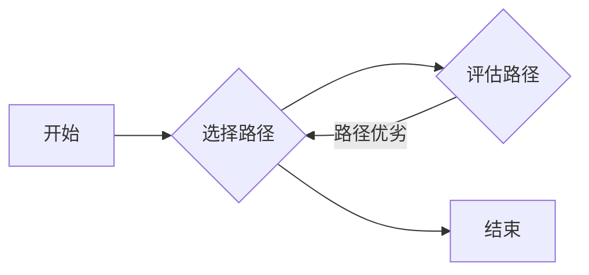

# 蚁群算法(Ant Colony Optimization) - 原理与代码实例讲解

> 关键词：蚁群算法，ACO，优化，分布式计算，多智能体系统，路径优化，图论

## 1. 背景介绍

蚁群算法（Ant Colony Optimization，ACO）是一种模拟自然界中蚂蚁觅食行为的智能优化算法。蚂蚁在寻找食物的过程中，通过信息素的释放、更新和蒸发，能够有效地找到从巢穴到食物源的最短路径。ACO算法将这一自然现象抽象为一种数学模型，并应用于解决组合优化问题。

### 1.1 问题的由来

组合优化问题在现实世界中广泛存在，如旅行商问题（TSP）、车辆路径问题（VRP）、调度问题等。这些问题的共同特点在于，需要在众多可能的解中选择一个最优或近似最优的解。传统的优化方法如线性规划、整数规划等，往往难以处理大规模的组合优化问题。

ACO算法作为一种启发式算法，能够在复杂的搜索空间中找到较优的解，因此在许多领域得到了应用。

### 1.2 研究现状

ACO算法自1992年提出以来，已经经过了近30年的发展，形成了多种变体和改进方法。其中，最著名的ACO算法是Dorigo等人提出的Ant System（AS）算法。

### 1.3 研究意义

ACO算法具有以下研究意义：

1. **分布式计算**：ACO算法具有分布式计算的特点，能够在多个智能体之间协同工作，提高求解效率。
2. **鲁棒性**：ACO算法对参数设置不敏感，具有较强的鲁棒性。
3. **易于实现**：ACO算法的原理简单，易于实现。
4. **应用广泛**：ACO算法可以应用于解决多种组合优化问题。

### 1.4 本文结构

本文将分为以下几个部分：

- 2. 核心概念与联系：介绍ACO算法的核心概念和原理，并给出Mermaid流程图。
- 3. 核心算法原理 & 具体操作步骤：详细讲解ACO算法的原理和操作步骤。
- 4. 数学模型和公式 & 详细讲解 & 举例说明：介绍ACO算法的数学模型和公式，并给出案例分析和讲解。
- 5. 项目实践：代码实例和详细解释说明：给出ACO算法的代码实例，并对其进行详细解释和分析。
- 6. 实际应用场景：介绍ACO算法的实际应用场景。
- 7. 工具和资源推荐：推荐学习资源和开发工具。
- 8. 总结：未来发展趋势与挑战。

## 2. 核心概念与联系

### 2.1 蚂蚁觅食行为

蚂蚁觅食过程中，会释放信息素来标记路径。信息素浓度越高，蚂蚁选择该路径的概率越大。信息素会随着时间的推移而蒸发，从而保持路径的有效性。

### 2.2 ACO算法核心概念

ACO算法的核心概念包括：

- **信息素**：蚂蚁在路径上释放的化学物质，用于引导其他蚂蚁选择路径。
- **路径**：蚂蚁从巢穴到食物源所经过的路径。
- **启发函数**：用于评估路径优劣的函数。
- **迭代**：ACO算法的迭代过程，每迭代一次，蚂蚁都会更新信息素浓度。

### 2.3 Mermaid流程图



## 3. 核心算法原理 & 具体操作步骤

### 3.1 算法原理概述

ACO算法通过模拟蚂蚁觅食行为，迭代搜索最优路径。在每轮迭代中，每只蚂蚁都会根据启发函数和信息素浓度选择路径，并更新信息素浓度。

### 3.2 算法步骤详解

1. **初始化**：设置信息素浓度、启发函数、蚂蚁数量等参数。
2. **选择路径**：每只蚂蚁根据启发函数和信息素浓度选择路径。
3. **更新信息素**：根据蚂蚁选择的路径更新信息素浓度。
4. **评估路径**：评估每只蚂蚁选择的路径优劣。
5. **迭代**：重复步骤2-4，直到满足终止条件（如迭代次数、最优解等）。

### 3.3 算法优缺点

#### 3.3.1 优点

- **分布式计算**：ACO算法具有分布式计算的特点，能够在多个智能体之间协同工作，提高求解效率。
- **鲁棒性**：ACO算法对参数设置不敏感，具有较强的鲁棒性。
- **易于实现**：ACO算法的原理简单，易于实现。

#### 3.3.2 缺点

- **局部最优**：ACO算法容易陷入局部最优解。
- **参数设置**：ACO算法的参数较多，需要根据具体问题进行调整。

### 3.4 算法应用领域

ACO算法可以应用于以下领域：

- **旅行商问题（TSP）**
- **车辆路径问题（VRP）**
- **调度问题**
- **网络流量分配问题**
- **路径规划问题**

## 4. 数学模型和公式 & 详细讲解 & 举例说明

### 4.1 数学模型构建

ACO算法的数学模型主要包括以下部分：

- **状态转移概率**：表示蚂蚁选择某条路径的概率。
- **信息素更新规则**：表示信息素浓度如何更新。
- **启发函数**：表示路径优劣的函数。

### 4.2 公式推导过程

#### 4.2.1 状态转移概率

状态转移概率公式如下：

$$
P_{ij}(t+1) = \left(\frac{\tau_{ij}^{\alpha} \eta_{ij}^{\beta}}{\sum_{k=1}^{m} \tau_{ik}^{\alpha} \eta_{ik}^{\beta}}\right) \times \left(\frac{Q}{\sum_{k=1}^{m} \tau_{ik}^{\alpha} \eta_{ik}^{\beta} Q}\right)
$$

其中：

- $P_{ij}(t+1)$：第 $t+1$ 轮中，蚂蚁从状态 $i$ 转移到状态 $j$ 的概率。
- $\tau_{ij}$：路径 $(i, j)$ 在第 $t$ 轮的信息素浓度。
- $\eta_{ij}$：路径 $(i, j)$ 的启发函数值。
- $\alpha$：信息启发式因子。
- $\beta$：期望启发式因子。
- $Q$：信息素强度因子。

#### 4.2.2 信息素更新规则

信息素更新规则如下：

$$
\tau_{ij}(t+1) = (1 - \rho) \tau_{ij}(t) + \Delta \tau_{ij}(t)
$$

其中：

- $\tau_{ij}(t+1)$：第 $t+1$ 轮中，路径 $(i, j)$ 的信息素浓度。
- $\rho$：信息素蒸发系数。
- $\Delta \tau_{ij}(t)$：第 $t$ 轮中，路径 $(i, j)$ 上的信息素增量。

#### 4.2.3 启发函数

启发函数可以表示为：

$$
\eta_{ij} = \frac{1}{d_{ij}}
$$

其中：

- $\eta_{ij}$：路径 $(i, j)$ 的启发函数值。
- $d_{ij}$：路径 $(i, j)$ 的距离。

### 4.3 案例分析与讲解

以TSP问题为例，假设有5个城市，城市编号分别为1、2、3、4、5。我们需要找到从城市1出发，遍历所有城市并返回城市1的最短路径。

1. **初始化**：设置信息素浓度、启发函数、蚂蚁数量等参数。
2. **选择路径**：每只蚂蚁根据状态转移概率选择路径。
3. **更新信息素**：根据蚂蚁选择的路径更新信息素浓度。
4. **评估路径**：评估每只蚂蚁选择的路径优劣。
5. **迭代**：重复步骤2-4，直到满足终止条件。

经过多次迭代后，ACO算法可以找到从城市1出发，遍历所有城市并返回城市1的最短路径。

## 5. 项目实践：代码实例和详细解释说明

### 5.1 开发环境搭建

1. 安装Python环境。
2. 安装ACO算法相关的库，如antpy、networkx等。

### 5.2 源代码详细实现

以下是一个使用Python和antpy库实现的ACO算法代码实例：

```python
from antpy.aco import AntSystem
import networkx as nx

# 创建图
G = nx.Graph()
G.add_edge(1, 2, weight=2)
G.add_edge(1, 3, weight=3)
G.add_edge(1, 4, weight=4)
G.add_edge(1, 5, weight=5)
G.add_edge(2, 3, weight=1)
G.add_edge(2, 4, weight=2)
G.add_edge(2, 5, weight=3)
G.add_edge(3, 4, weight=2)
G.add_edge(3, 5, weight=1)
G.add_edge(4, 5, weight=2)

# 初始化ACO算法
aco = AntSystem(G, num_ants=10, alpha=1, beta=2, evaporation=0.5, Q=1, max_iter=100)

# 运行ACO算法
solution = aco.solve()

# 打印结果
print(solution)
```

### 5.3 代码解读与分析

1. **导入库**：导入antpy和networkx库。
2. **创建图**：创建一个图，表示TSP问题的城市和路径。
3. **初始化ACO算法**：初始化ACO算法，设置参数，如蚂蚁数量、信息启发式因子、期望启发式因子、信息素蒸发系数、信息素强度因子、最大迭代次数等。
4. **运行ACO算法**：运行ACO算法，求解TSP问题。
5. **打印结果**：打印ACO算法找到的最短路径。

## 6. 实际应用场景

ACO算法可以应用于以下实际应用场景：

- **物流配送**：优化配送路线，降低配送成本。
- **网络路由**：优化数据传输路径，提高网络传输效率。
- **交通运输**：优化航班路径、列车路径等，提高交通运输效率。
- **生产调度**：优化生产计划，提高生产效率。

## 7. 工具和资源推荐

### 7.1 学习资源推荐

- 《蚁群算法：原理与应用》
- 《图论与网络优化》
- 《人工智能：一种现代的方法》

### 7.2 开发工具推荐

- Python
- antpy
- networkx

### 7.3 相关论文推荐

- Dorigo, M., Maniezzo, V., & Colorni, A. (1992). Optimisation, learning and adaptive behaviour in ants. IEEE Transactions on Systems, Man, and Cybernetics, Part B: Cybernetics, 22(6), 1292-1300.
- Dorigo, M., & Stützle, T. (2004). Ant colony optimization. IEEE Computational Intelligence Magazine, 1(4), 28-39.

## 8. 总结：未来发展趋势与挑战

### 8.1 研究成果总结

ACO算法作为一种启发式算法，在解决组合优化问题方面具有独特的优势。通过模拟蚂蚁觅食行为，ACO算法能够有效地找到较优的解，并在多个领域得到了应用。

### 8.2 未来发展趋势

- **参数优化**：研究更有效的参数选择方法，提高ACO算法的收敛速度和求解质量。
- **算法改进**：改进ACO算法的搜索机制，提高算法的鲁棒性和抗干扰能力。
- **与其他算法结合**：将ACO算法与其他优化算法结合，提高算法的适用范围和求解质量。

### 8.3 面临的挑战

- **局部最优**：ACO算法容易陷入局部最优解，需要改进搜索机制，提高算法的全局搜索能力。
- **参数设置**：ACO算法的参数较多，需要根据具体问题进行调整，缺乏自动化的参数选择方法。

### 8.4 研究展望

ACO算法作为一种启发式算法，在解决组合优化问题方面具有广阔的应用前景。未来，随着ACO算法的不断发展，相信它将在更多领域发挥重要作用。

## 9. 附录：常见问题与解答

**Q1：蚁群算法的优缺点是什么？**

A：蚁群算法的优点包括分布式计算、鲁棒性强、易于实现等。缺点包括容易陷入局部最优解、参数设置困难等。

**Q2：蚁群算法适用于哪些类型的优化问题？**

A：蚁群算法适用于解决旅行商问题、车辆路径问题、调度问题、网络流量分配问题、路径规划问题等组合优化问题。

**Q3：如何改进蚁群算法的局部搜索能力？**

A：可以通过以下方法改进蚁群算法的局部搜索能力：
- 引入多样性机制，如禁忌搜索、模拟退火等。
- 改进状态转移概率，增加路径的多样性。
- 结合其他优化算法，如遗传算法、粒子群优化算法等。

**Q4：如何选择蚁群算法的参数？**

A：蚁群算法的参数较多，需要根据具体问题进行调整。以下是一些常用的参数选择方法：
- 经验法：根据经验选择参数值。
- 实验法：通过实验比较不同参数值的效果。
- 搜索算法：使用搜索算法自动搜索最优参数组合。

---

作者：禅与计算机程序设计艺术 / Zen and the Art of Computer Programming