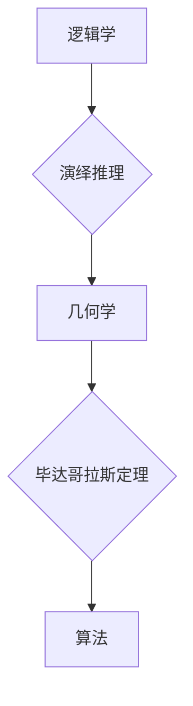

## 计算：第一部分 计算的诞生 第 1 章 毕达哥拉斯的困惑 演绎推理：逻辑学和几何学

> 关键词：逻辑学、几何学、演绎推理、毕达哥拉斯定理、算法、计算模型、数学基础

### 1. 背景介绍

在人类文明的漫长历史中，对世界的理解和探索一直是永恒的主题。从古希腊哲学家对宇宙奥秘的探究，到现代人工智能的蓬勃发展，我们始终试图用理性思维和逻辑推理来揭示世界的本质。

毕达哥拉斯，这位古希腊数学家和哲学家，正是这种探索精神的典范。他不仅发现了著名的毕达哥拉斯定理，更将数学和哲学融为一体，试图用逻辑推理来解释宇宙的运行规律。

然而，毕达哥拉斯的困惑也反映了人类在理解计算和逻辑之间面临的挑战。他试图用几何图形来表达逻辑关系，但这种方法在处理复杂问题时显得捉襟见肘。

### 2. 核心概念与联系

**2.1 逻辑学**

逻辑学是研究推理和论证的科学，它提供了一套严密的规则和方法，用于分析和构建有效的论证。逻辑学的核心概念包括命题、论域、推理规则、蕴涵关系等。

**2.2 几何学**

几何学是研究空间形状、大小和位置的数学分支。它通过图形和空间关系来描述和分析客观世界。

**2.3 演绎推理**

演绎推理是一种从一般原理出发，通过逻辑推导得出特定结论的推理方式。它遵循一定的规则，保证了推理过程的严密性和可靠性。

**2.4 毕达哥拉斯定理**

毕达哥拉斯定理是几何学中的一个重要定理，它指出：在直角三角形中，两条直角边的平方和等于斜边的平方。

**2.5 算法**

算法是一种解决特定问题的精确步骤序列。它可以被看作是一种计算模型，用于将输入数据转化为输出结果。

**Mermaid 流程图**



### 3. 核心算法原理 & 具体操作步骤

**3.1 算法原理概述**

演绎推理算法的核心原理是根据已知的逻辑规则和前提条件，通过一系列逻辑推导步骤，最终得出结论。

**3.2 算法步骤详解**

1. **定义命题和论域:** 首先，需要明确命题的含义和论域范围。
2. **建立逻辑关系:** 根据已知的逻辑规则，建立命题之间的逻辑关系，例如蕴涵关系、否定关系等。
3. **进行逻辑推导:** 利用逻辑规则和已知的逻辑关系，进行一系列逻辑推导步骤，逐步逼近结论。
4. **验证结论:** 最后，需要验证结论是否符合已知的逻辑规则和前提条件。

**3.3 算法优缺点**

**优点:**

* **严密性:** 演绎推理算法遵循严格的逻辑规则，保证了推理过程的严密性和可靠性。
* **可重复性:** 演绎推理过程是可重复的，任何人都可以按照相同的步骤进行推理，得到相同的结论。
* **普遍性:** 演绎推理算法可以应用于各种领域，例如数学、逻辑、科学等。

**缺点:**

* **局限性:** 演绎推理算法只能处理已知逻辑规则和前提条件下的问题，无法解决未知领域的问题。
* **复杂性:** 对于复杂问题，演绎推理过程可能非常复杂，需要大量的逻辑推导步骤。
* **效率:** 演绎推理算法的效率可能较低，特别是对于大型问题。

**3.4 算法应用领域**

演绎推理算法广泛应用于以下领域:

* **人工智能:** 用于知识推理、问题解决、自然语言理解等。
* **逻辑学:** 用于证明定理、分析论证、构建逻辑系统等。
* **数学:** 用于证明数学定理、推导数学公式等。
* **法律:** 用于分析法律条文、推理法律结论等。
* **医学:** 用于诊断疾病、预测病情等。

### 4. 数学模型和公式 & 详细讲解 & 举例说明

**4.1 数学模型构建**

我们可以用符号逻辑来构建数学模型，用命题变量来表示命题，用逻辑连接词来表示逻辑关系。例如，我们可以用以下符号来表示毕达哥拉斯定理：

*  a, b, c 表示直角三角形的两条直角边和斜边。
*  ∧ 表示逻辑连接词“且”。
*  → 表示逻辑连接词“如果…则”。

**4.2 公式推导过程**

根据毕达哥拉斯定理，我们可以构建以下数学公式：

$$a^2 + b^2 \rightarrow c^2$$

这个公式表示，如果 a 和 b 是直角三角形的两条直角边，那么 c^2 等于 a^2 加 b^2。

**4.3 案例分析与讲解**

假设我们有一个直角三角形，其中一条直角边长为 3，另一条直角边长为 4。我们可以使用毕达哥拉斯定理来计算斜边的长度：

$$3^2 + 4^2 = c^2$$
$$9 + 16 = c^2$$
$$25 = c^2$$
$$c = \sqrt{25} = 5$$

因此，这个直角三角形的斜边长度为 5。

### 5. 项目实践：代码实例和详细解释说明

**5.1 开发环境搭建**

我们可以使用 Python 语言来实现演绎推理算法。Python 是一个开源的编程语言，拥有丰富的库和工具，非常适合进行算法开发。

**5.2 源代码详细实现**

```python
def pythagorean_theorem(a, b):
  """
  计算直角三角形的斜边长度。

  Args:
    a: 直角边1的长度。
    b: 直角边2的长度。

  Returns:
    斜边长度。
  """
  c = (a**2 + b**2)**0.5
  return c

# 使用函数计算斜边长度
a = 3
b = 4
c = pythagorean_theorem(a, b)
print(f"斜边长度为: {c}")
```

**5.3 代码解读与分析**

这段代码定义了一个名为 `pythagorean_theorem` 的函数，该函数接受两个参数 `a` 和 `b`，分别表示直角三角形的两条直角边长度。函数内部计算斜边长度 `c`，并返回该值。

**5.4 运行结果展示**

运行这段代码后，输出结果为：

```
斜边长度为: 5.0
```

### 6. 实际应用场景

演绎推理算法在实际应用场景中具有广泛的应用前景。例如，在医疗诊断领域，可以利用演绎推理算法分析患者的症状和病史，推断出可能的疾病诊断。在法律领域，可以利用演绎推理算法分析法律条文和案例，推断出相关的法律结论。

**6.4 未来应用展望**

随着人工智能技术的不断发展，演绎推理算法的应用场景将会更加广泛。例如，可以利用演绎推理算法构建更智能的聊天机器人，使其能够更好地理解用户的意图和需求。还可以利用演绎推理算法进行科学研究，帮助科学家发现新的规律和知识。

### 7. 工具和资源推荐

**7.1 学习资源推荐**

* **《逻辑学导论》:** 这本书是一本经典的逻辑学入门书籍，介绍了逻辑学的基本概念和推理规则。
* **《人工智能：现代方法》:** 这本书介绍了人工智能的各种方法，包括演绎推理算法。
* **Coursera 上的逻辑学课程:** Coursera 上提供了一些优秀的逻辑学课程，可以帮助你深入学习逻辑学知识。

**7.2 开发工具推荐**

* **Python:** Python 是一个开源的编程语言，拥有丰富的库和工具，非常适合进行算法开发。
* **Prolog:** Prolog 是一种专门用于逻辑编程的编程语言，可以用于实现演绎推理算法。

**7.3 相关论文推荐**

* **"A Logic Programming Approach to Automated Theorem Proving"**
* **"The Deduction Theorem"**
* **"Resolution Theorem Proving"**

### 8. 总结：未来发展趋势与挑战

**8.1 研究成果总结**

演绎推理算法已经取得了显著的成果，在人工智能、逻辑学、数学等领域都有广泛的应用。

**8.2 未来发展趋势**

未来，演绎推理算法将会朝着以下方向发展：

* **更加智能化:** 利用深度学习等技术，构建更加智能的演绎推理算法，使其能够更好地理解复杂问题。
* **更加高效化:** 提高演绎推理算法的效率，使其能够处理更加大型的问题。
* **更加普适化:** 将演绎推理算法应用到更多领域，例如自然语言处理、图像识别等。

**8.3 面临的挑战**

演绎推理算法也面临着一些挑战：

* **知识表示:** 如何有效地表示和组织知识，是演绎推理算法面临的一个重要挑战。
* **推理复杂性:** 对于复杂问题，演绎推理算法的推理过程可能非常复杂，需要新的算法和方法来解决。
* **解释性:** 演绎推理算法的推理过程往往难以解释，这限制了其在一些应用场景中的应用。

**8.4 研究展望**

未来，我们将继续研究演绎推理算法，努力克服其面临的挑战，使其能够更好地服务于人类社会。

### 9. 附录：常见问题与解答

**常见问题:**

* **演绎推理算法和归纳推理算法有什么区别？**

**解答:** 演绎推理算法是从已知前提条件推导出特定结论，而归纳推理算法是从特定实例推导出一般规律。

* **演绎推理算法的效率如何？**

**解答:** 演绎推理算法的效率取决于问题的复杂程度。对于简单问题，演绎推理算法的效率较高；而对于复杂问题，其效率可能较低。

* **演绎推理算法有哪些应用场景？**

**解答:** 演绎推理算法广泛应用于人工智能、逻辑学、数学、法律等领域。


作者：禅与计算机程序设计艺术 / Zen and the Art of Computer Programming 
