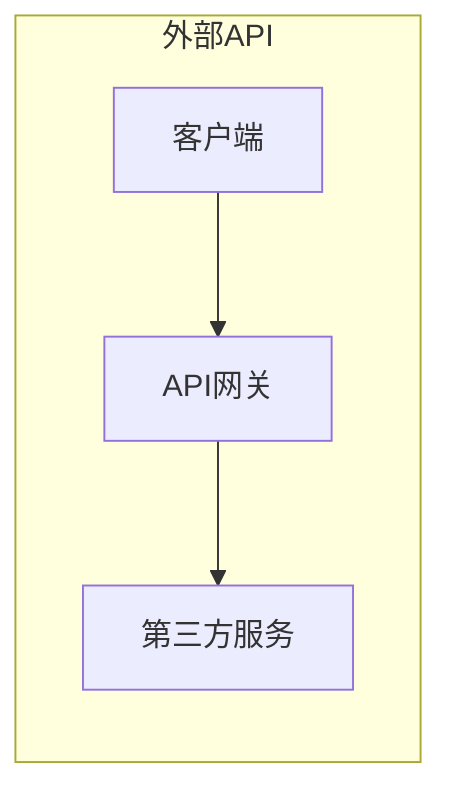

# 调用外部 API 的重要性

> 关键词：API, 外部服务, 开放接口, 微服务架构, 服务化, 接口设计, 软件开发, 云计算, API 网关, 安全性

## 1. 背景介绍

在当今的软件开发世界中，外部 API（应用程序编程接口）已经成为构建现代应用程序的关键组成部分。API 允许不同的系统和应用程序之间进行交互，提供了一种标准化的方式来访问数据和服务。本文将探讨调用外部 API 的关键重要性，分析其原理、实践应用，并展望未来发展趋势。

### 1.1 问题的由来

随着互联网的发展，软件应用程序的需求日益复杂化。现代应用程序往往需要集成来自不同来源的数据和服务，例如社交媒体、支付网关、地图服务、天气信息等。在这种情况下，手动实现所有这些功能不仅成本高昂，而且难以维护。外部 API 的出现为解决这些问题提供了一种高效、灵活的解决方案。

### 1.2 研究现状

外部 API 的使用已经成为了软件开发的标准实践。许多公司提供 API 来允许第三方开发者访问他们的服务和数据。例如，Google Maps API、Stripe API、Facebook Graph API 等都是广泛使用的例子。同时，云服务提供商如 AWS、Azure 和 Google Cloud 提供了大量的预构建 API，使得开发者可以轻松地集成各种功能。

### 1.3 研究意义

调用外部 API 对软件开发具有以下重要意义：

- **提高开发效率**：通过使用现成的 API，开发者可以快速集成功能，而不是从头开始构建。
- **降低成本**：使用外部 API 可以避免重复造轮子，减少开发时间和资源投入。
- **增强灵活性**：开发者可以根据需要选择不同的 API，构建更加灵活和可扩展的应用程序。
- **提高安全性**：外部 API 通常由专业的团队维护，可以提供更高的安全性和可靠性。

### 1.4 本文结构

本文将分为以下几个部分：

- 核心概念与联系
- 核心算法原理 & 具体操作步骤
- 数学模型和公式 & 详细讲解 & 举例说明
- 项目实践：代码实例和详细解释说明
- 实际应用场景
- 工具和资源推荐
- 总结：未来发展趋势与挑战
- 附录：常见问题与解答

## 2. 核心概念与联系

### 2.1 核心概念原理

API 是一种协议，它定义了应用程序之间如何相互交流和交换数据。外部 API 指的是由第三方提供的 API，这些 API 可以是 RESTful API、SOAP API 或其他任何形式的网络服务。

#### Mermaid 流程图



### 2.2 核心概念联系

外部 API 的使用通常涉及以下几个关键概念：

- **客户端**：发起 API 调用的应用程序。
- **API 网关**：一个中央服务，用于管理所有对外部 API 的调用，提供统一的接口，并可能执行安全性和速率限制等策略。
- **第三方服务**：提供 API 的服务或平台。

这些概念相互关联，共同构成了现代应用程序的微服务架构。

## 3. 核心算法原理 & 具体操作步骤

### 3.1 算法原理概述

调用外部 API 的核心原理是通过 HTTP 请求与第三方服务进行通信。客户端使用 API 网关发送请求，API 网关将请求转发到第三方服务，然后返回响应给客户端。

### 3.2 算法步骤详解

1. 客户端构建一个 HTTP 请求，包括请求方法、URL、请求头和（可选的）请求体。
2. 客户端通过 API 网关发送请求。
3. API 网关验证请求的有效性，如认证、速率限制等。
4. API 网关将请求转发到第三方服务。
5. 第三方服务处理请求并返回响应。
6. API 网关将响应转发回客户端。
7. 客户端处理响应。

### 3.3 算法优缺点

#### 优点

- **简化集成**：通过使用外部 API，可以快速集成第三方服务。
- **降低成本**：无需自行开发某些功能，可以节省开发和维护成本。
- **提高效率**：可以利用现有的服务，提高开发效率。

#### 缺点

- **依赖第三方**：应用程序依赖于外部服务，可能会受到第三方服务的限制。
- **安全性**：需要确保外部 API 的安全性，以防止数据泄露和滥用。
- **性能影响**：网络延迟和第三方服务的可用性可能会影响应用程序的性能。

### 3.4 算法应用领域

外部 API 可以应用于各种场景，包括：

- **身份验证和授权**：使用 OAuth、OpenID Connect 等服务进行用户身份验证。
- **支付处理**：集成 Stripe、PayPal 等支付网关处理在线支付。
- **地图服务**：使用 Google Maps、Mapbox 等服务在应用程序中嵌入地图。
- **天气信息**：集成天气 API 获取实时天气数据。
- **通知服务**：使用 Twilio、SendGrid 等服务发送短信或电子邮件通知。

## 4. 数学模型和公式 & 详细讲解 & 举例说明

### 4.1 数学模型构建

调用外部 API 的数学模型主要涉及 HTTP 请求和响应的格式。以下是一个简单的 HTTP 请求的数学模型：

$$
\text{HTTP 请求} = \text{请求行} + \text{请求头} + \text{空行} + \text{请求体}
$$

其中：

- **请求行**：包括请求方法、URL 和 HTTP 版本。
- **请求头**：包含关于请求和响应的元信息，如内容类型、认证信息等。
- **请求体**：包含请求的数据，如表单数据或 JSON 数据。

### 4.2 公式推导过程

HTTP 请求和响应的格式是定义良好的，遵循 HTTP 协议。公式推导过程主要涉及对 HTTP 协议的解析。

### 4.3 案例分析与讲解

以下是一个使用 Python 发送 HTTP 请求的示例：

```python
import requests

url = "https://api.example.com/data"
headers = {"Content-Type": "application/json"}
data = {"key": "value"}

response = requests.post(url, headers=headers, json=data)

print(response.status_code)
print(response.text)
```

在这个例子中，我们使用 `requests` 库发送一个 POST 请求到 `https://api.example.com/data`。我们设置了请求头，并发送了 JSON 数据。`response` 对象包含 HTTP 响应的状态码和响应体。

## 5. 项目实践：代码实例和详细解释说明

### 5.1 开发环境搭建

为了进行 API 调用，我们需要一个 Python 开发环境。以下是安装 Python 和相关库的步骤：

```bash
# 安装 Python
sudo apt-get install python3
python3 --version

# 安装 requests 库
pip install requests
```

### 5.2 源代码详细实现

以下是一个使用 `requests` 库调用外部 API 的 Python 示例：

```python
import requests

url = "https://api.example.com/data"
headers = {"Authorization": "Bearer your_access_token"}
data = {"query": "example"}

response = requests.post(url, headers=headers, json=data)

if response.status_code == 200:
    print("Data retrieved successfully:")
    print(response.json())
else:
    print("Failed to retrieve data:")
    print(response.status_code)
    print(response.text)
```

### 5.3 代码解读与分析

在这个示例中，我们使用 `requests.post` 方法发送一个 POST 请求到外部 API。我们设置了请求头，包括认证信息，并发送了 JSON 数据。如果请求成功，我们打印出返回的 JSON 数据；如果请求失败，我们打印出错误信息和状态码。

### 5.4 运行结果展示

假设外部 API 返回了以下 JSON 数据：

```json
{
  "data": {
    "result": "success",
    "value": "example data"
  }
}
```

运行上述代码将输出以下内容：

```
Data retrieved successfully:
{
  "data": {
    "result": "success",
    "value": "example data"
  }
}
```

## 6. 实际应用场景

外部 API 在各种实际应用场景中被广泛使用，以下是一些例子：

- **社交媒体集成**：允许用户通过应用程序分享内容到社交媒体平台。
- **支付处理**：集成在线支付系统，允许用户通过应用程序进行支付。
- **地图服务**：在应用程序中嵌入地图，提供地理位置信息。
- **天气预报**：显示当前和预测的天气信息。
- **新闻聚合**：从多个新闻源聚合新闻内容。

## 7. 工具和资源推荐

### 7.1 学习资源推荐

- 《RESTful API设计》
- 《Building Microservices》
- 《API Design for RESTful Web Services》

### 7.2 开发工具推荐

- Postman：用于测试和调试 API。
- Insomnia：另一个流行的 API 测试工具。
- Swagger：用于文档化和测试 API。

### 7.3 相关论文推荐

- 《API Design: A Comparison of RESTful vs. GraphQL》
- 《Microservices: The Evolution of Service-oriented Architecture》

## 8. 总结：未来发展趋势与挑战

### 8.1 研究成果总结

本文探讨了调用外部 API 的重要性，分析了其原理、实践应用，并展望了未来发展趋势。外部 API 为现代应用程序提供了强大的功能，但同时也带来了新的挑战。

### 8.2 未来发展趋势

- **API 网关的普及**：API 网关将成为管理外部 API 调用的标准方式。
- **无服务器架构**：无服务器架构将与外部 API 结合，提供更加灵活和可扩展的应用程序。
- **AI 集成**：外部 API 将集成人工智能和机器学习服务，提供智能化的功能。

### 8.3 面临的挑战

- **安全性**：需要确保外部 API 的安全性，以防止数据泄露和滥用。
- **可靠性**：需要确保外部服务的可靠性，以避免应用程序的中断。
- **性能**：需要优化 API 调用来提高应用程序的性能。

### 8.4 研究展望

未来，外部 API 将继续在软件开发中扮演重要角色。开发者需要关注最新的技术和最佳实践，以确保他们能够有效地利用外部 API。

## 9. 附录：常见问题与解答

**Q1：为什么使用外部 API 比自行开发功能更好？**

A：使用外部 API 可以节省开发时间和资源，提高效率，并利用现有的服务来提供更强大的功能。

**Q2：调用外部 API 有哪些安全风险？**

A：调用外部 API 的主要安全风险包括数据泄露、认证信息泄露和 DDoS 攻击。

**Q3：如何确保外部 API 的可靠性？**

A：确保外部 API 的可靠性可以通过使用可靠的服务提供商、进行冗余设计和设置适当的超时和重试策略来实现。

**Q4：如何优化 API 调用来提高应用程序的性能？**

A：优化 API 调用来提高性能可以通过缓存数据、使用异步调用和减少不必要的 API 调用来实现。

---

作者：禅与计算机程序设计艺术 / Zen and the Art of Computer Programming