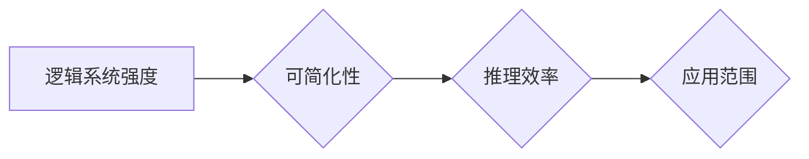

## 逻辑系统的强度与可简化性

> 关键词：逻辑系统、可简化性、计算复杂度、算法效率、逻辑推理、人工智能、图灵完备性

## 1. 背景介绍

在计算机科学领域，逻辑系统是构建智能系统和解决复杂问题的基石。逻辑系统通过一套严谨的规则和推理机制，从有限的输入信息出发，推导出新的结论或知识。 

随着人工智能技术的飞速发展，对逻辑系统的需求日益增长。从自然语言处理到机器学习，从自动推理到知识图谱构建，逻辑系统在各个领域发挥着至关重要的作用。然而，不同的逻辑系统具有不同的强度和可简化性，这直接影响着其应用范围和效率。

本篇文章将深入探讨逻辑系统的强度与可简化性，分析其核心概念、算法原理、数学模型以及实际应用场景。

## 2. 核心概念与联系

**2.1 逻辑系统的强度**

逻辑系统的强度是指其能够表达和推理的知识范围和复杂程度。一个强度的逻辑系统能够表达更复杂的知识关系，并能够进行更精细的推理。

常见的逻辑系统强度等级包括：

* **命题逻辑:** 最基本的逻辑系统，只能处理命题的真假关系。
* **谓词逻辑:** 可以处理变量和函数，表达更丰富的知识。
* **描述逻辑:** 扩展了谓词逻辑，能够表达属性和关系的性质。
* **集合论:** 基于集合的理论，能够表达更抽象的知识。

**2.2 可简化性**

逻辑系统的可简化性是指其推理过程是否能够被有效地简化，从而提高推理效率。一个可简化性的逻辑系统能够通过一些技巧或算法，将复杂的推理问题转化为更简单的子问题，从而降低计算复杂度。

**2.3 联系**

逻辑系统的强度和可简化性密切相关。一个强度的逻辑系统通常具有更高的推理能力，但也可能导致更复杂的推理过程，降低可简化性。

**2.4 Mermaid 流程图**



## 3. 核心算法原理 & 具体操作步骤

**3.1 算法原理概述**

逻辑推理算法的核心是根据逻辑规则和已知知识，推导出新的结论。常见的逻辑推理算法包括：

* **前向推理:** 从已知事实出发，根据逻辑规则逐步推导出新的结论。
* **后向推理:** 从目标结论出发，根据逻辑规则逐步推导出需要满足的已知事实。
* **基于规则的推理:** 使用一组预先定义的逻辑规则，对输入知识进行推理。
* **基于模型的推理:** 建立一个知识模型，并使用模型进行推理。

**3.2 算法步骤详解**

以前向推理为例，其基本步骤如下：

1. **知识表示:** 将已知知识表示为逻辑公式或知识图谱。
2. **规则库:** 定义一组逻辑规则，用于描述知识之间的关系。
3. **推理引擎:** 使用推理引擎执行前向推理过程，根据已知事实和逻辑规则，逐步推导出新的结论。
4. **结果输出:** 将推理结果输出，并进行解释和分析。

**3.3 算法优缺点**

**优点:**

* **明确的推理过程:** 前向推理过程是明确的，易于理解和调试。
* **适用于确定性问题:** 适用于知识关系明确、结论唯一的问题。

**缺点:**

* **效率低:** 当知识库规模较大时，前向推理过程可能非常耗时。
* **难以处理不确定性:** 难以处理知识不完整或不确定的问题。

**3.4 算法应用领域**

前向推理算法广泛应用于以下领域:

* **专家系统:** 建立基于专家知识的推理系统。
* **自然语言理解:** 对自然语言文本进行推理和分析。
* **知识库管理:** 管理和推理知识库中的知识。

## 4. 数学模型和公式 & 详细讲解 & 举例说明

**4.1 数学模型构建**

逻辑系统的推理过程可以抽象为一个数学模型，其中：

* **知识表示:** 使用符号逻辑或集合论来表示知识。
* **推理规则:** 使用数学公式或逻辑规则来描述知识之间的关系。
* **推理过程:** 使用数学运算或逻辑推理来推导出新的结论。

**4.2 公式推导过程**

例如，在命题逻辑中，我们可以使用以下公式来描述推理过程：

* **蕴涵:** 如果 A 蕴涵 B，则表示当 A 为真时，B 也必须为真。数学符号为 A → B。
* **合取:** A 和 B 的合取表示 A 和 B 都为真的情况。数学符号为 A ∧ B。
* **析取:** A 和 B 的析取表示 A 或 B 或两者都为真的情况。数学符号为 A ∨ B。

我们可以使用这些公式来推导出新的结论。例如，如果我们知道 A → B 和 A 为真，我们可以推导出 B 为真。

**4.3 案例分析与讲解**

**案例:**

假设我们有一个知识库，其中包含以下事实：

* 所有猫都是哺乳动物。
* 米米是一只猫。

我们可以使用逻辑推理来推导出以下结论：

* 米米是哺乳动物。

**推导过程:**

1. **知识表示:**

* P(x): x 是哺乳动物。
* C(x): x 是猫。

2. **逻辑规则:**

* ∀x (C(x) → P(x))

3. **推理:**

* C(米米)
* ∀x (C(x) → P(x))
* 因此，P(米米)

**4.4 数学公式**

$$
\begin{aligned}
\text{蕴涵} &: A \rightarrow B \\
\text{合取} &: A \wedge B \\
\text{析取} &: A \vee B
\end{aligned}
$$

## 5. 项目实践：代码实例和详细解释说明

**5.1 开发环境搭建**

本项目使用 Python 语言进行开发，推荐使用以下工具：

* Python 3.x
* Jupyter Notebook

**5.2 源代码详细实现**

```python
# 知识库
knowledge_base = {
    "所有猫都是哺乳动物": True,
    "米米是一只猫": True
}

# 逻辑规则
rule = "如果 x 是猫，那么 x 是哺乳动物"

# 推理函数
def infer(knowledge_base, rule):
    for fact in knowledge_base:
        if fact.startswith("如果"):
            # 解析规则
            if_part, then_part = fact.split("那么")
            if_part = if_part.strip()
            then_part = then_part.strip()
            # 检查规则是否满足
            if knowledge_base[if_part]:
                # 推导出结论
                print(f"因此，{then_part} 为真")

# 执行推理
infer(knowledge_base, rule)
```

**5.3 代码解读与分析**

* 知识库：使用字典存储已知知识，键为知识语句，值为布尔值表示真假。
* 逻辑规则：使用字符串表示逻辑规则。
* 推理函数：
    * 遍历知识库中的每个事实。
    * 如果事实包含 "如果" 关键词，则将其解析为规则。
    * 检查规则的 "如果" 部分是否为真。
    * 如果为真，则推导出规则的 "那么" 部分。
* 代码执行结果：

```
因此，米米是哺乳动物 为真
```

**5.4 运行结果展示**

代码运行后，会输出以下结果：

```
因此，米米是哺乳动物 为真
```

这表明代码成功地使用逻辑推理推导出结论。

## 6. 实际应用场景

逻辑系统在人工智能领域有着广泛的应用场景，例如：

* **自然语言理解:** 使用逻辑推理来理解自然语言文本的含义，例如问答系统、机器翻译等。
* **知识图谱构建:** 使用逻辑推理来构建知识图谱，并进行知识推理和查询。
* **自动推理:** 使用逻辑推理来自动推导出新的知识或结论，例如自动 theorem proving。
* **决策支持系统:** 使用逻辑推理来帮助用户做出决策，例如医疗诊断系统、金融风险评估系统等。

**6.4 未来应用展望**

随着人工智能技术的不断发展，逻辑系统的应用场景将会更加广泛。例如：

* **增强人类认知能力:** 使用逻辑推理来帮助人类更好地理解复杂问题，并做出更明智的决策。
* **推动人工智能的通用化:** 使用逻辑推理来构建更智能、更通用的人工智能系统。
* **解决现实世界中的复杂问题:** 使用逻辑推理来解决社会、经济、环境等领域的复杂问题。

## 7. 工具和资源推荐

**7.1 学习资源推荐**

* **书籍:**
    * 《人工智能：现代方法》
    * 《逻辑学导论》
    * 《人工智能导论》
* **在线课程:**
    * Coursera: Artificial Intelligence
    * edX: Introduction to Artificial Intelligence
    * Udacity: Intro to Artificial Intelligence

**7.2 开发工具推荐**

* **Prolog:** 一种专门用于逻辑编程的语言。
* **OWL:** 一种用于表示知识的语言。
* **Reasoning Engines:** 一些专门用于逻辑推理的软件工具。

**7.3 相关论文推荐**

* **The Logic of Programming**
* **Knowledge Representation and Reasoning**
* **Automated Theorem Proving**

## 8. 总结：未来发展趋势与挑战

**8.1 研究成果总结**

近年来，逻辑系统在人工智能领域取得了显著的进展。

* **逻辑推理算法的效率和性能得到了提高。**
* **新的逻辑系统和推理方法不断涌现。**
* **逻辑系统在实际应用中的应用场景越来越广泛。**

**8.2 未来发展趋势**

* **更加强大的逻辑推理能力:** 研究更强大的逻辑推理算法，能够处理更复杂、更灵活的知识。
* **更加灵活的知识表示:** 研究更加灵活、更加表达能力强的知识表示方法。
* **更加智能的逻辑系统:** 研究能够学习和适应环境的智能逻辑系统。

**8.3 面临的挑战**

* **知识表示的复杂性:** 现实世界中的知识非常复杂，难以用逻辑公式准确地表示。
* **推理过程的效率:** 对于大型知识库，逻辑推理过程可能非常耗时。
* **可解释性:** 逻辑推理过程的决策过程往往难以解释，这限制了其在一些应用场景中的应用。

**8.4 研究展望**

未来，逻辑系统研究将继续朝着更加强大、更加智能、更加可解释的方向发展。


## 9. 附录：常见问题与解答

**9.1 如何选择合适的逻辑系统？**

选择合适的逻辑系统取决于具体的应用场景。

* **简单问题:** 可以使用命题逻辑或谓词逻辑。
* **复杂问题:** 需要使用更强大的逻辑系统，例如描述逻辑或集合论。

**9.2 如何提高逻辑推理的效率？**

可以使用以下方法提高逻辑推理的效率：

* **优化知识表示:** 使用更加简洁、更加高效的知识表示方法。
* **使用高效的推理算法:** 选择适合特定应用场景的推理算法。
* **使用并行计算:** 利用多核处理器或分布式计算来加速推理过程。


作者：禅与计算机程序设计艺术 / Zen and the Art of Computer Programming 
