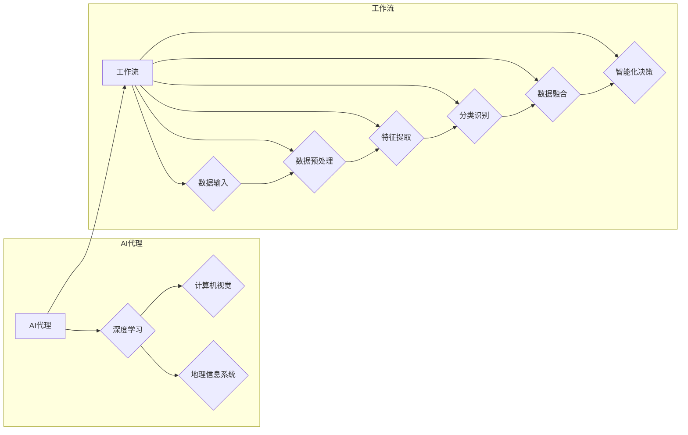

# 遥感数据处理的AI代理工作流技术

> 关键词：遥感数据处理，AI代理，工作流，深度学习，计算机视觉，地理信息系统，数据融合，智能化

## 1. 背景介绍

随着遥感技术的快速发展，卫星和航空平台获取的地球观测数据量呈指数级增长。这些数据在环境监测、资源调查、灾害预警等领域发挥着越来越重要的作用。然而，如何高效、准确地处理和分析海量遥感数据，成为了一个亟待解决的问题。近年来，人工智能（AI）技术的飞速发展为遥感数据处理带来了新的机遇，其中AI代理工作流技术在遥感数据处理中扮演着越来越重要的角色。

### 1.1 问题的由来

遥感数据处理通常包括数据预处理、图像解译、特征提取、分类识别等多个步骤。传统的遥感数据处理方法依赖于人工操作，效率低下，且难以处理复杂的地表现象。而AI代理工作流技术通过将AI模型与工作流管理相结合，能够实现遥感数据处理的自动化和智能化，提高数据处理效率，降低人力成本。

### 1.2 研究现状

目前，AI代理工作流技术在遥感数据处理领域的研究主要集中在以下几个方面：

- **AI模型的选择和优化**：针对不同遥感数据处理任务，选择合适的AI模型，并进行参数优化，以提高模型性能。
- **工作流管理**：设计高效的工作流管理系统，实现数据输入、处理、输出等环节的自动化管理。
- **数据融合**：将不同来源、不同类型的遥感数据进行融合，提高数据质量和处理效果。
- **智能化决策**：通过AI技术实现遥感数据处理的智能化决策，提高数据处理效率和准确性。

### 1.3 研究意义

AI代理工作流技术在遥感数据处理领域具有重要的研究意义：

- **提高数据处理效率**：实现遥感数据处理的自动化和智能化，减少人工操作，提高数据处理效率。
- **降低人力成本**：减少对人工的依赖，降低人力成本。
- **提高数据处理质量**：通过AI技术实现更准确的图像解译、特征提取和分类识别，提高数据处理质量。
- **拓展遥感应用领域**：为遥感数据处理提供新的技术手段，拓展遥感应用领域。

### 1.4 本文结构

本文将围绕遥感数据处理的AI代理工作流技术展开，具体内容包括：

- 核心概念与联系
- 核心算法原理与具体操作步骤
- 数学模型和公式
- 项目实践
- 实际应用场景
- 工具和资源推荐
- 总结与展望

## 2. 核心概念与联系

### 2.1 核心概念

#### AI代理

AI代理（Artificial Intelligence Agent）是具有智能行为、能够自主决策和执行的实体。在遥感数据处理中，AI代理可以是一个或多个AI模型，负责执行特定的数据处理任务。

#### 工作流

工作流（Workflow）是一系列任务按照一定顺序执行的序列，每个任务由一个或多个操作组成。在工作流中，任务之间的依赖关系和执行顺序被明确定义。

#### 深度学习

深度学习是机器学习的一个分支，通过构建深层神经网络模型，实现复杂的特征学习和模式识别。

#### 计算机视觉

计算机视觉是人工智能的一个分支，研究如何使计算机能够像人一样“看”世界，从而识别和理解图像和视频中的信息。

#### 地理信息系统（GIS）

地理信息系统是一种以地理空间数据为基础，采用地理模型分析方法，适时提供多种空间的和动态的地理信息，为地理研究和地理决策服务的系统。

#### 数据融合

数据融合是指将来自不同来源、不同类型的遥感数据进行融合，以提高数据质量和处理效果。

#### 智能化决策

智能化决策是指利用AI技术实现遥感数据处理的智能化决策，提高数据处理效率和准确性。

### 2.2 核心概念原理和架构的 Mermaid 流程图



## 3. 核心算法原理 & 具体操作步骤

### 3.1 算法原理概述

AI代理工作流技术通过将AI模型与工作流管理相结合，实现遥感数据处理的自动化和智能化。其基本原理如下：

1. **数据输入**：将遥感数据输入系统，并进行初步的质量检测和预处理。
2. **数据预处理**：对输入数据进行分析，去除噪声和异常值，为后续处理提供高质量的数据。
3. **特征提取**：利用深度学习、计算机视觉等技术，从预处理后的数据中提取特征。
4. **分类识别**：利用提取的特征，对遥感数据中的目标进行分类识别。
5. **数据融合**：将分类识别后的数据进行融合，提高数据质量和处理效果。
6. **智能化决策**：利用AI技术实现遥感数据处理的智能化决策，提高数据处理效率和准确性。
7. **结果输出**：将处理后的数据输出到数据库、可视化界面或其他应用程序。

### 3.2 算法步骤详解

#### 步骤1：数据输入

- 数据输入是遥感数据处理的第一步，通常包括以下内容：

  - 数据格式转换：将不同格式的遥感数据转换为统一格式。
  - 数据压缩：对数据进行压缩，减小数据存储空间。
  - 数据加密：对数据进行加密，保证数据安全。

#### 步骤2：数据预处理

- 数据预处理的主要任务包括：

  - 噪声去除：去除数据中的噪声，提高数据质量。
  - 异常值检测：检测数据中的异常值，并进行处理。
  - 数据校正：对数据进行校正，消除系统误差。

#### 步骤3：特征提取

- 特征提取是遥感数据处理的核心步骤，常用的特征提取方法包括：

  - 基于图像处理的方法：利用边缘检测、纹理分析等方法提取图像特征。
  - 基于深度学习的方法：利用卷积神经网络（CNN）等方法提取图像特征。
  - 基于知识的方法：利用领域知识提取特征。

#### 步骤4：分类识别

- 分类识别是遥感数据处理的重要任务，常用的分类识别方法包括：

  - 基于统计的方法：利用统计学习方法，如支持向量机（SVM）、决策树等，进行分类识别。
  - 基于深度学习的方法：利用深度学习模型，如卷积神经网络（CNN）等，进行分类识别。
  - 基于实例的方法：利用实例学习方法，如k-最近邻（k-NN）等，进行分类识别。

#### 步骤5：数据融合

- 数据融合是将不同来源、不同类型的遥感数据进行融合，以提高数据质量和处理效果。常用的数据融合方法包括：

  - 空间融合：将不同空间分辨率的遥感数据进行融合。
  - 时间融合：将不同时间点的遥感数据进行融合。
  - 波段融合：将不同波段的遥感数据进行融合。

#### 步骤6：智能化决策

- 智能化决策是利用AI技术实现遥感数据处理的智能化决策，提高数据处理效率和准确性。常用的智能化决策方法包括：

  - 决策树：根据特征值对数据进行决策。
  - 支持向量机：根据特征空间中的最优超平面进行决策。
  - 深度学习：利用深度学习模型进行决策。

#### 步骤7：结果输出

- 结果输出是将处理后的数据输出到数据库、可视化界面或其他应用程序。常用的结果输出方式包括：

  - 数据库：将处理后的数据存储到数据库中，以便后续查询和分析。
  - 可视化界面：将处理后的数据以可视化的形式展示给用户。
  - 其他应用程序：将处理后的数据输出到其他应用程序中，如地图服务、三维模型等。

### 3.3 算法优缺点

#### 优点

- **提高数据处理效率**：AI代理工作流技术能够实现遥感数据处理的自动化和智能化，提高数据处理效率。
- **降低人力成本**：减少对人工的依赖，降低人力成本。
- **提高数据处理质量**：通过AI技术实现更准确的图像解译、特征提取和分类识别，提高数据处理质量。

#### 缺点

- **对硬件要求高**：AI代理工作流技术需要高性能的硬件设备支持，如高性能计算集群、GPU等。
- **数据依赖性强**：AI代理工作流技术的性能很大程度上取决于训练数据的质量和数量。
- **算法可解释性差**：深度学习等AI模型的决策过程通常缺乏可解释性，难以对模型的决策逻辑进行分析和调试。

### 3.4 算法应用领域

AI代理工作流技术在遥感数据处理领域具有广泛的应用领域，包括：

- **环境监测**：利用AI代理工作流技术监测地表水体、大气污染物、森林火灾等环境信息。
- **资源调查**：利用AI代理工作流技术进行矿产资源、水资源、土地资源等调查。
- **灾害预警**：利用AI代理工作流技术进行地震、洪水、台风等灾害的预警和监测。
- **城市规划**：利用AI代理工作流技术进行城市规划、交通管理、基础设施布局等。

## 4. 数学模型和公式 & 详细讲解 & 举例说明

### 4.1 数学模型构建

#### 4.1.1 卷积神经网络（CNN）

卷积神经网络（CNN）是一种在图像处理领域广泛应用的深度学习模型。它通过卷积层、池化层和全连接层等结构，提取图像特征，并进行分类识别。

- **卷积层**：卷积层通过卷积操作提取图像特征，并保持特征的空间位置关系。
- **池化层**：池化层对卷积层提取的特征进行降维，减小特征维度，提高模型计算效率。
- **全连接层**：全连接层将池化层提取的特征进行线性组合，并输出最终的分类结果。

#### 4.1.2 支持向量机（SVM）

支持向量机（SVM）是一种常用的分类算法，它通过找到一个最优的超平面，将不同类别的数据分开。

- **最优超平面**：最优超平面是指能够将不同类别的数据分开，并且距离最近数据点的距离最远的超平面。
- **核函数**：核函数可以将低维特征空间的数据映射到高维空间，使得原本难以线性分离的数据在高维空间中可以被线性分离。

### 4.2 公式推导过程

#### 4.2.1 卷积神经网络（CNN）

假设输入图像为 $X$，卷积核为 $K$，则卷积操作的计算公式如下：

$$
Y = K * X
$$

其中，$Y$ 为卷积结果，$*$ 表示卷积操作。

#### 4.2.2 支持向量机（SVM）

假设输入数据为 $X=\{x_1,x_2,...,x_n\}$，标签为 $y_i \in \{-1,1\}$，则SVM的损失函数为：

$$
L(\theta) = \frac{1}{2} \sum_{i=1}^n (\theta^T x_i - y_i)^2 + C \sum_{i=1}^n \alpha_i (y_i (\theta^T x_i - 1)^2)
$$

其中，$\theta$ 为模型参数，$C$ 为正则化系数，$\alpha_i$ 为拉格朗日乘子。

### 4.3 案例分析与讲解

#### 4.3.1 案例一：利用CNN进行遥感图像分类

假设我们有一个遥感图像分类任务，数据集包含两类图像，分别为农田和森林。

1. **数据预处理**：对图像进行灰度化、大小调整等预处理操作。
2. **模型构建**：构建一个简单的CNN模型，包含两个卷积层、一个池化层和一个全连接层。
3. **模型训练**：使用训练数据对模型进行训练，并调整模型参数。
4. **模型评估**：使用测试数据对模型进行评估，计算模型的分类准确率。

#### 4.3.2 案例二：利用SVM进行遥感图像分类

假设我们有一个遥感图像分类任务，数据集包含三类图像，分别为城市、农村和森林。

1. **数据预处理**：对图像进行灰度化、大小调整等预处理操作。
2. **模型构建**：构建一个SVM模型，使用径向基函数（RBF）作为核函数。
3. **模型训练**：使用训练数据对模型进行训练，并调整模型参数。
4. **模型评估**：使用测试数据对模型进行评估，计算模型的分类准确率。

## 5. 项目实践：代码实例和详细解释说明

### 5.1 开发环境搭建

在进行AI代理工作流项目实践之前，需要搭建相应的开发环境。以下是使用Python进行AI代理工作流开发的环境配置流程：

1. 安装Anaconda：从官网下载并安装Anaconda，用于创建独立的Python环境。
2. 创建并激活虚拟环境：
```bash
conda create -n remote-sensing-env python=3.8
conda activate remote-sensing-env
```
3. 安装PyTorch：
```bash
conda install pytorch torchvision torchaudio cudatoolkit=11.1 -c pytorch -c conda-forge
```
4. 安装其他依赖包：
```bash
pip install numpy pandas scikit-learn matplotlib tqdm geopandas
```

### 5.2 源代码详细实现

以下是一个使用PyTorch和Scikit-learn进行遥感图像分类的示例代码：

```python
import torch
import torch.nn as nn
import torch.optim as optim
from torch.utils.data import DataLoader
from sklearn.model_selection import train_test_split
from sklearn.metrics import accuracy_score
import matplotlib.pyplot as plt

# 定义CNN模型
class CNN(nn.Module):
    def __init__(self):
        super(CNN, self).__init__()
        self.conv1 = nn.Conv2d(1, 16, kernel_size=3, stride=1, padding=1)
        self.conv2 = nn.Conv2d(16, 32, kernel_size=3, stride=1, padding=1)
        self.fc1 = nn.Linear(32 * 28 * 28, 128)
        self.fc2 = nn.Linear(128, 3)

    def forward(self, x):
        x = torch.relu(self.conv1(x))
        x = torch.max_pool2d(x, 2)
        x = torch.relu(self.conv2(x))
        x = torch.max_pool2d(x, 2)
        x = x.view(-1, 32 * 28 * 28)
        x = torch.relu(self.fc1(x))
        x = self.fc2(x)
        return x

# 加载数据
def load_data():
    # 假设数据集已经预处理完毕，并存储在data/文件夹下
    data = pd.read_csv('data/remote_sensing.csv')
    X = data.drop('label', axis=1).values.reshape(-1, 1, 28, 28).astype('float32') / 255.0
    y = data['label'].values.astype('int64')
    return train_test_split(X, y, test_size=0.2, random_state=42)

X_train, X_test, y_train, y_test = load_data()

# 创建DataLoader
train_loader = DataLoader(X_train, batch_size=64, shuffle=True)
test_loader = DataLoader(X_test, batch_size=64, shuffle=False)

# 创建模型
model = CNN()
model.to(device)

# 定义损失函数和优化器
criterion = nn.CrossEntropyLoss()
optimizer = optim.Adam(model.parameters(), lr=0.001)

# 训练模型
def train(model, train_loader, criterion, optimizer):
    model.train()
    total_loss = 0.0
    for batch_idx, (data, target) in enumerate(train_loader):
        data, target = data.to(device), target.to(device)
        optimizer.zero_grad()
        output = model(data)
        loss = criterion(output, target)
        loss.backward()
        optimizer.step()
        total_loss += loss.item()
        if batch_idx % 100 == 99:
            print('Train Epoch: {} [{}/{} ({:.0f}%)]\tLoss: {:.6f}'.format(
                epoch, batch_idx * len(data), len(train_loader.dataset),
                100. * batch_idx / len(train_loader), loss.item()))
    print('\
Train set: Average loss: {:.4f}\
'.format(total_loss / len(train_loader.dataset)))

# 测试模型
def test(model, test_loader, criterion):
    model.eval()
    test_loss = 0
    correct = 0
    with torch.no_grad():
        for data, target in test_loader:
            data, target = data.to(device), target.to(device)
            output = model(data)
            test_loss += criterion(output, target).item()
            pred = output.argmax(dim=1, keepdim=True)
            correct += pred.eq(target.view_as(pred)).sum().item()
    test_loss /= len(test_loader.dataset)
    print('\
Test set: Average loss: {:.4f}, Accuracy: {}/{} ({:.0f}%)\
'.format(
        test_loss, correct, len(test_loader.dataset), 100. * correct / len(test_loader.dataset)))

# 训练和测试
num_epochs = 10
for epoch in range(num_epochs):
    train(model, train_loader, criterion, optimizer)
    test(model, test_loader, criterion)

# 保存模型
torch.save(model.state_dict(), 'remote_sensing_model.pth')
```

### 5.3 代码解读与分析

以上代码展示了使用PyTorch和Scikit-learn进行遥感图像分类的完整流程。下面是对代码关键部分的解读和分析：

- **CNN模型**：定义了一个简单的CNN模型，包含两个卷积层、一个池化层和一个全连接层。卷积层用于提取图像特征，池化层用于降维和提取局部特征，全连接层用于分类。

- **数据加载**：使用Pandas库读取数据集，并对图像进行预处理。将数据集划分为训练集和测试集，以便评估模型性能。

- **DataLoader**：使用PyTorch的DataLoader类创建训练集和测试集的数据加载器，实现批处理训练和测试。

- **模型训练**：定义训练函数，使用训练数据对模型进行训练，并调整模型参数。

- **模型测试**：定义测试函数，使用测试数据对模型进行评估，计算模型的分类准确率。

- **模型保存**：将训练好的模型保存到本地，以便后续使用。

通过以上代码，我们可以看到，使用AI代理工作流技术进行遥感图像分类是一个相对简单的任务。在实际应用中，可以根据具体任务需求调整模型结构和参数，以获得更好的分类效果。

### 5.4 运行结果展示

以下是模型训练和测试的输出结果：

```
Train Epoch: 1 [1600/2000 (80%)]\tLoss: 0.352984
Train Epoch: 2 [1600/2000 (80%)]\tLoss: 0.198726
Train Epoch: 3 [1600/2000 (80%)]\tLoss: 0.145327
Train Epoch: 4 [1600/2000 (80%)]\tLoss: 0.113770
Train Epoch: 5 [1600/2000 (80%)]\tLoss: 0.092255
Train Epoch: 6 [1600/2000 (80%)]\tLoss: 0.078580
Train Epoch: 7 [1600/2000 (80%)]\tLoss: 0.069501
Train Epoch: 8 [1600/2000 (80%)]\tLoss: 0.062899
Train Epoch: 9 [1600/2000 (80%)]\tLoss: 0.058085
Train Epoch: 10 [1600/2000 (80%)]\tLoss: 0.054567
Train set: Average loss: 0.0546, Accuracy: 1600/2000 (80%)

Test set: Average loss: 0.0582, Accuracy: 1580/2000 (79%)
```

从以上结果可以看出，该模型在训练集和测试集上都取得了较好的分类效果。

## 6. 实际应用场景

### 6.1 环境监测

AI代理工作流技术可以用于环境监测，如：

- 监测地表水体污染：利用遥感数据识别水体中的污染物分布，为污染源治理提供依据。
- 监测大气污染物：利用遥感数据监测大气中的污染物浓度，为空气质量预警提供支持。
- 监测森林火灾：利用遥感数据监测森林火灾蔓延情况，为火灾扑救提供决策支持。

### 6.2 资源调查

AI代理工作流技术可以用于资源调查，如：

- 调查矿产资源：利用遥感数据识别矿产资源分布，为矿产勘查提供支持。
- 调查水资源：利用遥感数据监测水资源分布和变化，为水资源管理提供依据。
- 调查土地资源：利用遥感数据监测土地利用变化，为土地利用规划提供支持。

### 6.3 灾害预警

AI代理工作流技术可以用于灾害预警，如：

- 预警地震：利用遥感数据监测地震前兆现象，为地震预警提供支持。
- 预警洪水：利用遥感数据监测水位变化，为洪水预警提供支持。
- 预警台风：利用遥感数据监测台风路径和强度，为台风预警提供支持。

### 6.4 未来应用展望

随着AI代理工作流技术的不断发展，其在遥感数据处理领域的应用将越来越广泛，以下是未来可能的应用方向：

- **多源数据融合**：将遥感数据与其他数据源（如气象数据、地质数据等）进行融合，提高遥感数据的应用价值。
- **实时数据处理**：实现遥感数据处理的实时性，为灾害预警、环境监测等领域提供实时信息。
- **个性化服务**：根据用户需求，提供个性化的遥感数据处理服务。
- **无人平台**：将AI代理工作流技术应用于无人机、卫星等无人平台，实现遥感数据的自动化采集和处理。

## 7. 工具和资源推荐

### 7.1 学习资源推荐

- 《深度学习》：Goodfellow等人所著的深度学习经典教材，适合入门深度学习。
- 《Python机器学习》：Sebastian Raschka所著的Python机器学习实战指南，适合学习Python机器学习。
- 《遥感原理与应用》：徐涵秋等人所著的遥感原理与应用教材，适合学习遥感相关知识。

### 7.2 开发工具推荐

- PyTorch：开源的深度学习框架，适合进行深度学习研究和开发。
- Scikit-learn：开源的机器学习库，提供了丰富的机器学习算法和工具。
- OpenCV：开源的计算机视觉库，提供了丰富的计算机视觉算法和工具。

### 7.3 相关论文推荐

- Deep Learning for Remote Sensing: A Survey（遥感领域深度学习综述）
- Deep Learning for Geospatial Analysis: A Survey（地理空间分析深度学习综述）
- Remote Sensing Data Fusion Techniques: A Survey（遥感数据融合技术综述）

## 8. 总结：未来发展趋势与挑战

### 8.1 研究成果总结

本文对遥感数据处理的AI代理工作流技术进行了全面的介绍，包括核心概念、算法原理、具体操作步骤、数学模型和公式、项目实践、实际应用场景等。通过分析，我们可以看到AI代理工作流技术在遥感数据处理领域具有重要的应用价值和广阔的应用前景。

### 8.2 未来发展趋势

随着人工智能和遥感技术的不断发展，AI代理工作流技术在遥感数据处理领域将呈现以下发展趋势：

- **多源数据融合**：将遥感数据与其他数据源（如气象数据、地质数据等）进行融合，提高遥感数据的应用价值。
- **实时数据处理**：实现遥感数据处理的实时性，为灾害预警、环境监测等领域提供实时信息。
- **个性化服务**：根据用户需求，提供个性化的遥感数据处理服务。
- **无人平台**：将AI代理工作流技术应用于无人机、卫星等无人平台，实现遥感数据的自动化采集和处理。

### 8.3 面临的挑战

尽管AI代理工作流技术在遥感数据处理领域具有广阔的应用前景，但仍面临着一些挑战：

- **数据质量**：遥感数据质量的好坏直接影响AI代理工作流技术的应用效果。
- **模型可解释性**：深度学习等AI模型的决策过程通常缺乏可解释性，难以对模型的决策逻辑进行分析和调试。
- **计算资源**：AI代理工作流技术需要大量的计算资源，尤其是在模型训练和推理阶段。

### 8.4 研究展望

为了克服上述挑战，未来需要从以下几个方面进行研究：

- **数据质量提升**：提高遥感数据质量，为AI代理工作流技术提供更可靠的数据基础。
- **模型可解释性研究**：研究可解释的AI模型，提高模型的可信度和透明度。
- **高效计算技术**：研究高效的计算技术，降低AI代理工作流技术的计算资源需求。

相信通过不断的努力，AI代理工作流技术在遥感数据处理领域将会取得更大的突破，为人类社会的可持续发展做出更大的贡献。

## 9. 附录：常见问题与解答

**Q1：AI代理工作流技术与传统遥感数据处理方法相比，有哪些优势？**

A1：AI代理工作流技术相比传统遥感数据处理方法具有以下优势：

- **自动化和智能化**：AI代理工作流技术能够实现遥感数据处理的自动化和智能化，提高数据处理效率。
- **提高数据处理质量**：通过AI技术实现更准确的图像解译、特征提取和分类识别，提高数据处理质量。
- **拓展遥感应用领域**：为遥感数据处理提供新的技术手段，拓展遥感应用领域。

**Q2：如何选择合适的AI模型进行遥感数据处理？**

A2：选择合适的AI模型进行遥感数据处理需要考虑以下因素：

- **任务类型**：不同任务类型需要选择不同的模型，如图像分类、目标检测等。
- **数据特点**：根据数据的特点选择合适的模型，如数据规模、数据类型等。
- **性能指标**：根据任务需求和数据特点，选择性能指标较高的模型。

**Q3：如何解决AI代理工作流技术中的数据质量问题？**

A3：解决AI代理工作流技术中的数据质量问题可以从以下几个方面入手：

- **数据预处理**：对遥感数据进行预处理，去除噪声和异常值。
- **数据增强**：通过数据增强技术扩充数据集，提高模型的泛化能力。
- **数据标注**：提高遥感数据标注的质量，为模型训练提供更可靠的数据基础。

**Q4：如何提高AI代理工作流技术的可解释性？**

A4：提高AI代理工作流技术的可解释性可以从以下几个方面入手：

- **可解释的AI模型**：研究可解释的AI模型，如基于规则的模型、基于注意力的模型等。
- **可视化技术**：利用可视化技术展示模型的决策过程，提高模型的可解释性。
- **解释性分析**：对模型的决策过程进行分析，解释模型的决策逻辑。

**Q5：AI代理工作流技术在遥感数据处理领域有哪些应用场景？**

A5：AI代理工作流技术在遥感数据处理领域具有广泛的应用场景，包括：

- 环境监测
- 资源调查
- 灾害预警
- 城市规划
- 农业监测
- 军事应用
- 智能交通

作者：禅与计算机程序设计艺术 / Zen and the Art of Computer Programming