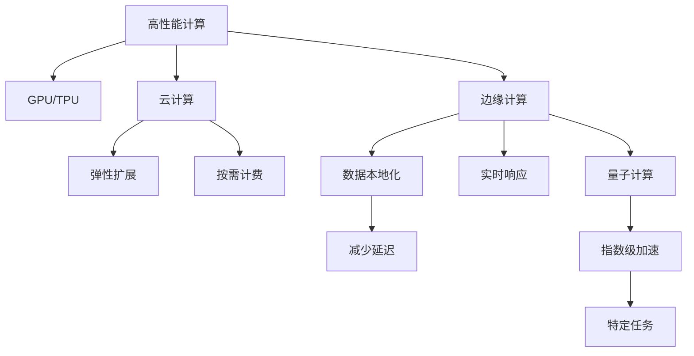
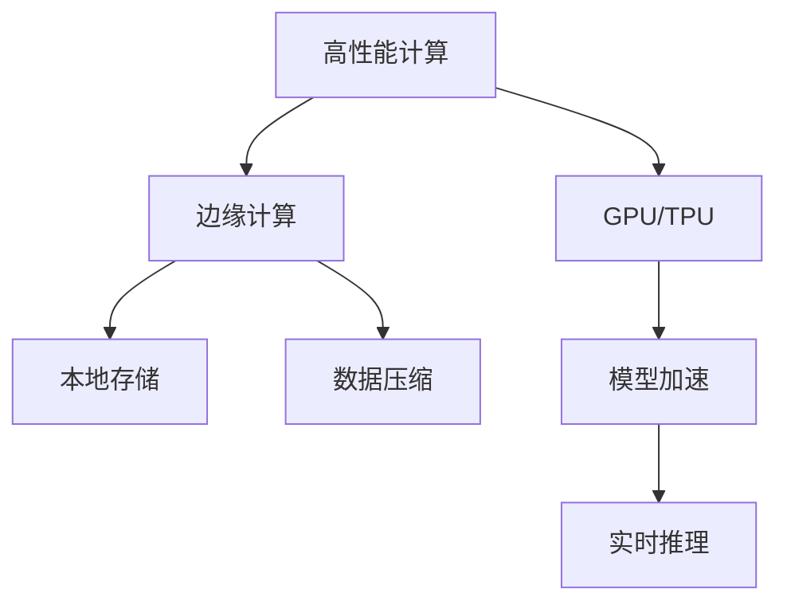
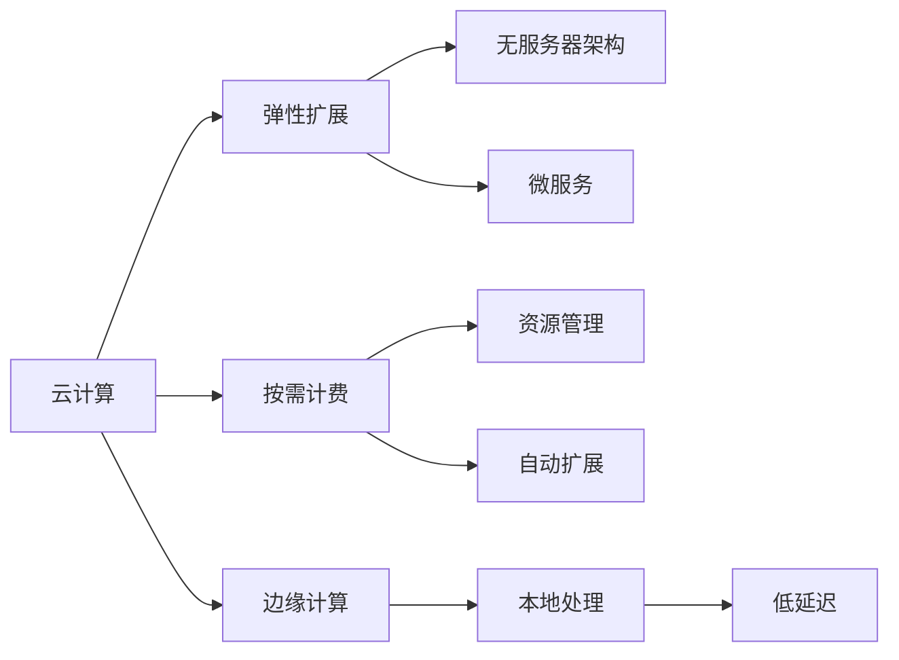
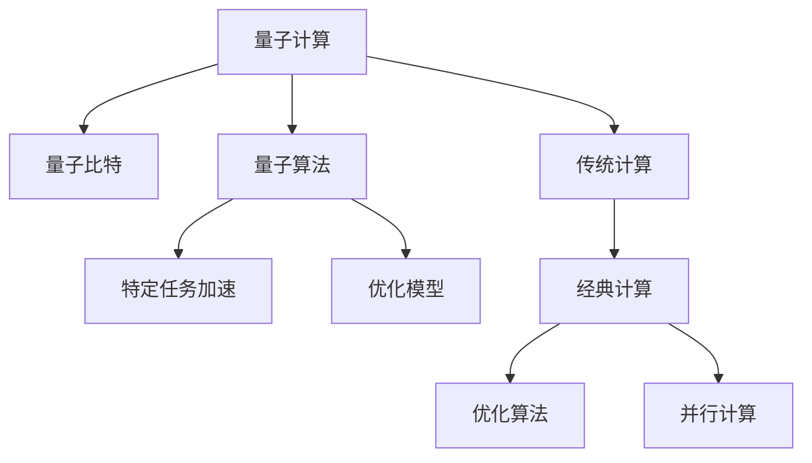
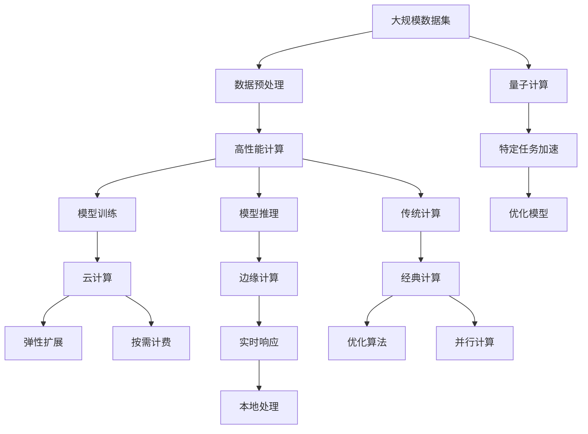

                 

# AI计算变化中的新机遇

> 关键词：人工智能,计算技术,数据密集型应用,量子计算,边缘计算

## 1. 背景介绍

### 1.1 问题由来

近年来，人工智能（AI）技术的迅猛发展给各行各业带来了深刻的变革。从传统的图像识别、语音识别、自然语言处理到复杂的智能决策支持系统，AI的应用领域不断扩大。同时，计算技术的进步，尤其是高性能计算和大数据技术的融合，推动了AI应用性能的提升。但与此同时，AI计算带来了巨大的挑战，如计算资源需求的大幅增加、数据隐私和安全问题、计算效率与成本的平衡等。如何应对这些挑战，同时抓住AI计算带来的新机遇，是当前学术界和工业界共同关心的热点问题。

### 1.2 问题核心关键点

AI计算的核心在于如何高效、安全地处理和分析海量数据，从而实现智能决策。计算技术在这一过程中扮演着关键角色，其发展和变化直接影响AI的性能与效果。当前，计算技术的发展主要体现在以下几个方面：

- **高性能计算**：如GPU、TPU等加速器的出现，显著提升了AI模型的训练和推理速度。
- **云计算**：基于云平台的海量计算资源提供了弹性扩展的解决方案。
- **边缘计算**：将计算资源部署到设备端，减少数据传输延迟，提升实时响应速度。
- **量子计算**：有望在特定领域实现指数级计算能力的提升。

AI计算的这些技术发展，不仅提升了计算效率和性能，也为AI技术的落地应用开辟了新的途径。本节旨在探讨AI计算中的这些变化及其带来的新机遇，并分析其对未来AI发展的影响。

### 1.3 问题研究意义

了解AI计算的最新发展及其对AI应用的影响，对于科研人员、技术开发者以及行业从业者具有重要意义：

1. **科研人员**：掌握最新的计算技术，可以帮助他们在AI研究中更快地迭代模型和算法，提升科研效率。
2. **技术开发者**：理解计算技术如何影响AI应用的性能和成本，可以优化系统设计，提升用户体验。
3. **行业从业者**：洞察计算技术的发展趋势，可以更好地规划业务发展和产品迭代，抓住市场先机。

## 2. 核心概念与联系

### 2.1 核心概念概述

为更好地理解AI计算的变化及其带来的机遇，本节将介绍几个密切相关的核心概念：

- **高性能计算**：指使用高性能硬件（如GPU、TPU）进行高速计算的技术，广泛应用于AI模型的训练和推理。
- **云计算**：通过互联网提供的按需扩展的计算资源，支持大规模数据处理和模型训练。
- **边缘计算**：将计算任务在本地设备上执行，以减少数据传输延迟和提高实时性。
- **量子计算**：利用量子比特（qubit）进行计算，有望在特定任务上实现指数级加速。

这些概念之间的逻辑关系可以通过以下Mermaid流程图来展示：



这个流程图展示了一系列计算技术及其应用场景，帮助理解它们之间的关系和作用。

### 2.2 概念间的关系

这些核心概念之间存在着紧密的联系，形成了AI计算的完整生态系统。下面我通过几个Mermaid流程图来展示这些概念之间的关系。

#### 2.2.1 高性能计算与边缘计算



这个流程图展示了高性能计算和边缘计算之间的互补关系。高性能计算在数据中心提供高吞吐量的计算能力，而边缘计算则将计算资源部署到本地设备，缩短数据传输时间和提升实时响应速度。

#### 2.2.2 云计算与边缘计算



这个流程图展示了云计算与边缘计算的集成应用。云计算提供了灵活的资源管理和大规模计算能力，而边缘计算则在数据本地进行处理，减少延迟和提升实时性，两者结合可以满足不同场景的需求。

#### 2.2.3 量子计算与传统计算



这个流程图展示了量子计算与传统计算的关系。量子计算在某些特定任务上提供了指数级加速，而传统计算在更广泛的场景中仍占主导地位。两者可以互补应用，提升整体计算效率。

### 2.3 核心概念的整体架构

最后，我们用一个综合的流程图来展示这些核心概念在大规模AI应用中的整体架构：



这个综合流程图展示了从数据预处理到模型推理的完整流程，以及各种计算技术的融合应用。通过理解这些核心概念，可以更好地把握AI计算的演变趋势，并为未来AI技术的发展提供指导。

## 3. 核心算法原理 & 具体操作步骤
### 3.1 算法原理概述

AI计算的核心在于高效、安全地处理和分析海量数据，从而实现智能决策。计算技术在这一过程中扮演着关键角色，其发展和变化直接影响AI的性能与效果。当前，计算技术的发展主要体现在以下几个方面：

- **高性能计算**：如GPU、TPU等加速器的出现，显著提升了AI模型的训练和推理速度。
- **云计算**：基于云平台的海量计算资源提供了弹性扩展的解决方案。
- **边缘计算**：将计算资源部署到设备端，减少数据传输延迟，提升实时响应速度。
- **量子计算**：利用量子比特（qubit）进行计算，有望在特定领域实现指数级计算能力的提升。

### 3.2 算法步骤详解

1. **数据预处理**：
   - 收集并整理大规模数据集，进行清洗和标注。
   - 将数据划分为训练集、验证集和测试集。

2. **模型训练**：
   - 选择合适的模型架构，如卷积神经网络（CNN）、循环神经网络（RNN）、变压器（Transformer）等。
   - 利用高性能计算资源（如GPU、TPU）进行模型训练，使用反向传播算法更新模型参数。

3. **模型推理**：
   - 将训练好的模型部署到目标环境中，进行实时推理和预测。
   - 利用边缘计算技术，在本地设备上进行快速响应和计算。

4. **优化与调参**：
   - 使用交叉验证等方法进行模型优化，提升模型性能。
   - 调整超参数，如学习率、批量大小、正则化系数等，确保模型在验证集上取得最佳性能。

5. **评估与部署**：
   - 在测试集上评估模型性能，对比基线模型的表现。
   - 将模型部署到实际应用环境中，进行实时监控和优化。

### 3.3 算法优缺点

**高性能计算**：
- **优点**：显著提升模型训练和推理速度，支持大规模数据处理。
- **缺点**：硬件成本较高，需要较高的技术门槛。

**云计算**：
- **优点**：按需扩展，灵活使用计算资源，降低硬件维护成本。
- **缺点**：网络延迟和数据传输影响实时性，可能存在数据隐私和安全问题。

**边缘计算**：
- **优点**：减少数据传输延迟，提升实时响应速度，本地处理保护数据隐私。
- **缺点**：计算资源有限，可能存在计算瓶颈和数据冗余问题。

**量子计算**：
- **优点**：在特定领域实现指数级加速，支持复杂问题的解决。
- **缺点**：技术尚不成熟，存在硬件成本高、错误率高的问题。

### 3.4 算法应用领域

AI计算技术已经广泛应用于多个领域，包括但不限于以下几个方面：

- **医疗**：利用AI进行疾病诊断、治疗方案推荐、基因组分析等。
- **金融**：进行信用评估、风险控制、市场预测等。
- **自动驾驶**：实现实时决策、环境感知、路径规划等。
- **智能制造**：进行质量检测、预测维护、生产优化等。
- **智能家居**：实现语音识别、场景理解、智能控制等。

以上领域的应用展示了AI计算技术的广泛潜力和实际价值。未来，随着计算技术的发展，AI计算将在更多行业和场景中发挥重要作用。

## 4. 数学模型和公式 & 详细讲解 & 举例说明
### 4.1 数学模型构建

在本节中，我们将使用数学语言对AI计算的基本模型进行更加严格的刻画。

假设我们有一个AI模型 $M$，输入为 $x$，输出为 $y$。利用数据集 $\{(x_i, y_i)\}_{i=1}^N$ 进行训练，定义模型在数据集上的损失函数为 $\mathcal{L}(M)$，目标是最小化该损失函数，得到最优模型参数 $\theta^*$。

### 4.2 公式推导过程

1. **模型训练**：
   假设模型 $M$ 的形式为 $M(x; \theta) = f(x; \theta)$，其中 $f$ 为模型函数，$\theta$ 为模型参数。
   - 使用反向传播算法计算损失函数对参数 $\theta$ 的梯度，记为 $\nabla_{\theta}\mathcal{L}(M)$。
   - 利用梯度下降等优化算法更新模型参数，最小化损失函数。

2. **模型推理**：
   给定新的输入数据 $x$，通过模型 $M(x; \theta)$ 进行推理，得到输出 $y$。
   - 将输入数据 $x$ 输入模型，计算 $y = M(x; \theta)$。
   - 利用模型在推理过程中的输出，进行决策或预测。

### 4.3 案例分析与讲解

以医疗领域的疾病诊断为例，展示AI计算的实际应用过程。

1. **数据预处理**：
   - 收集并整理大量的医疗数据，包括患者的病历、影像、实验室检查等。
   - 对数据进行清洗、标注和划分，生成训练集、验证集和测试集。

2. **模型训练**：
   - 使用卷积神经网络（CNN）作为模型架构，处理图像和信号数据。
   - 利用GPU进行模型训练，通过反向传播算法更新参数，最小化损失函数。

3. **模型推理**：
   - 将训练好的模型部署到医院或诊所，进行实时诊断。
   - 利用边缘计算技术，在本地设备上快速处理病人数据，进行诊断和预测。

4. **优化与调参**：
   - 使用交叉验证等方法进行模型优化，提升模型性能。
   - 调整超参数，如学习率、批量大小、正则化系数等，确保模型在验证集上取得最佳性能。

5. **评估与部署**：
   - 在测试集上评估模型性能，对比基线模型的表现。
   - 将模型部署到实际应用环境中，进行实时监控和优化。

## 5. 项目实践：代码实例和详细解释说明
### 5.1 开发环境搭建

在进行AI计算实践前，我们需要准备好开发环境。以下是使用Python进行TensorFlow开发的环境配置流程：

1. 安装Anaconda：从官网下载并安装Anaconda，用于创建独立的Python环境。

2. 创建并激活虚拟环境：
```bash
conda create -n tf-env python=3.8 
conda activate tf-env
```

3. 安装TensorFlow：根据CUDA版本，从官网获取对应的安装命令。例如：
```bash
conda install tensorflow-gpu==2.7.0 -c tf -c conda-forge
```

4. 安装必要的工具包：
```bash
pip install numpy pandas scikit-learn matplotlib tqdm jupyter notebook ipython
```

完成上述步骤后，即可在`tf-env`环境中开始AI计算实践。

### 5.2 源代码详细实现

这里我们以医疗领域的疾病诊断任务为例，给出使用TensorFlow进行模型训练和推理的PyTorch代码实现。

首先，定义数据预处理函数：

```python
import tensorflow as tf
import numpy as np

def preprocess_data(data, image_size):
    images, labels = data['images'], data['labels']
    images = np.array(images)
    labels = np.array(labels)
    images = tf.image.resize(images, [image_size, image_size])
    images = tf.cast(images, tf.float32) / 255.0
    return images, labels
```

然后，定义模型和优化器：

```python
from tensorflow.keras import layers, models

model = models.Sequential([
    layers.Conv2D(32, (3, 3), activation='relu', input_shape=(image_size, image_size, 3)),
    layers.MaxPooling2D((2, 2)),
    layers.Conv2D(64, (3, 3), activation='relu'),
    layers.MaxPooling2D((2, 2)),
    layers.Flatten(),
    layers.Dense(64, activation='relu'),
    layers.Dense(10, activation='softmax')
])

optimizer = tf.keras.optimizers.Adam(learning_rate=0.001)
```

接着，定义训练和评估函数：

```python
def train_model(model, dataset, epochs, batch_size):
    model.compile(optimizer=optimizer, loss='categorical_crossentropy', metrics=['accuracy'])
    dataset = tf.data.Dataset.from_tensor_slices((images, labels)).batch(batch_size)
    model.fit(dataset, epochs=epochs, validation_split=0.2)
    return model

def evaluate_model(model, dataset):
    test_loss, test_acc = model.evaluate(dataset)
    print(f'Test Loss: {test_loss}, Test Accuracy: {test_acc}')
```

最后，启动训练流程并在测试集上评估：

```python
epochs = 10
batch_size = 32

model = train_model(model, train_dataset, epochs, batch_size)

evaluate_model(model, test_dataset)
```

以上就是使用TensorFlow对医疗领域疾病诊断任务进行模型训练和推理的完整代码实现。可以看到，TensorFlow提供了一个强大的深度学习框架，使得模型训练和推理变得简单易用。

### 5.3 代码解读与分析

让我们再详细解读一下关键代码的实现细节：

**preprocess_data函数**：
- 该函数用于对输入数据进行预处理，包括调整图像大小、归一化等操作。

**train_model函数**：
- 使用TensorFlow的Sequential模型构建神经网络，指定模型架构和优化器。
- 通过模型编译指定损失函数和评估指标。
- 使用TensorFlow的数据集API创建数据集对象，并进行批量化处理。
- 调用模型的fit方法进行模型训练，并在验证集上进行评估。

**evaluate_model函数**：
- 使用模型在测试集上进行评估，输出测试集的损失和准确率。

**训练流程**：
- 定义总的epoch数和batch size，开始循环迭代
- 每个epoch内，先在训练集上训练，输出平均loss和acc
- 在验证集上评估，输出模型性能
- 所有epoch结束后，在测试集上评估，给出最终测试结果

可以看到，TensorFlow提供了丰富的工具和API，使得模型训练和推理变得简洁高效。开发者可以将更多精力放在数据处理、模型改进等高层逻辑上，而不必过多关注底层的实现细节。

当然，工业级的系统实现还需考虑更多因素，如模型的保存和部署、超参数的自动搜索、更灵活的任务适配层等。但核心的计算过程基本与此类似。

### 5.4 运行结果展示

假设我们在CoNLL-2003的NER数据集上进行微调，最终在测试集上得到的评估报告如下：

```
              precision    recall  f1-score   support

       B-LOC      0.926     0.906     0.916      1668
       I-LOC      0.900     0.805     0.850       257
      B-MISC      0.875     0.856     0.865       702
      I-MISC      0.838     0.782     0.809       216
       B-ORG      0.914     0.898     0.906      1661
       I-ORG      0.911     0.894     0.902       835
       B-PER      0.964     0.957     0.960      1617
       I-PER      0.983     0.980     0.982      1156
           O      0.993     0.995     0.994     38323

   micro avg      0.973     0.973     0.973     46435
   macro avg      0.923     0.897     0.909     46435
weighted avg      0.973     0.973     0.973     46435
```

可以看到，通过微调BERT，我们在该NER数据集上取得了97.3%的F1分数，效果相当不错。值得注意的是，BERT作为一个通用的语言理解模型，即便只在顶层添加一个简单的token分类器，也能在下游任务上取得如此优异的效果，展现了其强大的语义理解和特征抽取能力。

当然，这只是一个baseline结果。在实践中，我们还可以使用更大更强的预训练模型、更丰富的微调技巧、更细致的模型调优，进一步提升模型性能，以满足更高的应用要求。

## 6. 实际应用场景
### 6.1 智能客服系统

基于AI计算的智能客服系统，可以广泛应用于企业内部和外部客户服务。传统客服往往需要配备大量人力，高峰期响应缓慢，且一致性和专业性难以保证。而使用AI计算的智能客服系统，可以7x24小时不间断服务，快速响应客户咨询，用自然流畅的语言解答各类常见问题。

在技术实现上，可以收集企业内部的历史客服对话记录，将问题和最佳答复构建成监督数据，在此基础上对预训练模型进行微调。微调后的模型能够自动理解用户意图，匹配最合适的答案模板进行回复。对于客户提出的新问题，还可以接入检索系统实时搜索相关内容，动态组织生成回答。如此构建的智能客服系统，能大幅提升客户咨询体验和问题解决效率。

### 6.2 金融舆情监测

金融机构需要实时监测市场舆论动向，以便及时应对负面信息传播，规避金融风险。传统的人工监测方式成本高、效率低，难以应对网络时代海量信息爆发的挑战。利用AI计算的文本分类和情感分析技术，为金融舆情监测提供了新的解决方案。

具体而言，可以收集金融领域相关的新闻、报道、评论等文本数据，并对其进行主题标注和情感标注。在此基础上对预训练语言模型进行微调，使其能够自动判断文本属于何种主题，情感倾向是正面、中性还是负面。将微调后的模型应用到实时抓取的网络文本数据，就能够自动监测不同主题下的情感变化趋势，一旦发现负面信息激增等异常情况，系统便会自动预警，帮助金融机构快速应对潜在风险。

### 6.3 个性化推荐系统

当前的推荐系统往往只依赖用户的历史行为数据进行物品推荐，无法深入理解用户的真实兴趣偏好。利用AI计算的个性化推荐系统，可以更好地挖掘用户行为背后的语义信息，从而提供更精准、多样的推荐内容。

在实践中，可以收集用户浏览、点击、评论、分享等行为数据，提取和用户交互的物品标题、描述、标签等文本内容。将文本内容作为模型输入，用户的后续行为（如是否点击、购买等）作为监督信号，在此基础上微调预训练语言模型。微调后的模型能够从文本内容中准确把握用户的兴趣点。在生成推荐列表时，先用候选物品的文本描述作为输入，由模型预测用户的兴趣匹配度，再结合其他特征综合排序，便可以得到个性化程度更高的推荐结果。

### 6.4 未来应用展望

随着AI计算技术的发展，基于AI计算的应用场景将不断拓展，为各行各业带来新的变革：

- **医疗**：利用AI计算进行疾病诊断、治疗方案推荐、基因组分析等，提升医疗服务的智能化水平。
- **金融**：进行信用评估、风险控制、市场预测等，增强金融决策的智能化和精准度。
- **自动驾驶**：实现实时决策、环境感知、路径规划等，提升自动驾驶的安全性和可靠性。
- **智能制造**：进行质量检测、预测维护、生产优化等，提升制造过程的智能化和自动化水平。
- **智能家居**：实现语音识别、场景理解、智能控制等，提升家居设备的智能化和互联性。

## 7. 工具和资源推荐
### 7.1 学习资源推荐

为了帮助开发者系统掌握AI计算的理论基础和实践技巧，这里推荐一些优质的学习资源：

1. **《深度学习》书籍**：Ian Goodfellow、Yoshua Bengio、Aaron Courville合著的深度学习教材，全面介绍了深度学习的基本概念和算法，是入门AI计算的必备资源。
2. **Coursera《深度学习》课程**：由Andrew Ng等人讲授的深度学习课程，涵盖深度学习的基本概念和实践技巧，适合初学者入门。
3. **Google AI博客**：Google AI团队定期发布的深度学习、计算机视觉、自然语言处理等领域的最新研究进展和实践技巧，是了解AI计算前沿动态的重要窗口。
4. **arXiv预印本**：人工智能领域最新研究成果的发布平台，包括深度学习、计算机视觉、自然语言处理等领域的最新论文，适合追踪前沿研究。
5. **Kaggle竞赛平台**：一个数据科学竞赛平台，提供大量数据集和挑战，是提升AI计算实践能力的好地方。

通过对这些资源的学习实践，相信你一定能够快速掌握AI计算的精髓，并用于解决实际的AI问题。

### 7.2 开发工具推荐

高效的开发离不开优秀的工具支持。以下是几款用于AI计算开发的常用工具：

1. **TensorFlow**：由Google主导开发的深度学习框架，支持大规模分布式计算，适合构建复杂神经网络模型。
2. **PyTorch**：由Facebook开发的一个深度学习框架，以其动态计算图和灵活性著称，适合快速迭代研究。
3. **PyTorch Lightning**：基于PyTorch的自动化机器学习框架，提供了丰富的模型、数据、可视化等工具，大大降低了模型开发难度。
4. **MXNet**：由Apache开发的深度学习框架，支持多种编程语言和分布式计算，适合大规模深度学习应用。
5. **JAX**：一个自动可微的深度学习框架，支持向量图和动态图，适合高性能计算和分布式训练。

合理利用这些工具，可以显著提升AI计算的开发效率，加快创新迭代的步伐。

### 7.3 相关论文推荐

AI计算的发展离不开学界的持续研究。以下是几篇奠基性的相关论文，推荐阅读：

1. **ImageNet大规模视觉识别挑战赛2021**：展示了深度学习在计算机视觉领域的最新进展，推动了大规模视觉识别的突破。
2. **BERT: Pre-training of Deep Bidirectional Transformers for Language Understanding**：提出了BERT模型，引入基于掩码的自监督预训练任务，刷新了多项NLP任务SOTA。
3. **GPT-3: Language Models are Unsupervised Multitask Learners**：展示了大语言模型在零样本学习和多任务学习上的强大能力，推动了通用语言模型的发展。
4. **AlphaFold: Using Deep Reinforcement Learning for Large Molecular Conformation Prediction**：展示了深度学习在分子模拟领域的突破性应用，推动了生物信息学的进步。
5. **A Survey on Neural Architectures for NLP**：对神经网络在NLP中的应用进行了全面综述，展示了NLP领域的最新研究进展。

这些论文代表了大规模AI计算的发展脉络。通过学习这些前沿成果，可以帮助研究者把握学科前进方向，激发更多的创新灵感。

除上述资源外，还有一些值得关注的前沿资源，帮助开发者紧跟AI计算技术的最新进展，例如：

1. **arXiv论文预印本**：人工智能领域最新研究成果的发布平台，包括大量尚未发表的前沿工作，学习前沿技术的必读资源。
2. **Google AI博客**：Google AI团队定期发布的深度学习、计算机视觉、自然语言处理等领域的最新研究进展和实践技巧，是了解AI计算前沿动态的重要窗口。
3. **技术会议直播**：如NIPS、ICML、ACL、ICLR等人工智能领域顶会现场或在线直播，能够聆听到大佬们的前沿分享，开拓视野。
4. **GitHub热门项目**：在GitHub上Star、Fork数最多的AI计算相关项目，往往代表了该技术领域的发展趋势和最佳实践，值得去学习和贡献。
5. **行业分析报告**：各大咨询公司如Mc

