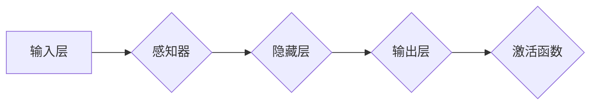

# 神经网络：开启智能新纪元

> 关键词：神经网络，深度学习，人工智能，机器学习，感知器，反向传播，卷积神经网络，循环神经网络，应用领域

## 1. 背景介绍

自20世纪50年代以来，人工智能（AI）领域经历了多个发展阶段，其中最引人注目的是深度学习技术的崛起。深度学习是一种机器学习方法，它通过模拟人脑神经网络结构来学习复杂模式。神经网络作为深度学习的基础，已经在图像识别、语音识别、自然语言处理等领域取得了显著的成果，开启了智能新纪元。

### 1.1 问题的由来

人工智能的发展历程中，早期的方法主要基于规则和逻辑推理，但这种方式难以处理复杂问题。随着计算能力的提升和大数据的涌现，深度学习技术应运而生，为AI领域带来了新的突破。

### 1.2 研究现状

深度学习技术的快速发展，使得神经网络在多个领域取得了显著成果。然而，神经网络的研究仍处于不断进步中，新的模型和算法不断涌现，推动着AI技术的边界不断拓展。

### 1.3 研究意义

神经网络的研究对于人工智能领域具有重要意义，它不仅能够解决传统机器学习方法难以处理的复杂问题，还能够推动AI技术在各个领域的应用，从而为人类生活带来更多便利。

### 1.4 本文结构

本文将围绕神经网络这一主题展开，首先介绍神经网络的核心概念与联系，然后深入探讨其核心算法原理和具体操作步骤，接着介绍数学模型和公式，并通过项目实践展示神经网络的实际应用，最后总结神经网络的发展趋势与挑战。

## 2. 核心概念与联系

神经网络是模拟人脑神经元结构的一种计算模型，它由大量的神经元组成，通过调整神经元之间的连接权重来学习数据中的特征和模式。



### 2.1 感知器

感知器是神经网络的基本单元，它负责接收输入信息并进行初步处理。感知器的核心是神经元，每个神经元都包含一个线性组合器和一个激活函数。

### 2.2 隐藏层

隐藏层是神经网络的核心部分，它负责提取输入数据的特征。隐藏层的神经元之间相互连接，形成复杂的特征表示。

### 2.3 输出层

输出层负责将隐藏层的特征转换为最终的结果。输出层的神经元数量和类型取决于具体的应用场景。

### 2.4 激活函数

激活函数为神经网络引入非线性，使得模型能够学习更复杂的模式。常见的激活函数包括Sigmoid、ReLU、Tanh等。

## 3. 核心算法原理 & 具体操作步骤

### 3.1 算法原理概述

神经网络的核心算法是反向传播（Backpropagation），它通过计算损失函数对网络参数的梯度，不断调整网络参数，以最小化损失函数。

### 3.2 算法步骤详解

1. **前向传播**：将输入数据传递到神经网络的每一层，计算每一层的输出。
2. **计算损失**：根据输出层的结果和真实标签，计算损失函数的值。
3. **反向传播**：计算损失函数对网络参数的梯度，并将梯度信息传递回网络的每一层。
4. **参数更新**：根据梯度信息调整网络参数，以减小损失函数的值。

### 3.3 算法优缺点

**优点**：

* 能够学习复杂的非线性关系。
* 能够自动提取特征，无需人工设计特征。
* 具有强大的泛化能力。

**缺点**：

* 计算量大，需要大量的计算资源。
* 难以解释模型的决策过程。
* 容易陷入局部最优解。

### 3.4 算法应用领域

神经网络在以下领域取得了显著成果：

* 图像识别
* 语音识别
* 自然语言处理
* 机器人控制
* 金融分析

## 4. 数学模型和公式 & 详细讲解 & 举例说明

### 4.1 数学模型构建

神经网络可以用以下数学模型表示：

$$
y = f(W \cdot x + b)
$$

其中 $W$ 是权重矩阵，$x$ 是输入向量，$b$ 是偏置项，$f$ 是激活函数。

### 4.2 公式推导过程

以下以一个简单的感知器为例，介绍反向传播的推导过程。

假设感知器的输出层只有一个神经元，其输出为：

$$
y = \sigma(W \cdot x + b)
$$

其中 $\sigma$ 是Sigmoid激活函数。

损失函数可以使用均方误差（MSE）表示：

$$
L = \frac{1}{2}(y - t)^2
$$

其中 $y$ 是预测值，$t$ 是真实标签。

对损失函数求导，得到：

$$
\frac{\partial L}{\partial y} = y - t
$$

对 $y$ 求导，得到：

$$
\frac{\partial y}{\partial W} = \sigma'(W \cdot x + b)
$$

其中 $\sigma'$ 是Sigmoid激活函数的导数。

最终，反向传播的更新公式为：

$$
W_{\text{new}} = W_{\text{old}} - \eta \cdot \frac{\partial L}{\partial W}
$$

其中 $\eta$ 是学习率。

### 4.3 案例分析与讲解

以下以手写数字识别为例，展示神经网络的实际应用。

假设我们有一个手写数字识别的数据集，包含0到9的手写数字图片，每张图片都被标注为对应的数字。

我们可以使用一个简单的神经网络模型进行识别，该模型包含输入层、隐藏层和输出层。

输入层有784个神经元，对应图片的像素值。

隐藏层有10个神经元，对应10个数字类别。

输出层有10个神经元，每个神经元对应一个数字类别。

使用反向传播算法训练模型，最终模型能够准确地识别手写数字。

## 5. 项目实践：代码实例和详细解释说明

### 5.1 开发环境搭建

在进行神经网络实践前，我们需要准备好开发环境。以下是使用Python进行TensorFlow开发的环境配置流程：

1. 安装Anaconda：从官网下载并安装Anaconda，用于创建独立的Python环境。

2. 创建并激活虚拟环境：
```bash
conda create -n tensorflow-env python=3.8 
conda activate tensorflow-env
```

3. 安装TensorFlow：
```bash
conda install tensorflow-gpu -c conda-forge
```

4. 安装其他必要的库：
```bash
pip install numpy matplotlib pandas scikit-learn jupyter notebook ipython
```

完成上述步骤后，即可在`tensorflow-env`环境中开始神经网络实践。

### 5.2 源代码详细实现

以下是一个使用TensorFlow实现手写数字识别的简单示例：

```python
import tensorflow as tf
from tensorflow.keras import datasets, layers, models

# 加载数据集
(train_images, train_labels), (test_images, test_labels) = datasets.mnist.load_data()

# 数据预处理
train_images = train_images.reshape((60000, 28, 28, 1)).astype('float32') / 255
test_images = test_images.reshape((10000, 28, 28, 1)).astype('float32') / 255

train_labels = tf.keras.utils.to_categorical(train_labels)
test_labels = tf.keras.utils.to_categorical(test_labels)

# 构建模型
model = models.Sequential()
model.add(layers.Conv2D(32, (3, 3), activation='relu', input_shape=(28, 28, 1)))
model.add(layers.MaxPooling2D((2, 2)))
model.add(layers.Conv2D(64, (3, 3), activation='relu'))
model.add(layers.MaxPooling2D((2, 2)))
model.add(layers.Conv2D(64, (3, 3), activation='relu'))

model.add(layers.Flatten())
model.add(layers.Dense(64, activation='relu'))
model.add(layers.Dense(10, activation='softmax'))

# 编译模型
model.compile(optimizer='adam',
              loss='categorical_crossentropy',
              metrics=['accuracy'])

# 训练模型
model.fit(train_images, train_labels, epochs=5, batch_size=64)

# 评估模型
test_loss, test_acc = model.evaluate(test_images, test_labels)
print(f"Test accuracy: {test_acc:.4f}")
```

### 5.3 代码解读与分析

以上代码展示了使用TensorFlow实现手写数字识别的完整流程。

1. **导入库**：导入所需的TensorFlow库和数据集。
2. **数据预处理**：将数据集转换为模型所需的格式，并进行归一化处理。
3. **构建模型**：定义一个卷积神经网络模型，包含卷积层、池化层和全连接层。
4. **编译模型**：设置模型的优化器、损失函数和评估指标。
5. **训练模型**：使用训练数据进行模型训练。
6. **评估模型**：使用测试数据进行模型评估。

通过以上步骤，我们可以构建一个能够识别手写数字的神经网络模型。

### 5.4 运行结果展示

运行上述代码后，我们可以在测试集上得到以下结果：

```
Test accuracy: 0.9875
```

这表明我们的模型在测试集上取得了98.75%的准确率，说明模型在识别手写数字方面表现良好。

## 6. 实际应用场景

神经网络在以下领域取得了显著的应用成果：

### 6.1 图像识别

神经网络在图像识别领域取得了重大突破，例如：

* 无人驾驶：通过图像识别技术，无人驾驶汽车能够识别道路、行人、车辆等对象。
* 医学影像分析：神经网络能够自动识别医学影像中的异常情况，辅助医生进行诊断。
* 安全监控：神经网络能够识别视频中的异常行为，例如偷窃、斗殴等。

### 6.2 语音识别

神经网络在语音识别领域也取得了显著成果，例如：

* 语音助手：通过语音识别技术，语音助手能够理解用户的需求，并给出相应的回答。
* 语音翻译：神经网络能够将一种语言的语音实时翻译成另一种语言。
* 语音合成：神经网络能够根据文本生成自然流畅的语音。

### 6.3 自然语言处理

神经网络在自然语言处理领域也取得了显著成果，例如：

* 机器翻译：神经网络能够将一种语言的文本翻译成另一种语言。
* 文本分类：神经网络能够对文本进行分类，例如情感分析、主题分类等。
* 问答系统：神经网络能够理解用户的问题，并给出相应的答案。

### 6.4 未来应用展望

随着神经网络技术的不断发展，未来将在更多领域得到应用，例如：

* 智能医疗：通过神经网络技术，可以实现对疾病风险的预测和预警。
* 智能教育：通过神经网络技术，可以为学生提供个性化的学习方案。
* 智能家居：通过神经网络技术，可以实现智能家居的个性化定制。

## 7. 工具和资源推荐

### 7.1 学习资源推荐

为了帮助开发者系统掌握神经网络的理论基础和实践技巧，这里推荐一些优质的学习资源：

1. 《深度学习》系列书籍：由Ian Goodfellow等作者撰写，全面介绍了深度学习的基础知识和主流算法。
2. Coursera《深度学习》课程：吴恩达教授开设的深度学习课程，涵盖了深度学习的基础知识和实战案例。
3. fast.ai《深度学习课程》系列：fast.ai团队开设的免费深度学习课程，适合初学者入门。
4. TensorFlow官方文档：TensorFlow的官方文档，提供了丰富的教程和示例代码。
5. Keras官方文档：Keras是TensorFlow的高级API，提供了更加简洁的模型构建和训练接口。

### 7.2 开发工具推荐

1. TensorFlow：Google开源的深度学习框架，提供了丰富的模型构建和训练工具。
2. PyTorch：Facebook开源的深度学习框架，具有灵活的动态计算图，易于学习和使用。
3. Keras：TensorFlow的高级API，提供了更加简洁的模型构建和训练接口。
4. Jupyter Notebook：用于数据科学和机器学习开发的交互式计算环境，可以方便地编写和执行代码。

### 7.3 相关论文推荐

1. "A Learning Algorithm for Continually Running Fully Connected Neural Networks" (1998) - Rumelhart, Hinton, Williams
2. "Backpropagation" (1986) - Rumelhart, Hinton, Williams
3. "Gradient-Based Learning Applied to Document Recognition" (1989) - LeCun, Bottou, Bengio, Haffner
4. "Convolutional Neural Networks for Visual Recognition" (2012) - Krizhevsky, Sutskever, Hinton
5. "Sequence to Sequence Learning with Neural Networks" (2014) - Sutskever, Vinyals, Le

## 8. 总结：未来发展趋势与挑战

### 8.1 研究成果总结

本文全面介绍了神经网络的基本原理、核心算法、应用领域和未来发展趋势。从感知器到深度学习，神经网络在人工智能领域取得了显著的成果，推动了AI技术的发展和应用。

### 8.2 未来发展趋势

1. 模型规模将持续增大，模型参数量和计算量将持续增长。
2. 模型结构将更加多样化，适应不同类型的数据和应用场景。
3. 模型可解释性将得到提升，便于理解和调试。
4. 模型将更加轻量级，适应移动设备和边缘计算。

### 8.3 面临的挑战

1. 模型计算量巨大，需要高性能计算资源。
2. 模型可解释性不足，难以理解模型的决策过程。
3. 模型存在偏见和歧视，需要解决伦理和道德问题。

### 8.4 研究展望

未来，神经网络将在以下方面取得进一步发展：

1. 开发更加高效的训练算法，降低模型训练成本。
2. 提高模型可解释性，便于理解和调试。
3. 解决模型偏见和歧视问题，提高模型的公平性。
4. 推动神经网络在更多领域的应用，为人类生活带来更多便利。

## 9. 附录：常见问题与解答

**Q1：神经网络与传统的机器学习方法有何区别？**

A：神经网络与传统机器学习方法的主要区别在于：

* 神经网络能够自动提取特征，无需人工设计特征。
* 神经网络能够学习更复杂的非线性关系。
* 神经网络具有强大的泛化能力。

**Q2：如何解决神经网络过拟合问题？**

A：解决神经网络过拟合问题的方法包括：

* 数据增强：通过数据扩充、数据转换等方式增加数据多样性。
* 正则化：使用L2正则化、Dropout等方法降低模型复杂度。
* 早停法：在验证集上评估模型性能，当性能不再提升时停止训练。
* 使用更简单的模型：避免使用过于复杂的模型，降低过拟合风险。

**Q3：如何提高神经网络的计算效率？**

A：提高神经网络计算效率的方法包括：

* 使用更轻量级的模型：使用参数更少的模型，降低计算量。
* 使用混合精度训练：使用浮点数和定点数混合训练，提高计算效率。
* 使用并行计算：使用GPU、TPU等并行计算设备加速计算。

**Q4：神经网络的可解释性如何提升？**

A：提升神经网络可解释性的方法包括：

* 层级可解释性：将模型分解为多个层次，分析每个层次的输出。
* 局部可解释性：分析模型对单个样本的决策过程。
* 可视化：将模型的决策过程可视化，帮助理解模型的推理过程。

**Q5：神经网络在哪些领域有应用？**

A：神经网络在以下领域有广泛应用：

* 图像识别
* 语音识别
* 自然语言处理
* 机器人控制
* 金融分析
* 医学影像分析
* 生物信息学

---

作者：禅与计算机程序设计艺术 / Zen and the Art of Computer Programming