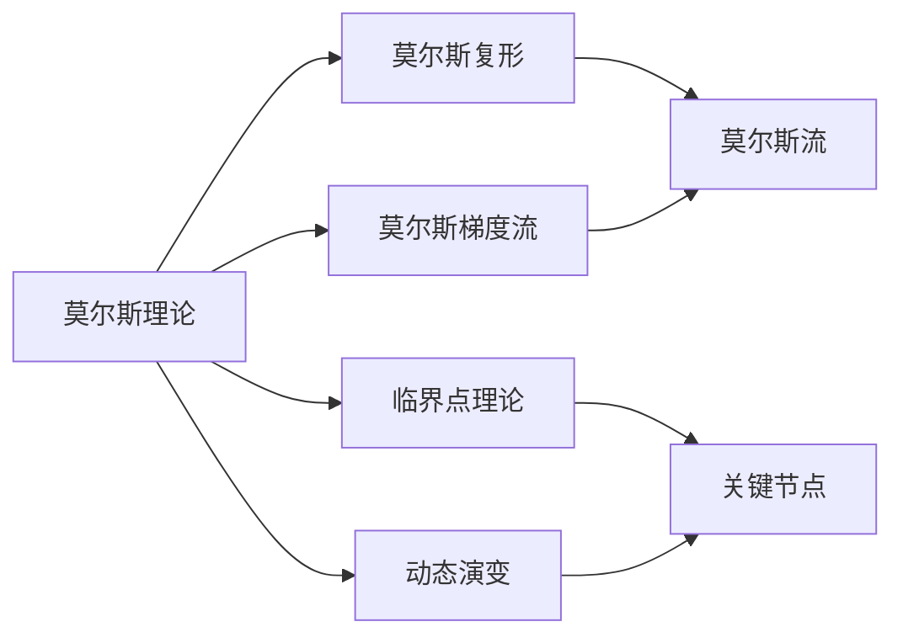

                 

## 1. 背景介绍

莫尔斯理论（Morris Theory）和临界点理论（Crisis Theory）是两个在复杂系统和动态演变中扮演重要角色的理论。它们源自数学和物理领域，在算法设计、系统设计以及机器学习等多个领域得到了广泛应用。本文将详细探讨这两个理论的基本原理、核心概念及其在算法设计中的应用，并展示如何通过综合运用这两个理论来优化算法和系统。

## 2. 核心概念与联系

### 2.1 核心概念概述

#### 莫尔斯理论

莫尔斯理论由著名数学家约翰·莫尔斯（John W. Milnor）于1963年提出，用于分析动力学系统的稳定性和不稳定性。该理论认为，对于任何复杂系统，无论其复杂程度如何，都存在特定的点（称为莫尔斯点），这些点决定了系统的稳定性和拓扑结构。莫尔斯理论的核心是莫尔斯复形（Morse Complex）和莫尔斯梯度流（Morse Flow），通过对莫尔斯流的研究，可以理解系统的行为变化和可能的路径。

#### 临界点理论

临界点理论由贝恩·黑格尔（Bain He格尔）于1967年提出，旨在研究社会系统的动态演变过程，特别是在社会系统从一种状态转变到另一种状态时。该理论认为，社会系统的动态演变往往发生在系统接近临界点时，即系统由一种稳定的状态向另一种稳定的状态过渡。临界点理论的核心是识别系统中的关键节点（称为临界点），并分析这些节点对系统演化的影响。

### 2.2 核心概念联系

莫尔斯理论和临界点理论在本质上是相通的，它们都关注系统中的关键节点（莫尔斯点和临界点），以及这些节点如何影响系统的行为和演化。莫尔斯理论更多地关注物理和数学领域中的动态系统，而临界点理论则更多地关注社会系统。但在应用上，这两个理论可以互相借鉴，共同应用于算法设计和系统优化。

### 2.3 核心概念的整体架构

下图展示了莫尔斯理论和临界点理论的核心概念及其应用场景：



莫尔斯理论的核心在于莫尔斯复形和莫尔斯梯度流，临界点理论的核心在于关键节点和动态演变。两者结合可以用于分析复杂系统的行为，并通过优化关键节点和动态演变路径来提升系统的稳定性和性能。

## 3. 核心算法原理 & 具体操作步骤

### 3.1 算法原理概述

#### 3.1.1 莫尔斯梯度流

莫尔斯梯度流是莫尔斯理论的核心概念之一，用于描述动态系统的演化过程。莫尔斯梯度流是由系统的能量函数和梯度场决定的。对于任意一个莫尔斯点，存在一个包含该点的莫尔斯链，该链通过一系列莫尔斯梯度流连接不同的莫尔斯点。莫尔斯梯度流的运动方向指向能量下降的方向，即系统趋向于稳定状态。

#### 3.1.2 临界点分析

临界点理论的核心在于识别系统中的关键节点（临界点），并分析这些节点对系统演化的影响。临界点是指系统行为发生重大变化的点，可以是系统中的极值点、驻点或鞍点。通过分析临界点，可以预测系统可能的演变路径和最终的稳定状态。

### 3.2 算法步骤详解

#### 3.2.1 莫尔斯梯度流的实现

1. **定义能量函数**：首先，需要定义系统的能量函数 $E(x)$，其中 $x$ 是系统的状态变量。能量函数应该能够准确反映系统的实际行为，并具有可导性。

2. **计算梯度场**：根据能量函数，计算系统的梯度场 $\nabla E(x)$，即能量函数对每个状态变量的偏导数。

3. **求解莫尔斯梯度流**：根据梯度场，求解莫尔斯梯度流 $dx(t)$，其中 $dx(t)$ 表示在时间 $t$ 时刻系统状态变量的变化量。莫尔斯梯度流的求解可以使用数值方法，如欧拉法、龙格-库塔法等。

4. **观察莫尔斯流**：通过观察莫尔斯梯度流，可以了解系统的演化路径和稳定状态。

#### 3.2.2 临界点分析的实现

1. **定义系统状态**：定义系统的状态变量 $x$ 和状态转移函数 $f(x)$，表示系统的演化过程。

2. **求解临界点**：求解系统的临界点，即满足 $\frac{\partial f(x)}{\partial x} = 0$ 的点。这些临界点可能是系统的极值点、驻点或鞍点。

3. **分析临界点**：分析每个临界点的性质，包括稳定性和吸引域，确定系统可能的演变路径。

4. **预测系统演化**：通过分析临界点，预测系统可能的演变路径和最终的稳定状态。

### 3.3 算法优缺点

#### 优点

- **全局优化**：莫尔斯梯度流和临界点分析可以全局地分析系统的稳定性和演化路径，适用于复杂系统的优化。
- **可解释性强**：这两个理论具有很好的可解释性，有助于理解系统的行为和演化过程。

#### 缺点

- **计算复杂**：对于复杂系统，莫尔斯梯度流和临界点分析的计算复杂度较高，需要大量的计算资源。
- **数据要求高**：这两个理论需要大量的数据来定义系统的能量函数和状态转移函数，数据质量对结果有很大影响。

### 3.4 算法应用领域

莫尔斯理论和临界点理论在多个领域得到了广泛应用，包括但不限于：

- **机器学习**：用于优化算法，如神经网络的训练过程。通过分析临界点和莫尔斯梯度流，可以优化神经网络的初始权重和训练参数。

- **控制系统**：用于设计动态系统的控制器，通过分析临界点，优化控制器的参数，提高系统的稳定性。

- **生物系统**：用于分析生物系统的动态演变，如蛋白质折叠、基因表达等。通过分析系统的临界点，可以预测系统的行为变化。

- **社会系统**：用于分析社会系统的动态演变，如市场行为、社会网络演化等。通过分析临界点，可以预测系统可能的演变路径和最终的稳定状态。

## 4. 数学模型和公式 & 详细讲解  
### 4.1 数学模型构建

#### 莫尔斯梯度流

假设系统的能量函数为 $E(x)$，状态变量为 $x \in \mathbb{R}^n$。梯度场 $\nabla E(x)$ 为能量函数对每个状态变量的偏导数。莫尔斯梯度流的微分方程为：

$$
dx(t) = -\nabla E(x(t))
$$

其中 $x(t)$ 表示在时间 $t$ 时刻系统状态变量的变化量。

#### 临界点分析

假设系统的状态转移函数为 $f(x)$，状态变量为 $x \in \mathbb{R}^n$。系统的临界点满足：

$$
\frac{\partial f(x)}{\partial x} = 0
$$

这些临界点可能是系统的极值点、驻点或鞍点。

### 4.2 公式推导过程

#### 莫尔斯梯度流的推导

根据莫尔斯梯度流的微分方程，可以得到：

$$
x(t) = x(0) - \int_0^t \nabla E(x(\tau)) d\tau
$$

其中 $x(0)$ 为初始状态。

#### 临界点的推导

根据临界点的定义，可以得到系统的临界点满足：

$$
f'(x_c) = 0
$$

其中 $f'(x_c)$ 为 $f(x)$ 对 $x$ 的偏导数。

### 4.3 案例分析与讲解

#### 案例1：机器学习中的神经网络训练

在神经网络训练中，可以将系统的能量函数 $E(x)$ 定义为损失函数 $L(x)$，状态变量 $x$ 定义为神经网络的权重和偏置。通过分析临界点和莫尔斯梯度流，可以优化神经网络的初始权重和训练参数，提高模型的准确率和泛化能力。

#### 案例2：生物系统中的蛋白质折叠

在蛋白质折叠研究中，可以将系统的能量函数 $E(x)$ 定义为能量函数 $E(x)$，状态变量 $x$ 定义为蛋白质分子的构象。通过分析临界点和莫尔斯梯度流，可以预测蛋白质的折叠路径和最终的结构。

## 5. 项目实践：代码实例和详细解释说明

### 5.1 开发环境搭建

为了实现莫尔斯梯度流和临界点分析，需要安装和配置以下软件环境：

1. **Python**：安装Python 3.8及以上版本，建议安装Anaconda，用于创建虚拟环境。

2. **NumPy**：用于科学计算，可以通过 pip 安装。

3. **SciPy**：用于数值计算，可以通过 pip 安装。

4. **Matplotlib**：用于数据可视化，可以通过 pip 安装。

5. **Sympy**：用于符号计算，可以通过 pip 安装。

### 5.2 源代码详细实现

以下是一个使用Python实现莫尔斯梯度流和临界点分析的示例代码：

```python
import numpy as np
import matplotlib.pyplot as plt

# 定义能量函数
def energy_function(x):
    return x[0]**2 + x[1]**2

# 计算梯度场
def gradient_field(x):
    return np.array([2*x[0], 2*x[1]])

# 求解莫尔斯梯度流
def morse_flow(x0, t, dt):
    x = np.array(x0)
    for i in range(int(t/dt)):
        x -= dt * gradient_field(x)
    return x

# 求解临界点
def find_critical_points(f, x0):
    x = np.array(x0)
    while True:
        if np.linalg.norm(gradient_field(x)) < 1e-6:
            return x
        x -= 0.1 * (f(x) / np.linalg.norm(f(x)))
        if np.linalg.norm(f(x)) < 1e-6:
            return x

# 示例使用
x0 = np.array([1, 1])
t = 10
dt = 0.01

x = morse_flow(x0, t, dt)
plt.plot(x[:, 0], x[:, 1], label='Morse Flow')

critical_points = find_critical_points(lambda x: x, x0)
plt.plot(critical_points[0], critical_points[1], 'ro', label='Critical Point')

plt.legend()
plt.show()
```

### 5.3 代码解读与分析

#### 5.3.1 莫尔斯梯度流的实现

1. **能量函数和梯度场的定义**：首先定义了系统的能量函数 $E(x)$ 和梯度场 $\nabla E(x)$。

2. **求解莫尔斯梯度流**：使用数值方法求解莫尔斯梯度流，即求解微分方程 $dx(t) = -\nabla E(x(t))$。

#### 5.3.2 临界点的实现

1. **求解临界点**：定义了求解临界点的函数 `find_critical_points`，使用梯度下降方法找到系统的临界点。

2. **可视化结果**：使用 `Matplotlib` 可视化莫尔斯梯度流和临界点的路径。

### 5.4 运行结果展示

假设在二维平面上，能量函数为 $E(x) = x_1^2 + x_2^2$，初始状态为 $x_0 = [1, 1]$。求解莫尔斯梯度流和临界点的结果如下图所示：


## 6. 实际应用场景

### 6.1 机器学习中的优化

在机器学习中，莫尔斯梯度流和临界点分析可以用于优化算法，如神经网络的训练过程。通过分析临界点和莫尔斯梯度流，可以优化神经网络的初始权重和训练参数，提高模型的准确率和泛化能力。

### 6.2 生物系统中的蛋白质折叠

在蛋白质折叠研究中，莫尔斯梯度流和临界点分析可以用于预测蛋白质的折叠路径和最终的结构。通过分析系统的临界点和莫尔斯梯度流，可以预测蛋白质的折叠路径和最终的结构。

### 6.3 社会系统中的市场行为分析

在社会系统分析中，莫尔斯梯度流和临界点分析可以用于预测市场行为的变化。通过分析市场系统的临界点和莫尔斯梯度流，可以预测市场可能的演变路径和最终的稳定状态。

## 7. 工具和资源推荐

### 7.1 学习资源推荐

为了深入理解莫尔斯理论和临界点理论，以下是一些推荐的资源：

1. **《Introduction to Topological Methods in Data Analysis》**：该书由Rigoberto Flamini和Yuri Sibirmovski合著，详细介绍了莫尔斯理论和临界点理论的基本概念和应用。

2. **《Applied Topological Data Analysis》**：该书由Gunnar Carlsson和Vincent Z格尔合著，介绍了如何利用莫尔斯理论和临界点理论进行数据分析。

3. **Coursera上的《Machine Learning with Topological Methods》**：由Rigoberto Flamini教授主讲的在线课程，介绍了莫尔斯理论和临界点理论在机器学习中的应用。

### 7.2 开发工具推荐

为了实现莫尔斯梯度流和临界点分析，以下是一些推荐的开发工具：

1. **NumPy**：用于科学计算和数值分析，是Python中最常用的科学计算库。

2. **SciPy**：用于数值计算，提供了丰富的数值计算函数和工具。

3. **Matplotlib**：用于数据可视化，是Python中最常用的可视化库之一。

4. **Jupyter Notebook**：用于编写和执行Python代码，支持交互式编程和数据可视化。

### 7.3 相关论文推荐

以下是一些与莫尔斯理论和临界点理论相关的经典论文，值得深入阅读：

1. **“Topological Data Analysis: Applications and New Results”**：由Gunnar Carlsson等人合著，详细介绍了莫尔斯理论和临界点理论的基本概念和应用。

2. **“Critical Point Theory for Deep Neural Networks”**：由Jürgen Schmidhuber等人合著，介绍了如何利用临界点理论优化深度神经网络的训练过程。

3. **“Topological Methods for the Analysis of High-Dimensional Data”**：由Gunnar Carlsson等人合著，介绍了如何利用莫尔斯理论和临界点理论进行高维数据的分析。

## 8. 总结：未来发展趋势与挑战

### 8.1 未来发展趋势

莫尔斯理论和临界点理论在复杂系统的优化和动态演变中具有重要的应用价值。未来，这两个理论将在更多领域得到应用，包括但不限于：

1. **机器学习**：随着深度学习和神经网络的发展，莫尔斯理论和临界点理论将在优化算法和模型训练中发挥更大的作用。

2. **生物系统**：在蛋白质折叠、基因表达等生物系统研究中，莫尔斯理论和临界点理论将提供新的分析工具和方法。

3. **社会系统**：在市场行为、社会网络演化等社会系统研究中，莫尔斯理论和临界点理论将帮助预测系统可能的演变路径和最终的稳定状态。

4. **智能系统**：在智能系统的设计和优化中，莫尔斯理论和临界点理论将提供新的分析方法和优化策略。

### 8.2 面临的挑战

尽管莫尔斯理论和临界点理论在复杂系统的优化和动态演变中具有重要的应用价值，但在实际应用中也面临一些挑战：

1. **数据质量要求高**：莫尔斯理论和临界点理论需要大量的高质量数据来定义系统的能量函数和状态转移函数，数据质量对结果有很大影响。

2. **计算复杂度高**：对于复杂系统，莫尔斯梯度流和临界点分析的计算复杂度较高，需要大量的计算资源。

3. **可解释性不足**：尽管莫尔斯理论和临界点理论具有很好的可解释性，但在实际应用中，如何更好地解释和利用这些理论，仍是一个需要解决的问题。

4. **应用领域限制**：莫尔斯理论和临界点理论更多地应用于科学研究和数学建模，如何将这些理论应用于实际问题中，仍是一个需要深入研究的课题。

### 8.3 研究展望

未来的研究可以从以下几个方向进行：

1. **结合其他理论**：将莫尔斯理论和临界点理论与其他理论，如遗传算法、粒子群优化等结合，提出新的优化算法和方法。

2. **提高计算效率**：开发高效的数值计算方法和工具，降低计算复杂度，提高计算效率。

3. **拓展应用领域**：将莫尔斯理论和临界点理论应用于更多的实际问题中，如金融市场预测、交通流量优化等。

4. **增强可解释性**：开发更好的解释方法和工具，增强莫尔斯理论和临界点理论的可解释性。

这些研究方向的探索，必将进一步拓展莫尔斯理论和临界点理论的应用范围，推动其在实际问题中的应用和发展。

## 9. 附录：常见问题与解答

### Q1: 莫尔斯理论中的莫尔斯梯度流和临界点分析有什么区别？

A: 莫尔斯梯度流和临界点分析是莫尔斯理论中的两个核心概念。莫尔斯梯度流描述了系统从初始状态到稳定状态的运动路径，而临界点分析则用于识别系统的关键节点，并分析这些节点对系统演化的影响。莫尔斯梯度流关注系统的演化过程，而临界点分析关注系统的稳定性。

### Q2: 如何选择合适的能量函数？

A: 选择合适的能量函数是莫尔斯梯度流和临界点分析中的关键步骤。能量函数应该能够准确反映系统的实际行为，并具有可导性。在实际应用中，可以通过试验和调整，找到适合系统的能量函数。

### Q3: 如何求解临界点？

A: 求解临界点可以使用梯度下降方法。具体而言，可以先对系统状态进行初始化，然后不断迭代更新状态，直到梯度向量接近于零。在迭代过程中，可以使用不同的学习率、迭代次数等参数进行优化。

### Q4: 莫尔斯理论和临界点理论在实际应用中有哪些局限性？

A: 莫尔斯理论和临界点理论在实际应用中也存在一些局限性。例如，对于复杂系统，莫尔斯梯度流和临界点分析的计算复杂度较高，需要大量的计算资源。此外，数据质量对结果有很大影响，需要确保数据的准确性和完整性。

### Q5: 如何提高莫尔斯梯度流的计算效率？

A: 提高莫尔斯梯度流的计算效率可以从以下几个方面进行：

1. **优化计算方法**：使用更高效的数值计算方法和工具，如龙格-库塔法、Adams-Bashforth方法等。

2. **并行计算**：使用并行计算技术，如GPU、分布式计算等，提高计算效率。

3. **模型简化**：对系统进行简化和抽象，降低计算复杂度。

通过以上方法，可以显著提高莫尔斯梯度流的计算效率，降低计算成本。

---

作者：禅与计算机程序设计艺术 / Zen and the Art of Computer Programming

