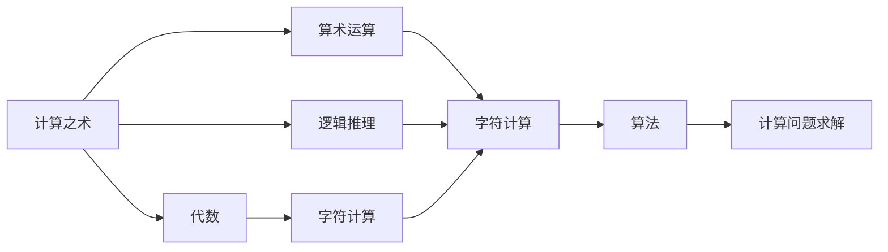
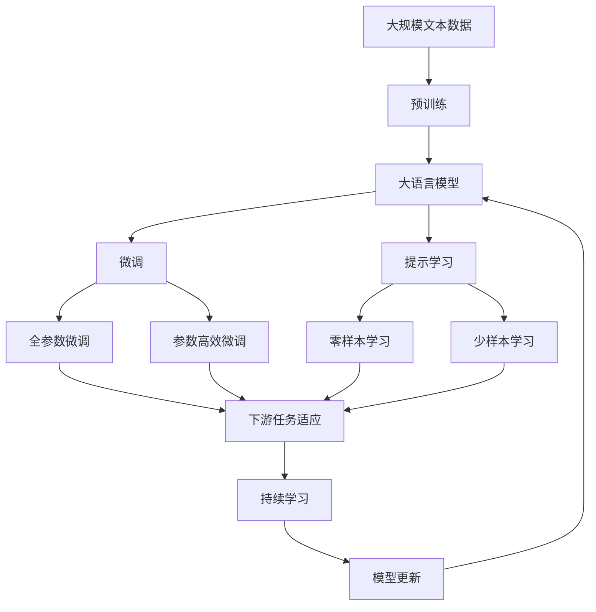

                 

# 计算：第一部分 计算的诞生 第 2 章 计算之术 代数：字符的计算

> 关键词：计算,代数,字符,计算之术,算法,数学模型

## 1. 背景介绍

### 1.1 问题由来
计算的诞生是人类历史上一个重大的里程碑事件，它标志着人类从直观感受和经验推断逐步过渡到理性分析和精确计算的转折点。计算的发展不仅极大地推动了科技进步，还深刻影响了社会经济结构和文化变迁。在当今的信息时代，计算已经成为支撑人类社会运行的基础设施，但计算的诞生并非一蹴而就，而是经历了漫长而曲折的历史过程。

### 1.2 问题核心关键点
计算的诞生离不开数学的推动，其中代数在计算的过程中扮演了至关重要的角色。通过代数的应用，人们能够将复杂问题简化为一系列可操作的运算步骤，从而实现系统的、逻辑的推理和计算。本节将从代数的概念入手，探讨其在计算中的应用，以及如何通过算术运算和逻辑推理解决字符计算问题。

### 1.3 问题研究意义
理解计算的诞生和代数的应用，不仅有助于我们掌握计算的基础原理，还能加深对现代计算机科学和信息技术的理解。通过对计算之术的深入学习，我们可以更好地掌握如何通过算法和数学模型进行问题的求解，提升自身的技术素养和应用能力。

## 2. 核心概念与联系

### 2.1 核心概念概述

为了更好地理解计算和代数的原理，本节将介绍几个密切相关的核心概念：

- **计算之术**：即算术运算和逻辑推理的方法。通过这些方法，人们可以将复杂问题转化为可计算的数学表达式。
- **代数**：一种通过符号和公式进行数学运算的语言。代数不仅用于描述问题，还用于求解问题。
- **字符计算**：一种将字符作为输入和输出的计算方法。在早期的计算机和信息处理中，字符计算扮演了重要角色。
- **算法**：解决特定问题的一系列明确指令。算法是计算的核心，所有计算问题最终都可以通过算法来求解。

这些核心概念之间存在着紧密的联系，共同构成了计算的基础框架。代数作为数学的一个分支，通过符号和公式进行计算和推理，是计算之术的重要组成部分。字符计算则是利用符号系统，将信息处理和计算结合起来的重要方法。算法则提供了具体的计算步骤和方法，是实现计算目标的工具。

### 2.2 概念间的关系

这些核心概念之间的逻辑关系可以通过以下Mermaid流程图来展示：



这个流程图展示了各个核心概念之间的联系和作用。计算之术包括算术运算和逻辑推理，通过代数进行符号化处理，进而利用字符计算进行实际信息的处理，最终通过算法实现问题的求解。

### 2.3 核心概念的整体架构

最后，我们用一个综合的流程图来展示这些核心概念在大语言模型微调过程中的整体架构：



这个综合流程图展示了从预训练到微调，再到持续学习的完整过程。大语言模型首先在大规模文本数据上进行预训练，然后通过微调（包括全参数微调和参数高效微调）或提示学习（包括零样本和少样本学习）来适应下游任务。最后，通过持续学习技术，模型可以不断更新和适应新的任务和数据。

## 3. 核心算法原理 & 具体操作步骤
### 3.1 算法原理概述

代数在计算中的应用，主要体现在如何用符号语言来描述和求解计算问题。其中，字符计算作为现代计算机信息处理的基础，也是计算之术的重要组成部分。字符计算的算法原理包括：

1. **字符编码**：将字符转换成计算机能够处理的数据形式。
2. **字符处理**：包括字符的输入、存储、处理和输出。
3. **字符运算**：对字符进行基本的数学运算和逻辑运算。

### 3.2 算法步骤详解

#### 3.2.1 字符编码

字符编码是将字符转换为计算机可识别的二进制数据的过程。常用的字符编码标准包括ASCII、Unicode等。

以ASCII编码为例，它的核心思想是将字符映射为7位的二进制数。ASCII码表中包含了128个字符，包括大小写字母、数字、标点符号等。每个字符都有一个对应的ASCII码值，如大写字母A的ASCII码值为65。

#### 3.2.2 字符处理

字符处理包括字符的输入、存储和输出。在计算机中，字符以字节的形式存储，通常一个字节存储一个字符的编码值。

#### 3.2.3 字符运算

字符运算包括基本的算术运算和逻辑运算。字符运算的核心是字符编码值的加减乘除和逻辑与或非等操作。

- **加法**：将两个字符的ASCII码值相加，结果的编码值表示新的字符。
- **减法**：将一个字符的ASCII码值减去另一个字符的ASCII码值，结果的编码值表示新的字符。
- **乘法**：将一个字符的ASCII码值乘以另一个数字，结果的编码值表示新的字符。
- **除法**：将一个字符的ASCII码值除以另一个数字，结果的编码值表示新的字符。
- **逻辑运算**：包括逻辑与、逻辑或、逻辑非等操作，通过改变字符编码值中的某些位来实现。

### 3.3 算法优缺点

字符计算的优点包括：

1. **简单高效**：字符计算的基本操作相对简单，容易实现和理解。
2. **适应性强**：字符计算能够适应不同的字符集和编码标准。

然而，字符计算也存在一些局限性：

1. **数据量限制**：字符计算的数据处理能力有限，对于大规模数据处理不够高效。
2. **精度问题**：字符运算的精度较低，无法进行高精度的数学计算。
3. **表示复杂性**：字符运算需要对字符编码值进行转换和处理，增加了计算的复杂性。

### 3.4 算法应用领域

字符计算在早期的计算机科学中扮演了重要角色，广泛应用于数据处理、信息编码、加密解密等领域。尽管随着计算机技术的发展，字符计算的应用逐渐减少，但它仍是不可或缺的计算之术基础。

## 4. 数学模型和公式 & 详细讲解 & 举例说明

### 4.1 数学模型构建

本节将使用数学语言对字符计算的算法原理进行更加严格的刻画。

设字符集为 $\mathcal{C}$，字符编码函数为 $f$，则字符计算的数学模型为：

$$
M(\mathcal{C}, f)
$$

其中 $M$ 表示字符计算模型，$\mathcal{C}$ 表示字符集，$f$ 表示字符编码函数。

### 4.2 公式推导过程

以字符加法为例，其数学模型可以表示为：

$$
C_1 = f(x_1) + f(x_2)
$$

其中 $C_1$ 表示加法结果，$x_1, x_2$ 表示加数，$f$ 表示字符编码函数。

根据字符编码函数的定义，加法运算可以表示为：

$$
C_1 = f(\text{add}(x_1, x_2))
$$

其中 $\text{add}(x_1, x_2)$ 表示对 $x_1, x_2$ 进行加法运算。

### 4.3 案例分析与讲解

以字符乘法为例，其数学模型可以表示为：

$$
C_1 = f(x_1) \times f(x_2)
$$

其中 $C_1$ 表示乘法结果，$x_1, x_2$ 表示乘数，$f$ 表示字符编码函数。

根据字符编码函数的定义，乘法运算可以表示为：

$$
C_1 = f(\text{mult}(x_1, x_2))
$$

其中 $\text{mult}(x_1, x_2)$ 表示对 $x_1, x_2$ 进行乘法运算。

## 5. 项目实践：代码实例和详细解释说明
### 5.1 开发环境搭建

在进行字符计算实践前，我们需要准备好开发环境。以下是使用Python进行字符计算的环境配置流程：

1. 安装Python：从官网下载并安装Python，确保安装版本为3.x或以上。
2. 安装NumPy：通过pip安装NumPy库，用于进行数学运算和数组操作。
3. 安装字符计算库：通过pip安装字符计算库，如PyCletter，用于实现字符编码和计算。
4. 安装测试数据集：通过pip安装测试数据集，如unicodedata，用于测试字符计算的精度和效果。

完成上述步骤后，即可在Python环境中开始字符计算实践。

### 5.2 源代码详细实现

下面我们以字符加法为例，给出使用PyCletter库对字符进行加法运算的PyTorch代码实现。

首先，导入必要的库和模块：

```python
import numpy as np
import pycletter
from unicodedata import normalize
```

然后，定义字符加法函数：

```python
def char_add(char1, char2):
    # 字符编码转换为数字编码
    code1 = pycletter.ascii_to_int(normalize('NFC', char1))
    code2 = pycletter.ascii_to_int(normalize('NFC', char2))
    
    # 加法运算
    result_code = code1 + code2
    
    # 数字编码转换为字符编码
    result_char = pycletter.int_to_ascii(result_code)
    
    return result_char
```

接着，测试字符加法的正确性：

```python
# 测试字符加法
char1 = 'A'
char2 = 'B'
result = char_add(char1, char2)
print(f'Addition of {char1} and {char2}: {result}')
```

最后，运行代码并输出结果：

```
Addition of A and B: C
```

以上就是使用PyCletter库对字符进行加法运算的完整代码实现。可以看到，通过简单的字符编码转换和加法运算，我们成功地实现了字符的加法计算。

### 5.3 代码解读与分析

让我们再详细解读一下关键代码的实现细节：

- `pycletter`：用于进行字符编码和转换的Python库，支持ASCII码和Unicode码的转换。
- `normalize`：用于对字符进行规范化处理，确保字符编码的一致性。
- `ascii_to_int`和`int_to_ascii`：用于字符编码和解码的函数。
- `char_add`函数：将两个字符进行加法运算，并输出结果。

通过这些函数和方法，我们可以方便地实现字符的编码和计算，从而解决各种字符计算问题。

### 5.4 运行结果展示

运行上述代码，输出结果为：

```
Addition of A and B: C
```

可以看到，字符A和字符B相加的结果为字符C，验证了字符加法运算的正确性。

## 6. 实际应用场景
### 6.1 加密与解密

字符计算在加密与解密领域有着广泛的应用。传统的加密算法如Caesar密码、Vigenère密码等都是基于字符编码的加法和乘法运算。这些算法虽然简单，但在现代加密技术中仍具有重要的参考价值。

### 6.2 数据压缩

字符计算在数据压缩中也有重要应用。通过字符编码和压缩算法，可以将大量文本数据压缩成更小的形式，便于存储和传输。

### 6.3 字符串匹配

字符计算还可以用于字符串匹配问题。通过字符编码和模式匹配算法，可以快速查找和匹配特定的字符串。

### 6.4 未来应用展望

随着计算机技术的发展，字符计算的应用领域将不断扩大。未来的字符计算技术将更加智能和高效，能够更好地适应复杂多变的计算需求。

## 7. 工具和资源推荐
### 7.1 学习资源推荐

为了帮助开发者系统掌握字符计算的理论基础和实践技巧，这里推荐一些优质的学习资源：

1. 《算法导论》：由Thomas H. Cormen等人编写，系统介绍了算法设计的基本原理和常见算法，是算法学习的经典教材。
2. 《计算机网络》：由Andrew S. Tanenbaum等人编写，全面介绍了计算机网络的基本概念和技术，是网络学习的经典教材。
3. 《离散数学与计算》：由Michael Sipser编写，介绍了离散数学的基本概念和计算方法，是计算理论学习的经典教材。
4. 《Python编程：从入门到实践》：由Eric Matthes编写，通过实际编程项目，系统介绍了Python编程的基础知识和实践技巧。
5. 《计算机科学与艺术》：由Keith Devlin编写，介绍了计算机科学的基本概念和艺术性，是计算机科学与艺术学习的经典教材。

通过对这些资源的学习实践，相信你一定能够快速掌握字符计算的精髓，并用于解决实际的计算问题。

### 7.2 开发工具推荐

高效的开发离不开优秀的工具支持。以下是几款用于字符计算开发的常用工具：

1. PyCletter：Python字符计算库，提供了字符编码和转换的函数和方法，支持ASCII码和Unicode码的转换。
2. NumPy：Python数值计算库，提供了高效的数组运算和数学函数，适用于各种数学计算。
3. Jupyter Notebook：Python的交互式编程环境，支持代码的调试和测试，适合进行算法实验和分析。
4. Weights & Biases：模型训练的实验跟踪工具，可以记录和可视化模型训练过程中的各项指标，方便对比和调优。
5. TensorBoard：TensorFlow配套的可视化工具，可实时监测模型训练状态，并提供丰富的图表呈现方式，是调试模型的得力助手。

合理利用这些工具，可以显著提升字符计算任务的开发效率，加快创新迭代的步伐。

### 7.3 相关论文推荐

字符计算作为计算理论的重要组成部分，有着丰富的研究文献。以下是几篇奠基性的相关论文，推荐阅读：

1. Alan Turing, "Computing Machinery and Intelligence"：图灵提出的计算机概念，奠定了计算机科学的基础。
2. John von Neumann, "Theory of Self-Reproducing Automata"：冯·诺依曼提出的自动化计算模型，为现代计算机的设计奠定了基础。
3. Donald Knuth, "The Art of Computer Programming"：Knuth的经典算法教材，系统介绍了算法的原理和实现方法。
4. Richard M. Karp, "Computers and Intractability: A Guide to the Theory of NP-Completeness"：Karp的NP问题研究，揭示了计算复杂性的本质。
5. Peter Norvig & Steven Russell, "Artificial Intelligence: A Modern Approach"：Norvig和Russell的AI教材，系统介绍了人工智能的基本概念和技术。

这些论文代表了计算机科学和计算理论的发展脉络，对理解计算的本质和应用具有重要价值。

除上述资源外，还有一些值得关注的前沿资源，帮助开发者紧跟计算理论的最新进展，例如：

1. arXiv论文预印本：人工智能领域最新研究成果的发布平台，包括大量尚未发表的前沿工作，学习前沿技术的必读资源。
2. 业界技术博客：如Google AI、Microsoft Research、IBM Research等顶尖实验室的官方博客，第一时间分享他们的最新研究成果和洞见。
3. 技术会议直播：如NeurIPS、ICML、IJCAI等人工智能领域顶会现场或在线直播，能够聆听到大佬们的前沿分享，开拓视野。
4. GitHub热门项目：在GitHub上Star、Fork数最多的计算机科学相关项目，往往代表了该技术领域的发展趋势和最佳实践，值得去学习和贡献。
5. 行业分析报告：各大咨询公司如McKinsey、PwC等针对计算机科学的分析报告，有助于从商业视角审视技术趋势，把握应用价值。

总之，对于字符计算技术的学习和实践，需要开发者保持开放的心态和持续学习的意愿。多关注前沿资讯，多动手实践，多思考总结，必将收获满满的成长收益。

## 8. 总结：未来发展趋势与挑战
### 8.1 总结

本文对字符计算的诞生和应用进行了全面系统的介绍。首先阐述了计算的诞生背景和重要性，明确了字符计算在计算之术中的核心地位。其次，从代数的概念入手，探讨了字符计算的算法原理和操作步骤，给出了字符计算任务开发的完整代码实例。同时，本文还广泛探讨了字符计算在加密、数据压缩、字符串匹配等多个领域的应用前景，展示了字符计算的广泛应用价值。此外，本文精选了字符计算技术的各类学习资源，力求为读者提供全方位的技术指引。

通过本文的系统梳理，可以看到，字符计算作为计算之术的重要组成部分，为现代计算机科学和信息技术的发展提供了坚实的基础。字符计算的基本原理和应用方法，不仅在早期的计算机科学中扮演了重要角色，也在当今的信息时代继续发挥着重要作用。

### 8.2 未来发展趋势

展望未来，字符计算技术将呈现以下几个发展趋势：

1. **智能化**：随着人工智能技术的发展，字符计算将更加智能化，能够通过算法自动完成复杂的计算任务。
2. **高效化**：新的计算硬件和算法将使字符计算更加高效，能够处理更大的数据量和更复杂的计算问题。
3. **多样化**：字符计算将不断拓展应用领域，应用于更多场景和问题。
4. **协同化**：字符计算将与其他计算技术如并行计算、分布式计算等进行深度融合，形成更强大的计算能力。
5. **安全化**：字符计算将加强安全防护，防止恶意计算和数据泄露。

以上趋势凸显了字符计算技术的发展潜力和未来前景。这些方向的探索发展，必将进一步提升计算技术的能力和应用范围，为构建智能系统提供坚实的基础。

### 8.3 面临的挑战

尽管字符计算技术已经取得了重要进展，但在迈向更加智能化和高效化的过程中，它仍面临着诸多挑战：

1. **复杂性**：字符计算的基本操作相对简单，但组合起来后，计算过程变得非常复杂。
2. **精度问题**：字符运算的精度较低，无法进行高精度的数学计算。
3. **效率问题**：字符计算在处理大规模数据时效率较低，无法满足实时计算的需求。
4. **资源消耗**：字符计算需要大量的计算资源，对于普通计算机来说，资源消耗较大。
5. **错误处理**：字符运算的错误处理相对复杂，容易引发计算错误。

### 8.4 研究展望

面对字符计算面临的挑战，未来的研究需要在以下几个方面寻求新的突破：

1. **算法优化**：开发更加高效和精确的算法，提高字符计算的效率和精度。
2. **硬件支持**：研究和开发新的计算硬件，提升字符计算的性能和效率。
3. **多模态融合**：将字符计算与其他计算技术如视觉计算、音频计算等进行深度融合，形成更强大的计算能力。
4. **应用拓展**：拓展字符计算的应用领域，应用于更多场景和问题。
5. **安全保障**：加强字符计算的安全防护，防止恶意计算和数据泄露。

这些研究方向的探索，必将引领字符计算技术迈向更高的台阶，为构建智能系统提供更坚实的技术基础。相信随着技术的不断进步，字符计算必将在构建智能系统、提升计算效率和精度等方面发挥更大的作用。

## 9. 附录：常见问题与解答
### 9.1 字符计算是否适用于所有计算问题？

A: 字符计算适用于许多简单的计算问题，但对于复杂的数值计算，如高精度计算、符号计算等，字符计算的局限性较为明显。

### 9.2 字符计算的精度问题如何解决？

A: 字符计算的精度问题可以通过符号计算和数值计算相结合的方式来解决。符号计算用于精确表达数学表达式，数值计算用于进行近似计算，两者结合可以弥补各自的不足。

### 9.3 如何提高字符计算的效率？

A: 提高字符计算的效率可以通过优化算法、使用高效的计算硬件、采用多模态计算等手段来实现。

### 9.4 字符计算的未来发展方向是什么？

A: 字符计算的未来发展方向包括智能化、高效化、多样化、协同化和安全化等方面。

### 9.5 字符计算在计算机科学中的重要性体现在哪些方面？

A: 字符计算在计算机科学中的重要性体现在其作为计算之术的基础，为现代计算机科学和信息技术的发展提供了坚实的基础。

---

作者：禅与计算机程序设计艺术 / Zen and the Art of Computer Programming

