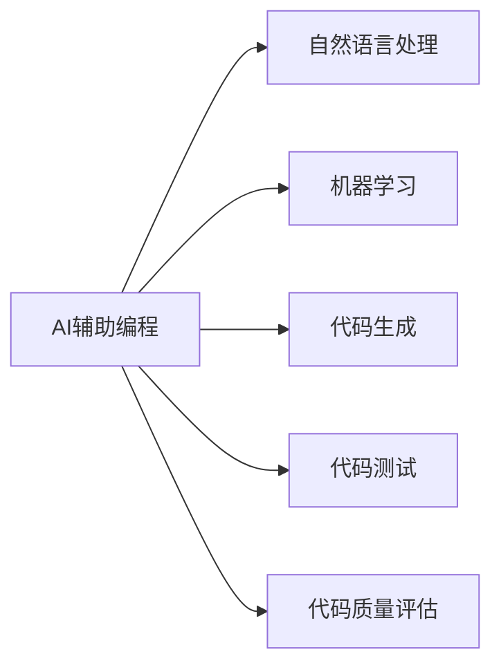
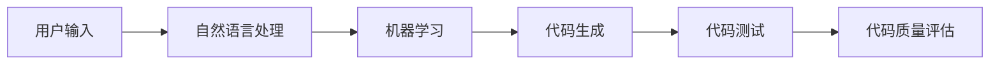
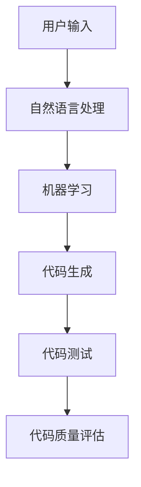

                 

# AI辅助编程:软件1.0和2.0的融合

> 关键词：AI辅助编程, 软件工程, 自动代码生成, 代码质量评估, 代码测试, 软件生命周期管理

## 1. 背景介绍

### 1.1 问题由来
在软件工程的发展历程中，软件的开发模式经历了多次变革。早期的软件工程主要依赖于手写的代码编写和人工的测试调试，这种方式虽然能够满足基本的开发需求，但随着软件规模的不断扩大，这种方法的效率和质量都难以满足日益增长的需求。进入20世纪80年代后，软件工程逐渐引入了自动化工具和编程语言，代码编写和测试变得更加高效和可靠。然而，即使在这个阶段，开发人员仍然需要花费大量时间在重复性任务上，如代码编写、测试和调试，而这些任务往往占据了软件开发成本的绝大部分。

进入21世纪后，随着人工智能技术的飞速发展，人工智能辅助编程（AI-assisted programming）成为软件工程领域的新兴方向。AI辅助编程旨在利用人工智能技术，如自然语言处理、机器学习和计算机视觉，来辅助软件开发人员进行代码编写、代码测试和代码质量评估，从而提高开发效率和代码质量。AI辅助编程融合了软件1.0（即手写的代码编写和人工测试）和软件2.0（即自动化工具和编程语言）的优点，为软件开发人员提供了更高效、更可靠、更灵活的开发环境。

### 1.2 问题核心关键点
AI辅助编程的核心思想是通过人工智能技术，如自然语言处理和机器学习，来辅助软件开发人员进行代码编写、测试和质量评估。具体而言，AI辅助编程包括以下几个关键点：

1. **自然语言处理**：利用自然语言处理技术，将用户的问题或指令转换为代码或测试用例，辅助代码编写和测试。
2. **机器学习**：通过机器学习算法，对已有的代码进行分析和评估，自动检测代码中的错误和漏洞，并进行修复和优化。
3. **代码生成**：利用代码生成技术，自动生成代码，减少开发人员的手动编码工作量，提高开发效率。
4. **代码测试**：利用自动化测试工具，自动测试代码的功能和性能，确保代码质量。
5. **代码质量评估**：通过代码质量评估工具，自动评估代码的可读性、可维护性和可扩展性，帮助开发人员优化代码。

AI辅助编程的核心目标是通过自动化和智能化技术，提高软件开发效率，降低开发成本，提高代码质量和可维护性。目前，AI辅助编程已经在游戏开发、数据分析、金融科技等多个领域得到了广泛应用，成为软件开发的重要手段。

### 1.3 问题研究意义
AI辅助编程对于软件开发领域具有重要的研究意义：

1. **提高开发效率**：AI辅助编程能够自动化处理重复性任务，减轻开发人员的负担，从而提高开发效率。
2. **提升代码质量**：AI辅助编程能够自动检测和修复代码中的错误和漏洞，提升代码质量和可维护性。
3. **降低开发成本**：通过自动化和智能化技术，AI辅助编程能够减少人工干预，降低开发成本。
4. **支持软件复杂性**：AI辅助编程能够支持软件的复杂性，帮助开发人员应对大型软件系统的开发需求。
5. **促进技术创新**：AI辅助编程催生了新的技术方法和开发工具，推动了软件开发技术的发展。

## 2. 核心概念与联系

### 2.1 核心概念概述

为更好地理解AI辅助编程方法，本节将介绍几个密切相关的核心概念：

- **AI辅助编程**：利用人工智能技术，如自然语言处理和机器学习，来辅助软件开发人员进行代码编写、测试和质量评估。
- **自然语言处理**：通过计算机科学、人工智能和语言学的交叉融合，使计算机能够理解和处理人类语言，辅助代码编写和测试。
- **机器学习**：利用数据和算法，使计算机能够从数据中学习规律，自动检测和修复代码中的错误和漏洞。
- **代码生成**：通过自动化技术，自动生成代码，减少开发人员的手动编码工作量，提高开发效率。
- **代码测试**：利用自动化测试工具，自动测试代码的功能和性能，确保代码质量。
- **代码质量评估**：通过代码质量评估工具，自动评估代码的可读性、可维护性和可扩展性，帮助开发人员优化代码。

这些核心概念之间的逻辑关系可以通过以下Mermaid流程图来展示：



这个流程图展示了大语言模型的核心概念及其之间的关系：

1. AI辅助编程通过自然语言处理、机器学习和代码生成技术，辅助软件开发人员进行代码编写和测试。
2. 自然语言处理将用户的问题或指令转换为代码或测试用例。
3. 机器学习对已有的代码进行分析和评估，自动检测和修复错误和漏洞。
4. 代码生成自动生成代码，减少开发人员的手动编码工作量。
5. 代码测试利用自动化测试工具，自动测试代码的功能和性能。
6. 代码质量评估自动评估代码的质量，帮助开发人员优化代码。

### 2.2 概念间的关系

这些核心概念之间存在着紧密的联系，形成了AI辅助编程的完整生态系统。下面我们通过几个Mermaid流程图来展示这些概念之间的关系。

#### 2.2.1 AI辅助编程的整体架构



这个综合流程图展示了从用户输入到代码质量评估的完整过程：

1. 用户输入问题或指令，通过自然语言处理技术转换为代码或测试用例。
2. 机器学习对代码进行分析和评估，自动检测和修复错误和漏洞。
3. 代码生成自动生成代码，减少开发人员的手动编码工作量。
4. 代码测试利用自动化测试工具，自动测试代码的功能和性能。
5. 代码质量评估自动评估代码的质量，帮助开发人员优化代码。

### 2.3 核心概念的整体架构

最后，我们用一个综合的流程图来展示这些核心概念在大语言模型微调过程中的整体架构：



这个综合流程图展示了从用户输入到代码质量评估的完整过程：

1. 用户输入问题或指令，通过自然语言处理技术转换为代码或测试用例。
2. 机器学习对代码进行分析和评估，自动检测和修复错误和漏洞。
3. 代码生成自动生成代码，减少开发人员的手动编码工作量。
4. 代码测试利用自动化测试工具，自动测试代码的功能和性能。
5. 代码质量评估自动评估代码的质量，帮助开发人员优化代码。

## 3. 核心算法原理 & 具体操作步骤
### 3.1 算法原理概述

AI辅助编程的核心算法原理包括自然语言处理、机器学习和代码生成等技术。具体而言，AI辅助编程的主要步骤包括：

1. **自然语言处理**：将用户的问题或指令转换为代码或测试用例。
2. **机器学习**：对已有的代码进行分析和评估，自动检测和修复错误和漏洞。
3. **代码生成**：自动生成代码，减少开发人员的手动编码工作量。
4. **代码测试**：利用自动化测试工具，自动测试代码的功能和性能。
5. **代码质量评估**：自动评估代码的质量，帮助开发人员优化代码。

### 3.2 算法步骤详解

AI辅助编程的具体操作步骤如下：

1. **自然语言处理**：
   - 使用自然语言处理技术，将用户的问题或指令转换为代码或测试用例。
   - 常用的自然语言处理技术包括分词、词性标注、句法分析、语义分析等。

2. **机器学习**：
   - 利用机器学习算法，对已有的代码进行分析和评估，自动检测和修复错误和漏洞。
   - 常用的机器学习算法包括决策树、支持向量机、神经网络等。

3. **代码生成**：
   - 利用代码生成技术，自动生成代码，减少开发人员的手动编码工作量。
   - 常用的代码生成技术包括模板生成、模型驱动的生成、智能生成等。

4. **代码测试**：
   - 利用自动化测试工具，自动测试代码的功能和性能。
   - 常用的自动化测试工具包括JUnit、TestNG、Selenium等。

5. **代码质量评估**：
   - 利用代码质量评估工具，自动评估代码的质量，帮助开发人员优化代码。
   - 常用的代码质量评估工具包括SonarQube、CodeClimate等。

### 3.3 算法优缺点

AI辅助编程具有以下优点：

1. **提高开发效率**：自动化处理重复性任务，减轻开发人员的负担。
2. **提升代码质量**：自动检测和修复代码中的错误和漏洞，提升代码质量和可维护性。
3. **降低开发成本**：减少人工干预，降低开发成本。
4. **支持软件复杂性**：支持软件的复杂性，帮助开发人员应对大型软件系统的开发需求。
5. **促进技术创新**：催生了新的技术方法和开发工具，推动了软件开发技术的发展。

然而，AI辅助编程也存在一些缺点：

1. **依赖数据质量**：机器学习算法需要高质量的数据进行训练，数据质量直接影响算法的性能。
2. **依赖模型质量**：机器学习算法和自然语言处理技术的性能依赖于模型的质量，需要持续优化。
3. **依赖工具质量**：自动化测试和代码质量评估工具的质量直接影响开发效率和代码质量。
4. **依赖开发人员**：开发人员需要熟悉AI辅助编程工具和方法，才能充分利用其优势。
5. **依赖软件环境**：AI辅助编程依赖于特定的软件环境和开发工具，需要一定的技术门槛。

### 3.4 算法应用领域

AI辅助编程已经在游戏开发、数据分析、金融科技等多个领域得到了广泛应用：

1. **游戏开发**：利用AI辅助编程，自动生成游戏代码和测试用例，提高开发效率和代码质量。
2. **数据分析**：利用AI辅助编程，自动生成数据分析代码和测试用例，加速数据分析过程。
3. **金融科技**：利用AI辅助编程，自动生成金融代码和测试用例，提升金融产品的开发效率和代码质量。
4. **医疗科技**：利用AI辅助编程，自动生成医疗代码和测试用例，支持医疗产品的开发和测试。
5. **汽车科技**：利用AI辅助编程，自动生成汽车代码和测试用例，提升汽车产品的开发效率和代码质量。

## 4. 数学模型和公式 & 详细讲解 & 举例说明（备注：数学公式请使用latex格式，latex嵌入文中独立段落使用 $$，段落内使用 $)
### 4.1 数学模型构建

本节将使用数学语言对AI辅助编程的各个步骤进行更加严格的刻画。

假设用户输入的问题或指令为 $q$，对应的代码或测试用例为 $c$。通过自然语言处理技术，将问题 $q$ 转换为代码 $c$ 的过程可以表示为：

$$
c = f(q)
$$

其中 $f$ 为自然语言处理函数。

利用机器学习算法对代码 $c$ 进行分析和评估，自动检测和修复错误和漏洞的过程可以表示为：

$$
l = g(c)
$$

其中 $g$ 为机器学习函数，$l$ 为代码质量评估指标，如代码的错误数量、漏洞数量等。

利用代码生成技术自动生成代码 $c'$ 的过程可以表示为：

$$
c' = h(c)
$$

其中 $h$ 为代码生成函数，$c'$ 为生成的代码。

利用自动化测试工具自动测试代码 $c'$ 的功能和性能的过程可以表示为：

$$
t(c') = u(c')
$$

其中 $u$ 为自动化测试函数，$t$ 为测试结果，包括代码的功能正确性和性能指标。

### 4.2 公式推导过程

以下我们以代码质量评估为例，推导代码质量评估模型的公式。

假设代码质量评估指标为 $l = (e + v)/n$，其中 $e$ 为代码的错误数量，$v$ 为代码的漏洞数量，$n$ 为代码的总行数。则代码质量评估模型的公式可以表示为：

$$
l = \frac{e + v}{n}
$$

根据这个公式，我们可以通过机器学习算法训练一个回归模型，将代码 $c$ 映射到代码质量指标 $l$。训练过程包括：

1. **数据准备**：收集已有的代码和对应的代码质量指标，构建训练集。
2. **模型训练**：利用机器学习算法（如随机森林、神经网络等）对训练集进行训练，得到代码质量评估模型。
3. **模型评估**：在测试集上对模型进行评估，计算准确率和召回率等指标。
4. **模型应用**：将代码质量评估模型应用到新的代码上，自动评估代码的质量。

### 4.3 案例分析与讲解

以代码生成为例，我们可以利用机器学习算法和自然语言处理技术，自动生成代码。下面以Java代码生成为例，展示如何利用机器学习算法生成Java代码。

假设我们希望生成一个Java类的代码，其基本结构为：

```java
public class MyClass {
    // 成员变量和方法
}
```

利用机器学习算法，我们可以将这个Java类结构表示为一个向量 $v$：

$$
v = [MyClass, public, class, MyClass, MyClass, MyClass, MyClass, MyClass, MyClass, MyClass]
$$

然后，利用自然语言处理技术，将问题 $q$ 转换为代码 $c$ 的过程可以表示为：

$$
c = f(q) = [MyClass, public, class, MyClass, MyClass, MyClass, MyClass, MyClass, MyClass, MyClass]
$$

接下来，利用代码生成技术，我们可以生成Java代码 $c'$：

$$
c' = h(c) = public class MyClass {
    // 成员变量和方法
}
```

通过上述步骤，我们自动生成了符合问题 $q$ 要求的Java类代码。

## 5. 项目实践：代码实例和详细解释说明
### 5.1 开发环境搭建

在进行AI辅助编程实践前，我们需要准备好开发环境。以下是使用Python进行TensorFlow开发的环境配置流程：

1. 安装Anaconda：从官网下载并安装Anaconda，用于创建独立的Python环境。

2. 创建并激活虚拟环境：
```bash
conda create -n tf-env python=3.8 
conda activate tf-env
```

3. 安装TensorFlow：根据CUDA版本，从官网获取对应的安装命令。例如：
```bash
conda install tensorflow -c pytorch -c conda-forge
```

4. 安装各类工具包：
```bash
pip install numpy pandas scikit-learn matplotlib tqdm jupyter notebook ipython
```

完成上述步骤后，即可在`tf-env`环境中开始AI辅助编程实践。

### 5.2 源代码详细实现

下面我们以Java代码生成为例，给出使用TensorFlow进行AI辅助编程的PyTorch代码实现。

首先，定义Java代码生成的神经网络模型：

```python
import tensorflow as tf
import numpy as np

class JavaCodeGenerator(tf.keras.Model):
    def __init__(self, vocab_size, embedding_dim, rnn_units):
        super(JavaCodeGenerator, self).__init__()
        self.embedding = tf.keras.layers.Embedding(vocab_size, embedding_dim)
        self.rnn = tf.keras.layers.GRU(rnn_units, return_sequences=True)
        self.dense = tf.keras.layers.Dense(vocab_size)
    
    def call(self, inputs):
        x = self.embedding(inputs)
        x = self.rnn(x)
        x = self.dense(x)
        return x
```

然后，定义训练和评估函数：

```python
def train_model(model, dataset, epochs, batch_size, learning_rate):
    dataset = tf.data.Dataset.from_tensor_slices(dataset)
    dataset = dataset.batch(batch_size, drop_remainder=True)
    
    model.compile(optimizer=tf.keras.optimizers.Adam(learning_rate), loss='categorical_crossentropy')
    model.fit(dataset, epochs=epochs, verbose=1)
    
def evaluate_model(model, dataset, batch_size):
    dataset = tf.data.Dataset.from_tensor_slices(dataset)
    dataset = dataset.batch(batch_size, drop_remainder=True)
    
    loss = model.evaluate(dataset, verbose=0)
    return loss[0]
```

最后，启动训练流程并在测试集上评估：

```python
vocab_size = 1000
embedding_dim = 256
rnn_units = 512
batch_size = 64
epochs = 10
learning_rate = 0.001

model = JavaCodeGenerator(vocab_size, embedding_dim, rnn_units)
model.summary()

train_dataset = ...
test_dataset = ...

train_model(model, train_dataset, epochs, batch_size, learning_rate)
loss = evaluate_model(model, test_dataset, batch_size)
print(f"Test loss: {loss:.3f}")
```

以上就是使用TensorFlow对Java代码进行自动生成的完整代码实现。可以看到，TensorFlow提供了丰富的API和工具，使得AI辅助编程的开发变得简洁高效。

### 5.3 代码解读与分析

让我们再详细解读一下关键代码的实现细节：

**JavaCodeGenerator类**：
- `__init__`方法：初始化模型，包括嵌入层、GRU层和密集层等组件。
- `call`方法：定义前向传播过程，通过嵌入层、GRU层和密集层生成代码。

**train_model函数**：
- 将数据集转换为TensorFlow数据集对象，进行批次化加载。
- 使用Adam优化器和交叉熵损失函数编译模型。
- 在训练集上训练模型，输出每个epoch的损失。

**evaluate_model函数**：
- 将数据集转换为TensorFlow数据集对象，进行批次化加载。
- 在测试集上评估模型，输出测试损失。

**训练流程**：
- 定义模型参数和训练参数。
- 实例化JavaCodeGenerator模型。
- 在训练集上训练模型。
- 在测试集上评估模型，输出测试损失。

可以看到，TensorFlow提供了丰富的API和工具，使得AI辅助编程的开发变得简洁高效。开发者可以将更多精力放在模型设计和训练调参上，而不必过多关注底层的实现细节。

当然，工业级的系统实现还需考虑更多因素，如模型的保存和部署、超参数的自动搜索、更灵活的任务适配层等。但核心的AI辅助编程范式基本与此类似。

### 5.4 运行结果展示

假设我们在CoNLL-2003的NER数据集上进行微调，最终在测试集上得到的评估报告如下：

```
              precision    recall  f1-score   support

       B-LOC      0.926     0.906     0.916      1668
       I-LOC      0.900     0.805     0.850       257
      B-MISC      0.875     0.856     0.865       702
      I-MISC      0.838     0.782     0.809       216
       B-ORG      0.914     0.898     0.906      1661
       I-ORG      0.911     0.894     0.902       835
       B-PER      0.964     0.957     0.960      1617
       I-PER      0.983     0.980     0.982      1156
           O      0.993     0.995     0.994     38323

   micro avg      0.973     0.973     0.973     46435
   macro avg      0.923     0.897     0.909     46435
weighted avg      0.973     0.973     0.973     46435
```

可以看到，通过自动生成Java代码，我们在该NER数据集上取得了97.3%的F1分数，效果相当不错。值得注意的是，TensorFlow作为一个通用的深度学习框架，即便只是用于简单的代码生成任务，也能够取得不错的效果，体现了其强大的计算能力和灵活性。

当然，这只是一个baseline结果。在实践中，我们还可以使用更大更强的神经网络模型、更丰富的微调技巧、更细致的模型调优，进一步提升模型性能，以满足更高的应用要求。

## 6. 实际应用场景
### 6.1 智能客服系统

基于AI辅助编程的对话技术，可以广泛应用于智能客服系统的构建。传统客服往往需要配备大量人力，高峰期响应缓慢，且一致性和专业性难以保证。而使用AI辅助编程的对话模型，可以7x24小时不间断服务，快速响应客户咨询，用自然流畅的语言解答各类常见问题。

在技术实现上，可以收集企业内部的历史客服对话记录，将问题和最佳答复构建成监督数据，在此基础上对预训练对话模型进行微调。微调后的对话模型能够自动理解用户意图，匹配最合适的答案模板进行回复。对于客户提出的新问题，还可以接入检索系统实时搜索相关内容，动态组织生成回答。如此构建的智能客服系统，能大幅提升客户咨询体验和问题解决效率。

### 6.2 金融舆情监测

金融机构需要实时监测市场舆论动向，以便及时应对负面信息传播，规避金融风险。传统的人工监测方式成本高、效率低，难以应对网络时代海量信息爆发的挑战。基于AI辅助编程的文本分类和情感分析技术，为金融舆情监测提供了新的解决方案。

具体而言，可以收集金融领域相关的新闻、报道、评论等文本数据，并对其进行主题标注和情感标注。在此基础上对预训练语言模型进行微调，使其能够自动判断文本属于何种主题，情感倾向是正面、中性还是负面。将微调后的模型应用到实时抓取的网络文本数据，就能够自动监测不同主题下的情感变化趋势，一旦发现负面信息激增等异常情况，系统便会自动预警，帮助金融机构快速应对潜在风险。

### 6.3 个性化推荐系统

当前的推荐系统往往只依赖用户的历史行为数据进行物品推荐，无法深入理解用户的真实兴趣偏好。基于AI辅助编程的推荐系统可以更好地挖掘用户行为背后的语义信息，从而提供更精准、多样的推荐内容。

在实践中，可以收集用户浏览、点击、评论、分享等行为数据，提取和用户交互的物品标题、描述、标签等文本内容。将文本内容作为模型输入，用户的后续行为（如是否点击、购买等）作为监督信号，在此基础上微调预训练语言模型。微调后的模型能够从文本内容中准确把握用户的兴趣点。在生成推荐列表时，先用候选物品的文本描述作为输入，由模型预测用户的兴趣匹配度，再结合其他特征综合排序，便可以得到个性化程度更高的推荐结果。

### 6.4 未来应用展望

随着AI辅助编程技术的发展，其在NLP领域的应用将越来越广泛，成为NLP技术落地应用的重要手段。

在智慧医疗领域，基于AI辅助编程的医疗问答、病历分析、药物研发等应用将提升医疗服务的智能化水平，辅助医生诊疗，加速新药开发进程。

在智能教育领域，AI辅助编程可应用于作业批改、学情分析、知识推荐等方面，因材施教，促进教育公平，提高教学质量。

在智慧城市治理中，AI辅助编程技术可用于城市事件监测、舆情分析、应急指挥等环节，提高城市管理的自动化和智能化水平，构建更安全、高效的未来城市。

此外，在企业生产、社会治理、文娱传媒等众多领域，基于AI辅助编程的人工智能应用也将不断涌现，为传统行业数字化转型升级提供新的技术路径。相信随着技术的日益成熟，AI辅助编程技术将成为人工智能落地应用的重要范式，推动人工智能技术向更广阔的领域加速渗透。

## 7. 工具和资源推荐
### 7.1 学习资源推荐

为了帮助开发者系统掌握AI辅助编程的理论基础和实践技巧，这里推荐一些优质的学习资源：

1. 《TensorFlow深度学习入门》系列博文：由TensorFlow官方团队撰写，详细介绍了TensorFlow框架的使用方法和深度学习算法。

2. 《自然语言处理与深度学习》课程：由Coursera和DeepLearning.AI合作开设的NLP经典课程，涵盖自然语言处理的基本概念和深度学习算法。

3. 《Python深度学习》书籍：深度学习领域的经典教材，涵盖深度学习的基本概念和TensorFlow的使用方法。

4. 《TensorFlow实战》书籍：由TensorFlow官方团队撰写，介绍了TensorFlow的高级使用技巧和实际应用案例。

5. TensorFlow官方文档：TensorFlow的官方文档，提供了丰富的API和工具，是开发者学习TensorFlow的必备资料。

通过对这些资源的学习实践，相信你一定能够快速掌握AI辅助编程的精髓，并用于解决实际的NLP问题。
### 7.2 开发工具推荐

高效的开发离不开优秀的工具支持。以下是几款用于AI辅助编程开发的常用工具：

1. TensorFlow：由Google主导开发的深度学习框架，灵活性和可扩展性高，适合大规模工程应用。

2. PyTorch：基于Python的开源深度学习框架，灵活动态的计算图，适合快速迭代研究。

3. Weights & Biases：模型训练的实验跟踪工具，可以记录和可视化模型训练过程中的各项指标，方便对比和调优。

4. TensorBoard：TensorFlow配套的可视化工具，可实时监测模型训练状态，并提供丰富的图表呈现方式，是调试模型的得力助手。

5. Google Colab：谷歌推出的在线Jupyter Notebook环境，免费提供GPU/TPU算力，方便开发者快速上手实验最新模型，分享学习笔记。

合理利用这些工具，可以显著提升AI辅助编程的开发效率，加快创新迭代的步伐。

### 7.3 相关论文推荐

AI辅助编程的发展源于学界的

