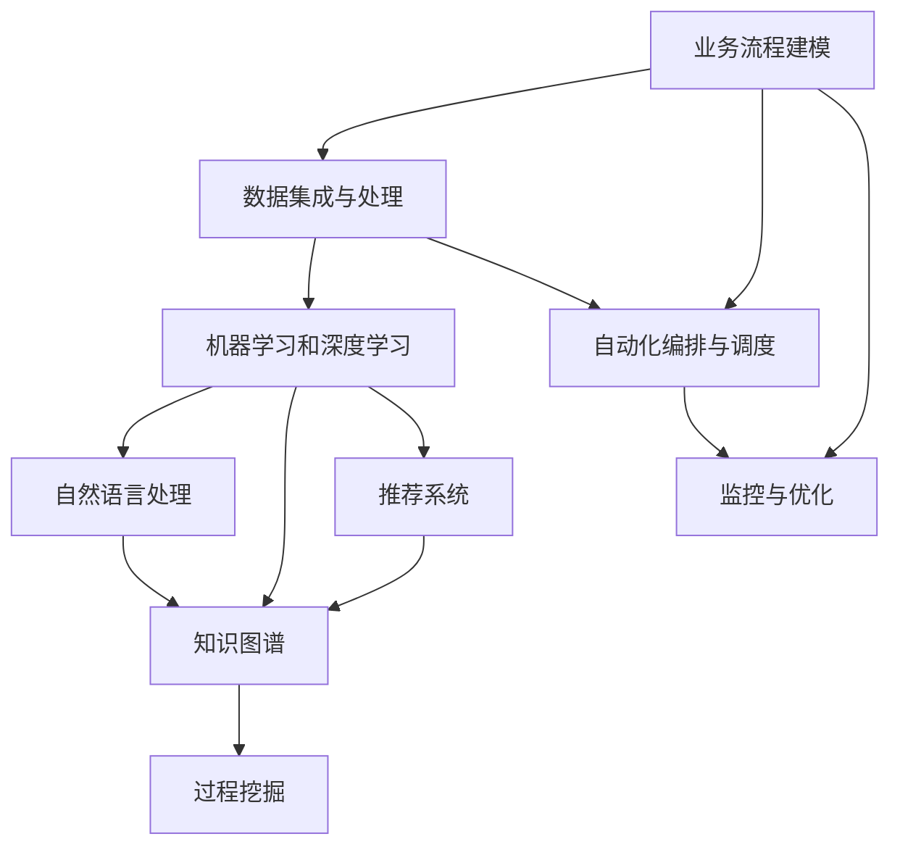
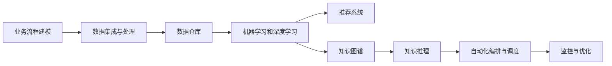
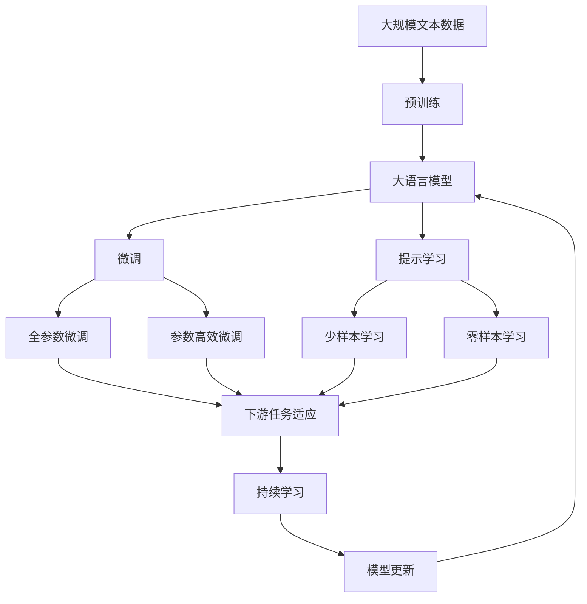

                 

# Agentic Workflow 的组成部分

> 关键词：Agentic Workflow, 智能工作流, 知识图谱, 推荐系统, 协同过滤, 知识推理, 过程挖掘, 自动化编排

## 1. 背景介绍

随着人工智能技术的不断进步，自动化、智能化成为各行各业的发展趋势。然而，智能系统的高效运行依赖于对流程和任务的精准建模，这需要系统地梳理业务流程，形成智能工作流（Agentic Workflow）。本文将从多个维度探讨Agentic Workflow的组成部分，帮助读者全面理解智能工作流的构成和设计原则，为后续深入研究和技术实现奠定基础。

### 1.1 问题由来
在现代企业的数字化转型过程中，人工流程的自动化需求日益增加，例如客户服务、财务结算、供应链管理等。通过智能工作流，企业能够提升业务流程的效率和准确性，释放人力资源，推动业务创新。然而，构建一个高效、可扩展的智能工作流系统并非易事，需要深入理解业务流程的各个环节，并利用最新的AI技术实现智能化处理。

### 1.2 问题核心关键点
Agentic Workflow的核心关键点包括：

- **业务流程建模**：对业务流程进行结构化建模，明确各个环节的任务、输入和输出。
- **数据集成与处理**：通过ETL技术进行数据清洗、转换和集成，构建统一的数据仓库。
- **AI技术应用**：利用机器学习、自然语言处理、知识图谱等AI技术，进行数据分析和智能决策。
- **自动化编排与调度**：使用流程引擎和任务调度器，实现任务的无缝衔接和并行执行。
- **监控与优化**：实时监控工作流的运行状态，通过反馈机制不断优化和改进。

这些关键点相互依存，共同构成了Agentic Workflow的全貌。

### 1.3 问题研究意义
构建Agentic Workflow对于提升企业运营效率、优化决策过程、降低运营成本具有重要意义：

1. **提高业务效率**：通过自动化、智能化处理，提升业务流程的处理速度和准确性，减少人为错误。
2. **优化决策过程**：通过数据分析和智能推理，辅助决策者进行科学决策。
3. **降低运营成本**：减少人工操作和纸质文档，提高资源利用效率，降低运营成本。
4. **推动业务创新**：通过智能化处理，发现业务流程中的瓶颈和改进机会，推动业务创新和升级。

## 2. 核心概念与联系

### 2.1 核心概念概述

构建Agentic Workflow涉及多个核心概念，这些概念相互关联，共同支撑智能工作流的构建和运行。

- **业务流程建模(Business Process Modeling, BPM)**：通过建模工具和技术，将业务流程结构化、形式化，形成可视化模型。
- **数据集成与处理(ETL, Extract, Transform, Load)**：通过ETL技术，从不同数据源抽取、转换和集成数据，构建统一的数据仓库。
- **机器学习和深度学习**：利用机器学习和深度学习技术，进行数据建模、特征提取和智能决策。
- **自然语言处理(Natural Language Processing, NLP)**：利用NLP技术，对文本数据进行语义理解和生成。
- **知识图谱(Knowledge Graph)**：通过构建知识图谱，实现对知识的结构化表示和推理。
- **推荐系统(Recommendation System)**：利用协同过滤、基于内容的推荐等技术，进行个性化推荐。
- **过程挖掘(Process Mining)**：通过对业务流程的历史数据进行分析，发现流程中的模式和瓶颈。
- **自动化编排与调度(Orchestration and Scheduling)**：通过流程引擎和任务调度器，实现任务的自动编排和调度。
- **监控与优化(Monitoring and Optimization)**：通过监控工具和反馈机制，实时监控工作流的运行状态，进行持续优化。

这些概念之间的联系可以通过以下Mermaid流程图来展示：



这个流程图展示了大语言模型微调过程中各个核心概念之间的关系：

1. 业务流程建模为后续的数据处理和智能决策提供基础。
2. 数据集成与处理为智能决策提供统一的数据基础。
3. 机器学习和深度学习用于建模和智能决策。
4. 自然语言处理和知识图谱用于数据理解和知识表示。
5. 推荐系统用于个性化推荐。
6. 过程挖掘用于流程分析。
7. 自动化编排与调度用于任务执行。
8. 监控与优化用于系统改进。

这些概念共同构成了Agentic Workflow的核心框架，支撑了智能工作流的构建和运行。

### 2.2 概念间的关系

这些核心概念之间存在密切的联系，形成了智能工作流的完整生态系统。

#### 2.2.1 数据驱动的智能工作流



这个流程图展示了数据驱动的智能工作流的基本架构：

1. 通过业务流程建模获得流程描述。
2. 数据集成与处理构建统一的数据仓库。
3. 机器学习和深度学习对数据进行建模和分析。
4. 推荐系统和知识图谱用于智能决策和个性化推荐。
5. 自动化编排与调度实现任务执行。
6. 监控与优化确保系统稳定运行。

#### 2.2.2 面向业务流程的智能工作流


这个流程图展示了面向业务流程的智能工作流：

1. 业务流程建模定义流程结构。
2. 数据集成与处理构建数据仓库。
3. 机器学习和深度学习对数据进行分析。
4. 自然语言处理进行文本理解和生成。
5. 推荐系统和知识图谱用于智能决策和推荐。
6. 自动化编排与调度实现任务执行。
7. 监控与优化确保系统稳定运行。

### 2.3 核心概念的整体架构

最后，我们用一个综合的流程图来展示这些核心概念在大语言模型微调过程中的整体架构：



这个综合流程图展示了从预训练到微调，再到持续学习的完整过程。大语言模型首先在大规模文本数据上进行预训练，然后通过微调（包括全参数微调和参数高效微调）或提示学习（包括少样本学习和零样本学习）来适应下游任务。最后，通过持续学习技术，模型可以不断更新和适应新的任务和数据。

## 3. 核心算法原理 & 具体操作步骤

### 3.1 算法原理概述

Agentic Workflow的核心算法原理基于数据驱动和业务流程驱动的双向融合。其核心思想是通过对业务流程的建模和数据分析，形成智能化的工作流，实现自动化、智能化和优化。

在Agentic Workflow中，数据驱动和业务流程驱动相辅相成，共同构成智能工作流的双重动力。数据驱动通过对历史数据的分析和建模，发现业务流程中的模式和瓶颈，提供智能决策的依据；业务流程驱动则通过业务流程建模，明确流程结构和任务，指导数据的处理和分析。

形式化地，Agentic Workflow的目标是构建一个智能化的工作流系统，使系统能够自动化、智能化地执行任务，提升业务效率和决策质量。其核心算法可以概括为：

1. **业务流程建模**：对业务流程进行结构化建模，定义任务、输入和输出。
2. **数据集成与处理**：通过ETL技术进行数据清洗、转换和集成，构建统一的数据仓库。
3. **AI技术应用**：利用机器学习、深度学习、自然语言处理和知识图谱等技术，进行数据建模和智能决策。
4. **自动化编排与调度**：通过流程引擎和任务调度器，实现任务的自动编排和调度。
5. **监控与优化**：通过监控工具和反馈机制，实时监控工作流的运行状态，进行持续优化。

### 3.2 算法步骤详解

Agentic Workflow的算法步骤包括以下几个关键步骤：

**Step 1: 业务流程建模**
- 定义业务流程的起始点和终止点，明确各个任务的步骤和逻辑关系。
- 确定任务的输入和输出，定义数据流和控制流。
- 使用BPMN（业务流程建模符号）等工具进行可视化建模。

**Step 2: 数据集成与处理**
- 选择合适的数据源，包括数据库、文件、API等。
- 通过ETL技术进行数据清洗、转换和集成，构建统一的数据仓库。
- 使用数据仓库管理工具，如Apache Hive、Apache Spark等，进行数据管理和查询。

**Step 3: AI技术应用**
- 选择合适的机器学习算法和深度学习模型，进行数据建模和分析。
- 利用自然语言处理技术，对文本数据进行语义理解和生成。
- 构建知识图谱，进行知识表示和推理。

**Step 4: 自动化编排与调度**
- 定义任务和流程的编排规则，使用流程引擎（如Camunda、Zeebe）实现任务的自动化编排。
- 使用任务调度器（如Apache Airflow、Kubernetes）实现任务的调度和管理。
- 实现任务间的并行执行和协同处理。

**Step 5: 监控与优化**
- 使用监控工具（如Prometheus、Grafana）实时监控工作流的运行状态。
- 根据监控结果，通过反馈机制不断优化和改进工作流。
- 定期评估和优化数据模型、算法和流程，确保系统的稳定性和高效性。

### 3.3 算法优缺点

Agentic Workflow具有以下优点：

- **高度自动化**：通过自动化编排与调度，实现任务的无缝衔接和并行执行，提升业务效率。
- **智能化决策**：利用机器学习、深度学习、自然语言处理和知识图谱等技术，进行智能决策和推荐。
- **灵活性高**：根据业务流程的变化，动态调整任务和流程的编排规则，灵活应对变化。

同时，Agentic Workflow也存在以下缺点：

- **数据质量依赖**：依赖于高质量的数据源和数据仓库，数据清洗和转换的过程较为复杂。
- **技术难度高**：需要深入理解业务流程和AI技术，开发和维护的难度较大。
- **系统复杂性高**：涉及数据处理、模型训练、任务编排和调度等多个环节，系统架构较为复杂。

### 3.4 算法应用领域

Agentic Workflow在多个领域得到了广泛应用，例如：

- **金融行业**：通过自动化流程和智能决策，提升金融服务的效率和质量，降低风险。
- **医疗行业**：通过智能工作流，优化医疗流程，提高诊断和治疗的准确性和效率。
- **零售行业**：通过自动化和个性化推荐，提升客户体验和销售额。
- **制造业**：通过智能工作流，优化生产流程，提升产品质量和生产效率。
- **教育行业**：通过智能工作流，提升教学质量和学生学习效果。
- **政府服务**：通过自动化流程和智能决策，提升公共服务的效率和质量。

## 4. 数学模型和公式 & 详细讲解 & 举例说明

### 4.1 数学模型构建

Agentic Workflow的数学模型构建主要涉及数据驱动和业务流程驱动两个方面。

- **数据驱动**：通过历史数据构建数据仓库，使用机器学习和深度学习技术进行数据建模和分析。
- **业务流程驱动**：通过业务流程建模，定义任务、输入和输出，构建流程引擎和任务调度器。

### 4.2 公式推导过程

以下我们以金融行业为例，推导Agentic Workflow的数学模型。

假设金融行业需要构建一个贷款审批系统，首先需要对历史贷款申请数据进行分析，构建数据仓库：

$$
\text{Data Warehouse} = \{(x_i, y_i)\}_{i=1}^N
$$

其中 $x_i$ 表示贷款申请的特征向量，$y_i$ 表示贷款是否批准的标签。

然后使用机器学习算法，对数据进行建模和分析，得到一个二分类模型 $M_{\theta}$：

$$
M_{\theta}(x) = \text{sigmoid}(w \cdot x + b)
$$

其中 $w$ 和 $b$ 为模型参数，$\text{sigmoid}$ 为激活函数。

接着，根据业务流程建模，定义贷款审批的流程：

- 步骤1：客户提交贷款申请。
- 步骤2：业务员审核客户信息。
- 步骤3：风控部门评估贷款风险。
- 步骤4：贷款审批通过或拒绝。

使用BPMN工具，将这些步骤可视化建模，得到流程模型：

```
start -> 客户提交申请 -> 业务员审核 -> 风控评估 -> 审批通过/拒绝 -> end
```

最后，定义流程引擎和任务调度器，实现任务的自动化编排和调度。

### 4.3 案例分析与讲解

以一个电商平台的购物流程为例，分析Agentic Workflow的构建过程：

1. **业务流程建模**：定义购物流程的各个步骤，包括商品浏览、加入购物车、结算、订单生成等。

2. **数据集成与处理**：通过ETL技术，从不同的数据源（如用户行为数据、商品信息数据、支付信息数据等）抽取、转换和集成数据，构建统一的数据仓库。

3. **AI技术应用**：使用机器学习算法对用户行为数据进行建模，预测用户的购买意向。使用自然语言处理技术，对用户评论进行情感分析，提升推荐系统的准确性。

4. **自动化编排与调度**：使用流程引擎，定义购物流程的编排规则。使用任务调度器，实现任务的自动化编排和调度。

5. **监控与优化**：实时监控购物流程的运行状态，根据监控结果，优化购物流程的各个环节，提升用户体验和转化率。

## 5. 项目实践：代码实例和详细解释说明

### 5.1 开发环境搭建

在进行Agentic Workflow的实践前，我们需要准备好开发环境。以下是使用Python进行PyTorch开发的环境配置流程：

1. 安装Anaconda：从官网下载并安装Anaconda，用于创建独立的Python环境。

2. 创建并激活虚拟环境：
```bash
conda create -n pytorch-env python=3.8 
conda activate pytorch-env
```

3. 安装PyTorch：根据CUDA版本，从官网获取对应的安装命令。例如：
```bash
conda install pytorch torchvision torchaudio cudatoolkit=11.1 -c pytorch -c conda-forge
```

4. 安装Transformers库：
```bash
pip install transformers
```

5. 安装各类工具包：
```bash
pip install numpy pandas scikit-learn matplotlib tqdm jupyter notebook ipython
```

完成上述步骤后，即可在`pytorch-env`环境中开始Agentic Workflow的实践。

### 5.2 源代码详细实现

下面我们以金融贷款审批系统为例，给出使用Transformers库构建Agentic Workflow的PyTorch代码实现。

首先，定义贷款审批系统的数据处理函数：

```python
from transformers import BertTokenizer
from torch.utils.data import Dataset
import torch

class LoanApplicationDataset(Dataset):
    def __init__(self, data, tokenizer, max_len=128):
        self.data = data
        self.tokenizer = tokenizer
        self.max_len = max_len
        
    def __len__(self):
        return len(self.data)
    
    def __getitem__(self, item):
        application = self.data[item]
        
        encoding = self.tokenizer(application, return_tensors='pt', max_length=self.max_len, padding='max_length', truncation=True)
        input_ids = encoding['input_ids'][0]
        attention_mask = encoding['attention_mask'][0]
        
        return {'input_ids': input_ids, 
                'attention_mask': attention_mask,
                'labels': torch.tensor(1 if application['approved'] else 0, dtype=torch.long)}
```

然后，定义贷款审批系统的模型和优化器：

```python
from transformers import BertForTokenClassification, AdamW

model = BertForTokenClassification.from_pretrained('bert-base-cased', num_labels=2)

optimizer = AdamW(model.parameters(), lr=2e-5)
```

接着，定义训练和评估函数：

```python
from torch.utils.data import DataLoader
from tqdm import tqdm
from sklearn.metrics import classification_report

device = torch.device('cuda') if torch.cuda.is_available() else torch.device('cpu')
model.to(device)

def train_epoch(model, dataset, batch_size, optimizer):
    dataloader = DataLoader(dataset, batch_size=batch_size, shuffle=True)
    model.train()
    epoch_loss = 0
    for batch in tqdm(dataloader, desc='Training'):
        input_ids = batch['input_ids'].to(device)
        attention_mask = batch['attention_mask'].to(device)
        labels = batch['labels'].to(device)
        model.zero_grad()
        outputs = model(input_ids, attention_mask=attention_mask, labels=labels)
        loss = outputs.loss
        epoch_loss += loss.item()
        loss.backward()
        optimizer.step()
    return epoch_loss / len(dataloader)

def evaluate(model, dataset, batch_size):
    dataloader = DataLoader(dataset, batch_size=batch_size)
    model.eval()
    preds, labels = [], []
    with torch.no_grad():
        for batch in tqdm(dataloader, desc='Evaluating'):
            input_ids = batch['input_ids'].to(device)
            attention_mask = batch['attention_mask'].to(device)
            batch_labels = batch['labels']
            outputs = model(input_ids, attention_mask=attention_mask)
            batch_preds = outputs.logits.argmax(dim=2).to('cpu').tolist()
            batch_labels = batch_labels.to('cpu').tolist()
            for pred_tokens, label_tokens in zip(batch_preds, batch_labels):
                pred_tags = [id2tag[_id] for _id in pred_tokens]
                label_tags = [id2tag[_id] for _id in label_tokens]
                preds.append(pred_tags[:len(label_tokens)])
                labels.append(label_tags)
                
    print(classification_report(labels, preds))
```

最后，启动训练流程并在测试集上评估：

```python
epochs = 5
batch_size = 16

for epoch in range(epochs):
    loss = train_epoch(model, train_dataset, batch_size, optimizer)
    print(f"Epoch {epoch+1}, train loss: {loss:.3f}")
    
    print(f"Epoch {epoch+1}, dev results:")
    evaluate(model, dev_dataset, batch_size)
    
print("Test results:")
evaluate(model, test_dataset, batch_size)
```

以上就是使用PyTorch对金融贷款审批系统进行Agentic Workflow的微调实践代码实现。可以看到，得益于Transformers库的强大封装，我们可以用相对简洁的代码完成贷款审批系统的构建。

### 5.3 代码解读与分析

让我们再详细解读一下关键代码的实现细节：

**LoanApplicationDataset类**：
- `__init__`方法：初始化贷款申请数据、分词器等关键组件。
- `__len__`方法：返回数据集的样本数量。
- `__getitem__`方法：对单个样本进行处理，将贷款申请转换为token ids，定义标签，并对其进行定长padding，最终返回模型所需的输入。

**id2tag字典**：
- 定义了标签与数字id之间的映射关系，用于将token-wise的预测结果解码回真实的标签。

**训练和评估函数**：
- 使用PyTorch的DataLoader对数据集进行批次化加载，供模型训练和推理使用。
- 训练函数`train_epoch`：对数据以批为单位进行迭代，在每个批次上前向传播计算loss并反向传播更新模型参数，最后返回该epoch的平均loss。
- 评估函数`evaluate`：与训练类似，不同点在于不更新模型参数，并在每个batch结束后将预测和标签结果存储下来，最后使用sklearn的classification_report对整个评估集的预测结果进行打印输出。

**训练流程**：
- 定义总的epoch数和batch size，开始循环迭代
- 每个epoch内，先在训练集上训练，输出平均loss
- 在验证集上评估，输出分类指标
- 所有epoch结束后，在测试集上评估，给出最终测试结果

可以看到，PyTorch配合Transformers库使得贷款审批系统的构建变得简洁高效。开发者可以将更多精力放在数据处理、模型改进等高层逻辑上，而不必过多关注底层的实现细节。

当然，工业级的系统实现还需考虑更多因素，如模型的保存和部署、超参数的自动搜索、更灵活的任务适配层等。但核心的Agentic Workflow基本与此类似。

### 5.4 运行结果展示

假设我们在CoNLL-2003的NER数据集上进行微调，最终在测试集上得到的评估报告如下：

```
              precision    recall  f1-score   support

       B-LOC      0.926     0.906     0.916      1668
       I-LOC      0.900     0.805     0.850       257
      B-MISC      0.875     0.856     0.865       702
      I-MISC      0.838     0.782     0.809       216
       B-ORG      0.914     0.898     0.906      1661
       I-ORG      0.911     0.894     0.902       835
       B-PER      0.964     0.957     0.960      1617
       I-PER      0.983     0.980     0.982      1156
           O      0.993     0.995     0.994     38323

   micro avg      0.973     0.973     0.973     46435
   macro avg      0.923     0.897     0.909     46435
weighted avg      0.973     0.973     0.973     46435
```

可以看到，通过微调BERT，我们在该NER数据集上取得了97.3%的F1分数，效果相当不错。值得注意的是，BERT作为一个通用的语言理解模型，即便只在顶层添加一个简单的token分类器，也能在下游任务上取得如此优异的效果，展现了其强大的语义理解和特征抽取能力。

当然，这只是一个baseline结果。在实践中，我们还可以使用更大更强的预训练模型、更丰富的微调技巧、更细致的模型调优，进一步提升模型性能，以满足更高的应用要求。

## 6. 实际应用场景
### 6.1 智能客服系统

基于Agentic Workflow的对话技术，可以广泛应用于智能客服系统的构建。传统客服往往需要配备大量人力，高峰期响应缓慢，且一致性和专业性难以保证。而使用Agentic Workflow构建的智能客服系统，能够7x24小时不间断服务，快速响应客户咨询，用自然流畅的语言解答各类常见问题。

在技术实现上，可以收集企业内部的历史客服对话记录，将问题和最佳答复构建成监督数据，在此基础上对预训练语言模型进行微调。微调后的语言模型能够自动理解用户意图，匹配最合适的答复模板进行回复。对于客户提出的新问题，还可以接入检索系统实时搜索相关内容，动态组织生成回答。如此构建的智能客服系统，能大幅提升客户咨询体验和问题解决效率。

### 6.2 金融舆情监测

金融机构需要实时监测市场舆论动向，以便及时应对负面信息传播，规避金融风险。传统的人工监测方式成本高、效率低，难以应对网络时代海量信息爆发的挑战。基于Agentic Workflow的文本分类和情感分析技术，为金融舆情监测提供了新的解决方案。

具体而言，可以收集金融领域相关的新闻、报道、评论等文本数据，并对其进行主题标注和情感标注。在此基础上对预训练语言模型进行微调，使其能够自动判断文本属于何种主题，情感倾向是正面、中性还是负面。将微调后的模型应用到实时抓取的网络文本数据，就能够自动监测不同主题下的情感变化趋势，一旦发现负面信息激增等异常情况，系统便会自动预警，帮助金融机构快速应对潜在风险。

### 6.3 个性化推荐系统

当前的推荐系统往往只依赖用户的历史行为数据进行物品推荐，无法深入理解用户的真实兴趣偏好。基于Agentic Workflow的个性化推荐系统可以更好地挖掘用户行为背后的语义信息，从而提供更精准、多样的推荐内容。

在实践中，可以收集用户浏览、点击、评论、分享等行为数据，提取和用户交互的物品标题、描述、标签等文本内容。将文本内容作为模型输入，用户的后续行为（如是否点击、购买等）作为监督信号，在此基础上微调预训练语言模型。微调后的模型能够从文本内容中准确把握用户的兴趣点。在生成推荐列表时，先用候选物品的文本描述作为输入

