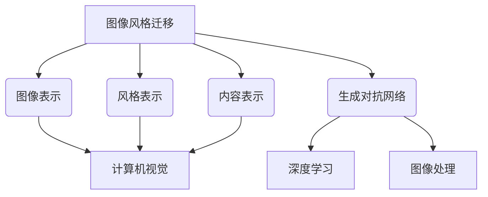
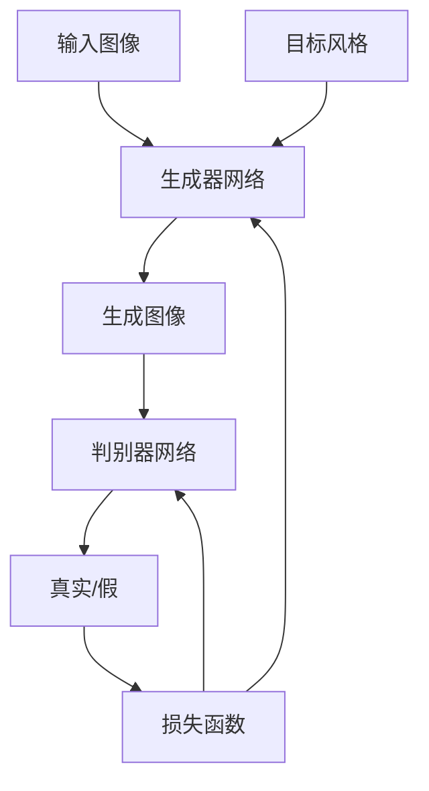

# 基于生成对抗网络的图像风格迁移在时尚设计中的应用

## 1. 背景介绍

### 1.1 问题的由来

在时尚设计领域中,设计师们一直在寻求创新和独特的方式来表达他们的创意。然而,传统的设计过程往往依赖于设计师的个人经验和手工技能,这使得设计过程效率低下,且难以满足日益增长的个性化需求。随着人工智能技术的不断发展,基于深度学习的图像风格迁移技术为时尚设计带来了新的机遇。

图像风格迁移是一种将一种图像的风格迁移到另一种图像上的技术。它可以将艺术家的绘画风格应用于普通照片,或者将照片的风格应用于另一张照片,从而创造出具有独特视觉效果的新图像。在时尚设计中,这项技术可以帮助设计师快速探索不同的风格和概念,并为他们提供无限的创意灵感。

### 1.2 研究现状

早期的图像风格迁移方法主要基于传统的图像处理技术,例如图像分割、纹理合成和图像混合等。这些方法通常需要大量的人工干预,且效果往往不尽人意。随着深度学习技术的兴起,基于卷积神经网络(CNN)的图像风格迁移方法逐渐成为研究热点。

2015年,Gatys等人提出了基于神经网络的图像风格迁移算法,该算法可以将一种图像的风格迁移到另一种图像上,同时保留内容图像的结构和语义信息。这项工作开启了基于深度学习的图像风格迁移研究的新篇章。

近年来,生成对抗网络(GAN)在图像生成和风格迁移领域取得了卓越的成就。GAN由一个生成器网络和一个判别器网络组成,通过对抗训练的方式,生成器网络可以学习到目标图像的分布,从而生成具有目标风格的新图像。基于GAN的图像风格迁移方法可以实现更加自然、流畅的风格迁移效果,并且具有更强的泛化能力。

### 1.3 研究意义

基于生成对抗网络的图像风格迁移技术在时尚设计领域具有重要的应用价值:

1. **加速设计过程**: 通过将不同的艺术风格或材质纹理迁移到服装设计图像上,设计师可以快速探索不同的视觉效果,从而加快设计过程并提高效率。

2. **增强创意灵感**: 图像风格迁移可以为设计师提供无限的创意灵感,帮助他们打破传统思维模式,创造出独特的视觉效果。

3. **个性化定制**: 利用图像风格迁移技术,设计师可以根据客户的个性化需求,为他们定制具有独特风格的服装设计。

4. **虚拟试衣**: 通过将服装设计图像的风格迁移到客户的照片上,可以实现虚拟试衣的效果,为客户提供更加直观的购买体验。

5. **艺术创作**: 图像风格迁移技术不仅可以应用于时尚设计,还可以用于艺术创作,为艺术家提供新的创作工具和灵感来源。

### 1.4 本文结构

本文将全面介绍基于生成对抗网络的图像风格迁移技术在时尚设计中的应用。首先,我们将介绍图像风格迁移的核心概念和与其他技术的联系。然后,我们将详细阐述基于生成对抗网络的图像风格迁移算法的原理和具体操作步骤,包括数学模型和公式的推导。接下来,我们将通过实际项目实践,展示代码实现和运行结果。此外,我们还将探讨该技术在时尚设计领域的实际应用场景,并推荐相关的工具和资源。最后,我们将总结该技术的未来发展趋势和面临的挑战。

## 2. 核心概念与联系

图像风格迁移技术涉及多个核心概念,包括图像表示、风格表示、内容表示和生成对抗网络等。这些概念与计算机视觉、深度学习和图像处理等领域密切相关。

### 2.1 图像表示

图像表示是指将图像数据转换为适合机器学习算法处理的数据格式。常见的图像表示方式包括像素值矩阵、频域表示(如傅里叶变换)和特征表示(如卷积神经网络提取的特征图)等。在图像风格迁移中,通常采用卷积神经网络提取的特征图作为图像的表示形式。

### 2.2 风格表示

风格表示是指捕捉和量化图像风格的方法。在基于神经网络的图像风格迁移算法中,通常使用卷积神经网络的特征图的格拉姆矩阵(Gram Matrix)来表示图像的风格。格拉姆矩阵可以捕捉特征图之间的相关性,从而描述图像的纹理、颜色分布和笔触等风格信息。

### 2.3 内容表示

内容表示是指捕捉和量化图像内容的方法。在图像风格迁移中,我们希望保留原始图像的内容信息,同时迁移目标图像的风格。通常采用卷积神经网络的特征图来表示图像的内容信息,并将其与目标风格进行融合。

### 2.4 生成对抗网络

生成对抗网络(GAN)是一种深度学习架构,由生成器网络和判别器网络组成。生成器网络负责生成新的样本数据,而判别器网络则判断生成的样本是否真实。通过对抗训练,生成器网络可以学习到目标数据的分布,从而生成逼真的样本。在图像风格迁移中,GAN可以直接生成具有目标风格的新图像,而无需将风格和内容分开表示和融合。

上述核心概念与计算机视觉、深度学习和图像处理等领域密切相关。图像表示、风格表示和内容表示是计算机视觉的基础,而生成对抗网络则是深度学习的一个重要分支。图像风格迁移技术将这些概念和技术有机结合,为时尚设计领域带来了新的机遇和挑战。

## 3. 核心算法原理 & 具体操作步骤

### 3.1 算法原理概述

基于生成对抗网络的图像风格迁移算法主要包括两个核心组件:生成器网络和判别器网络。生成器网络的目标是生成具有目标风格的新图像,而判别器网络则负责判断生成的图像是否真实。

在训练过程中,生成器网络从随机噪声开始,生成一个初始图像。然后,判别器网络会评估这个生成的图像是否真实,并将评估结果反馈给生成器网络。基于这个反馈,生成器网络会不断调整自己的参数,以生成更加逼真的图像。同时,判别器网络也会根据生成器网络的输出来调整自己的参数,以提高判别能力。

通过这种对抗训练过程,生成器网络最终可以学习到目标风格的分布,从而生成具有目标风格的新图像。在推理阶段,我们只需要使用训练好的生成器网络,将输入图像和目标风格作为输入,即可生成具有目标风格的新图像。

### 3.2 算法步骤详解

1. **数据预处理**
   - 将输入图像和目标风格图像resize到相同的分辨率
   - 对图像进行归一化处理,使像素值在 [-1, 1] 范围内

2. **定义生成器网络**
   - 生成器网络通常采用编码器-解码器结构
   - 编码器将输入图像编码为低维特征向量
   - 解码器将特征向量解码为目标图像

3. **定义判别器网络**
   - 判别器网络通常采用卷积神经网络结构
   - 输入为真实图像或生成图像
   - 输出为图像真实性的概率值

4. **定义损失函数**
   - 对抗损失: 生成器网络试图最大化判别器网络将生成图像判断为真实的概率,判别器网络则试图最小化这个概率
   - 周期一致性损失: 确保生成图像在经过另一个循环后,可以恢复到原始输入图像
   - 感知损失: 使用预训练的神经网络提取特征,计算生成图像和目标图像特征之间的差异

5. **对抗训练**
   - 固定生成器网络,训练判别器网络
   - 固定判别器网络,训练生成器网络
   - 交替训练,直到模型收敛

6. **推理**
   - 使用训练好的生成器网络
   - 将输入图像和目标风格作为输入
   - 生成具有目标风格的新图像

### 3.3 算法优缺点

**优点**:

- 可以生成高质量、逼真的图像,风格迁移效果自然流畅
- 无需将风格和内容分开表示和融合,简化了算法流程
- 具有较强的泛化能力,可以迁移多种风格

**缺点**:

- 训练过程复杂,需要大量的计算资源和训练数据
- 生成器网络和判别器网络的架构设计对结果影响较大
- 存在模式崩溃(Mode Collapse)和不稳定性等问题

### 3.4 算法应用领域

基于生成对抗网络的图像风格迁移算法不仅可以应用于时尚设计领域,还可以广泛应用于以下领域:

- **艺术创作**: 将不同艺术家的绘画风格迁移到照片上,创造出独特的艺术作品。
- **图像编辑**: 将不同的材质纹理或滤镜效果迁移到图像上,实现图像编辑和增强。
- **虚拟现实**: 将真实场景的风格迁移到3D渲染图像上,提高虚拟现实体验的真实感。
- **医学影像**: 将不同的图像增强技术应用于医学影像,帮助医生更好地诊断疾病。
- **视频处理**: 将不同的视觉效果迁移到视频帧上,实现视频风格化。

## 4. 数学模型和公式 & 详细讲解 & 举例说明

### 4.1 数学模型构建

在基于生成对抗网络的图像风格迁移算法中,我们需要构建两个核心模型:生成器模型和判别器模型。

#### 生成器模型

生成器模型 $G$ 的目标是将输入图像 $x$ 和目标风格 $s$ 映射到输出图像 $y$,使得 $y$ 具有目标风格 $s$ 的风格特征,同时保留了输入图像 $x$ 的内容信息。数学表示为:

$$y = G(x, s)$$

生成器模型通常采用编码器-解码器结构,其中编码器将输入图像编码为低维特征向量,解码器则将特征向量解码为输出图像。

#### 判别器模型

判别器模型 $D$ 的目标是判断输入图像是真实图像还是生成器生成的假图像。对于真实图像 $x$,我们希望判别器输出高概率值;对于生成图像 $y$,我们希望判别器输出低概率值。数学表示为:

$$D(x) \approx 1, D(G(x, s)) \approx 0$$

判别器模型通常采用卷积神经网络结构,输出一个标量值,表示输入图像真实性的概率。

### 4.2 公式推导过程

在训练过程中,生成器模型和判别器模型通过最小化损失函数来优化自身的参数。损失函数通常包括以下几