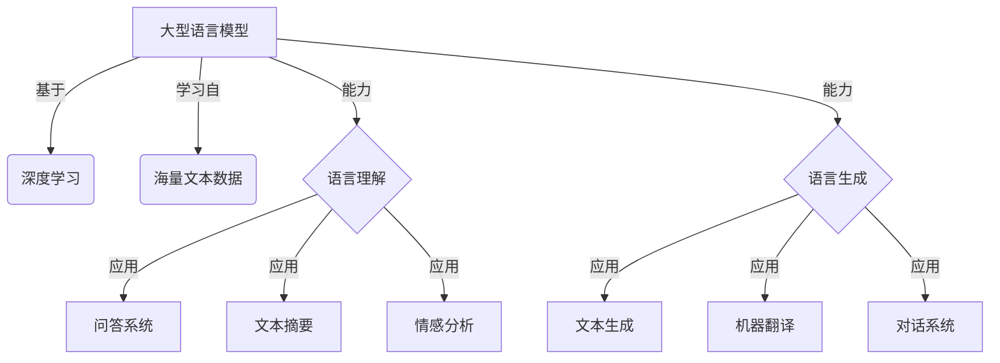

以下是《大语言模型应用指南：提示的基础技巧》的文章正文部分：

# 大语言模型应用指南：提示的基础技巧

## 1. 背景介绍

### 1.1 问题的由来

随着人工智能技术的快速发展，大型语言模型已经成为各大科技公司和研究机构的研究热点。这些模型通过从海量文本数据中学习,展现出惊人的自然语言理解和生成能力,在多个领域取得了突破性的进展。然而,如何有效利用这些模型的强大功能,并将其应用于实际场景中,仍然是一个巨大的挑战。

### 1.2 研究现状

目前,大多数大型语言模型都采用了提示(Prompt)的方式与用户进行交互。提示是指向语言模型输入一个种子文本,以引导模型生成所需的输出。这种方法的优势在于简单直观,用户无需编写复杂的代码,只需提供一个简短的提示,就可以让模型生成所需的文本。

然而,如何设计高质量的提示以获得理想的输出,仍然是一个值得探索的领域。一方面,提示的质量直接影响模型输出的质量;另一方面,不同的任务和场景需要不同的提示设计策略。因此,掌握提示的基础技巧对于充分发挥大型语言模型的潜力至关重要。

### 1.3 研究意义

本文旨在系统地介绍提示的基础技巧,为读者提供一个全面的指南,帮助他们更好地利用大型语言模型解决实际问题。通过掌握这些技巧,读者可以:

1. 了解提示的基本概念和原理
2. 学习如何设计高质量的提示
3. 掌握在不同场景下使用提示的策略
4. 探索提示的前沿研究方向

本文不仅适用于初学者,也可以为有经验的从业人员提供新的见解和技巧。

### 1.4 本文结构

本文共分为9个章节,内容安排如下:

1. 背景介绍
2. 核心概念与联系
3. 核心算法原理与具体操作步骤
4. 数学模型和公式详细讲解与举例说明
5. 项目实践:代码实例和详细解释说明
6. 实际应用场景
7. 工具和资源推荐
8. 总结:未来发展趋势与挑战
9. 附录:常见问题与解答

## 2. 核心概念与联系

在深入探讨提示的基础技巧之前,我们需要先了解一些核心概念及其之间的联系。

### 2.1 大型语言模型

大型语言模型(Large Language Model,LLM)是一种基于深度学习的自然语言处理模型,通过从海量文本数据中学习,能够理解和生成人类语言。常见的大型语言模型包括GPT-3、PaLM、Chinchilla等。这些模型具有惊人的语言理解和生成能力,可以应用于多个领域,如文本生成、问答系统、机器翻译等。



### 2.2 提示

提示(Prompt)是一种与大型语言模型交互的方式。它是指向模型输入一个种子文本,以引导模型生成所需的输出。提示可以是一个简单的问题、一段上下文描述,或者一个任务指令。

根据提示的形式,可以将其分为以下几种类型:

1. **文本提示**: 直接向模型输入一段文本作为提示。
2. **前缀提示**: 在输入文本前添加一段特定的前缀,以指示模型期望的输出类型。
3. **示例提示**: 提供一些输入-输出示例对,让模型学习并生成相似的输出。
4. **混合提示**: 结合上述多种形式,构建复杂的提示结构。

提示的质量直接影响模型输出的质量,因此设计高质量的提示是充分发挥大型语言模型潜力的关键。

### 2.3 提示工程

提示工程(Prompt Engineering)是一门研究如何设计高质量提示的学科。它探讨了提示的各个方面,包括提示的形式、内容、结构等,以及如何根据不同的任务和场景选择合适的提示策略。

提示工程的目标是最大限度地发挥大型语言模型的能力,获得理想的输出。它涉及以下几个核心问题:

1. 如何构建有效的提示?
2. 不同任务需要何种提示?
3. 如何评估和优化提示质量?
4. 提示的局限性和挑战是什么?

提示工程是一个新兴的研究领域,随着大型语言模型的不断发展,它也在不断演进和完善。

### 2.4 概念联系

大型语言模型、提示和提示工程三者之间存在紧密的联系。大型语言模型是强大的语言理解和生成引擎,提示则是与这一引擎交互的接口。而提示工程则是研究如何更好地设计和优化这一接口,以充分发挥大型语言模型的潜力。

只有将这三者结合起来,我们才能真正释放大型语言模型的强大功能,并将其应用于实际场景中。本文将围绕这三个核心概念,系统地介绍提示的基础技巧。

## 3. 核心算法原理与具体操作步骤

### 3.1 算法原理概述

在探讨提示的具体技巧之前,我们需要先了解一下大型语言模型的工作原理。大多数大型语言模型都采用了**自回归(Autoregressive)**的生成方式,即模型根据给定的文本,预测下一个最可能出现的词汇。

具体来说,给定一个文本序列$X = (x_1, x_2, ..., x_n)$,模型的目标是预测下一个词汇$x_{n+1}$的概率分布$P(x_{n+1} | x_1, x_2, ..., x_n)$。通过不断地采样和预测,模型就可以生成连贯的文本输出。

这个过程可以用下面的公式表示:

$$
P(X) = \prod_{t=1}^{n} P(x_t | x_1, x_2, ..., x_{t-1})
$$

其中,$P(X)$表示生成整个文本序列$X$的概率,$P(x_t | x_1, x_2, ..., x_{t-1})$表示在给定前$t-1$个词的情况下,预测第$t$个词的条件概率。

模型通过最大化上述条件概率的累积乘积,来生成最可能的文本输出。

提示的作用就是为模型提供一个"种子"$x_1, x_2, ..., x_n$,引导它生成所需的后续文本$x_{n+1}, x_{n+2}, ...$。根据提示的不同,模型会生成不同的输出。因此,设计高质量的提示对于获得理想的输出至关重要。

### 3.2 算法步骤详解

基于上述原理,我们可以将大型语言模型生成文本的过程分为以下几个步骤:

1. **输入提示**:向模型输入一个提示文本$P$,作为生成的"种子"。
2. **编码**:将提示文本$P$编码为模型可以理解的向量表示$\vec{P}$。
3. **前向传播**:将编码后的向量$\vec{P}$输入到模型中,经过多层神经网络的计算,得到下一个词汇$x_{n+1}$的概率分布$P(x_{n+1} | \vec{P})$。
4. **采样**:从概率分布$P(x_{n+1} | \vec{P})$中采样出一个具体的词汇$x_{n+1}$。
5. **迭代**:将采样得到的$x_{n+1}$添加到提示文本$P$的末尾,形成新的"种子"$P' = P + x_{n+1}$,重复执行步骤3-5,直到生成完整的文本输出。

这个过程可以用下面的流程图来直观地表示:

```mermaid
graph TD
    A[输入提示P] -->|编码| B(向量表示vecP)
    B -->|前向传播| C{计算P(x_n+1|vecP)}
    C -->|采样| D[x_n+1]
    D -->|添加到P| E(P' = P + x_n+1)
    E -->|迭代| C
    C -->|终止条件| F[输出文本]
```

需要注意的是,在实际应用中,我们通常会设置一些终止条件,比如生成的文本达到了预设的长度、出现了特定的结束标记等。一旦满足终止条件,模型就会停止迭代,输出最终的文本结果。

### 3.3 算法优缺点

上述基于自回归的生成算法具有以下优缺点:

**优点**:

1. **简单直观**:算法原理相对简单,易于理解和实现。
2. **生成质量高**:由于模型是基于给定的上下文生成文本,因此生成的文本通常具有较高的质量和连贯性。
3. **可控性强**:通过调整提示,我们可以在一定程度上控制模型的输出。

**缺点**:

1. **生成效率低下**:由于需要逐词生成,算法的计算效率较低,尤其是对于长文本的生成。
2. **缺乏全局规划**:模型只关注局部的词汇预测,缺乏对整体文本结构的规划能力。
3. **存在偏置和不确定性**:模型的输出可能存在一定的偏差和不确定性,需要人工审查和调整。

### 3.4 算法应用领域

基于自回归的生成算法广泛应用于多个领域,包括但不限于:

1. **文本生成**:根据给定的提示或上下文,生成连贯的文本内容,如新闻报道、小说故事、营销文案等。
2. **对话系统**:根据用户的输入,生成相应的回复,实现人机对话交互。
3. **机器翻译**:将一种语言的文本翻译成另一种语言。
4. **问答系统**:根据用户的问题,从知识库中检索并生成相关的答案。
5. **文本续写**:在给定的文本基础上,续写下文。
6. **文本摘要**:根据原文生成对应的文本摘要。
7. **代码生成**:根据给定的需求或注释,生成相应的代码。

总的来说,基于自回归的生成算法为大型语言模型的应用奠定了基础,但也存在一些需要改进的地方。未来,我们需要探索更加高效、全面的生成算法,以充分发挥大型语言模型的潜力。

## 4. 数学模型和公式详细讲解与举例说明

在上一节中,我们介绍了大型语言模型生成文本的核心算法原理。在这一节,我们将进一步深入探讨算法背后的数学模型和公式,并通过具体的案例进行详细的讲解和说明。

### 4.1 数学模型构建

大型语言模型的核心是一个基于深度学习的神经网络模型,它能够从大量的文本数据中学习语言的统计规律。具体来说,该模型通常采用**transformer**结构,包括编码器(Encoder)和解码器(Decoder)两个部分。

编码器的作用是将输入的文本序列编码为一系列向量表示,而解码器则根据这些向量表示生成相应的输出序列。两者之间通过注意力机制(Attention Mechanism)建立联系,使得解码器在生成每个词汇时,都可以关注到输入序列中的相关信息。

我们可以用下面的公式来表示transformer模型的计算过程:

$$
\begin{aligned}
\vec{H}^{enc} &= Encoder(X) \
\vec{H}^{dec}_t &= Decoder(y_{t-1}, \vec{H}^{dec}_{t-1}, \vec{H}^{enc}) \
P(y_t | y_{1:t-1}, X) &= \text{Softmax}(W_o \vec{