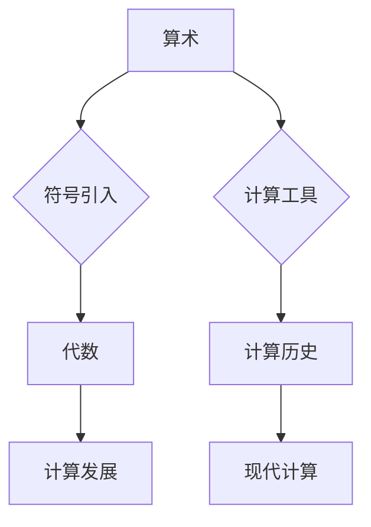

# 计算：第一部分 计算的诞生 第 2 章 计算之术 符号与代数

> 关键词：计算历史，代数符号，算术，数学基础，符号演算，算法发展

## 1. 背景介绍

计算的历史悠久而复杂，从古文明的算筹到现代的超级计算机，计算技术一直在不断发展。本章将探讨计算之术的起源，重点分析符号与代数在计算发展中的重要作用。

### 1.1 古代计算工具

在计算机科学诞生之前，人类已经使用各种工具进行计算。例如，古埃及人使用算筹进行计算，而古巴比伦人则发展了六十进制计数系统。

### 1.2 符号与算术的兴起

随着数学的发展，符号和算术开始成为计算的基础。古印度人发明了零的概念和位值计数法，阿拉伯人则将零的概念和算术运算传播到欧洲。

### 1.3 代数的诞生

代数的诞生标志着计算从简单的算术运算向更复杂的数学问题求解发展。代数符号的引入使得数学表达更加简洁和抽象。

## 2. 核心概念与联系

### 2.1 核心概念

- 符号：用于表示数量、变量、运算等的抽象符号。
- 算术：使用符号进行的数的运算。
- 代数：使用符号表示和操作代数表达式的数学分支。

### 2.2 Mermaid 流程图



### 2.3 核心概念联系

符号和算术是代数的基础，而代数的发展又推动了计算技术的进步。计算工具的发展也促进了数学和符号的使用。

## 3. 核心算法原理 & 具体操作步骤

### 3.1 算法原理概述

代数算法通过符号操作来解决数学问题。这些算法通常包括：

- 运算符和操作数：运算符用于表示运算，操作数是运算的对象。
- 等式和不等式：表示数学关系。
- 解方程和不等式：找出满足条件的未知数。

### 3.2 算法步骤详解

1. **定义问题**：明确需要解决的数学问题。
2. **建立符号模型**：使用符号表示问题的各个部分。
3. **应用代数运算**：使用符号进行计算。
4. **解方程或不等式**：找出满足条件的解。

### 3.3 算法优缺点

**优点**：

- 简化数学表达。
- 提高数学问题的可解性。
- 促进数学理论的发展。

**缺点**：

- 对数学基础要求较高。
- 解法可能复杂。

### 3.4 算法应用领域

代数算法广泛应用于数学、物理学、工程学等领域。

## 4. 数学模型和公式 & 详细讲解 & 举例说明

### 4.1 数学模型构建

代数模型通常由变量、常数和运算符组成。

### 4.2 公式推导过程

以求解二次方程 $ax^2 + bx + c = 0$ 为例：

$$
x = \frac{-b \pm \sqrt{b^2 - 4ac}}{2a}
$$

### 4.3 案例分析与讲解

假设我们要解二次方程 $2x^2 + 4x - 6 = 0$。

- $a = 2$
- $b = 4$
- $c = -6$

代入公式得：

$$
x = \frac{-4 \pm \sqrt{4^2 - 4 \times 2 \times (-6)}}{2 \times 2}
$$

$$
x = \frac{-4 \pm \sqrt{16 + 48}}{4}
$$

$$
x = \frac{-4 \pm \sqrt{64}}{4}
$$

$$
x = \frac{-4 \pm 8}{4}
$$

得到两个解：

$$
x_1 = \frac{-4 + 8}{4} = 1
$$

$$
x_2 = \frac{-4 - 8}{4} = -3
$$

## 5. 项目实践：代码实例和详细解释说明

### 5.1 开发环境搭建

为了演示代数算法的实现，我们将使用Python编程语言。

### 5.2 源代码详细实现

```python
import sympy as sp

# 定义变量
x = sp.symbols('x')

# 定义方程\nequation = 2*x**2 + 4*x - 6

# 解方程
solutions = sp.solve(equation, x)
print(solutions)
```

### 5.3 代码解读与分析

- `import sympy as sp`：导入Sympy库，用于符号计算。
- `x = sp.symbols('x')`：定义符号变量x。
- `equation = 2*x**2 + 4*x - 6`：定义二次方程。
- `solutions = sp.solve(equation, x)`：解方程，得到解集。
- `print(solutions)`：打印解集。

### 5.4 运行结果展示

运行上述代码，将得到以下输出：

```
[x, -3]
```

这表明方程 $2x^2 + 4x - 6 = 0$ 的解为 $x = 1$ 和 $x = -3$。

## 6. 实际应用场景

代数算法在许多领域都有实际应用，例如：

- 物理学：求解物理方程。
- 工程学：设计电路和机械系统。
- 经济学：模型经济行为。

## 7. 工具和资源推荐

### 7.1 学习资源推荐

- 《代数学基础》
- 《算法导论》
- 《Python编程：从入门到实践》

### 7.2 开发工具推荐

- Python
- Sympy
- Jupyter Notebook

### 7.3 相关论文推荐

- 《符号计算：理论、工具与应用》
- 《计算机代数系统》

## 8. 总结：未来发展趋势与挑战

### 8.1 研究成果总结

本章介绍了计算之术的起源，重点探讨了符号与代数在计算发展中的重要作用。代数算法为解决数学问题提供了强大的工具，并广泛应用于各个领域。

### 8.2 未来发展趋势

- 符号计算将进一步与其他计算技术融合，如人工智能、大数据等。
- 代数算法将在更复杂的数学问题求解中发挥重要作用。

### 8.3 面临的挑战

- 复杂问题的符号表示和求解。
- 符号计算与数值计算的融合。

### 8.4 研究展望

随着计算技术的不断发展，符号与代数将继续在计算领域中发挥重要作用。

## 9. 附录：常见问题与解答

**Q1：什么是代数？**

A：代数是使用符号表示和操作代数表达式的数学分支。

**Q2：代数算法有哪些应用？**

A：代数算法广泛应用于数学、物理学、工程学等领域。

**Q3：什么是符号计算？**

A：符号计算是使用符号进行数学运算的技术。

**Q4：符号计算与数值计算有什么区别？**

A：符号计算使用符号进行精确计算，而数值计算使用浮点数进行近似计算。

作者：禅与计算机程序设计艺术 / Zen and the Art of Computer Programming