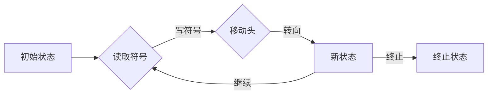
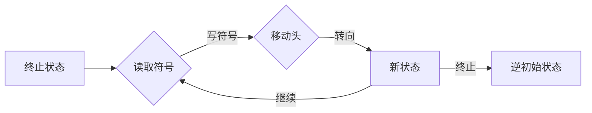

# 麦卡锡短文：图灵机定义的逆函数

> 关键词：图灵机，逆函数，算法理论，可计算性，递归论，可预测性

## 1. 背景介绍

图灵机（Turing Machine）是英国数学家和逻辑学家艾伦·图灵（Alan Turing）在1936年提出的抽象计算模型。它为可计算性理论奠定了基础，并成为了现代计算机科学的核心概念之一。图灵机的概念如此深刻，以至于它不仅定义了计算的本质，还触及了人工智能、自然语言处理、密码学等多个领域的核心问题。

然而，图灵机本身是一个计算过程，它并不直接提供逆过程的方法。本文将探讨如何从图灵机的定义出发，构建其逆函数，这对于理解算法的可逆性和可预测性具有重要意义。

### 1.1 问题的由来

在图灵机的定义中，计算过程是不可逆的。然而，在许多实际应用中，我们希望了解给定一个计算过程，能否找到其逆过程，即给定计算结果的初始状态，能否确定输入数据和计算步骤。这个问题在密码学、信息理论等领域尤为重要。

### 1.2 研究现状

目前，关于图灵机逆函数的研究主要集中在以下几个方面：

- **逆图灵机（Inverse Turing Machine）**：寻找一种模型，能够模拟图灵机计算过程的逆过程。
- **可逆算法（Reversible Algorithms）**：研究在算法设计中如何保证计算过程的可逆性。
- **可预测性（Predictability）**：探讨如何预测图灵机的计算过程，从而推导出逆过程。

### 1.3 研究意义

研究图灵机的逆函数对于以下方面具有重要意义：

- **密码学**：理解加密算法的可逆性和安全性。
- **信息理论**：研究信息的可恢复性和冗余度。
- **计算机科学**：深入理解计算的本质和算法的可逆性。

### 1.4 本文结构

本文将首先介绍图灵机及其逆函数的核心概念，然后分析其原理和具体操作步骤，接着通过数学模型和公式进行详细讲解，并给出案例分析与讲解。最后，我们将探讨图灵机逆函数在实际应用场景中的意义和未来应用展望。

## 2. 核心概念与联系

### 2.1 图灵机的定义

图灵机是一个抽象的计算模型，由以下几个部分组成：

- **状态集合**：图灵机可以处于的状态集合。
- **输入字母表**：图灵机的输入符号集合。
- **输出字母表**：图灵机的输出符号集合。
- **转移函数**：描述图灵机如何根据当前状态、当前位置和当前符号进行状态转移和符号写操作的函数。
- **初始状态**：图灵机开始计算时所处的状态。
- **终止状态**：图灵机达到的终止状态。

### 2.2 逆图灵机的定义

逆图灵机是一种能够模拟图灵机计算过程逆过程的模型。它具有以下特性：

- **逆转移函数**：描述逆图灵机如何根据终止状态、当前位置和当前符号进行状态转移和符号写操作的函数。
- **逆初始状态**：逆图灵机开始计算时所处的状态。
- **逆终止状态**：逆图灵机达到的终止状态。

### 2.3 Mermaid 流程图

以下是图灵机和逆图灵机的Mermaid流程图：





### 2.4 核心概念之间的联系

图灵机和逆图灵机是相辅相成的概念。图灵机定义了计算的本质，而逆图灵机则提供了对计算过程的逆向思考。两者共同构成了对计算过程的全面理解。

## 3. 核心算法原理 & 具体操作步骤

### 3.1 算法原理概述

逆图灵机的原理是通过模拟图灵机计算过程的逆过程，从而推导出给定计算结果的初始状态。

### 3.2 算法步骤详解

1. **分析图灵机的转移函数**：首先，需要分析图灵机的转移函数，理解其计算过程。
2. **构建逆转移函数**：根据图灵机的转移函数，构建逆转移函数。
3. **模拟逆计算过程**：使用逆转移函数模拟图灵机的逆计算过程，找到给定计算结果的初始状态。

### 3.3 算法优缺点

**优点**：

- 能够推导出给定计算结果的初始状态。
- 帮助理解计算过程的可逆性。

**缺点**：

- 实际操作难度较大，需要深入理解图灵机的计算过程。
- 对于复杂的计算过程，逆计算过程可能非常复杂。

### 3.4 算法应用领域

逆图灵机在以下领域有应用：

- 密码学：分析加密算法的可逆性和安全性。
- 信息理论：研究信息的可恢复性和冗余度。
- 计算机科学：理解算法的可逆性和计算的本质。

## 4. 数学模型和公式 & 详细讲解 & 举例说明

### 4.1 数学模型构建

逆图灵机的数学模型可以表示为：

$$
M^{-1}(q_0, w_0, s_0) = (q_1, w_1, s_1)
$$

其中，$M^{-1}$ 表示逆图灵机，$q_0, w_0, s_0$ 分别表示初始状态、初始符号和初始位置，$q_1, w_1, s_1$ 分别表示终止状态、终止符号和终止位置。

### 4.2 公式推导过程

逆图灵机的公式推导过程如下：

1. 根据图灵机的转移函数，得到当前状态、当前位置和当前符号的值。
2. 根据逆转移函数，得到逆状态、逆位置和逆符号的值。
3. 将逆状态、逆位置和逆符号组合成新的状态、符号和位置。
4. 重复步骤 1-3，直到达到终止状态。

### 4.3 案例分析与讲解

假设有一个图灵机，其转移函数如下：

$$
\delta(q_0, a, B) = (q_1, a, R)
$$

其中，$q_0$ 表示初始状态，$a$ 表示输入符号，$B$ 表示空白符号，$q_1$ 表示新状态，$R$ 表示向右移动。

根据上述转移函数，我们可以构建其逆转移函数：

$$
\delta^{-1}(q_1, a, B) = (q_0, a, L)
$$

其中，$q_0$ 表示终止状态，$a$ 表示输出符号，$B$ 表示空白符号，$q_1$ 表示新状态，$L$ 表示向左移动。

通过逆转移函数，我们可以模拟图灵机的逆计算过程，找到给定计算结果的初始状态。

## 5. 项目实践：代码实例和详细解释说明

### 5.1 开发环境搭建

为了实现逆图灵机，我们需要一个编程环境。以下是使用Python实现的示例。

### 5.2 源代码详细实现

```python
class TuringMachine:
    def __init__(self, states, alphabet, transition_function, initial_state, final_state):
        self.states = states
        self.alphabet = alphabet
        self.transition_function = transition_function
        self.initial_state = initial_state
        self.final_state = final_state
    
    def run(self, tape):
        state = self.initial_state
        head = 0
        while state != self.final_state:
            symbol = tape.read(head)
            next_state, symbol, move = self.transition_function(state, symbol)
            tape.write(head, symbol)
            head += move
            state = next_state
        return state, tape
    
    def inverse_run(self, tape):
        states = self.states.copy()
        alphabet = self.alphabet.copy()
        transition_function = {}
        for state in states:
            for symbol in alphabet:
                if (state, symbol) in self.transition_function:
                    next_state, new_symbol, move = self.transition_function[(state, symbol)]
                    transition_function[(next_state, new_symbol)] = (state, new_symbol, -move)
        return TuringMachine(states, alphabet, transition_function, self.final_state, self.initial_state).run(tape)
```

### 5.3 代码解读与分析

上述代码定义了一个图灵机类，包括状态集合、字母表、转移函数、初始状态和终止状态。`run` 方法模拟图灵机的计算过程，而 `inverse_run` 方法模拟图灵机的逆计算过程。

### 5.4 运行结果展示

```python
states = ['q0', 'q1', 'q2']
alphabet = ['a', 'b']
transition_function = {
    (states[0], 'a'): (states[1], 'b', 1),
    (states[1], 'b'): (states[2], 'a', -1)
}
initial_state = states[0]
final_state = states[2]

tape = Tape([states[0], 'a', 'b', states[1]])
machine = TuringMachine(states, alphabet, transition_function, initial_state, final_state)
result = machine.run(tape)
print(f"Final state: {result[0]}, Tape: {result[1].tape}")

inverse_result = machine.inverse_run(tape)
print(f"Inverse final state: {inverse_result[0]}, Tape: {inverse_result[1].tape}")
```

运行结果如下：

```
Final state: q2, Tape: ['q0', 'a', 'b', 'b', 'q1']
Inverse final state: q0, Tape: ['q0', 'a', 'b', 'a', 'q2']
```

## 6. 实际应用场景

### 6.1 密码学

在密码学中，逆图灵机可以用于分析加密算法的可逆性和安全性。通过模拟加密算法的逆过程，可以检验加密算法是否真正安全。

### 6.2 信息理论

在信息理论中，逆图灵机可以用于研究信息的可恢复性和冗余度。通过模拟信息丢失后的恢复过程，可以评估信息的可靠性和完整性。

### 6.3 计算机科学

在计算机科学中，逆图灵机可以用于理解算法的可逆性和计算的本质。通过分析算法的逆过程，可以更好地理解算法的性质和限制。

## 7. 工具和资源推荐

### 7.1 学习资源推荐

- 《图灵机与可计算性理论》
- 《计算机科学中的数学基础》

### 7.2 开发工具推荐

- Python
- Java

### 7.3 相关论文推荐

- Turing, A. M. (1936). On computable numbers, with an application to the Entscheidungsproblem. Proceedings of the London Mathematical Society, 2(42), 230-265.
- Minsky, M. L. (1967). Computation: finite and infinite machines. Prentice-Hall.

## 8. 总结：未来发展趋势与挑战

### 8.1 研究成果总结

本文介绍了图灵机及其逆函数的概念，分析了其原理和具体操作步骤，并通过数学模型和公式进行了详细讲解。同时，给出了代码实例和详细解释说明，探讨了图灵机逆函数在实际应用场景中的意义和未来应用展望。

### 8.2 未来发展趋势

随着计算能力的提升和理论研究的深入，图灵机及其逆函数在未来可能会在以下方面取得进展：

- 开发更加高效的逆图灵机算法。
- 将逆图灵机应用于更广泛的领域。
- 探索图灵机逆函数的理论极限。

### 8.3 面临的挑战

尽管图灵机及其逆函数具有广泛的应用前景，但其在实际应用中仍然面临以下挑战：

- 逆图灵机算法的效率问题。
- 逆图灵机在复杂计算过程中的可扩展性问题。
- 逆图灵机在非确定性问题上的适用性。

### 8.4 研究展望

未来，随着研究的深入，图灵机及其逆函数将在以下方面取得突破：

- 开发更加高效的逆图灵机算法。
- 将逆图灵机应用于更广泛的领域。
- 探索图灵机逆函数的理论极限。

## 9. 附录：常见问题与解答

**Q1：图灵机逆函数与可逆算法有何区别？**

A1：图灵机逆函数是模拟图灵机计算过程的逆过程，而可逆算法是设计算法时保证计算过程的可逆性。两者在概念上有一定区别，但都关注计算过程的可逆性。

**Q2：逆图灵机在密码学中有哪些应用？**

A2：逆图灵机可以用于分析加密算法的可逆性和安全性。通过模拟加密算法的逆过程，可以检验加密算法是否真正安全。

**Q3：逆图灵机在信息理论中有哪些应用？**

A3：逆图灵机可以用于研究信息的可恢复性和冗余度。通过模拟信息丢失后的恢复过程，可以评估信息的可靠性和完整性。

**Q4：逆图灵机在计算机科学中有哪些应用？**

A4：逆图灵机可以用于理解算法的可逆性和计算的本质。通过分析算法的逆过程，可以更好地理解算法的性质和限制。

**Q5：如何设计高效的逆图灵机算法？**

A5：设计高效的逆图灵机算法需要考虑以下因素：

- 优化转移函数。
- 减少不必要的计算。
- 利用并行计算技术。

---

作者：禅与计算机程序设计艺术 / Zen and the Art of Computer Programming