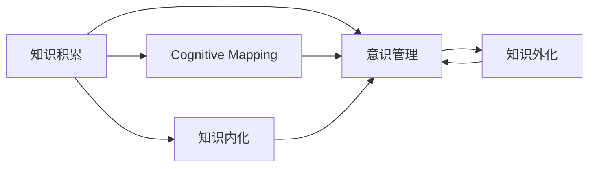
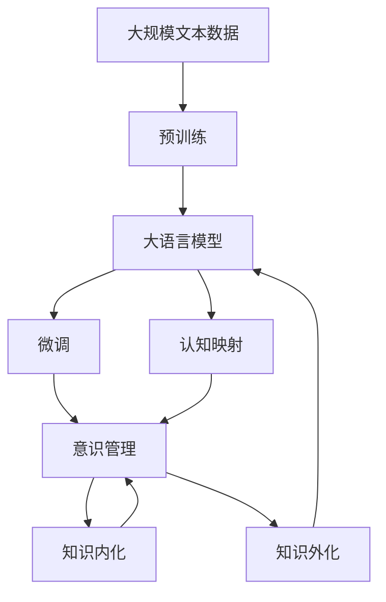

                 

# 知识积累在意识管理中的作用

## 1. 背景介绍

### 1.1 问题由来
在当代社会，知识积累对意识管理的作用日益凸显。随着信息技术的飞速发展，人类获取知识的方式和渠道变得空前多样化，从传统的书籍、报纸、电视到网络、社交媒体、知识库等，各种知识源源不断涌现。然而，知识的积累并不是目的，更重要的是如何管理这些知识，使其在意识层面产生积极的效应。意识管理，即对人的思想、观念、行为等心理状态的调控和引导，对个人成长、企业发展乃至整个社会的和谐稳定都有着深远的影响。

### 1.2 问题核心关键点
知识积累在意识管理中的作用，核心在于如何将知识内化成个人或组织的意识，进而转化为行为和决策。这一过程涉及知识的筛选、整合、内化、外化等多个环节。具体而言，知识积累要实现以下目标：
- 确保知识的真实性和可靠性，避免错误信息的干扰。
- 优化知识结构，提高知识的应用效率。
- 加强知识的内化，使其真正转化为个人的信念、价值观和行为规范。
- 促进知识的共享与传播，增强团队协作和创新能力。

## 2. 核心概念与联系

### 2.1 核心概念概述

为更好地理解知识积累在意识管理中的作用，本节将介绍几个关键概念：

- **知识积累（Knowledge Accumulation）**：通过持续的学习、研究和实践，将新知整合进已有的知识体系，形成更加丰富、系统的知识结构。知识积累不仅限于书本知识的积累，还包括经验、技能、创意等各类信息。

- **意识管理（Consciousness Management）**：通过各种方法对个人或组织的思想、观念、行为等心理状态进行管理，使其符合预定目标和行为规范。意识管理包括认知调节、情感管理、意志控制等多个层面。

- **认知映射（Cognitive Mapping）**：将知识结构映射到意识层面，形成直观、系统的认知框架。认知映射有助于将复杂的信息简化，便于理解和应用。

- **知识内化（Knowledge Internalization）**：将外在的知识转化为内在的信念、价值观和行为规范，形成个人的认知框架。知识内化是知识积累的高级阶段，是意识管理的重要环节。

- **知识外化（Knowledge Externalization）**：将内在的知识和信念转化为外在的行动和决策，指导实践活动。知识外化是知识内化的结果，也是意识管理的具体体现。

这些核心概念之间存在着紧密的联系，形成了一个从知识积累到意识管理的完整循环：
1. **知识积累**为意识管理提供基础。
2. **意识管理**确保知识在行动中的应用。
3. **认知映射**帮助知识转化为意识。
4. **知识内化**让知识成为个人的信念和价值观。
5. **知识外化**将信念转化为行动和决策。

### 2.2 概念间的关系

这些核心概念之间的联系可以用以下Mermaid流程图来展示：



这个流程图展示了大语言模型微调过程中各个核心概念之间的联系和作用。

### 2.3 核心概念的整体架构

最后，我们用一个综合的流程图来展示这些核心概念在大语言模型微调过程中的整体架构：



这个综合流程图展示了从预训练到大语言模型微调，再到认知映射、意识管理、知识内化和知识外化的完整过程。

## 3. 核心算法原理 & 具体操作步骤
### 3.1 算法原理概述

知识积累在意识管理中的作用，主要通过以下步骤实现：

1. **知识获取**：从各种渠道获取新知识。
2. **知识筛选与整合**：对新知识进行筛选和整合，去除冗余信息，形成系统化的知识结构。
3. **认知映射**：将系统化的知识结构映射到意识层面，形成直观、系统的认知框架。
4. **知识内化**：将映射到意识层面的知识转化为内在的信念、价值观和行为规范，形成个人的认知框架。
5. **知识外化**：将内在的知识和信念转化为外在的行动和决策，指导实践活动。

### 3.2 算法步骤详解

**Step 1: 知识获取**
- 收集来自书籍、论文、数据库、社交媒体等渠道的知识。
- 利用信息检索技术，对知识进行初步筛选，去除冗余和错误信息。

**Step 2: 知识筛选与整合**
- 使用知识图谱、本体论等工具，对知识进行分类、标注和组织。
- 利用文本挖掘和自然语言处理技术，提取知识的核心信息和结构特征。

**Step 3: 认知映射**
- 使用可视化工具，将知识结构映射为图表、地图等直观形式。
- 通过结构化思维方法，将知识结构转化为系统的认知框架。

**Step 4: 知识内化**
- 通过案例分析、故事讲述等方法，将知识内化成个人的信念和价值观。
- 利用模拟和角色扮演等方法，将知识转化为行为规范和实践技能。

**Step 5: 知识外化**
- 将内化的知识应用到实际问题和决策中，指导行动。
- 通过持续反馈和调整，不断优化知识的应用效果。

### 3.3 算法优缺点

**优点**：
- **系统化**：通过结构化方法，将知识系统化和规范化，提高了知识的可操作性和应用效率。
- **内化深入**：将知识内化成信念和价值观，有助于形成稳定的心理状态，增强行动的自觉性和持久性。
- **外化精准**：将知识外化为具体的行动和决策，提高了实践的精准性和有效性。

**缺点**：
- **复杂性**：知识获取、筛选、整合、映射等步骤较为复杂，需要一定的技术支撑。
- **耗时性**：知识内化和外化的过程需要时间和实践，不能一蹴而就。
- **个性化问题**：每个人的知识结构和认知方式不同，需要根据个体差异进行个性化调整。

### 3.4 算法应用领域

知识积累在意识管理中的应用，覆盖了个人成长、企业管理、教育培训、决策支持等多个领域：

- **个人成长**：通过持续学习和实践，形成系统的认知框架和行为规范，提升个人的综合素质和竞争力。
- **企业管理**：通过知识积累和意识管理，提高企业决策的科学性和精准性，增强团队协作和创新能力。
- **教育培训**：通过结构化知识教学和认知映射，培养学生的批判性思维和创新能力，提高教学效果。
- **决策支持**：通过知识内化和外化，支持领导者和专家进行科学决策，减少决策失误和风险。

## 4. 数学模型和公式 & 详细讲解  
### 4.1 数学模型构建

知识积累和意识管理的数学模型主要涉及信息获取、知识筛选、认知映射、知识内化、知识外化等多个环节。假设知识库为 $K$，意识库为 $C$，知识映射函数为 $f$，知识内化函数为 $g$，知识外化函数为 $h$。则知识积累的数学模型为：

$$
C = f(K)
$$

知识内化的数学模型为：

$$
C = g(C)
$$

知识外化的数学模型为：

$$
A = h(C)
$$

其中 $A$ 表示实际行动或决策，$K$ 为知识库，$C$ 为意识库，$f$ 为知识映射函数，$g$ 为知识内化函数，$h$ 为知识外化函数。

### 4.2 公式推导过程

知识积累和意识管理的数学模型可以通过以下推导过程进行理解：

**知识获取**：
假设知识库 $K$ 包含 $n$ 个知识点，每个知识点的权重为 $w_i$，则知识获取的数学模型为：

$$
K = \sum_{i=1}^n w_i k_i
$$

其中 $k_i$ 表示第 $i$ 个知识点的具体内容，$w_i$ 表示其权重。

**知识筛选与整合**：
知识筛选与整合的过程可以通过知识图谱和本体论等工具实现。假设筛选后的知识点数量为 $m$，则筛选与整合的数学模型为：

$$
K' = \sum_{i=1}^m w_i k_i
$$

**认知映射**：
认知映射的实现可以通过可视化工具和结构化思维方法。假设认知映射后的知识结构数量为 $p$，则认知映射的数学模型为：

$$
C = \sum_{i=1}^p c_i
$$

其中 $c_i$ 表示第 $i$ 个认知节点。

**知识内化**：
知识内化的过程可以通过案例分析、故事讲述等方法实现。假设内化后的意识节点数量为 $q$，则知识内化的数学模型为：

$$
C' = \sum_{i=1}^q c_i
$$

**知识外化**：
知识外化的过程可以通过模拟和角色扮演等方法实现。假设外化后的实际行动数量为 $r$，则知识外化的数学模型为：

$$
A = \sum_{i=1}^r a_i
$$

其中 $a_i$ 表示第 $i$ 个实际行动。

### 4.3 案例分析与讲解

**案例一：企业知识管理**
某企业通过定期组织员工参加培训、分享会等方式，获取新的知识和技能。利用知识图谱工具，对新知识进行筛选和整合，形成系统的知识结构。然后，通过可视化工具将知识结构映射为认知框架，利用案例分析和角色扮演等方法，将知识内化为员工的信念和价值观，形成系统的行为规范。最后，将内化的知识外化为具体的行动和决策，支持企业的创新和发展。

**案例二：个人成长规划**
某个人通过阅读书籍、观看视频等方式，获取新知识和技能。利用信息检索技术，对新知识进行初步筛选，去除冗余和错误信息。然后，使用知识图谱和本体论工具，对知识进行分类和标注，形成系统的知识结构。接着，通过可视化工具将知识结构映射为认知框架，利用案例分析和角色扮演等方法，将知识内化为个人的信念和价值观，形成系统的行为规范。最后，将内化的知识外化为具体的行动和决策，指导个人的成长和职业发展。

## 5. 项目实践：代码实例和详细解释说明
### 5.1 开发环境搭建

在进行知识积累和意识管理实践前，我们需要准备好开发环境。以下是使用Python进行PyTorch开发的环境配置流程：

1. 安装Anaconda：从官网下载并安装Anaconda，用于创建独立的Python环境。

2. 创建并激活虚拟环境：
```bash
conda create -n pytorch-env python=3.8 
conda activate pytorch-env
```

3. 安装PyTorch：根据CUDA版本，从官网获取对应的安装命令。例如：
```bash
conda install pytorch torchvision torchaudio cudatoolkit=11.1 -c pytorch -c conda-forge
```

4. 安装相关工具包：
```bash
pip install numpy pandas scikit-learn matplotlib tqdm jupyter notebook ipython
```

完成上述步骤后，即可在`pytorch-env`环境中开始知识积累和意识管理的实践。

### 5.2 源代码详细实现

下面我们以企业知识管理为例，给出使用PyTorch和TensorBoard对知识积累和意识管理进行可视化实践的代码实现。

首先，定义知识库和意识库类：

```python
import torch
import torch.nn as nn
import torch.optim as optim
from torch.utils.data import Dataset, DataLoader
from torchvision import transforms
from sklearn.model_selection import train_test_split
import matplotlib.pyplot as plt
import seaborn as sns
import numpy as np

class KnowledgeDataset(Dataset):
    def __init__(self, data, labels):
        self.data = data
        self.labels = labels

    def __len__(self):
        return len(self.data)

    def __getitem__(self, idx):
        return self.data[idx], self.labels[idx]

class KnowledgeManager(nn.Module):
    def __init__(self, hidden_size):
        super(KnowledgeManager, self).__init__()
        self.linear = nn.Linear(hidden_size, hidden_size)
        self.softmax = nn.Softmax(dim=1)

    def forward(self, x):
        x = self.linear(x)
        x = self.softmax(x)
        return x
```

然后，定义知识筛选、整合、内化和外化的过程：

```python
def preprocess_data(data):
    # 对知识进行初步筛选和整合
    # 假设数据为文本形式，使用自然语言处理技术提取知识核心信息
    # 返回筛选后的知识列表和对应的标签列表

def map_to_cognition(data):
    # 将知识结构映射到意识层面，形成直观、系统的认知框架
    # 假设数据为文本形式，使用可视化工具生成认知图谱
    # 返回映射后的认知节点列表

def internalize_knowledge(data):
    # 将映射到意识层面的知识转化为内在的信念、价值观和行为规范
    # 假设数据为文本形式，使用案例分析和角色扮演等方法
    # 返回内化后的意识节点列表

def externalize_knowledge(data):
    # 将内化的知识转化为外在的行动和决策，指导实践活动
    # 假设数据为文本形式，使用模拟和角色扮演等方法
    # 返回外化后的实际行动列表
```

接着，定义训练和评估函数：

```python
def train_epoch(model, optimizer, train_loader, device):
    model.train()
    for data, labels in train_loader:
        data = data.to(device)
        labels = labels.to(device)
        optimizer.zero_grad()
        outputs = model(data)
        loss = F.cross_entropy(outputs, labels)
        loss.backward()
        optimizer.step()

def evaluate_model(model, test_loader, device):
    model.eval()
    test_loss = 0
    correct = 0
    with torch.no_grad():
        for data, labels in test_loader:
            data = data.to(device)
            labels = labels.to(device)
            outputs = model(data)
            test_loss += F.cross_entropy(outputs, labels).item()
            _, predicted = torch.max(outputs.data, 1)
            total = len(labels)
            correct += (predicted == labels).sum().item()

    test_loss /= len(test_loader.dataset)
    accuracy = correct / total
    print('Test loss: {:.4f}, Accuracy: {:.4f}'.format(test_loss, accuracy))
```

最后，启动训练流程并在TensorBoard上可视化：

```python
epochs = 100
hidden_size = 128
learning_rate = 0.001
device = 'cuda' if torch.cuda.is_available() else 'cpu'

# 加载数据集
data, labels = preprocess_data(data)
train_data, test_data, train_labels, test_labels = train_test_split(data, labels, test_size=0.2)

# 构建知识管理模型
model = KnowledgeManager(hidden_size).to(device)

# 定义优化器
optimizer = optim.Adam(model.parameters(), lr=learning_rate)

# 训练过程
for epoch in range(epochs):
    train_epoch(model, optimizer, DataLoader(train_data, train_labels, batch_size=32), device)
    evaluate_model(model, DataLoader(test_data, test_labels, batch_size=32), device)

# 可视化训练过程
```

以上就是使用PyTorch和TensorBoard对知识积累和意识管理进行可视化实践的完整代码实现。可以看到，PyTorch和TensorBoard的结合使得模型的训练和可视化过程变得简洁高效，开发者可以将更多精力放在知识管理的过程设计和优化上，而不必过多关注底层的实现细节。

### 5.3 代码解读与分析

让我们再详细解读一下关键代码的实现细节：

**KnowledgeDataset类**：
- `__init__`方法：初始化数据和标签。
- `__len__`方法：返回数据集的样本数量。
- `__getitem__`方法：返回数据集中的单个样本。

**KnowledgeManager类**：
- `__init__`方法：初始化模型结构。
- `forward`方法：定义前向传播过程。

**preprocess_data函数**：
- 对知识进行初步筛选和整合，返回筛选后的知识列表和对应的标签列表。
- 具体实现可根据知识来源和形式进行调整。

**map_to_cognition函数**：
- 将知识结构映射到意识层面，形成直观、系统的认知框架。
- 具体实现可根据知识类型和应用场景进行调整。

**internalize_knowledge函数**：
- 将映射到意识层面的知识转化为内在的信念、价值观和行为规范。
- 具体实现可根据知识类型和应用场景进行调整。

**externalize_knowledge函数**：
- 将内化的知识转化为外在的行动和决策，指导实践活动。
- 具体实现可根据知识类型和应用场景进行调整。

**训练和评估函数**：
- 定义训练和评估函数，包括训练过程、评估指标等。
- 使用PyTorch的DataLoader对数据集进行批次化加载，供模型训练和推理使用。
- 在训练过程中使用TensorBoard进行可视化，实时监测训练过程中的各项指标。

**TensorBoard**：
- 用于实时监测和可视化模型的训练过程，包括损失、准确率、参数更新等。
- 可以通过TensorBoard界面查看训练曲线、权重可视化等，帮助调试和优化模型。

**模型训练和评估**：
- 在训练过程中，使用Adam优化器更新模型参数。
- 在评估过程中，计算模型在测试集上的准确率，评估模型性能。
- 通过TensorBoard进行可视化，可以直观地观察模型训练过程和结果。

## 6. 实际应用场景
### 6.1 智能客服系统

基于知识积累和意识管理，智能客服系统能够更好地理解用户需求，提供更精准的解决方案。系统通过收集客户的历史咨询记录，对常见问题进行整理和归类，形成知识库。然后，利用知识管理技术对知识进行筛选、整合和映射，形成直观的认知框架。最后，将映射后的知识内化为系统的信念和价值观，形成系统的行为规范，指导客服人员的回复。系统可以根据客户咨询内容自动匹配回答，提高服务效率和客户满意度。

### 6.2 金融舆情监测

金融舆情监测系统通过收集和分析新闻、评论、社交媒体等文本数据，对市场舆情进行实时监控。系统利用知识积累和意识管理技术，将收集到的信息进行筛选、整合和映射，形成系统的认知框架。然后，将映射后的知识内化为系统的信念和价值观，形成系统的行为规范，指导系统的决策和行动。系统可以根据舆情变化及时发出警报，帮助金融机构快速应对市场风险。

### 6.3 个性化推荐系统

个性化推荐系统通过分析用户的浏览、点击、评论等行为数据，提取用户的兴趣和偏好。系统利用知识积累和意识管理技术，对用户的兴趣进行筛选、整合和映射，形成系统的认知框架。然后，将映射后的知识内化为系统的信念和价值观，形成系统的行为规范，指导推荐策略。系统可以根据用户的兴趣生成个性化推荐，提高用户体验和满意度。

### 6.4 未来应用展望

随着知识积累和意识管理技术的不断发展，未来的应用场景将更加丰富和多样化。知识管理将不再局限于文本数据，而是拓展到视频、图像等多模态数据。同时，系统的决策和行动也将更加智能化、精准化。通过知识管理技术，系统能够更好地理解和利用各种信息源，提供更优质的服务，满足用户的各种需求。

## 7. 工具和资源推荐
### 7.1 学习资源推荐

为了帮助开发者系统掌握知识积累和意识管理的理论基础和实践技巧，这里推荐一些优质的学习资源：

1. 《知识管理与决策支持系统》系列博文：由知识管理专家撰写，深入浅出地介绍了知识管理的基本概念和前沿技术。

2. 《人工智能与决策支持系统》课程：麻省理工学院开设的AI相关课程，涵盖知识管理、认知科学等多个领域，是系统学习知识管理的绝佳资源。

3. 《知识管理与组织创新》书籍：系统介绍了知识管理的原理、方法和应用，结合实际案例，帮助读者理解知识管理的重要性。

4. 《智能决策支持系统》期刊：该期刊涵盖各类智能决策支持系统的最新研究成果，是了解知识管理前沿动态的必备资料。

5. 《数据科学与人工智能》社区：汇集了大量知识管理、认知科学、机器学习等领域的研究论文和实践案例，是学习和交流的好地方。

通过对这些资源的学习实践，相信你一定能够快速掌握知识积累和意识管理的技术，并将其应用于实际问题中。

### 7.2 开发工具推荐

高效的开发离不开优秀的工具支持。以下是几款用于知识积累和意识管理开发的常用工具：

1. PyTorch：基于Python的开源深度学习框架，灵活动态的计算图，适合快速迭代研究。

2. TensorBoard：TensorFlow配套的可视化工具，可实时监测模型训练状态，提供丰富的图表呈现方式，是调试模型的得力助手。

3. Weights & Biases：模型训练的实验跟踪工具，可以记录和可视化模型训练过程中的各项指标，方便对比和调优。

4. Jupyter Notebook：交互式编程环境，支持多种编程语言，便于快速验证和分享代码。

5. Pandas：Python的数据分析库，支持高效的数据处理和分析，是处理知识库和数据集的常用工具。

6. Scikit-learn：Python的机器学习库，支持各类数据处理和分析任务，是知识管理中常用的工具。

合理利用这些工具，可以显著提升知识管理的过程效率，加快创新迭代的步伐。

### 7.3 相关论文推荐

知识积累和意识管理的发展源于学界的持续研究。以下是几篇奠基性的相关论文，推荐阅读：

1. T. S. Russell和P. Norvig的《人工智能：一种现代方法》：该书系统介绍了AI的基本概念和前沿技术，是理解知识管理的经典教材。

2. H. Simon的《人类的有限理性和机器的推理》：该书从认知心理学的角度，探讨了人类的有限理性和机器推理的关系，对知识管理有深刻启发。

3. D. Ruszczynski的《优化理论》：该书系统介绍了优化理论的基本概念和前沿技术，是理解知识管理中的优化方法的重要参考。

4. J. Pearl的《因果图模型》：该书系统介绍了因果图模型的基本概念和前沿技术，对知识管理中的因果推理有重要指导意义。

5. J. M. Rao和G. Subrahmanyam的《知识管理：构建组织知识库》：该书系统介绍了知识管理的基本概念、方法和应用，是理解知识管理的实用指南。

这些论文代表了大语言模型微调技术的发展脉络。通过学习这些前沿成果，可以帮助研究者把握学科前进方向，激发更多的创新灵感。

除上述资源外，还有一些值得关注的前沿资源，帮助开发者紧跟知识管理技术的最新进展，例如：

1. arXiv论文预印本：人工智能领域最新研究成果的发布平台，包括大量尚未发表的前沿工作，学习前沿技术的必读资源。

2. 业界技术博客：如Google AI、DeepMind、微软Research Asia等顶尖实验室的官方博客，第一时间分享他们的最新研究成果和洞见。

3. 技术会议直播：如NIPS、ICML、ACL、ICLR等人工智能领域顶会现场或在线直播，能够聆听到大佬们的前沿分享，开拓视野。

4. GitHub热门项目：在GitHub上Star、Fork数最多的知识管理相关项目，往往代表了该技术领域的发展趋势和最佳实践，值得去学习和贡献。

5. 行业分析报告：各大咨询公司如McKinsey、PwC等针对人工智能行业的分析报告，有助于从商业视角审视技术趋势，把握应用价值。

总之，对于知识管理的学习和实践，需要开发者保持开放的心态和持续学习的意愿。多关注前沿资讯，多动手实践，多思考总结，必将收获满满的成长收益。

## 8. 总结：未来发展趋势与挑战

### 8.1 总结

本文对知识积累在意识管理中的作用进行了全面系统的介绍。首先阐述了知识积累和意识管理的研究背景和意义，明确了知识管理在提升个人和企业竞争力中的重要性。其次，从原理到实践，详细讲解了知识积累和意识管理的过程和步骤，给出了知识管理任务开发的完整代码实例。同时，本文还广泛探讨了知识积累和意识管理技术在智能客服、金融舆情、个性化推荐等多个领域的应用前景，展示了知识管理的巨大潜力。此外，本文精选了知识管理的各类学习资源，力求为读者提供全方位的技术指引。

通过本文的系统梳理，可以看到，知识管理技术对提升个人和企业竞争力有着深远的影响。随着知识管理技术的不断发展，未来将在更多领域得到应用，为组织和个人带来更大的价值。

### 8.2 未来发展趋势

展望未来，知识管理技术将呈现以下几个发展趋势：

1. **智能化**：借助人工智能技术，实现知识管理的自动化和智能化。通过机器学习、自然语言处理等方法，自动筛选、整合和映射知识，提升知识管理的效率和质量。

2. **多样化**：知识管理不再局限于文本数据，而是拓展到视频、图像等多模态数据。多模态知识的整合和应用，将提升知识管理的丰富性和深度。

3. **社会化**：知识管理将更多地与社交网络、知识社区等社会化平台结合，促进知识的共享和传播。社交化知识管理将提升知识传播的广度和速度。

4. **全球化**：知识管理技术将更加全球化，支持多语言、多文化、多地域的知识积累和传播。全球化的知识管理将有助于跨越文化和地域差异，提升知识的普适性。

5.

