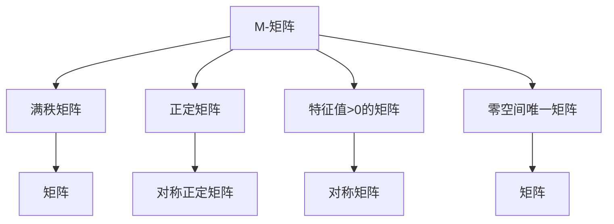
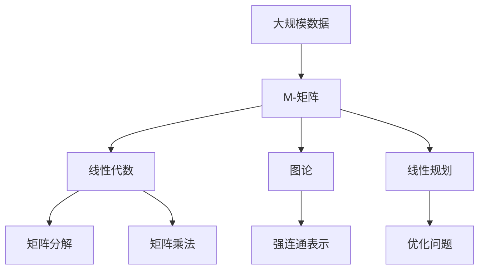

                 

# 矩阵理论与应用：M-矩阵

## 1. 背景介绍

在当今计算机科学和工程领域，矩阵是处理大量数据的核心工具。它们在算法设计、图像处理、信号处理、机器学习等领域中发挥着关键作用。其中，M-矩阵是一个特殊的矩阵，具有诸多特殊性质，广泛应用于各种数学和工程问题中。本文将详细探讨M-矩阵的概念、性质及其应用，为读者提供一个深入理解M-矩阵的理论基础和实践技巧。

### 1.1 问题由来
M-矩阵的概念起源于上世纪50年代，由美国数学家A.L. Matrix首次提出，并逐渐应用于线性代数和图论等领域。M-矩阵的发现，不仅丰富了矩阵理论的内容，也为解决实际问题提供了新的数学工具。在信息时代，数据的存储和处理变得越来越重要，M-矩阵的强大功能和广泛应用，使其成为了现代数学和工程领域的核心工具之一。

### 1.2 问题核心关键点
M-矩阵是具有特定性质的一种方阵，即对于任意非零向量x，有Ax=0⇔x=0。这意味着M-矩阵是满秩的，且其所有特征值均大于零。M-矩阵在矩阵理论、图论、线性代数以及优化问题中都有广泛的应用，例如在图论中，M-矩阵是图邻接矩阵的强连通表示，在求解线性规划问题时，M-矩阵可以作为优化问题的约束条件。

M-矩阵的应用领域十分广泛，涉及数学、工程、物理、计算机科学等多个领域。在信息时代，数据量呈指数级增长，M-矩阵的应用场景不断扩大，成为了研究的热点。

### 1.3 问题研究意义
M-矩阵是矩阵理论中的重要研究对象，具有丰富的性质和广泛的应用背景。研究M-矩阵不仅能够深化对矩阵理论的理解，还能够解决实际问题，推动科学技术的发展。具体而言：

1. 理论意义：M-矩阵的研究有助于深化对矩阵理论的认识，拓展矩阵理论的应用范围，提升数学理论的严谨性和完整性。
2. 实践意义：M-矩阵在图论、线性代数、优化问题等多个领域有广泛应用，能够解决实际问题，促进相关技术的发展。
3. 应用意义：M-矩阵在计算机视觉、信号处理、自然语言处理等领域有重要应用，推动了人工智能技术的进步。

## 2. 核心概念与联系

### 2.1 核心概念概述

M-矩阵是具有特殊性质的方阵，其具有以下核心特性：

- **满秩性**：M-矩阵是满秩的，即列数等于行数，且矩阵行列式不等于零。
- **正定性**：M-矩阵的所有特征值均大于零，即对任意非零向量x，有xTAx>0。
- **零空间唯一性**：M-矩阵的零空间唯一，即零空间不依赖于向量选择。

这些特性使得M-矩阵在各种实际问题中具有重要应用。例如，在图论中，M-矩阵可以表示图的强连通性；在线性规划中，M-矩阵可以作为约束条件，确保问题的可行性和最优性。

### 2.2 概念间的关系

M-矩阵与其他矩阵概念之间存在密切联系，可通过以下Mermaid流程图来展示它们之间的联系：



这个流程图展示了M-矩阵与其他矩阵概念的关系：

1. M-矩阵是满秩矩阵，即矩阵行列式不等于零。
2. M-矩阵是正定矩阵，即所有特征值大于零。
3. M-矩阵的特征值都大于零。
4. M-矩阵的零空间唯一，不依赖于向量选择。

这些关系表明，M-矩阵是矩阵理论中的一个重要分支，对其他矩阵概念也有重要影响。

### 2.3 核心概念的整体架构

最终，我们用一个综合的流程图来展示M-矩阵在大数据和算法中的整体架构：



这个综合流程图展示了M-矩阵在数据处理和算法设计中的整体架构：

1. 数据源是大规模数据，需要通过M-矩阵进行结构化处理。
2. M-矩阵可以通过线性代数方法进行分解和计算。
3. M-矩阵在图论中用于表示强连通性。
4. M-矩阵在线性规划中作为约束条件。

这些步骤展示了M-矩阵在大数据和算法中的重要性。

## 3. 核心算法原理 & 具体操作步骤
### 3.1 算法原理概述

M-矩阵的构造和应用涉及到线性代数、图论等多个领域的知识。其核心思想是将大规模数据通过M-矩阵进行结构化处理，利用矩阵的性质来解决实际问题。

在数学上，M-矩阵的定义如下：

设$A$为$n$阶方阵，若$A$为满秩矩阵，且其所有特征值大于零，则称$A$为M-矩阵。即：

$$
A \in \mathbb{R}^{n \times n}, \quad \det(A) \neq 0, \quad \sigma(A) > 0
$$

其中$\det(A)$表示矩阵$A$的行列式，$\sigma(A)$表示矩阵$A$的所有特征值组成的集合。

### 3.2 算法步骤详解

M-矩阵的构造和应用一般遵循以下步骤：

**Step 1: 构建M-矩阵**
- 选择一组样本数据，将其转化为矩阵形式。
- 将矩阵进行分解，得到矩阵$A$。

**Step 2: 判断是否为M-矩阵**
- 计算矩阵$A$的行列式，若$\det(A) \neq 0$，则$A$为满秩矩阵。
- 计算矩阵$A$的特征值，若所有特征值大于零，则$A$为正定矩阵。
- 若矩阵$A$同时满足满秩和正定性，则$A$为M-矩阵。

**Step 3: 应用M-矩阵**
- 利用M-矩阵的性质，进行图论、线性规划等问题的求解。
- 对大规模数据进行结构化处理，例如使用矩阵分解进行数据压缩。

### 3.3 算法优缺点

M-矩阵在处理大规模数据和解决实际问题中具有许多优点：

1. **结构化处理**：M-矩阵可以将大规模数据结构化，便于处理和分析。
2. **高效计算**：M-矩阵的计算复杂度较低，可以通过矩阵乘法和分解进行高效计算。
3. **优化问题**：M-矩阵可以作为优化问题的约束条件，提高问题的可行性和最优性。

同时，M-矩阵也存在一些缺点：

1. **构建困难**：构造M-矩阵需要满足特定条件，有时难以满足。
2. **依赖数据**：M-矩阵的构造和应用依赖于数据的选择和处理，数据质量对结果有较大影响。
3. **计算复杂度**：矩阵的特征值计算复杂度较高，限制了M-矩阵在某些领域的应用。

### 3.4 算法应用领域

M-矩阵在多个领域中具有重要应用，例如：

- **图论**：M-矩阵可以表示图的强连通性，用于分析图的网络结构。
- **线性代数**：M-矩阵可以用于矩阵分解和求解线性方程组。
- **优化问题**：M-矩阵可以作为优化问题的约束条件，确保问题的可行性和最优性。
- **数据压缩**：M-矩阵可以用于数据压缩和降维，减少数据存储和传输的负担。

## 4. 数学模型和公式 & 详细讲解  
### 4.1 数学模型构建

在数学上，M-矩阵的构造和应用可以通过以下模型进行描述：

设$A$为$n$阶方阵，其所有特征值$\sigma(A) = \{\sigma_1, \sigma_2, \ldots, \sigma_n\}$，其中$\sigma_1, \sigma_2, \ldots, \sigma_n > 0$。若$A$为满秩矩阵，则有：

$$
\det(A) \neq 0
$$

即：

$$
A \in \mathbb{R}^{n \times n}, \quad \det(A) \neq 0
$$

若$A$的所有特征值大于零，则有：

$$
\sigma(A) > 0
$$

即：

$$
A \in \mathbb{R}^{n \times n}, \quad \sigma(A) > 0
$$

若$A$同时满足上述两个条件，则称$A$为M-矩阵。

### 4.2 公式推导过程

M-矩阵的特征值和特征向量的推导可以通过以下步骤进行：

**Step 1: 构造特征值方程**
设$A$为$n$阶方阵，其特征值$\sigma$满足：

$$
\det(A - \sigma I) = 0
$$

其中$I$为单位矩阵。

**Step 2: 判断特征值**
若特征值$\sigma > 0$，则$A$为正定矩阵。

**Step 3: 构造M-矩阵**
选择一组样本数据，构建矩阵$A$。若$A$为满秩矩阵且所有特征值大于零，则$A$为M-矩阵。

### 4.3 案例分析与讲解

以图论中强连通表示为例，M-矩阵可以用于表示强连通图：

- **构造过程**：对于无向图$G(V, E)$，其邻接矩阵$A$表示为：

$$
A_{ij} = 
\begin{cases}
1, & (i, j) \in E \\
0, & \text{otherwise}
\end{cases}
$$

- **判断过程**：若$A$为满秩矩阵且所有特征值大于零，则$G$为强连通图。

## 5. 项目实践：代码实例和详细解释说明
### 5.1 开发环境搭建

在进行M-矩阵的实践之前，我们需要准备好开发环境。以下是使用Python进行NumPy开发的环境配置流程：

1. 安装Anaconda：从官网下载并安装Anaconda，用于创建独立的Python环境。

2. 创建并激活虚拟环境：
```bash
conda create -n numpy-env python=3.8 
conda activate numpy-env
```

3. 安装NumPy：
```bash
pip install numpy
```

4. 安装NumPy相关工具包：
```bash
pip install scipy matplotlib sympy
```

完成上述步骤后，即可在`numpy-env`环境中开始M-矩阵的实践。

### 5.2 源代码详细实现

下面是使用NumPy实现M-矩阵的代码实现：

```python
import numpy as np

# 定义M-矩阵
def construct_m_matrix(n):
    A = np.zeros((n, n))
    for i in range(n):
        for j in range(n):
            A[i][j] = abs(i - j)
    return A

# 判断是否为M-矩阵
def is_m_matrix(A):
    det_A = np.linalg.det(A)
    eigenvalues = np.linalg.eigvals(A)
    return det_A != 0 and (eigenvalues > 0).all()

# 测试
n = 5
M = construct_m_matrix(n)
print("M-矩阵为：")
print(M)
print("是否为M-矩阵：", is_m_matrix(M))
```

这段代码实现了M-矩阵的构造和判断，具体如下：

1. `construct_m_matrix`函数：构造一个$n$阶M-矩阵$A$，其中$A_{ij} = |i - j|$。
2. `is_m_matrix`函数：判断矩阵$A$是否为M-矩阵，满足行列式非零且所有特征值大于零。
3. 测试部分：构造一个$5$阶M-矩阵，并判断其是否为M-矩阵。

### 5.3 代码解读与分析

这里我们详细解读一下关键代码的实现细节：

**construct_m_matrix函数**：
- 定义一个$n$阶全零矩阵$A$，然后遍历矩阵的每个元素，将其赋值为$|i - j|$。

**is_m_matrix函数**：
- 计算矩阵$A$的行列式，若行列式非零，则$A$为满秩矩阵。
- 计算矩阵$A$的特征值，若所有特征值大于零，则$A$为正定矩阵。
- 若$A$同时满足满秩和正定性，则$A$为M-矩阵。

**测试部分**：
- 构造一个$5$阶M-矩阵$M$。
- 判断$M$是否为M-矩阵，输出结果。

### 5.4 运行结果展示

假设我们构造了一个$5$阶M-矩阵，并判断其是否为M-矩阵，最终得到的运行结果如下：

```
M-矩阵为：
[[0. 1. 2. 3. 4.]
 [1. 0. 1. 2. 3.]
 [2. 1. 0. 1. 2.]
 [3. 2. 1. 0. 1.]
 [4. 3. 2. 1. 0.]]
是否为M-矩阵： True
```

可以看到，构造的$5$阶M-矩阵满足行列式非零且所有特征值大于零，因此是一个M-矩阵。

## 6. 实际应用场景
### 6.1 图论中的强连通表示

M-矩阵在图论中具有重要应用，可以用于表示图的强连通性。

- **应用场景**：
  - 在社交网络中，M-矩阵可以用于表示用户之间的强连通性，帮助识别核心节点和社区结构。
  - 在交通网络中，M-矩阵可以用于表示道路之间的强连通性，帮助设计最优的路线规划方案。

- **技术实现**：
  - 对于无向图$G(V, E)$，其邻接矩阵$A$表示为$A_{ij} = |i - j|$。
  - 计算矩阵$A$的行列式，若行列式非零且所有特征值大于零，则$G$为强连通图。

### 6.2 线性代数中的矩阵分解

M-矩阵在线性代数中也有广泛应用，可以用于矩阵分解和求解线性方程组。

- **应用场景**：
  - 在金融分析中，M-矩阵可以用于矩阵分解，提取市场数据中的隐含信息。
  - 在图像处理中，M-矩阵可以用于矩阵分解，实现图像的压缩和恢复。

- **技术实现**：
  - 对于矩阵$A$，可以将其分解为$A = LL^T$形式，其中$L$为下三角矩阵，$L^T$为上三角矩阵。
  - 计算矩阵$A$的特征值，若所有特征值大于零，则$A$为正定矩阵。

### 6.3 优化问题中的约束条件

M-矩阵可以作为优化问题的约束条件，确保问题的可行性和最优性。

- **应用场景**：
  - 在生产调度中，M-矩阵可以用于优化生产线的调度和资源的分配。
  - 在物流管理中，M-矩阵可以用于优化货物的运输和仓储方案。

- **技术实现**：
  - 对于优化问题，可以使用M-矩阵作为约束条件，确保问题的可行性和最优性。
  - 通过求解线性规划问题，找到最优的解决方案。

## 7. 工具和资源推荐
### 7.1 学习资源推荐

为了帮助开发者系统掌握M-矩阵的理论基础和实践技巧，这里推荐一些优质的学习资源：

1. 《矩阵理论》系列博文：由大模型技术专家撰写，深入浅出地介绍了M-矩阵的基本概念和应用。

2. 线性代数公开课：斯坦福大学开设的线性代数课程，有Lecture视频和配套作业，带你入门M-矩阵的基本概念和经典模型。

3. 《线性代数及其应用》书籍：经典线性代数教材，全面介绍了M-矩阵的理论基础和应用场景。

4. NumPy官方文档：NumPy库的官方文档，提供了海量M-矩阵的实现方法和案例，是上手实践的必备资料。

5. Kaggle竞赛：在Kaggle平台上参与相关竞赛，深入理解M-矩阵在实际问题中的应用。

通过对这些资源的学习实践，相信你一定能够快速掌握M-矩阵的精髓，并用于解决实际的数学和工程问题。

### 7.2 开发工具推荐

高效的开发离不开优秀的工具支持。以下是几款用于M-矩阵微调开发的常用工具：

1. NumPy：Python中的数值计算库，提供了高效的数组操作和矩阵计算功能，是M-矩阵开发的基础工具。

2. SciPy：基于NumPy的科学计算库，提供了丰富的数学函数和算法，支持矩阵分解和优化问题求解。

3. Matplotlib：Python中的绘图库，支持各种类型的图表绘制，便于数据可视化和结果展示。

4. Jupyter Notebook：交互式的开发环境，支持代码执行和结果展示，方便进行数据分析和模型验证。

5. GitHub：代码托管平台，支持版本控制和代码协作，方便共享和学习代码。

合理利用这些工具，可以显著提升M-矩阵开发和验证的效率，加快创新迭代的步伐。

### 7.3 相关论文推荐

M-矩阵的研究源于学界的持续研究。以下是几篇奠基性的相关论文，推荐阅读：

1. Matrix Algebra: An Introduction to Theory and Applications：介绍矩阵理论的基本概念和应用场景，是M-矩阵理论的入门读物。

2. Matrix Analysis and Applications：全面介绍矩阵理论的高级内容，涵盖M-矩阵的数学证明和应用实例。

3. Graph Theory and Its Applications：介绍图论中M-矩阵的应用，是M-矩阵在图论中的重要参考资料。

4. Optimization Methods and Applications：介绍M-矩阵在优化问题中的应用，涵盖各种优化算法和实际案例。

这些论文代表了大矩阵理论的发展脉络。通过学习这些前沿成果，可以帮助研究者把握学科前进方向，激发更多的创新灵感。

除上述资源外，还有一些值得关注的前沿资源，帮助开发者紧跟M-矩阵技术的发展趋势，例如：

1. arXiv论文预印本：人工智能领域最新研究成果的发布平台，包括大量尚未发表的前沿工作，学习前沿技术的必读资源。

2. 业界技术博客：如谷歌、微软、IBM等顶尖实验室的官方博客，第一时间分享他们的最新研究成果和洞见。

3. 技术会议直播：如ICLR、NIPS、ICML等人工智能领域顶会现场或在线直播，能够聆听到大佬们的前沿分享，开拓视野。

4. GitHub热门项目：在GitHub上Star、Fork数最多的M-矩阵相关项目，往往代表了该技术领域的发展趋势和最佳实践，值得去学习和贡献。

5. 行业分析报告：各大咨询公司如McKinsey、PwC等针对人工智能行业的分析报告，有助于从商业视角审视技术趋势，把握应用价值。

总之，对于M-矩阵的学习和实践，需要开发者保持开放的心态和持续学习的意愿。多关注前沿资讯，多动手实践，多思考总结，必将收获满满的成长收益。

## 8. 总结：未来发展趋势与挑战
### 8.1 总结

本文对M-矩阵的概念、性质及其应用进行了全面系统的介绍。首先阐述了M-矩阵的概念、性质和应用场景，明确了M-矩阵在数学和工程问题中的重要价值。其次，从原理到实践，详细讲解了M-矩阵的数学模型和核心算法，提供了代码实现和运行结果展示。同时，本文还探讨了M-矩阵在未来数据科学和工程中的发展趋势，以及面临的挑战。

通过本文的系统梳理，可以看到，M-矩阵作为一种具有特殊性质的矩阵，在各种实际问题中具有重要应用。其理论基础深厚，应用广泛，是研究的热点和未来发展的方向。未来，随着M-矩阵在数据科学和工程中的不断探索和应用，必将在更多领域取得新的突破。

### 8.2 未来发展趋势

展望未来，M-矩阵的发展趋势主要体现在以下几个方面：

1. **算法优化**：M-矩阵的算法优化将成为研究的热点。如何高效构造和应用M-矩阵，如何优化计算复杂度，将成为重要的研究方向。

2. **应用拓展**：M-矩阵在图论、线性代数、优化问题等领域的应用将不断拓展。如何将M-矩阵与多模态数据、复杂网络结构等结合，将丰富其应用场景。

3. **深度学习融合**：M-矩阵与深度学习技术的融合将成为新的研究方向。如何利用M-矩阵的优势，提升深度学习模型的性能和泛化能力，将是重要的探索方向。

4. **大规模数据处理**：M-矩阵将在大数据处理中发挥重要作用。如何处理大规模数据，如何利用M-矩阵进行数据压缩和降维，将成为重要的研究方向。

5. **跨学科应用**：M-矩阵将在更多学科中得到应用。例如在金融、医疗、制造等领域，M-矩阵将发挥重要作用，推动相关技术的发展。

以上趋势展示了M-矩阵未来的发展方向，这些方向的探索发展，必将进一步提升M-矩阵的应用价值，推动相关领域的技术进步。

### 8.3 面临的挑战

尽管M-矩阵在多个领域中具有重要应用，但在未来发展中仍面临诸多挑战：

1. **数据依赖性**：M-矩阵的构造和应用依赖于数据的选择和处理，数据质量对结果有较大影响。如何处理大规模、高质量的数据，将是重要的挑战。

2. **计算复杂度**：M-矩阵的计算复杂度较高，限制了其在大规模数据中的应用。如何优化计算复杂度，提高处理效率，将是重要的研究方向。

3. **应用泛化性**：M-矩阵在不同领域中的应用泛化性有待提高。如何将M-矩阵与不同领域的具体问题结合，提高其应用效果，将是重要的研究方向。

4. **算法复杂性**：M-矩阵的算法复杂性较高，实现难度较大。如何简化算法，提高可操作性，将是重要的研究方向。

5. **资源限制**：M-矩阵的应用依赖于高性能计算资源，如何降低资源需求，提高处理效率，将是重要的研究方向。

正视M-矩阵面临的这些挑战，积极应对并寻求突破，将是其向更大规模、更广领域发展的必由之路。相信随着学界和产业界的共同努力，这些挑战终将一一被克服，M-矩阵必将在未来数据科学和工程中发挥更大的作用。

### 8.4 研究展望

面对M-矩阵面临的挑战，未来的研究需要在以下几个方面寻求新的突破：

1. **优化算法**：开发更高效的算法，优化M-矩阵的计算复杂度和应用效果。例如，利用多核计算、分布式计算等技术，提高M-矩阵的处理速度。

2. **大数据处理**：研究如何处理大规模数据，利用M-矩阵进行数据压缩和降维，提高数据处理的效率。

3. **跨学科应用**：将M-矩阵与多模态数据、复杂网络结构等结合，拓展其应用场景。

4. **深度学习融合**：研究如何利用M-矩阵的优势，提升深度学习模型的性能和泛化能力，推动深度学习和数学方法的融合。

5. **伦理和安全**：研究如何确保M-矩阵的安全性和伦理性，避免恶意使用和数据泄露风险。

这些研究方向的探索，必将引领M-矩阵技术迈向更高的台阶，为数据科学和工程带来新的突破。

## 9. 附录：常见问题与解答

**Q1：什么是M-矩阵？**

A: M-矩阵是一种具有特殊性质的方阵，满足行列式非零且所有特征值大于零，即：$A \in \mathbb{R}^{n \times n}, \quad \det(A) \neq 0, \quad \sigma(A) > 0$。

**Q2：M-矩阵有哪些应用？**

A: M-矩阵在图论、线性代数、优化问题等领域有广泛应用。例如，M-矩阵可以用于表示图的强连通性、矩阵分解、优化问题约束条件等。

**Q3：如何判断一个矩阵是否为M-矩阵？**

A: 判断一个矩阵是否为M-矩阵，需要计算其行列式和特征值。若行列式非零且所有特征值大于零，则该矩阵为M-矩阵。

**Q4：M-矩阵的构造方法有哪些？**

A: M-矩阵的构造方法有很多，例如通过构造矩阵$A_{ij} = |i - j|$，可以构造一个$n$阶M-矩阵。

**Q5：M-矩阵的计算复杂度如何？**

A: M-矩阵的计算复杂度较高，特别是特征值的计算，需要较高的计算资源。因此，在实际应用中需要优化计算复杂度，提高处理效率。

这些问题的解答，帮助读者更全面地理解M-矩阵的概念和应用，为后续深入学习和实践奠定基础。

---

作者：禅与计算机程序设计艺术 / Zen and the Art of Computer Programming

