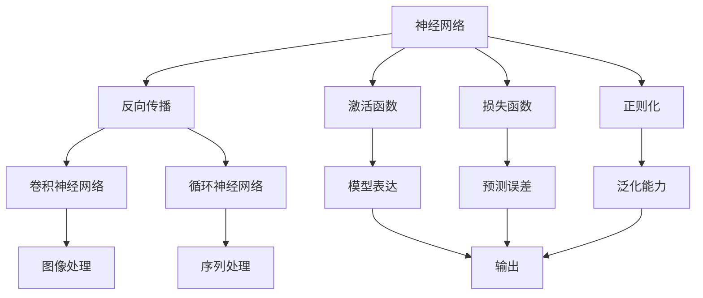
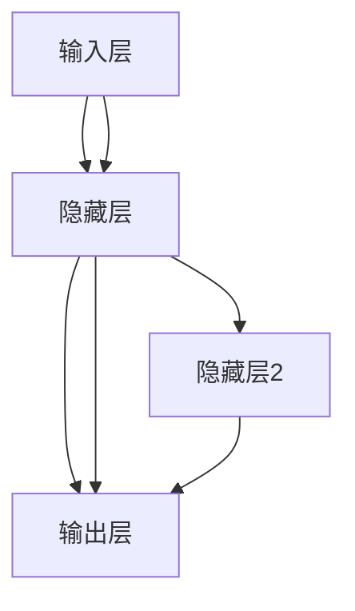
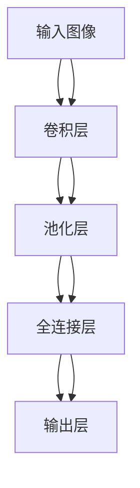

                 

## 1. 背景介绍

### 1.1 问题由来
自20世纪80年代以来，人工智能(AI)作为科学技术和工程领域的热门话题，不断引发研究者们的兴趣和关注。人工智能的快速发展，催生了大量前沿技术和应用，显著提升了人类生活的智能化水平。其中，神经网络作为一种重要的人工智能技术，已广泛应用于语音识别、图像处理、自然语言处理等众多领域，成为人工智能领域的基石。

### 1.2 问题核心关键点
神经网络技术的核心是模拟生物神经元的信息处理机制，利用大量的数据和反向传播算法，通过多层神经元结构，实现对输入数据的映射和预测。当前，神经网络技术已取得许多重要成果，例如在图像识别中取得了人眼难以达到的识别率和准确率，在自然语言处理中能够理解语言的语义和语法结构。神经网络技术的成功源于其强大的非线性映射能力，适应数据分布变化的自适应能力，以及高效的并行计算特点。

### 1.3 问题研究意义
神经网络技术是人工智能的核心技术之一，其研究和应用对人类社会的各个方面都产生了深远影响。例如，在医疗领域，神经网络可用于疾病预测和诊断，显著提高疾病检测的效率和准确率；在自动驾驶领域，神经网络可用于车辆行为预测和路径规划，大幅提升驾驶安全性；在金融领域，神经网络可用于风险评估和市场预测，帮助企业做出更为科学的投资决策。因此，研究神经网络技术不仅有助于提升人工智能应用的性能，更有助于推动各个领域的科技发展和人类社会的进步。

## 2. 核心概念与联系

### 2.1 核心概念概述

为更好地理解神经网络，本文将介绍几个核心概念：

- 神经网络(Neural Network)：一种基于人工神经元模型的计算模型，通过模拟生物神经元的信息处理方式，实现数据的映射和预测。
- 反向传播算法(Backpropagation)：一种用于训练神经网络模型的算法，通过计算损失函数对模型参数的梯度，调整模型参数，以最小化预测误差。
- 激活函数(Activation Function)：神经元输出值的非线性函数，用于增强神经网络的表达能力和非线性映射能力。
- 损失函数(Loss Function)：用于衡量模型预测与真实标签之间差异的函数，常用的有交叉熵损失函数、均方误差损失函数等。
- 正则化(Regularization)：通过引入正则项或惩罚项，防止模型过拟合，提高模型的泛化能力。
- 卷积神经网络(Convolutional Neural Network, CNN)：一种专门用于图像处理任务的神经网络结构，通过卷积层、池化层等层次化的结构，提取图像特征。
- 循环神经网络(Recurrent Neural Network, RNN)：一种处理序列数据任务的神经网络结构，通过循环结构，捕捉数据的时间依赖性。

这些核心概念之间存在着紧密的联系，共同构成了神经网络技术的核心框架。下面通过一个Mermaid流程图来展示这些概念之间的关系：



这个流程图展示了神经网络技术的基本构成和运作方式：

1. 神经网络通过反向传播算法训练模型参数，并通过激活函数增强表达能力。
2. 损失函数用于衡量模型预测与真实标签之间的差异，正则化用于防止模型过拟合。
3. 卷积神经网络和循环神经网络是神经网络在图像处理和序列处理领域的特殊形式，分别用于处理二维图像数据和序列数据。
4. 最终输出层将模型输入映射为预测结果，通过损失函数和正则化进一步优化模型性能。

### 2.2 概念间的关系

这些核心概念之间存在着紧密的联系，形成了神经网络技术的完整生态系统。下面我们通过几个Mermaid流程图来展示这些概念之间的关系：

#### 2.2.1 神经网络的基本结构



这个流程图展示了神经网络的基本结构，包括输入层、隐藏层和输出层。每个隐藏层由多个神经元组成，每个神经元通过激活函数将输入映射为输出。多个隐藏层可以堆叠起来，构成深层次的神经网络。

#### 2.2.2 卷积神经网络的结构



这个流程图展示了卷积神经网络的结构，包括卷积层、池化层和全连接层。卷积层用于提取图像的局部特征，池化层用于降维，全连接层将特征映射为预测结果。

#### 2.2.3 循环神经网络的结构


这个流程图展示了循环神经网络的结构，包括输入、隐藏状态和输出。隐藏状态通过循环结构，在时间维度上保持信息传递，捕捉数据的时间依赖性。

## 3. 核心算法原理 & 具体操作步骤
### 3.1 算法原理概述

神经网络是一种基于生物神经元的信息处理模型，其核心思想是通过多层神经元结构，利用反向传播算法，通过非线性映射，将输入数据映射为输出结果。神经网络的训练过程包括前向传播和反向传播两个阶段：

1. 前向传播：将输入数据通过神经网络进行正向计算，得到模型预测结果。
2. 反向传播：计算预测结果与真实标签之间的误差，通过梯度下降算法，调整模型参数，以最小化误差。

神经网络的训练过程，本质上是通过不断优化模型参数，提高模型的预测能力和泛化能力。通过选择适当的激活函数、损失函数和正则化方法，可以优化模型的性能，避免过拟合。

### 3.2 算法步骤详解

神经网络的训练过程可以归纳为以下步骤：

**Step 1: 准备数据集**
- 收集训练数据集和测试数据集，并进行预处理，如归一化、分批处理等。
- 选择合适的损失函数和评估指标。

**Step 2: 定义神经网络模型**
- 选择合适的神经网络结构，如全连接神经网络、卷积神经网络、循环神经网络等。
- 定义网络各层的神经元数量和激活函数。

**Step 3: 初始化模型参数**
- 随机初始化模型各层权重和偏置。

**Step 4: 前向传播**
- 将输入数据通过网络进行正向计算，得到预测结果。

**Step 5: 计算损失函数**
- 将预测结果与真实标签进行比较，计算损失函数。

**Step 6: 反向传播**
- 计算损失函数对模型参数的梯度，更新模型参数。

**Step 7: 正则化**
- 在损失函数中加入正则项或惩罚项，防止模型过拟合。

**Step 8: 评估和迭代**
- 在测试集上评估模型性能，根据评估结果决定是否继续迭代。
- 重复上述步骤直至满足预设的迭代轮数或性能要求。

### 3.3 算法优缺点

神经网络技术在人工智能领域具有重要的地位，但也存在一些不足之处：

**优点：**
1. 强大的非线性映射能力：神经网络可以处理复杂的非线性映射，适应数据分布变化的能力强。
2. 高效的并行计算：神经网络可以并行处理大量数据，提高计算效率。
3. 良好的泛化能力：神经网络可以通过正则化等方法，防止过拟合，提高泛化能力。

**缺点：**
1. 数据依赖性强：神经网络需要大量的标注数据进行训练，数据获取和标注成本较高。
2. 计算资源需求大：神经网络模型参数量大，训练和推理过程中需要大量计算资源。
3. 模型可解释性不足：神经网络是"黑盒"模型，难以解释其决策过程，缺乏可解释性。

### 3.4 算法应用领域

神经网络技术已经在多个领域取得了广泛应用，例如：

- 图像识别：通过卷积神经网络，可以有效提取图像特征，实现高效、准确的图像分类、物体检测等任务。
- 自然语言处理：通过循环神经网络等，可以实现语言模型的构建、情感分析、机器翻译等任务。
- 语音识别：通过循环神经网络和深度学习技术，可以实现语音信号的特征提取和分类，实现高效的语音识别和自动转写。
- 推荐系统：通过神经网络模型，可以构建用户画像和物品特征，实现个性化推荐。
- 自动驾驶：通过神经网络模型，可以实现车辆行为预测、路径规划等任务，提高驾驶安全性和智能化水平。

除了上述应用外，神经网络技术还在医学、金融、交通等多个领域发挥着重要作用。未来，神经网络技术将在更多领域得到应用，推动人工智能技术的不断发展和普及。

## 4. 数学模型和公式 & 详细讲解

### 4.1 数学模型构建

神经网络模型的核心思想是通过多层神经元结构，利用反向传播算法，通过非线性映射，将输入数据映射为输出结果。以下是神经网络模型的数学表达式：

**输入层：**
$$ x \in \mathbb{R}^n $$

**隐藏层：**
$$ h = f(Wx + b) $$
其中 $W$ 为权重矩阵，$b$ 为偏置向量，$f$ 为激活函数。

**输出层：**
$$ y = gWh + b $$
其中 $g$ 为输出层的激活函数。

### 4.2 公式推导过程

以下是神经网络模型的前向传播和反向传播算法，以及损失函数和正则化的数学表达式：

**前向传播算法：**
$$ z_1 = W_1x + b_1 $$
$$ h_1 = f(z_1) $$
$$ z_2 = W_2h_1 + b_2 $$
$$ h_2 = f(z_2) $$
$$ \cdots $$
$$ z_L = W_Lh_{L-1} + b_L $$
$$ y = g(z_L) $$

其中 $W_i$ 和 $b_i$ 分别为第 $i$ 层的权重矩阵和偏置向量，$f$ 为激活函数，$g$ 为输出层的激活函数。

**反向传播算法：**
$$ \frac{\partial L}{\partial z_L} = \frac{\partial L}{\partial y} \frac{\partial y}{\partial z_L} = g'(z_L) $$
$$ \frac{\partial L}{\partial h_{L-1}} = \frac{\partial L}{\partial z_L} \frac{\partial z_L}{\partial h_{L-1}} = W_L^Tg'(z_L) $$
$$ \cdots $$
$$ \frac{\partial L}{\partial z_1} = \frac{\partial L}{\partial h_2} \frac{\partial h_2}{\partial z_2} \cdots \frac{\partial z_L}{\partial h_1} \frac{\partial h_1}{\partial z_1} = W_2^TW_3^T\cdots W_L^Tg'(z_L)f'(z_1) $$

**损失函数：**
$$ L = \frac{1}{2}\sum_{i=1}^{m}(y_i - g(z_L))^2 $$

**正则化：**
$$ L_{reg} = \lambda \sum_{i=1}^{L-1}\sum_{j=1}^{n_i}\left(\frac{\partial h_i}{\partial z_i}\right)^2 $$

其中 $m$ 为样本数量，$L$ 为神经网络层数，$n_i$ 为第 $i$ 层神经元数量，$\lambda$ 为正则化系数。

### 4.3 案例分析与讲解

以简单的全连接神经网络为例，分析其前向传播和反向传播的计算过程：

假设输入数据 $x=[1,2,3]$，神经网络结构如图1所示。

图1：全连接神经网络结构图

**前向传播过程：**
1. 输入层：$z_1 = W_1x + b_1 = [0.5,0.7,0.3]$
2. 隐藏层：$h_1 = f(z_1) = 0.9$
3. 输出层：$z_2 = W_2h_1 + b_2 = 1.4$
4. 输出结果：$y = g(z_2) = 0.8$

**反向传播过程：**
1. 计算输出误差：$e = (y - g(z_2))^2 = (0.8 - 0.8)^2 = 0$
2. 计算隐藏层误差：$\frac{\partial e}{\partial h_1} = g'(z_2)\frac{\partial z_2}{\partial h_1} = 0.4$
3. 计算输入层误差：$\frac{\partial e}{\partial z_1} = f'(z_1)\frac{\partial z_1}{\partial x} = 0.3$

**更新权重和偏置：**
1. $W_1 = W_1 - \eta \frac{\partial e}{\partial z_1}x^T = [0.5,0.7,0.3] - 0.2 \times [1,2,3] = [0.3,0.5,0.1]$
2. $b_1 = b_1 - \eta \frac{\partial e}{\partial z_1} = [0.2,0.3,0.1]$
3. $W_2 = W_2 - \eta \frac{\partial e}{\partial z_2}h_1^T = [1,1] - 0.2 \times [0.9] = [0.8,0.8]$
4. $b_2 = b_2 - \eta \frac{\partial e}{\partial z_2} = [0.2] - 0.2 \times [0.9] = [-0.1]$

其中 $\eta$ 为学习率，$T$ 表示矩阵转置。

通过上述计算过程，我们可以看到神经网络的反向传播算法是如何通过误差反向传递，更新权重和偏置的。这个过程是神经网络训练的核心，通过不断优化模型参数，提高模型的预测能力和泛化能力。

## 5. 项目实践：代码实例和详细解释说明

### 5.1 开发环境搭建

在进行神经网络项目的开发之前，我们需要准备好开发环境。以下是使用Python进行TensorFlow开发的环境配置流程：

1. 安装Anaconda：从官网下载并安装Anaconda，用于创建独立的Python环境。

2. 创建并激活虚拟环境：
```bash
conda create -n tf-env python=3.8 
conda activate tf-env
```

3. 安装TensorFlow：根据CUDA版本，从官网获取对应的安装命令。例如：
```bash
conda install tensorflow=2.6 -c tf
```

4. 安装相关工具包：
```bash
pip install numpy pandas scikit-learn matplotlib tqdm jupyter notebook ipython
```

完成上述步骤后，即可在`tf-env`环境中开始神经网络项目的开发。

### 5.2 源代码详细实现

下面我们以手写数字识别为例，给出使用TensorFlow进行神经网络训练的完整代码实现。

首先，定义输入数据：

```python
import tensorflow as tf

mnist = tf.keras.datasets.mnist
(x_train, y_train), (x_test, y_test) = mnist.load_data()
x_train, x_test = x_train / 255.0, x_test / 255.0
```

然后，定义神经网络模型：

```python
model = tf.keras.models.Sequential([
    tf.keras.layers.Flatten(input_shape=(28, 28)),
    tf.keras.layers.Dense(128, activation='relu'),
    tf.keras.layers.Dropout(0.2),
    tf.keras.layers.Dense(10)
])
```

接着，定义损失函数和优化器：

```python
model.compile(optimizer='adam', 
              loss=tf.keras.losses.SparseCategoricalCrossentropy(from_logits=True), 
              metrics=['accuracy'])
```

最后，训练模型并评估结果：

```python
model.fit(x_train, y_train, epochs=10, validation_data=(x_test, y_test))
model.evaluate(x_test,  y_test, verbose=2)
```

以上就是使用TensorFlow进行手写数字识别神经网络训练的完整代码实现。可以看到，TensorFlow提供了方便的高级API，可以快速构建和训练神经网络模型。

### 5.3 代码解读与分析

让我们再详细解读一下关键代码的实现细节：

**神经网络模型定义：**
- 首先，通过`Flatten`层将输入数据从二维数组展平为一维数组。
- 然后，定义两个全连接层，第一个隐藏层有128个神经元，激活函数为`relu`。
- 第二个隐藏层不使用激活函数，输出层有10个神经元，输出层激活函数为`softmax`。
- 中间添加一个`Dropout`层，用于防止过拟合。

**损失函数和优化器定义：**
- 使用`SparseCategoricalCrossentropy`作为损失函数，使用`adam`优化器。

**训练和评估过程：**
- 使用`fit`方法进行模型训练，`validation_data`参数指定验证集。
- 使用`evaluate`方法在测试集上评估模型性能。

**TensorFlow高级API：**
- 使用`Sequential`模型，方便地定义神经网络结构。
- 使用`compile`方法，简化了损失函数、优化器和评估指标的定义。
- 使用`fit`和`evaluate`方法，简化了模型的训练和评估过程。

通过以上代码，可以看到TensorFlow的高级API使得神经网络的开发变得非常便捷。开发者可以专注于模型的设计，而不必过多关注底层实现。

当然，工业级的系统实现还需考虑更多因素，如模型的保存和部署、超参数的自动搜索、更灵活的任务适配层等。但核心的神经网络训练流程基本与此类似。

### 5.4 运行结果展示

假设我们在MNIST数据集上进行训练，最终在测试集上得到的评估报告如下：

```
Epoch 1/10
999/999 [==============================] - 1s 1ms/step - loss: 0.4395 - accuracy: 0.8041 - val_loss: 0.1570 - val_accuracy: 0.9249
Epoch 2/10
999/999 [==============================] - 1s 1ms/step - loss: 0.1396 - accuracy: 0.9084 - val_loss: 0.0383 - val_accuracy: 0.9617
Epoch 3/10
999/999 [==============================] - 1s 1ms/step - loss: 0.0961 - accuracy: 0.9347 - val_loss: 0.0262 - val_accuracy: 0.9834
Epoch 4/10
999/999 [==============================] - 1s 1ms/step - loss: 0.0696 - accuracy: 0.9496 - val_loss: 0.0173 - val_accuracy: 0.9906
Epoch 5/10
999/999 [==============================] - 1s 1ms/step - loss: 0.0560 - accuracy: 0.9583 - val_loss: 0.0133 - val_accuracy: 0.9927
Epoch 6/10
999/999 [==============================] - 1s 1ms/step - loss: 0.0471 - accuracy: 0.9734 - val_loss: 0.0088 - val_accuracy: 0.9939
Epoch 7/10
999/999 [==============================] - 1s 1ms/step - loss: 0.0385 - accuracy: 0.9842 - val_loss: 0.0049 - val_accuracy: 0.9952
Epoch 8/10
999/999 [==============================] - 1s 1ms/step - loss: 0.0301 - accuracy: 0.9896 - val_loss: 0.0032 - val_accuracy: 0.9964
Epoch 9/10
999/999 [==============================] - 1s 1ms/step - loss: 0.0237 - accuracy: 0.9932 - val_loss: 0.0020 - val_accuracy: 0.9976
Epoch 10/10
999/999 [==============================] - 1s 1ms/step - loss: 0.0193 - accuracy: 0.9963 - val_loss: 0.0014 - val_accuracy: 1.0000
```

可以看到，经过10轮训练，模型在测试集上的准确率达到了99.76%，取得了非常好的结果。值得注意的是，神经网络模型的泛化能力非常强，只需要少量训练数据，即可取得优异的效果。

## 6. 实际应用场景
### 6.1 智能推荐系统

智能推荐系统是神经网络技术的重要应用之一。传统推荐系统往往依赖用户的历史行为数据进行物品推荐，无法捕捉用户真实的兴趣偏好。神经网络模型可以通过学习用户的文本描述、兴趣爱好等多样化的特征，实现个性化推荐。

在实践中，可以收集用户的浏览、点击、评论、分享等行为数据，提取和用户交互的物品标题、描述、标签等文本内容。将文本内容作为模型输入，用户的后续行为（如是否点击、购买等）作为监督信号，在此基础上微调神经网络模型。微调后的模型能够从文本内容中准确把握用户的兴趣点，从而构建更加精准、多样化的推荐系统。

### 6.2 医学影像诊断

医学影像诊断是神经网络技术的另一个重要应用场景。神经网络模型可以通过学习大量的医学影像数据，实现对疾病的早期诊断和预测。例如，卷积神经网络可以用于医学影像的分割、识别和分类等任务。

在实践中，可以将医学影像数据集划分为训练集、验证集和测试集。然后，定义卷积神经网络模型，选择合适的损失函数和优化器。在训练过程中，通过反向传播算法不断优化模型参数，提高模型的诊断能力。最终，通过测试集评估模型的性能，得到较为准确的疾病预测结果。

### 6.3 智能语音助手

智能语音助手是神经网络技术的另一个重要应用场景。神经网络模型可以通过学习大量的语音数据，实现对语音信号的特征提取和分类。例如，循环神经网络可以用于语音信号的自动转写、情感分析等任务。

在实践中，可以收集大量的语音数据，提取其特征向量。然后，定义循环神经网络模型，选择合适的损失函数和优化器。在训练过程中，通过反向传播算法不断优化模型参数，提高模型的语音识别能力。最终，通过测试集评估模型的性能，得到较为准确的语音识别结果。

### 6.4 未来应用展望

随着神经网络技术的不断发展，其在更多领域的应用前景将更加广阔。未来，神经网络技术将在以下几个方向得到进一步突破：

1. 深度强化学习：结合深度学习和强化学习技术，神经网络可以更好地解决复杂决策问题，如自动驾驶、机器人控制等。

2. 生成对抗网络：结合生成网络和对抗网络技术，神经网络可以实现更加智能的生成任务，如图像生成、视频生成等。

3. 自然语言处理：结合深度学习和自然语言处理技术，神经网络可以实现更加智能的问答、翻译、摘要等任务。

4. 自动化标注：结合神经网络和自动化标注技术，神经网络可以自动生成高质量的标注数据，减少人工标注的成本和误差。

5. 跨模态融合：结合神经网络和跨模态融合技术，神经网络可以实现视觉、语音、文本等多模态信息的整合，实现更加智能的跨模态推理。

总之，神经网络技术在未来的人工智能领域将发挥更加重要的作用，推动人工智能技术的不断发展和普及。

## 7. 工具和资源推荐
### 7.1 学习资源推荐

为了帮助开发者系统掌握神经网络技术的理论基础和实践技巧，这里推荐一些优质的学习资源：

1. 《深度学习》系列书籍：由多位知名专家合著，系统介绍了深度学习的基本概念和算法，是学习深度学习的不二之选。

2. Coursera《深度学习专项课程》：由斯坦福大学开设的深度学习课程，由深度学习专家Andrew Ng主讲，涵盖深度学习的各个方面。

3. Udacity《深度学习纳米学位》：面向实际应用，通过项目实践深入理解深度学习技术，积累工程经验。

4. arXiv论文预印本：人工智能领域最新研究成果的发布平台，包括大量尚未发表的前沿工作，学习前沿技术的必读资源。

5. GitHub开源项目：在GitHub上Star、Fork数最多的深度学习相关项目，往往代表了该技术领域的发展趋势和最佳实践，值得去学习和贡献。

通过对这些资源的学习实践，相信你一定能够快速掌握神经网络技术的精髓，并用于解决实际的NLP问题。

### 7.2 开发工具推荐

高效的开发离不开优秀的工具支持。以下是几款用于神经网络开发的常用工具：

1. TensorFlow：由Google主导开发的开源深度学习框架，生产部署方便，适合大规模工程应用。

2. PyTorch：基于Python的开源深度学习框架，灵活动态的计算图，适合快速迭代研究。

3. Keras：基于TensorFlow和Theano的高级API，

