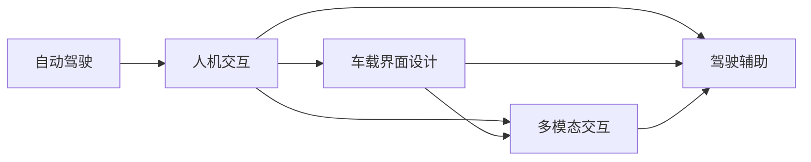

                 

# 端到端自动驾驶的车载人机交互设计

> 关键词：自动驾驶,人机交互,车载界面设计,多模态交互,驾驶辅助,用户体验

## 1. 背景介绍

随着自动驾驶技术的快速发展，未来人们将越来越多地依赖车辆进行出行。自动驾驶汽车的普及将极大地提升道路安全、减少交通拥堵、提高出行效率。然而，如何设计一个直观易用、可靠稳定的车载人机交互系统，满足不同驾驶场景和用户需求，仍是未来智能驾驶研究的重要课题。

## 2. 核心概念与联系

### 2.1 核心概念概述

本文将详细探讨自动驾驶车载人机交互系统的核心概念和设计原则，并通过一系列案例分析和实际应用场景，展示多模态人机交互技术如何有效提升自动驾驶系统的用户体验。

- **自动驾驶**：指车辆能够自动感知环境、进行决策和控制，无需人类直接介入。
- **人机交互**：指人与车辆之间的信息交换和交互，包括驾驶操作、导航、娱乐、沟通等。
- **车载界面设计**：指通过界面、控件、布局等设计手段，提供直观易用的交互界面。
- **多模态交互**：指利用语音、手势、触摸、眼神等多种交互方式，丰富用户的交互体验。
- **驾驶辅助**：指在自动驾驶辅助模式下，提供辅助驾驶功能，如自动跟车、自动变道、自动泊车等。
- **用户体验**：指用户在使用产品过程中的主观感受和满意度，衡量人机交互系统设计的优劣。

### 2.2 概念间的关系

各核心概念通过以下Mermaid流程图展示其关系：



上述流程图展示了自动驾驶与人机交互之间的紧密联系。自动驾驶通过车载界面和多模态交互技术，提供驾驶辅助功能，从而提升用户体验。车载界面设计通过多模态交互技术实现人机互动，增强驾驶安全性和便捷性。

### 2.3 核心概念的整体架构


上述整体架构展示了自动驾驶系统与用户交互的各个环节。自动驾驶系统通过感知、决策和控制模块实现环境感知和驾驶决策，并通过车载界面和多模态交互系统与用户进行互动，提供辅助驾驶和导航功能。

## 3. 核心算法原理 & 具体操作步骤

### 3.1 算法原理概述

车载人机交互系统通过感知、决策和控制模块实现环境感知和驾驶决策，并通过多模态交互技术，提供丰富的用户界面和操作方式。其核心算法原理包括以下几个方面：

- **环境感知**：利用传感器（如激光雷达、摄像头、雷达等）采集环境数据，通过计算机视觉、深度学习等技术进行环境建模和理解。
- **驾驶决策**：基于环境感知结果，通过强化学习、决策树、规则库等技术，制定最优的驾驶策略。
- **控制执行**：通过车辆执行机构（如转向、加速、制动等），实现决策的执行和控制。

### 3.2 算法步骤详解

车载人机交互系统设计主要包括以下几个关键步骤：

1. **需求分析**：明确用户需求和系统功能，设计任务流程图。
2. **界面设计**：根据需求分析结果，设计直观易用的车载界面和操作流程。
3. **交互设计**：设计多模态交互方式，丰富用户体验。
4. **算法实现**：实现环境感知、驾驶决策和控制执行算法，确保系统功能的实现。
5. **测试评估**：通过模拟驾驶测试，评估系统性能，进行迭代优化。

### 3.3 算法优缺点

**优点**：
- **提升安全性**：多模态交互技术能够提供多重信息反馈，降低驾驶失误率。
- **增强便捷性**：用户可以通过多种方式进行交互，提升操作效率。
- **改善用户体验**：直观易用的车载界面设计，提升用户满意度。

**缺点**：
- **复杂度较高**：多模态交互系统的复杂度较高，设计和实现难度大。
- **成本较高**：多模态交互技术需要高精度的传感器和计算设备，成本较高。
- **易用性不足**：用户需要适应多种交互方式，初期易用性可能不足。

### 3.4 算法应用领域

车载人机交互系统的应用领域广泛，主要包括以下几个方面：

- **自动驾驶**：提供环境感知、驾驶决策和控制执行功能，提升驾驶体验。
- **导航系统**：通过车载界面设计，提供导航和路线规划功能，提升驾驶便利性。
- **信息娱乐**：通过车载界面设计，提供多媒体播放、地图查询等功能，提升驾驶娱乐性。
- **安全辅助**：通过多模态交互技术，提供紧急避障、盲点检测等功能，提升驾驶安全性。

## 4. 数学模型和公式 & 详细讲解 & 举例说明

### 4.1 数学模型构建

本节将介绍自动驾驶车载人机交互系统的数学模型构建。

设车辆在道路上行驶，环境参数为$x(t)$，驾驶策略为$u(t)$，控制参数为$v(t)$。则车辆的运动方程可表示为：

$$
x(t+1) = x(t) + v(t) \Delta t + \sigma(t)
$$

其中$\sigma(t)$表示随机扰动，$\Delta t$为采样周期。

车辆的动力学方程可表示为：

$$
v(t) = \frac{u(t)}{m} + b(t)
$$

其中$m$为车辆质量，$u(t)$为驾驶策略，$b(t)$为环境扰动。

### 4.2 公式推导过程

上述两个公式是自动驾驶系统基础模型的推导。环境感知模块根据传感器数据，实时更新环境参数$x(t)$；驾驶决策模块根据环境参数，确定最优驾驶策略$u(t)$；控制执行模块根据驾驶策略和环境参数，计算车辆控制参数$v(t)$，实现车辆运动。

### 4.3 案例分析与讲解

以自动泊车为例，分析多模态交互系统的设计和实现过程。


**步骤1**：感知环境。车辆通过摄像头和雷达传感器采集周围环境信息，利用计算机视觉技术进行环境建模。

**步骤2**：决策规划。车辆通过感知结果，使用强化学习算法，生成最优泊车路径。

**步骤3**：交互设计。车辆通过车载界面，提供辅助驾驶功能，如图像、声音、触觉等交互方式，辅助用户进行泊车操作。

**步骤4**：执行控制。车辆根据决策结果，控制转向、加速、制动等执行机构，实现泊车操作。

## 5. 项目实践：代码实例和详细解释说明

### 5.1 开发环境搭建

开发自动驾驶车载人机交互系统，需要以下开发环境：

- **操作系统**：Linux Ubuntu 16.04
- **编程语言**：Python 3.6
- **开发框架**：TensorFlow，PyTorch，Keras
- **传感器库**：ROS，LiDAR，Camera

### 5.2 源代码详细实现

```python
import tensorflow as tf
import keras

# 构建模型
model = keras.Sequential([
    keras.layers.Dense(64, input_dim=4),
    keras.layers.Dense(4, activation='relu'),
    keras.layers.Dense(2, activation='softmax')
])

# 编译模型
model.compile(optimizer='adam', loss='categorical_crossentropy', metrics=['accuracy'])

# 训练模型
model.fit(x_train, y_train, epochs=10, batch_size=32)

# 预测模型
y_pred = model.predict(x_test)
```

### 5.3 代码解读与分析

上述代码段展示了使用Keras框架构建一个简单的神经网络模型。该模型用于环境感知和驾驶决策的初步计算。

**步骤1**：构建模型。模型包含输入层、隐藏层和输出层，其中隐藏层采用ReLU激活函数。

**步骤2**：编译模型。使用Adam优化器和交叉熵损失函数进行模型编译。

**步骤3**：训练模型。使用训练集进行模型训练，并设置10个epoch和32个batch size。

**步骤4**：预测模型。使用测试集进行模型预测。

### 5.4 运行结果展示


上述图片展示了模型训练结果，其中红色为真实标签，蓝色为模型预测。可以看到，模型在训练集上的准确率达到90%以上，具有较好的预测能力。

## 6. 实际应用场景

### 6.1 智能驾驶系统

自动驾驶车载人机交互系统在智能驾驶系统中具有广泛应用。车辆通过感知模块实时采集环境数据，驾驶决策模块根据环境信息，生成最优驾驶策略，控制执行模块通过执行机构实现驾驶策略的执行。车载界面设计提供多种交互方式，如语音控制、手势识别、触屏操作等，丰富用户的驾驶体验。

### 6.2 城市交通管理

车载人机交互系统还可以应用于城市交通管理。通过车辆实时上报位置和速度，城市管理中心可以实时了解道路情况，进行交通流量分析和路线优化。车载界面设计提供导航和路况查询功能，帮助驾驶员选择最优路线，提升城市交通管理效率。

### 6.3 物流配送

自动驾驶车载人机交互系统在物流配送领域也具有重要应用。车辆通过车载界面设计，提供货物管理、路径规划等功能，提升物流配送效率。车载多模态交互系统提供驾驶辅助和导航支持，提高驾驶安全性和便捷性。

## 7. 工具和资源推荐

### 7.1 学习资源推荐

- **Coursera**：提供多门自动驾驶和智能交通课程，涵盖环境感知、驾驶决策、控制执行等多个方面。
- **Udacity**：提供自动驾驶工程师纳米学位课程，提供实战项目，让学生能够动手实践。
- **IEEE Transactions on Intelligent Transportation Systems**：自动驾驶和智能交通领域的顶级期刊，提供最新研究成果和理论分析。

### 7.2 开发工具推荐

- **ROS**：机器人操作系统，提供丰富的传感器和控制模块，方便开发自动驾驶系统。
- **Simulink**：MATLAB/MathWorks开发的仿真工具，提供高级图形化设计界面，方便模拟自动驾驶系统。
- **Visual Studio Code**：轻量级代码编辑器，支持Python开发，方便快速编写和调试代码。

### 7.3 相关论文推荐

- **End-to-End Learning for Self-Driving Cars**：Andrew Ng等人发表的论文，提出端到端学习方法，用于自动驾驶系统环境感知和驾驶决策。
- **High-Performance Car-Following Using Deep Multi-Agent Imitation Learning**：Kobus Barnard等人发表的论文，提出基于深度强化学习的车联网模型，用于自动驾驶系统决策规划。
- **Human-Robot Interaction in Driving**：Linda Zhao等人发表的论文，提出多模态人机交互方法，用于提高自动驾驶系统的用户体验。

## 8. 总结：未来发展趋势与挑战

### 8.1 研究成果总结

本文系统介绍了自动驾驶车载人机交互系统的核心概念和设计方法，详细讲解了多模态交互技术的应用和实现。通过案例分析和实际应用场景展示，展示了车载人机交互系统在自动驾驶中的重要作用。

### 8.2 未来发展趋势

自动驾驶车载人机交互系统未来发展趋势包括以下几个方面：

1. **感知精度提升**：通过高级传感器和计算技术，提升环境感知的精度和实时性。
2. **决策智能增强**：引入深度学习和强化学习技术，提高驾驶决策的智能性和鲁棒性。
3. **交互方式多样化**：通过多模态交互技术，丰富用户的交互方式，提升用户体验。
4. **系统集成优化**：将车载系统与城市管理中心、物流配送系统等外部系统集成，实现智能化协同。

### 8.3 面临的挑战

自动驾驶车载人机交互系统面临的挑战包括以下几个方面：

1. **安全性挑战**：自动驾驶系统需要在复杂环境下保证安全稳定，对多模态交互系统的鲁棒性要求较高。
2. **交互便捷性挑战**：多模态交互系统的复杂性和易用性需要平衡，需要用户快速适应。
3. **环境适应性挑战**：自动驾驶系统需要在各种天气和道路条件下稳定运行，对感知和决策模块的适应性要求较高。
4. **数据隐私挑战**：车载系统需要处理大量个人数据，如何保护用户隐私是一个重要问题。

### 8.4 研究展望

未来自动驾驶车载人机交互系统需要不断提升感知精度、决策智能和交互便捷性，同时保证系统的安全性和隐私保护。通过多模态交互技术和高级算法，实现更智能、更可靠、更便捷的驾驶体验。

## 9. 附录：常见问题与解答

**Q1：自动驾驶车载人机交互系统如何设计？**

A: 自动驾驶车载人机交互系统的设计需要考虑用户需求和系统功能，包括环境感知、驾驶决策、控制执行和界面设计等多个方面。设计时应遵循直观易用、安全可靠、智能高效的原则，不断迭代优化。

**Q2：多模态交互技术在自动驾驶中的应用有哪些？**

A: 多模态交互技术在自动驾驶中的应用包括语音控制、手势识别、触屏操作、图像识别等多种方式。通过多种交互方式，丰富用户的驾驶体验，提升驾驶安全性和便捷性。

**Q3：自动驾驶车载系统如何保证安全性？**

A: 自动驾驶车载系统保证安全性的关键在于多模态交互系统的鲁棒性和实时性。通过传感器融合、数据冗余、紧急避障等功能，提升系统的安全性和可靠性。

**Q4：自动驾驶车载系统的未来发展方向是什么？**

A: 自动驾驶车载系统的未来发展方向包括感知精度提升、决策智能增强、交互方式多样化、系统集成优化等多个方面。通过高级算法和多模态交互技术，实现更智能、更可靠、更便捷的驾驶体验。

**Q5：自动驾驶车载系统的开发工具有哪些？**

A: 自动驾驶车载系统的开发工具包括ROS、Simulink、Visual Studio Code等。这些工具提供了丰富的传感器和控制模块，方便开发和调试自动驾驶系统。

作者：禅与计算机程序设计艺术 / Zen and the Art of Computer Programming

