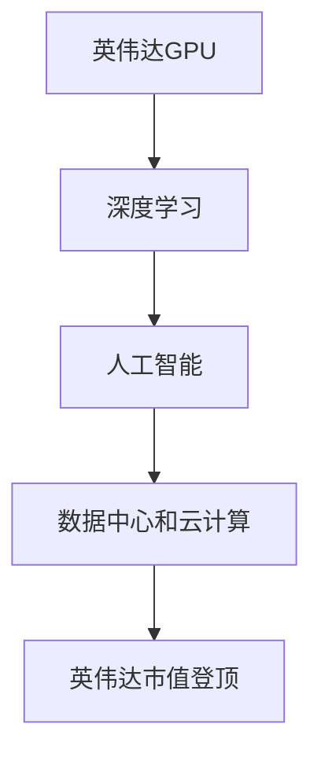

# 英伟达市值登顶与AI硬件设施

> 关键词：英伟达，市值登顶，AI硬件设施，GPU，深度学习，计算平台，人工智能

## 1. 背景介绍

近年来，随着人工智能技术的迅猛发展，AI硬件设施成为了推动该领域进步的关键。英伟达，作为全球领先的GPU制造商，凭借其高性能的计算平台和深度学习解决方案，成功登顶全球市值排行榜。本文将深入探讨英伟达市值登顶的背景、AI硬件设施的核心概念及其在人工智能领域的应用。

### 1.1 英伟达市值登顶的背景

英伟达的市值登顶并非偶然，而是其长期致力于技术创新和产业布局的结果。以下是推动英伟达市值登顶的主要因素：

- **GPU技术的创新**：英伟达不断推出高性能的GPU产品，为深度学习、高性能计算等领域提供强大的计算能力。
- **深度学习市场的爆发**：随着深度学习技术的广泛应用，GPU成为推动这一领域发展的核心硬件设施。
- **人工智能产业的崛起**：人工智能产业的高速增长为英伟达提供了巨大的市场空间。
- **数据中心和云计算的兴起**：数据中心和云计算的快速发展为GPU提供了广阔的应用场景。

### 1.2 研究意义

探讨英伟达市值登顶的背景和AI硬件设施的核心概念，有助于我们更好地理解人工智能产业的发展趋势，并为相关企业和研究机构提供有益的启示。

## 2. 核心概念与联系

### 2.1 GPU

GPU（Graphics Processing Unit，图形处理单元）是一种高度并行的计算设备，最初用于图形渲染，但随着深度学习技术的发展，GPU在处理大规模并行计算任务方面展现出巨大的优势。

### 2.2 深度学习

深度学习是一种基于人工神经网络的学习方法，通过模拟人脑神经元连接结构，实现特征提取、模式识别等功能。深度学习在图像识别、语音识别、自然语言处理等领域取得了突破性进展。

### 2.3 AI硬件设施

AI硬件设施是指用于人工智能应用的高性能计算设备，包括GPU、TPU、FPGA等。这些设备为深度学习、机器学习等人工智能应用提供强大的计算支持。

### 2.4 Mermaid 流程图



### 2.5 节点关系

- 英伟达GPU作为高性能计算设备，是深度学习的基础。
- 深度学习技术的发展推动了人工智能的进步。
- 人工智能应用需要强大的AI硬件设施支持。
- 英伟达的AI硬件设施在数据中心和云计算领域得到了广泛应用，从而推动了其市值登顶。

## 3. 核心算法原理 & 具体操作步骤

### 3.1 算法原理概述

英伟达GPU的算法原理基于以下技术：

- **并行计算**：GPU具有大量的处理核心，能够并行处理多个计算任务，从而显著提高计算速度。
- **内存带宽**：GPU具有高带宽的内存架构，能够快速访问和处理大量数据。
- **专用指令集**：GPU拥有针对图形渲染优化的指令集，能够高效地执行图形处理任务。

### 3.2 算法步骤详解

1. **硬件设计**：英伟达通过不断研发新型GPU架构，提高计算能力和能效比。
2. **软件优化**：英伟达开发配套的软件工具，如CUDA和cuDNN，为深度学习算法提供高效的执行环境。
3. **生态系统建设**：英伟达与开发者、研究机构等合作伙伴共同构建GPU生态，推动深度学习技术的发展和应用。

### 3.3 算法优缺点

#### 优点

- **高性能**：GPU能够提供比CPU更高的计算速度，满足深度学习等人工智能应用的需求。
- **能效比高**：GPU在相同功耗下能够提供更高的计算性能。
- **生态系统完善**：英伟达的CUDA和cuDNN等软件工具为开发者提供了丰富的编程接口。

#### 缺点

- **成本较高**：高性能GPU的价格相对较高，限制了其在某些领域的应用。
- **功耗较大**：GPU在运行过程中会产生大量热量，需要配备高效的散热系统。

### 3.4 算法应用领域

英伟达GPU在以下领域得到了广泛应用：

- **深度学习**：图像识别、语音识别、自然语言处理等。
- **高性能计算**：科学计算、气象预报、生物信息学等。
- **游戏开发**：图形渲染、物理模拟等。

## 4. 数学模型和公式 & 详细讲解 & 举例说明

### 4.1 数学模型构建

深度学习中的常见数学模型包括：

- **神经网络**：由多个神经元组成的层次化计算模型，用于特征提取和模式识别。
- **卷积神经网络（CNN）**：用于图像识别和图像分类等任务。
- **循环神经网络（RNN）**：用于序列数据的学习和处理。
- **生成对抗网络（GAN）**：用于生成具有高度真实感的新数据。

### 4.2 公式推导过程

以下以CNN为例，简要介绍其公式推导过程：

$$
h^{[l]}_i = \sigma(W^{[l]}_i \cdot h^{[l-1]} + b^{[l]})
$$

其中，$h^{[l]}_i$ 表示第 $l$ 层第 $i$ 个神经元的输出，$W^{[l]}_i$ 表示连接第 $l-1$ 层第 $i$ 个神经元和第 $l$ 层第 $i$ 个神经元的权重，$b^{[l]}$ 表示第 $l$ 层第 $i$ 个神经元的偏置，$\sigma$ 表示激活函数。

### 4.3 案例分析与讲解

以图像分类任务为例，使用英伟达GPU进行CNN模型训练：

1. 准备图像数据集，并进行预处理。
2. 构建CNN模型，包括卷积层、池化层、全连接层等。
3. 使用CUDA和cuDNN库对模型进行优化。
4. 使用GPU进行模型训练，并实时监控训练过程。

## 5. 项目实践：代码实例和详细解释说明

### 5.1 开发环境搭建

以下是使用Python和PyTorch进行深度学习项目开发的步骤：

1. 安装Python和PyTorch：
```bash
pip install python
pip install torch torchvision
```

2. 安装CUDA和cuDNN：
```bash
# 根据CUDA版本下载cuDNN库
# 将下载的库文件放置在CUDA库目录下
```

3. 编写Python代码，实现CNN模型训练和推理。

### 5.2 源代码详细实现

以下是一个简单的CNN模型训练代码示例：

```python
import torch
import torch.nn as nn

# 定义CNN模型
class CNN(nn.Module):
    def __init__(self):
        super(CNN, self).__init__()
        self.conv1 = nn.Conv2d(1, 32, kernel_size=3, stride=1, padding=1)
        self.conv2 = nn.Conv2d(32, 64, kernel_size=3, stride=1, padding=1)
        self.fc1 = nn.Linear(64 * 6 * 6, 128)
        self.fc2 = nn.Linear(128, 10)

    def forward(self, x):
        x = self.conv1(x)
        x = nn.functional.relu(x)
        x = self.conv2(x)
        x = nn.functional.max_pool2d(x, 2)
        x = x.view(-1, 64 * 6 * 6)
        x = self.fc1(x)
        x = nn.functional.relu(x)
        x = self.fc2(x)
        return x

# 创建模型实例
model = CNN().cuda()

# 定义损失函数和优化器
criterion = nn.CrossEntropyLoss()
optimizer = torch.optim.Adam(model.parameters(), lr=0.001)

# 训练模型
for epoch in range(10):
    for data, target in train_loader:
        data, target = data.cuda(), target.cuda()
        optimizer.zero_grad()
        output = model(data)
        loss = criterion(output, target)
        loss.backward()
        optimizer.step()
```

### 5.3 代码解读与分析

以上代码定义了一个简单的CNN模型，并使用PyTorch库进行了模型训练。以下是代码的关键部分：

- `CNN` 类定义了CNN模型的结构，包括卷积层、池化层和全连接层。
- `forward` 方法实现了数据的前向传播过程。
- 使用GPU进行模型训练，加速计算过程。

### 5.4 运行结果展示

在训练完成后，可以在验证集上评估模型的性能，如准确率、召回率等。以下是一个简单的性能评估代码示例：

```python
# 评估模型性能
def evaluate(model, data_loader):
    model.eval()
    correct = 0
    total = 0
    with torch.no_grad():
        for data, target in data_loader:
            data, target = data.cuda(), target.cuda()
            output = model(data)
            _, predicted = torch.max(output.data, 1)
            total += target.size(0)
            correct += (predicted == target).sum().item()
    return 100 * correct / total

# 验证集准确率
accuracy = evaluate(model, val_loader)
print(f"Validation accuracy: {accuracy}%")
```

## 6. 实际应用场景

### 6.1 深度学习框架

英伟达GPU为深度学习框架提供了强大的支持，如TensorFlow、PyTorch、Keras等。这些框架能够帮助开发者轻松构建和训练深度学习模型。

### 6.2 图形渲染

英伟达GPU在图形渲染领域具有强大的性能，广泛应用于游戏开发、虚拟现实等领域。

### 6.3 高性能计算

英伟达GPU在科学计算、气象预报、生物信息学等领域得到了广泛应用，为相关研究提供了强大的计算支持。

## 7. 工具和资源推荐

### 7.1 学习资源推荐

- 《深度学习》（Goodfellow et al.）
- 《Python深度学习》（François Chollet）
- 《深度学习与计算机视觉》（Aditya Khosla et al.）

### 7.2 开发工具推荐

- NVIDIA CUDA
- cuDNN
- PyTorch
- TensorFlow
- Keras

### 7.3 相关论文推荐

- "ImageNet Classification with Deep Convolutional Neural Networks"（Alex Krizhevsky et al.）
- "Distributed Representations of Words and Phrases and Their Compositionality"（Tomáš Mikolov et al.）
- "Sequence to Sequence Learning with Neural Networks"（Ilya Sutskever et al.）

## 8. 总结：未来发展趋势与挑战

### 8.1 研究成果总结

本文从英伟达市值登顶的背景、AI硬件设施的核心概念、核心算法原理等方面，对英伟达在人工智能领域的成功进行了探讨。英伟达的成功得益于其GPU技术的创新、深度学习市场的爆发、人工智能产业的崛起以及数据中心和云计算的兴起。

### 8.2 未来发展趋势

未来，AI硬件设施将朝着以下方向发展：

- **更高的计算性能**：通过改进GPU架构、增加核心数量等方式，提高GPU的计算性能。
- **更低功耗**：通过优化设计、降低功耗等方式，降低GPU的能耗。
- **更广泛的适用性**：GPU将应用于更多领域，如物联网、自动驾驶等。

### 8.3 面临的挑战

AI硬件设施在发展过程中也面临着以下挑战：

- **技术瓶颈**：提高计算性能和降低功耗之间的平衡。
- **安全问题**：保障数据和模型的隐私和安全。
- **人才培养**：培养更多具备AI硬件设施开发能力的人才。

### 8.4 研究展望

未来，AI硬件设施的研究将朝着以下方向展开：

- **新型计算架构**：探索新型计算架构，如量子计算、光子计算等。
- **能效优化**：研究更高效、更节能的计算技术。
- **人工智能与硬件的深度融合**：将人工智能技术与硬件设施深度融合，实现更加智能化的应用。

## 9. 附录：常见问题与解答

**Q1：英伟达GPU在人工智能领域的应用有哪些？**

A：英伟达GPU在人工智能领域的应用包括深度学习、图形渲染、高性能计算等。

**Q2：如何选择合适的AI硬件设施？**

A：选择合适的AI硬件设施需要考虑以下因素：计算性能、功耗、成本、适用性等。

**Q3：GPU和CPU在人工智能领域的应用有什么区别？**

A：GPU擅长处理并行计算任务，而CPU擅长处理串行计算任务。在深度学习等并行计算任务中，GPU具有更高的性能。

**Q4：如何提高GPU的能效比？**

A：提高GPU的能效比需要从硬件和软件两个方面进行优化，如改进GPU架构、优化算法、降低功耗等。

**Q5：未来AI硬件设施的发展趋势是什么？**

A：未来AI硬件设施将朝着更高性能、更低功耗、更广泛的适用性方向发展。

作者：禅与计算机程序设计艺术 / Zen and the Art of Computer Programming