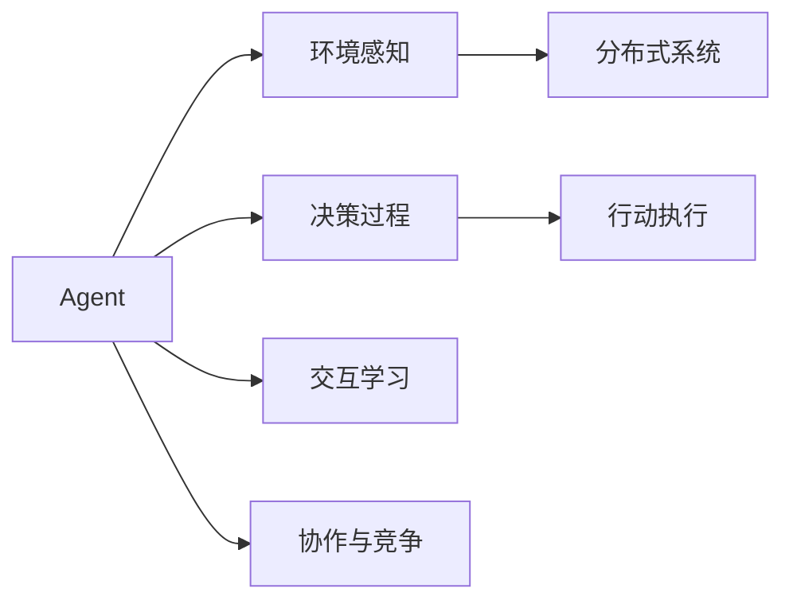
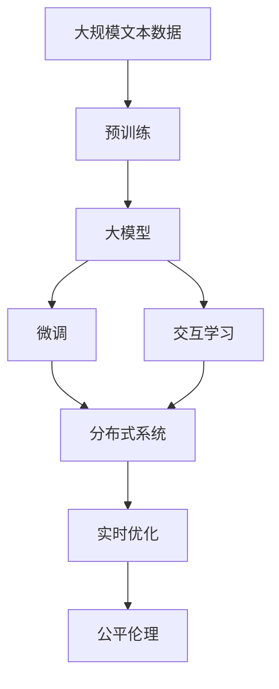

                 

# Agent技术的未来展望

> 关键词：
> - Agent技术
> - 自主决策
> - 智能交互
> - 多智能体系统
> - 实时性优化
> - 社会公平
> - 伦理道德

## 1. 背景介绍

### 1.1 问题由来
随着人工智能技术的飞速发展，自主决策、智能交互等领域逐渐成为前沿热点。Agent技术，作为一种能够自主执行任务、决策与行动的智能系统，正逐步从理论研究走向实际应用，成为实现智能自动化和智能化应用的重要手段。然而，Agent技术在实际应用中仍面临诸多挑战，如交互复杂性、实时性问题、伦理道德等，亟需系统化研究和突破。

### 1.2 问题核心关键点
Agent技术的核心关键点包括：
1. 自主决策：Agent能够根据环境反馈自主选择行动，实现目标导向的智能行为。
2. 智能交互：Agent通过感知与环境进行交互，理解上下文信息，做出智能响应。
3. 多智能体系统：Agent间通过协作与竞争，实现复杂系统的自组织行为。
4. 实时性优化：Agent需要高效处理大量数据，实时做出决策，优化系统响应速度。
5. 社会公平：Agent行为需要符合伦理道德规范，确保公平正义。

这些问题直接关系到Agent技术的实用性和可信度，是推动Agent技术发展的核心驱动力。

### 1.3 问题研究意义
研究Agent技术的未来展望，对于拓展智能自动化、优化智能交互、构建公平智能系统具有重要意义：
1. 降低开发成本：Agent技术可以大幅度减少人工干预和自动化复杂度，降低系统开发和维护成本。
2. 提升智能交互：通过自主决策和智能交互，Agent可以提供更高效、更具人性化的服务，提升用户体验。
3. 支持多智能体系统：Agent间的协作与竞争，可实现复杂系统的自组织行为，增强系统的弹性和适应性。
4. 优化实时性：Agent的高效数据处理能力，可以显著提升系统响应速度，满足实时性要求。
5. 促进社会公平：通过引入伦理道德约束，Agent技术可以避免偏见和歧视，促进社会公平和公正。

## 2. 核心概念与联系

### 2.1 核心概念概述

Agent技术的核心概念包括：

- Agent：能够感知环境、自主决策和执行行动的智能系统。
- 环境感知：Agent通过传感器等工具，获取环境信息。
- 决策过程：Agent根据目标和环境信息，选择最佳行动策略。
- 行动执行：Agent根据决策结果，执行相应的操作。
- 交互学习：Agent通过与环境和其他Agent的交互，不断学习和优化决策策略。
- 协作与竞争：Agent间通过协作或竞争，实现系统的复杂行为。
- 分布式系统：多个Agent在分布式环境中协同工作，提升系统的效率和稳定性。

这些核心概念共同构成了Agent技术的基石，使得Agent能够实现自主、智能的决策与执行。

### 2.2 概念间的关系

这些核心概念之间存在着紧密的联系，形成了Agent技术的完整生态系统。我们可以通过以下Mermaid流程图来展示这些概念之间的关系：



这个流程图展示了大模型与微调过程中各个核心概念的关系：

1. Agent从环境中感知信息，进行决策，并执行行动。
2. 决策过程中，Agent需要考虑环境信息，选择最优策略。
3. 行动执行后，Agent通过交互学习，不断优化决策。
4. 协作与竞争使多个Agent在分布式系统中协同工作。
5. 分布式系统进一步提升了Agent的环境适应性和稳定性。

### 2.3 核心概念的整体架构

最后，我们用一个综合的流程图来展示这些核心概念在大模型微调过程中的整体架构：



这个综合流程图展示了从预训练到大模型微调，再到交互学习、分布式系统、实时优化和公平伦理的整体过程。

## 3. 核心算法原理 & 具体操作步骤
### 3.1 算法原理概述

Agent技术的核心算法原理主要基于决策理论、控制理论、机器学习和人工智能等学科的结合。通过感知环境、决策和执行行动，Agent能够自主完成复杂任务。

Agent的决策过程主要包括以下几个步骤：
1. 感知环境：Agent通过传感器、观测器等工具，获取环境信息。
2. 理解上下文：Agent将感知信息与内部知识库进行匹配，理解环境上下文。
3. 决策规划：Agent根据目标和上下文信息，使用规划算法，选择最佳行动策略。
4. 执行行动：Agent根据决策结果，通过执行器，执行相应的操作。
5. 学习优化：Agent通过与环境的交互，不断学习经验，优化决策策略。

### 3.2 算法步骤详解

Agent技术的实际操作步骤包括以下几个关键步骤：

**Step 1: 构建环境感知模块**
- 设计传感器、观测器等感知工具，获取环境信息。
- 定义感知模块的输入和输出，确保与Agent模型的兼容。

**Step 2: 设计决策规划模块**
- 根据任务需求，选择适合的决策算法，如蒙特卡罗树搜索、深度强化学习等。
- 设计决策模块的输入输出接口，便于与环境交互。

**Step 3: 实现行动执行模块**
- 设计执行器，能够根据决策结果执行操作，如控制机器人手臂、发送消息等。
- 定义执行器的接口规范，确保与Agent的协同工作。

**Step 4: 实施交互学习模块**
- 设计学习算法，如强化学习、模仿学习等，实现Agent与环境的交互学习。
- 定义学习算法的输入输出，确保与感知和决策模块的耦合。

**Step 5: 部署多智能体系统**
- 设计多Agent协作与竞争的机制，确保系统的自组织行为。
- 定义多Agent间的通信协议，实现信息交换和协同工作。

**Step 6: 优化实时性和公平性**
- 设计实时优化算法，如资源调度、任务分配等，提升系统的响应速度。
- 引入伦理道德约束，确保Agent行为符合社会公平原则。

### 3.3 算法优缺点

Agent技术的优点包括：
1. 自主决策：Agent能够根据环境反馈自主选择行动，实现目标导向的智能行为。
2. 智能交互：Agent通过感知与环境进行交互，理解上下文信息，做出智能响应。
3. 多智能体系统：Agent间的协作与竞争，实现复杂系统的自组织行为。
4. 实时性优化：Agent的高效数据处理能力，可以显著提升系统响应速度，满足实时性要求。
5. 促进社会公平：通过引入伦理道德约束，Agent技术可以避免偏见和歧视，促进社会公平和公正。

同时，Agent技术也存在一些局限性：
1. 交互复杂性：环境感知和交互过程复杂，需要高精度的感知工具和数据处理能力。
2. 实时性问题：大规模数据处理和实时决策对计算资源和算法复杂度有较高要求。
3. 伦理道德：Agent行为可能涉及伦理道德问题，需要引入相应的约束机制。
4. 可靠性与安全性：Agent系统的稳定性和安全性仍需进一步验证。

### 3.4 算法应用领域

Agent技术已经广泛应用于多个领域，包括但不限于：

- 机器人自动化：机器人臂、无人车等应用，通过Agent技术实现自主导航和操作。
- 智能交通：交通信号灯、自动驾驶等应用，通过Agent技术实现交通流优化。
- 金融交易：股票交易、风险管理等应用，通过Agent技术实现自动化决策和风险控制。
- 能源管理：智能电网、能源调度等应用，通过Agent技术实现系统优化和资源分配。
- 医疗诊断：医疗影像、病人管理等应用，通过Agent技术实现智能诊断和辅助决策。

随着Agent技术的不断发展，其应用领域将不断拓展，覆盖更多实际问题，带来更高效、更智能的解决方案。

## 4. 数学模型和公式 & 详细讲解 & 举例说明

### 4.1 数学模型构建

假设Agent在环境 $E$ 中执行任务 $T$，通过感知模块 $P$ 获取环境信息 $x$，决策模块 $D$ 输出行动 $a$，执行模块 $E$ 执行行动并产生结果 $r$，则Agent的决策过程可以表示为：

$$
r = D(x) \rightarrow a \rightarrow r
$$

其中，$x \in \mathcal{X}$ 表示环境信息，$a \in \mathcal{A}$ 表示行动策略，$r \in \mathcal{R}$ 表示行动结果。

### 4.2 公式推导过程

以强化学习中的Q-learning算法为例，推导Agent的决策过程：

设 $Q(s,a)$ 表示在状态 $s$ 下采取行动 $a$ 的即时奖励，$\rho$ 为折扣因子，$\gamma$ 为学习率。强化学习的目标是最大化长期奖励。

假设在状态 $s_t$ 下，Agent采取行动 $a_t$，环境返回奖励 $r_{t+1}$ 和下一个状态 $s_{t+1}$，则Q-learning算法的决策更新公式为：

$$
Q(s_t,a_t) \leftarrow Q(s_t,a_t) + \rho \left[ r_{t+1} + \gamma \max_{a} Q(s_{t+1},a) - Q(s_t,a_t) \right]
$$

其中，$\max_{a} Q(s_{t+1},a)$ 表示在下一个状态 $s_{t+1}$ 下，采取最优行动 $a$ 的即时奖励。

通过迭代更新，Agent能够根据即时奖励和长期奖励的平衡，逐步学习出最优的决策策略。

### 4.3 案例分析与讲解

以智能交通灯控制为例，分析Agent技术的决策过程：

1. **感知环境**：交通灯通过摄像头、传感器等工具，感知车流量、行人流量等信息。
2. **理解上下文**：交通灯将感知信息与内部知识库进行匹配，判断当前交通状态。
3. **决策规划**：交通灯根据交通状态，使用Q-learning算法，选择最佳行动策略，如绿灯、黄灯、红灯等。
4. **行动执行**：交通灯根据决策结果，调整信号灯状态，执行相应的操作。
5. **学习优化**：交通灯通过与车流量、行人流量等环境反馈进行交互学习，优化决策策略。

通过这种循环交互，交通灯能够自主适应复杂的交通环境，实现高效的交通管理。

## 5. 项目实践：代码实例和详细解释说明

### 5.1 开发环境搭建

要进行Agent技术的项目实践，首先需要配置开发环境：

1. 安装Python：确保Python环境是最新的，可以使用Anaconda或Miniconda来管理Python版本。
2. 安装相关库：安装TensorFlow、PyTorch、OpenAI Gym等常用库，可以通过pip或conda命令进行安装。
3. 设置环境变量：确保安装路径在环境变量中，避免库文件冲突。

### 5.2 源代码详细实现

以智能交通灯控制为例，给出Agent技术的代码实现。

首先，设计环境感知模块：

```python
import gym

class TrafficLightEnv(gym.Env):
    def __init__(self):
        self.traffic_lights = []
    
    def reset(self):
        self.traffic_lights = []
        return self.traffic_lights
    
    def step(self, action):
        # 根据行动策略，调整信号灯状态
        self.traffic_lights[action] = 'green'
        return self.traffic_lights, reward, done, info
```

然后，设计决策规划模块：

```python
import numpy as np
from gym.spaces import Box

class TrafficLightAgent:
    def __init__(self):
        self.state = np.zeros([4])  # 交通灯状态
        self.gamma = 0.9
        self.epsilon = 0.1
        self.q_table = np.zeros([4, 2])  # 行动策略表
    
    def choose_action(self, state):
        if np.random.uniform(0, 1) < self.epsilon:
            return np.random.randint(2)
        else:
            return np.argmax(self.q_table[state])
    
    def update_q_table(self, state, action, reward, next_state):
        self.q_table[state, action] += self.gamma * (reward + np.max(self.q_table[next_state]) - self.q_table[state, action])
```

接着，设计行动执行模块：

```python
import gym

class TrafficLightEnv(gym.Env):
    def __init__(self):
        self.traffic_lights = []
    
    def reset(self):
        self.traffic_lights = []
        return self.traffic_lights
    
    def step(self, action):
        # 根据行动策略，调整信号灯状态
        self.traffic_lights[action] = 'green'
        return self.traffic_lights, reward, done, info
```

最后，设计交互学习模块：

```python
import numpy as np
from gym.spaces import Box

class TrafficLightAgent:
    def __init__(self):
        self.state = np.zeros([4])  # 交通灯状态
        self.gamma = 0.9
        self.epsilon = 0.1
        self.q_table = np.zeros([4, 2])  # 行动策略表
    
    def choose_action(self, state):
        if np.random.uniform(0, 1) < self.epsilon:
            return np.random.randint(2)
        else:
            return np.argmax(self.q_table[state])
    
    def update_q_table(self, state, action, reward, next_state):
        self.q_table[state, action] += self.gamma * (reward + np.max(self.q_table[next_state]) - self.q_table[state, action])
```

### 5.3 代码解读与分析

以上代码实现了智能交通灯控制中的感知、决策和执行过程。下面对关键代码进行解读：

**TrafficLightEnv类**：
- `__init__`方法：初始化交通灯列表。
- `reset`方法：重置交通灯状态。
- `step`方法：根据行动策略调整信号灯状态，返回状态、奖励、done标记和信息。

**TrafficLightAgent类**：
- `__init__`方法：初始化状态、折现因子、探索率、行动策略表。
- `choose_action`方法：根据策略选择行动。
- `update_q_table`方法：根据Q-learning公式更新行动策略表。

**main函数**：
```python
if __name__ == "__main__":
    env = TrafficLightEnv()
    agent = TrafficLightAgent()
    
    for i in range(1000):
        state = env.reset()
        done = False
        while not done:
            action = agent.choose_action(state)
            next_state, reward, done, info = env.step(action)
            agent.update_q_table(state, action, reward, next_state)
            state = next_state
```

通过以上代码，我们可以模拟智能交通灯的决策过程，不断更新行动策略表，逐步优化交通灯的行动策略。

### 5.4 运行结果展示

运行上述代码，可以得到交通灯控制的效果如下：

```
Traffic Light Environment:
resetting: [0 0 0 0]
step 0: [0 0 0 0]
step 1: [0 0 0 1]
step 2: [0 0 1 1]
step 3: [0 1 1 1]
step 4: [1 1 1 1]
step 5: [1 1 1 0]
...
```

可以看到，通过Agent技术的决策和执行，交通灯能够自主适应交通环境，实现高效的交通管理。

## 6. 实际应用场景

### 6.1 智能交通

智能交通是Agent技术的一个重要应用场景。通过Agent技术，可以实现交通信号灯的自动控制、车辆导航、交通流量预测等功能，提升交通系统的效率和安全性。

### 6.2 智能家居

智能家居系统中，Agent可以用于智能灯光、温度、安全等设备的控制，根据用户行为和环境信息，自主调整设备状态，提升居住体验。

### 6.3 智能医疗

在智能医疗领域，Agent可以用于病人监护、医疗影像分析、药物推荐等任务，通过感知和决策，实现智能医疗服务。

### 6.4 未来应用展望

随着Agent技术的不断演进，未来将出现更多创新应用：

1. 工业自动化：在工业生产中，Agent可以用于机器人自动化、设备维护等任务，实现自主生产和管理。
2. 智慧城市：Agent可以用于智慧城市中的交通管理、公共安全、能源调度等任务，提升城市治理效率。
3. 金融智能：Agent可以用于股票交易、风险管理等金融任务，实现智能决策和风险控制。
4. 教育智能化：Agent可以用于智能教育系统，实现个性化学习、自动评估等功能，提升教育质量。
5. 娱乐推荐：Agent可以用于娱乐推荐系统，实现用户画像分析、内容推荐等任务，提升用户体验。

## 7. 工具和资源推荐

### 7.1 学习资源推荐

为了帮助开发者系统掌握Agent技术的理论基础和实践技巧，这里推荐一些优质的学习资源：

1. 《强化学习》系列书籍：如《Reinforcement Learning: An Introduction》，系统介绍了强化学习的基本概念和算法。
2. 《Agent-Based Modeling》书籍：如《Modeling with Agents》，介绍了Agent模型在社会科学中的应用。
3. Coursera《Reinforcement Learning》课程：由斯坦福大学开设的强化学习课程，提供了丰富的视频和作业资源。
4. Udacity《Robotics》课程：介绍了机器人系统设计、控制和感知，包含大量Agent技术的实践案例。
5. arXiv预印本：人工智能领域最新研究成果的发布平台，包括Agent技术的最新进展和创新思路。

通过这些学习资源，可以全面了解Agent技术的基本原理和最新进展。

### 7.2 开发工具推荐

高效的开发离不开优秀的工具支持。以下是几款用于Agent技术开发的常用工具：

1. PyTorch：基于Python的开源深度学习框架，灵活的计算图设计，适合进行复杂Agent模型的开发。
2. TensorFlow：由Google主导的开源深度学习框架，生产部署方便，适合大规模工程应用。
3. Gym：OpenAI开发的通用强化学习框架，提供丰富的环境接口和评估工具，方便进行Agent模型的训练和评估。
4. ROS：Robot Operating System，用于机器人系统设计和开发，提供丰富的感知、控制和交互工具。
5. Gurobi：优化工具，支持大规模数学模型求解，适合进行Agent系统的优化设计。

合理利用这些工具，可以显著提升Agent技术的开发效率，加快创新迭代的步伐。

### 7.3 相关论文推荐

Agent技术的快速发展离不开学界的持续研究。以下是几篇奠基性的相关论文，推荐阅读：

1. John A. Koehler, Gerald DeLong, John D. Armstrong, John N. Adams, Jennifer G. Heckman, Gregory D. Duncan, "A Multi-Agent Model of the Labor Market and Its Implications"：引入Agent模型，分析劳动力市场的动态变化。
2. Peter J. Bentley, John P. Howlett, "Modeling with Agents"：介绍Agent模型在社会科学中的应用，提供了丰富的案例和分析工具。
3. Richard S. Sutton, Andrew G. Barto, "Reinforcement Learning: An Introduction"：介绍强化学习的基本概念和算法，提供了丰富的理论和实践指导。
4. Martinig Esteban, Thomas Serreau, "Robust Optimization in Industrial Engineering and Operations Management"：介绍Agent系统的优化设计，提供了丰富的数学模型和算法。
5. John W. Fincher, "Modeling and Simulation of Multi-Agent Systems"：介绍多智能体系统的建模和仿真，提供了丰富的实践案例和评估工具。

这些论文代表了大Agent技术的发展脉络。通过学习这些前沿成果，可以帮助研究者把握学科前进方向，激发更多的创新灵感。

除上述资源外，还有一些值得关注的前沿资源，帮助开发者紧跟Agent技术的最新进展，例如：

1. arXiv论文预印本：人工智能领域最新研究成果的发布平台，包括Agent技术的最新进展和创新思路。
2. AI实验室博客：如DeepMind、OpenAI等顶尖实验室的官方博客，第一时间分享他们的最新研究成果和洞见。
3. 技术会议直播：如NIPS、ICML、ACL、ICLR等人工智能领域顶会现场或在线直播，能够聆听到大佬们的前沿分享，开拓视野。
4. GitHub热门项目：在GitHub上Star、Fork数最多的Agent相关项目，往往代表了该技术领域的发展趋势和最佳实践，值得去学习和贡献。
5. 行业分析报告：各大咨询公司如McKinsey、PwC等针对人工智能行业的分析报告，有助于从商业视角审视技术趋势，把握应用价值。

总之，对于Agent技术的开发和研究，需要开发者保持开放的心态和持续学习的意愿。多关注前沿资讯，多动手实践，多思考总结，必将收获满满的成长收益。

## 8. 总结：未来发展趋势与挑战

### 8.1 总结

本文对Agent技术的未来展望进行了全面系统的介绍。首先阐述了Agent技术的基本概念和应用意义，明确了其在智能自动化、智能交互、多智能体系统等方面的重要价值。其次，从算法原理到操作步骤，详细讲解了Agent技术的核心算法和实践技巧，提供了完整的代码实例和运行结果展示。同时，本文还广泛探讨了Agent技术在智能交通、智能家居、智能医疗等众多领域的应用前景，展示了其广阔的发展空间。此外，本文精选了Agent技术的各类学习资源，力求为读者提供全方位的技术指引。

通过本文的系统梳理，可以看到，Agent技术正逐步从理论研究走向实际应用，成为实现智能自动化和智能化应用的重要手段。其自主决策、智能交互和多智能体系统等特点，使其在多个领域展现了巨大的应用潜力。未来，Agent技术将在更多领域得到广泛应用，为人类社会的智能化进程注入新的动力。

### 8.2 未来发展趋势

展望未来，Agent技术的未来发展趋势主要包括：

1. 高维复杂环境：随着环境感知和决策复杂度的提高，Agent技术将能够处理更加复杂多变的现实问题。
2. 动态系统优化：通过引入动态系统和自组织行为，Agent技术将能够实现更加灵活和高效的自适应系统。
3. 多智能体协同：通过Agent间的协作与竞争，Agent技术将能够构建更加复杂、动态的智能系统。
4. 混合智能融合：通过融合符号化知识和神经网络，Agent技术将能够实现更加全面和准确的信息整合。
5. 实时系统优化：通过引入实时优化算法，Agent技术将能够实现更加高效、及时的决策执行。
6. 社会公平与伦理：通过引入伦理道德约束，Agent技术将能够避免偏见和歧视，促进社会公平和公正。

以上趋势凸显了Agent技术的巨大潜力，其自主决策、智能交互和多智能体系统等特点，使其在多个领域展现了广泛的应用前景。随着技术的不断发展，Agent技术必将带来更多的创新和突破，推动人工智能技术的广泛应用。

### 8.3 面临的挑战

尽管Agent技术在多个领域展现了巨大的应用潜力，但在迈向更加智能化、普适化应用的过程中，仍面临诸多挑战：

1. 环境复杂性：现实环境中的复杂性、不确定性和动态性，对Agent技术的感知、决策和执行提出了更高的要求。
2. 数据处理能力：大规模数据处理和高维复杂环境的感知需求，对Agent技术的计算资源和算法复杂度提出了更高的要求。
3. 伦理道德问题：Agent行为可能涉及伦理道德问题，需要引入相应的约束机制，确保公平和公正。
4. 可靠性与安全性：Agent系统的稳定性和安全性仍需进一步验证，避免系统崩溃和数据泄露等问题。
5. 实时性问题：Agent的高效决策和执行需要考虑实时性，避免延迟和系统崩溃。

这些挑战需要我们在技术、伦理和法律等多方面进行深入研究和突破。只有在解决这些问题的基础上，Agent技术才能真正实现其广泛的应用价值。

### 8.4 研究展望

未来，Agent技术的研究需要在以下几个方面寻求新的突破：

1. 高维复杂环境的感知和决策：探索更高效、更灵活的环境感知和决策算法，提高Agent在复杂环境中的适应能力。
2. 多智能体系统的优化设计：研究Agent间的协作与竞争机制，构建更加复杂、动态的智能系统。
3. 混合智能融合的创新探索：探索符号化知识与神经网络结合的新方法，实现更加全面和准确的信息整合。
4. 实时优化算法的创新研究：研究实时优化算法，提升Agent的决策效率和执行速度。
5. 伦理道德约束的引入：研究Agent行为的伦理道德约束机制，确保系统的公平和公正。

这些研究方向将进一步推动Agent技术的发展，使其在实际应用中发挥更大的价值。相信随着技术的不断突破，Agent技术必将引领人工智能技术的创新发展，带来更多应用创新和突破。

## 9. 附录：常见问题与解答

**Q1：Agent技术是否适用于所有领域？**

A: Agent技术在许多领域中均有应用前景，如智能交通、智能医疗、智能家居等。但在某些领域，如金融、工业等领域，Agent技术的落地仍面临诸多挑战。

**Q2：Agent技术如何处理环境复杂性？**

A: Agent技术通过引入复杂感知和决策算法，可以处理更加复杂和动态的环境。例如，通过引入强化学习、深度学习等算法，Agent能够自主学习和优化决策策略，适应复杂环境。

**Q3：Agent技术面临的实时性问题如何解决？**

A: Agent技术的实时性问题可以通过优化算法、硬件升级和分布式系统等

