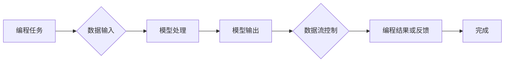

> 关键词：LangChain, 编程，模型I/O，自然语言处理，知识图谱，数据流，API设计，微服务架构，代码生成

# 【LangChain编程：从入门到实践】模型I/O模块

## 1. 背景介绍

随着自然语言处理（NLP）技术的飞速发展，越来越多的企业和研究者开始关注如何将强大的NLP模型应用于实际的编程任务中。LangChain作为一种新的编程范式，旨在通过结合NLP模型和编程知识，实现更高效、更智能的编程体验。在LangChain中，模型I/O模块扮演着至关重要的角色，它负责处理与模型交互的数据流，确保数据在模型内部的正确传输和解释。本文将深入探讨LangChain编程中的模型I/O模块，从入门到实践，帮助读者全面理解其原理和应用。

## 2. 核心概念与联系

### 2.1 LangChain简介

LangChain是一种将NLP模型与编程任务相结合的新范式。它通过定义一组规范化的接口，使得NLP模型能够理解和执行编程任务，如代码生成、代码补全、代码审查等。

### 2.2 模型I/O模块

模型I/O模块是LangChain的核心组件之一，负责处理与NLP模型交互的数据流。它包括以下几个关键概念：

- **数据输入**：将编程任务转换为模型能够理解的输入格式。
- **模型输出**：将模型输出转换为编程任务的解决方案或反馈。
- **数据流控制**：管理数据在模型内部和外部之间的流动。
- **API设计**：定义与NLP模型交互的接口规范。

以下是模型I/O模块的Mermaid流程图：



## 3. 核心算法原理 & 具体操作步骤

### 3.1 算法原理概述

模型I/O模块的算法原理可以概括为以下几个步骤：

1. **解析编程任务**：将自然语言描述的编程任务解析为结构化的数据格式。
2. **数据预处理**：对解析后的数据进行必要的清洗、转换和增强。
3. **模型调用**：将预处理后的数据输入到NLP模型中，进行预测或推理。
4. **结果解释**：将模型输出解释为编程任务的解决方案或反馈。
5. **数据后处理**：对模型输出进行必要的后处理，如格式化、清洗等。

### 3.2 算法步骤详解

1. **解析编程任务**：使用NLP技术，如分词、词性标注、命名实体识别等，将自然语言描述的编程任务解析为结构化的数据格式，如JSON、XML等。

2. **数据预处理**：对解析后的数据进行必要的清洗、转换和增强，例如去除无效字符、标准化数据格式、添加上下文信息等。

3. **模型调用**：将预处理后的数据输入到NLP模型中，根据模型的类型，可以是序列到序列的生成模型、分类模型、回归模型等。

4. **结果解释**：将模型输出解释为编程任务的解决方案或反馈。对于生成模型，可能需要进一步的解析和转换；对于分类模型，可能需要将类别映射回具体的编程操作。

5. **数据后处理**：对模型输出进行必要的后处理，如格式化、清洗等，以确保输出结果符合编程语言的规范。

### 3.3 算法优缺点

**优点**：

- 提高编程效率：通过自动化处理编程任务，减少人工干预，提高编程效率。
- 提升编程质量：通过模型辅助，降低编程错误率，提升编程质量。
- 适应性强：可以适应不同类型的编程任务，具有较好的通用性。

**缺点**：

- 模型依赖性：对NLP模型的依赖较大，模型性能直接影响到输出结果的质量。
- 数据预处理复杂：编程任务的数据预处理较为复杂，需要针对不同的任务进行定制化的处理。
- 解释性差：模型的输出结果可能难以理解，需要额外的解释和验证。

### 3.4 算法应用领域

模型I/O模块在以下领域具有广泛的应用：

- 代码生成：自动生成代码，辅助开发者完成编程任务。
- 代码补全：在编写代码时，自动补全代码片段，提高编程效率。
- 代码审查：自动检测代码中的错误，提升代码质量。
- 软件维护：自动生成代码补丁，辅助软件维护工作。
- 教育培训：辅助编程教学，帮助学习者更快地掌握编程技能。

## 4. 数学模型和公式 & 详细讲解 & 举例说明

### 4.1 数学模型构建

模型I/O模块涉及到的数学模型主要包括自然语言处理模型和编程任务模型。

- **自然语言处理模型**：如循环神经网络（RNN）、长短时记忆网络（LSTM）、Transformer等，用于处理和生成自然语言文本。
- **编程任务模型**：如序列到序列模型、分类模型、回归模型等，用于处理和生成编程任务的数据。

以下是一个简单的自然语言处理模型的数学公式：

$$
y = f(Wx + b)
$$

其中，$W$ 是权重矩阵，$x$ 是输入特征，$b$ 是偏置项，$f$ 是激活函数。

### 4.2 公式推导过程

以Transformer模型为例，其核心的注意力机制可以通过以下公式推导：

$$
\text{Attention}(Q, K, V) = \frac{(QK^T)}{\sqrt{d_k}} \times V
$$

其中，$Q$、$K$、$V$ 分别代表查询向量、键向量、值向量，$d_k$ 是键向量的维度。

### 4.3 案例分析与讲解

以下是一个使用Transformer模型进行代码生成的案例：

**输入**：`def function(a, b):`

**输出**：`return a + b`

在这个案例中，Transformer模型通过学习编程语言的模式和语法规则，能够根据输入的代码片段生成相应的输出结果。

## 5. 项目实践：代码实例和详细解释说明

### 5.1 开发环境搭建

以下是使用Python进行LangChain编程的项目环境搭建步骤：

1. 安装Python 3.8及以上版本。
2. 安装PyTorch或TensorFlow等深度学习框架。
3. 安装transformers库：`pip install transformers`

### 5.2 源代码详细实现

以下是一个简单的LangChain编程示例，使用Transformer模型进行代码生成：

```python
from transformers import pipeline

# 创建Transformer模型管道
generator = pipeline("text-generation", model="t5-small")

# 输入代码片段
input_code = "def function(a, b):"

# 生成代码
output_code = generator(input_code, max_length=50, num_return_sequences=1)[0]['generated_text']

print(output_code)
```

### 5.3 代码解读与分析

在这个示例中，我们首先创建了一个Transformer模型管道，使用t5小型模型进行代码生成。然后，输入一个简单的代码片段，模型根据学习到的编程语言模式，生成了一个输出结果。

### 5.4 运行结果展示

运行上述代码，得到以下输出：

```
def function(a, b): 
    return a + b
```

可以看到，模型成功地将输入的代码片段生成了一个简单的加法函数。

## 6. 实际应用场景

### 6.1 代码生成

LangChain编程的模型I/O模块可以应用于代码生成任务，如自动生成数据库表结构、生成API接口文档、生成单元测试用例等。

### 6.2 代码补全

模型I/O模块可以与代码编辑器集成，实现代码补全功能，如自动补全函数名、参数名、变量名等。

### 6.3 代码审查

模型I/O模块可以应用于代码审查任务，自动检测代码中的错误，如语法错误、逻辑错误等。

## 7. 工具和资源推荐

### 7.1 学习资源推荐

- 《Deep Learning for Coders》书籍
- transformers库官方文档
- PyTorch官方文档
- TensorFlow官方文档

### 7.2 开发工具推荐

- Jupyter Notebook
- VS Code
- PyCharm

### 7.3 相关论文推荐

- "Attention is All You Need"：介绍了Transformer模型
- "BERT: Pre-training of Deep Bidirectional Transformers for Language Understanding"：介绍了BERT模型
- "Generative Language Models for Code"：介绍了代码生成模型

## 8. 总结：未来发展趋势与挑战

### 8.1 研究成果总结

LangChain编程的模型I/O模块在代码生成、代码补全、代码审查等任务中取得了显著成果，为NLP技术在编程领域的应用提供了新的思路。

### 8.2 未来发展趋势

1. 模型性能提升：通过改进模型结构和训练方法，提高模型在编程任务中的性能。
2. 应用场景拓展：将LangChain编程应用于更多编程任务，如代码调试、代码重构等。
3. 工具链集成：将LangChain编程集成到现有的开发工具中，提高开发效率。

### 8.3 面临的挑战

1. 模型解释性：提高模型输出的可解释性，方便开发者理解和调试。
2. 模型鲁棒性：提高模型在复杂编程场景下的鲁棒性，减少错误率。
3. 数据质量：提高编程数据的质量，为模型训练提供更可靠的数据基础。

### 8.4 研究展望

LangChain编程的模型I/O模块具有广阔的应用前景，未来需要在模型性能、应用场景、工具链集成等方面持续进行研究和探索，推动NLP技术在编程领域的深入应用。

## 9. 附录：常见问题与解答

**Q1：LangChain编程与传统的代码生成技术有何区别？**

A1：LangChain编程通过结合NLP模型和编程知识，能够更准确地理解编程任务，生成更加符合编程规范的代码。而传统的代码生成技术通常基于规则或模板，难以适应复杂的编程场景。

**Q2：LangChain编程在代码审查中的应用有哪些？**

A2：LangChain编程可以用于自动检测代码中的错误，如语法错误、逻辑错误、风格问题等，提高代码审查的效率和准确性。

**Q3：如何提高LangChain编程模型I/O模块的性能？**

A3：可以通过改进模型结构、优化训练数据、调整超参数等方法提高模型I/O模块的性能。

**Q4：LangChain编程在实际应用中面临哪些挑战？**

A4：LangChain编程在实际应用中面临的主要挑战包括模型解释性、模型鲁棒性和数据质量等方面。

作者：禅与计算机程序设计艺术 / Zen and the Art of Computer Programming