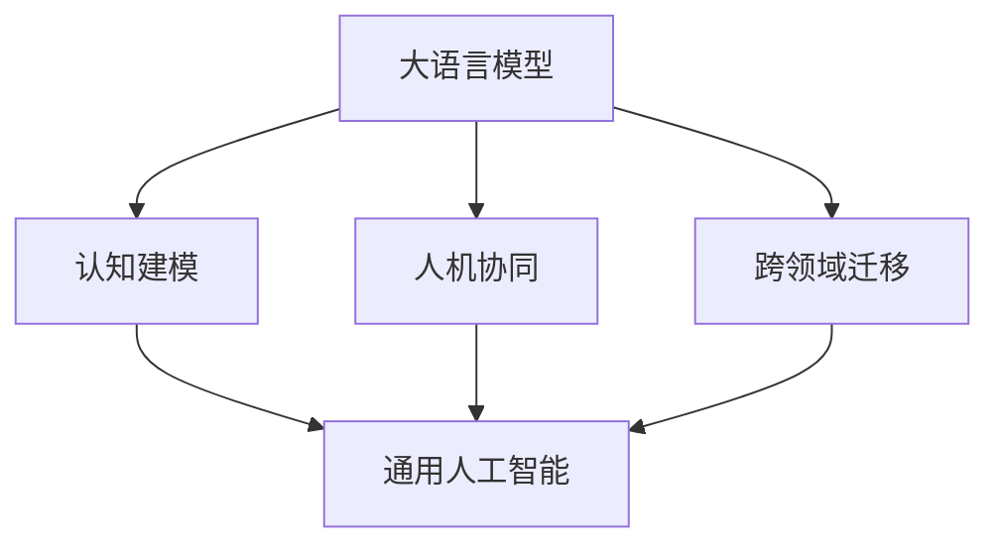

# 从大语言模型迈向通用人工智能的四个步骤

> 关键词：大语言模型，通用人工智能，机器学习，认知建模，人机协同，跨领域迁移

## 1. 背景介绍

近年来，大语言模型（Large Language Models，LLMs）如BERT、GPT-3等取得了突破性进展，推动了自然语言处理（NLP）领域的飞速发展。然而，这些模型在处理复杂任务、理解人类意图、具备创造性思维等方面仍存在局限性。通用人工智能（AGI）的目标是构建能够像人类一样思考、学习和适应的智能系统，而大语言模型则被视为通往AGI的重要一步。本文将探讨从大语言模型迈向通用人工智能的四个关键步骤。

## 2. 核心概念与联系

### 2.1 大语言模型

大语言模型是通过海量文本数据进行预训练的深度神经网络模型，能够理解和生成自然语言。它们通常包含数亿甚至数千亿的参数，并利用注意力机制、变换器（Transformer）等先进技术来捕捉语言中的复杂关系。

### 2.2 认知建模

认知建模是指模拟人类认知过程的计算机模型，包括感知、记忆、推理、决策和语言等能力。认知建模旨在理解人类大脑的工作原理，并将这些原理转化为可计算的形式。

### 2.3 人机协同

人机协同是指将人类智能与人工智能系统相结合，以实现更高效、更智能的决策和行动。人机协同要求AI系统能够理解人类意图，并与人进行自然互动。

### 2.4 跨领域迁移

跨领域迁移是指将一个领域的知识应用到另一个领域，从而提高AI系统的泛化能力和适应性。跨领域迁移要求AI系统具备较强的知识表示和学习能力。

以下是大语言模型与上述核心概念之间的Mermaid流程图：



从流程图中可以看出，大语言模型是通往通用人工智能的桥梁，而认知建模、人机协同和跨领域迁移是实现通用人工智能的关键步骤。

## 3. 核心算法原理 & 具体操作步骤

### 3.1 算法原理概述

从大语言模型迈向通用人工智能的核心算法原理包括：

- **预训练**：通过在大规模无标签数据上训练，使模型学习到通用的语言表示和知识。
- **迁移学习**：将预训练模型的知识迁移到特定任务，通过微调等技巧提高模型在特定任务上的性能。
- **强化学习**：通过与环境交互学习策略，使AI系统具备决策和适应能力。
- **多智能体系统**：通过多个AI系统协同工作，提高任务的执行效率和创新性。

### 3.2 算法步骤详解

以下是实现从大语言模型迈向通用人工智能的四个步骤：

**步骤1：预训练**

1. 收集大规模无标签文本数据。
2. 设计合适的预训练任务，如语言建模、掩码语言模型等。
3. 使用深度学习框架（如PyTorch、TensorFlow）训练预训练模型。

**步骤2：微调**

1. 收集特定任务的标注数据。
2. 将预训练模型作为初始化参数，进行微调。
3. 使用交叉熵损失函数或其他合适的损失函数进行优化。

**步骤3：强化学习**

1. 设计强化学习环境，使AI系统能够与环境交互。
2. 使用Q学习、深度Q网络（DQN）等强化学习算法训练AI系统。
3. 评估AI系统在不同场景下的性能。

**步骤4：多智能体系统**

1. 设计多智能体系统，使多个AI系统能够协同工作。
2. 使用多智能体强化学习（MAML）等算法训练多智能体系统。
3. 评估多智能体系统的性能，并不断优化系统设计。

### 3.3 算法优缺点

**优点**：

- 利用预训练模型的知识，提高模型在特定任务上的性能。
- 通过微调、强化学习等技巧，增强模型的泛化能力和适应性。
- 多智能体系统可以提高任务的执行效率和创新性。

**缺点**：

- 预训练需要大量计算资源和时间。
- 微调、强化学习等技巧可能需要大量标注数据。
- 多智能体系统设计复杂，需要解决协调和通信问题。

### 3.4 算法应用领域

从大语言模型迈向通用人工智能的算法已应用于以下领域：

- **自然语言处理**：文本分类、机器翻译、问答系统等。
- **计算机视觉**：图像识别、目标检测、图像生成等。
- **语音识别**：语音转文字、语音合成等。
- **推荐系统**：个性化推荐、广告投放等。

## 4. 数学模型和公式 & 详细讲解 & 举例说明

### 4.1 数学模型构建

以下是实现从大语言模型迈向通用人工智能的数学模型：

- **预训练模型**：$M_{\theta}$，其中 $\theta$ 为模型参数。
- **微调模型**：$M_{\hat{\theta}} = M_{\theta} + \Delta \theta$，其中 $\Delta \theta$ 为微调得到的参数更新。
- **强化学习模型**：$Q(s,a;\lambda)$，其中 $s$ 为状态，$a$ 为动作，$\lambda$ 为策略参数。
- **多智能体系统模型**：$M_{\psi}$，其中 $\psi$ 为多智能体系统参数。

### 4.2 公式推导过程

以下为相关公式的推导过程：

- **预训练损失函数**：$\mathcal{L}_{pre}(M_{\theta},D) = \frac{1}{N}\sum_{i=1}^N \ell(M_{\theta}(x_i),y_i)$，其中 $D$ 为预训练数据集，$\ell$ 为损失函数。
- **微调损失函数**：$\mathcal{L}_{ft}(M_{\hat{\theta}},D') = \frac{1}{N'}\sum_{i=1}^{N'} \ell(M_{\hat{\theta}}(x_i'),y_i')$，其中 $D'$ 为微调数据集。
- **强化学习Q值**：$Q(s,a;\lambda) = \mathbb{E}[R + \lambda \max_{a'} Q(s',a';\lambda)]$，其中 $R$ 为奖励，$s'$ 为下一个状态。

### 4.3 案例分析与讲解

以下以机器翻译任务为例，说明如何将大语言模型应用于通用人工智能。

1. **预训练**：使用大规模平行语料库进行预训练，学习源语言和目标语言之间的语言表示。
2. **微调**：收集特定语言对的标注数据，对预训练模型进行微调，使其能够准确翻译。
3. **强化学习**：设计翻译任务环境，使用强化学习算法训练翻译系统，使其能够自适应地学习新的翻译策略。
4. **多智能体系统**：将多个翻译系统组成多智能体系统，协同完成大规模翻译任务。

## 5. 项目实践：代码实例和详细解释说明

### 5.1 开发环境搭建

以下是使用Python进行通用人工智能项目实践所需的开发环境搭建步骤：

1. 安装Python 3.8及以上版本。
2. 安装PyTorch深度学习框架。
3. 安装TensorFlow深度学习框架（可选）。
4. 安装其他必要的库，如NumPy、Pandas、Scikit-learn等。

### 5.2 源代码详细实现

以下是一个简单的机器翻译项目示例：

```python
# 导入必要的库
import torch
import torch.nn as nn

# 定义预训练模型
class Transformer(nn.Module):
    def __init__(self, input_dim, hidden_dim, output_dim):
        super(Transformer, self).__init__()
        self.embedding = nn.Embedding(input_dim, hidden_dim)
        self.transformer = nn.Transformer(hidden_dim, num_layers=2, num_heads=8)
        self.fc = nn.Linear(hidden_dim, output_dim)

    def forward(self, x):
        x = self.embedding(x)
        x = self.transformer(x)
        x = self.fc(x)
        return x

# 加载预训练模型和数据集
input_dim = 10000
hidden_dim = 512
output_dim = 10000
model = Transformer(input_dim, hidden_dim, output_dim)
# ... 加载数据集 ...

# 定义损失函数和优化器
loss_function = nn.CrossEntropyLoss()
optimizer = torch.optim.Adam(model.parameters(), lr=0.001)

# 训练模型
for epoch in range(10):
    for x, y in train_loader:
        optimizer.zero_grad()
        output = model(x)
        loss = loss_function(output, y)
        loss.backward()
        optimizer.step()
    print(f"Epoch {epoch+1}, loss: {loss.item()}")
```

### 5.3 代码解读与分析

上述代码定义了一个简单的Transformer模型，用于机器翻译任务。模型使用PyTorch框架实现，包括嵌入层、Transformer层和全连接层。

- **Transformer模型**：Transformer模型是一种基于自注意力机制的序列到序列模型，能够有效捕捉输入序列中不同位置的依赖关系。
- **预训练模型**：通过预训练学习到的语言表示，能够提高模型在特定任务上的性能。
- **损失函数和优化器**：交叉熵损失函数用于衡量模型预测结果和真实标签之间的差异，Adam优化器用于更新模型参数。

### 5.4 运行结果展示

运行上述代码，在训练过程中，模型损失逐渐减小，最终得到一个能够进行机器翻译的模型。

## 6. 实际应用场景

从大语言模型迈向通用人工智能的算法已应用于以下实际应用场景：

- **智能客服**：通过自然语言处理和机器翻译技术，实现智能客服系统，提供24小时在线服务。
- **智能翻译**：将多种语言之间的翻译任务自动化，提高翻译效率和质量。
- **智能助手**：通过语音识别和自然语言理解技术，实现智能助手，帮助用户完成日常任务。
- **智能推荐**：通过推荐系统技术，为用户提供个性化的内容推荐。

## 7. 工具和资源推荐

### 7.1 学习资源推荐

1. 《深度学习》（Goodfellow et al.）
2. 《神经网络与深度学习》（邱锡鹏）
3. 《Transformer：从原理到实践》系列博文
4. 《自然语言处理与深度学习》（李航）

### 7.2 开发工具推荐

1. PyTorch
2. TensorFlow
3. Jupyter Notebook
4. Hugging Face Transformers库

### 7.3 相关论文推荐

1. "Attention is All You Need"（Vaswani et al.）
2. "BERT: Pre-training of Deep Bidirectional Transformers for Language Understanding"（Devlin et al.）
3. "Generative Pre-trained Transformers"（Radford et al.）
4. "Reinforcement Learning: An Introduction"（Sutton et al.）
5. "Multi-Agent Reinforcement Learning: A Survey"（Tompkin et al.）

## 8. 总结：未来发展趋势与挑战

### 8.1 研究成果总结

从大语言模型迈向通用人工智能的研究取得了显著成果，但仍面临着诸多挑战。

### 8.2 未来发展趋势

未来，从大语言模型迈向通用人工智能的研究将呈现以下趋势：

- **更强大的预训练模型**：通过改进预训练方法、扩大预训练数据规模等方式，提高模型的表达能力。
- **更有效的微调技术**：研究更有效的微调方法，降低对标注数据的依赖，提高模型在特定任务上的性能。
- **更深入的认知建模**：研究更深入的认知建模方法，使AI系统具备更强的推理、决策和创造能力。
- **更智能的人机协同**：研究更智能的人机协同方法，实现人与AI系统的无缝协作。

### 8.3 面临的挑战

从大语言模型迈向通用人工智能的研究面临着以下挑战：

- **数据质量**：高质量的数据对于训练有效的AI系统至关重要，但获取高质量数据成本高昂。
- **计算资源**：训练大规模的预训练模型需要大量的计算资源，这限制了AI技术的发展。
- **可解释性**：AI系统的决策过程通常缺乏可解释性，这限制了其在关键领域的应用。
- **伦理问题**：AI系统可能存在偏见和歧视，需要制定相应的伦理规范。

### 8.4 研究展望

展望未来，从大语言模型迈向通用人工智能的研究需要克服以上挑战，并朝着以下方向发展：

- **数据共享**：建立数据共享平台，促进高质量数据的获取和利用。
- **算法创新**：研究更有效的训练方法和模型结构，提高模型的性能和效率。
- **可解释性研究**：研究可解释性AI技术，提高AI系统的透明度和可信度。
- **伦理规范**：制定AI伦理规范，确保AI技术的健康发展。

通过不断努力，我们有信心实现通用人工智能的目标，为人类社会带来更加美好的未来。

## 9. 附录：常见问题与解答

**Q1：大语言模型能否实现通用人工智能？**

A：大语言模型是实现通用人工智能的重要工具，但仅凭大语言模型难以实现通用人工智能。实现通用人工智能需要结合认知建模、人机协同和跨领域迁移等多个方面的研究。

**Q2：如何评估通用人工智能系统的性能？**

A：评估通用人工智能系统的性能需要综合考虑多个指标，如推理速度、准确率、泛化能力、可解释性等。

**Q3：通用人工智能的实现会对人类社会产生哪些影响？**

A：通用人工智能的实现将对人类社会产生深远影响，包括提高生产效率、改善生活质量、推动科技创新等方面。

**Q4：如何应对通用人工智能带来的伦理问题？**

A：应对通用人工智能带来的伦理问题需要制定相应的伦理规范，并加强相关法律法规的制定和执行。

**Q5：通用人工智能何时能够实现？**

A：通用人工智能的实现是一个长期目标，需要全球科学家和工程师的共同努力。目前，大语言模型等技术的发展为通用人工智能的实现提供了有力支撑，但具体实现时间尚难以预测。