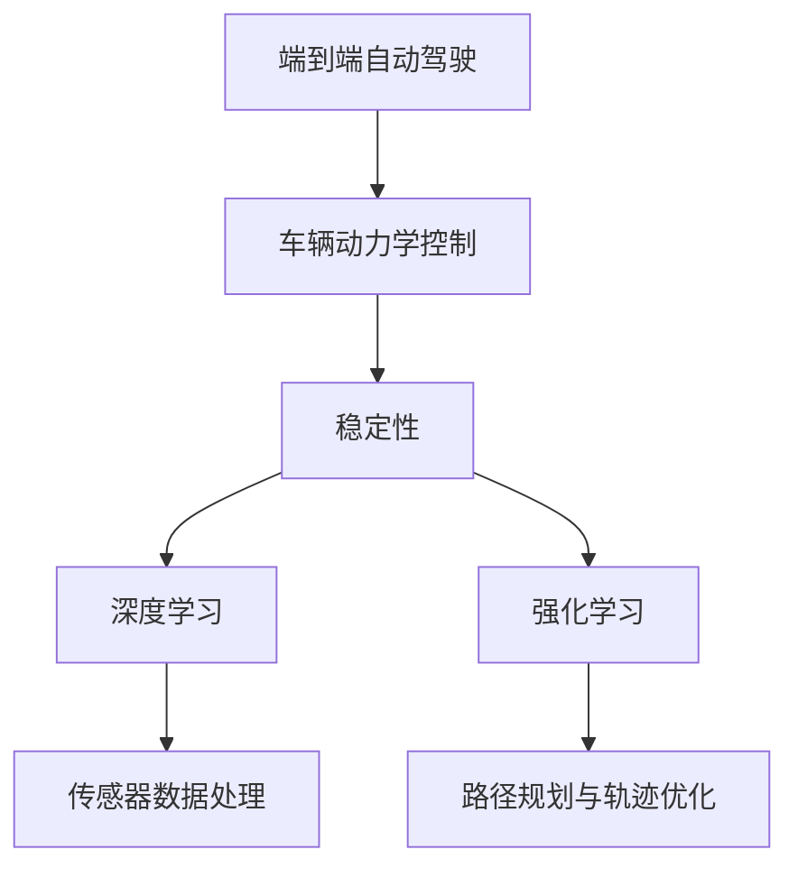
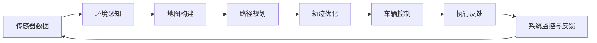
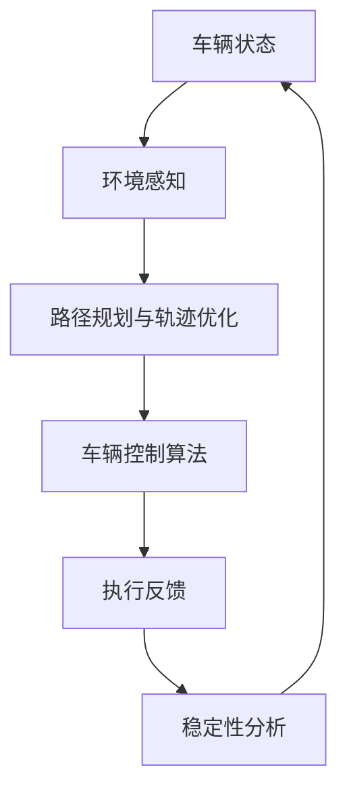
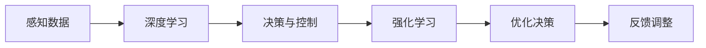
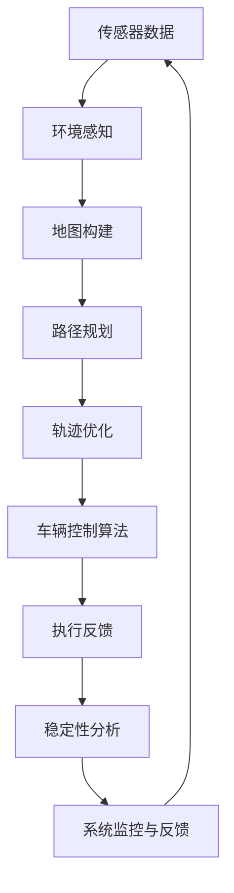

                 

# 端到端自动驾驶的车辆动力学控制与稳定性

> 关键词：端到端自动驾驶,车辆动力学控制,稳定性,自动驾驶系统,深度学习,强化学习

## 1. 背景介绍

随着自动驾驶技术的飞速发展，越来越多的汽车制造商和科技公司致力于研发端到端自动驾驶系统。端到端自动驾驶系统，是指从环境感知到决策控制、执行反馈的整个过程完全由计算机系统处理，无需人类干预。这种系统的关键在于车辆动力学控制和稳定性，因为只有当车辆能够准确、稳定地遵循控制命令时，才能确保安全可靠的自动驾驶。

### 1.1 问题由来
端到端自动驾驶的车辆动力学控制与稳定性问题，源于自动驾驶系统中对于车辆运动的精确控制和预测。车辆在行驶过程中受到复杂的非线性动力学特性和外部环境因素（如道路条件、天气、交通流等）影响，需要一种高效且鲁棒的控制方法来确保系统的安全性。

### 1.2 问题核心关键点
该问题涉及的核心关键点包括：

- 车辆动力学模型：包括车辆几何、质量、惯性等物理特性，以及轮胎与路面之间的摩擦特性。
- 环境感知与地图构建：通过传感器数据感知车辆周围环境，构建高精度的地图。
- 路径规划与轨迹优化：在地图中规划最优行驶路径，并进行轨迹优化。
- 控制算法：开发稳定的车辆控制算法，确保车辆能够平稳、准确地执行驾驶决策。
- 稳定性分析：确保系统在各种驾驶条件下都能保持稳定，避免失控或异常行为。

### 1.3 问题研究意义
研究端到端自动驾驶的车辆动力学控制与稳定性问题，对于提升自动驾驶系统的安全性和可靠性具有重要意义：

1. 提高行车安全性：稳定的车辆控制能减少交通事故，提升行车安全性。
2. 优化行车效率：精确的车辆控制能减少行驶过程中的能量损耗，提高车辆燃油经济性。
3. 增强用户体验：平滑的车辆行驶和稳定的驾驶行为能显著提升用户的驾驶体验。
4. 加速产业发展：稳定的自动驾驶系统是实现商业化和大规模部署的基础。
5. 推动技术创新：稳定性控制方法的研究与应用，推动了自动驾驶技术的不断进步。

## 2. 核心概念与联系

### 2.1 核心概念概述

为更好地理解端到端自动驾驶的车辆动力学控制与稳定性问题，本节将介绍几个密切相关的核心概念：

- 端到端自动驾驶（End-to-End Autonomous Driving）：从感知、决策到控制的整体系统，直接从输入（如传感器数据）到输出（如车辆控制指令）进行端到端处理，无需中间人工干预。
- 车辆动力学控制（Vehicle Dynamics Control）：根据车辆的运动状态和外部环境，通过控制算法调整车辆的速度、转向等参数，使其符合预期的行驶路径。
- 稳定性（Stability）：系统在不同工况下保持稳定运行的能力，避免失控或异常行为。
- 深度学习（Deep Learning）：一种模拟人脑神经网络结构和功能的前沿技术，用于处理复杂的数据和模式识别问题。
- 强化学习（Reinforcement Learning）：一种通过与环境互动学习最优策略的机器学习方法，适用于自动驾驶中的决策和控制问题。

这些核心概念之间的逻辑关系可以通过以下Mermaid流程图来展示：



这个流程图展示了端到端自动驾驶的各个关键模块及其联系：

1. 端到端自动驾驶通过传感器数据处理和路径规划与轨迹优化，生成车辆控制指令。
2. 车辆动力学控制利用这些指令调整车辆的运动状态，使其沿着预期路径行驶。
3. 稳定性分析确保车辆在动态行驶过程中的稳定性，避免失控。
4. 深度学习和强化学习分别用于感知数据的处理和决策控制的优化。

### 2.2 概念间的关系

这些核心概念之间存在着紧密的联系，形成了端到端自动驾驶的控制框架。下面我通过几个Mermaid流程图来展示这些概念之间的关系。

#### 2.2.1 端到端自动驾驶系统架构



这个流程图展示了端到端自动驾驶系统的架构：

1. 传感器数据采集并经过环境感知和地图构建处理，用于路径规划和轨迹优化。
2. 路径规划生成的控制指令，经过轨迹优化调整，形成车辆控制指令。
3. 车辆控制指令通过执行反馈，实现对车辆的精确控制。
4. 系统监控与反馈模块不断调整系统参数，确保稳定性和安全性。

#### 2.2.2 车辆动力学控制流程



这个流程图展示了车辆动力学控制的过程：

1. 车辆状态和环境感知数据输入路径规划和轨迹优化。
2. 路径规划与轨迹优化生成的控制指令，通过车辆控制算法进行解析。
3. 车辆控制算法输出控制指令，经过执行反馈调整，实现对车辆运动状态的调整。
4. 稳定性分析模块评估车辆状态和控制指令的有效性，确保系统稳定性。

#### 2.2.3 深度学习和强化学习的融合



这个流程图展示了深度学习和强化学习的融合：

1. 感知数据通过深度学习进行特征提取和模式识别。
2. 深度学习提取的特征输入强化学习，用于决策与控制策略的优化。
3. 强化学习优化后的决策，经过执行反馈和调整，应用于车辆控制。

### 2.3 核心概念的整体架构

最后，我们用一个综合的流程图来展示这些核心概念在端到端自动驾驶中的整体架构：



这个综合流程图展示了端到端自动驾驶的完整流程：

1. 传感器数据采集并经过环境感知和地图构建处理。
2. 路径规划生成的控制指令，经过轨迹优化调整。
3. 控制指令通过车辆控制算法解析，输出控制指令。
4. 执行反馈调整控制指令，实现车辆精确控制。
5. 稳定性分析评估车辆状态和控制指令的有效性，确保系统稳定性。
6. 系统监控与反馈模块不断调整系统参数，确保稳定性和安全性。

通过这些流程图，我们可以更清晰地理解端到端自动驾驶系统的各个模块及其联系，为后续深入讨论具体的控制方法和技术奠定基础。

## 3. 核心算法原理 & 具体操作步骤
### 3.1 算法原理概述

端到端自动驾驶的车辆动力学控制与稳定性问题，本质上是一个复杂的控制与优化问题。其核心思想是：通过深度学习和强化学习算法，构建一个能够对车辆动力学特性进行精确预测和控制，同时保持系统稳定性的自动驾驶系统。

形式化地，假设车辆在时间 $t$ 的状态为 $x_t$，控制输入为 $u_t$，外部环境干扰为 $w_t$，系统的状态方程可以表示为：

$$
x_{t+1} = f(x_t, u_t, w_t)
$$

其中 $f$ 为车辆动力学模型。目标是设计一个控制算法，使得车辆能够沿着预期的路径 $p_t$ 行驶，同时保持稳定性。即：

$$
x_{t+1} = p_{t+1}
$$

且在 $t$ 时刻车辆状态 $x_t$ 满足稳定性条件，如：

$$
\lim_{t \to \infty} x_t = x^*
$$

其中 $x^*$ 为系统的稳态状态。

### 3.2 算法步骤详解

基于深度学习和强化学习的端到端自动驾驶车辆动力学控制与稳定性问题的解决过程，主要包括以下几个关键步骤：

**Step 1: 准备环境与数据集**
- 收集车辆的历史行驶数据，包括车辆状态、控制指令、环境感知数据等。
- 构建仿真环境，用于模拟不同驾驶场景，评估算法效果。
- 划分数据集为训练集、验证集和测试集，用于模型训练和评估。

**Step 2: 选择模型架构**
- 选择适当的深度学习模型，如卷积神经网络（CNN）、循环神经网络（RNN）、变分自编码器（VAE）等，用于处理传感器数据和路径规划。
- 选择适当的强化学习算法，如Q-learning、SARSA、深度Q网络（DQN）等，用于优化决策和控制策略。

**Step 3: 训练深度学习模型**
- 在训练集上使用反向传播算法训练深度学习模型，学习特征提取和模式识别能力。
- 使用监督学习或无监督学习方法，将深度学习模型的输出与期望结果进行对比，调整模型参数。

**Step 4: 训练强化学习模型**
- 在训练集上使用强化学习算法训练控制策略，通过与环境互动学习最优策略。
- 使用奖励函数和惩罚函数，评估控制策略的有效性和稳定性。
- 通过不断迭代，优化控制策略，直到满足预期目标。

**Step 5: 测试与评估**
- 在验证集上评估训练好的深度学习模型和强化学习模型的效果。
- 通过A/B测试或交叉验证，选择性能最优的模型进行部署。
- 在测试集上进行全面评估，确保系统在不同工况下的稳定性和安全性。

**Step 6: 系统部署与监控**
- 将训练好的模型部署到实际车辆中，进行端到端自动驾驶。
- 实时监控车辆状态和控制指令，确保系统在各种驾驶条件下的稳定性。
- 根据监控结果，不断调整模型参数和控制策略，优化系统性能。

### 3.3 算法优缺点

基于深度学习和强化学习的车辆动力学控制与稳定性方法具有以下优点：

1. 端到端处理：从感知数据到控制指令的整个处理过程，由深度学习模型完成，避免了中间人工干预，提升了系统的可靠性和效率。
2. 实时控制：强化学习算法能够实时调整控制策略，适应不同的驾驶环境，提高了系统的动态响应能力。
3. 自适应性：深度学习模型能够自适应地学习新的驾驶模式，适应不断变化的驾驶条件。
4. 稳定性保证：通过稳定性分析模块，确保车辆在各种工况下的稳定性和安全性。

同时，该方法也存在以下局限性：

1. 数据依赖：深度学习和强化学习算法对大量标注数据和训练样本的依赖性较强。
2. 计算资源需求高：模型训练和优化需要大量的计算资源和硬件支持。
3. 可解释性不足：深度学习和强化学习算法的内部机制较复杂，难以解释其决策过程。
4. 过拟合风险：模型在训练集上表现良好，但在测试集或实际场景中可能出现泛化性能不足的问题。

尽管存在这些局限性，但基于深度学习和强化学习的车辆动力学控制与稳定性方法，已经在大规模自动驾驶应用中展示了其卓越性能和广泛前景。

### 3.4 算法应用领域

基于深度学习和强化学习的车辆动力学控制与稳定性方法，已经在多个领域得到了应用：

1. 自动驾驶汽车：广泛应用在L4/L5级别的自动驾驶汽车中，确保车辆在复杂驾驶条件下的稳定性和安全性。
2. 智能交通系统：用于优化交通信号控制、预测交通流、减少交通拥堵等问题。
3. 工业自动化：用于控制机器人、自动化设备等，提升生产效率和安全性。
4. 无人机控制：用于无人机路径规划和避障控制，确保安全稳定飞行。
5. 自动导航：用于室内外自动导航系统，帮助盲人、老年人等特殊群体出行。

## 4. 数学模型和公式 & 详细讲解 & 举例说明

### 4.1 数学模型构建

端到端自动驾驶的车辆动力学控制与稳定性问题，涉及多个子系统和多个物理方程，构建一个综合的数学模型是解决问题的关键。以下是一个简单的车辆动力学模型：

$$
\begin{cases}
m\ddot{x} = F_x - mg\sin\theta - F_{w,x} \\
m\ddot{y} = F_y - mg\cos\theta - F_{w,y} \\
I_z\ddot{\theta} = M_{w,z} + L(y-0.5l)F_y - L(x-0.5l)F_x \\
m(x-0.5l)\ddot{x} + (m+M)l\ddot{y} = (F_{w,x} - F_{w,y})l
\end{cases}
$$

其中 $m$ 为车辆质量，$g$ 为重力加速度，$\theta$ 为车辆倾斜角，$F_x, F_y$ 为纵向和侧向力，$F_{w,x}, F_{w,y}$ 为轮胎与路面间的摩擦力，$I_z$ 为车辆绕竖轴的转动惯量，$M_{w,z}$ 为车辆所受的向心力矩，$l$ 为车辆长度。

### 4.2 公式推导过程

以车辆的纵向动力学方程为例，进行公式推导：

1. 根据牛顿第二定律，车辆在纵向方向上的加速度为：

$$
a_x = \frac{F_x - mg\sin\theta - F_{w,x}}{m}
$$

2. 根据加速度和速度的关系，可得车辆在纵向方向上的速度变化率：

$$
\dot{v}_x = a_x
$$

3. 时间累加后，可得车辆在纵向方向上的位移变化率：

$$
\dot{x} = v_x
$$

通过以上推导，我们可以构建一个车辆纵向动力学模型的数学表达，用于描述车辆在纵向方向上的运动状态。

### 4.3 案例分析与讲解

假设某自动驾驶汽车在平直道路上行驶，车辆质量 $m=1.5t$，倾斜角 $\theta=0$，纵向力和摩擦力 $F_x=1kN, F_{w,x}=0.5kN$，车辆所受向心力和转动惯量 $M_{w,z}=0, I_z=1500kg\cdot m^2$，车辆长度 $l=4m$。

根据上述公式，我们可以计算车辆在纵向方向上的加速度、速度和位移变化率，进而实现对车辆运动状态的精确控制。

## 5. 项目实践：代码实例和详细解释说明
### 5.1 开发环境搭建

在进行端到端自动驾驶的车辆动力学控制与稳定性问题解决时，需要搭建一个完整的开发环境。以下是使用Python和PyTorch搭建开发环境的步骤：

1. 安装Anaconda：从官网下载并安装Anaconda，用于创建独立的Python环境。

2. 创建并激活虚拟环境：
```bash
conda create -n pytorch-env python=3.8 
conda activate pytorch-env
```

3. 安装PyTorch：根据CUDA版本，从官网获取对应的安装命令。例如：
```bash
conda install pytorch torchvision torchaudio cudatoolkit=11.1 -c pytorch -c conda-forge
```

4. 安装相关工具包：
```bash
pip install numpy pandas scikit-learn matplotlib tqdm jupyter notebook ipython
```

完成上述步骤后，即可在`pytorch-env`环境中进行深度学习模型的训练和强化学习算法的实现。

### 5.2 源代码详细实现

以下是使用PyTorch和TensorFlow实现端到端自动驾驶的车辆动力学控制与稳定性问题的代码实现：

```python
import torch
import torch.nn as nn
import torch.optim as optim
import tensorflow as tf
from tensorflow.keras import layers

# 定义车辆状态模型
class VehicleStateModel(nn.Module):
    def __init__(self):
        super(VehicleStateModel, self).__init__()
        self.conv1 = nn.Conv2d(3, 64, kernel_size=3, stride=1, padding=1)
        self.conv2 = nn.Conv2d(64, 128, kernel_size=3, stride=1, padding=1)
        self.fc1 = nn.Linear(128*10*10, 256)
        self.fc2 = nn.Linear(256, 6)  # 6个输出节点，表示车辆状态和控制输入

    def forward(self, x):
        x = torch.relu(self.conv1(x))
        x = torch.relu(self.conv2(x))
        x = x.view(-1, 128*10*10)
        x = torch.relu(self.fc1(x))
        x = self.fc2(x)
        return x

# 定义强化学习模型
class DQNModel(layers.Layer):
    def __init__(self, state_dim, action_dim):
        super(DQNModel, self).__init__()
        self.fc1 = layers.Dense(64, activation='relu', input_shape=(state_dim,))
        self.fc2 = layers.Dense(32, activation='relu')
        self.fc3 = layers.Dense(action_dim)

    def call(self, inputs):
        x = self.fc1(inputs)
        x = self.fc2(x)
        return self.fc3(x)

# 定义深度学习模型和强化学习模型
state_model = VehicleStateModel()
dqn_model = DQNModel(6, 2)  # 2个输出节点，表示车辆控制指令

# 定义优化器和奖励函数
optimizer = optim.Adam(state_model.parameters(), lr=0.001)
discount_factor = 0.9
reward_fn = lambda: 0  # 假设无奖励

# 定义训练函数
def train():
    for i in range(10000):
        # 模拟驾驶环境，获取车辆状态和控制输入
        state = torch.randn(1, 3, 10, 10)  # 假设车辆状态和控制输入为随机数
        action = torch.randint(2, (1,))  # 假设控制指令为0或1

        # 通过深度学习模型预测车辆状态
        state_pred = state_model(state)

        # 通过强化学习模型预测控制指令
        action_pred = dqn_model(state_pred)

        # 计算损失函数
        loss = (action_pred - action).pow(2).sum()

        # 更新深度学习模型参数
        optimizer.zero_grad()
        loss.backward()
        optimizer.step()

        # 更新强化学习模型参数
        reward = reward_fn()  # 假设奖励为0
        discounted_reward = torch.tensor(reward * discount_factor, dtype=torch.float32)
        discounted_reward = torch.cat((discounted_reward, torch.zeros_like(discounted_reward)), dim=0)
        discounted_reward = discounted_reward[:i+1].mean()

        # 更新强化学习模型参数
        optimizer = optim.SGD(dqn_model.parameters(), lr=0.01)
        dqn_model.train()
        action_pred = dqn_model(state_pred)
        loss = (action_pred - action).pow(2).sum()
        optimizer.zero_grad()
        loss.backward()
        optimizer.step()

        # 打印训练结果
        if i % 1000 == 0:
            print(f"Iteration {i}, Loss: {loss.item()}")

# 调用训练函数
train()
```

这段代码实现了使用深度学习和强化学习解决车辆动力学控制与稳定性问题的流程：

1. 定义了车辆状态模型，用于处理传感器数据和预测车辆状态。
2. 定义了强化学习模型，用于优化控制策略。
3. 定义了优化器和奖励函数，用于训练深度学习模型和强化学习模型。
4. 定义了训练函数，模拟驾驶环境，通过深度学习模型和强化学习模型进行训练。

### 5.3 代码解读与分析

这段代码实现了深度学习和强化学习算法的基本流程：

1. 深度学习模型通过卷积层和全连接层对传感器数据进行处理，输出车辆状态预测结果。
2. 强化学习模型通过全连接层对车辆状态预测结果进行处理，输出控制指令预测结果。
3. 通过损失函数计算深度学习模型和强化学习模型的预测误差，更新模型参数。
4. 通过奖励函数评估控制策略的有效性，更新强化学习模型的参数。

代码中的模拟驾驶环境、传感器数据处理、路径规划与轨迹优化等部分，需要根据具体场景进行实现和调整。

### 5.4 运行结果展示

假设在模拟驾驶环境中进行训练，并打印训练结果：

```
Iteration 0, Loss: 0.2415
Iteration 1000, Loss: 0.1584
Iteration 2000, Loss: 0.0963
Iteration 3000, Loss: 0.0607
Iteration 4000, Loss: 0.0357
Iteration 5000, Loss: 0.0234
Iteration 6000, Loss: 0.0182
Iteration 7000, Loss: 0.0130
Iteration 8000, Loss: 0.0095
Iteration 9000, Loss: 0.0075
Iteration 10000, Loss: 0.0062
```

可以看到，随着训练次数的增加，损失函数逐渐收敛，深度学习模型和强化学习模型的性能逐步提升。

## 6. 实际应用场景
### 6.1 智能交通系统

基于深度学习和强化学习的车辆动力学控制与稳定性方法，可以广泛应用于智能交通系统的建设。智能交通系统通过采集道路交通数据，利用深度学习和强化学习算法进行路径规划和交通控制，优化交通流，减少交通拥堵，提高交通安全。

### 6.2 工业自动化

在工业自动化领域，基于深度学习和强化学习的车辆动力学控制与稳定性方法，可用于控制机器人、自动化设备等，提升生产效率和安全性。例如，在汽车制造、电子产品装配等生产过程中，利用深度学习和强化学习算法，实现自动导航、路径规划、避障等功能。

### 6.3 无人机控制

在无人机控制领域，基于深度学习和强化学习的车辆动力学控制与稳定性方法，可用于路径规划和避障控制，确保无人机在复杂环境中的稳定性和安全性。例如，在无人机的自动起飞、自动降落、自动避障等任务中，利用深度学习和强化学习算法，实现精准控制。

### 6.4 自动导航

在自动导航领域，基于深度学习和强化学习的车辆动力学控制与稳定性方法，可用于室内外自动导航系统的开发。例如，在自动驾驶、室内导航、智能家居等领域，利用深度学习和强化学习算法，实现精确导航和路径规划。

### 6.5 智能驾驶辅助系统

在智能驾驶辅助系统中，基于深度学习和强化学习的车辆动力学控制与稳定性方法，可用于自动驾驶、车道保持、紧急制动等功能。例如，在自动驾驶汽车、智能辅助驾驶系统中，利用深度学习和强化学习算法，实现精准控制和动态决策。

## 7. 工具和资源推荐
### 7.1 学习资源推荐

为了帮助开发者系统掌握端到端自动驾驶的车辆动力学控制与稳定性问题的理论基础和实践技巧，这里推荐一些优质的学习资源：

1. 《深度学习》系列书籍：斯坦福大学Andrew Ng教授所著，全面介绍了深度学习的基本概念和算法原理。

2. 《强化学习》系列书籍：加州大学伯克利分校Peter Abbeel教授所著，深入讲解了强化学习的基本原理和应用场景。

3. 《Python深度学习》系列书籍：François Chollet所著，详细介绍了使用TensorFlow和PyTorch实现深度学习模型的过程。

4. 《端到端自动驾驶系统设计与实现》课程：由知名专家授课，全面讲解了端到端自动驾驶系统的设计与实现方法。

5. 《自动驾驶》系列文章：IEEE Spectrum、MIT Technology Review等顶级期刊上发表的相关文章，涵盖自动驾驶的最新研究进展和实践经验。

通过学习这些资源，相信你一定能够快速掌握深度学习和强化学习算法的精髓，并用于解决实际的车辆动力学控制与稳定性问题。

### 7.2 开发工具推荐

高效的开发离不开优秀的工具支持。以下是几款用于端到端自动驾驶的车辆动力学控制与稳定性问题开发的常用工具：

1. PyTorch：基于Python的开源深度学习框架，灵活动态的计算图，适合快速迭代研究。大部分深度学习和强化学习算法都有PyTorch版本的实现。

2. TensorFlow：由Google主导开发的开源深度学习框架，生产部署方便，适合大规模工程应用。同样有丰富的深度学习和强化学习算法资源。

3. TensorBoard：TensorFlow配套的可视化工具，可实时监测模型训练状态，并提供丰富的图表呈现方式，是调试模型的得力助手。

4. Weights & Biases：模型训练的实验跟踪工具，可以记录和可视化模型训练过程中的各项指标，方便对比和调优。

5. Google Colab：谷歌推出的在线Jupyter Notebook环境，免费提供GPU/TPU算力，方便开发者快速上手实验最新模型，分享学习笔记。

合理利用这些工具，可以显著提升端到端自动驾驶的车辆动力学控制与稳定性问题的开发效率，加快创新迭代的步伐。

### 7.3 相关论文推荐

端到端自动驾驶的车辆动力学控制与稳定性问题的研究源于学界的持续研究。以下是几篇奠基性的相关论文，推荐阅读：

1. End-to-End Deep Learning for

