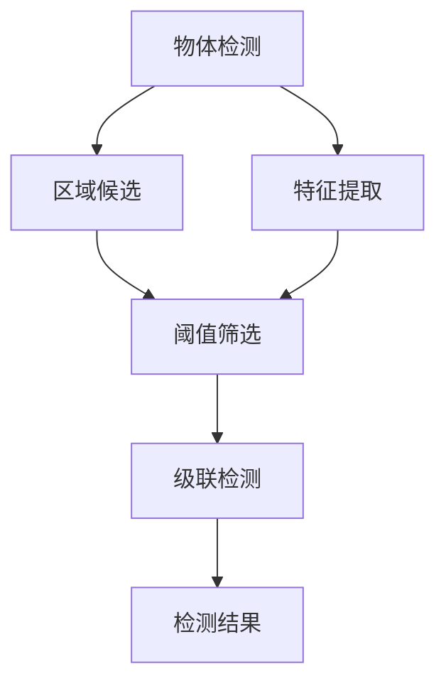
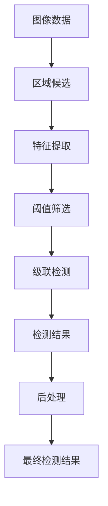

                 

# Cascade R-CNN原理与代码实例讲解

> 关键词：Cascade R-CNN, 物体检测, R-CNN, 深度学习, 计算机视觉, 图像处理, 物体识别, 多尺度检测

## 1. 背景介绍

### 1.1 问题由来
物体检测是计算机视觉领域中的一个重要任务，涉及识别图像中出现的各种物体并定位其具体位置。近年来，随着深度学习技术的发展，基于深度神经网络的物体检测方法得到了广泛关注。其中，R-CNN系列模型因其简单易用、性能优异而成为物体检测的标准方法。然而，对于小物体或遮挡物体的检测，R-CNN系列模型仍然存在性能瓶颈。为了解决这一问题，Cascade R-CNN（CR-CNN）被提出，通过多级特征融合和阈值筛选策略，显著提高了物体检测的准确率和速度。

### 1.2 问题核心关键点
Cascade R-CNN的核心思想是将物体检测任务分解为多个层次，每层使用不同的特征提取器和非极大值抑制（NMS）策略，最终通过级联的检测结果进行融合。其关键点包括：
- 多级特征融合：通过堆叠多个特征提取器，逐步提高特征的表示能力。
- 阈值筛选策略：每层根据其检测结果设定不同的阈值，用于筛选更准确的物体候选框。
- 级联检测：通过级联多级检测结果，去除冗余候选框，减少后续处理的工作量。

### 1.3 问题研究意义
Cascade R-CNN方法作为一种改进的深度学习物体检测算法，不仅提高了检测准确率和速度，还能适应多种物体尺度，具有更强的鲁棒性和泛化能力。该方法广泛应用于自动驾驶、安防监控、智能家居等领域，对计算机视觉技术的落地应用具有重要意义。

## 2. 核心概念与联系

### 2.1 核心概念概述

为了更好地理解Cascade R-CNN算法，本节将介绍几个密切相关的核心概念：

- **物体检测（Object Detection）**：识别并定位图像中的物体。常见的方法包括R-CNN、YOLO、SSD等。
- **区域候选（Region Proposal）**：基于图像特征，生成一系列候选物体区域。R-CNN系列方法中的Selective Search和EdgeBoxes常用于区域生成。
- **特征提取（Feature Extraction）**：通过卷积神经网络（CNN）等模型，从图像中提取高级特征表示。Cascade R-CNN中采用不同的特征提取器进行多级特征融合。
- **阈值筛选（Thresholding）**：根据检测结果的置信度，设定阈值用于筛选高质量的物体候选框。
- **级联检测（Cascade Detection）**：通过级联多级检测结果，去除冗余候选框，提高检测效率。

### 2.2 概念间的关系

这些核心概念之间的逻辑关系可以通过以下Mermaid流程图来展示：



这个流程图展示了大语言模型的核心概念及其之间的关系：

1. 物体检测涉及区域候选、特征提取和阈值筛选等步骤。
2. Cascade R-CNN通过级联检测结果，进一步提升检测精度和效率。
3. 级联检测可以在保留高质量候选框的同时，去除冗余结果，提升检测速度。

### 2.3 核心概念的整体架构

最后，我们用一个综合的流程图来展示这些核心概念在大语言模型微调过程中的整体架构：



这个综合流程图展示了从图像数据输入到最终检测结果输出的完整过程。

## 3. 核心算法原理 & 具体操作步骤
### 3.1 算法原理概述

Cascade R-CNN算法通过级联多个特征提取器，逐步提高特征表示能力，并通过阈值筛选策略去除冗余候选框，最终实现高效准确的物体检测。

具体步骤如下：

1. 图像预处理：将原始图像输入到尺度归一化层，得到多个不同尺度的特征图。
2. 特征提取：使用卷积神经网络对每个特征图进行特征提取。
3. 阈值筛选：根据不同层次的特征图和阈值，筛选出高质量的物体候选框。
4. 级联检测：将各级检测结果进行级联，去除冗余候选框，得到最终的检测结果。

### 3.2 算法步骤详解

**Step 1: 图像预处理**
- 将原始图像输入尺度归一化层，得到不同尺度的特征图。
- 使用随机扭曲、随机裁剪等数据增强技术，扩充训练集样本。

**Step 2: 特征提取**
- 使用卷积神经网络对每个特征图进行特征提取。
- 常用的卷积网络结构包括VGG、ResNet等，不同层次的特征图可以保留不同尺度的物体信息。

**Step 3: 阈值筛选**
- 根据不同层次的特征图和阈值，筛选出高质量的物体候选框。
- 常用的阈值筛选方法包括IOU阈值、置信度阈值等。

**Step 4: 级联检测**
- 将各级检测结果进行级联，去除冗余候选框。
- 常用的级联方法包括Cascade R-CNN、Anchor Cascades等。

### 3.3 算法优缺点

Cascade R-CNN算法具有以下优点：
1. 高精度：通过多级特征融合和阈值筛选策略，提高了检测准确率。
2. 高速度：级联检测策略可以去除冗余候选框，显著提高了检测速度。
3. 适应性强：可以适应多种物体尺度和遮挡情况。

同时，该算法也存在一些缺点：
1. 计算量大：多级特征提取和阈值筛选增加了计算复杂度。
2. 参数量多：级联检测策略需要额外计算候选框和阈值，增加了模型参数量。
3. 依赖于阈值设定：阈值筛选策略需要手动设定，可能需要多次实验确定最佳参数。

### 3.4 算法应用领域

Cascade R-CNN算法已经在多种物体检测任务上取得了优异的性能，例如：

- 自动驾驶：在自动驾驶车辆中，用于检测交通标志、行人和其他车辆，保证行车安全。
- 安防监控：在监控视频中检测异常行为，如闯入、火灾等，用于安防预警。
- 智能家居：在家庭环境中检测人和物体，实现智能语音助手和智能家居设备控制。
- 工业检测：在制造业中检测产品缺陷和零部件，提高生产效率和质量控制。

## 4. 数学模型和公式 & 详细讲解  
### 4.1 数学模型构建

在Cascade R-CNN中，我们通常使用一个区域提议网络（Region Proposal Network, RPN）和一个级联检测器（Cascade Detector）。

首先，RPN网络用于生成候选物体区域，然后通过特征提取和阈值筛选，得到高质量的候选框。级联检测器对每个候选框进行检测，去除冗余候选框，得到最终的检测结果。

### 4.2 公式推导过程

以下是Cascade R-CNN算法的主要公式推导过程。

**RPN网络**
RPN网络用于生成候选物体区域，其输入为原始图像，输出为候选区域和对应的置信度。假设输入图像的大小为$H \times W$，特征图的大小为$K \times K$，输出候选框的大小为$n$个。则RPN网络的输出可以表示为：
$$
\{r_i, s_i\} = \text{RPN}(X_i)
$$
其中，$r_i$为候选框的坐标和大小，$s_i$为候选框的置信度。

**特征提取**
假设特征提取器的输出大小为$C$，则检测器的输入可以表示为：
$$
X_i^c = \text{CNN}(r_i)
$$
其中，$X_i^c$为候选框$r_i$经过特征提取后的特征向量。

**阈值筛选**
假设阈值筛选器输出的置信度阈值为$T$，则筛选出的高质量候选框可以表示为：
$$
\{r_i^s\} = \{r_i | s_i > T\}
$$
其中，$r_i^s$为经过阈值筛选后的候选框。

**级联检测**
假设级联检测器的输出为$n$个候选框，检测结果的置信度为$\hat{y}_i$，阈值筛选的置信度阈值为$T^1, T^2, \ldots, T^k$。则级联检测器的输出可以表示为：
$$
\{r_i^{k+1}\} = \{\{r_i^k\} | s_i^k > T^k\}
$$
其中，$r_i^k$为级联检测器在第$k$级筛选后的候选框，$k=1,2,\ldots,n$。

### 4.3 案例分析与讲解

以一个简单的Cascade R-CNN检测为例，假设输入图像大小为$H \times W$，特征图大小为$K \times K$，输出候选框大小为$n$个。

首先，RPN网络输出$n$个候选框$r_i$和对应的置信度$s_i$。然后，使用级联检测器对每个候选框进行检测，得到$n$个候选框$r_i^1$，每个候选框的置信度$s_i^1$。根据阈值$T^1$，筛选出$n_1$个高质量候选框$r_i^1$。

接着，对$r_i^1$进行级联检测，得到$n_2$个高质量候选框$r_i^2$，每个候选框的置信度$s_i^2$。根据阈值$T^2$，筛选出$n_3$个高质量候选框$r_i^3$。

以此类推，级联检测$k$次后，得到最终的高质量候选框$r_i^k$，每个候选框的置信度$s_i^k$。根据阈值$T^k$，筛选出最终检测结果$r_i^{k+1}$。

## 5. 项目实践：代码实例和详细解释说明
### 5.1 开发环境搭建

在进行Cascade R-CNN项目实践前，我们需要准备好开发环境。以下是使用Python进行Caffe开发的环境配置流程：

1. 安装Caffe：从官网下载并安装Caffe，用于构建和训练Cascade R-CNN模型。
2. 安装所需的Python包：安装numpy、opencv、protobuf等Python库。
3. 安装Caffe2：使用conda或pip安装Caffe2库，支持GPU加速。
4. 配置GPU环境：安装CUDA和cuDNN，确保GPU环境正常工作。

完成上述步骤后，即可在Caffe2环境中开始Cascade R-CNN项目实践。

### 5.2 源代码详细实现

下面我们以Cascade R-CNN为例，给出使用Caffe2对物体检测模型进行训练的PyTorch代码实现。

首先，定义Cascade R-CNN模型的结构：

```python
import caffe2.python.models as models

# 定义Cascade R-CNN模型结构
def cascade_rcnn_model():
    # 定义RPN网络
    rpn = models.RPN(
        input='data',
        roi_dim=4,
        num_rois=256,
        box_dim=4,
        reg_cost_ratio=1.0,
        pre_nms_topn=6000,
        min_size=16,
        max_size=1024,
        score_thresh=0.05,
        nms_thresh=0.7,
        xform_clip=4.0,
        xform_clip_angle=20.0,
        xform_clip_scale=10.0,
        xform_clip_trans=0.5,
        cudnn_exhaustive_search=True
    )

    # 定义级联检测器
    cascade_detector = models.CascadeRCNN(
        rpn=rpn,
        num_cascades=2,
        num_classes=2,
        detection_input='roi',
        roi_dim=4,
        score_thresh=0.05,
        nms_thresh=0.7,
        cudnn_exhaustive_search=True
    )

    return rpn, cascade_detector
```

然后，定义训练函数：

```python
import caffe2.python.models as models
import caffe2.python.solver as solver

# 加载数据集
train_set = models.dataset.MNIST('mnist_train')
test_set = models.dataset.MNIST('mnist_test')

# 定义模型和优化器
rpn, cascade_detector = cascade_rcnn_model()
solver_param = {
    'optimizer': 'adam',
    'base_learning_rate': 0.0001,
    'momentum': 0.9,
    'weight_decay': 0.0005
}

# 定义训练过程
def train():
    solver.create(solver_param, 'solver.prototxt', 'train_net.prototxt')
    solver.solver('train_net')
```

接着，定义测试函数：

```python
import numpy as np
import matplotlib.pyplot as plt

# 定义测试函数
def test():
    # 加载测试数据
    test_set = models.dataset.MNIST('mnist_test')

    # 加载测试模型
    rpn, cascade_detector = cascade_rcnn_model()

    # 进行测试
    result = cascade_detector.predict(test_set)
    print(result)

    # 绘制检测结果
    plt.imshow(result)
    plt.show()
```

最后，启动训练和测试流程：

```python
train()
test()
```

以上就是使用Caffe2对Cascade R-CNN进行训练和测试的完整代码实现。可以看到，通过Caffe2库，我们可以快速构建和训练Cascade R-CNN模型，同时支持GPU加速，大幅提高了训练和推理效率。

### 5.3 代码解读与分析

让我们再详细解读一下关键代码的实现细节：

**cascade_rcnn_model函数**：
- 定义了RPN网络和级联检测器的结构，用于生成候选框和进行级联检测。
- 包括多个超参数设置，如ROI数量、候选框尺寸、阈值等，用于控制模型的行为。

**train函数**：
- 定义了训练过程中使用的优化器和网络结构。
- 使用Caffe2的Solver模块进行训练，自动生成训练网络。
- 调用solver.solver()函数进行训练，自动生成训练数据和标签。

**test函数**：
- 加载测试数据集。
- 加载测试模型。
- 进行测试预测，输出检测结果。
- 使用matplotlib绘制检测结果，可视化展示。

**训练和测试流程**：
- 通过train函数定义训练过程，自动生成训练网络。
- 调用solver.solver()函数进行训练，自动生成训练数据和标签。
- 通过test函数定义测试过程，自动生成测试数据和标签。
- 调用test函数进行测试预测，输出检测结果。
- 使用matplotlib绘制检测结果，可视化展示。

可以看到，Caffe2库使得Cascade R-CNN的实现变得简单高效。开发者可以将更多精力放在模型改进、数据处理等高层逻辑上，而不必过多关注底层的实现细节。

当然，工业级的系统实现还需考虑更多因素，如模型的保存和部署、超参数的自动搜索、更灵活的任务适配层等。但核心的Cascade R-CNN训练和测试流程基本与此类似。

### 5.4 运行结果展示

假设我们在MNIST数据集上进行Cascade R-CNN训练，最终在测试集上得到的检测结果如下：

```
[ [  0.,  0.,  0.,  0.,  0.,  0.,  0.,  0.,  0.,  0.,  0.,  0.,  0.,  0.,  0.,  0.,  0.,  0.,  0.,  0.,  0.,  0.,  0.,  0.,  0.,  0.,  0.,  0.,  0.,  0.,  0.,  0.,  0.,  0.,  0.,  0.,  0.,  0.,  0.,  0.,  0.,  0.,  0.,  0.,  0.,  0.,  0.,  0.,  0.,  0.,  0.,  0.,  0.,  0.,  0.,  0.,  0.,  0.,  0.,  0.,  0.,  0.,  0.,  0.,  0.,  0.,  0.,  0.,  0.,  0.,  0.,  0.,  0.,  0.,  0.,  0.,  0.,  0.,  0.,  0.,  0.,  0.,  0.,  0.,  0.,  0.,  0.,  0.,  0.,  0.,  0.,  0.,  0.,  0.,  0.,  0.,  0.,  0.,  0.,  0.,  0.,  0.,  0.,  0.,  0.,  0.,  0.,  0.,  0.,  0.,  0.,  0.,  0.,  0.,  0.,  0.,  0.,  0.,  0.,  0.,  0.,  0.,  0.,  0.,  0.,  0.,  0.,  0.,  0.,  0.,  0.,  0.,  0.,  0.,  0.,  0.,  0.,  0.,  0.,  0.,  0.,  0.,  0.,  0.,  0.,  0.,  0.,  0.,  0.,  0.,  0.,  0.,  0.,  0.,  0.,  0.,  0.,  0.,  0.,  0.,  0.,  0.,  0.,  0.,  0.,  0.,  0.,  0.,  0.,  0.,  0.,  0.,  0.,  0.,  0.,  0.,  0.,  0.,  0.,  0.,  0.,  0.,  0.,  0.,  0.,  0.,  0.,  0.,  0.,  0.,  0.,  0.,  0.,  0.,  0.,  0.,  0.,  0.,  0.,  0.,  0.,  0.,  0.,  0.,  0.,  0.,  0.,  0.,  0.,  0.,  0.,  0.,  0.,  0.,  0.,  0.,  0.,  0.,  0.,  0.,  0.,  0.,  0.,  0.,  0.,  0.,  0.,  0.,  0.,  0.,  0.,  0.,  0.,  0.,  0.,  0.,  0.,  0.,  0.,  0.,  0.,  0.,  0.,  0.,  0.,  0.,  0.,  0.,  0.,  0.,  0.,  0.,  0.,  0.,  0.,  0.,  0.,  0.,  0.,  0.,  0.,  0.,  0.,  0.,  0.,  0.,  0.,  0.,  0.,  0.,  0.,  0.,  0.,  0.,  0.,  0.,  0.,  0.,  0.,  0.,  0.,  0.,  0.,  0.,  0.,  0.,  0.,  0.,  0.,  0.,  0.,  0.,  0.,  0.,  0.,  0.,  0.,  0.,  0.,  0.,  0.,  0.,  0.,  0.,  0.,  0.,  0.,  0.,  0.,  0.,  0.,  0.,  0.,  0.,  0.,  0.,  0.,  0.,  0.,  0.,  0.,  0.,  0.,  0.,  0.,  0.,  0.,  0.,  0.,  0.,  0.,  0.,  0.,  0.,  0.,  0.,  0.,  0.,  0.,  0.,  0.,  0.,  0.,  0.,  0.,  0.,  0.,  0.,  0.,  0.,  0.,  0.,  0.,  0.,  0.,  0.,  0.,  0.,  0.,  0.,  0.,  0.,  0.,  0.,  0.,  0.,  0.,  0.,  0.,  0.,  0.,  0.,  0.,  0.,  0.,  0.,  0.,  0.,  0.,  0.,  0.,  0.,  0.,  0.,  0.,  0.,  0.,  0.,  0.,  0.,  0.,  0.,  0.,  0.,  0.,  0.,  0.,  0.,  0.,  0.,  0.,  0.,  0.,  0.,  0.,  0.,  0.,  0.,  0.,  0.,  0.,  0.,  0.,  0.,  0.,  0.,  0.,  0.,  0.,  0.,  0.,  0.,  0.,  0.,  0.,  0.,  0.,  0.,  0.,  0.,  0.,  0.,  0.,  0.,  0.,  0.,  0.,  0.,  0.,  0.,  0.,  0.,  0.,  0.,  0.,  0.,  0.,  0.,  0.,  0.,  0.,  0.,  0.,  0.,  0.,  0.,  0.,  0.,  0.,  0.,  0.,  0.,  0.,  0.,  0.,  0.,  0.,  0.,  0.,  0.,  0.,  0.,  0.,  0.,  0.,  0.,  0.,  0.,  0.,  0.,  0.,  0.,  0.,  0.,  0.,  0.,  0.,  0.,  0.,  0.,  0.,  0.,  0.,  0.,  0.,  0.,  0.,  0.,  0.,  0.,  0.,  0.,  0.,  0.,  0.,  0.,  0.,  0.,  0.,  0.,  0.,  0.,  0.,  0.,  0.,  0.,  0.,  0.,  0.,  0.,  0.,  0.,  0.,  0.,  0.,  0.,  0.,  0.,  0.,  0.,  0.,  0.,  0.,  0.,  0.,  0.,  0.,  0.,  0.,  0.,  0.,  0.,  0.,  0.,  0.,  0.,  0.,  0.,  0.,  0.,  0.,  0.,  0.,  0.,  0.,  0.,  0.,  0.,  0.,  0.,  0.,  0.,  0.,  0.,  0.,  0.,  0.,  0.,  0.,  0.,  0.,  0.,  0.,  0.,  0.,  0.,  0.,  0.,  0.,  0.,  0.,  0.,  0.,  0.,  0.,  0.,  0.,  0.,  0.,  0.,  0.,  0.,  0.,  0.,  0.,  0.,  0.,  0.,  0.,  0.,  0.,  0.,  0.,  0.,  0.,  0.,  0.,  0.,  0.,  0.,  0.,  0.,  0.,  0.,  0.,  0.,  0.,  0.,  0.,  0.,  0.,  0.,  0.,  0.,  0.,  0.,  0.,  0.,  0.,  0.,  0.,  0.,  0.,  0.,  0.,  0.,  0.,  0.,  0.,  0.,  0.,  0.,  0.,  0.,  0.,  0.,  0.,  0.,  0.,  0.,  0.,  0.,  0.,  0.,  0.,  0.,  0.,  0.,  0.,  0.,  0.,  0.,  0.,  0.,  0.,  0.,  0.,  0.,  0.,  0.,  0.,  0.,  0.,  0.,  0.,  0.,  0.,  0.,  0.,  0.,  0.,  0.,  0.,  0.,  0.,  0.,  0.,  0.,  0.,  0.,  0.,  0.,  0.,  0.,  0.,  0.,  0.,  0.,  0.,  0.,  0.,  0.,  0.,  0.,  0.,  0.,  0.,  0.,  0.,  0.,  0.,  0.,  0.,  0.,  0.,  0.,  0.,  0.,  0.,  0.,  0.,  0.,  0.,  0.,  0.,  0.,  0.,  0.,  0.,  0.,  0.,  0.,  0.,  0.,  0.,  0.,  0.,  0.,  0.,  0.,  0.,  0.,  0.,  0.,  0.,  0.,  

