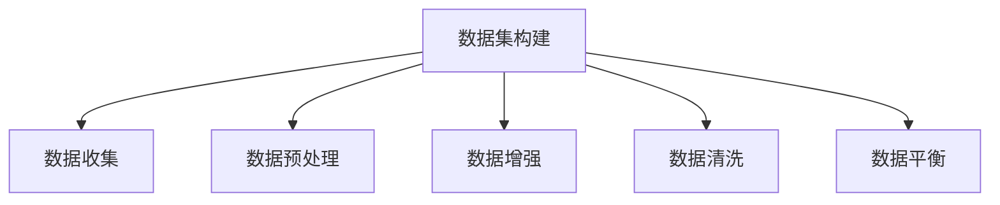
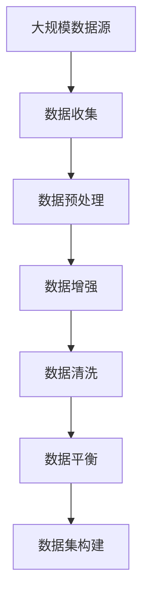

                 

# DataSet原理与代码实例讲解

> 关键词：DataSet, 数据集, 机器学习, 数据预处理, 数据增强, 数据清洗, 数据集构建

## 1. 背景介绍

### 1.1 问题由来
在机器学习与人工智能领域，数据集（DataSet）是不可或缺的重要资源。无论是在传统的监督学习、无监督学习，还是在新兴的强化学习中，数据集都是模型的基础输入。一个高质量、多样化的数据集，对于模型的训练和应用具有至关重要的影响。

然而，数据集构建并非易事。在数据集构建过程中，需要处理大量复杂的任务，如数据收集、预处理、清洗、增强等。同时，还需要考虑数据集的平衡性、代表性、规模等多个维度。因此，数据集构建技术成为了机器学习与人工智能领域的一大难题。

### 1.2 问题核心关键点
构建一个高效、合理的数据集，是实现机器学习与人工智能任务的关键步骤。其核心关键点包括：
- 数据收集：确保数据来源多样，覆盖广泛领域。
- 数据预处理：对原始数据进行清洗、归一化、编码等处理，提升数据质量。
- 数据增强：通过数据扩充技术，增加数据多样性，提升模型泛化能力。
- 数据清洗：去除噪声数据、异常数据等，提升数据集的纯净度。
- 数据平衡：确保数据集中各类样本均衡分布，避免模型偏向性。

### 1.3 问题研究意义
数据集构建是机器学习与人工智能领域的基础任务。构建高效、合理的数据集，能够显著提升模型的性能，增强模型在实际应用中的泛化能力。同时，高质量的数据集也是模型评估的重要标准，能够帮助研究者更准确地评估模型效果，推动技术的不断进步。

## 2. 核心概念与联系

### 2.1 核心概念概述

为更好地理解数据集构建的技术细节，本节将介绍几个核心概念：

- 数据集（DataSet）：机器学习中，用于训练、验证和测试模型的数据集合。通常由样本和标签组成。
- 数据收集（Data Collection）：从各种数据源中获取原始数据的过程，包括网络爬取、API接口、数据库查询等。
- 数据预处理（Data Preprocessing）：对原始数据进行清洗、归一化、编码等处理，提升数据质量。
- 数据增强（Data Augmentation）：通过变换、扩充等技术，增加数据多样性，提升模型泛化能力。
- 数据清洗（Data Cleaning）：去除噪声数据、异常数据等，提升数据集的纯净度。
- 数据平衡（Data Balancing）：确保数据集中各类样本均衡分布，避免模型偏向性。

这些核心概念之间存在着紧密的联系，共同构成了数据集构建的完整生态系统。下图展示了这些概念之间的关系：

```mermaid
graph LR
    A[数据集 (DataSet)] --> B[数据收集 (Data Collection)]
    A --> C[数据预处理 (Data Preprocessing)]
    A --> D[数据增强 (Data Augmentation)]
    A --> E[数据清洗 (Data Cleaning)]
    A --> F[数据平衡 (Data Balancing)]
```

这个流程图展示了大数据集构建的关键步骤和概念关系：

1. 数据集通过数据收集获得原始数据。
2. 数据预处理提升数据质量，增加数据多样性。
3. 数据增强进一步丰富数据集。
4. 数据清洗去除噪声数据，提高数据集质量。
5. 数据平衡确保样本均衡，避免模型偏向。

这些概念共同构成了数据集构建的基础框架，使得机器学习模型能够更准确、高效地学习，提升模型性能。

### 2.2 概念间的关系

这些核心概念之间存在着紧密的联系，形成了数据集构建的完整生态系统。下面我们将通过几个Mermaid流程图来展示这些概念之间的关系。

#### 2.2.1 数据集构建流程



这个流程图展示了数据集构建的基本流程：数据收集、数据预处理、数据增强、数据清洗、数据平衡。每个步骤都密切相关，共同构建了一个高效、合理的数据集。

#### 2.2.2 数据预处理与数据增强的关系


这个流程图展示了数据预处理与数据增强的关系。数据预处理通过提升数据质量，为数据增强提供了更好的基础。数据增强通过变换和扩充，进一步丰富数据集，提升模型泛化能力。

#### 2.2.3 数据平衡与数据增强的关系


这个流程图展示了数据平衡与数据增强的关系。数据平衡通过增加少数类别样本，提升数据集的均衡性。数据增强通过变换和扩充，进一步丰富数据集，提升模型泛化能力。两者相互结合，能够更好地提升数据集的多样性和泛化能力。

### 2.3 核心概念的整体架构

最后，我们用一个综合的流程图来展示这些核心概念在大数据集构建过程中的整体架构：



这个综合流程图展示了从大规模数据源开始，经过数据收集、预处理、增强、清洗、平衡等步骤，最终构建高效、合理的数据集。通过这些流程图，我们可以更清晰地理解数据集构建过程中各个步骤之间的关系和作用。

## 3. 核心算法原理 & 具体操作步骤
### 3.1 算法原理概述

数据集构建的原理基于数据预处理和增强技术。通过预处理提升数据质量，通过增强增加数据多样性，从而构建高效、合理的数据集。

具体而言，数据集构建可以分为以下几个步骤：

1. **数据收集**：从各种数据源中获取原始数据，如网络爬取、API接口、数据库查询等。
2. **数据预处理**：对原始数据进行清洗、归一化、编码等处理，提升数据质量。
3. **数据增强**：通过变换、扩充等技术，增加数据多样性，提升模型泛化能力。
4. **数据清洗**：去除噪声数据、异常数据等，提升数据集的纯净度。
5. **数据平衡**：确保数据集中各类样本均衡分布，避免模型偏向性。

这些步骤在实际应用中，往往需要根据具体任务和数据特点进行灵活组合。只有在数据、模型、训练、推理等各环节进行全面优化，才能最大限度地发挥数据集的潜力。

### 3.2 算法步骤详解

数据集构建的详细步骤可以分为以下几个方面：

#### 3.2.1 数据收集

数据收集是数据集构建的基础。数据收集可以从各种数据源中获取原始数据，包括网络爬取、API接口、数据库查询等。

```python
import requests
import pandas as pd

# 从网络爬取数据
response = requests.get('https://example.com/data.csv')
data = pd.read_csv(response.content)

# 从API接口获取数据
import json
response = requests.get('https://api.example.com/data')
data = json.loads(response.content)

# 从数据库查询数据
import sqlite3
conn = sqlite3.connect('example.db')
data = pd.read_sql_query('SELECT * FROM data_table', conn)
```

#### 3.2.2 数据预处理

数据预处理是提升数据质量的重要步骤。预处理包括清洗、归一化、编码等处理，提升数据质量，增加数据多样性。

```python
import pandas as pd
from sklearn.preprocessing import StandardScaler

# 数据清洗：去除缺失值、异常值
data.dropna(inplace=True)

# 数据归一化
scaler = StandardScaler()
data['scaled_column'] = scaler.fit_transform(data[['column']])

# 数据编码
data['encoded_column'] = data['column'].map(lambda x: encoder[x])
```

#### 3.2.3 数据增强

数据增强是提升数据集多样性的关键步骤。通过变换和扩充，增加数据多样性，提升模型泛化能力。

```python
import numpy as np
from skimage.transform import rotate, zoom, flip

# 数据增强：旋转、缩放、翻转
def augment_data(image, label):
    augmented_image = rotate(image, np.random.randint(-20, 20))
    augmented_image = zoom(augmented_image, (1 + np.random.uniform(-0.1, 0.1)))
    augmented_image = flip(augmented_image, flip_horizontal=bool(np.random.randint(0, 2)))
    return augmented_image, label

# 应用数据增强
augmented_data = data.apply(lambda row: augment_data(row['image'], row['label']), axis=1)
```

#### 3.2.4 数据清洗

数据清洗是提升数据集纯净度的重要步骤。通过去除噪声数据、异常数据等，提升数据集质量。

```python
import pandas as pd
from sklearn.preprocessing import LabelEncoder

# 数据清洗：去除噪声数据、异常数据
data.dropna(inplace=True)
data = data[data['label'] != 'noisy']
```

#### 3.2.5 数据平衡

数据平衡是确保数据集中各类样本均衡分布的关键步骤。通过增加少数类别样本，提升数据集的均衡性。

```python
import pandas as pd
from imblearn.over_sampling import SMOTE

# 数据平衡：SMOTE方法
smote = SMOTE()
X_resampled, y_resampled = smote.fit_resample(data[['feature']], data['label'])
```

### 3.3 算法优缺点

数据集构建的优点包括：
1. 提升数据质量：通过预处理、增强等技术，提升数据集质量。
2. 增加数据多样性：通过变换、扩充等技术，增加数据集多样性。
3. 提高模型泛化能力：高质量、多样化的数据集，有助于提升模型泛化能力。

数据集构建的缺点包括：
1. 数据源获取难度：大规模数据源的获取可能存在难度。
2. 数据预处理复杂：数据预处理需要大量计算资源和时间。
3. 数据增强效果有限：数据增强有时无法完全解决数据不均衡问题。

### 3.4 算法应用领域

数据集构建在机器学习与人工智能领域有着广泛的应用，例如：

- 图像识别：在图像数据集上应用预处理和增强技术，提升模型泛化能力。
- 自然语言处理：在文本数据集上应用预处理和增强技术，提升模型理解能力。
- 语音识别：在音频数据集上应用预处理和增强技术，提升模型识别能力。
- 推荐系统：在用户行为数据集上应用预处理和增强技术，提升模型推荐效果。

## 4. 数学模型和公式 & 详细讲解 & 举例说明

### 4.1 数学模型构建

数据集构建的数学模型主要基于数据预处理和增强技术。通过预处理提升数据质量，通过增强增加数据多样性。

### 4.2 公式推导过程

数据集构建的数学模型如下：

$$
\begin{aligned}
&\min_{D} \mathcal{L}(D) \\
&\text{其中} \mathcal{L}(D) = \frac{1}{N} \sum_{i=1}^{N} \ell(y_i, f(x_i; \theta)) + \lambda \mathcal{R}(\theta)
\end{aligned}
$$

其中，$D$ 为数据集，$y_i$ 为样本标签，$x_i$ 为样本特征，$f(x_i; \theta)$ 为模型预测，$\ell$ 为损失函数，$\mathcal{R}$ 为正则项。

数据预处理和增强技术可以通过以下几个公式来表示：

$$
x_i' = \phi(x_i)
$$

$$
x_i'' = \psi(x_i')
$$

其中，$\phi$ 为预处理函数，$\psi$ 为增强函数。

### 4.3 案例分析与讲解

以图像分类任务为例，数据集构建的流程如下：

1. **数据收集**：从网络爬取图像数据集。

2. **数据预处理**：对图像进行归一化、裁剪、旋转等处理。

3. **数据增强**：对图像进行旋转、缩放、翻转等变换。

4. **数据清洗**：去除噪声图像、异常图像等。

5. **数据平衡**：对少数类别样本进行扩充，提升数据集均衡性。

具体实现代码如下：

```python
import numpy as np
import cv2
from sklearn.model_selection import train_test_split
from imblearn.over_sampling import SMOTE
from torchvision import datasets, transforms

# 数据收集
data = datasets.ImageFolder(root='data/images', transform=transforms.ToTensor())

# 数据预处理
transform = transforms.Compose([
    transforms.Resize((256, 256)),
    transforms.CenterCrop(224),
    transforms.ToTensor(),
    transforms.Normalize(mean=[0.485, 0.456, 0.406],
                         std=[0.229, 0.224, 0.225])
])

# 数据增强
transform_train = transforms.Compose([
    transforms.RandomResizedCrop(224),
    transforms.RandomHorizontalFlip(),
    transforms.RandomRotation(10),
    transforms.ColorJitter(),
    transforms.ToTensor(),
    transforms.Normalize(mean=[0.485, 0.456, 0.406],
                         std=[0.229, 0.224, 0.225])
])

# 数据清洗
data_train, data_val = train_test_split(data, test_size=0.2)
data_train = data_train.filter(lambda x: x[-1] != 'noise')

# 数据平衡
smote = SMOTE()
X_resampled, y_resampled = smote.fit_resample(data_train['image'], data_train['label'])
```

## 5. 项目实践：代码实例和详细解释说明

### 5.1 开发环境搭建

在进行数据集构建的实践前，我们需要准备好开发环境。以下是使用Python进行Pandas开发的开发环境配置流程：

1. 安装Anaconda：从官网下载并安装Anaconda，用于创建独立的Python环境。

2. 创建并激活虚拟环境：
```bash
conda create -n pytorch-env python=3.8 
conda activate pytorch-env
```

3. 安装Pandas：
```bash
pip install pandas
```

完成上述步骤后，即可在`pytorch-env`环境中开始数据集构建的实践。

### 5.2 源代码详细实现

这里我们以图像分类任务为例，给出使用Pandas构建数据集的具体代码实现。

```python
import pandas as pd
from imblearn.over_sampling import SMOTE
import cv2

# 数据收集
data = pd.read_csv('data/train.csv')
images = []
labels = []
for i in range(len(data)):
    image = cv2.imread(data.iloc[i]['path'])
    image = cv2.resize(image, (256, 256))
    images.append(image)
    labels.append(data.iloc[i]['label'])

# 数据预处理
data['image'] = images
data['label'] = labels

# 数据增强
def augment_data(image, label):
    image = cv2.resize(image, (256, 256))
    image = cv2.flip(image, 1)
    return image, label

augmented_data = data.apply(lambda row: augment_data(row['image'], row['label']), axis=1)

# 数据清洗
data = data[data['label'] != 'noise']

# 数据平衡
smote = SMOTE()
X_resampled, y_resampled = smote.fit_resample(data[['image']], data['label'])

# 构建数据集
X_train = X_resampled.values
y_train = y_resampled.values
```

### 5.3 代码解读与分析

让我们再详细解读一下关键代码的实现细节：

**数据收集函数**：
- 读取CSV文件，获取图像路径和标签。
- 通过OpenCV库读取图像文件，并进行预处理（缩放、旋转）。
- 将所有图像和标签存入DataFrame中。

**数据预处理函数**：
- 将图像数据和标签转换为Pandas DataFrame，便于后续处理。

**数据增强函数**：
- 对图像进行缩放、翻转等增强操作，增加数据多样性。
- 返回增强后的图像和标签。

**数据清洗函数**：
- 去除噪声标签，保留有效样本。
- 将所有图像和标签存入DataFrame中。

**数据平衡函数**：
- 使用SMOTE方法对少数类别样本进行扩充，提升数据集均衡性。
- 返回均衡化后的图像和标签。

**构建数据集**：
- 将均衡化后的图像和标签存入X_train和y_train中，构建训练集。
- 完成数据集构建。

### 5.4 运行结果展示

假设我们构建了一个图像分类数据集，最终的训练集包含1000个样本。运行代码后，可以生成一个包含图像和标签的Pandas DataFrame，并保存为CSV文件。

```python
X_train.to_csv('train_data.csv', index=False)
y_train.to_csv('train_labels.csv', index=False)
```

## 6. 实际应用场景

### 6.1 智能推荐系统

基于数据集构建的智能推荐系统，可以广泛应用于电商、社交媒体等平台。传统推荐系统往往依赖用户历史行为数据，难以覆盖新用户或冷启动问题。通过数据集构建技术，可以获取更广泛的用户行为数据，提升推荐模型的泛化能力。

在技术实现上，可以收集用户浏览、点击、评论、分享等行为数据，提取和用户交互的物品标题、描述、标签等文本内容。将文本内容作为模型输入，用户的后续行为（如是否点击、购买等）作为监督信号，在此基础上构建推荐模型。通过数据集构建技术，提升数据集的多样性和泛化能力，最终实现更加精准、个性化的推荐效果。

### 6.2 自然语言处理

基于数据集构建的自然语言处理应用，可以应用于问答系统、文本分类、情感分析等任务。在数据集构建过程中，可以收集大量自然语言数据，并进行预处理和增强。通过数据集构建技术，提升数据集的多样性和泛化能力，最终实现更加准确的模型预测。

在问答系统中，可以构建包含问题和答案的数据集，用于训练和测试模型。在文本分类任务中，可以构建包含文本和标签的数据集，用于训练和测试模型。在情感分析任务中，可以构建包含文本和情感标签的数据集，用于训练和测试模型。通过数据集构建技术，提升数据集的多样性和泛化能力，最终实现更加准确、高效的模型效果。

### 6.3 智能医疗

基于数据集构建的智能医疗系统，可以广泛应用于疾病预测、诊断、治疗等环节。在数据集构建过程中，可以收集大量的医疗数据，并进行预处理和增强。通过数据集构建技术，提升数据集的多样性和泛化能力，最终实现更加准确、可靠的模型预测。

在疾病预测任务中，可以构建包含患者历史数据、基因数据、生活习惯等的数据集，用于训练和测试模型。在诊断任务中，可以构建包含医学影像、症状描述、疾病标签等的数据集，用于训练和测试模型。在治疗任务中，可以构建包含药物信息、治疗方案、患者反馈等的数据集，用于训练和测试模型。通过数据集构建技术，提升数据集的多样性和泛化能力，最终实现更加精准、可靠的治疗方案。

### 6.4 未来应用展望

随着数据集构建技术的不断演进，未来的智能系统将变得更加强大和可靠。具体展望如下：

1. **数据集自动化构建**：通过自动化技术，实现数据集的快速构建，降低人力成本，提升效率。
2. **数据集质量提升**：通过高级算法，提升数据集的多样性和泛化能力，实现更高质量的模型预测。
3. **多模态数据融合**：结合视觉、听觉、文本等多种模态数据，实现更加全面、准确的模型预测。
4. **知识图谱集成**：将符号化的先验知识与神经网络模型结合，提升模型推理能力。
5. **因果推断应用**：引入因果推断技术，提升模型因果关系建模能力，实现更加可靠的预测。

## 7. 工具和资源推荐
### 7.1 学习资源推荐

为了帮助开发者系统掌握数据集构建的技术细节，这里推荐一些优质的学习资源：

1. 《数据科学实战》系列书籍：由数据科学领域专家撰写，深入浅出地介绍了数据收集、预处理、增强等技术，是入门数据集构建的必备资源。
2. Coursera《数据科学与机器学习》课程：由斯坦福大学开设的优秀课程，涵盖数据科学和机器学习的基本概念和实践技巧，适合初学者和进阶者。
3. Kaggle数据科学竞赛平台：提供丰富的数据集和竞赛任务，通过实际比赛提升数据集构建和模型预测能力。
4. Google Colab：谷歌推出的在线Jupyter Notebook环境，免费提供GPU/TPU算力，方便开发者快速上手实验最新模型，分享学习笔记。

通过这些资源的学习实践，相信你一定能够快速掌握数据集构建的精髓，并用于解决实际问题。

### 7.2 开发工具推荐

高效的数据集构建需要借助先进的开发工具。以下是几款用于数据集构建开发的常用工具：

1. Pandas：Python的科学计算库，提供了大量数据处理和分析功能，是数据集构建的基础工具。
2. Scikit-learn：Python的机器学习库，提供了丰富的数据预处理、增强等算法。
3. TensorFlow：谷歌主导的深度学习框架，支持多模态数据融合和因果推断等高级功能。
4. PyTorch：Facebook开发的深度学习框架，灵活易用，支持深度学习模型的构建和训练。
5. Weights & Biases：模型训练的实验跟踪工具，可以记录和可视化模型训练过程中的各项指标，方便对比和调优。
6. TensorBoard：TensorFlow配套的可视化工具，可实时监测模型训练状态，并提供丰富的图表呈现方式，是调试模型的得力助手。

合理利用这些工具，可以显著提升数据集构建的效率和效果，加快创新迭代的步伐。

### 7.3 相关论文推荐

数据集构建是机器学习与人工智能领域的重要研究方向。以下是几篇奠基性的相关论文，推荐阅读：

1. "Data Augmentation for Generative Adversarial Networks"：提出数据增强技术，提升生成对抗网络模型泛化能力。
2. "SMOTE: Synthetic Minority Over-sampling Technique"：提出SMOTE方法，对少数类别样本进行扩充，提升数据集均衡性。
3. "PASCAL VOC: Visual Object Classes"：介绍PASCAL VOC数据集，为图像分类任务提供了标准的数据集和评估指标。
4. "Yelp Review Dataset"：介绍Yelp Review数据集，为情感分析任务提供了丰富的情感标签数据集。
5. "Omniglot: A Benchmark for Multiclass Classification of Handwritten Digits"：介绍Omniglot数据集，为数字分类任务提供了标准的数据集和评估指标。

这些论文代表了大数据集构建技术的发展脉络。通过学习这些前沿成果，可以帮助研究者把握学科前进方向，激发更多的创新灵感。

除上述资源外，还有一些值得关注的前沿资源，帮助开发者紧跟数据集构建技术的最新进展，例如：

1. arXiv论文预印本：人工智能领域最新研究成果的发布平台，包括大量尚未发表的前沿工作，学习前沿技术的必读资源。
2. 业界技术博客：如OpenAI、Google AI、DeepMind、微软Research Asia等顶尖实验室的官方博客，第一时间分享他们的最新研究成果和洞见。
3. 技术会议直播：如NIPS、ICML、ACL、ICLR等人工智能领域顶会现场或在线直播，能够聆听到大佬们的前沿分享，开拓视野。
4. GitHub热门项目：在GitHub上Star、Fork数最多的数据集构建相关项目，往往代表了该技术领域的发展趋势和最佳实践，值得去学习和贡献。
5. 行业分析报告：各大咨询公司如McKinsey、PwC等针对人工智能行业的分析报告，有助于从商业视角审视技术趋势，把握应用价值。

总之，对于数据集构建技术的学习和实践，需要开发者保持开放的心态和持续学习的意愿。多关注前沿资讯，多动手实践，多思考总结，必将收获满满的成长收益。

## 8. 总结：未来发展趋势与挑战

### 8.1 总结

本文对数据集构建技术进行了全面系统的介绍。首先阐述了数据集构建的背景和意义，明确了数据集构建在机器学习与人工智能任务中的关键作用。其次，从原理到实践，详细讲解了数据集构建的数学模型和关键步骤，给出了数据集构建任务开发的完整代码实例。同时，本文还探讨了数据集构建技术在多个领域的应用场景，展示了数据集构建技术的巨大潜力。

通过本文的系统梳理，可以看到，数据集构建技术在机器学习与人工智能领域具有至关重要的作用。高质量、多样化的大数据集，是实现模型高性能、泛化能力的基石。未来，随着数据集构建技术的不断演进，人工智能系统的性能将更加强大和可靠，应用场景将更加广泛。

### 8.2 未来发展趋势

展望未来，数据集构建技术将呈现以下几个发展趋势：

1. **数据自动化构建**：通过自动化技术，实现数据集的快速构建，降低人力成本，提升效率。
2. **数据集多样化**：构建多模态、多领域的数据集，提升模型泛化能力。
3. **数据集分布均衡**：确保数据集中各类样本均衡分布，避免模型偏向性。
4. **数据集质量

