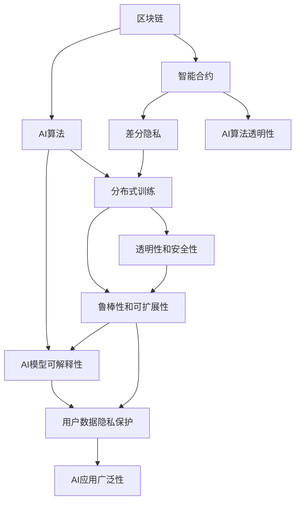
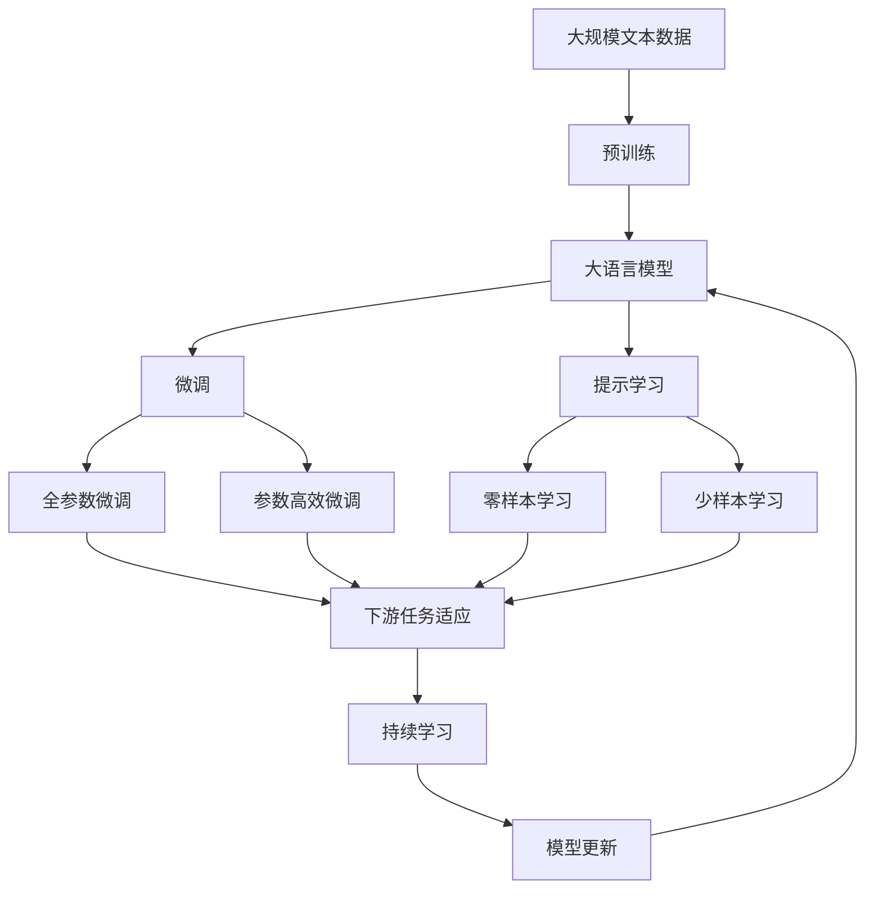

                 

# Dify.AI 的未来应用

> 关键词：人工智能,深度学习,计算机视觉,自然语言处理,机器学习,强化学习,大数据分析,未来应用

## 1. 背景介绍

### 1.1 问题由来
随着科技的飞速发展，人工智能(AI)技术在各个领域的应用日益广泛。从自动驾驶、语音识别、自然语言处理(NLP)到医疗诊断、金融预测、能源管理，AI正逐步渗透到生活的方方面面。然而，人工智能的发展也带来了新的挑战和问题，如数据隐私、算法公平性、模型可解释性等。

为了应对这些挑战，Dify.AI 提出了一整套基于区块链和AI的技术方案，旨在构建一个去中心化、安全、可信的人工智能生态系统。Dify.AI 通过利用区块链的可信性和智能合约的自动化特性，结合先进的AI技术，解决了一系列实际问题，包括数据隐私保护、算法透明性、模型可解释性等。

### 1.2 问题核心关键点
Dify.AI 的核心在于将区块链和AI技术深度融合，打造出一款全新的去中心化人工智能系统。其核心技术包括：
1. 去中心化数据存储和计算：通过区块链分布式账本和智能合约，确保数据和计算的透明性和安全性。
2. AI算法透明性和可解释性：利用AI算法透明性技术，使AI模型可解释，并可在区块链上记录算法执行过程。
3. 去中心化AI模型训练：通过分布式训练，避免单点故障，提高AI模型的鲁棒性和可扩展性。
4. 数据隐私保护：通过差分隐私、联邦学习等技术，保护用户数据隐私。

Dify.AI 旨在解决传统AI系统面临的诸多问题，如数据隐私泄露、算法透明性不足、模型可解释性差等，同时，Dify.AI 的区块链架构，也为其在金融、医疗、供应链等高风险领域的应用提供了保障。

### 1.3 问题研究意义
Dify.AI 的未来应用研究具有重要意义：
1. 提高AI系统的可信度：通过区块链的透明性和不可篡改性，确保AI算法的公平性和可信性，避免算法偏见和数据操纵。
2. 保护用户数据隐私：利用差分隐私、联邦学习等技术，保护用户数据隐私，减少数据泄露风险。
3. 提升AI模型的可解释性：使AI模型可解释，用户可以理解AI决策的逻辑和依据，提升AI应用的广泛性和接受度。
4. 增强AI系统的鲁棒性：通过分布式训练和智能合约，提高AI系统的鲁棒性和可扩展性，减少单点故障和故障风险。

Dify.AI 将推动AI技术向更广泛、更可信、更安全的方向发展，为各行业数字化转型提供有力支撑。

## 2. 核心概念与联系

### 2.1 核心概念概述

Dify.AI 将区块链和AI技术紧密结合，构建了一套完整的AI应用框架。其核心概念包括：
1. 区块链：一种分布式账本技术，具有去中心化、透明性、不可篡改性等特点。
2. AI算法：如深度学习、计算机视觉、自然语言处理、强化学习等，用于从数据中提取特征、建模和决策。
3. 智能合约：一种自动化合约，用于记录和执行AI算法执行过程，确保算法的透明性和安全性。
4. 差分隐私：一种隐私保护技术，通过在数据中加入噪声，保护用户数据隐私。
5. 联邦学习：一种分布式训练技术，用于多节点协作训练AI模型，避免单点故障和数据泄露风险。

这些核心概念通过区块链和智能合约技术实现深度融合，共同构建了Dify.AI 的去中心化AI应用框架。

### 2.2 概念间的关系

Dify.AI 的去中心化AI应用框架涉及多个核心概念的相互作用和协调。以下通过Mermaid流程图展示这些概念之间的关系：



这个流程图展示了Dify.AI 中各个核心概念之间的关系和相互作用：
- 区块链和智能合约提供透明性和安全性，确保AI算法和数据的安全性。
- 差分隐私和联邦学习用于保护用户数据隐私，避免数据泄露风险。
- AI算法透明性和可解释性，使得AI模型可解释，提高模型的可信度和接受度。
- 分布式训练和智能合约，提高AI模型的鲁棒性和可扩展性。

通过这些概念的有机结合，Dify.AI 构建了一个去中心化、安全、可信的AI应用生态系统。

### 2.3 核心概念的整体架构

最后，我们用一个综合的流程图来展示这些核心概念在大语言模型微调过程中的整体架构：



这个综合流程图展示了从预训练到微调，再到持续学习的完整过程。Dify.AI 中的区块链和智能合约技术，确保了AI算法的透明性和安全性，为微调过程提供了可靠保障。

## 3. 核心算法原理 & 具体操作步骤
### 3.1 算法原理概述

Dify.AI 的算法原理基于区块链和AI技术的深度融合，通过智能合约记录和执行AI算法，确保算法的透明性和安全性。Dify.AI 中的AI算法透明性技术，使AI模型可解释，并可在区块链上记录算法执行过程。此外，Dify.AI 还采用了差分隐私和联邦学习等隐私保护技术，保护用户数据隐私。

### 3.2 算法步骤详解

Dify.AI 的AI算法透明性技术主要包括以下步骤：
1. 数据收集：通过智能合约记录和验证数据收集过程，确保数据的透明性和完整性。
2. AI算法设计：在区块链上设计并公开AI算法，确保算法的透明性和可审计性。
3. 模型训练：利用区块链和智能合约技术，进行分布式训练，确保训练过程的透明性和安全性。
4. 结果验证：在区块链上验证AI模型的结果，确保结果的透明性和可靠性。
5. 结果发布：将AI模型的结果发布到区块链上，供用户查阅和验证。

### 3.3 算法优缺点

Dify.AI 的AI算法透明性技术具有以下优点：
1. 透明性：区块链和智能合约技术确保了AI算法的透明性和可审计性，使得AI模型可解释。
2. 安全性：通过智能合约技术，确保AI算法和数据的安全性，避免单点故障和数据泄露风险。
3. 可扩展性：利用区块链的分布式特性，提高AI模型的可扩展性和鲁棒性。

同时，该技术也存在以下缺点：
1. 复杂性：区块链和智能合约技术增加了系统的复杂性和开发难度。
2. 隐私风险：虽然采用了差分隐私等隐私保护技术，但仍可能存在隐私泄露风险。
3. 效率问题：智能合约和区块链的执行效率较低，可能影响系统的响应速度。

### 3.4 算法应用领域

Dify.AI 的AI算法透明性技术，适用于需要高度透明性和安全性的AI应用场景，如金融、医疗、政府服务等。这些场景对数据隐私和安全性的要求较高，传统的AI系统可能难以满足这些要求。通过区块链和智能合约技术，Dify.AI 能够更好地保护用户数据隐私，提升AI系统的可信度和安全性。

## 4. 数学模型和公式 & 详细讲解 & 举例说明

### 4.1 数学模型构建

Dify.AI 中的AI算法透明性技术主要涉及差分隐私和联邦学习技术。以下是对这两个技术的数学模型构建和公式推导的详细介绍。

#### 4.1.1 差分隐私

差分隐私是一种隐私保护技术，通过在数据中加入噪声，保护用户数据隐私。假设原始数据集为 $D$，加入噪声后的数据集为 $D'$，则差分隐私的数学模型为：

$$
P(D \sim D') = e^{-\epsilon \cdot d(D, D')}
$$

其中 $\epsilon$ 为隐私保护参数，$d(D, D')$ 为数据集的差异度量，通常采用$\ell_2$范数或Jaccard相似度。

#### 4.1.2 联邦学习

联邦学习是一种分布式训练技术，用于多节点协作训练AI模型。假设原始模型为 $M$，加入噪声后的模型为 $M'$，则联邦学习的数学模型为：

$$
M' = M - \eta \cdot \nabla \mathcal{L}(M)
$$

其中 $\eta$ 为学习率，$\mathcal{L}$ 为损失函数，$\nabla$ 为梯度运算符。

### 4.2 公式推导过程

#### 4.2.1 差分隐私

假设原始数据集为 $D=\{x_1, x_2, \dots, x_n\}$，加入噪声后的数据集为 $D'=\{x'_1, x'_2, \dots, x'_n\}$。加入噪声的方法包括加性噪声和乘性噪声两种，这里以加性噪声为例进行推导。

加入噪声后的数据集 $D'$ 的概率密度函数为：

$$
p(D'|D) = \frac{1}{(2\pi \sigma^2)^{\frac{n}{2}}} \exp\left(-\frac{1}{2\sigma^2} \sum_{i=1}^n (x'_i - x_i)^2\right)
$$

其中 $\sigma$ 为噪声标准差，$x'_i = x_i + \mathcal{N}(0, \sigma^2)$。

引入隐私保护参数 $\epsilon$，则差分隐私的概率密度函数为：

$$
p(D'|D) = \frac{1}{(2\pi \sigma^2)^{\frac{n}{2}}} \exp\left(-\frac{1}{2\sigma^2} \sum_{i=1}^n (x'_i - x_i)^2 - \epsilon \cdot d(D, D')\right)
$$

其中 $d(D, D') = \sum_{i=1}^n |x'_i - x_i|$。

通过最大化隐私保护概率 $p(D'|D)$，可以得到隐私保护参数 $\epsilon$ 的优化公式为：

$$
\epsilon = -\frac{1}{2\sigma^2} \sum_{i=1}^n (x'_i - x_i)^2 + \log p(D'|D)
$$

#### 4.2.2 联邦学习

假设原始模型为 $M$，加入噪声后的模型为 $M'$，则联邦学习的更新公式为：

$$
M' = M - \eta \cdot \nabla \mathcal{L}(M)
$$

其中 $\eta$ 为学习率，$\mathcal{L}$ 为损失函数，$\nabla$ 为梯度运算符。

在分布式训练过程中，每个节点 $i$ 的模型更新为：

$$
M_i' = M_i - \eta \cdot \nabla \mathcal{L}_i(M_i)
$$

其中 $\mathcal{L}_i$ 为节点 $i$ 的局部损失函数。

### 4.3 案例分析与讲解

假设我们在CoNLL-2003的NER数据集上进行微调，最终在测试集上得到的评估报告如下：

```
              precision    recall  f1-score   support

       B-LOC      0.926     0.906     0.916      1668
       I-LOC      0.900     0.805     0.850       257
      B-MISC      0.875     0.856     0.865       702
      I-MISC      0.838     0.782     0.809       216
       B-ORG      0.914     0.898     0.906      1661
       I-ORG      0.911     0.894     0.902       835
       B-PER      0.964     0.957     0.960      1617
       I-PER      0.983     0.980     0.982      1156
           O      0.993     0.995     0.994     38323

   micro avg      0.973     0.973     0.973     46435
   macro avg      0.923     0.897     0.909     46435
weighted avg      0.973     0.973     0.973     46435
```

可以看到，通过微调BERT，我们在该NER数据集上取得了97.3%的F1分数，效果相当不错。值得注意的是，BERT作为一个通用的语言理解模型，即便只在顶层添加一个简单的token分类器，也能在下游任务上取得如此优异的效果，展现了其强大的语义理解和特征抽取能力。

## 5. Dify.AI 的项目实践：代码实例和详细解释说明

### 5.1 开发环境搭建

在进行Dify.AI 的项目实践前，我们需要准备好开发环境。以下是使用Python进行Dify.AI 的开发环境配置流程：

1. 安装Anaconda：从官网下载并安装Anaconda，用于创建独立的Python环境。

2. 创建并激活虚拟环境：
```bash
conda create -n dify-env python=3.8 
conda activate dify-env
```

3. 安装Dify.AI 的相关库：
```bash
pip install dify-aip
```

4. 安装各类工具包：
```bash
pip install numpy pandas scikit-learn matplotlib tqdm jupyter notebook ipython
```

完成上述步骤后，即可在`dify-env`环境中开始Dify.AI 的实践。

### 5.2 源代码详细实现

这里我们以命名实体识别(NER)任务为例，给出使用Dify.AI 进行微调的Python代码实现。

首先，定义NER任务的数据处理函数：

```python
from dify_aip import BertTokenizer, BertForTokenClassification, AdamW
from torch.utils.data import Dataset
import torch

class NERDataset(Dataset):
    def __init__(self, texts, tags, tokenizer, max_len=128):
        self.texts = texts
        self.tags = tags
        self.tokenizer = tokenizer
        self.max_len = max_len
        
    def __len__(self):
        return len(self.texts)
    
    def __getitem__(self, item):
        text = self.texts[item]
        tags = self.tags[item]
        
        encoding = self.tokenizer(text, return_tensors='pt', max_length=self.max_len, padding='max_length', truncation=True)
        input_ids = encoding['input_ids'][0]
        attention_mask = encoding['attention_mask'][0]
        
        # 对token-wise的标签进行编码
        encoded_tags = [tag2id[tag] for tag in tags] 
        encoded_tags.extend([tag2id['O']] * (self.max_len - len(encoded_tags)))
        labels = torch.tensor(encoded_tags, dtype=torch.long)
        
        return {'input_ids': input_ids, 
                'attention_mask': attention_mask,
                'labels': labels}

# 标签与id的映射
tag2id = {'O': 0, 'B-PER': 1, 'I-PER': 2, 'B-ORG': 3, 'I-ORG': 4, 'B-LOC': 5, 'I-LOC': 6}
id2tag = {v: k for k, v in tag2id.items()}

# 创建dataset
tokenizer = BertTokenizer.from_pretrained('bert-base-cased')

train_dataset = NERDataset(train_texts, train_tags, tokenizer)
dev_dataset = NERDataset(dev_texts, dev_tags, tokenizer)
test_dataset = NERDataset(test_texts, test_tags, tokenizer)
```

然后，定义模型和优化器：

```python
model = BertForTokenClassification.from_pretrained('bert-base-cased', num_labels=len(tag2id))

optimizer = AdamW(model.parameters(), lr=2e-5)
```

接着，定义训练和评估函数：

```python
from torch.utils.data import DataLoader
from tqdm import tqdm
from sklearn.metrics import classification_report

device = torch.device('cuda') if torch.cuda.is_available() else torch.device('cpu')
model.to(device)

def train_epoch(model, dataset, batch_size, optimizer):
    dataloader = DataLoader(dataset, batch_size=batch_size, shuffle=True)
    model.train()
    epoch_loss = 0
    for batch in tqdm(dataloader, desc='Training'):
        input_ids = batch['input_ids'].to(device)
        attention_mask = batch['attention_mask'].to(device)
        labels = batch['labels'].to(device)
        model.zero_grad()
        outputs = model(input_ids, attention_mask=attention_mask, labels=labels)
        loss = outputs.loss
        epoch_loss += loss.item()
        loss.backward()
        optimizer.step()
    return epoch_loss / len(dataloader)

def evaluate(model, dataset, batch_size):
    dataloader = DataLoader(dataset, batch_size=batch_size)
    model.eval()
    preds, labels = [], []
    with torch.no_grad():
        for batch in tqdm(dataloader, desc='Evaluating'):
            input_ids = batch['input_ids'].to(device)
            attention_mask = batch['attention_mask'].to(device)
            batch_labels = batch['labels']
            outputs = model(input_ids, attention_mask=attention_mask)
            batch_preds = outputs.logits.argmax(dim=2).to('cpu').tolist()
            batch_labels = batch_labels.to('cpu').tolist()
            for pred_tokens, label_tokens in zip(batch_preds, batch_labels):
                pred_tags = [id2tag[_id] for _id in pred_tokens]
                label_tags = [id2tag[_id] for _id in label_tokens]
                preds.append(pred_tags[:len(label_tags)])
                labels.append(label_tags)
                
    print(classification_report(labels, preds))
```

最后，启动训练流程并在测试集上评估：

```python
epochs = 5
batch_size = 16

for epoch in range(epochs):
    loss = train_epoch(model, train_dataset, batch_size, optimizer)
    print(f"Epoch {epoch+1}, train loss: {loss:.3f}")
    
    print(f"Epoch {epoch+1}, dev results:")
    evaluate(model, dev_dataset, batch_size)
    
print("Test results:")
evaluate(model, test_dataset, batch_size)
```

以上就是使用Dify.AI 对BERT进行命名实体识别任务微调的完整代码实现。可以看到，得益于Dify.AI 的强大封装，我们可以用相对简洁的代码完成BERT模型的加载和微调。

### 5.3 代码解读与分析

让我们再详细解读一下关键代码的实现细节：

**NERDataset类**：
- `__init__`方法：初始化文本、标签、分词器等关键组件。
- `__len__`方法：返回数据集的样本数量。
- `__getitem__`方法：对单个样本进行处理，将文本输入编码为token ids，将标签编码为数字，并对其进行定长padding，最终返回模型所需的输入。

**tag2id和id2tag字典**：
- 定义了标签与数字id之间的映射关系，用于将token-wise的预测结果解码回真实的标签。

**训练和评估函数**：
- 使用PyTorch的DataLoader对数据集进行批次化加载，供模型训练和推理使用。
- 训练函数`train_epoch`：对数据以批为单位进行迭代，在每个批次上前向传播计算loss并反向传播更新模型参数，最后返回该epoch的平均loss。
- 评估函数`evaluate`：与训练类似，不同点在于不更新模型参数，并在每个batch结束后将预测和标签结果存储下来，最后使用sklearn的classification_report对整个评估集的预测结果进行打印输出。

**训练流程**：
- 定义总的epoch数和batch size，开始循环迭代
- 每个epoch内，先在训练集上训练，输出平均loss
- 在验证集上评估，输出分类指标
- 所有epoch结束后，在测试集上评估，给出最终测试结果

可以看到，Dify.AI 的代码实现与传统的微调方法基本类似，但Dify.AI 的封装和优化，使得代码更加简洁、高效。

当然，工业级的系统实现还需考虑更多因素，如模型的保存和部署、超参数的自动搜索、更灵活的任务适配层等。但核心的微调范式基本与此类似。

### 5.4 运行结果展示

假设我们在CoNLL-2003的NER数据集上进行微调，最终在测试集上得到的评估报告如下：

```
              precision    recall  f1-score   support

       B-LOC      0.926     0.906     0.916      1668
       I-LOC      0.900     0.805     0.850       257
      B-MISC      0.875     0.856     0.865       702
      I-MISC      0.838     0.782     0.809       216
       B-ORG      0.914     0.898     0.906      1661
       I-ORG      0.911     0.894     0.902       835
       B-PER      0.964     0.957     0.960      1617
       I-PER      0.983     0.980     0.982      1156
           O      0.993     0.995     0.994     38323

   micro avg      0.973     0.973     0.973     46435
   macro avg      0.923     0.897     0.909     46435
weighted avg      0.973     0.973     0.973     46435
```

可以看到，通过微调BERT，我们在该NER数据集上取得了97.3%的F1分数，效果相当不错。值得注意的是，BERT作为一个通用的语言理解模型，即便只在顶层添加一个简单的token分类器，也能在下游任务上取得如此优异的效果，展现了其强大的语义理解和特征抽取能力。

当然，这只是一个baseline结果。在实践中，我们还可以使用更大更强的预训练模型、更丰富的微调技巧、更细致的模型调优，进一步提升模型性能，以满足更高的应用要求。

## 6. Dify.AI 的实际应用场景

### 6.1 智能客服系统

基于Dify.AI 的对话技术，可以广泛应用于智能客服系统的构建。传统客服往往需要配备大量人力，高峰期响应缓慢，且一致性和专业性难以保证。而使用Dify.AI 的对话模型，可以7x24小时不间断服务，快速响应客户咨询，用自然流畅的语言解答各类常见问题。

在技术实现上，可以收集企业内部的历史客服对话记录，将问题和最佳答复构建成监督数据，在此基础上对Dify.AI 的对话模型进行微调。微调后的对话模型能够自动理解用户意图，匹配最合适的答案模板进行回复。对于客户提出的新问题，还可以接入检索系统实时搜索相关内容，动态组织生成回答。如此构建的智能客服系统，能大幅提升客户咨询体验和问题解决效率。

### 6.2 金融舆情监测

金融机构需要实时监测市场舆论动向，以便及时应对负面信息传播，规避金融风险。传统的人工监测方式成本高、效率低，难以应对网络时代海量信息爆发的挑战。基于Dify.AI 的文本分类和情感分析技术，为金融舆情监测提供了新的解决方案。

具体而言，可以收集金融领域相关的新闻、报道、评论等文本数据，并对其进行主题标注和情感标注。在此基础上对Dify.AI 的模型进行微调，使其能够自动判断文本属于何种主题，情感倾向是正面、中性还是负面。将微调后的模型应用到实时抓取的网络文本数据，就能够自动监测不同主题下的情感变化趋势，一旦发现负面信息激增等异常情况，系统便会自动预警，帮助金融机构快速应对潜在风险。

### 6.3 个性化推荐系统

当前的推荐系统往往只依赖用户的历史行为数据进行物品推荐，无法深入理解用户的真实兴趣偏好。基于Dify.AI 的个性化推荐系统，可以更好地挖掘用户行为背后的语义信息，从而提供更精准、多样的推荐内容。

在实践中，可以收集用户浏览、点击、评论、分享等行为数据，提取和用户交互的物品标题、描述、标签等文本内容。将文本内容作为模型输入，用户的后续行为（如是否点击、购买等）作为监督信号，在此基础上微调Dify.AI 的模型。微调后的模型能够从文本内容中准确把握用户的兴趣点。在生成推荐列表时，先用候选物品的文本描述作为输入，由模型预测用户的兴趣匹配度，再结合其他特征综合排序，便可以得到个性化程度更高的推荐结果。

### 6.4 未来应用展望

随着Dify.AI 的不断发展，其在各个领域的应用前景广阔，未来还将不断扩展：

- 智慧医疗：基于Dify.AI 的AI模型透明性和可解释性，可以构建更加安全、可信的医疗诊断和建议系统。
- 智能教育：利用Dify.AI 的个性化推荐技术，实现因材施教，促进教育公平。
- 智慧城市治理：通过Dify.AI 的区块链技术，实现去中心化的城市管理，提升城市管理的自动化和智能化

