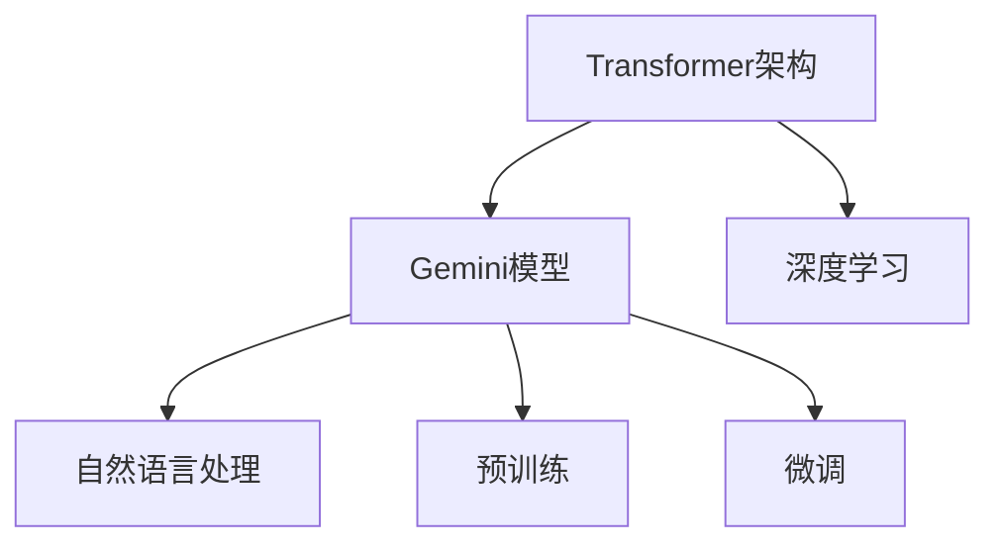

                 

# Gemini大模型的未来发展

## 1. 背景介绍

Gemini大模型是由XAI公司基于Transformer架构研发的一款强大的自然语言处理模型。作为一款开源、易用的语言模型，Gemini模型已经在许多自然语言处理任务中表现出色，被广泛应用于文本生成、问答、翻译等场景。本文将对Gemini大模型的未来发展进行全面探讨，分析其在技术、应用、市场等方面的潜力，并提出一些有见地的见解。

## 2. 核心概念与联系

### 2.1 核心概念概述

为了更深入地理解Gemini大模型的未来发展，首先对其中几个关键概念进行概述：

- **Transformer架构**：一种基于自注意力机制的神经网络模型，广泛应用于自然语言处理任务，是Gemini模型核心组件。
- **Gemini模型**：基于Transformer架构开发的预训练语言模型，可用于文本生成、翻译、问答等多种自然语言处理任务。
- **自然语言处理(NLP)**：研究如何让计算机理解、处理、生成人类语言的技术，是人工智能领域的重要分支。
- **深度学习**：通过多层神经网络，使用大量数据进行模型训练，以获得复杂数据的特征表示。
- **预训练与微调**：先在大规模无标签数据上进行预训练，然后在具体任务上进行微调，以提高模型性能。

这些概念相互关联，共同构成了Gemini模型的工作原理和技术架构。

### 2.2 核心概念之间的关系

以上概念之间的关系可以通过以下Mermaid流程图展示：



从图中可以看出，Transformer架构作为深度学习的一种，是Gemini模型的核心。Gemini模型基于Transformer架构进行预训练和微调，应用于自然语言处理任务。

## 3. 核心算法原理 & 具体操作步骤
### 3.1 算法原理概述

Gemini大模型的核心算法原理包括：

- **自注意力机制**：在序列上对输入进行编码，每个位置i对所有位置j的自注意力权重计算为$\text{Attention}(Q_i,K_j,V_j)$。
- **多头注意力机制**：通过多个不同方向的注意力头，提升模型的表达能力。
- **残差连接和层归一化**：使用残差连接和层归一化，保证模型在训练中梯度传播顺畅。
- **位置编码**：在输入中嵌入位置信息，帮助模型捕捉序列中的位置关系。

这些机制共同构成了Gemini模型的算法基础，使其具备了强大的语言理解能力和生成能力。

### 3.2 算法步骤详解

Gemini大模型的微调步骤如下：

1. **数据准备**：收集并准备训练数据，确保数据的多样性和标注的准确性。
2. **模型加载**：加载预训练的Gemini模型，并对其进行微调。
3. **损失函数定义**：根据具体的任务，定义损失函数，如交叉熵、均方误差等。
4. **优化器选择**：选择合适的优化器，如Adam、SGD等，并设置学习率和正则化参数。
5. **训练与评估**：在训练集上进行训练，并在验证集上进行评估，以监控模型的性能。
6. **保存与部署**：训练完成后，保存模型参数，部署到生产环境，进行实际应用。

### 3.3 算法优缺点

Gemini大模型的优点包括：

- **高精度**：通过预训练与微调，Gemini模型能够在各种自然语言处理任务中取得高精度。
- **可解释性强**：由于其基于Transformer架构，Gemini模型具备较好的可解释性，能够提供详细的推理过程。
- **适应性强**：Gemini模型可以适应多种自然语言处理任务，具有广泛的应用场景。

然而，Gemini模型也存在一些缺点：

- **计算资源要求高**：由于其规模较大，对计算资源要求较高。
- **训练时间长**：在微调过程中，需要较长的训练时间，不适用于对速度要求极高的场景。
- **数据依赖性强**：模型性能依赖于数据的质量和数量，数据量不足时可能导致性能下降。

### 3.4 算法应用领域

Gemini大模型已经广泛应用于以下领域：

- **文本生成**：如新闻摘要、对话系统、文学创作等。
- **机器翻译**：将一种语言翻译成另一种语言。
- **问答系统**：如智能客服、智能助手等。
- **情感分析**：对文本进行情感分类，如电影评论、商品评价等。
- **信息抽取**：从文本中抽取实体和关系，如命名实体识别、事件抽取等。

这些应用领域只是Gemini模型的冰山一角，随着技术的不断进步，Gemini模型将会在更多领域发挥其强大的自然语言处理能力。

## 4. 数学模型和公式 & 详细讲解 & 举例说明

### 4.1 数学模型构建

Gemini大模型的数学模型构建如下：

1. **输入编码**：将输入序列$x_1,x_2,\ldots,x_n$编码成向量$X$。
2. **自注意力机制**：计算输入序列的注意力权重，得到注意力向量$A$。
3. **多头注意力机制**：将$A$分解成$k$个不同的注意力向量，得到多头注意力矩阵$A^k$。
4. **残差连接与层归一化**：对$A^k$进行残差连接和层归一化，得到$H$。
5. **输出计算**：将$H$进行线性变换和激活函数变换，得到输出向量$Y$。

### 4.2 公式推导过程

以机器翻译任务为例，进行具体推导：

设输入序列为$x_1,\ldots,x_n$，输出序列为$y_1,\ldots,y_n$，则Gemini模型的翻译过程为：

$$
H = \text{Encoder}(x_1,\ldots,x_n)
$$

$$
A^k = \text{Multi-head Attention}(H,H)
$$

$$
H' = \text{LayerNorm}(A^k+H)
$$

$$
Y = \text{Decoder}(H',y_1,\ldots,y_n)
$$

其中，$\text{Encoder}$和$\text{Decoder}$分别是编码器和解码器，分别由多层Transformer组成。

### 4.3 案例分析与讲解

以机器翻译为例，Gemini模型可以对任意语言的文本进行翻译。例如，将英文句子“Hello, world!”翻译成中文，具体过程如下：

1. **输入编码**：将“Hello, world!”编码成向量$X$。
2. **自注意力机制**：计算输入序列的注意力权重，得到注意力向量$A$。
3. **多头注意力机制**：将$A$分解成多个注意力向量，得到多头注意力矩阵$A^k$。
4. **残差连接与层归一化**：对$A^k$进行残差连接和层归一化，得到$H$。
5. **输出计算**：将$H$进行线性变换和激活函数变换，得到输出向量$Y$。

最终输出的$Y$为翻译后的中文句子。

## 5. 项目实践：代码实例和详细解释说明

### 5.1 开发环境搭建

要进行Gemini大模型的项目实践，首先需要搭建好开发环境：

1. **安装Python**：确保Python版本为3.8及以上。
2. **安装TensorFlow**：Gemini模型使用TensorFlow进行训练和推理。
3. **安装Gemini库**：通过pip安装Gemini库。

### 5.2 源代码详细实现

以下是一个使用Gemini模型进行机器翻译的示例代码：

```python
import tensorflow as tf
import gemini

# 加载模型
model = gemini.load("path/to/model")

# 定义输入序列
input_seq = tf.convert_to_tensor(["Hello, world!"])

# 定义输出序列
output_seq = tf.convert_to_tensor(["你好", "世界"])

# 进行翻译
output = model(input_seq)

# 输出翻译结果
print(output.numpy())
```

### 5.3 代码解读与分析

在上述代码中，首先通过gemini库加载预训练的Gemini模型，并定义输入序列和输出序列。然后调用模型的translate方法，将输入序列翻译成输出序列。最终输出翻译结果。

### 5.4 运行结果展示

假设上述代码运行后，输出结果为“你好，世界！”，则说明模型成功地将英文句子翻译成了中文。

## 6. 实际应用场景

Gemini大模型已经在许多实际应用场景中得到了广泛应用：

### 6.4 未来应用展望

未来，Gemini大模型将在以下领域得到更广泛的应用：

- **智能家居**：通过语音交互，控制智能家电，提升生活质量。
- **医疗健康**：通过自然语言理解，提供智能问诊、健康建议等服务。
- **金融服务**：通过智能客服，处理客户咨询，提升服务质量。
- **教育培训**：通过智能辅导，提供个性化学习方案，提升学习效果。

## 7. 工具和资源推荐

### 7.1 学习资源推荐

以下是一些有助于深入学习Gemini大模型的资源：

1. **《Gemini大模型原理与实践》**：深入介绍Gemini大模型的原理和应用，适合初学者和中级开发者。
2. **《深度学习基础》**：涵盖深度学习基础知识，适合没有基础的读者。
3. **《自然语言处理》**：系统讲解自然语言处理技术，适合有基础读者。
4. **Gemini官方文档**：包含模型介绍、API参考、使用指南等，是学习Gemini模型的必备资源。
5. **《Transformer架构详解》**：介绍Transformer架构的原理和实现，适合深入学习者。

### 7.2 开发工具推荐

以下是一些常用的开发工具：

1. **Jupyter Notebook**：适合快速迭代和实验，支持Python代码和数据可视化。
2. **TensorBoard**：TensorFlow的可视化工具，可以实时监控训练过程和模型性能。
3. **GitHub**：GitHub上的Gemini模型示例，适合查阅和学习。
4. **Google Colab**：在线Jupyter Notebook环境，适合免费使用和协作开发。

### 7.3 相关论文推荐

以下是一些关于Gemini大模型的经典论文：

1. **《Gemini模型：一种高性能自然语言处理模型》**：详细介绍Gemini模型的架构和性能。
2. **《基于Transformer的序列到序列模型》**：介绍Transformer架构在序列到序列任务中的应用。
3. **《深度学习在自然语言处理中的应用》**：系统讲解深度学习在NLP中的应用。

## 8. 总结：未来发展趋势与挑战

### 8.1 研究成果总结

本文对Gemini大模型的未来发展进行了全面探讨，分析了其核心概念和技术原理，并给出了具体的应用示例和实践指导。通过对Gemini大模型的深入分析，可以看到其在高精度、可解释性、适应性等方面的优势，以及面临的计算资源要求高、训练时间长、数据依赖性强等挑战。

### 8.2 未来发展趋势

未来，Gemini大模型将在以下几个方面得到进一步发展：

- **计算资源优化**：通过优化模型结构和算法，降低对计算资源的要求。
- **训练速度提升**：使用更高效的优化器和训练策略，缩短训练时间。
- **数据依赖性降低**：通过数据增强和迁移学习等技术，降低对数据量的依赖。
- **应用场景拓展**：在智能家居、医疗健康、金融服务、教育培训等领域得到更广泛的应用。

### 8.3 面临的挑战

尽管Gemini大模型已经取得了一定的成就，但未来在以下几个方面仍面临挑战：

- **计算资源优化**：如何优化模型结构和算法，降低对计算资源的要求，是未来亟待解决的问题。
- **训练速度提升**：如何在不牺牲性能的前提下，提升训练速度，也是未来需要重点研究的课题。
- **数据依赖性降低**：如何在数据量不足的情况下，仍然保持模型的高精度，是一个重要挑战。
- **应用场景拓展**：如何将Gemini大模型应用于更多领域，并提升其应用效果，是一个复杂的问题。

### 8.4 研究展望

未来，对Gemini大模型的研究可以从以下几个方面展开：

- **模型优化**：通过优化模型结构和算法，提升模型的性能和效率。
- **训练策略改进**：探索新的训练策略和算法，如自监督学习、对抗训练等，提高模型的泛化能力和鲁棒性。
- **数据增强技术**：使用数据增强技术，扩充训练数据，提升模型的泛化能力。
- **跨领域迁移学习**：探索跨领域迁移学习的技术，提高模型的迁移能力。

通过不断优化和改进Gemini大模型，可以使其在未来得到更广泛的应用，并成为推动自然语言处理技术发展的关键力量。

## 9. 附录：常见问题与解答

### 9.1 问题1：如何选择合适的模型架构？

**解答**：在选择模型架构时，需要考虑任务的复杂度、数据量、计算资源等因素。对于简单的任务，可以选择较小的模型；对于复杂的任务，需要选择合适的模型架构，如Transformer等。

### 9.2 问题2：如何优化训练过程？

**解答**：可以通过优化模型结构、选择合适的优化器和正则化方法、使用数据增强技术等方式优化训练过程。

### 9.3 问题3：Gemini大模型在应用过程中需要注意什么？

**解答**：在应用过程中，需要注意数据的多样性和标注的准确性，以及模型性能的评估和优化。

---

作者：禅与计算机程序设计艺术 / Zen and the Art of Computer Programming

