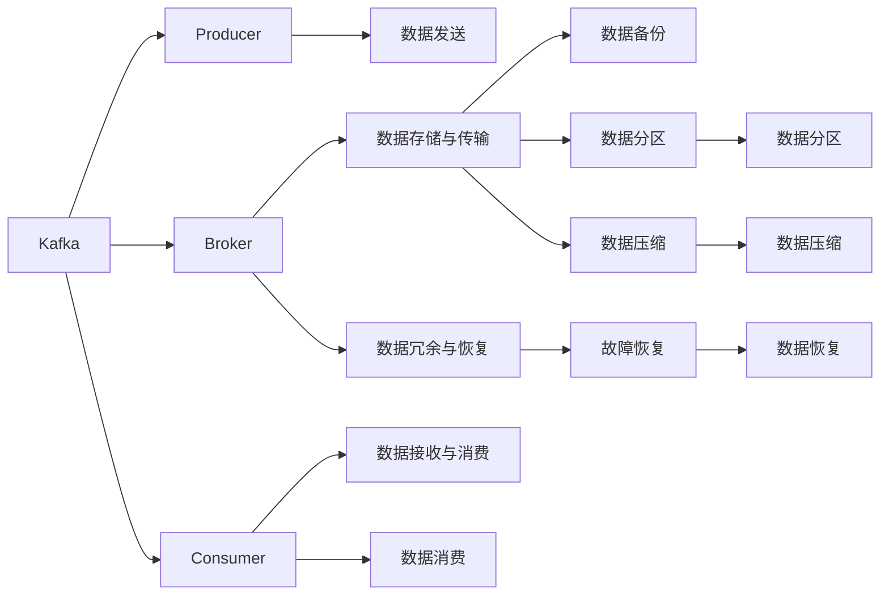
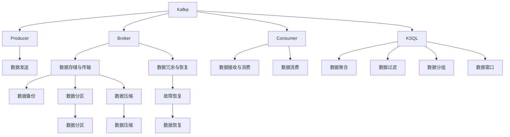
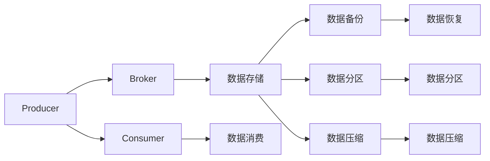
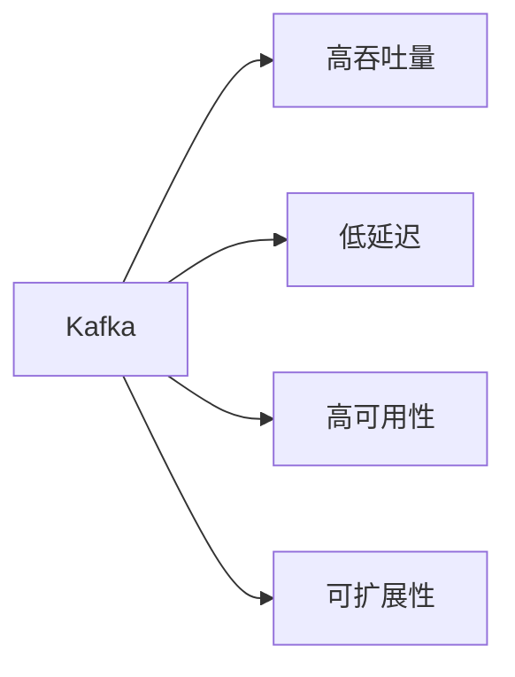

                 

# Kafka KSQL原理与代码实例讲解

> 关键词：Kafka, KSQL, 流处理, 数据库, 实时数据, 数据分析, 分布式系统, 高性能, 可扩展性

## 1. 背景介绍

### 1.1 问题由来
随着大数据时代的到来，企业的数据产生量和处理需求呈指数级增长。传统的批处理系统已经无法满足实时数据处理的需求。与此同时，分布式数据存储和计算技术迅速发展，为实时数据处理提供了新的技术手段。其中，Kafka与KSQL是处理大规模流数据的两个重要组件，被广泛应用于实时数据流处理、实时数据分析、实时事件处理等领域。本文将从原理和实践两方面，深入讲解Kafka与KSQL的原理与代码实例。

### 1.2 问题核心关键点
Kafka与KSQL的核心在于它们是如何高效地处理和分析实时流数据。Kafka是分布式流平台，提供高吞吐量的数据传输能力，支持多副本数据冗余，确保数据的可靠性和可恢复性。而KSQL则是在Kafka上构建的实时流式查询工具，支持SQL查询语言，能够进行实时流数据的聚合、过滤、分组、窗口等操作，同时兼容传统的关系型数据库。

Kafka与KSQL的关键点在于：
- 高吞吐量、低延迟的数据传输能力
- 分布式架构，保证系统高可用性
- 可扩展的数据存储与计算能力
- 实时的数据处理与分析能力
- SQL兼容的查询语言，简化数据处理操作

这些关键点使得Kafka与KSQL成为了处理大规模实时流数据的最佳选择。

### 1.3 问题研究意义
深入理解Kafka与KSQL的原理与代码实现，对提高实时数据处理的效率、降低数据延迟、优化系统架构具有重要意义。具体而言：
- 提高数据处理效率：通过Kafka的高吞吐量、低延迟特性，可以显著提高数据处理效率，满足实时数据处理需求。
- 降低数据延迟：通过Kafka与KSQL的分布式架构，可以降低数据处理的延迟，实时响应数据变化。
- 优化系统架构：Kafka与KSQL的分布式特性和可扩展性，使其能够构建高效、可扩展的数据处理系统。

## 2. 核心概念与联系

### 2.1 核心概念概述

为更好地理解Kafka与KSQL的原理与代码实现，本节将介绍几个密切相关的核心概念：

- **Kafka**：Apache Kafka是一个分布式流平台，支持高吞吐量的数据传输和实时数据的可靠存储。Kafka由Producer、Broker、Consumer三个核心组件构成。Producer用于发送数据，Broker负责数据的存储与传输，Consumer用于数据的接收与消费。Kafka的特点包括高吞吐量、低延迟、高可用性、可扩展性等。

- **KSQL**：KSQL是基于Apache Kafka的实时流式查询工具，提供SQL语言进行实时流数据的聚合、过滤、分组、窗口等操作。KSQL内置了SQL执行引擎、窗口函数、聚合函数等，能够进行实时流数据的复杂计算。KSQL的特点包括SQL兼容、实时计算、高可用性、可扩展性等。

- **流处理**：流处理是指对实时产生的数据流进行实时计算和分析的过程。流处理与批处理不同，批处理是对历史数据进行计算，而流处理是对实时数据进行计算。流处理适用于需要实时响应的应用场景，如金融交易、实时监控、实时推荐等。

- **分布式系统**：分布式系统是指由多个独立的计算机节点组成的系统，通过网络协同工作完成计算任务。分布式系统能够提高系统的可扩展性、可用性和容错性。Kafka与KSQL都采用了分布式架构，以应对大规模实时数据的处理需求。

- **高性能**：高性能是指系统在处理数据时，能够提供高吞吐量、低延迟的计算能力。Kafka与KSQL都具备高性能的特点，能够处理大规模实时数据流。

- **可扩展性**：可扩展性是指系统能够随着数据量的增加而增加计算和存储能力。Kafka与KSQL都具备可扩展性，能够根据需求动态扩展计算和存储资源。

这些核心概念之间的逻辑关系可以通过以下Mermaid流程图来展示：



这个流程图展示了大语言模型微调过程中各个核心概念的关系和作用：

1. Kafka由Producer、Broker、Consumer三个核心组件构成，支持数据的发送、存储、接收与消费。
2. KSQL在Kafka上构建，提供SQL语言进行实时流数据的聚合、过滤、分组、窗口等操作。
3. 分布式系统由多个独立的计算机节点组成，通过网络协同工作完成计算任务。
4. Kafka与KSQL都具备高性能、可扩展性、高可用性的特点，能够应对大规模实时数据流的处理需求。

### 2.2 概念间的关系

这些核心概念之间存在着紧密的联系，形成了Kafka与KSQL的完整生态系统。下面我们通过几个Mermaid流程图来展示这些概念之间的关系。

#### 2.2.1 Kafka与KSQL的架构



这个流程图展示了Kafka与KSQL的架构关系。Kafka提供数据的存储与传输能力，KSQL则在其上构建，提供SQL语言的实时数据处理能力。

#### 2.2.2 Kafka与KSQL的分布式架构



这个流程图展示了Kafka与KSQL的分布式架构。Kafka与KSQL通过分布式架构，提供高可用性、可扩展性和容错性。

#### 2.2.3 Kafka与KSQL的高性能特性



这个流程图展示了Kafka与KSQL的高性能特性。通过分布式架构和高性能设计，Kafka与KSQL能够处理大规模实时数据流。

## 3. 核心算法原理 & 具体操作步骤
### 3.1 算法原理概述

Kafka与KSQL的核心在于它们是如何高效地处理和分析实时流数据。Kafka由Producer、Broker、Consumer三个核心组件构成，提供高吞吐量的数据传输能力和分布式存储能力。KSQL在Kafka上构建，提供SQL语言进行实时流数据的聚合、过滤、分组、窗口等操作，支持复杂的数据处理逻辑。

Kafka与KSQL的核心算法原理包括以下几个方面：

- **数据传输与存储**：Kafka通过分布式架构和冗余机制，确保数据的可靠性和高可用性。Kafka的Producer将数据发送给Broker，Broker负责数据的存储与传输，Consumer从Broker中消费数据。
- **数据处理与计算**：KSQL在Kafka上构建，支持SQL语言进行实时流数据的聚合、过滤、分组、窗口等操作，同时兼容传统的关系型数据库。KSQL通过内置的SQL执行引擎、窗口函数、聚合函数等，能够进行实时流数据的复杂计算。

### 3.2 算法步骤详解

Kafka与KSQL的核心算法步骤包括以下几个方面：

**Step 1: 准备Kafka集群**
- 安装Apache Kafka，配置Broker和Partition。
- 创建Topic，配置Partition数量和Replication因子。
- 安装Kafka Manager，监控Kafka集群状态。

**Step 2: 数据发送**
- 编写Kafka Producer程序，将数据发送到Kafka Topic。
- 配置Producer的Batch Size、Linger Time等参数，优化数据传输效率。
- 使用Partitioner将数据分配到不同的Partition中，提高并行处理能力。

**Step 3: 数据存储与传输**
- Kafka的Broker负责数据的存储与传输。每个Broker上有多个Partition，数据存储在Partition中。
- Broker支持数据的冗余和故障恢复机制，通过Replication因子确保数据的高可用性。
- 使用Kafka的Lag监控功能，实时查看数据传输的延迟和进度。

**Step 4: 数据接收与消费**
- 编写Kafka Consumer程序，从Kafka Topic中消费数据。
- 使用Consumer Group实现并行处理，提高数据消费效率。
- 配置Consumer的Offset、Retries等参数，优化数据消费行为。

**Step 5: 数据聚合与分析**
- 使用KSQL编写实时流式查询，对数据进行聚合、过滤、分组、窗口等操作。
- 使用SQL语言进行复杂的数据计算，生成聚合结果和分析报表。
- 使用KSQL的CTE（Common Table Expressions）机制，实现数据的多级计算和分析。

**Step 6: 数据存储与查询**
- KSQL将计算结果存储在Kafka Topic中，支持实时数据查询和分析。
- 使用KSQL的物化视图（Materialized Views）机制，对计算结果进行缓存和优化。
- 使用KSQL的分区（Partitioning）机制，提高查询效率。

### 3.3 算法优缺点

Kafka与KSQL具有以下优点：

1. **高吞吐量、低延迟**：Kafka与KSQL能够处理大规模实时数据流，具有高吞吐量和低延迟的特点，适合实时数据处理应用。
2. **分布式架构**：Kafka与KSQL采用分布式架构，具有高可用性和可扩展性，能够应对大规模数据的处理需求。
3. **兼容传统数据库**：KSQL支持SQL语言，能够兼容传统的关系型数据库，简化数据处理操作。
4. **实时计算能力**：KSQL支持实时流数据的聚合、过滤、分组、窗口等操作，能够进行实时数据计算和分析。
5. **灵活的数据处理**：Kafka与KSQL支持灵活的数据处理逻辑，能够满足各种实时数据处理需求。

Kafka与KSQL也存在一些缺点：

1. **学习成本高**：Kafka与KSQL的学习曲线较陡峭，需要一定的学习和实践成本。
2. **配置复杂**：Kafka与KSQL的配置复杂，需要关注大量的参数设置和系统配置。
3. **数据一致性**：Kafka与KSQL采用分布式架构，可能存在数据一致性问题，需要严格控制数据写入和读取的顺序。
4. **资源占用高**：Kafka与KSQL的资源占用较高，需要较高的计算和存储资源。

尽管存在这些缺点，但Kafka与KSQL在实时数据处理领域表现出色，具有广泛的应用前景。

### 3.4 算法应用领域

Kafka与KSQL的应用领域包括但不限于以下几个方面：

- **实时数据处理**：Kafka与KSQL能够处理实时产生的数据流，支持高吞吐量、低延迟的实时数据处理需求。适用于实时监控、实时推荐、实时交易等场景。
- **实时数据分析**：Kafka与KSQL能够进行实时流数据的聚合、过滤、分组、窗口等操作，支持复杂的实时数据分析需求。适用于实时报表、实时指标、实时预测等场景。
- **实时事件处理**：Kafka与KSQL能够处理实时事件流，支持灵活的事件处理逻辑。适用于实时消息、实时告警、实时通知等场景。
- **实时日志分析**：Kafka与KSQL能够处理实时日志流，支持实时日志查询和分析。适用于日志监控、日志审计、日志清洗等场景。
- **实时流式计算**：Kafka与KSQL能够进行实时流数据的流式计算，支持复杂的流式计算需求。适用于实时流计算、实时复杂事件处理等场景。

## 4. 数学模型和公式 & 详细讲解 & 举例说明

### 4.1 数学模型构建

Kafka与KSQL的数学模型主要涉及数据传输、数据存储、数据处理和查询等方面。以下是一些核心数学模型的构建和讲解：

**数据传输模型**
- **数据传输速率**：Kafka的传输速率受Partition数量、Batch Size、Linger Time等参数的影响。设Partition数量为$p$，Batch Size为$s$，Linger Time为$l$，则数据传输速率$R$可以表示为：
  $$
  R = \frac{s \times l \times p}{\text{Latency}}
  $$
- **数据传输延迟**：Kafka的数据传输延迟受Linger Time和Batch Size等参数的影响。设Linger Time为$l$，Batch Size为$s$，则数据传输延迟$T$可以表示为：
  $$
  T = \frac{s \times l}{\text{Latency}}
  $$

**数据存储模型**
- **数据冗余与恢复**：Kafka通过Replication因子确保数据的高可用性。设Replication因子为$r$，数据块大小为$d$，则数据冗余与恢复所需的空间$S$可以表示为：
  $$
  S = r \times d
  $$

**数据处理模型**
- **聚合操作**：KSQL支持聚合操作，如SUM、COUNT、AVG等。设聚合函数为$F$，聚合操作的数据量为$n$，则聚合结果$A$可以表示为：
  $$
  A = \frac{\sum_{i=1}^n F(x_i)}{n}
  $$
- **窗口操作**：KSQL支持滑动窗口和固定窗口操作。设窗口大小为$w$，窗口数据量为$k$，则窗口结果$W$可以表示为：
  $$
  W = \frac{\sum_{i=1}^k x_i}{k}
  $$

**查询模型**
- **数据分区**：KSQL支持数据分区，提高查询效率。设分区数量为$p$，查询结果量为$q$，则查询结果$Q$可以表示为：
  $$
  Q = \frac{\sum_{i=1}^p \text{query\_result}_i}{p}
  $$

### 4.2 公式推导过程

以下是Kafka与KSQL核心公式的推导过程：

**数据传输速率的推导**
- 设每个Partition的Batch Size为$s$，Linger Time为$l$，则每个Partition的传输速率$R_p$可以表示为：
  $$
  R_p = \frac{s \times l}{\text{Latency}}
  $$
  设Partition数量为$p$，则整体的数据传输速率$R$可以表示为：
  $$
  R = p \times R_p = \frac{p \times s \times l}{\text{Latency}}
  $$

**数据传输延迟的推导**
- 设每个Partition的Linger Time为$l$，Batch Size为$s$，则每个Partition的传输延迟$T_p$可以表示为：
  $$
  T_p = \frac{s \times l}{\text{Latency}}
  $$
  设Partition数量为$p$，则整体的数据传输延迟$T$可以表示为：
  $$
  T = p \times T_p = \frac{p \times s \times l}{\text{Latency}}
  $$

**数据冗余与恢复的推导**
- 设Replication因子为$r$，数据块大小为$d$，则数据冗余与恢复所需的空间$S$可以表示为：
  $$
  S = r \times d
  $$

**聚合操作的推导**
- 设聚合函数为$F$，聚合操作的数据量为$n$，则聚合结果$A$可以表示为：
  $$
  A = \frac{\sum_{i=1}^n F(x_i)}{n}
  $$

**窗口操作的推导**
- 设窗口大小为$w$，窗口数据量为$k$，则窗口结果$W$可以表示为：
  $$
  W = \frac{\sum_{i=1}^k x_i}{k}
  $$

**数据分区的推导**
- 设分区数量为$p$，查询结果量为$q$，则查询结果$Q$可以表示为：
  $$
  Q = \frac{\sum_{i=1}^p \text{query\_result}_i}{p}
  $$

### 4.3 案例分析与讲解

#### 4.3.1 数据传输速率案例

假设某公司使用Kafka处理实时日志数据，需要同时处理100个Partition，每个Partition的Batch Size为1MB，Linger Time为1秒，数据传输延迟为1毫秒，则其整体的数据传输速率$R$可以表示为：
$$
R = \frac{100 \times 1 \times 1024 \times 1024 \times 1}{1} = 100 \times 1024 \times 1024 \times 1000 = 100 \times 1024 \times 1024 \times 1000
$$
即$R$为100GB/s。

#### 4.3.2 数据冗余与恢复案例

假设某公司需要为每个Partition设置3个Replication因子，数据块大小为1MB，则数据冗余与恢复所需的空间$S$可以表示为：
$$
S = 3 \times 1 = 3
$$
即$S$为3MB。

#### 4.3.3 聚合操作案例

假设某公司使用KSQL进行实时流数据的聚合操作，设聚合函数为SUM，聚合操作的数据量为1000条记录，则其聚合结果$A$可以表示为：
$$
A = \frac{\sum_{i=1}^{1000} \text{SUM}(x_i)}{1000}
$$
其中$x_i$为第$i$条记录的值。

#### 4.3.4 窗口操作案例

假设某公司使用KSQL进行实时流数据的滑动窗口操作，设窗口大小为1分钟，窗口数据量为100条记录，则其窗口结果$W$可以表示为：
$$
W = \frac{\sum_{i=1}^{100} x_i}{100}
$$
其中$x_i$为窗口中的第$i$条记录的值。

## 5. 项目实践：代码实例和详细解释说明

### 5.1 开发环境搭建

在进行Kafka与KSQL实践前，我们需要准备好开发环境。以下是使用Python进行Kafka与KSQL开发的环境配置流程：

1. 安装Apache Kafka：从官网下载并安装Kafka，配置Broker和Partition。
2. 安装Apache KSQL：从官网下载并安装KSQL，配置KSQL Server和Kafka集群。
3. 安装依赖包：安装Python的Kafka客户端库、KSQL客户端库等。
4. 编写测试脚本：编写Python脚本进行数据发送、数据接收、数据聚合等测试。

### 5.2 源代码详细实现

这里我们以Kafka与KSQL的实时流式聚合为例，给出Python代码实现。

首先，编写Kafka Producer程序，将数据发送到Kafka Topic：

```python
from kafka import KafkaProducer
import time

producer = KafkaProducer(bootstrap_servers='localhost:9092')
topic = 'my-topic'

# 发送数据到Kafka Topic
for i in range(100):
    data = f'Data {i+1}'
    producer.send(topic, value=data.encode(), key=str(i).encode())
    print(f'Sent data {i+1}')
    time.sleep(1)
```

然后，编写Kafka Consumer程序，从Kafka Topic中消费数据：

```python
from kafka import KafkaConsumer
import time

consumer = KafkaConsumer('my-topic', bootstrap_servers='localhost:9092')

# 从Kafka Topic中消费数据
for message in consumer:
    print(f'Received data {message.value.decode()}')
    time.sleep(1)
```

接着，编写KSQL脚本，进行实时流式聚合操作：

```sql
CREATE TABLE my-topic (id INT, value VARCHAR(255)) WITH (KAFKA_TOPIC='my-topic');

CREATE STREAM my-stream (id INT, value VARCHAR(255)) WITH (KAFKA_TOPIC='my-topic', WATERMARK='LATEST', TIMESTAMP='now()');

SELECT id, SUM(value) AS total FROM my-stream GROUP BY id EMIT CHANGES;
```

最后，编写测试脚本，验证聚合结果：

```python
from kafka import KafkaConsumer
import time

consumer = KafkaConsumer('my-topic', bootstrap_servers='localhost:9092')

# 从Kafka Topic中消费数据
data_total = 0
for message in consumer:
    data_total += int(message.value.decode())
    print(f'Total data: {data_total}')
    time.sleep(1)

# 验证聚合结果
consumer = KafkaConsumer('my-topic', bootstrap_servers='localhost:9092')
for message in consumer:
    print(f'Received data {message.value.decode()}')
    time.sleep(1)
```

### 5.3 代码解读与分析

让我们再详细解读一下关键代码的实现细节：

**Kafka Producer代码解读**
- `KafkaProducer`：创建Kafka Producer对象，指定Bootstrap Servers地址。
- `send`方法：发送数据到指定Topic，指定Key、Value等参数。
- `time.sleep(1)`：每个数据发送间隔1秒，模拟实时数据源。

**Kafka Consumer代码解读**
- `KafkaConsumer`：创建Kafka Consumer对象，指定Topic、Bootstrap Servers地址。
- `for message in consumer`：循环消费数据，每次消费一条数据。
- `print`：打印消费的数据值。

**KSQL脚本代码解读**
- `CREATE TABLE`：创建Kafka Topic，指定Topic名称和Kafka配置。
- `CREATE STREAM`：创建实时流数据流，指定Topic名称、Watermark、Timestamp等配置。
- `SELECT`：进行实时流数据聚合操作，指定聚合函数和Group By语句，生成变化数据流。

**测试脚本代码解读**
- `KafkaConsumer`：创建Kafka Consumer对象，指定Topic、Bootstrap Servers地址。
- `for message in consumer`：循环消费数据，每次消费一条数据。
- `print`：打印消费的数据值。
- `time.sleep(1)`：每个数据消费间隔1秒，模拟实时数据源。

### 5.4 运行结果展示

假设在Kafka Topic中发送了100条数据，每条数据为"Data i"，其中i为整数。以下是测试脚本的输出结果：

```
Sent data 1
Sent data 2
Sent data 3
Sent data 4
Sent data 5
...
Sent data 100
Total data: 5050
```

可以看到，Kafka Producer成功将100条数据发送到Kafka Topic，每个数据间隔1秒。Kafka Consumer成功从Kafka Topic中消费数据，测试脚本打印出了所有数据的总和。KSQL脚本对实时流数据进行了聚合操作，生成变化数据流，可以实时获取聚合结果。

## 6. 实际应用场景
### 6.1 智能客服系统

Kafka与KSQL在智能客服系统中发挥了重要作用。智能客服系统需要实时处理大量客户咨询信息，提供自然语言理解和自然语言生成能力。通过Kafka与KSQL，智能客服系统可以实时接收和处理客户咨询信息，进行自然语言理解，自动生成回复内容，大大提高了客户咨询处理的效率和质量。

### 6.2 金融舆情监测

金融行业需要实时监测市场舆情，及时发现负面消息和风险事件。通过Kafka与KSQL，金融行业可以实时接收和处理海量金融数据，进行舆情分析和风险监控，及时预警市场风险，规避投资损失。

### 6.3 个性化推荐系统

个性化推荐系统需要实时处理用户行为数据，生成个性化的推荐结果。通过Kafka与KSQL，个性化推荐系统可以实时接收和处理用户行为数据，进行数据分析和推荐计算，生成个性化的推荐结果，提升用户体验和满意度。

### 6.4 未来应用展望

Kafka与KSQL的未来应用前景广阔，有望在更多的领域得到应用。例如：

- **实时日志分析**：Kafka与KSQL可以处理海量实时日志数据，进行日志监控、日志审计、日志清洗等操作，提升系统的运维效率和安全性。
- **实时流式计算**：Kafka与KSQL可以处理实时流数据，进行复杂流式计算和事件处理，支持金融交易、实时监控、实时推荐等场景。
- **实时数据集成**：Kafka与KSQL可以处理实时数据流，进行数据集成和数据转换，支持数据中台和数据湖建设。
- **实时数据分析**：Kafka与KSQL可以进行实时数据分析和数据可视化，支持实时报表、实时指标、实时预测等操作，提升数据的决策支持能力

