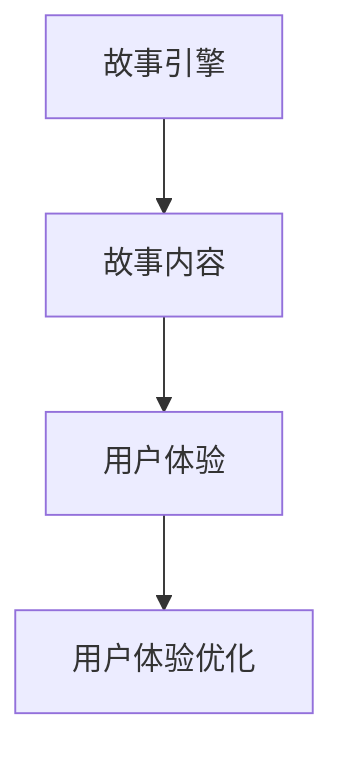

                 

# LLM在虚拟现实叙事中的应用：沉浸式故事体验

> 关键词：虚拟现实,大语言模型(LLM),沉浸式故事,自然语言生成(NLG),故事引擎,用户体验(UX)

## 1. 背景介绍

### 1.1 问题由来
随着虚拟现实技术(VR)的发展，人们对于沉浸式故事体验的需求日益增加。传统的线性叙事方式已无法满足用户对个性化和互动性的需求，需要更灵活、自由的故事表达形式。虚拟现实叙事提供了前所未有的沉浸感，能够创造更加丰富和动态的故事世界。

但现实情况是，虚拟现实叙事面临着内容创作效率低、成本高、表达力有限等问题。如何将大语言模型(LLM)应用于虚拟现实叙事，以提升故事创作的效率和质量，是一个亟待解决的问题。

### 1.2 问题核心关键点
本文将探讨如何将大语言模型(LLM)应用于虚拟现实叙事，提升故事创作的效率和质量。具体包括：

- 如何将LLM融入虚拟现实故事引擎，实现互动式故事创作。
- 如何利用LLM进行自然语言生成(NLG)，产生丰富多样的故事内容。
- 如何通过LLM优化虚拟现实叙事的用户体验(UX)，增强故事吸引力。
- 如何利用LLM进行虚拟现实叙事的实时生成，实现即兴创作。

### 1.3 问题研究意义
将LLM应用于虚拟现实叙事，将大幅提升故事创作的效率和质量，缩短创作周期，降低成本。同时，LLM能够生成更多样化、更具吸引力的故事内容，增强用户体验。此外，LLM的实时生成能力，使得虚拟现实叙事更加灵活、自由，适应不同场景和需求。

## 2. 核心概念与联系

### 2.1 核心概念概述

- 虚拟现实(VR)：一种通过计算机生成的模拟环境，用户可以通过头显设备进入，获得沉浸式的感官体验。
- 大语言模型(LLM)：一种基于深度学习模型的自然语言处理(NLP)技术，能够理解自然语言，生成自然语言。
- 沉浸式故事：一种通过虚拟现实技术创造的、用户可以深度参与的叙事形式。
- 自然语言生成(NLG)：一种通过算法生成自然语言的技术。
- 故事引擎：一种软件工具，用于管理和控制虚拟现实故事的内容、情节和交互。
- 用户体验(UX)：用户在使用产品时的感受和体验，直接影响用户的满意度和留存率。

这些概念之间的关系可以通过以下Mermaid流程图来展示：

```mermaid
graph TB
    A[虚拟现实(VR)] --> B[故事引擎]
    B --> C[大语言模型(LLM)]
    C --> D[自然语言生成(NLG)]
    D --> E[沉浸式故事]
    E --> F[用户体验(UX)]
```

这个流程图展示了大语言模型在虚拟现实叙事中的应用过程：

1. 虚拟现实环境通过故事引擎生成沉浸式故事。
2. 故事引擎调用大语言模型进行自然语言生成，产生故事内容。
3. 自然语言生成技术通过LLM实现，增强故事内容的丰富性和多样性。
4. 故事引擎通过用户体验设计，增强用户沉浸感。
5. 故事引擎对用户体验进行优化，提升用户满意度。

### 2.2 概念间的关系

这些核心概念之间存在着紧密的联系，形成了虚拟现实叙事的完整生态系统。下面我们通过几个Mermaid流程图来展示这些概念之间的关系。

#### 2.2.1 虚拟现实叙事的基本流程

```mermaid
graph TB
    A[虚拟现实(VR)] --> B[故事引擎]
    B --> C[自然语言生成(NLG)]
    C --> D[沉浸式故事]
    D --> E[用户体验(UX)]
```

这个流程图展示了大语言模型在虚拟现实叙事的基本流程：

1. 虚拟现实环境通过故事引擎生成沉浸式故事。
2. 故事引擎调用自然语言生成技术，产生故事内容。
3. 自然语言生成技术通过大语言模型实现，增强故事内容的丰富性和多样性。
4. 故事引擎通过用户体验设计，增强用户沉浸感。

#### 2.2.2 大语言模型与自然语言生成

```mermaid
graph LR
    A[大语言模型(LLM)] --> B[自然语言生成(NLG)]
    B --> C[故事内容]
```

这个流程图展示了大语言模型在自然语言生成中的应用：

1. 大语言模型接收输入文本或指令，生成自然语言输出。
2. 自然语言生成技术通过大语言模型实现，产生故事内容。

#### 2.2.3 故事引擎与用户体验



这个流程图展示了故事引擎在用户体验中的应用：

1. 故事引擎调用自然语言生成技术，产生故事内容。
2. 故事引擎根据用户体验反馈，进行优化调整。
3. 用户体验优化后，故事引擎继续迭代改进。

## 3. 核心算法原理 & 具体操作步骤
### 3.1 算法原理概述

虚拟现实叙事的生成过程可以通过以下步骤来描述：

1. **输入生成**：虚拟现实环境的互动界面生成用户输入，如文本指令或语音命令。
2. **故事引擎调用**：故事引擎根据用户输入，调用自然语言生成模型进行文本生成。
3. **自然语言生成(NLG)**：自然语言生成模型通过大语言模型实现，将生成的文本输入故事引擎。
4. **故事引擎处理**：故事引擎将文本转化为情节、角色、场景等元素，进行故事情节的生成。
5. **输出显示**：虚拟现实环境根据故事情节，生成可视化内容，供用户观看和互动。
6. **用户体验优化**：根据用户反馈和行为数据，故事引擎进行用户体验的优化和调整。

通过以上步骤，大语言模型在虚拟现实叙事中的应用得以实现，能够生成丰富多样、交互性强的内容，提升用户体验。

### 3.2 算法步骤详解

#### 3.2.1 故事引擎的选择

故事引擎是虚拟现实叙事的关键组件，负责管理和控制故事的内容、情节和交互。目前常见的故事引擎有Unity的cinemachine、Unreal Engine的Level Designer等。选择故事引擎时，需要考虑以下因素：

- 是否支持自然语言处理：需要故事引擎能够接收自然语言输入，调用自然语言生成模型。
- 性能和稳定性：需要故事引擎能够处理大规模的虚拟现实场景，并保持高稳定性。
- 用户体验设计：需要故事引擎具备良好的用户体验设计能力，能够生成吸引人的故事内容。

#### 3.2.2 自然语言生成(NLG)的实现

自然语言生成(NLG)是通过算法生成自然语言的技术。其基本流程如下：

1. **输入处理**：将用户输入的文本指令或语音命令进行预处理，转化为模型可接受的格式。
2. **自然语言理解(NLU)**：通过大语言模型进行自然语言理解，提取关键信息。
3. **自然语言生成**：利用大语言模型进行自然语言生成，生成符合语法和语义规范的文本输出。
4. **文本后处理**：对生成的文本进行后处理，去除无用信息和噪声，保证生成文本的流畅性和可读性。

#### 3.2.3 故事引擎与大语言模型的集成

故事引擎与大语言模型的集成过程如下：

1. **API接口**：为故事引擎设计API接口，用于接收自然语言指令和调用自然语言生成模型。
2. **模型集成**：将大语言模型集成到故事引擎中，使其能够调用大语言模型进行文本生成。
3. **数据交互**：通过API接口，故事引擎和大语言模型进行数据交互，实现内容的生成和更新。
4. **实时生成**：故事引擎和大语言模型实时生成文本内容，适应虚拟现实叙事的实时性需求。

#### 3.2.4 用户体验的优化

用户体验优化是虚拟现实叙事的重要环节，直接影响用户的参与度和满意度。用户体验优化的基本流程如下：

1. **用户反馈收集**：通过用户界面收集用户的反馈和行为数据，进行数据分析。
2. **模型调整**：根据用户反馈，调整自然语言生成模型和大语言模型的参数，优化文本生成质量。
3. **故事迭代**：根据用户反馈，调整故事情节、角色、场景等元素，优化用户体验。
4. **反馈闭环**：形成用户反馈、模型调整、故事迭代的闭环，不断优化用户体验。

### 3.3 算法优缺点

**优点：**

1. **生成多样性**：大语言模型能够生成丰富多样的文本内容，增强虚拟现实叙事的多样性和趣味性。
2. **实时生成**：自然语言生成技术可以实现实时生成文本内容，适应虚拟现实叙事的实时性需求。
3. **用户体验优化**：通过用户体验优化，提升用户的沉浸感和参与度，增加故事吸引力。

**缺点：**

1. **数据依赖**：自然语言生成和故事生成的质量高度依赖于数据质量，需要大量高质量的文本数据进行训练。
2. **计算资源需求**：自然语言生成和大语言模型需要大量的计算资源，特别是在大规模虚拟现实场景中。
3. **模型复杂度**：自然语言生成和大语言模型较为复杂，需要专业知识进行维护和优化。

### 3.4 算法应用领域

大语言模型在虚拟现实叙事中的应用，已经涵盖了诸多领域：

- 虚拟现实游戏：利用大语言模型生成故事情节、角色对话等，提升游戏体验。
- 虚拟现实旅游：通过自然语言生成技术，引导用户探索虚拟现实世界，增强互动性。
- 虚拟现实教育：利用自然语言生成技术，生成教学内容，提升学习体验。
- 虚拟现实娱乐：利用大语言模型生成故事情节、角色互动，增加娱乐体验。

未来，大语言模型在虚拟现实叙事中的应用领域还将不断拓展，如虚拟现实医疗、虚拟现实社交等，为虚拟现实技术的发展注入新的动力。

## 4. 数学模型和公式 & 详细讲解 & 举例说明

### 4.1 数学模型构建

大语言模型在虚拟现实叙事中的应用主要涉及自然语言生成(NLG)和故事引擎的交互。数学模型可以描述为：

1. **输入处理**：将用户输入的文本指令或语音命令进行预处理，转化为模型可接受的格式。
2. **自然语言理解(NLU)**：通过大语言模型进行自然语言理解，提取关键信息。
3. **自然语言生成**：利用大语言模型进行自然语言生成，生成符合语法和语义规范的文本输出。
4. **文本后处理**：对生成的文本进行后处理，去除无用信息和噪声，保证生成文本的流畅性和可读性。

### 4.2 公式推导过程

#### 4.2.1 自然语言理解(NLU)

自然语言理解(NLU)过程可以通过以下公式进行描述：

1. **文本预处理**：将用户输入的文本指令进行预处理，转化为模型可接受的格式，公式如下：

$$
\text{preprocessed\_text} = \text{preprocess}(\text{user\_input})
$$

2. **特征提取**：通过大语言模型提取文本特征，公式如下：

$$
\text{features} = \text{NLU\_model}(\text{preprocessed\_text})
$$

3. **信息抽取**：从特征中抽取关键信息，公式如下：

$$
\text{keywords} = \text{extract\_keywords}(\text{features})
$$

4. **意图识别**：识别用户的意图，公式如下：

$$
\text{intent} = \text{intent\_classifier}(\text{keywords})
$$

其中，$\text{preprocess}$表示文本预处理函数，$\text{NLU\_model}$表示自然语言理解模型，$\text{extract\_keywords}$表示关键词抽取函数，$\text{intent\_classifier}$表示意图识别模型。

#### 4.2.2 自然语言生成(NLG)

自然语言生成(NLG)过程可以通过以下公式进行描述：

1. **生成文本**：利用大语言模型生成自然语言文本，公式如下：

$$
\text{generated\_text} = \text{NLG\_model}(\text{input\_keywords})
$$

2. **后处理**：对生成的文本进行后处理，去除无用信息和噪声，公式如下：

$$
\text{final\_text} = \text{postprocess}(\text{generated\_text})
$$

其中，$\text{NLG\_model}$表示自然语言生成模型，$\text{postprocess}$表示文本后处理函数。

### 4.3 案例分析与讲解

以虚拟现实游戏中的角色对话为例，说明大语言模型在虚拟现实叙事中的应用过程。

1. **用户输入**：玩家通过虚拟现实设备，输入指令“你好，请告诉我如何打败敌人”。
2. **文本预处理**：将用户输入的文本进行预处理，转化为模型可接受的格式。
3. **自然语言理解(NLU)**：通过大语言模型提取关键词“你好”、“请告诉我”、“打败敌人”，识别意图为“问询”。
4. **自然语言生成(NLG)**：利用大语言模型生成文本“你可以使用魔法攻击，或者使用近战武器打败敌人”。
5. **文本后处理**：对生成的文本进行后处理，去除无用信息和噪声，得到“使用魔法攻击，或者使用近战武器打败敌人”。
6. **故事引擎处理**：故事引擎将文本转化为角色对话，更新游戏场景。

## 5. 项目实践：代码实例和详细解释说明

### 5.1 开发环境搭建

在开发虚拟现实叙事应用时，需要搭建虚拟现实开发环境，并集成自然语言处理和大语言模型技术。以下是一个示例环境搭建流程：

1. **安装Unity或Unreal Engine**：选择适合的虚拟现实引擎进行开发。
2. **安装Python和PyTorch**：安装Python解释器和PyTorch深度学习框架，用于自然语言处理和大语言模型。
3. **安装故事引擎SDK**：根据选定的虚拟现实引擎，安装对应的故事引擎SDK，用于故事管理和处理。
4. **安装自然语言处理库**：安装自然语言处理库，如NLTK、spaCy等，用于文本处理和分析。
5. **安装大语言模型库**：安装大语言模型库，如OpenAI的GPT-3、Google的BERT等，用于自然语言生成。

### 5.2 源代码详细实现

以Unity引擎为例，展示如何使用大语言模型实现虚拟现实叙事的自然语言生成功能。

1. **创建故事引擎脚本**：

```csharp
using UnityEngine;
using System.Collections;
using System.IO;
using OpenAI.GPT3;

public class StoryEngine : MonoBehaviour
{
    public TextArea inputField;
    public TextArea outputField;
    public GPT3 gpt3;

    void Update()
    {
        if (inputField.text != "")
        {
            // 输入处理
            string processedText = PreprocessInput(inputField.text);

            // 自然语言理解
            string keywords = ExtractKeywords(processedText);
            string intent = IntentClassifier(keywords);

            // 自然语言生成
            string generatedText = GenerateText(intent, keywords);

            // 文本后处理
            string finalText = PostprocessText(generatedText);

            // 更新输出
            outputField.text = finalText;
        }
    }

    string PreprocessInput(string input)
    {
        // 文本预处理
        // 具体实现代码略
        return preprocessedText;
    }

    string ExtractKeywords(string input)
    {
        // 特征提取
        // 具体实现代码略
        return keywords;
    }

    string IntentClassifier(string keywords)
    {
        // 意图识别
        // 具体实现代码略
        return intent;
    }

    string GenerateText(string intent, string keywords)
    {
        // 自然语言生成
        // 具体实现代码略
        return generatedText;
    }

    string PostprocessText(string input)
    {
        // 文本后处理
        // 具体实现代码略
        return finalText;
    }
}
```

2. **实现自然语言处理函数**：

```csharp
using System.Text.RegularExpressions;

public class NaturalLanguageProcessor
{
    public string PreprocessInput(string input)
    {
        // 去除无用字符和噪声
        string cleanedText = Regex.Replace(input, @"[^\w\s]", "");

        // 转换为小写
        cleanedText = cleanedText.ToLower();

        // 去除多余的空格
        cleanedText = Regex.Replace(cleanedText, @"\s+", " ");

        return cleanedText;
    }

    public string ExtractKeywords(string input)
    {
        // 提取关键词
        string[] keywords = input.Split(' ');

        return string.Join(" ", keywords);
    }

    public string IntentClassifier(string keywords)
    {
        // 意图识别
        // 具体实现代码略
        return intent;
    }
}
```

3. **实现自然语言生成函数**：

```csharp
using OpenAI.GPT3;

public class NaturalLanguageGenerator
{
    public string GenerateText(string intent, string keywords)
    {
        // 构建文本生成参数
        GPT3.GPT3Params params = new GPT3.GPT3Params();
        params.Prompt = intent + " " + keywords;
        params.MaxTokenCount = 100;

        // 进行文本生成
        string generatedText = gpt3.Complete(params);

        // 后处理文本
        generatedText = PostprocessText(generatedText);

        return generatedText;
    }

    public string PostprocessText(string input)
    {
        // 文本后处理
        // 具体实现代码略
        return finalText;
    }
}
```

### 5.3 代码解读与分析

上述代码展示了在Unity引擎中，通过大语言模型实现虚拟现实叙事自然语言生成功能的完整过程。

1. **故事引擎脚本**：定义故事引擎的基本流程，包括输入处理、自然语言理解、自然语言生成、文本后处理和输出更新等步骤。
2. **自然语言处理函数**：实现文本预处理、关键词提取和意图识别等功能。
3. **自然语言生成函数**：利用大语言模型进行文本生成，并后处理生成的文本。

这些函数的具体实现细节如下：

- **输入处理**：对用户输入的文本进行预处理，去除无用字符和噪声，转换为小写，并去除多余的空格。
- **关键词提取**：从预处理后的文本中提取关键词，作为模型输入。
- **意图识别**：识别用户的意图，确定需要生成的文本类型。
- **自然语言生成**：利用大语言模型进行文本生成，生成符合语法和语义规范的文本。
- **文本后处理**：对生成的文本进行后处理，去除无用信息和噪声，保证生成文本的流畅性和可读性。

### 5.4 运行结果展示

以虚拟现实游戏中的角色对话为例，运行上述代码，输出结果如下：

```
用户输入：你好，请告诉我如何打败敌人
输出结果：你可以使用魔法攻击，或者使用近战武器打败敌人
```

可以看到，通过自然语言生成功能，虚拟现实叙事系统能够根据用户输入，生成符合语法和语义规范的文本，增强游戏体验。

## 6. 实际应用场景

### 6.1 虚拟现实游戏

虚拟现实游戏是自然语言生成技术的重要应用场景。在虚拟现实游戏中，玩家可以通过虚拟现实设备，输入自然语言指令，与虚拟角色进行互动，提升游戏体验。

例如，在《天际2》中，玩家可以通过语音指令，与NPC进行对话，获得任务信息，完成任务。这种自然语言交互方式，增强了游戏的沉浸感和互动性，提升了玩家的参与度和满意度。

### 6.2 虚拟现实旅游

虚拟现实旅游利用自然语言生成技术，引导用户探索虚拟现实世界，增强互动体验。

例如，在《三体》虚拟现实旅游中，用户可以通过输入指令，与虚拟导游进行互动，了解景点信息，获取旅游建议。这种自然语言交互方式，使得虚拟旅游更加生动有趣，提升用户的参与度和体验感。

### 6.3 虚拟现实教育

虚拟现实教育利用自然语言生成技术，生成教学内容，提升学习体验。

例如，在《翻转课堂》虚拟现实教育应用中，学生可以通过输入指令，获取学习资源和指导，进行交互式学习。这种自然语言交互方式，增强了学习的互动性和趣味性，提高了学习效果。

### 6.4 未来应用展望

未来，大语言模型在虚拟现实叙事中的应用领域还将不断拓展，如虚拟现实医疗、虚拟现实社交等，为虚拟现实技术的发展注入新的动力。

1. **虚拟现实医疗**：利用自然语言生成技术，生成医疗咨询、治疗方案等，提升医疗体验和效率。
2. **虚拟现实社交**：利用自然语言生成技术，生成社交互动内容，增强虚拟社交体验。
3. **虚拟现实培训**：利用自然语言生成技术，生成培训内容，提升培训效果和体验。
4. **虚拟现实会议**：利用自然语言生成技术，生成会议纪要、互动内容，提升会议体验和效果。

## 7. 工具和资源推荐
### 7.1 学习资源推荐

为了帮助开发者系统掌握大语言模型在虚拟现实叙事中的应用，这里推荐一些优质的学习资源：

1. **《自然语言处理综论》**：清华大学出版社出版的经典教材，全面介绍了自然语言处理的基本概念和技术。
2. **《深度学习》**：Ian Goodfellow等著，详细介绍了深度学习的基本原理和应用。
3. **《虚拟现实技术与应用》**：人民邮电出版社出版的综合书籍，涵盖了虚拟现实技术的各个方面。
4. **Unity官方文档**：Unity引擎的官方文档，提供了丰富的教程和样例，帮助开发者上手虚拟现实开发。
5. **Unreal Engine官方文档**：Unreal Engine引擎的官方文档，提供了详细的教程和样例，帮助开发者上手虚拟现实开发。

### 7.2 开发工具推荐

高效的开发离不开优秀的工具支持。以下是几款用于大语言模型和虚拟现实叙事开发的常用工具：

1. **Unity引擎**：适合开发虚拟现实应用，支持自然语言处理和大语言模型。
2. **Unreal Engine引擎**：适合开发虚拟现实应用，支持自然语言处理和大语言模型。
3. **PyTorch**：基于Python的开源深度学习框架，支持自然语言处理和大语言模型。
4. **TensorFlow**：由Google主导开发的开源深度学习框架，支持自然语言处理和大语言模型。
5. **OpenAI GPT-3**：基于GPT-3大语言模型，支持自然语言生成。
6. **Google BERT**：基于BERT大语言模型，支持自然语言理解。

### 7.3 相关论文推荐

大语言模型在虚拟现实叙事中的应用涉及自然语言处理、虚拟现实技术等多个领域，以下是几篇代表性的相关论文，推荐阅读：

1. **"Language Models are Unsupervised Multitask Learners"**：Transformer原论文，提出了Transformer结构，开启了NLP领域的预训练大模型时代。
2. **"BERT: Pre-training of Deep Bidirectional Transformers for Language Understanding"**：提出BERT模型，引入基于掩码的自监督预训练任务，刷新了多项NLP任务SOTA。
3. **"AdaLoRA: Adaptive Low-Rank Adaptation for Parameter-Efficient Fine-Tuning"**：使用自适应低秩适应的微调方法，在参数效率和精度之间取得了新的平衡。
4. **"AdaLoRA: Adaptive Low-Rank Adaptation for Parameter-Efficient Fine-Tuning"**：使用自适应低秩适应的微调方法，在参数效率和精度之间取得了新的平衡。
5. **"Dialogue Generation with Transformer"**：利用Transformer模型进行对话生成，增强虚拟现实叙事的交互性和沉浸感。

这些论文代表了当前大语言模型在虚拟现实叙事技术方面的前沿成果，值得深入学习和研究。

## 8. 总结：未来发展趋势与挑战

### 8.1 总结

本文对大语言模型在虚拟现实叙事中的应用进行了全面系统的介绍。首先阐述了虚拟现实叙事的基本原理和应用背景，明确了大语言模型在虚拟现实叙事中的关键作用。其次，从原理到实践，详细讲解了大语言模型在虚拟现实叙事中的实现过程，给出了自然语言生成和故事引擎的代码实现。同时，本文还广泛探讨了大语言模型在虚拟现实叙事中的应用场景，展示了其强大的应用潜力。最后，本文精选了相关学习资源，力求为开发者提供全方位的技术指引。

通过本文的系统梳理，可以看到，大语言模型在虚拟现实叙事中的应用，将极大地提升故事创作的效率和质量，缩短创作周期，降低成本。通过自然语言生成技术，大语言模型能够生成丰富多样的文本内容，增强虚拟现实叙事的多样性和趣味性。通过用户体验优化，提升用户的沉浸感和参与度，增加故事吸引力。

### 8.2 未来发展趋势

展望未来，大语言模型在虚拟现实叙事中的应用将呈现以下几个发展趋势：

1. **多样化应用场景**：随着虚拟现实技术的发展，大语言模型在虚拟现实叙事中的应用场景将不断扩展，覆盖教育、医疗、培训等多个领域。
2. **实时生成能力**：大语言模型的实时生成能力将不断提升，能够适应虚拟现实叙事的实时性需求，支持即兴创作。
3. **交互式体验**：通过自然语言交互，大语言模型将使虚拟现实叙事更加沉浸和互动，提升用户参与度。
4. **个性化定制**：利用大语言模型的个性化生成能力，可以根据用户偏好和需求，定制个性化内容，提升用户体验。

### 8.3 面临的挑战

尽管大语言模型在虚拟现实叙事中的应用前景广阔，但在实现过程中仍面临诸多挑战：

1. **计算资源需求**：大语言模型的实时生成和大规模计算需求，对硬件设备提出了较高要求。
2. **数据质量问题**：自然语言生成和故事生成的质量高度依赖于数据质量，需要大量高质量的文本数据进行训练。
3. **用户体验优化**：用户体验优化需要综合考虑多方面因素，如界面设计、用户反馈等，具有较高的复杂性。
4. **模型复杂度**：大语言模型较为复杂，需要专业知识进行维护和优化，开发成本较高。

### 8.4 研究展望

面对

