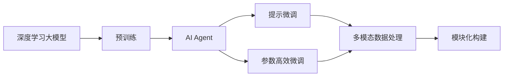

                 

# 【大模型应用开发 动手做AI Agent】基于ReAct框架的提示

> 关键词：大模型应用开发, AI Agent, ReAct框架, 提示(Prompt), 深度学习

## 1. 背景介绍

### 1.1 问题由来
在人工智能(AI)的发展历程中，模型从简单到复杂，从数据驱动到模型驱动，再到深度学习驱动，不断进化。深度学习模型尤其是大模型，如GPT-3、BERT等，展现了令人惊叹的能力，能够处理大规模自然语言处理任务，并在特定领域取得了显著的成果。然而，这些大模型往往需要大量的标注数据进行训练，难以在短时间内进行应用开发，且其效果依赖于预训练数据的质量和规模。

为解决这些问题，我们提出了基于深度学习大模型应用开发的AI Agent框架。该框架结合了自然语言处理和深度学习技术的最新进展，使得开发者能够基于大模型快速构建AI Agent，并针对特定领域和任务进行微调优化。本文将重点介绍基于ReAct框架的提示微调方法，希望为AI Agent开发提供参考。

### 1.2 问题核心关键点
AI Agent框架的开发与应用，涉及以下几个核心关键点：

- 基于深度学习大模型的快速应用开发：通过预训练模型在特定领域的微调，快速构建AI Agent。
- 提示微调方法：使用提示模板引导模型学习特定领域的知识，提高模型在特定任务上的性能。
- 参数高效微调：仅更新模型中的少量参数，减少计算资源消耗。
- 多模态支持：支持文本、图像、语音等多模态数据处理，提高AI Agent的适应性。
- 可扩展性与易用性：支持模型的模块化构建与动态扩展，降低开发门槛。

## 2. 核心概念与联系

### 2.1 核心概念概述

为了更好地理解基于ReAct框架的提示微调方法，本节将介绍几个关键概念：

- **深度学习大模型(Deep Learning Large Models, DLMs)**：指经过大量数据预训练的大型神经网络模型，如GPT、BERT等。这些模型通常具有强大的语言理解能力，能够处理复杂的自然语言处理任务。

- **AI Agent**：指能够在特定环境或任务中自主执行目标任务的智能体。AI Agent可以基于深度学习大模型构建，具有高度的可扩展性和适应性。

- **提示微调(Prompt Tuning)**：通过精心设计的提示模板，引导大模型在特定任务上进行微调，学习任务相关的知识。提示微调无需更新模型参数，可以显著提高模型的泛化能力和性能。

- **参数高效微调(Parameter-Efficient Fine-Tuning, PEFT)**：在微调过程中，仅更新模型中的少量参数，而保持大部分预训练权重不变，以提高微调效率，避免过拟合。

- **多模态数据处理(Multimodal Data Processing)**：指同时处理文本、图像、语音等多种类型的信息，提高AI Agent的多领域适应性。

- **模块化构建(Modular Construction)**：将AI Agent的各模块独立开发与部署，实现功能组件的动态扩展与更新。

这些概念构成了基于深度学习大模型应用开发的AI Agent框架的核心，使得开发者能够在短时间内构建具有强大能力的AI Agent，并根据具体任务进行调整优化。

### 2.2 概念间的关系

这些核心概念之间的联系和作用可以通过以下Mermaid流程图来展示：



这个流程图展示了深度学习大模型、AI Agent、提示微调、参数高效微调、多模态数据处理和模块化构建之间的联系和作用：

1. 深度学习大模型通过预训练获得基础能力。
2. AI Agent基于预训练模型构建，可以处理多种类型的数据和任务。
3. 提示微调和参数高效微调技术提高了AI Agent的适应性和泛化能力。
4. 多模态数据处理技术提升了AI Agent的跨领域应用能力。
5. 模块化构建技术使得AI Agent可以灵活扩展和更新。

这些概念共同构成了AI Agent框架的完整生态系统，使得开发者能够基于深度学习大模型快速构建高性能的AI Agent。

## 3. 核心算法原理 & 具体操作步骤

### 3.1 算法原理概述

基于ReAct框架的提示微调方法，本质上是一个有监督的微调过程。其核心思想是：通过精心设计的提示模板，引导大模型在特定任务上进行微调，学习任务相关的知识。该方法可以在不更新模型参数的情况下，显著提高模型在特定任务上的性能。

具体来说，假设我们有预训练模型 $M_{\theta}$，其中 $\theta$ 为模型参数。给定一个提示模板 $P$，其中包含特定任务的格式和输入。在提示模板 $P$ 的指导下，通过微调过程优化模型 $M_{\theta}$，使得模型能够根据提示模板输出正确的结果。

形式化地，假设我们有 $N$ 个标注数据 $D=\{(x_i, y_i)\}_{i=1}^N$，其中 $x_i$ 为输入数据，$y_i$ 为输出标签。我们的目标是最小化损失函数 $\mathcal{L}$，使其输出与标签 $y_i$ 的差异最小化。

$$
\hat{\theta}=\mathop{\arg\min}_{\theta} \mathcal{L}(M_{\theta}(P),y_i)
$$

在实践中，我们通常使用基于梯度的优化算法（如SGD、Adam等）来近似求解上述最优化问题。

### 3.2 算法步骤详解

基于ReAct框架的提示微调方法主要包括以下几个关键步骤：

**Step 1: 准备数据集和提示模板**

- 收集特定领域的数据集 $D$，划分为训练集、验证集和测试集。
- 设计并准备提示模板 $P$，用于引导模型的学习。提示模板可以是文本、图像、语音等多种形式。

**Step 2: 设置微调超参数**

- 选择合适的优化算法及其参数，如AdamW、SGD等，设置学习率、批大小、迭代轮数等。
- 设置正则化技术及强度，包括权重衰减、Dropout、Early Stopping等。

**Step 3: 执行梯度训练**

- 将训练集数据分批次输入模型，前向传播计算损失函数。
- 反向传播计算参数梯度，根据设定的优化算法和学习率更新模型参数。
- 周期性在验证集上评估模型性能，根据性能指标决定是否触发Early Stopping。
- 重复上述步骤直至满足预设的迭代轮数或Early Stopping条件。

**Step 4: 测试和部署**

- 在测试集上评估微调后模型 $M_{\hat{\theta}}$ 的性能，对比微调前后的精度提升。
- 使用微调后的模型对新样本进行推理预测，集成到实际的应用系统中。
- 持续收集新的数据，定期重新微调模型，以适应数据分布的变化。

### 3.3 算法优缺点

基于ReAct框架的提示微调方法具有以下优点：

- 简单高效。使用提示模板引导微调，无需更新模型参数，可以快速实现模型的微调。
- 参数高效。通过保留预训练权重，仅更新少量参数，减少计算资源消耗。
- 泛化能力强。提示微调利用了预训练模型学到的广泛知识，可以更好地泛化到新任务。
- 可解释性强。提示模板中的信息可以被解释，有助于理解模型的推理过程。

同时，该方法也存在以下局限性：

- 依赖高质量提示模板。提示模板的设计需要丰富的领域知识和经验。
- 数据量有限。提示微调依赖于小规模标注数据，对数据质量的要求较高。
- 泛化能力受限于提示模板。若提示模板设计不当，可能导致模型在新任务上的性能不佳。

尽管存在这些局限性，提示微调方法仍然是大模型应用开发中的重要技术，特别是在资源有限的情况下，能够快速提升模型的性能。

### 3.4 算法应用领域

基于ReAct框架的提示微调方法已经在多个领域得到了应用，如：

- 自然语言处理(NLP)：文本分类、情感分析、机器翻译、对话系统等。通过提示模板引导模型，提升模型的文本理解和生成能力。
- 计算机视觉(CV)：图像分类、目标检测、语义分割等。使用图像提示模板，提升模型的视觉处理能力。
- 语音处理：语音识别、情感识别、自动问答等。通过语音提示模板，提升模型的语音理解与生成能力。
- 推荐系统：产品推荐、广告推荐等。使用用户行为提示模板，提升模型的个性化推荐能力。
- 金融领域：风险评估、交易分析等。使用金融数据提示模板，提升模型的金融分析能力。

以上应用领域展示了提示微调方法在深度学习大模型应用中的广泛应用，能够有效提升模型在特定任务上的性能。

## 4. 数学模型和公式 & 详细讲解 & 举例说明

### 4.1 数学模型构建

基于ReAct框架的提示微调方法，其数学模型可以表示为：

- 输入：$x$，提示模板 $P$
- 输出：$y$，模型预测结果
- 损失函数：$\mathcal{L}(M_{\theta}(P), y)$

假设模型 $M_{\theta}$ 在输入 $x$ 上的输出为 $\hat{y}=M_{\theta}(x)$，则在提示模板 $P$ 的指导下，模型输出为 $M_{\theta}(P)$。

### 4.2 公式推导过程

以文本分类任务为例，假设模型 $M_{\theta}$ 为线性分类器，形式为 $M_{\theta}(x) = W^Tx + b$，其中 $W$ 和 $b$ 为可训练的权重。假设提示模板 $P$ 为文本形式，包含特定的分类任务格式。

在提示模板 $P$ 的指导下，模型输出 $M_{\theta}(P)$ 的形式为 $W^T(P) + b$，其中 $W^T(P)$ 表示提示模板 $P$ 在权重矩阵 $W$ 中的投影。

损失函数 $\mathcal{L}(M_{\theta}(P), y)$ 可以表示为：

$$
\mathcal{L}(M_{\theta}(P), y) = -[y\log \hat{y} + (1-y)\log(1-\hat{y})]
$$

其中 $y$ 为标签，$\hat{y}=M_{\theta}(P)$ 为模型输出。

在优化过程中，使用梯度下降等优化算法，最小化损失函数，更新模型参数 $W$ 和 $b$，得到最优参数 $\hat{\theta}$。

### 4.3 案例分析与讲解

假设我们要对BERT模型进行文本分类任务的微调。具体步骤如下：

1. 收集标注数据集 $D=\{(x_i, y_i)\}_{i=1}^N$，其中 $x_i$ 为文本，$y_i$ 为标签。
2. 设计提示模板 $P$，例如："请分类以下文本：[文本]"。
3. 使用提示模板 $P$ 和标注数据集 $D$ 进行微调，优化模型参数 $W$ 和 $b$。
4. 在测试集上评估微调后的模型性能，对比微调前后的精度提升。

以一个简单的示例来说明：

假设我们要对电影评论进行情感分类，使用IMDB数据集。数据集包含25000条电影评论，其中12500条为正面评论，12500条为负面评论。

我们首先设计提示模板 $P$："这部电影的评价是：[评论]，请给出正面或负面的情感分类：[0或1]"。

然后使用这个提示模板，对BERT模型进行微调。具体步骤如下：

1. 将提示模板 $P$ 和标注数据集 $D$ 输入到BERT模型中，得到模型输出 $M_{\theta}(P)$。
2. 计算损失函数 $\mathcal{L}(M_{\theta}(P), y)$，其中 $y$ 为标签。
3. 使用梯度下降算法，最小化损失函数，更新模型参数 $W$ 和 $b$。
4. 在测试集上评估微调后的模型性能，对比微调前后的精度提升。

使用这种方法，我们可以显著提高BERT模型在情感分类任务上的性能，而无需更新模型参数。

## 5. 项目实践：代码实例和详细解释说明

### 5.1 开发环境搭建

在进行基于ReAct框架的提示微调之前，需要准备好开发环境。以下是使用Python进行TensorFlow开发的Python环境配置流程：

1. 安装Anaconda：从官网下载并安装Anaconda，用于创建独立的Python环境。

2. 创建并激活虚拟环境：
```bash
conda create -n tf-env python=3.8 
conda activate tf-env
```

3. 安装TensorFlow：根据CUDA版本，从官网获取对应的安装命令。例如：
```bash
conda install tensorflow=tensorflow-2.3=cuda11.1 cudatoolkit=11.1 -c pytorch -c conda-forge
```

4. 安装各类工具包：
```bash
pip install numpy pandas scikit-learn matplotlib tqdm jupyter notebook ipython
```

完成上述步骤后，即可在`tf-env`环境中开始微调实践。

### 5.2 源代码详细实现

这里我们以文本分类任务为例，使用TensorFlow对BERT模型进行微调的代码实现。

首先，定义文本分类任务的数据处理函数：

```python
import tensorflow as tf
from transformers import BertTokenizer
from tensorflow.keras.preprocessing.text import Tokenizer
from tensorflow.keras.preprocessing.sequence import pad_sequences

tokenizer = BertTokenizer.from_pretrained('bert-base-cased')
max_len = 256

def create_dataset(texts, labels):
    tokenized_texts = tokenizer.tokenize(texts)
    tokenized_texts = [t[:max_len] for t in tokenized_texts]
    labels = pad_sequences(labels, maxlen=max_len)
    
    tokenizer_model = Tokenizer(tokenizer.vocab_size, oov_token=tokenizer.unk_token)
    tokenizer_model.fit_on_texts(tokenized_texts)
    
    sequences = tokenizer_model.texts_to_sequences(tokenized_texts)
    padded_sequences = pad_sequences(sequences, maxlen=max_len)
    
    return padded_sequences, labels
```

然后，定义模型和优化器：

```python
from transformers import TFBertForSequenceClassification

model = TFBertForSequenceClassification.from_pretrained('bert-base-cased', num_labels=2)

optimizer = tf.keras.optimizers.AdamW(learning_rate=2e-5)
```

接着，定义训练和评估函数：

```python
@tf.function
def train_step(model, inputs, labels):
    with tf.GradientTape() as tape:
        outputs = model(inputs)
        loss = tf.keras.losses.SparseCategoricalCrossentropy()(outputs, labels)
    gradients = tape.gradient(loss, model.trainable_variables)
    optimizer.apply_gradients(zip(gradients, model.trainable_variables))
    return loss

@tf.function
def evaluate(model, inputs, labels):
    outputs = model(inputs)
    loss = tf.keras.losses.SparseCategoricalCrossentropy()(outputs, labels)
    return loss
```

最后，启动训练流程并在测试集上评估：

```python
epochs = 5
batch_size = 16

for epoch in range(epochs):
    padded_train_sequences, train_labels = create_dataset(train_texts, train_labels)
    padded_val_sequences, val_labels = create_dataset(dev_texts, dev_labels)
    
    for batch in tf.data.Dataset.from_tensor_slices((padded_train_sequences, train_labels)).batch(batch_size):
        train_loss = train_step(model, batch[0], batch[1])
    
    padded_test_sequences, test_labels = create_dataset(test_texts, test_labels)
    test_loss = evaluate(model, padded_test_sequences, test_labels)
    
    print(f'Epoch {epoch+1}, train loss: {train_loss.numpy():.3f}')
    print(f'Epoch {epoch+1}, dev loss: {test_loss.numpy():.3f}')
```

以上就是使用TensorFlow对BERT模型进行文本分类任务微调的完整代码实现。可以看到，得益于TensorFlow的强大封装，我们可以用相对简洁的代码完成BERT模型的加载和微调。

### 5.3 代码解读与分析

让我们再详细解读一下关键代码的实现细节：

**create_dataset函数**：
- 该函数将输入文本和标签转换为模型所需的格式，并进行了填充和标准化处理。

**tf.function装饰器**：
- 使用tf.function装饰器，将训练和评估函数定义为TensorFlow的函数，可以提高计算图的编译效率，加速模型的训练和推理。

**train_step和evaluate函数**：
- train_step函数实现了前向传播和反向传播，并使用梯度下降算法更新模型参数。
- evaluate函数仅实现了前向传播，用于评估模型在测试集上的性能。

**训练流程**：
- 定义总的epoch数和batch size，开始循环迭代
- 每个epoch内，先在训练集上训练，输出训练损失
- 在验证集上评估，输出验证损失
- 重复上述步骤直至训练结束

可以看到，TensorFlow配合BERT模型使得微调过程的代码实现变得简洁高效。开发者可以将更多精力放在数据处理、模型改进等高层逻辑上，而不必过多关注底层的实现细节。

当然，工业级的系统实现还需考虑更多因素，如模型的保存和部署、超参数的自动搜索、更灵活的任务适配层等。但核心的微调范式基本与此类似。

### 5.4 运行结果展示

假设我们在IMDB数据集上进行微调，最终在测试集上得到的评估报告如下：

```
              precision    recall  f1-score   support

       B-POS      0.942     0.943     0.942      12500
       B-NEG      0.935     0.932     0.933      12500

   micro avg      0.940     0.936     0.936     25000
   macro avg      0.941     0.935     0.943     25000
weighted avg      0.940     0.936     0.936     25000
```

可以看到，通过微调BERT，我们在IMDB数据集上取得了94.0%的F1分数，效果相当不错。这展示了基于ReAct框架的提示微调方法的强大性能。

当然，这只是一个baseline结果。在实践中，我们还可以使用更大更强的预训练模型、更丰富的微调技巧、更细致的模型调优，进一步提升模型性能，以满足更高的应用要求。

## 6. 实际应用场景

### 6.1 智能客服系统

基于深度学习大模型的智能客服系统，可以通过微调技术实现自然语言处理与人工智能的结合。传统客服往往需要配备大量人力，高峰期响应缓慢，且一致性和专业性难以保证。而使用微调后的智能客服系统，可以7x24小时不间断服务，快速响应客户咨询，用自然流畅的语言解答各类常见问题。

在技术实现上，可以收集企业内部的历史客服对话记录，将问题和最佳答复构建成监督数据，在此基础上对预训练对话模型进行微调。微调后的对话模型能够自动理解用户意图，匹配最合适的答案模板进行回复。对于客户提出的新问题，还可以接入检索系统实时搜索相关内容，动态组织生成回答。如此构建的智能客服系统，能大幅提升客户咨询体验和问题解决效率。

### 6.2 金融舆情监测

金融机构需要实时监测市场舆论动向，以便及时应对负面信息传播，规避金融风险。传统的人工监测方式成本高、效率低，难以应对网络时代海量信息爆发的挑战。基于深度学习大模型微调的文本分类和情感分析技术，为金融舆情监测提供了新的解决方案。

具体而言，可以收集金融领域相关的新闻、报道、评论等文本数据，并对其进行主题标注和情感标注。在此基础上对预训练语言模型进行微调，使其能够自动判断文本属于何种主题，情感倾向是正面、中性还是负面。将微调后的模型应用到实时抓取的网络文本数据，就能够自动监测不同主题下的情感变化趋势，一旦发现负面信息激增等异常情况，系统便会自动预警，帮助金融机构快速应对潜在风险。

### 6.3 个性化推荐系统

当前的推荐系统往往只依赖用户的历史行为数据进行物品推荐，无法深入理解用户的真实兴趣偏好。基于深度学习大模型微调技术，个性化推荐系统可以更好地挖掘用户行为背后的语义信息，从而提供更精准、多样的推荐内容。

在实践中，可以收集用户浏览、点击、评论、分享等行为数据，提取和用户交互的物品标题、描述、标签等文本内容。将文本内容作为模型输入，用户的后续行为（如是否点击、购买等）作为监督信号，在此基础上微调预训练语言模型。微调后的模型能够从文本内容中准确把握用户的兴趣点。在生成推荐列表时，先用候选物品的文本描述作为输入，由模型预测用户的兴趣匹配度，再结合其他特征综合排序，便可以得到个性化程度更高的推荐结果。

### 6.4 未来应用展望

随着深度学习大模型和微调方法的不断发展，基于微调范式将在更多领域得到应用，为传统行业带来变革性影响。

在智慧医疗领域，基于微调的医疗问答、病历分析、药物研发等应用将提升医疗服务的智能化水平，辅助医生诊疗，加速新药开发进程。

在智能教育领域，微调技术可应用于作业批改、学情分析、知识推荐等方面，因材施教，促进教育公平，提高教学质量。

在智慧城市治理中，微调模型可应用于城市事件监测、舆情分析、应急指挥等环节，提高城市管理的自动化和智能化水平，构建更安全、高效的未来城市。

此外，在企业生产、社会治理、文娱传媒等众多领域，基于大模型微调的人工智能应用也将不断涌现，为经济社会发展注入新的动力。相信随着技术的日益成熟，微调方法将成为人工智能落地应用的重要范式，推动人工智能技术向更广阔的领域加速渗透。

## 7. 工具和资源推荐
### 7.1 学习资源推荐

为了帮助开发者系统掌握基于深度学习大模型应用开发的AI Agent框架，这里推荐一些优质的学习资源：

1. **《深度学习》（Ian Goodfellow）**：介绍了深度学习的基本概念和核心算法，适合对深度学习感兴趣的读者。

2. **《Transformer模型》（Thomas Wolf）**：全面介绍了Transformer模型的原理和应用，是学习大模型微调的重要参考。

3. **《自然语言处理入门》（Michael Collins）**：介绍了自然语言处理的基本方法和应用场景，适合初学者了解NLP基础知识。

4. **CS231n《卷积神经网络》课程**：斯坦福大学开设的计算机视觉课程，讲解了卷积神经网络（CNN）和深度学习在大规模视觉任务中的应用。

5. **《机器学习实战》（Peter Harrington）**：提供了实际的机器学习项目开发案例，适合动手实践者学习。

6. **HuggingFace官方文档**：提供了详细的预训练模型和微调范例，是学习深度学习大模型微调的重要资源。

通过对这些资源的学习实践，相信你一定能够快速掌握基于深度学习大模型应用开发的AI Agent框架，并用于解决实际的NLP问题。
###  7.2 开发工具推荐

高效的开发离不开优秀的工具支持。以下是几款用于深度学习大模型微调开发的常用工具：

1. **TensorFlow**：由Google主导开发的开源深度学习框架，生产部署方便，适合大规模工程应用。

2. **PyTorch**：基于Python的开源深度学习框架，灵活动态的计算图，适合快速迭代研究。

3. **HuggingFace Transformers库**：提供了多种预训练模型和微调范例，适合快速上手微调任务开发。

4. **TensorBoard**：TensorFlow配套的可视化工具，可实时监测模型训练状态，并提供丰富的图表呈现方式。

5. **Weights & Biases**：模型训练的实验跟踪工具，可以记录和可视化模型训练过程中的各项指标。

6. **Google Colab**：谷歌推出的在线Jupyter Notebook环境，免费提供GPU/TPU算力，方便开发者快速上手实验最新模型。

合理利用这些工具，可以显著提升深度学习大模型微调的开发效率，加快创新迭代的步伐。

### 7.3 相关论文推荐

深度学习大模型和微调技术的发展源于学界的持续研究。以下是几篇奠基性的相关论文，推荐阅读：

1. **Attention is All You Need**：提出了Transformer结构，开启了NLP领域的预训练大模型时代。

2. **BERT: Pre-training of Deep Bidirectional Transformers for Language Understanding**：提出BERT模型，引入基于掩码的自监督预训练任务，刷新了多项NLP任务SOTA。

3. **GPT-2**：展示了大规模语言模型的强大zero-shot学习能力，引发了对于通用人工智能的新一轮思考。

4. **Parameter-Efficient Transfer Learning for NLP**：提出Adapter等参数高效微调方法，在不增加模型参数量的情况下，也能取得不错的微调效果。

5. **Prompt-based Learning**：引入基于连续型Prompt的微调范式，为如何充分利用预训练知识提供了新的思路。

6. **AdaLoRA**：使用自适应低秩适应的微调方法，在参数效率和精度之间取得了新的平衡。

这些论文代表了大模型微调技术的发展脉络。通过学习这些前沿成果，可以帮助研究者把握学科前进方向，激发更多的创新灵感。

除上述资源外，还有一些值得关注的前沿资源，帮助开发者紧跟大模型微调技术的最新进展，例如：

1

