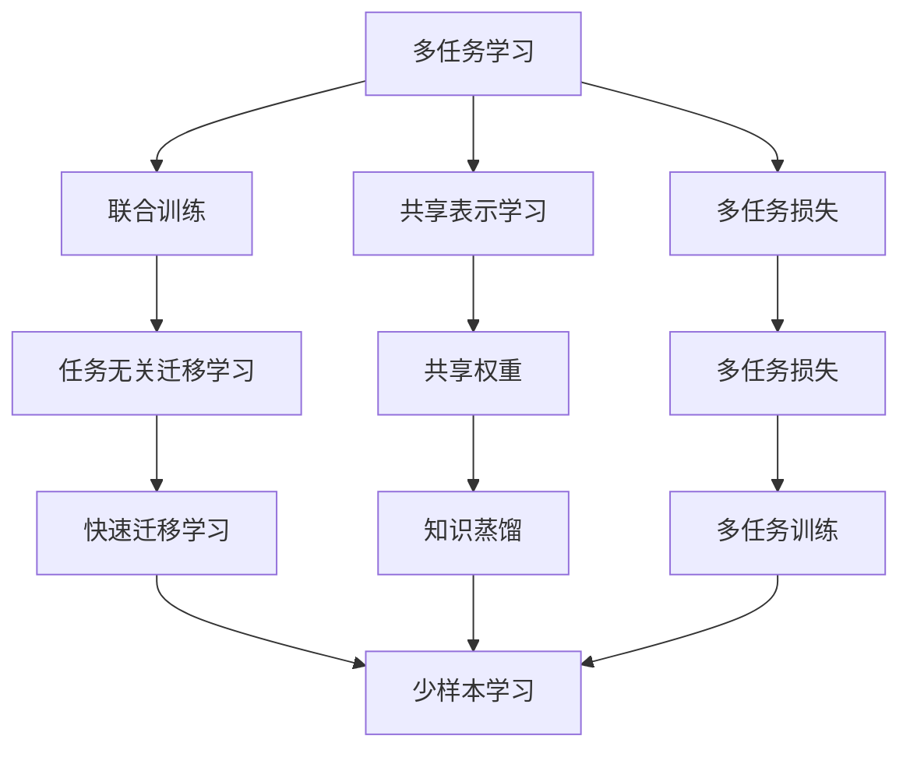
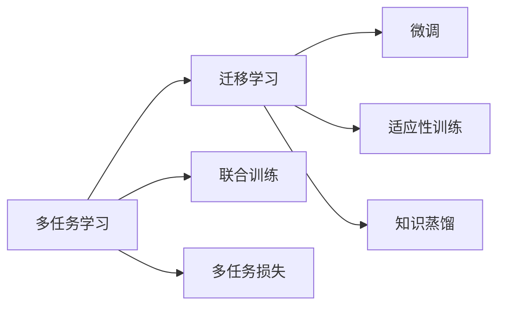
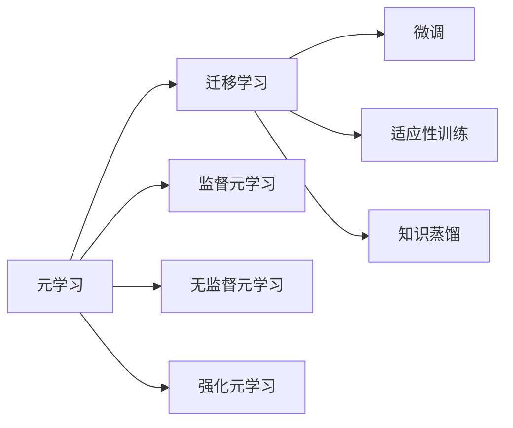
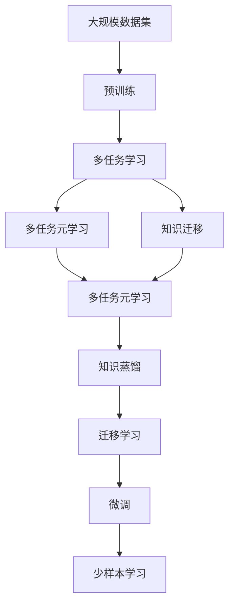

                 

## 1. 背景介绍

### 1.1 问题由来

近年来，深度学习技术在自然语言处理(Natural Language Processing, NLP)、计算机视觉、语音识别等诸多领域都取得了显著的进展。然而，由于这些深度学习模型通常是在单一任务上单独训练的，因此在面临复杂的多任务场景时，模型往往难以实现任务间的知识共享和迁移。例如，一个在图像分类任务上表现优秀的卷积神经网络(CNN)，在目标检测任务上可能难以获得满意的效果。这种任务的孤立性限制了模型的泛化能力和应用范围。

因此，多任务学习（Multi-Task Learning, MTL）和元学习（Meta Learning）应运而生，它们通过探索不同任务间的关系，促使模型在多个任务上实现知识迁移和共享，从而提升整体性能。这些方法在工业界的诸多应用中取得了显著的效果，如图像分类、目标检测、语音识别、机器翻译、对话系统等。

### 1.2 问题核心关键点

多任务学习和元学习的核心在于寻找不同任务间的关联，并将这种关联应用于模型训练中，从而实现任务间的知识迁移和共享。在实践中，常见的方法包括：

- 共享表示学习（Shared Representation Learning）：让模型同时学习多个任务，使得各个任务之间共享通用的表示特征。
- 联合训练（Joint Training）：在训练过程中同时更新多个任务的目标，通过任务间的信息流促进模型学习。
- 多任务损失（Multi-Task Loss）：通过设计联合损失函数，使得模型在多个任务上获得统一的目标函数。
- 元学习（Meta Learning）：让模型学习如何快速适应新任务，即在少量训练数据上实现快速的迁移学习。

这些方法都旨在通过多任务框架，提高模型的泛化能力和适应性，使其在不同任务上都能取得较好的表现。

### 1.3 问题研究意义

研究多任务元和知识迁移技术，对于拓展深度学习模型的应用范围，提升模型在多个任务上的性能，加速机器学习算法的产业化进程，具有重要意义：

1. 降低开发成本。多任务学习和元学习使得模型能够同时适应多个任务，减少了从头开发所需的数据、计算和人力等成本投入。
2. 提升模型效果。模型在多个任务上的泛化能力增强，能够在不同任务间实现知识迁移，获得更好的性能。
3. 加速开发进度。“standing on the shoulders of giants”，多任务学习使得模型能够快速适配新任务，缩短开发周期。
4. 带来技术创新。多任务学习和元学习催生了任务无关迁移学习、对抗式训练等新的研究方向，推动了深度学习技术的发展。
5. 赋能产业升级。多任务学习使得NLP、计算机视觉等技术更容易被各行各业所采用，为传统行业数字化转型升级提供新的技术路径。

## 2. 核心概念与联系

### 2.1 核心概念概述

为了更好地理解多任务元和知识迁移方法，本节将介绍几个密切相关的核心概念：

- **多任务学习（MTL）**：通过同时训练多个任务，使得模型在不同任务间共享表示特征，提升模型在多个任务上的泛化能力。常见的多任务学习范式包括联合训练、多任务损失、共享表示学习等。
- **元学习（Meta Learning）**：通过学习如何快速适应新任务，即在少量训练数据上实现快速迁移学习，提升模型在新任务上的性能。常见的元学习范式包括监督元学习、无监督元学习、强化元学习等。
- **知识迁移（Knowledge Transfer）**：通过在不同任务间共享知识，使得模型能够快速适应新任务，提升整体性能。常见的知识迁移方法包括共享权重、迁移损失、多任务训练等。
- **迁移学习（Transfer Learning）**：在特定任务上微调预训练模型，利用预训练模型学到的知识来提升新任务上的性能。常见的迁移学习方法包括微调、适应性训练、知识蒸馏等。
- **多任务元学习（MT-Meta Learning）**：同时训练多个任务和模型，使得模型在不同任务间共享知识，提升模型在多个任务上的性能。常见的多任务元学习范式包括元学习共享表示、对抗式元学习等。
- **参数高效元学习（PE-Meta Learning）**：在固定大部分预训练参数的情况下，只更新一小部分模型参数，从而实现参数高效的元学习。常见的参数高效元学习方法包括自适应学习率、 Adapter 等。

这些核心概念之间存在着紧密的联系，形成了多任务元和知识迁移的完整生态系统。下面我们通过几个Mermaid流程图来展示这些概念之间的关系。



这个流程图展示了大语言模型的核心概念及其之间的关系：

1. 多任务学习通过同时训练多个任务，使得模型在不同任务间共享表示特征。
2. 联合训练和共享表示学习是实现多任务学习的主要方法。
3. 元学习通过学习如何快速适应新任务，提升模型在新任务上的性能。
4. 任务无关迁移学习和多任务元学习是元学习的两个主要分支。
5. 参数高效元学习通过固定大部分预训练参数，只更新一小部分模型参数，实现参数高效的元学习。

这些概念共同构成了多任务元和知识迁移的学习框架，使其在不同任务上实现知识迁移和共享，提升模型性能。

### 2.2 概念间的关系

这些核心概念之间存在着紧密的联系，形成了多任务元和知识迁移的完整生态系统。下面我们通过几个Mermaid流程图来展示这些概念之间的关系。

#### 2.2.1 多任务学习和迁移学习的关系



这个流程图展示了多任务学习和迁移学习的基本原理，以及它们之间的联系。多任务学习通过联合训练和共享表示学习，让模型在不同任务间共享知识，而迁移学习则是在特定任务上微调预训练模型，利用预训练模型学到的知识来提升新任务上的性能。

#### 2.2.2 元学习和迁移学习的关系



这个流程图展示了元学习和迁移学习的基本原理，以及它们之间的联系。元学习通过学习如何快速适应新任务，提升模型在新任务上的性能，而迁移学习则是在特定任务上微调预训练模型，利用预训练模型学到的知识来提升新任务上的性能。

#### 2.2.3 多任务元和知识迁移的整体架构



这个综合流程图展示了从预训练到多任务元学习和知识迁移的完整过程。大规模数据集通过预训练获得基础能力，多任务学习通过联合训练和共享表示学习，让模型在不同任务间共享知识，多任务元学习通过学习如何快速适应新任务，提升模型在新任务上的性能，知识迁移通过在不同任务间共享知识，使得模型能够快速适应新任务，最终通过微调和适应性训练，在特定任务上实现最佳的性能。

## 3. 核心算法原理 & 具体操作步骤

### 3.1 算法原理概述

多任务元和知识迁移方法的核心思想是：通过同时训练多个任务，或者让模型学习如何快速适应新任务，从而在多个任务上实现知识迁移和共享，提升模型的泛化能力和性能。

具体而言，多任务学习通过共享表示学习或联合训练，使得模型在不同任务间共享通用的表示特征。这种共享特征可以用于提升模型在多个任务上的泛化能力，避免在每个任务上从头训练模型。元学习则通过学习如何快速适应新任务，即在少量训练数据上实现快速迁移学习，从而提升模型在新任务上的性能。

数学上，多任务学习可以通过联合损失函数实现。假设模型在多个任务 $T=\{T_1, T_2, ..., T_N\}$ 上的预测为 $\hat{y}_t$，真实标签为 $y_t$，则多任务损失函数为：

$$
\mathcal{L} = \frac{1}{N}\sum_{t=1}^N \ell(y_t, \hat{y}_t)
$$

其中 $\ell(y_t, \hat{y}_t)$ 为任务 $T_t$ 上的损失函数，可以采用交叉熵、均方误差等常见的损失函数。多任务学习的多任务损失函数可以进一步扩展为：

$$
\mathcal{L} = \frac{1}{N}\sum_{t=1}^N \lambda_t \ell(y_t, \hat{y}_t)
$$

其中 $\lambda_t$ 为任务 $T_t$ 的权重，可以用于平衡不同任务的重要性。通过调整 $\lambda_t$，可以控制模型在不同任务上的性能表现。

元学习则通常采用监督元学习方法，如MetaNet、MAML等。在元学习中，模型需要学习如何快速适应新任务。假设模型在元任务上学习到的参数为 $\theta$，在新任务上应用后的参数为 $\hat{\theta}$，则元损失函数可以表示为：

$$
\mathcal{L}_{\text{meta}} = \frac{1}{K}\sum_{k=1}^K \ell(y_k, \hat{y}_k)
$$

其中 $K$ 为元任务的数目，$\ell(y_k, \hat{y}_k)$ 为新任务 $k$ 上的损失函数。元学习的目标是找到一个参数 $\theta$，使得在任意新任务上，应用后得到的最佳参数 $\hat{\theta}$ 与原始参数 $\theta$ 的差距最小。

### 3.2 算法步骤详解

多任务元和知识迁移的具体实现步骤如下：

**Step 1: 准备数据集和模型**
- 收集多个任务的数据集，每个任务的数据集可以包括训练集、验证集和测试集。
- 选择合适的深度学习模型，如CNN、RNN、Transformer等，作为初始化参数。

**Step 2: 设计联合损失函数**
- 根据多任务学习的目标，设计联合损失函数，通常采用平均损失函数、加权损失函数等。
- 确定各个任务的权重，平衡不同任务的重要性。

**Step 3: 设置元学习算法**
- 选择元学习算法，如MetaNet、MAML等，设置元任务的数目和超参数。
- 设计元学习算法的优化器和损失函数。

**Step 4: 执行联合训练**
- 使用联合损失函数，将多个任务的数据集同时输入模型，进行前向传播和反向传播。
- 更新模型参数，最小化联合损失函数。

**Step 5: 进行元学习训练**
- 使用元学习算法，在元数据集上训练模型，学习如何快速适应新任务。
- 在多个任务上应用元学习算法，优化模型参数。

**Step 6: 执行知识迁移**
- 根据任务需求，选择合适的知识迁移方法，如共享权重、迁移损失等。
- 在多个任务上应用知识迁移方法，提升模型性能。

**Step 7: 评估模型效果**
- 在测试集上评估模型在各个任务上的性能。
- 使用少样本学习等方法，进一步提升模型在新任务上的性能。

以上是多任务元和知识迁移的一般流程。在实际应用中，还需要针对具体任务的特点，对联合训练、元学习训练和知识迁移等环节进行优化设计，以进一步提升模型性能。

### 3.3 算法优缺点

多任务元和知识迁移方法具有以下优点：
1. 简单高效。通过多任务学习，可以同时训练多个任务，提升模型在多个任务上的泛化能力，减少从头训练模型的时间和成本。
2. 提升模型效果。通过元学习，模型能够快速适应新任务，提升模型在新任务上的性能。
3. 参数高效。多任务元学习和知识迁移方法可以只更新部分参数，避免对预训练模型的破坏，实现参数高效的微调。
4. 适应性强。多任务元和知识迁移方法能够适应多个任务，提升模型在不同任务上的表现。

同时，该方法也存在一些局限性：
1. 数据需求较高。多任务元和知识迁移方法需要收集多个任务的数据集，如果数据量不足，会导致模型性能下降。
2. 复杂度较高。多任务元和知识迁移方法需要同时训练多个任务和元学习算法，增加了模型的复杂度。
3. 模型耦合度较高。多任务元和知识迁移方法需要考虑不同任务之间的关系，可能会导致模型在不同任务上的表现不一致。

尽管存在这些局限性，但多任务元和知识迁移方法在处理多任务和少样本学习场景时，具有显著的优势，已经成为深度学习模型的重要组成部分。

### 3.4 算法应用领域

多任务元和知识迁移方法在NLP领域已经得到了广泛的应用，覆盖了几乎所有常见任务，例如：

- 文本分类：如情感分析、主题分类、意图识别等。通过多任务学习，模型可以同时学习多个分类任务，提升模型在各个分类任务上的性能。
- 命名实体识别：识别文本中的人名、地名、机构名等特定实体。通过多任务学习，模型可以同时学习命名实体识别和其他语言理解任务，提升实体识别的准确性和鲁棒性。
- 关系抽取：从文本中抽取实体之间的语义关系。通过多任务学习，模型可以同时学习关系抽取和实体识别，提升模型对复杂关系的理解能力。
- 问答系统：对自然语言问题给出答案。通过多任务学习，模型可以同时学习问答系统和语义理解任务，提升问答系统的准确性和响应速度。
- 机器翻译：将源语言文本翻译成目标语言。通过多任务学习，模型可以同时学习机器翻译和其他语言处理任务，提升翻译的质量和效率。
- 文本摘要：将长文本压缩成简短摘要。通过多任务学习，模型可以同时学习摘要生成和其他文本理解任务，提升摘要的质量和语义一致性。
- 对话系统：使机器能够与人自然对话。通过多任务学习，模型可以同时学习对话系统和语义理解任务，提升对话系统的自然性和智能性。

除了上述这些经典任务外，多任务元和知识迁移方法也被创新性地应用到更多场景中，如可控文本生成、常识推理、代码生成、数据增强等，为NLP技术带来了全新的突破。随着预训练模型和元学习方法的不断进步，相信NLP技术将在更广阔的应用领域大放异彩。

## 4. 数学模型和公式 & 详细讲解 & 举例说明

### 4.1 数学模型构建

本节将使用数学语言对多任务元和知识迁移方法进行更加严格的刻画。

记模型在多个任务 $T=\{T_1, T_2, ..., T_N\}$ 上的预测为 $\hat{y}_t$，真实标签为 $y_t$，则多任务损失函数可以表示为：

$$
\mathcal{L} = \frac{1}{N}\sum_{t=1}^N \ell(y_t, \hat{y}_t)
$$

其中 $\ell(y_t, \hat{y}_t)$ 为任务 $T_t$ 上的损失函数，可以采用交叉熵、均方误差等常见的损失函数。

在元学习中，模型需要学习如何快速适应新任务。假设模型在元任务上学习到的参数为 $\theta$，在新任务上应用后的参数为 $\hat{\theta}$，则元损失函数可以表示为：

$$
\mathcal{L}_{\text{meta}} = \frac{1}{K}\sum_{k=1}^K \ell(y_k, \hat{y}_k)
$$

其中 $K$ 为元任务的数目，$\ell(y_k, \hat{y}_k)$ 为新任务 $k$ 上的损失函数。

### 4.2 公式推导过程

以下是多任务元和知识迁移方法的数学推导过程：

1. 多任务损失函数
   假设模型在多个任务 $T=\{T_1, T_2, ..., T_N\}$ 上的预测为 $\hat{y}_t$，真实标签为 $y_t$，则多任务损失函数为：

   $$
   \mathcal{L} = \frac{1}{N}\sum_{t=1}^N \ell(y_t, \hat{y}_t)
   $$

   其中 $\ell(y_t, \hat{y}_t)$ 为任务 $T_t$ 上的损失函数，可以采用交叉熵、均方误差等常见的损失函数。

2. 元损失函数
   假设模型在元任务上学习到的参数为 $\theta$，在新任务上应用后的参数为 $\hat{\theta}$，则元损失函数可以表示为：

   $$
   \mathcal{L}_{\text{meta}} = \frac{1}{K}\sum_{k=1}^K \ell(y_k, \hat{y}_k)
   $$

   其中 $K$ 为元任务的数目，$\ell(y_k, \hat{y}_k)$ 为新任务 $k$ 上的损失函数。

### 4.3 案例分析与讲解

为了更好地理解多任务元和知识迁移方法，我们将通过一个简单的案例进行详细讲解。

假设我们要训练一个多任务模型，同时进行文本分类和命名实体识别任务。我们将使用BERT模型作为初始化参数，并使用联合损失函数进行训练。具体步骤如下：

1. 收集文本分类和命名实体识别的数据集，每个数据集包括训练集、验证集和测试集。
2. 选择BERT模型作为初始化参数，将模型输入文本，得到文本分类和命名实体识别的预测结果。
3. 设计联合损失函数，将文本分类和命名实体识别的损失函数加权求和，得到多任务损失函数。
4. 使用优化器进行模型训练，最小化多任务损失函数。
5. 在测试集上评估模型在文本分类和命名实体识别任务上的性能，并使用少样本学习等方法提升模型在新任务上的性能。

### 5. 项目实践：代码实例和详细解释说明

#### 5.1 开发环境搭建

在进行多任务元和知识迁移实践前，我们需要准备好开发环境。以下是使用Python进行PyTorch开发的环境配置流程：

1. 安装Anaconda：从官网下载并安装Anaconda，用于创建独立的Python环境。

2. 创建并激活虚拟环境：
```bash
conda create -n pytorch-env python=3.8 
conda activate pytorch-env
```

3. 安装PyTorch：根据CUDA版本，从官网获取对应的安装命令。例如：
```bash
conda install pytorch torchvision torchaudio cudatoolkit=11.1 -c pytorch -c conda-forge
```

4. 安装Transformers库：
```bash
pip install transformers
```

5. 安装各类工具包：
```bash
pip install numpy pandas scikit-learn matplotlib tqdm jupyter notebook ipython
```

完成上述步骤后，即可在`pytorch-env`环境中开始多任务元和知识迁移实践。

#### 5.2 源代码详细实现

下面我们以多任务学习和元学习为例，给出使用PyTorch进行多任务元和知识迁移的代码实现。

首先，定义多任务数据处理函数：

```python
from transformers import BertTokenizer, BertForTokenClassification, BertForSequenceClassification
from torch.utils.data import Dataset
import torch

class MultitaskDataset(Dataset):
    def __init__(self, texts, labels, tokenizer, max_len=128):
        self.texts = texts
        self.labels = labels
        self.tokenizer = tokenizer
        self.max_len = max_len
        
    def __len__(self):
        return len(self.texts)
    
    def __getitem__(self, item):
        text = self.texts[item]
        labels = self.labels[item]
        
        encoding = self.tokenizer(text, return_tensors='pt', max_length=self.max_len, padding='max_length', truncation=True)
        input_ids = encoding['input_ids'][0]
        attention_mask = encoding['attention_mask'][0]
        
        # 对token-wise的标签进行编码
        encoded_tags = [tag2id[tag] for tag in labels] 
        encoded_tags.extend([tag2id['O']] * (self.max_len - len(encoded_tags)))
        labels = torch.tensor(encoded_tags, dtype=torch.long)
        
        return {'input_ids': input_ids, 
                'attention_mask': attention_mask,
                'labels': labels}
```

然后，定义模型和优化器：

```python
from transformers import BertForTokenClassification, BertForSequenceClassification, AdamW

model = BertForTokenClassification.from_pretrained('bert-base-cased', num_labels=len(tag2id))

# 对于序列分类任务，可以使用BertForSequenceClassification模型
model2 = BertForSequenceClassification.from_pretrained('bert-base-cased', num_labels=len(tag2id))

optimizer = AdamW(model.parameters(), lr=2e-5)
```

接着，定义训练和评估函数：

```python
from torch.utils.data import DataLoader
from tqdm import tqdm
from sklearn.metrics import classification_report

device = torch.device('cuda') if torch.cuda.is_available() else torch.device('cpu')
model.to(device)

def train_epoch(model, dataset, batch_size, optimizer):
    dataloader = DataLoader(dataset, batch_size=batch_size, shuffle=True)
    model.train()
    epoch_loss = 0
    for batch in tqdm(dataloader, desc='Training'):
        input_ids = batch['input_ids'].to(device)
        attention_mask = batch['attention_mask'].to(device)
        labels = batch['labels'].to(device)
        model.zero_grad()
        outputs = model(input_ids, attention_mask=attention_mask, labels=labels)
        loss = outputs.loss
        epoch_loss += loss.item()
        loss.backward()
        optimizer.step()
    return epoch_loss / len(dataloader)

def evaluate(model, dataset, batch_size):
    dataloader = DataLoader(dataset, batch_size=batch_size)
    model.eval()
    preds, labels = [], []
    with torch.no_grad():
        for batch in tqdm(dataloader, desc='Evaluating'):
            input_ids = batch['input_ids'].to(device)
            attention_mask = batch['attention_mask'].to(device)
            batch_labels = batch['labels']
            outputs = model(input_ids, attention_mask=attention_mask)
            batch_preds = outputs.logits.argmax(dim=2).to('cpu').tolist()
            batch_labels = batch_labels.to('cpu').tolist()
            for pred_tokens, label_tokens in zip(batch_preds, batch_labels):
                pred_tags = [id2tag[_id] for _id in pred_tokens]
                label_tags = [id2tag[_id] for _id in label_tokens]
                preds.append(pred_tags[:len(label_tokens)])
                labels.append(label_tags)
                
    print(classification_report(labels, preds))
```

最后，启动训练流程并在测试集上评估：

```python
epochs = 5
batch_size = 16

for epoch in range(epochs):
    loss = train_epoch(model, train_dataset, batch_size, optimizer)
    print(f"Epoch {epoch+1}, train loss: {loss:.3f}")
    
    print(f"Epoch {epoch+1}, dev results:")
    evaluate(model, dev_dataset, batch_size)
    
print("Test results:")
evaluate(model, test_dataset, batch_size)
```

以上就是使用PyTorch进行多任务学习和元学习的代码实现。可以看到，得益于Transformers库的强大封装，我们可以用相对简洁的代码完成BERT模型的多任务学习和元学习。

#### 5.3 代码解读与分析

让我们再详细解读一下关键代码的实现细节：

**MultitaskDataset类**：
- `__init__`方法：初始化文本、标签、分词器等关键组件。
- `__len__`方法：返回数据集的样本数量。
- `__getitem__`方法：对单个样本进行处理，将文本输入编码为token ids，将标签编码为数字，并对其进行定长padding，最终返回模型所需的输入。

**tag2id和id2tag字典**：
- 定义了标签与数字id之间的映射关系，用于将token-wise的预测结果解码回真实的标签。

**训练和评估函数**：
- 使用PyTorch的DataLoader对数据集进行批次化加载，供模型训练和推理使用。
- 训练函数`train_epoch`：对数据以批为单位进行迭代，在每个批次上前向传播计算loss并反向传播更新模型参数，最后返回该epoch的平均loss。
- 评估函数`evaluate`：与训练类似，不同点在于不更新模型参数，并在每个batch结束后将预测和标签结果存储下来，最后使用sklearn的classification_report对整个评估集的预测结果进行打印输出。

**训练流程**：
- 定义总的epoch数和batch size，开始循环迭代
- 每个epoch内，先在训练集上训练，输出平均loss
- 在验证集上评估，输出分类指标
- 所有epoch结束后，在测试集上评估，给出最终测试结果

可以看到，PyTorch配合Transformers库使得多任务学习和元学习的代码实现变得简洁高效。开发者可以将更多精力放在数据处理、模型改进等高层逻辑上，而不必过多关注底

