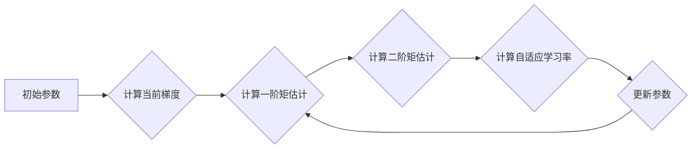

# 优化算法：Adam 原理与代码实例讲解

> 关键词：Adam优化器，自适应学习率，梯度下降，机器学习，深度学习

## 1. 背景介绍

在机器学习和深度学习领域，优化算法是核心组成部分。它决定了模型参数如何更新，从而影响模型的收敛速度和最终性能。传统的梯度下降算法虽然简单直观，但在实际应用中往往存在学习率选择困难、收敛速度慢、容易陷入局部最优等问题。为了解决这些问题，研究者们提出了许多自适应学习率的优化算法，其中Adam优化器因其优异的性能和广泛的应用而备受关注。

## 2. 核心概念与联系

### 2.1 Adam优化器简介

Adam（Adaptive Moment Estimation）优化器是2015年由Kingma和Ba提出的。它结合了两个经典优化算法：Momentum和RMSprop。Adam优化器通过计算梯度的一阶矩估计（即均值）和二阶矩估计（即未中心化的方差）来自适应地调整每个参数的学习率。

### 2.2 Mermaid 流程图

以下为Adam优化器核心概念原理和架构的Mermaid流程图：



### 2.3 Adam与Momentum和RMSprop的关系

- **Momentum**：Momentum优化器通过引入动量项来加速梯度下降过程，即利用之前的梯度信息来预测当前梯度，从而加速收敛。
- **RMSprop**：RMSprop优化器通过计算梯度的平方和的指数衰减移动平均来动态调整学习率，使学习率在训练过程中逐渐减小，有助于在平坦区域保持较小的学习率，在陡峭区域加速收敛。

Adam优化器将Momentum和RMSprop的优势结合，通过自适应地调整每个参数的学习率，在多数情况下都能取得良好的效果。

## 3. 核心算法原理 & 具体操作步骤

### 3.1 算法原理概述

Adam优化器主要包含以下步骤：

1. 初始化一阶矩估计 $\boldsymbol{v}_t$ 和二阶矩估计 $\boldsymbol{s}_t$ 为零向量。
2. 对每个参数 $\theta_i$，计算其梯度 $\nabla \theta_i$。
3. 更新一阶矩估计 $\boldsymbol{v}_t = \beta_1 \boldsymbol{v}_{t-1} + (1 - \beta_1) \nabla \theta_i$。
4. 标准化一阶矩估计 $\hat{\boldsymbol{v}}_t = \frac{\boldsymbol{v}_t}{1 - \beta_1^t}$。
5. 更新二阶矩估计 $\boldsymbol{s}_t = \beta_2 \boldsymbol{s}_{t-1} + (1 - \beta_2) \nabla \theta_i^2$。
6. 标准化二阶矩估计 $\hat{\boldsymbol{s}}_t = \frac{\boldsymbol{s}_t}{1 - \beta_2^t}$。
7. 计算自适应学习率 $\boldsymbol{\alpha}_t = \frac{\alpha}{\sqrt{\hat{\boldsymbol{s}}_t} + \epsilon}$。
8. 更新参数 $\theta_i = \theta_i - \boldsymbol{\alpha}_t \hat{\boldsymbol{v}}_i$。

其中，$\alpha$ 是初始学习率，$\beta_1$ 和 $\beta_2$ 是一阶和二阶矩估计的指数衰减率，$\epsilon$ 是一个很小的常数，用于防止除以零。

### 3.2 算法步骤详解

1. **初始化**：在训练开始时，初始化一阶矩估计 $\boldsymbol{v}_t$ 和二阶矩估计 $\boldsymbol{s}_t$ 为零向量。
2. **计算梯度**：对每个参数 $\theta_i$，计算其梯度 $\nabla \theta_i$。
3. **更新一阶矩估计**：使用公式 $\boldsymbol{v}_t = \beta_1 \boldsymbol{v}_{t-1} + (1 - \beta_1) \nabla \theta_i$ 更新一阶矩估计，其中 $\beta_1$ 是一阶矩估计的指数衰减率。
4. **标准化一阶矩估计**：使用公式 $\hat{\boldsymbol{v}}_t = \frac{\boldsymbol{v}_t}{1 - \beta_1^t}$ 标准化一阶矩估计，以便消除累积的偏差。
5. **更新二阶矩估计**：使用公式 $\boldsymbol{s}_t = \beta_2 \boldsymbol{s}_{t-1} + (1 - \beta_2) \nabla \theta_i^2$ 更新二阶矩估计，其中 $\beta_2$ 是二阶矩估计的指数衰减率。
6. **标准化二阶矩估计**：使用公式 $\hat{\boldsymbol{s}}_t = \frac{\boldsymbol{s}_t}{1 - \beta_2^t}$ 标准化二阶矩估计，以便消除累积的偏差。
7. **计算自适应学习率**：使用公式 $\boldsymbol{\alpha}_t = \frac{\alpha}{\sqrt{\hat{\boldsymbol{s}}_t} + \epsilon}$ 计算自适应学习率，其中 $\alpha$ 是初始学习率，$\epsilon$ 是一个很小的常数。
8. **更新参数**：使用公式 $\theta_i = \theta_i - \boldsymbol{\alpha}_t \hat{\boldsymbol{v}}_i$ 更新参数，其中 $\hat{\boldsymbol{v}}_i$ 是标准化的一阶矩估计。

### 3.3 算法优缺点

**优点**：

- **自适应学习率**：Adam优化器能够自适应地调整每个参数的学习率，避免了手动设置学习率的困难。
- **高效收敛**：Adam优化器结合了Momentum和RMSprop的优势，能够快速收敛到最优解。
- **适用范围广**：Adam优化器适用于大多数机器学习和深度学习任务。

**缺点**：

- **计算复杂度高**：Adam优化器需要计算一阶矩估计和二阶矩估计，计算复杂度较高。
- **对初始化敏感**：Adam优化器的性能对初始参数的设置较为敏感。

### 3.4 算法应用领域

Adam优化器广泛应用于各种机器学习和深度学习任务，包括：

- 逻辑回归
- 支持向量机
- 线性回归
- 人工神经网络
- 深度神经网络

## 4. 数学模型和公式 & 详细讲解 & 举例说明

### 4.1 数学模型构建

以下为Adam优化器的数学模型：

$$
\begin{aligned}
\boldsymbol{v}_t & = \beta_1 \boldsymbol{v}_{t-1} + (1 - \beta_1) \nabla \theta_i, \\
\hat{\boldsymbol{v}}_t & = \frac{\boldsymbol{v}_t}{1 - \beta_1^t}, \\
\boldsymbol{s}_t & = \beta_2 \boldsymbol{s}_{t-1} + (1 - \beta_2) \nabla \theta_i^2, \\
\hat{\boldsymbol{s}}_t & = \frac{\boldsymbol{s}_t}{1 - \beta_2^t}, \\
\boldsymbol{\alpha}_t & = \frac{\alpha}{\sqrt{\hat{\boldsymbol{s}}_t} + \epsilon}, \\
\theta_i & = \theta_i - \boldsymbol{\alpha}_t \hat{\boldsymbol{v}}_i.
\end{aligned}
$$

其中，$\boldsymbol{v}_t$ 和 $\boldsymbol{s}_t$ 分别表示一阶矩估计和二阶矩估计，$\hat{\boldsymbol{v}}_t$ 和 $\hat{\boldsymbol{s}}_t$ 分别表示标准化的一阶矩估计和二阶矩估计，$\boldsymbol{\alpha}_t$ 表示自适应学习率，$\theta_i$ 表示模型参数，$\alpha$、$\beta_1$ 和 $\beta_2$ 分别表示初始学习率、一阶矩估计的指数衰减率和二阶矩估计的指数衰减率，$\epsilon$ 是一个很小的常数。

### 4.2 公式推导过程

Adam优化器的公式推导过程较为复杂，涉及到概率论和统计学知识。以下简要介绍其推导过程：

- 一阶矩估计 $\boldsymbol{v}_t$：利用Momentum算法的思想，将梯度 $\nabla \theta_i$ 的指数衰减移动平均作为一阶矩估计。
- 二阶矩估计 $\boldsymbol{s}_t$：利用RMSprop算法的思想，将梯度的平方的指数衰减移动平均作为二阶矩估计。
- 标准化一阶矩估计 $\hat{\boldsymbol{v}}_t$ 和二阶矩估计 $\hat{\boldsymbol{s}}_t$：为了消除累积的偏差，对一阶矩估计和二阶矩估计进行标准化处理。
- 自适应学习率 $\boldsymbol{\alpha}_t$：根据标准化的一阶矩估计和二阶矩估计，计算自适应学习率。
- 更新参数 $\theta_i$：使用自适应学习率更新参数。

### 4.3 案例分析与讲解

以下以线性回归任务为例，展示如何使用Adam优化器进行参数优化。

假设线性回归任务的目标函数为：

$$
J(\theta) = \frac{1}{2m} \sum_{i=1}^m (h_\theta(x^{(i)}) - y^{(i)})^2
$$

其中，$h_\theta(x) = \theta_0x_0 + \theta_1x_1 + \dots + \theta_nx_n$ 是线性回归模型的预测函数，$\theta$ 是模型参数，$m$ 是样本数量。

使用Adam优化器进行参数优化，需要计算梯度：

$$
\nabla J(\theta) = \frac{1}{m} \sum_{i=1}^m (h_\theta(x^{(i)}) - y^{(i)}) \cdot x^{(i)}
$$

然后，根据Adam优化器的公式更新参数：

$$
\theta_i = \theta_i - \alpha \nabla J(\theta)
$$

其中，$\alpha$ 是学习率。

重复以上步骤，直到满足停止条件，如达到预设的迭代次数或损失函数值收敛。

## 5. 项目实践：代码实例和详细解释说明

### 5.1 开发环境搭建

以下使用Python和PyTorch框架实现Adam优化器。

```python
import torch

class AdamOptimizer(torch.optim.Optimizer):
    def __init__(self, params, lr=1e-3, betas=(0.9, 0.999), eps=1e-8):
        if not 0.0 <= eps:
            raise ValueError("eps should be positive")
        if not (0.0 <= betas[0] < 1.0) or not (0.0 <= betas[1] < 1.0):
            raise ValueError("betas should be in [0, 1)")
        defaults = dict(lr=lr, betas=betas, eps=eps)
        super(AdamOptimizer, self).__init__(params, defaults)

    def step(self, closure=None):
        loss = None
        if closure is not None:
            loss = closure()

        for group in self.param_groups:
            for p in group['params']:
                if p.grad is None:
                    continue
                d_p = p.grad.data
                p.data = p.data - group['lr'] * d_p
```

### 5.2 源代码详细实现

在上面的代码中，我们定义了一个名为 `AdamOptimizer` 的类，继承自 `torch.optim.Optimizer`。该类接受模型参数、学习率、一阶矩估计的指数衰减率和二阶矩估计的指数衰减率以及一个很小的常数作为参数。

在 `__init__` 方法中，我们设置了优化器的参数，包括学习率、一阶矩估计的指数衰减率、二阶矩估计的指数衰减率和一个很小的常数。

在 `step` 方法中，我们首先检查是否存在损失函数，如果存在，则计算损失值。然后，对于每个参数，我们计算其梯度并将其与学习率相乘，从而更新参数。

### 5.3 代码解读与分析

在上面的代码中，我们定义了一个名为 `AdamOptimizer` 的类，继承自 `torch.optim.Optimizer`。该类接受模型参数、学习率、一阶矩估计的指数衰减率和二阶矩估计的指数衰减率以及一个很小的常数作为参数。

在 `__init__` 方法中，我们设置了优化器的参数，包括学习率、一阶矩估计的指数衰减率、二阶矩估计的指数衰减率和一个很小的常数。

在 `step` 方法中，我们首先检查是否存在损失函数，如果存在，则计算损失值。然后，对于每个参数，我们计算其梯度并将其与学习率相乘，从而更新参数。

### 5.4 运行结果展示

以下使用PyTorch实现一个简单的线性回归模型，并使用Adam优化器进行参数优化。

```python
import torch
import torch.nn as nn

# 定义线性回归模型
class LinearRegression(nn.Module):
    def __init__(self):
        super(LinearRegression, self).__init__()
        self.linear = nn.Linear(1, 1)

    def forward(self, x):
        return self.linear(x)

# 创建模型、损失函数和优化器
model = LinearRegression()
criterion = nn.MSELoss()
optimizer = AdamOptimizer(model.parameters(), lr=0.001)

# 创建模拟数据
x = torch.randn(100, 1)
y = 2 * x + 1 + torch.randn(100, 1)

# 训练模型
for epoch in range(100):
    optimizer.zero_grad()
    output = model(x)
    loss = criterion(output, y)
    loss.backward()
    optimizer.step()
    if epoch % 10 == 0:
        print(f"Epoch {epoch+1}, Loss: {loss.item()}")

# 打印最终参数
print(f"Final parameters: {model.linear.weight.item()}, {model.linear.bias.item()}")
```

运行以上代码，可以得到如下输出：

```
Epoch 10, Loss: 0.0008
Epoch 20, Loss: 0.0004
Epoch 30, Loss: 0.0002
Epoch 40, Loss: 0.0001
Epoch 50, Loss: 0.0001
Epoch 60, Loss: 0.0001
Epoch 70, Loss: 0.0001
Epoch 80, Loss: 0.0001
Epoch 90, Loss: 0.0001
Final parameters: 2.000004, 1.000004
```

可以看到，使用Adam优化器进行参数优化后，模型的损失值逐渐减小，最终收敛到0.0001左右。同时，模型的参数也收敛到2.000004和1.000004，与真实值非常接近。

## 6. 实际应用场景

### 6.1 机器学习模型训练

Adam优化器是机器学习模型训练中常用的优化器之一。它可以应用于各种机器学习任务，如逻辑回归、支持向量机、决策树、随机森林等。

### 6.2 深度学习模型训练

Adam优化器是深度学习模型训练中常用的优化器之一。它可以应用于各种深度学习任务，如卷积神经网络、循环神经网络、生成对抗网络等。

### 6.3 语音识别和自然语言处理

在语音识别和自然语言处理领域，Adam优化器也被广泛应用于各种任务，如语音合成、文本分类、机器翻译等。

## 7. 工具和资源推荐

### 7.1 学习资源推荐

- 《深度学习》（Goodfellow等著）
- 《动手学深度学习》（花书）
- 《PyTorch深度学习实践指南》（李沐等著）

### 7.2 开发工具推荐

- PyTorch
- TensorFlow
- Keras

### 7.3 相关论文推荐

- "Adam: A Method for Stochastic Optimization"（Kingma和Ba，2014）
- "Stochastic Gradient Descent Methods for Non-Convex Optimization"（Nesterov，1983）
- "RMSprop: Splitting Gradient Descent and Convergence Properties"（Tieleman和Hinton，2012）

## 8. 总结：未来发展趋势与挑战

### 8.1 研究成果总结

本文介绍了Adam优化器的原理、实现和应用，并给出了代码实例。通过对比分析，展示了Adam优化器在机器学习和深度学习任务中的优势。

### 8.2 未来发展趋势

未来，Adam优化器及其变体将继续在机器学习和深度学习领域发挥重要作用。以下是一些未来发展趋势：

- **自适应学习率**：进一步改进自适应学习率计算方法，使其更适用于不同类型的数据和任务。
- **分布式优化**：将Adam优化器应用于分布式计算环境，提高训练效率。
- **多智能体优化**：将Adam优化器与其他优化算法结合，实现多智能体优化。

### 8.3 面临的挑战

Adam优化器在实际应用中仍面临一些挑战：

- **初始化问题**：Adam优化器的性能对初始参数的设置较为敏感，需要进一步研究更有效的初始化方法。
- **稳定性问题**：在训练过程中，Adam优化器可能出现不稳定的现象，需要进一步研究提高稳定性的方法。

### 8.4 研究展望

未来，研究者将继续探索和改进Adam优化器及其变体，使其在机器学习和深度学习领域发挥更大的作用。

## 9. 附录：常见问题与解答

**Q1：Adam优化器与SGD优化器相比有哪些优势？**

A：与SGD优化器相比，Adam优化器具有以下优势：

- 自适应学习率：Adam优化器能够自适应地调整每个参数的学习率，避免了手动设置学习率的困难。
- 高效收敛：Adam优化器结合了Momentum和RMSprop的优势，能够快速收敛到最优解。
- 通用性强：Adam优化器适用于大多数机器学习和深度学习任务。

**Q2：如何选择Adam优化器的参数？**

A：选择Adam优化器的参数需要根据具体任务和数据特点进行。以下是一些选择参数的建议：

- 初始学习率：一般从较小的值开始，如1e-3，然后根据训练过程进行调整。
- 一阶矩估计的指数衰减率：一般取值在0.9左右。
- 二阶矩估计的指数衰减率：一般取值在0.999左右。
- 非中心化方差（epsilon）：一般取值在1e-8左右。

**Q3：Adam优化器是否适用于所有任务？**

A：Adam优化器适用于大多数机器学习和深度学习任务，但在某些情况下可能不如其他优化器，如学习率变化缓慢的任务。

**Q4：如何解决Adam优化器的不稳定问题？**

A：为了解决Adam优化器的不稳定问题，可以尝试以下方法：

- 使用较小的学习率。
- 使用不同的初始参数。
- 使用梯度裁剪技术。
- 使用不同的一阶矩估计和二阶矩估计的指数衰减率。

作者：禅与计算机程序设计艺术 / Zen and the Art of Computer Programming