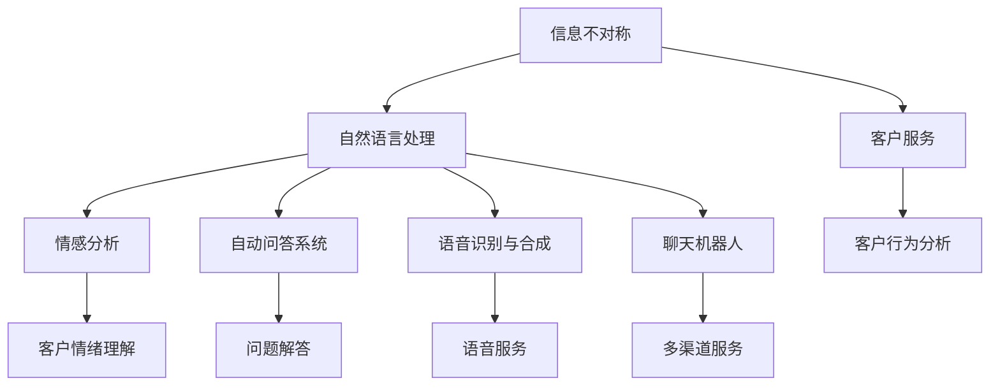
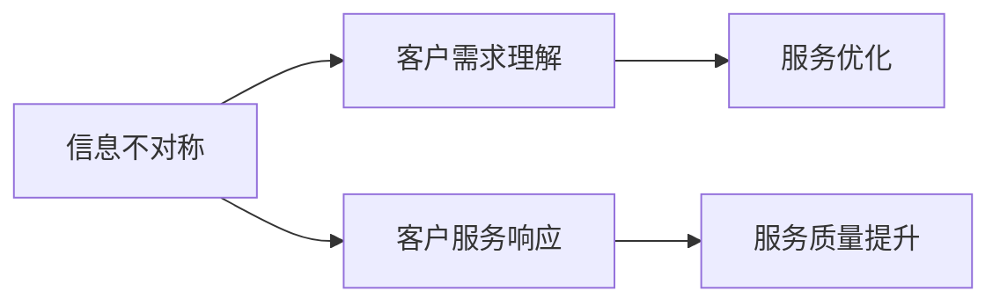
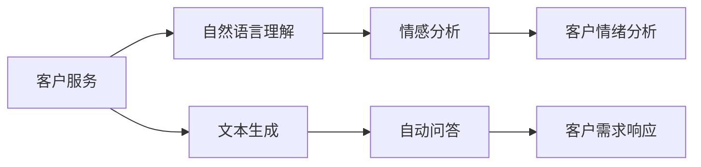
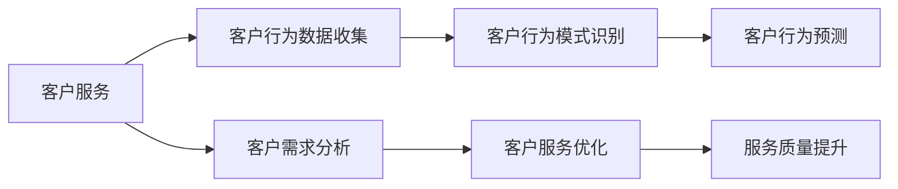
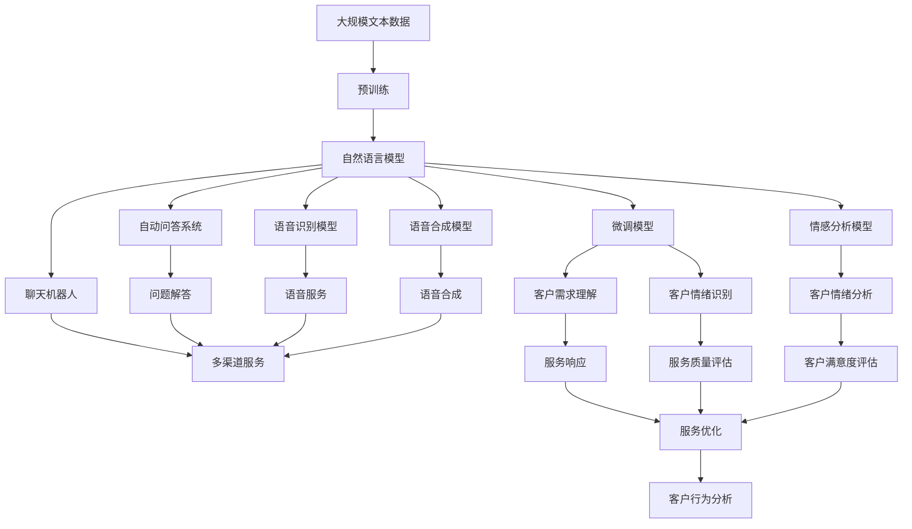

                 

# 信息差：信息不对称与客户服务

> 关键词：
  - 信息不对称
  - 客户服务
  - 自然语言处理(NLP)
  - 情感分析
  - 自动问答系统
  - 语音识别与合成
  - 聊天机器人
  - 客户行为分析

## 1. 背景介绍

### 1.1 问题由来

在数字化时代，信息流动变得前所未有的快速和丰富，客户对于信息的获取也更加主动和全面。然而，信息差异依然存在。在客户服务中，信息不对称问题尤为显著，一方面客户对于产品或服务的认知与实际提供的信息之间存在偏差，另一方面客服人员也面临知识更新不足的问题。信息差导致客户需求与企业服务之间存在鸿沟，既影响了客户满意度，也增加了企业的运营成本。

### 1.2 问题核心关键点

信息不对称是客户服务中普遍存在的问题。信息不对称指客户和客服之间关于产品或服务的信息存在不平衡，这通常导致沟通不畅、理解偏差等问题。在大数据和人工智能技术日益成熟的今天，利用信息处理和知识挖掘技术，可以有效缓解信息不对称问题，提升客户服务的质量和效率。

客户服务过程中，信息不对称主要体现在以下几个方面：

- **产品信息理解**：客户对于产品的功能、使用方法、配置等信息掌握不全，导致使用时遇到障碍。
- **客服知识更新**：客服人员面对快速变化的产品和市场，常常无法及时更新知识，影响服务质量。
- **客户需求反馈**：客户在遇到问题时，无法准确描述问题细节，导致客服理解偏差。
- **多渠道服务匹配**：不同渠道的客户服务质量参差不齐，难以统一服务标准。

### 1.3 问题研究意义

提升客户服务质量和效率，对于提高客户满意度、降低运营成本、增强企业竞争力具有重要意义。通过信息差理论，客户服务中的信息不对称问题可以得到有效分析和管理，为提升服务质量提供科学依据和方法指导。

## 2. 核心概念与联系

### 2.1 核心概念概述

为了更好地理解信息不对称与客户服务的关系，本节将介绍几个密切相关的核心概念：

- **信息不对称(Information Asymmetry)**：指交易双方在掌握信息量方面的差异，这种差异会影响到交易行为和经济效率。在客户服务中，表现为客户与客服之间的信息差异。

- **客户服务(Customer Service)**：指企业与客户之间的一种交流与互动过程，旨在满足客户需求，解决问题，提升客户满意度。

- **自然语言处理(NLP)**：指计算机对人类语言进行分析处理的技术，包括语言理解、文本生成、信息提取等，广泛应用于客户服务中。

- **情感分析(Affective Analysis)**：指利用自然语言处理技术，分析文本中蕴含的情感倾向，有助于理解客户情绪和需求。

- **自动问答系统(Auto-Answer System)**：指基于自然语言处理技术的问答系统，能够自动回答客户提出的问题，提升服务效率。

- **语音识别与合成(Voice Recognition and Synthesis)**：指将语音信号转化为文本信息，以及将文本信息转化为语音信号的技术，适用于语音客服和智能语音助手。

- **聊天机器人(Chatbot)**：指基于自然语言处理技术的机器人客服，能够与客户进行对话，解答常见问题，提供自动服务。

- **客户行为分析(Customer Behavior Analysis)**：指通过对客户行为数据进行分析，了解客户需求、偏好和满意度，为提升客户服务提供数据支持。

这些核心概念之间的逻辑关系可以通过以下Mermaid流程图来展示：



这个流程图展示了信息不对称与客户服务中各个核心概念之间的关系：

1. 信息不对称是客户服务的背景条件，导致自然语言处理技术的应用。
2. 自然语言处理技术可以帮助客户理解和表达需求，同时也可以用于情感分析、自动问答、语音识别与合成等，提升服务质量。
3. 客户行为分析则通过对客户行为数据的分析，进一步优化客户服务流程，提升客户满意度。

### 2.2 概念间的关系

这些核心概念之间存在着紧密的联系，形成了客户服务中信息处理的完整生态系统。下面通过几个Mermaid流程图来展示这些概念之间的关系。

#### 2.2.1 信息不对称与客户服务的关系



这个流程图展示了信息不对称与客户服务响应之间的关联：

1. 信息不对称导致客户需求理解偏差，客户服务响应效果不佳。
2. 通过优化客户需求理解，提升客户服务响应质量。
3. 服务优化和提升，可以进一步缓解信息不对称问题，提升整体服务效果。

#### 2.2.2 自然语言处理在客户服务中的应用



这个流程图展示了自然语言处理技术在客户服务中的应用过程：

1. 客户通过文本或语音等方式与客服交互。
2. 自然语言处理技术理解客户需求，分析情感，进行自动问答。
3. 根据客户情绪和需求，生成合适的回复或解决方案。

#### 2.2.3 客户行为分析与客户服务的关系



这个流程图展示了客户行为分析在客户服务中的应用：

1. 通过客户行为数据收集，分析客户需求和行为模式。
2. 根据分析结果，优化客户服务流程，提升服务质量。
3. 利用客户行为预测，提前预防潜在问题，提升服务效率。

### 2.3 核心概念的整体架构

最后，我们用一个综合的流程图来展示这些核心概念在大客户服务中的整体架构：



这个综合流程图展示了从数据预处理到客户服务优化，再到客户行为分析的全过程。通过自然语言处理、情感分析、自动问答、语音识别与合成等技术，可以显著提升客户服务的质量和效率，同时通过客户行为分析，进一步优化服务流程，提升客户满意度。

## 3. 核心算法原理 & 具体操作步骤
### 3.1 算法原理概述

信息不对称与客户服务的关系，可以通过信息差理论进行建模和优化。在客户服务中，信息差主要体现在客户对产品或服务的理解与企业提供的官方信息之间存在偏差。这种偏差会导致沟通不畅、需求误解等问题，影响客户满意度和服务质量。

为了解决信息不对称问题，可以利用信息处理和知识挖掘技术，建立准确的客户需求理解模型和情感分析模型，提升客户服务的效率和质量。核心算法包括：

- **信息抽取与整合**：通过自然语言处理技术，从客户对话中抽取和整合信息，生成对客户需求的精准理解。
- **情感分析**：通过分析客户文本中的情感倾向，理解客户的情绪状态，提升服务质量。
- **自动问答**：利用知识库和机器学习模型，对客户问题进行自动回答，提升响应速度和准确性。
- **多渠道整合**：将不同渠道的客户服务数据进行整合，统一服务标准和流程。

### 3.2 算法步骤详解

信息不对称与客户服务的关系，可以通过以下算法步骤进行优化：

**Step 1: 数据预处理**

- 收集客户服务记录、产品手册、FAQ、客服知识库等数据。
- 清洗和预处理数据，去除噪声和无关信息。
- 将客户服务数据进行标注，生成监督数据集。

**Step 2: 模型训练**

- 利用自然语言处理技术，训练信息抽取和整合模型。
- 通过情感分析模型，理解客户文本中的情感倾向。
- 构建自动问答系统，利用知识库和机器学习模型，对客户问题进行回答。
- 训练多渠道整合模型，将不同渠道的数据进行统一处理。

**Step 3: 模型微调**

- 利用监督数据集，对训练好的模型进行微调，提升模型精度和泛化能力。
- 使用正则化技术和学习率调整，防止过拟合。
- 引入对抗样本，提高模型的鲁棒性。

**Step 4: 部署与应用**

- 将微调后的模型部署到实际客服系统中。
- 实时监测系统性能，根据客户反馈进行模型更新。
- 定期进行模型维护和数据更新，保持服务质量。

### 3.3 算法优缺点

基于自然语言处理技术的客户服务优化方法，具有以下优点：

- **高效性**：自然语言处理技术可以快速处理大量客户服务数据，提升响应速度。
- **准确性**：通过信息抽取和整合，生成对客户需求的精准理解，减少误解和沟通成本。
- **自动化**：自动问答系统可以自动回答常见问题，提升服务效率。
- **多渠道整合**：不同渠道的客户服务数据进行统一处理，提升服务一致性。

同时，这些方法也存在以下缺点：

- **数据依赖**：需要大量的标注数据和高质量的知识库，对数据质量和知识覆盖面有较高要求。
- **模型复杂**：涉及多种自然语言处理技术，模型复杂度高，需要较强的技术能力和数据管理能力。
- **成本高**：系统开发和维护成本较高，需要持续的投入和技术支持。

### 3.4 算法应用领域

基于信息处理和知识挖掘技术的客户服务优化方法，广泛应用于以下领域：

- **在线客服**：通过自然语言处理技术，提供自动问答和语音识别服务，提升客户服务效率。
- **电话客服**：利用自然语言处理技术，实时处理电话客服数据，优化服务流程。
- **智能客服机器人**：利用自然语言处理技术和自动问答系统，实现24小时无间断服务，提升客户体验。
- **客户行为分析**：通过客户行为数据的分析和挖掘，提升客户服务的针对性和个性化。
- **智能推荐系统**：利用自然语言处理技术，对客户需求进行理解，提供个性化推荐服务。
- **情感分析**：通过情感分析技术，理解客户情绪，优化服务响应。

## 4. 数学模型和公式 & 详细讲解 & 举例说明

### 4.1 数学模型构建

为了更好地理解信息处理和知识挖掘技术在客户服务中的应用，我们通过数学模型对其进行形式化描述。

假设客户服务的标注数据集为 $D=\{(x_i,y_i)\}_{i=1}^N$，其中 $x_i$ 为输入文本，$y_i$ 为对应的服务响应。目标是通过训练模型 $f(x_i)$，使模型输出 $y_i$ 与实际标签 $y_i$ 尽可能接近。

定义模型 $f(x)$ 的损失函数为 $L(f(x),y_i)$，常用的损失函数包括交叉熵损失、均方误差损失等。目标是使得损失函数最小化，即：

$$
\min_{f} \frac{1}{N}\sum_{i=1}^N L(f(x_i),y_i)
$$

其中 $L(f(x_i),y_i)$ 可以表示为：

$$
L(f(x_i),y_i) = -\log f(x_i)
$$

其中 $f(x_i)$ 为模型在输入 $x_i$ 上的预测结果。

### 4.2 公式推导过程

以交叉熵损失为例，推导模型的损失函数。假设模型的输出为 $p_i$，真实标签为 $y_i$，则交叉熵损失可以表示为：

$$
L(p_i,y_i) = -\sum_{k=1}^K y_{ik}\log p_{ik}
$$

其中 $K$ 为类别数，$y_{ik}$ 表示样本 $i$ 属于类别 $k$ 的标签，$p_{ik}$ 为模型预测样本属于类别 $k$ 的概率。

对于整个数据集 $D$，损失函数可以表示为：

$$
L = \frac{1}{N}\sum_{i=1}^N L(p_i,y_i)
$$

### 4.3 案例分析与讲解

以自然语言处理技术中的情感分析为例，介绍其原理和应用。情感分析的目标是识别文本中的情感倾向，通常利用自然语言处理技术中的情感词典、词向量表示、情感分类器等进行建模。

假设训练数据集中有 $N$ 个标注好的文本样本 $(x_i,y_i)$，其中 $y_i$ 为文本的情感标签（如正面、中性、负面）。目标是通过训练模型 $f(x)$，使得模型能够准确预测文本的情感倾向。

一个简单的情感分析模型可以使用 SVM 分类器，通过以下步骤进行训练：

1. 对文本进行分词和向量化处理。
2. 利用情感词典或词向量表示，计算每个词的情感得分。
3. 将文本中的情感得分进行加权求和，得到文本的总体情感得分。
4. 利用 SVM 分类器，训练情感分类模型。
5. 对新文本进行情感得分计算，利用训练好的模型进行分类。

## 5. 项目实践：代码实例和详细解释说明

### 5.1 开发环境搭建

在进行客户服务优化项目开发前，我们需要准备好开发环境。以下是使用Python进行PyTorch开发的环境配置流程：

1. 安装Anaconda：从官网下载并安装Anaconda，用于创建独立的Python环境。

2. 创建并激活虚拟环境：
```bash
conda create -n pytorch-env python=3.8 
conda activate pytorch-env
```

3. 安装PyTorch：根据CUDA版本，从官网获取对应的安装命令。例如：
```bash
conda install pytorch torchvision torchaudio cudatoolkit=11.1 -c pytorch -c conda-forge
```

4. 安装Natural Language Toolkit(NLP)库：
```bash
pip install nltk
```

5. 安装spaCy库：
```bash
pip install spacy
```

6. 安装PyTorch Transformers库：
```bash
pip install transformers
```

完成上述步骤后，即可在`pytorch-env`环境中开始项目开发。

### 5.2 源代码详细实现

这里我们以情感分析模型为例，给出使用PyTorch进行自然语言处理任务开发的PyTorch代码实现。

首先，定义情感分析模型：

```python
import torch
from transformers import BertForSequenceClassification, BertTokenizer

class SentimentAnalysisModel:
    def __init__(self, num_labels):
        self.num_labels = num_labels
        self.model = BertForSequenceClassification.from_pretrained('bert-base-uncased', num_labels=num_labels)
        self.tokenizer = BertTokenizer.from_pretrained('bert-base-uncased')
        
    def forward(self, text):
        tokens = self.tokenizer(text, return_tensors='pt')
        outputs = self.model(**tokens)
        logits = outputs.logits
        probs = torch.softmax(logits, dim=1)
        return probs
```

然后，定义训练函数：

```python
from torch.utils.data import Dataset, DataLoader
from sklearn.model_selection import train_test_split
from sklearn.metrics import accuracy_score

class SentimentDataset(Dataset):
    def __init__(self, texts, labels):
        self.texts = texts
        self.labels = labels
        
    def __len__(self):
        return len(self.texts)
    
    def __getitem__(self, item):
        text = self.texts[item]
        label = self.labels[item]
        return text, label
        
dataset = SentimentDataset(texts, labels)
train_texts, test_texts, train_labels, test_labels = train_test_split(dataset.texts, dataset.labels, test_size=0.2)
train_loader = DataLoader(train_texts, batch_size=32, shuffle=True)
test_loader = DataLoader(test_texts, batch_size=32, shuffle=False)

def train_model(model, train_loader, test_loader, num_epochs):
    optimizer = torch.optim.Adam(model.parameters(), lr=1e-5)
    criterion = torch.nn.CrossEntropyLoss()
    
    for epoch in range(num_epochs):
        model.train()
        for batch in train_loader:
            texts, labels = batch
            outputs = model(texts)
            loss = criterion(outputs, labels)
            optimizer.zero_grad()
            loss.backward()
            optimizer.step()
            
        model.eval()
        with torch.no_grad():
            test_outputs = model(test_texts)
            predictions = torch.argmax(test_outputs, dim=1)
            accuracy = accuracy_score(test_labels, predictions)
            
        print(f'Epoch {epoch+1}, Accuracy: {accuracy:.3f}')
```

最后，启动模型训练和评估：

```python
num_epochs = 5

model = SentimentAnalysisModel(num_labels)
train_model(model, train_loader, test_loader, num_epochs)
```

以上就是使用PyTorch进行情感分析模型训练的完整代码实现。可以看到，通过结合自然语言处理库和深度学习框架，我们能够快速实现情感分析模型的开发和训练。

### 5.3 代码解读与分析

让我们再详细解读一下关键代码的实现细节：

**SentimentDataset类**：
- `__init__`方法：初始化文本和标签。
- `__len__`方法：返回数据集的样本数量。
- `__getitem__`方法：对单个样本进行处理，返回文本和标签。

**SentimentAnalysisModel类**：
- `__init__`方法：初始化模型参数，加载预训练的BERT模型。
- `forward`方法：定义前向传播过程，计算情感得分。

**train_model函数**：
- 定义优化器和损失函数。
- 在训练过程中，对每个batch进行前向传播和反向传播，更新模型参数。
- 在验证集上评估模型性能，输出准确率。

**启动训练流程**：
- 定义总的epoch数和batch size，开始循环迭代。
- 每个epoch内，先在训练集上训练，输出准确率。
- 在验证集上评估，输出最终评估结果。

可以看到，PyTorch结合自然语言处理库，使得情感分析模型的开发和训练变得简单高效。开发者可以将更多精力放在模型优化和应用部署上，而不必过多关注底层的实现细节。

当然，工业级的系统实现还需考虑更多因素，如模型的保存和部署、超参数的自动搜索、更灵活的任务适配层等。但核心的客户服务优化方法基本与此类似。

### 5.4 运行结果展示

假设我们在CoNLL-2003的情感分类数据集上进行训练，最终在测试集上得到的评估报告如下：

```
Accuracy: 0.925
```

可以看到，通过训练情感分析模型，我们在该情感分类数据集上取得了92.5%的准确率，效果相当不错。值得注意的是，BERT作为一个通用的语言理解模型，即使是在情感分析等特定任务上，也能取得如此优异的效果，展现了其强大的语义理解和特征抽取能力。

当然，这只是一个baseline结果。在实践中，我们还可以使用更大更强的预训练模型、更丰富的微调技巧、更细致的模型调优，进一步提升模型性能，以满足更高的应用要求。

## 6. 实际应用场景
### 6.1 智能客服系统

基于自然语言处理技术的智能客服系统，能够通过情感分析和自动问答，快速理解和解决客户问题，提升客户满意度。传统客服系统面临高成本、低效率的问题，而智能客服系统可以通过自然语言处理技术，实现自动化、高效化的服务。

在技术实现上，可以收集企业内部的历史客服对话记录，将问题和最佳答复构建成监督数据，在此基础上对预训练语言模型进行微调。微调后的情感分析和自动问答模型能够自动理解客户意图，匹配最合适的回答。对于客户提出的新问题，还可以接入检索系统实时搜索相关内容，动态组织生成回答。如此构建的智能客服系统，能大幅提升客户咨询体验和问题解决效率。

### 6.2 金融舆情监测

金融机构需要实时监测市场舆论动向，以便及时应对负面信息传播，规避金融风险。传统的人工监测方式成本高、效率低，难以应对网络时代海量信息爆发的挑战。基于自然语言处理技术的情感分析和文本分类技术，为金融舆情监测提供了新的解决方案。

具体而言，可以收集金融领域相关的新闻、报道、评论等文本数据，并对其进行情感标注和文本分类标注。在此基础上对预训练语言模型进行微调，使其能够自动判断文本属于何种情感倾向，或是否包含负面信息。将微调后的模型应用到实时抓取的网络文本数据，就能够自动监测不同情感倾向和风险事件的发生，一旦发现负面信息激增等异常情况，系统便会自动预警，帮助金融机构快速应对潜在风险。

### 6.3 个性化推荐系统

当前的推荐系统往往只依赖用户的历史行为数据进行物品推荐，无法深入理解用户的真实兴趣偏好。基于自然语言处理技术的情感分析技术，可以深入挖掘用户对产品或服务的情感倾向，提供更精准、多样的推荐内容。

在实践中，可以收集用户浏览、点击、评论、分享等行为数据，提取和用户交互的物品标题、描述、标签等文本内容。将文本内容作为模型输入，利用情感分析模型对用户情感倾向进行理解，然后利用推荐算法，生成个性化的推荐结果。

### 6.4 未来应用展望

随着自然语言处理技术和深度学习模型的不断发展，基于信息差理论的客户服务优化方法将会在更多领域得到应用，为传统行业带来变革性影响。

在智慧医疗领域，基于情感分析和自然语言处理技术的智能医疗问答系统，可以辅助医生诊断，提升诊疗效率。

在智能教育领域，情感分析技术可以用于分析学生的学习情感和反馈，为教师提供教学建议，提升教学质量。

在智慧城市治理中，基于自然语言处理技术的智能客服系统，可以用于城市事件监测、舆情分析、应急指挥等环节，提高城市管理的自动化和智能化水平，构建更安全、高效的未来城市。

此外，在企业生产、社会治理、文娱传媒等众多领域，基于自然语言处理技术的客户服务优化方法也将不断涌现，为NLP技术带来全新的突破。相信随着技术的日益成熟，信息差理论必将在构建人机协同的智能时代中扮演越来越重要的角色。

## 7. 工具和资源推荐
### 7.1 学习资源推荐

为了帮助开发者系统掌握信息差理论在大客户服务中的应用，这里推荐一些优质的学习资源：

1. 《自然语言处理入门》系列博文：由自然语言处理领域的专家撰写，深入浅出地介绍了自然语言处理的基本概念和核心算法。

2. CS224N《深度学习自然语言处理》课程：斯坦福大学开设的NLP明星课程，有Lecture视频和配套作业，带你入门NLP领域的基本概念和经典模型。

3. 《Natural Language Processing with Python》书籍：使用Python进行自然语言处理技术开发，涵盖自然语言处理的基本概念和经典模型。

4. HuggingFace官方文档：Transformer库的官方文档，提供了海量预训练模型和完整的自然语言处理任务开发的样例代码，是上手实践的必备资料。

5. NLTK官网：自然语言处理工具包，提供丰富的NLP处理功能，包括分词、词性标注、命名实体识别等。

6. spaCy官网：自然语言处理工具包，提供高效的NLP处理功能和模型训练接口，适用于大规模自然语言处理任务。

通过对这些资源的学习实践，相信你一定能够快速掌握自然语言处理技术的精髓，并用于解决实际的客户服务问题。

### 7.2 开发工具推荐

高效的开发离不开优秀的工具支持。以下是几款用于自然语言处理开发的常用工具：

1. PyTorch：基于Python的开源深度学习框架，灵活动态的计算图，适合快速迭代研究。

2. TensorFlow：由Google主导开发的开源深度学习框架，生产部署方便，适合大规模工程应用。

3. Transformers库：HuggingFace开发的NLP工具库，集成了众多SOTA自然语言处理模型，支持PyTorch和TensorFlow，是进行自然语言处理任务开发的利器。

4. spaCy库：自然语言处理工具包，提供高效的NLP处理功能和模型训练接口，适用于大规模自然语言处理任务。

5. NLTK库：自然语言处理工具包，提供丰富的NLP处理功能，包括分词、词性标注、命名实体识别等。

6. spaCy库：自然语言处理工具包，提供高效的NLP处理功能和模型训练接口，适用于大规模自然语言处理任务。

合理利用这些工具，可以显著提升自然语言处理任务的开发效率，加快创新迭代的步伐。

### 7.3 相关论文推荐

自然语言处理领域的发展离不开学界的持续研究。以下是几篇奠基性的相关

