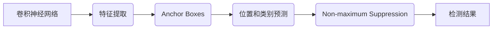
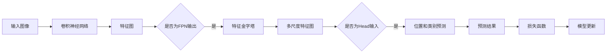

# YOLOv5原理与代码实例讲解

> 关键词：YOLO, 目标检测, 物体检测, 深度学习, 卷积神经网络, anchor boxes, loss function, 算法优化

## 1. 背景介绍

目标检测是计算机视觉领域的一个重要分支，旨在同时定位和分类图像中的多个物体。近年来，深度学习技术在目标检测领域取得了显著的突破，其中YOLO（You Only Look Once）系列算法因其速度快、准确率高而备受关注。YOLOv5是YOLO系列的最新版本，它在性能和效率上进行了多项优化，成为了目前目标检测领域最受欢迎的开源框架之一。

## 2. 核心概念与联系

### 2.1 核心概念原理

YOLOv5的核心概念主要包括以下几部分：

- **卷积神经网络（CNN）**：作为YOLOv5的骨干网络，CNN负责提取图像特征。
- **Anchor Boxes**：YOLOv5使用Anchor Boxes来预测物体的位置和类别。
- **Loss Function**：用于训练过程中计算预测结果与真实标签之间的差异。
- **Non-maximum Suppression（NMS）**：用于去除重叠的检测框。

以下是一个Mermaid流程图，展示了YOLOv5的核心概念及其相互关系：



### 2.2 架构图

YOLOv5的架构可以分为以下几个部分：

- **输入**：原始图像。
- **骨干网络**：通常使用CSPDarknet53作为骨干网络，负责提取图像特征。
- **特征金字塔网络（FPN）**：用于构建多尺度特征图，提高小物体检测的准确性。
- **Head**：包含位置和类别预测模块，以及Anchor Boxes。
- **NMS**：对预测结果进行筛选，去除重叠的检测框。

## 3. 核心算法原理 & 具体操作步骤

### 3.1 算法原理概述

YOLOv5的核心算法原理可以概括为以下几个步骤：

1. **特征提取**：使用骨干网络提取图像特征。
2. **特征金字塔构建**：使用FPN构建多尺度特征图。
3. **位置和类别预测**：在特征图上预测物体的位置和类别。
4. **Loss Function计算**：计算预测结果与真实标签之间的差异。
5. **模型更新**：根据Loss Function更新模型参数。
6. **NMS**：对预测结果进行筛选，去除重叠的检测框。

### 3.2 算法步骤详解

1. **特征提取**：使用CSPDarknet53作为骨干网络，提取图像特征。
2. **特征金字塔构建**：使用FPN将骨干网络的输出特征图进行多尺度拼接，构建特征金字塔。
3. **位置和类别预测**：在每个特征图上，使用Anchor Boxes预测物体的位置和类别。每个Anchor Box包含四个参数：宽、高、x中心、y中心，以及一个置信度用于表示预测的准确性。
4. **Loss Function计算**：计算预测结果与真实标签之间的差异，包括位置损失、置信度损失和类别损失。
5. **模型更新**：根据Loss Function更新模型参数。
6. **NMS**：对预测结果进行筛选，去除重叠的检测框，最终得到最终的检测结果。

### 3.3 算法优缺点

**优点**：

- 快速：YOLOv5的检测速度非常快，适合实时应用。
- 准确：在大多数目标检测任务中，YOLOv5的检测精度都很高。
- 开源：YOLOv5是一个开源框架，可以免费使用。

**缺点**：

- 对小物体检测效果不如其他算法，如RetinaNet。
- 在复杂场景中，可能出现误检和漏检。

### 3.4 算法应用领域

YOLOv5可以应用于以下领域：

- 自动驾驶
- 智能视频监控
- 图像分割
- 物体跟踪
- 工业检测

## 4. 数学模型和公式 & 详细讲解 & 举例说明

### 4.1 数学模型构建

YOLOv5的数学模型主要包括以下部分：

- **卷积神经网络**：卷积神经网络（CNN）是一种前馈神经网络，由卷积层、激活层、池化层等组成。
- **Anchor Boxes**：Anchor Boxes是一组预设的边界框，用于预测物体的位置和类别。
- **Loss Function**：Loss Function用于计算预测结果与真实标签之间的差异。

以下是一个Mermaid流程图，展示了YOLOv5的数学模型：



### 4.2 公式推导过程

以下是一个简化的Loss Function的推导过程：

$$
\text{Loss} = \text{位置损失} + \text{置信度损失} + \text{类别损失}
$$

- **位置损失**：
$$
\text{位置损失} = \frac{1}{N} \sum_{i=1}^{N} \left( \frac{w}{w'} \right)^2 \left( \frac{h}{h'} \right)^2 \left( \frac{cx - c_x}{w'} \right)^2 \left( \frac{cy - c_y}{h'} \right)^2
$$

其中 $w, h, cx, cy$ 为真实边界框的宽、高、x中心、y中心；$w', h', c_x, c_y$ 为预测边界框的宽、高、x中心、y中心。

- **置信度损失**：
$$
\text{置信度损失} = \text{logit}(\hat{y}) - \text{logit}(y)
$$

其中 $\hat{y}$ 为预测的置信度，$y$ 为真实的置信度。

- **类别损失**：
$$
\text{类别损失} = \text{logit}(y_i) - \text{logit}(\hat{y}_i)
$$

其中 $y_i$ 为真实的类别标签，$\hat{y}_i$ 为预测的类别标签。

### 4.3 案例分析与讲解

以下是一个简单的案例，展示了如何使用YOLOv5进行目标检测：

1. **数据准备**：准备包含目标检测数据的训练集和测试集。
2. **模型训练**：使用训练集对YOLOv5模型进行训练。
3. **模型评估**：使用测试集评估模型的性能。
4. **模型部署**：将训练好的模型部署到实际应用中。

## 5. 项目实践：代码实例和详细解释说明

### 5.1 开发环境搭建

1. 安装Python环境。
2. 安装TensorFlow或PyTorch。
3. 安装YOLOv5库。

### 5.2 源代码详细实现

以下是一个使用YOLOv5进行目标检测的简单示例：

```python
import cv2
import numpy as np
import torch
from PIL import Image

from models.experimental import attempt_load
from utils.datasets import LoadStreams, LoadImages
from utils.general import non_max_suppression, scale_coords

# 加载模型
model = attempt_load('yolov5s.pt')  # 加载s版本模型
model.eval()

# 加载视频或图片
imgsz = 640
source = 'data/images'  # 视频或图片文件夹路径
webcam = False  # 是否使用摄像头
imgsz = 640

if webcam:
    source = 0  # 摄像头
else:
    source = 'data/images'

cap = cv2.VideoCapture(source)

while True:
    ret, img = cap.read()
    if not ret:
        break
    img = Image.fromarray(img)
    img = img.resize((imgsz, imgsz))

    # 预测
    img = torch.from_numpy(img).to(device)
    img = img.float()  # uint8 to fp16/32
    img /= 255.0  # 归一化
    if img.ndimension() == 3:
        img = img.unsqueeze(0)

    pred = model(img, augment=False)[0]

    # NMS
    pred = non_max_suppression(pred, 0.4, 0.5, None, False, max_det=1000)

    # 解码预测结果
    for i, det in enumerate(pred):  # 检测到多个目标
        p, s, im0 = path, '', img

        s += '%gx%g ' % img.shape[2:]  # 打印图片尺寸
        if len(det):
            det[:, :4] = scale_coords(img.shape[2:], det[:, :4], im0.shape).round()

            for c in det[:, -1].unique():
                n = (det[:, -1] == c).sum()  # 当前类别的数量
                s += '%g %s ' % (n, names[int(c)])  # 打印类别和数量

            # 打印框和标签
            for *xyxy, conf, cls in reversed(det):
                label = '%s %.2f' % (names[int(cls)], conf)
                print(label)
                cv2.rectangle(im0, xyxy, (255, 255, 255), 2)
                cv2.putText(im0, label, xyxy[0:2], cv2.FONT_HERSHEY_SIMPLEX, 0.5, (255, 255, 255), 2)

        print(s)

    cv2.imshow('img', im0)
    if cv2.waitKey(1) & 0xFF == ord('q'):
        break

cap.release()
cv2.destroyAllWindows()
```

### 5.3 代码解读与分析

以上代码展示了如何使用YOLOv5进行目标检测的基本流程：

1. 加载模型：使用`attempt_load`函数加载预训练的YOLOv5模型。
2. 加载视频或图片：使用`LoadImages`函数加载视频或图片。
3. 预测：使用加载的模型对图片进行预测。
4. NMS：使用`non_max_suppression`函数对预测结果进行NMS处理，去除重叠的检测框。
5. 解码预测结果：将预测结果解码为框坐标和类别标签。
6. 打印结果：打印图片尺寸、类别和数量，并在图片上绘制检测框和标签。
7. 退出：按下'q'键退出程序。

### 5.4 运行结果展示

运行以上代码，将显示包含检测结果的视频或图片。

## 6. 实际应用场景

YOLOv5可以应用于以下场景：

- **智能视频监控**：自动识别和跟踪视频中的行人、车辆等物体。
- **自动驾驶**：实时检测和跟踪道路上的行人、车辆、交通标志等。
- **工业检测**：自动检测生产线上不合格的产品。
- **医疗影像分析**：自动检测医学影像中的病变区域。

## 7. 工具和资源推荐

### 7.1 学习资源推荐

- YOLOv5官方文档：https://github.com/ultralytics/yolov5
- YOLO系列论文：https://arxiv.org/abs/1506.02640
- 卷积神经网络基础：https://cs231n.github.io/

### 7.2 开发工具推荐

- TensorFlow：https://www.tensorflow.org/
- PyTorch：https://pytorch.org/
- OpenCV：https://opencv.org/

### 7.3 相关论文推荐

- YOLO: Real-Time Object Detection with Deep Neural Networks
- YOLO9000: Better, Faster, Stronger
- YOLOv3: An Incremental Improvement
- YOLOv4: Optimal Speed and Accuracy of Object Detection

## 8. 总结：未来发展趋势与挑战

### 8.1 研究成果总结

YOLOv5是YOLO系列中性能和效率都得到显著提升的一个版本，它在目标检测领域取得了显著的突破。YOLOv5的快速、准确和开源等特点使其成为目前最受欢迎的开源框架之一。

### 8.2 未来发展趋势

- **多尺度检测**：未来YOLOv5可能会引入多尺度检测技术，以提高小物体检测的准确性。
- **轻量化设计**：随着移动设备的普及，YOLOv5可能会向轻量化方向发展，以适应移动端部署。
- **跨模态目标检测**：YOLOv5可能会与其他模态（如语音、图像）进行融合，实现跨模态目标检测。

### 8.3 面临的挑战

- **小物体检测**：YOLOv5在检测小物体时，容易出现误检和漏检。
- **复杂场景检测**：在复杂场景中，YOLOv5可能会受到遮挡、光照等因素的影响，导致检测效果下降。

### 8.4 研究展望

YOLOv5作为目标检测领域的一个重要框架，将在未来的研究中不断发展和完善。相信随着深度学习技术的不断发展，YOLOv5将会在更多领域发挥重要作用。

## 9. 附录：常见问题与解答

**Q1：YOLOv5为什么比其他目标检测算法更快？**

A：YOLOv5的检测速度快主要归功于以下几个方面：
1. **单阶段检测**：YOLOv5采用单阶段检测策略，避免了多阶段检测中的目标提议生成和边界框回归步骤，从而提高了检测速度。
2. **轻量级网络**：YOLOv5使用了轻量级的网络结构，减少了计算量和内存消耗。
3. **GPU加速**：YOLOv5充分利用GPU加速计算，提高了检测速度。

**Q2：YOLOv5是否支持实时检测？**

A：是的，YOLOv5可以支持实时检测。在配置较高的设备上，YOLOv5的检测速度可以达到每秒数十帧。

**Q3：YOLOv5如何处理遮挡物体？**

A：YOLOv5在检测遮挡物体时，可能会出现误检和漏检。为了提高检测效果，可以采取以下措施：
1. **数据增强**：使用数据增强技术，如随机遮挡、随机旋转等，增强模型的鲁棒性。
2. **更复杂的网络结构**：使用更复杂的网络结构，如DeepLabv3+，提高模型的特征提取能力。

**Q4：YOLOv5的准确率如何？**

A：YOLOv5的准确率取决于具体的应用场景和数据集。在大多数目标检测任务中，YOLOv5的准确率都很高。

**Q5：YOLOv5是否开源？**

A：是的，YOLOv5是一个开源框架，可以免费使用。


---

作者：禅与计算机程序设计艺术 / Zen and the Art of Computer Programming