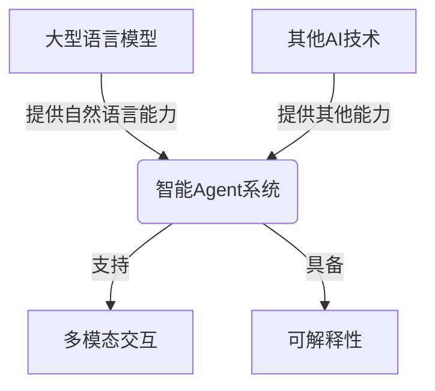
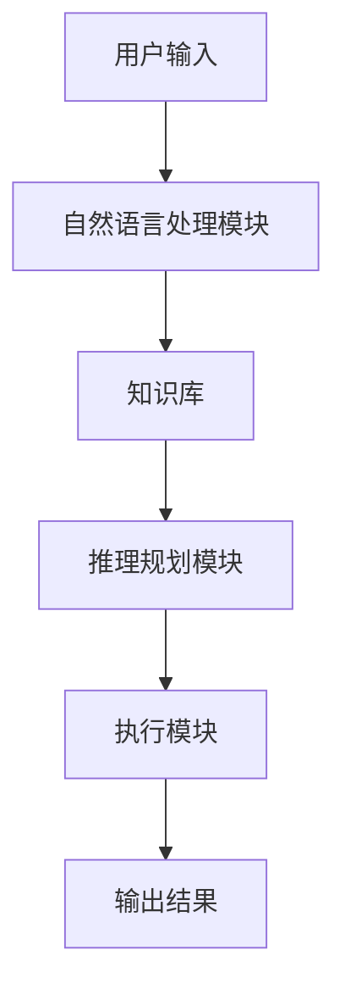

以下是文章正文部分：

# 【大模型应用开发 动手做AI Agent】基于大模型的Agent技术框架

## 1. 背景介绍

### 1.1 问题的由来

随着人工智能技术的不断发展,大型语言模型(Large Language Models, LLMs)在自然语言处理领域取得了令人瞩目的成就。这些模型通过从海量文本数据中学习,能够生成看似人类写作的自然语言输出。然而,现有的大型语言模型大多是为特定的任务而训练的,缺乏通用性和交互性。

为了充分发挥大型语言模型的潜力,需要将其与其他AI技术相结合,构建一个综合的智能Agent系统。这种Agent不仅能够理解和生成自然语言,还能根据用户的需求执行各种任务,如信息检索、问答、决策辅助等,为用户提供更加智能和个性化的服务体验。

### 1.2 研究现状

目前,已有一些初步的尝试将大型语言模型应用于构建智能Agent系统。例如,OpenAI的ChatGPT通过对GPT-3进行特定的指令精调(Instruction Tuning),使其能够根据用户的自然语言指令执行各种任务。另一个例子是Anthropic的Constitutional AI,它结合了大型语言模型和其他AI组件,旨在构建一个具有一致性、诚实性和有益性的智能Agent。

然而,现有的智能Agent系统还存在一些不足之处,例如:

- 缺乏灵活性和可扩展性,难以无缝集成新的功能模块
- 交互方式单一,无法充分利用多模态交互的优势
- 决策过程缺乏透明度和可解释性
- 安全性和可控性有待加强

### 1.3 研究意义

构建一个基于大型语言模型的综合智能Agent系统,对于推动人工智能技术的发展具有重要意义:

1. 提高人机交互的自然性和智能化水平,为用户带来更加人性化的体验。
2. 将大型语言模型的强大语言理解和生成能力与其他AI技术相结合,发挥协同增强作用,推动AI技术的综合应用。
3. 探索智能Agent系统的设计原理和架构,为构建通用人工智能(Artificial General Intelligence, AGI)系统奠定基础。
4. 研究智能Agent系统的安全性、可控性和可解释性,促进人工智能的可信赖和负责任发展。

### 1.4 本文结构

本文将围绕基于大型语言模型的智能Agent系统的构建,介绍相关的核心概念、算法原理、数学模型、实践案例和应用场景等内容。文章主要分为以下几个部分:

1. 核心概念与联系
2. 核心算法原理与具体操作步骤
3. 数学模型和公式详细讲解与案例分析
4. 项目实践:代码实例和详细解释说明
5. 实际应用场景
6. 工具和资源推荐
7. 总结:未来发展趋势与挑战
8. 附录:常见问题与解答

## 2. 核心概念与联系

在探讨基于大模型的智能Agent系统之前,我们需要先了解一些核心概念及它们之间的联系。

### 2.1 大型语言模型(Large Language Models, LLMs)

大型语言模型是一种基于深度学习的自然语言处理模型,通过从海量文本数据中学习,能够生成看似人类写作的自然语言输出。常见的大型语言模型包括GPT-3、BERT、XLNet等。这些模型具有极强的语言理解和生成能力,但缺乏通用性和交互性。

### 2.2 智能Agent(Intelligent Agent)

智能Agent是一种能够感知环境、作出决策并执行行动的自主系统。一个理想的智能Agent应该具备以下几个关键能力:

1. 自然语言交互能力
2. 知识库和推理能力
3. 任务规划和执行能力
4. 持续学习和自我完善能力

智能Agent系统通常由多个模块组成,如自然语言处理模块、知识库、规划模块、执行模块等。

### 2.3 多模态交互(Multimodal Interaction)

多模态交互是指在人机交互过程中,利用多种模态(如文本、语音、图像、视频等)进行信息交换和处理。相比单一模态,多模态交互能够提供更加自然、高效和富有表现力的交互体验。

### 2.4 可解释性(Explainability)

可解释性是指AI系统能够以人类可以理解的方式解释其决策和行为的过程和原因。提高AI系统的可解释性,有助于增强人们对系统的信任,并促进AI的负责任发展。

### 2.5 概念关联

上述核心概念之间存在紧密的联系:

- 大型语言模型为智能Agent提供了强大的自然语言理解和生成能力
- 智能Agent将大型语言模型与其他AI技术(如知识库、规划、执行等)相结合,形成一个综合系统
- 多模态交互使智能Agent能够以更加自然的方式与人进行交互
- 提高智能Agent的可解释性,有助于增强人们对系统的信任度

构建一个基于大型语言模型的智能Agent系统,需要将这些核心概念有机地结合起来。

## 3. 核心算法原理 & 具体操作步骤

### 3.1 算法原理概述

构建基于大模型的智能Agent系统,需要将多种算法和技术有机结合,包括:

1. **大型语言模型**: 用于自然语言理解和生成,如GPT-3、BERT等。
2. **指令精调(Instruction Tuning)**: 通过对大型语言模型进行指令级别的微调,使其能够根据指令执行特定任务。
3. **多任务学习(Multi-Task Learning)**: 在单个模型中整合多个任务,提高模型的泛化能力和效率。
4. **知识库**: 存储结构化和非结构化知识,为Agent提供背景知识和常识推理能力。
5. **规划算法**: 根据目标和约束条件,生成执行任务所需的行动序列,如启发式搜索、强化学习等。
6. **执行模块**: 将规划好的行动序列具体执行,可能涉及与外部系统或API的交互。

这些算法和技术通过有机结合,形成一个完整的智能Agent系统,能够理解用户的自然语言指令,利用知识库进行推理,生成行动计划并加以执行,最终完成用户的需求。

### 3.2 算法步骤详解

构建基于大模型的智能Agent系统的具体步骤如下:

1. **收集和预处理数据**
   - 收集用于训练大型语言模型的文本数据
   - 收集用于构建知识库的结构化和非结构化知识
   - 对数据进行必要的清洗、标注和预处理

2. **训练大型语言模型**
   - 使用自监督学习方法(如掩码语言模型)在大规模文本数据上预训练大型语言模型
   - 根据需要,可以进一步对模型进行指令精调或多任务学习等微调

3. **构建知识库**
   - 设计知识库的数据模型和存储结构
   - 从各种来源收集知识,并导入知识库
   - 实现知识查询、推理和更新等功能

4. **开发规划模块**
   - 选择合适的规划算法,如启发式搜索、强化学习等
   - 设计状态空间、行动空间和奖励函数
   - 训练或调优规划模型,使其能够生成高质量的行动序列

5. **构建执行模块**
   - 实现与外部系统或API的交互接口
   - 执行规划模块生成的行动序列
   - 处理执行过程中的异常和错误

6. **集成和优化**
   - 将上述各个模块集成到智能Agent系统中
   - 进行端到端的训练和优化,提高系统的整体性能
   - 引入可解释性机制,增强系统的透明度和可信赖性

7. **部署和维护**
   - 将智能Agent系统部署到生产环境中
   - 监控系统运行状况,及时发现和修复问题
   - 根据用户反馈和新需求,持续优化和迭代系统

### 3.3 算法优缺点

基于大模型的智能Agent系统具有以下优点:

- 利用大型语言模型的强大语言能力,提供自然和高效的人机交互体验
- 将多种AI技术有机结合,发挥协同增强作用,提高系统的综合能力
- 具备一定的通用性,可以应对多种任务场景
- 通过持续学习,系统能力可以不断提升

同时,这种系统也存在一些缺点和挑战:

- 训练和部署成本高,需要大量的计算资源和数据
- 系统复杂度较高,集成和优化难度较大
- 存在潜在的安全和隐私风险,需要采取有效的风控措施
- 决策过程的可解释性和可控性有待加强

### 3.4 算法应用领域

基于大模型的智能Agent系统具有广阔的应用前景,可以在多个领域发挥作用:

- **智能助手**: 为用户提供自然语言交互式的个人助理服务,如信息查询、任务规划、决策辅助等。
- **客户服务**: 在客户服务场景中,智能Agent可以提供7x24小时的智能化服务支持。
- **教育**: 作为智能教学助手,为学生提供个性化的学习辅导和答疑解惑。
- **医疗健康**: 辅助医生进行病情诊断、治疗方案制定和患者随访等工作。
- **金融**: 为投资者提供智能投资咨询,或协助从业人员进行风险评估和合规审查。
- **制造业**: 优化生产流程,提高运营效率,实现预测性维护等。

随着技术的不断进步,基于大模型的智能Agent系统的应用场景将越来越广泛。

## 4. 数学模型和公式 & 详细讲解 & 举例说明

在构建基于大模型的智能Agent系统时,需要使用多种数学模型和公式,下面将对其中几个核心模型进行详细讲解。

### 4.1 大型语言模型

大型语言模型通常采用自注意力机制(Self-Attention)和Transformer架构,能够有效捕获长距离依赖关系。其中,自注意力机制是模型的核心,可以用以下公式表示:

$$\begin{aligned}
\text{Attention}(Q, K, V) &= \text{softmax}\left(\frac{QK^T}{\sqrt{d_k}}\right)V \
\text{MultiHead}(Q, K, V) &= \text{Concat}(head_1, \ldots, head_h)W^O\
\text{where}&\; \text{head}_i = \text{Attention}(QW_i^Q, KW_i^K, VW_i^V)
\end{aligned}$$

其中,$Q$、$K$、$V$分别表示查询(Query)、键(Key)和值(Value)。$d_k$是缩放因子,用于防止点积的方差过大。MultiHead表示使用多个注意力头,以捕获不同的关系。$W_i^Q$、$W_i^K$、$W_i^V$和$W^O$是可训练的权重矩阵。

通过自注意力机制,模型可以自适应地为每个目标词分配不同的注意力权重,从而更好地建模长距离依赖关系。

另一个重要的技术是掩码语言模型(Masked Language Model, MLM),它通过随机掩码部分输入词,并让模型预测被掩码的词,从而实现自监督学习。MLM的目标函数可表示为:

$$\mathcal{L}_\text{MLM} = -\mathbb{E}_{x, m}\left[\sum_{i \in m}\log P(x_i|x_{\m})\right]$$

其中,$x$表示输入序列,$m$表示被掩码的位置,$x_