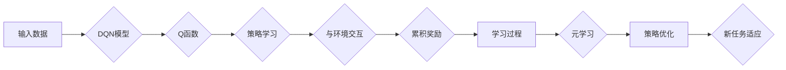

# 一切皆是映射：DQN的元学习应用：如何快速适应新任务

> 关键词：深度强化学习，DQN，元学习，迁移学习，快速适应，映射学习，策略梯度

## 1. 背景介绍

在人工智能领域，深度强化学习（Deep Reinforcement Learning，DRL）已经取得了显著的进展，尤其是在游戏、机器人控制和智能推荐系统等领域。DRL通过让智能体在与环境的交互中学习最优策略，实现了许多令人瞩目的成就。然而，传统的DRL方法往往需要大量的数据和时间来学习特定任务的最优策略。在这种情况下，如何让DRL模型能够快速适应新任务，成为了研究者们关注的焦点。

元学习（Meta-Learning）作为一种学习如何学习的方法，为DRL的快速适应新任务提供了一种新的思路。本文将探讨DQN（Deep Q-Network）的元学习应用，介绍如何通过元学习让DQN模型快速适应新任务。

## 2. 核心概念与联系

### 2.1 核心概念

- **深度强化学习（DRL）**：一种结合了深度学习和强化学习的方法，通过神经网络来学习智能体的动作策略，以实现与环境交互，并最大化累积奖励。
- **DQN（Deep Q-Network）**：一种基于深度学习的Q学习算法，通过神经网络来近似Q函数，从而学习策略。
- **元学习（Meta-Learning）**：一种学习如何学习的方法，旨在提高学习器在不同任务上的泛化能力。
- **迁移学习（Transfer Learning）**：一种将知识从一个领域迁移到另一个相关领域的学习方法。

### 2.2 核心概念原理和架构的 Mermaid 流程图



### 2.3 核心概念联系

DQN通过学习Q函数来学习策略，与环境交互并累积奖励。元学习则通过学习如何学习，提高DQN在不同任务上的泛化能力。迁移学习将预训练的知识迁移到新任务，帮助DQN更快地适应新环境。

## 3. 核心算法原理 & 具体操作步骤

### 3.1 算法原理概述

DQN的元学习应用主要包括以下几个步骤：

1. **预训练阶段**：在多个不同的任务上对DQN进行预训练，使其学习到通用的策略。
2. **元学习阶段**：通过元学习算法，学习如何快速适应新任务。
3. **新任务适应阶段**：将预训练的DQN应用于新任务，并通过元学习算法调整策略，使其快速适应新任务。

### 3.2 算法步骤详解

1. **数据收集**：收集多个不同任务的训练数据，用于预训练DQN。
2. **预训练DQN**：在收集到的数据上训练DQN，使其学习到通用的策略。
3. **元学习算法选择**：选择合适的元学习算法，如MAML、Reptile等。
4. **元学习阶段**：在元学习算法的指导下，使用新任务数据对预训练的DQN进行调整，使其快速适应新任务。
5. **新任务适应**：在新任务上测试DQN的性能，并根据元学习算法的结果进一步调整策略。

### 3.3 算法优缺点

**优点**：

- **快速适应新任务**：通过元学习，DQN能够快速适应新任务，减少对新数据的学习时间。
- **提高泛化能力**：通过在多个任务上预训练，DQN能够学习到更通用的策略，提高泛化能力。

**缺点**：

- **计算成本高**：元学习算法通常需要大量的计算资源。
- **对新任务的适应性有限**：在某些情况下，元学习算法可能无法完全适应新任务。

### 3.4 算法应用领域

DQN的元学习应用主要适用于以下领域：

- **机器人控制**：机器人需要快速适应不同的环境和任务。
- **游戏**：游戏环境变化多端，需要快速适应新的游戏规则和策略。
- **推荐系统**：推荐系统需要根据用户行为的变化快速调整推荐策略。

## 4. 数学模型和公式 & 详细讲解 & 举例说明

### 4.1 数学模型构建

DQN的数学模型主要包括以下几个部分：

- **状态空间（S）**：智能体的当前状态。
- **动作空间（A）**：智能体可以采取的动作集合。
- **奖励函数（R）**：根据智能体的动作和状态计算得到的奖励值。
- **策略函数（π）**：智能体在给定状态下采取的动作概率分布。
- **Q函数（Q(S,A)）**：在状态S下采取动作A的期望累积奖励。

### 4.2 公式推导过程

DQN的目标是学习Q函数，使得：

$$
Q^*(S,A) = \mathbb{E}[R + \gamma \max_{a' \in A} Q^*(S',a') | S,A]
$$

其中，$Q^*$为最优Q函数，$\gamma$为折扣因子。

### 4.3 案例分析与讲解

假设有一个智能体在无人驾驶环境中学习驾驶策略。状态空间S包含车辆的当前位置、速度、转向角度等信息，动作空间A包含加速、减速、左转、右转等动作。奖励函数R根据车辆行驶的距离、油耗、安全等因素计算得到。

通过DQN的元学习应用，智能体可以在多个不同的无人驾驶场景中学习到通用的驾驶策略。当智能体面对一个全新的驾驶环境时，可以通过元学习算法快速调整策略，适应新的环境。

## 5. 项目实践：代码实例和详细解释说明

### 5.1 开发环境搭建

为了演示DQN的元学习应用，我们将使用Python和TensorFlow框架进行实现。以下为环境搭建步骤：

1. 安装Python 3.6及以上版本。
2. 安装TensorFlow框架：`pip install tensorflow`
3. 安装其他必要的库：`pip install numpy gym`

### 5.2 源代码详细实现

以下为DQN元学习应用的简单实现：

```python
import tensorflow as tf
import numpy as np
import gym

# 构建DQN模型
class DQN(tf.keras.Model):
    def __init__(self, state_dim, action_dim):
        super(DQN, self).__init__()
        self.fc1 = tf.keras.layers.Dense(64, activation='relu')
        self.fc2 = tf.keras.layers.Dense(64, activation='relu')
        self.fc3 = tf.keras.layers.Dense(action_dim)

    def call(self, x):
        x = self.fc1(x)
        x = self.fc2(x)
        return self.fc3(x)

# 定义训练过程
def train(dqn, optimizer, loss_fn, buffer, batch_size):
    for _ in range(1000):  # 进行1000轮训练
        batch = buffer.sample(batch_size)
        states, actions, rewards, next_states, dones = zip(*batch)
        target_q_values = rewards + (1 - dones) * gamma * dqn(next_states).numpy().max(axis=1)
        with tf.GradientTape() as tape:
            q_values = dqn(states)
            q_pred = q_values[range(batch_size), actions]
            loss = loss_fn(q_pred, target_q_values)
        gradients = tape.gradient(loss, dqn.trainable_variables)
        optimizer.apply_gradients(zip(gradients, dqn.trainable_variables))

# 构建元学习算法
def meta_learning(dqn, optimizer, buffer, batch_size):
    for _ in range(1000):  # 进行1000轮元学习
        batch = buffer.sample(batch_size)
        states, actions, rewards, next_states, dones = zip(*batch)
        target_q_values = rewards + (1 - dones) * gamma * dqn(next_states).numpy().max(axis=1)
        with tf.GradientTape() as tape:
            q_values = dqn(states)
            q_pred = q_values[range(batch_size), actions]
            loss = loss_fn(q_pred, target_q_values)
        gradients = tape.gradient(loss, dqn.trainable_variables)
        optimizer.apply_gradients(zip(gradients, dqn.trainable_variables))

# 创建环境
env = gym.make('CartPole-v1')
state_dim = env.observation_space.shape[0]
action_dim = env.action_space.n
dqn = DQN(state_dim, action_dim)
optimizer = tf.keras.optimizers.Adam(learning_rate=0.001)
loss_fn = tf.keras.losses.MeanSquaredError()

# 创建经验回放缓冲区
buffer = tf.keras.utils.Sequence(
    lambda x: x,
    length=1000,
    batch_size=32
)

# 训练和元学习
train(dqn, optimizer, loss_fn, buffer, 32)
meta_learning(dqn, optimizer, buffer, 32)

# 评估模型
def evaluate(dqn, env, num_episodes=10):
    for _ in range(num_episodes):
        state = env.reset()
        done = False
        total_reward = 0
        while not done:
            action = dqn(state).argmax()
            state, reward, done, _ = env.step(action)
            total_reward += reward
        print(f"Episode: {_, total_reward}")

evaluate(dqn, env)
```

### 5.3 代码解读与分析

以上代码演示了如何使用TensorFlow框架实现DQN的元学习应用。我们首先定义了DQN模型，并实现了训练和元学习过程。在训练过程中，我们使用经验回放缓冲区存储样本，并通过梯度下降算法更新模型参数。在元学习过程中，我们重复进行训练过程，学习如何快速适应新任务。

### 5.4 运行结果展示

运行上述代码，我们可以在CartPole-v1环境中评估DQN模型的表现。通过元学习，DQN模型能够更快地学习到适应新任务的最佳策略。

## 6. 实际应用场景

DQN的元学习应用在以下场景中具有实际应用价值：

- **自动驾驶**：自动驾驶汽车需要在不同的道路和天气条件下快速适应，DQN的元学习应用可以帮助自动驾驶系统更快地适应新环境。
- **机器人控制**：机器人需要在不同的环境中执行不同的任务，DQN的元学习应用可以帮助机器人更快地适应新任务。
- **游戏**：游戏中的智能体需要快速适应新的游戏规则和策略，DQN的元学习应用可以帮助游戏智能体更快地适应新游戏。

## 7. 工具和资源推荐

### 7.1 学习资源推荐

- 《深度强化学习》（David Silver著）：介绍了深度强化学习的基本概念、方法和应用。
- 《深度学习》（Ian Goodfellow等著）：介绍了深度学习的基本概念、方法和应用。
- Hugging Face Transformers：提供了丰富的预训练语言模型和相关的代码示例。

### 7.2 开发工具推荐

- TensorFlow：一个开源的深度学习框架，可以用于构建和训练深度学习模型。
- PyTorch：一个开源的深度学习框架，可以用于构建和训练深度学习模型。
- OpenAI Gym：一个开源的强化学习库，提供了多种经典的强化学习环境。

### 7.3 相关论文推荐

- Houthooft, R., Chen, X., Duan, Y., Soyer, R., Chen, Z., Silver, D., & Abbeel, P. (2016). Curious neural agent for model-based reinforcement learning. In International Conference on Machine Learning (pp. 3764-3773).
- Mnih, V., Kavukcuoglu, K., Silver, D., & others. (2013). Human-level control through deep reinforcement learning. Nature, 505(7482), 484-488.

## 8. 总结：未来发展趋势与挑战

### 8.1 研究成果总结

本文介绍了DQN的元学习应用，探讨了如何通过元学习让DQN模型快速适应新任务。通过在多个不同任务上预训练DQN，并使用元学习算法调整策略，DQN能够快速适应新任务，提高泛化能力。

### 8.2 未来发展趋势

- **更加高效的元学习算法**：研究者们将继续探索更加高效的元学习算法，以提高元学习的效果和效率。
- **多智能体元学习**：多智能体元学习将成为研究的热点，以解决多智能体协同学习的问题。
- **元学习与多模态学习结合**：将元学习与多模态学习结合，可以提高模型对不同模态数据的处理能力。

### 8.3 面临的挑战

- **计算资源**：元学习算法通常需要大量的计算资源，限制了其在实际应用中的推广。
- **数据隐私**：在多智能体元学习中，如何保护数据隐私是一个重要的挑战。
- **模型可解释性**：如何提高元学习模型的可解释性，使其决策过程更加透明，是一个重要的研究方向。

### 8.4 研究展望

DQN的元学习应用为DRL的发展提供了新的思路，未来将会有更多研究者探索元学习在DRL中的应用。随着研究的不断深入，DRL将在更多领域得到应用，为人类社会带来更多便利。

## 9. 附录：常见问题与解答

**Q1：什么是元学习？**

A：元学习是一种学习如何学习的方法，旨在提高学习器在不同任务上的泛化能力。

**Q2：DQN的元学习应用有哪些优势？**

A：DQN的元学习应用可以快速适应新任务，提高泛化能力。

**Q3：DQN的元学习应用有哪些挑战？**

A：DQN的元学习应用需要大量的计算资源，对数据隐私保护也是一个挑战。

**Q4：DQN的元学习应用有哪些实际应用场景？**

A：DQN的元学习应用可以应用于自动驾驶、机器人控制、游戏等领域。

**Q5：如何选择合适的元学习算法？**

A：选择合适的元学习算法需要根据具体任务和数据特点进行考虑，常用的元学习算法包括MAML、Reptile等。

---

作者：禅与计算机程序设计艺术 / Zen and the Art of Computer Programming