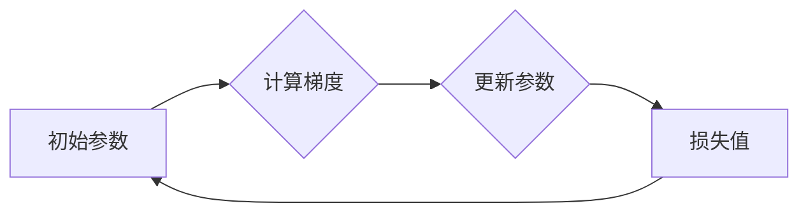

# 优化算法：梯度下降 (Gradient Descent) 原理与代码实例讲解

> 关键词：梯度下降，优化算法，机器学习，深度学习，损失函数，反向传播，批量梯度下降，随机梯度下降

## 1. 背景介绍

在机器学习和深度学习领域，优化算法是核心概念之一。优化算法的目标是找到损失函数的最小值，从而训练出一个性能优良的模型。梯度下降（Gradient Descent，简称GD）是最常用的优化算法之一，它通过迭代更新模型参数，逐步逼近损失函数的极小值。本文将深入探讨梯度下降的原理，并通过代码实例进行详细讲解。

## 2. 核心概念与联系

### 2.1 核心概念原理

在机器学习中，损失函数用于衡量预测值与真实值之间的差异。梯度下降的核心思想是利用损失函数的梯度来更新模型参数，从而最小化损失值。

#### Mermaid 流程图：



### 2.2 核心概念联系

- **损失函数**：衡量预测值与真实值之间差异的函数。
- **梯度**：损失函数对模型参数的偏导数，指示损失函数在当前参数下的上升或下降方向。
- **优化算法**：用于最小化损失函数的算法，梯度下降是其中最常用的一种。
- **参数更新**：根据梯度信息调整模型参数，以降低损失值。

## 3. 核心算法原理 & 具体操作步骤

### 3.1 算法原理概述

梯度下降的基本原理是通过计算损失函数的梯度，并沿着梯度的反方向更新模型参数。具体来说，每次迭代中，都会根据损失函数的梯度信息，以一定的步长（学习率）调整模型参数，从而逐步逼近损失函数的最小值。

### 3.2 算法步骤详解

1. **初始化参数**：设定初始模型参数 $\theta_0$。
2. **计算梯度**：计算损失函数 $L(\theta)$ 在当前参数 $\theta_t$ 下的梯度 $\nabla L(\theta_t)$。
3. **更新参数**：根据梯度信息更新模型参数，公式为 $\theta_{t+1} = \theta_t - \eta \nabla L(\theta_t)$，其中 $\eta$ 为学习率。
4. **重复步骤2和3**，直到满足停止条件（如损失值收敛、迭代次数达到预设值等）。

### 3.3 算法优缺点

#### 优点：

- **简单易实现**：梯度下降算法原理简单，易于理解和实现。
- **效果显著**：在许多机器学习和深度学习任务中，梯度下降算法能够有效地找到损失函数的最小值。

#### 缺点：

- **收敛速度慢**：在某些情况下，梯度下降的收敛速度较慢，尤其是在目标函数非凸的情况下。
- **对学习率敏感**：学习率的选取对收敛速度和收敛效果有很大影响。

### 3.4 算法应用领域

- **线性回归**：用于回归问题的优化。
- **逻辑回归**：用于分类问题的优化。
- **神经网络训练**：深度学习模型训练中使用梯度下降及其变种，如批量梯度下降（BGD）和随机梯度下降（SGD）。

## 4. 数学模型和公式 & 详细讲解 & 举例说明

### 4.1 数学模型构建

梯度下降算法的数学模型可以表示为：

$$
\theta_{t+1} = \theta_t - \eta \nabla L(\theta_t)
$$

其中，$\theta_t$ 表示第 t 次迭代的模型参数，$\eta$ 为学习率，$\nabla L(\theta_t)$ 表示在 $\theta_t$ 下的损失函数梯度。

### 4.2 公式推导过程

假设我们有一个线性回归模型，其损失函数为均方误差（MSE）：

$$
L(\theta) = \frac{1}{2} \sum_{i=1}^n (y_i - \theta^T x_i)^2
$$

其中，$y_i$ 为真实值，$\theta$ 为模型参数，$x_i$ 为输入特征。

损失函数的梯度为：

$$
\nabla L(\theta) = \frac{\partial L}{\partial \theta} = \sum_{i=1}^n (y_i - \theta^T x_i) x_i
$$

### 4.3 案例分析与讲解

以下是一个使用Python实现线性回归梯度下降的简单例子：

```python
import numpy as np

# 构造数据
X = np.array([[1, 2], [2, 3], [3, 4], [4, 5], [5, 6]])
y = np.array([5, 7, 10, 13, 16])

# 初始化参数
theta = np.random.randn(2, 1)

# 学习率
eta = 0.01

# 迭代次数
max_iter = 1000

for i in range(max_iter):
    # 计算梯度
    gradients = 2 * X.T.dot(X.dot(theta) - y)
    
    # 更新参数
    theta -= eta * gradients

print("最终参数：", theta)
```

在这个例子中，我们使用均方误差作为损失函数，并使用梯度下降算法进行参数优化。通过迭代计算梯度，并更新参数，最终得到线性回归模型的参数。

## 5. 项目实践：代码实例和详细解释说明

### 5.1 开发环境搭建

要实现梯度下降算法，我们需要一个Python编程环境。以下是搭建开发环境的步骤：

1. 安装Python：从Python官网下载并安装Python 3.x版本。
2. 安装NumPy：使用pip安装NumPy库：`pip install numpy`。
3. 安装Matplotlib：使用pip安装Matplotlib库：`pip install matplotlib`。

### 5.2 源代码详细实现

以下是一个使用NumPy实现批量梯度下降的Python代码示例：

```python
import numpy as np

# 构造数据
X = np.array([[1, 2], [2, 3], [3, 4], [4, 5], [5, 6]])
y = np.array([5, 7, 10, 13, 16])

# 初始化参数
theta = np.random.randn(2, 1)

# 学习率
eta = 0.01

# 迭代次数
max_iter = 1000

# 批量梯度下降
for i in range(max_iter):
    # 计算梯度
    gradients = 2 * X.T.dot(X.dot(theta) - y)
    
    # 更新参数
    theta -= eta * gradients

print("最终参数：", theta)
```

### 5.3 代码解读与分析

在这个代码示例中，我们首先导入了NumPy库，然后构造了线性回归的数据集。接着，我们初始化了模型参数和设置学习率。在批量梯度下降的循环中，我们计算了损失函数的梯度，并使用梯度信息更新模型参数。

### 5.4 运行结果展示

运行上述代码后，我们得到线性回归模型的参数 $\theta$，它表示了特征 $x_1$ 和 $x_2$ 对因变量 $y$ 的线性关系。

## 6. 实际应用场景

梯度下降算法在机器学习和深度学习领域有广泛的应用，以下是一些典型的应用场景：

- **线性回归**：用于预测连续值，如房价、股票价格等。
- **逻辑回归**：用于预测二分类问题，如垃圾邮件检测、信用卡欺诈检测等。
- **神经网络**：用于分类、回归、生成等多种任务，如图像识别、语音识别、机器翻译等。

## 7. 工具和资源推荐

### 7.1 学习资源推荐

- 《机器学习》（周志华著）：介绍了机器学习的基本概念、算法和应用。
- 《深度学习》（Ian Goodfellow等著）：介绍了深度学习的基本概念、算法和应用。
- Coursera上的《机器学习》课程：由Andrew Ng教授主讲，是机器学习的入门经典。

### 7.2 开发工具推荐

- Jupyter Notebook：用于数据分析和机器学习实验。
- scikit-learn：Python机器学习库，提供了丰富的机器学习算法。
- TensorFlow：Google开发的深度学习框架。

### 7.3 相关论文推荐

- "Stochastic Gradient Descent" by S. J. Russell and P. Norvig
- "On the Convergence of the EM Algorithm for Mixtures of Gaussians" by David M. Blei, David J. Navigation, and Thomas L. Griffiths

## 8. 总结：未来发展趋势与挑战

### 8.1 研究成果总结

梯度下降算法作为一种经典的优化算法，在机器学习和深度学习领域发挥着重要作用。本文深入探讨了梯度下降的原理、步骤、优缺点和应用场景，并通过代码实例进行了详细讲解。

### 8.2 未来发展趋势

未来，梯度下降算法可能会向以下方向发展：

- **自适应学习率**：根据当前梯度的信息动态调整学习率，提高收敛速度和精度。
- **分布式梯度下降**：在多台机器上并行计算梯度，提高算法的效率。
- **自适应优化算法**：根据目标函数的特性选择合适的优化策略，提高算法的适应性。

### 8.3 面临的挑战

梯度下降算法面临以下挑战：

- **局部最小值**：在非凸目标函数中，梯度下降可能陷入局部最小值，无法找到全局最小值。
- **收敛速度慢**：在某些情况下，梯度下降的收敛速度较慢，需要较长的训练时间。
- **对初始参数敏感**：梯度下降的收敛效果对初始参数的选择较为敏感。

### 8.4 研究展望

未来，研究者需要进一步探索和改进梯度下降算法，以应对上述挑战，并推动其在更多领域的应用。

## 9. 附录：常见问题与解答

**Q1：梯度下降算法如何避免陷入局部最小值？**

A：为了避免陷入局部最小值，可以采用以下方法：

- **随机初始化参数**：从不同的初始参数开始多次迭代，选择收敛效果最好的结果。
- **使用多个初始参数**：同时使用多个初始参数进行迭代，取收敛效果最好的结果。
- **使用全局优化算法**：如模拟退火、遗传算法等，寻找全局最小值。

**Q2：梯度下降算法的收敛速度慢怎么办？**

A：为了提高收敛速度，可以采用以下方法：

- **增加学习率**：适当增加学习率可以加快收敛速度，但需要避免过大的学习率导致发散。
- **使用自适应学习率**：根据当前梯度的信息动态调整学习率，提高收敛速度和精度。
- **使用并行计算**：在多台机器上并行计算梯度，提高算法的效率。

**Q3：梯度下降算法对初始参数敏感吗？**

A：是的，梯度下降算法对初始参数的选择较为敏感。如果初始参数选择不当，可能导致收敛速度慢或陷入局部最小值。因此，在实际应用中，需要根据具体问题选择合适的初始参数。

作者：禅与计算机程序设计艺术 / Zen and the Art of Computer Programming