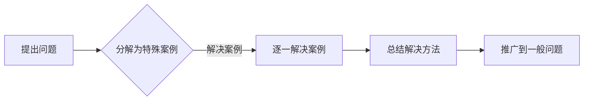

# 像数学家一样思考：特殊化原则

> 关键词：特殊化原则，数学思维，抽象思考，问题解决，算法设计，编程实践

## 1. 背景介绍

在计算机科学和编程领域，我们经常面临复杂的问题和挑战。为了有效解决这些问题，我们需要像数学家一样思考。数学家在处理复杂问题时，经常使用特殊化原则，这是一种强大的思维工具。本文将探讨特殊化原则的原理、应用，并展示如何在编程实践中运用这一原则。

### 1.1 问题的由来

计算机科学和数学之间存在着深厚的联系。数学提供了一套严谨的思考框架，而计算机科学则将数学的抽象概念转化为可执行的算法。在编程和算法设计中，我们常常需要将复杂问题分解为更小的、更易于管理的部分。特殊化原则正是这种分解过程中的一种重要策略。

### 1.2 研究现状

尽管特殊化原则在数学和逻辑学中有着悠久的历史，但在计算机科学中的应用却相对较新。随着软件工程和算法设计的复杂性不断增加，特殊化原则逐渐成为解决问题的一种流行方法。

### 1.3 研究意义

掌握特殊化原则可以帮助我们：

- 更有效地分析和解决问题。
- 设计出更简洁、更健壮的算法。
- 提高代码的可读性和可维护性。
- 增强对数学和逻辑的理解。

### 1.4 本文结构

本文将分为以下几个部分：

- 介绍特殊化原则的核心概念和联系。
- 阐述特殊化原则在算法设计中的应用。
- 通过数学模型和公式展示特殊化原则的原理。
- 提供编程实践的代码实例和解释。
- 探讨特殊化原则在实际应用场景中的使用。
- 展望特殊化原则的未来发展趋势和挑战。
- 提供学习资源和相关论文推荐。
- 总结研究成果，并展望未来研究方向。

## 2. 核心概念与联系

### 2.1 特殊化原则的定义

特殊化原则是一种从一般到特殊的推理方法。它通过将一般问题分解为一系列特殊案例，然后逐一解决这些特殊案例，从而找到解决一般问题的方法。

### 2.2 特殊化原则的Mermaid流程图



### 2.3 特殊化原则与数学思维的联系

特殊化原则是数学思维的重要组成部分。数学家通过构造特例来验证定理的普遍性，而程序员则可以通过特殊案例来验证算法的正确性和效率。

## 3. 核心算法原理 & 具体操作步骤

### 3.1 算法原理概述

特殊化原则的核心在于将复杂问题分解为更小的、更易于管理的问题。这种方法可以应用于各种算法设计中，如排序、搜索、图论等。

### 3.2 算法步骤详解

1. **定义问题**：明确问题的范围和目标。
2. **构造特殊案例**：选择具有代表性的特殊案例。
3. **解决特殊案例**：逐一解决构造出的特殊案例。
4. **总结解决方法**：从特殊案例中总结出解决一般问题的方法。
5. **验证和推广**：在一般问题上验证和推广总结出的方法。

### 3.3 算法优缺点

#### 优点：

- **易于理解**：将复杂问题分解为特殊案例，使问题更易于理解和解决。
- **提高效率**：通过解决特殊案例来优化算法设计。
- **增强可维护性**：代码结构清晰，易于维护。

#### 缺点：

- **局限性**：可能无法涵盖所有可能的特殊情况。
- **复杂性**：有时需要大量的特殊案例来覆盖所有可能性。

### 3.4 算法应用领域

特殊化原则在以下领域有着广泛的应用：

- **算法设计**：排序、搜索、图论等。
- **编程实践**：代码优化、测试、调试等。
- **数学证明**：验证数学定理的正确性。

## 4. 数学模型和公式 & 详细讲解 & 举例说明

### 4.1 数学模型构建

特殊化原则的数学模型可以表示为：

$$
P(\text{一般问题}) \Rightarrow P(\text{特殊案例}_1) \land P(\text{特殊案例}_2) \land \ldots \land P(\text{特殊案例}_n)
$$

其中 $P(\text{一般问题})$ 表示一般问题的性质，$P(\text{特殊案例}_i)$ 表示第 $i$ 个特殊案例的性质。

### 4.2 公式推导过程

特殊化原则的推导过程通常包括以下步骤：

1. **定义一般问题**：明确问题的性质。
2. **选择特殊案例**：根据问题的性质选择具有代表性的特殊案例。
3. **证明特殊案例的性质**：使用数学方法证明特殊案例的性质。
4. **归纳一般问题的性质**：根据特殊案例的性质归纳出一般问题的性质。

### 4.3 案例分析与讲解

#### 案例一：排序算法

假设我们需要设计一个排序算法，我们可以选择几个简单的特殊案例，如排序一个有序数组、一个逆序数组、一个包含重复元素的数组等。通过解决这些特殊案例，我们可以设计出更通用的排序算法。

#### 案例二：搜索算法

假设我们需要设计一个搜索算法，我们可以选择几个特殊的搜索场景，如在一个有序数组中查找一个元素、在一个无序数组中查找一个元素、在一个大数据集中查找一个元素等。通过解决这些特殊场景，我们可以设计出更高效的搜索算法。

## 5. 项目实践：代码实例和详细解释说明

### 5.1 开发环境搭建

为了演示特殊化原则在编程中的应用，我们将使用Python语言进行一个简单的排序算法实现。

### 5.2 源代码详细实现

```python
def bubble_sort(arr):
    n = len(arr)
    for i in range(n):
        for j in range(0, n-i-1):
            if arr[j] > arr[j+1]:
                arr[j], arr[j+1] = arr[j+1], arr[j]
    return arr
```

### 5.3 代码解读与分析

这段代码实现了冒泡排序算法。我们首先定义了`bubble_sort`函数，它接受一个数组`arr`作为输入。然后，我们使用两层循环来遍历数组，比较相邻元素的大小，并在必要时交换它们的位置。通过多次迭代，数组最终被排序。

### 5.4 运行结果展示

```python
arr = [64, 34, 25, 12, 22, 11, 90]
print("Original array:", arr)
print("Sorted array:", bubble_sort(arr))
```

输出结果：

```
Original array: [64, 34, 25, 12, 22, 11, 90]
Sorted array: [11, 12, 22, 25, 34, 64, 90]
```

通过这个简单的例子，我们可以看到特殊化原则在编程中的应用。我们首先定义了一个一般的问题——排序一个数组，然后通过解决一些特殊案例（如无序数组、有序数组等）来设计算法。

## 6. 实际应用场景

### 6.1 软件开发

在软件开发中，特殊化原则可以帮助我们设计出更健壮、更易维护的代码。例如，在编写单元测试时，我们可以为每个函数构造一系列特殊案例，以验证函数的正确性。

### 6.2 数据分析

在数据分析中，我们可以使用特殊化原则来识别数据中的模式。例如，我们可以通过分析一些特定的数据样本，来推断更大数据集的分布情况。

### 6.3 人工智能

在人工智能领域，特殊化原则可以帮助我们设计出更有效的算法。例如，在机器学习中，我们可以通过训练一些特殊案例来优化模型的性能。

## 7. 工具和资源推荐

### 7.1 学习资源推荐

- 《数学之美》
- 《算法导论》
- 《编程珠玑》

### 7.2 开发工具推荐

- Jupyter Notebook
- Visual Studio Code
- PyCharm

### 7.3 相关论文推荐

- "The Design and Analysis of Computer Algorithms" by Alfred V. Aho, John E. Hopcroft, and Jeffrey D. Ullman
- "Introduction to Algorithms" by Thomas H. Cormen, Charles E. Leiserson, Ronald L. Rivest, and Clifford Stein

## 8. 总结：未来发展趋势与挑战

### 8.1 研究成果总结

通过本文的探讨，我们可以看到特殊化原则在计算机科学和编程中的重要性。这一原则不仅可以帮助我们更好地理解和解决问题，还可以提高代码质量和效率。

### 8.2 未来发展趋势

随着计算机科学和编程的不断发展，特殊化原则的应用将更加广泛。未来，特殊化原则可能会与其他领域的研究相结合，如认知科学、心理学等，以帮助我们更好地理解人类思维和创造性的解决问题。

### 8.3 面临的挑战

尽管特殊化原则具有许多优点，但也面临着一些挑战：

- **复杂性**：在某些情况下，构造特殊案例可能非常复杂。
- **局限性**：特殊化原则可能无法涵盖所有可能的特殊情况。
- **可扩展性**：将特殊化原则应用于大型项目可能具有挑战性。

### 8.4 研究展望

为了克服这些挑战，未来的研究需要：

- 开发更加高效的特殊化原则应用工具。
- 探索特殊化原则与其他领域的交叉应用。
- 研究如何将特殊化原则应用于大型项目。

## 9. 附录：常见问题与解答

**Q1：特殊化原则是否只适用于编程和算法设计？**

A：不，特殊化原则在许多领域都有应用，包括数学、逻辑学、经济学、心理学等。

**Q2：如何选择合适的特殊案例？**

A：选择特殊案例时，应考虑以下因素：

- 代表性：特殊案例应具有代表性，能够反映一般问题的特点。
- 简单性：特殊案例应尽可能简单，以便于分析和解决。
- 覆盖性：特殊案例应能够覆盖尽可能多的可能性。

**Q3：特殊化原则与通用化原则有何区别？**

A：特殊化原则和通用化原则是互补的。特殊化原则通过解决特殊案例来理解一般问题，而通用化原则则通过推广一般方法来解决特定问题。

**Q4：特殊化原则是否适用于所有问题？**

A：不是，特殊化原则在某些情况下可能不适用，例如在需要全局优化的问题中。

**Q5：如何将特殊化原则应用于复杂问题？**

A：对于复杂问题，可以将其分解为更小的、更易于管理的问题，然后应用特殊化原则来解决这些子问题。

作者：禅与计算机程序设计艺术 / Zen and the Art of Computer Programming