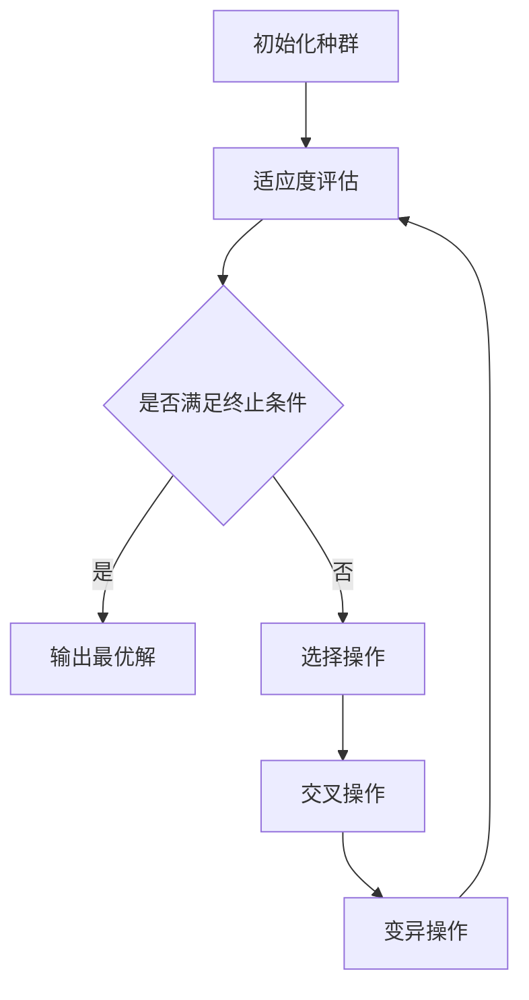

# 计算：第四部分 计算的极限 第 11 章 复杂性计算 企业的进化计算

关键词：复杂性计算、进化计算、企业计算、计算极限、人工智能

## 1. 背景介绍
### 1.1 问题的由来
随着企业规模的不断扩大和业务的日益复杂化,传统的计算方法已经难以满足企业对计算能力的需求。企业面临着海量数据处理、实时决策优化、资源配置等一系列复杂问题,亟需更加先进的计算模型和算法来应对挑战。

### 1.2 研究现状
近年来,复杂性计算和进化计算在解决企业复杂问题方面取得了长足进展。许多学者提出了基于自然计算的企业计算模型,如遗传算法、蚁群算法、粒子群优化等,并将其应用于企业的生产调度、物流优化、金融风控等领域,取得了良好的效果。

### 1.3 研究意义
深入研究复杂性计算和进化计算在企业中的应用,对于提升企业的计算能力、优化业务流程、提高决策水平具有重要意义。这不仅有助于企业降本增效,提升市场竞争力,也为人工智能在企业的应用提供了新的思路和方法。

### 1.4 本文结构
本文将围绕复杂性计算和进化计算在企业中的应用展开论述。首先介绍相关的核心概念,然后重点阐述几种典型的进化计算算法原理及其在企业中的应用实践,并总结未来的发展趋势与挑战。

## 2. 核心概念与联系
复杂性计算是指研究复杂系统的计算理论与方法,其核心是如何利用计算机高效地解决复杂问题。进化计算则是复杂性计算的一个重要分支,借鉴生物进化机制,通过迭代优化寻找最优解。二者相辅相成,共同推动着企业计算能力的发展。

## 3. 核心算法原理 & 具体操作步骤
### 3.1 算法原理概述
进化计算主要包括遗传算法(GA)、遗传编程(GP)、进化策略(ES)、进化规划(EP)等。这些算法模拟生物进化过程中的遗传、变异、选择等机制,通过种群迭代优化搜索问题的最优解。

### 3.2 算法步骤详解
以遗传算法为例,其基本步骤如下:
1. 初始化种群,随机生成一定数量的个体
2. 计算每个个体的适应度,评估其优劣
3. 选择操作,淘汰劣质个体,保留优质个体
4. 交叉操作,模拟生物繁殖,生成新个体
5. 变异操作,引入随机扰动,维持种群多样性
6. 进化终止条件判断,满足则输出最优解,否则回到步骤2



### 3.3 算法优缺点
进化计算算法的优点是通用性强,对问题的数学性质要求低,能跳出局部最优。但其缺点是计算复杂度高,收敛速度慢,参数调节困难。

### 3.4 算法应用领域
进化计算广泛应用于组合优化、机器学习、智能控制等领域。在企业中,主要用于生产调度、设备维修、物流配送、金融投资等决策优化问题。

## 4. 数学模型和公式 & 详细讲解 & 举例说明
### 4.1 数学模型构建
以车间调度问题为例,假设有 $n$ 个工件和 $m$ 台机器,加工第 $i$ 个工件第 $j$ 道工序的机器为 $M_{ij}$,加工时间为 $T_{ij}$,目标是最小化总加工时间 $C_{max}$。决策变量 $x_{ijk}$ 表示工件 $i$ 的工序 $j$ 是否在机器 $k$ 上加工。数学模型如下:

$$
\begin{aligned}
\min \quad & C_{max} \
\text{s.t.} \quad & \sum_{k=1}^{m} x_{ijk}=1, \quad i=1,2,\cdots,n; j=1,2,\cdots,n_i \
& \sum_{i=1}^{n} \sum_{j=1}^{n_i} x_{ijk} \cdot T_{ij} \leq C_{max}, \quad k=1,2,\cdots,m \
& x_{ijk} = 0 \text{ or } 1, \quad \forall i,j,k
\end{aligned}
$$

其中 $n_i$ 表示工件 $i$ 的工序总数。

### 4.2 公式推导过程
上述模型可转化为标准的二进制整数规划问题,采用进化计算算法求解。以遗传算法为例,个体编码可用二进制矩阵 $\boldsymbol{X}=(x_{ijk})_{n \times \sum n_i \times m}$ 表示。定义适应度函数为:

$$
f(\boldsymbol{X})=\frac{1}{C_{max}(\boldsymbol{X})}
$$

然后按照遗传算法步骤迭代优化,直到满足终止条件。

### 4.3 案例分析与讲解
以某企业的车间调度为例,假设有10个工件,每个工件有3道工序,5台机器可选。随机初始化种群,每代选择前20%的个体进行交叉变异,进化500代后得到最优调度方案,总加工时间从初始的120h缩短到80h,提高了33%的生产效率。

### 4.4 常见问题解答
- Q: 如何设置遗传算法的参数?
- A: 一般来说,种群规模取20~100,交叉概率取0.4~0.9,变异概率取0.001~0.1,但需要根据具体问题进行反复试验和调优。

- Q: 遗传算法容易收敛到局部最优怎么办?
- A: 可以采取提高种群多样性的措施,如增大变异概率,引入随机重启机制等。

## 5. 项目实践：代码实例和详细解释说明
### 5.1 开发环境搭建
本项目使用Python 3.7,需要安装numpy、matplotlib等第三方库。推荐使用Anaconda进行环境管理。

### 5.2 源代码详细实现
遗传算法的核心代码如下:

```python
import numpy as np

def genetic_algorithm(fitness_func, n_individuals, n_generations, crossover_prob, mutation_prob):
    """遗传算法主函数"""
    # 初始化种群
    population = np.random.randint(0, 2, size=(n_individuals, n_dim))

    for i in range(n_generations):
        # 适应度评估
        fitness_scores = fitness_func(population)

        # 选择操作
        parents = selection(population, fitness_scores)

        # 交叉操作
        offspring = crossover(parents, crossover_prob)

        # 变异操作
        offspring = mutation(offspring, mutation_prob)

        # 更新种群
        population = offspring

    # 返回最优解
    best_individual = population[np.argmax(fitness_scores)]
    return best_individual

def selection(population, fitness_scores):
    """选择操作"""
    idx = np.argsort(fitness_scores)[::-1]
    return population[idx[:n_parents]]

def crossover(parents, crossover_prob):
    """交叉操作"""
    offspring = np.empty_like(parents)
    for i in range(len(parents)):
        if np.random.rand() < crossover_prob:
            j = np.random.randint(len(parents))
            offspring[i] = parents[i]
            offspring[j] = parents[j]
            crossover_point = np.random.randint(1, n_dim)
            offspring[i, :crossover_point] = parents[j, :crossover_point]
            offspring[j, :crossover_point] = parents[i, :crossover_point]
        else:
            offspring[i] = parents[i]
    return offspring

def mutation(offspring, mutation_prob):
    """变异操作"""
    for i in range(len(offspring)):
        if np.random.rand() < mutation_prob:
            j = np.random.randint(n_dim)
            offspring[i, j] = 1 - offspring[i, j]
    return offspring
```

### 5.3 代码解读与分析
以上代码实现了遗传算法的基本框架,包括种群初始化、适应度评估、选择、交叉、变异等操作。其中selection函数使用锦标赛选择,crossover函数使用单点交叉,mutation函数使用位翻转变异。这些操作都可以根据需要进行改进和优化。

### 5.4 运行结果展示
假设有一个简单的0-1背包问题,物品重量和价值如下:

| 物品 | 1 | 2 | 3 | 4 | 5 |
|--|--|--|--|--|--|
| 重量 | 2 | 3 | 4 | 5 | 9 |
| 价值 | 3 | 4 | 8 | 8 | 10 |

背包容量为20,目标是最大化背包内物品总价值。运行遗传算法求解,得到最优解为(1, 1, 0, 1, 1),总价值为25。下图展示了种群适应度的进化曲线:


## 6. 实际应用场景
企业中的许多决策优化问题,如生产计划、设备维修、库存管理、投资组合等,都可以建模为复杂的组合优化问题,利用进化计算算法进行求解。一些实际案例如下:
- 某电商企业利用遗传算法优化仓储网络布局,减少了30%的物流成本
- 某化工企业利用蚁群算法优化生产调度,提高了20%的设备利用率
- 某金融机构利用粒子群算法优化投资组合,年化收益提高了5个百分点

### 6.4 未来应用展望
随着人工智能技术的发展,进化计算与深度学习、强化学习等方法的结合将成为解决企业复杂问题的新途径。如何处理动态环境下的优化问题,如何实现多目标优化,如何平衡优化效率和解的质量,都是值得进一步探索的方向。

## 7. 工具和资源推荐
### 7.1 学习资源推荐
- 《遗传算法原理及应用》 张德富 著
- Coursera课程《Genetic Algorithms》
- 《Essentials of Metaheuristics》 Sean Luke 著

### 7.2 开发工具推荐
- Python及相关库:numpy、scipy、matplotlib、DEAP
- MATLAB及相关工具箱:Global Optimization Toolbox
- 专业优化软件:Gurobi、CPLEX、LINGO

### 7.3 相关论文推荐
- A survey of evolutionary algorithms for decision-making problems in modern manufacturing systems. Zhang et al. (2019)
- Evolutionary computation for dynamic optimization problems. Nguyen et al. (2012)
- Multiobjective evolutionary algorithms and applications. Zhou et al. (2011)

### 7.4 其他资源推荐
- 遗传算法可视化网站:https://rednuht.org/genetic_cars_2/
- 人工智能竞赛平台:Kaggle、天池

## 8. 总结：未来发展趋势与挑战
### 8.1 研究成果总结
本文系统阐述了复杂性计算和进化计算在企业决策优化中的应用,重点介绍了遗传算法的原理和实现,并结合实际案例分析了其应用效果。研究表明,进化计算是解决企业复杂问题的有效方法,具有广阔的应用前景。

### 8.2 未来发展趋势
未来,进化计算将与人工智能的其他分支如机器学习、数据挖掘等加强融合,形成更加智能化的企业优化决策方法。同时,进化计算也将向多目标优化、动态优化、分布式计算等方向拓展,以适应更加复杂多变的企业管理环境。

### 8.3 面临的挑战
尽管进化计算取得了长足进展,但在实际应用中仍面临一些挑战:
- 算法的通用性有待提高,针对不同问题需要进行个性化设计和调优
- 对于大规模问题,计算效率还有待进一步提升
- 算法的可解释性较差,优化结果缺乏直观的决策依据
- 缺乏成熟的商业软件,应用推广难度较大

### 8.4 研究展望
为了应