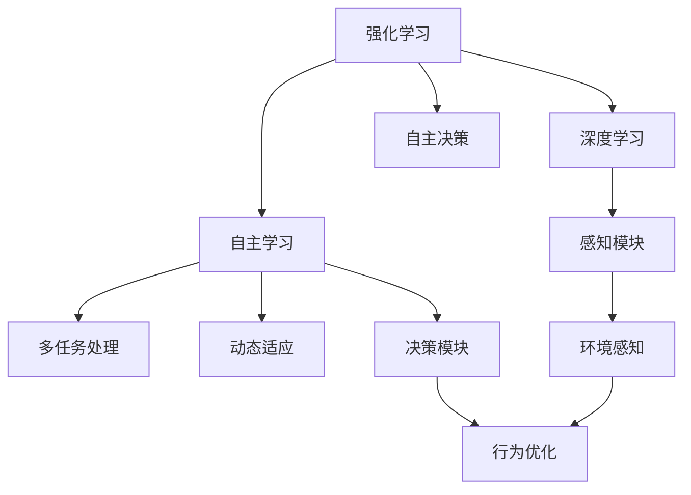
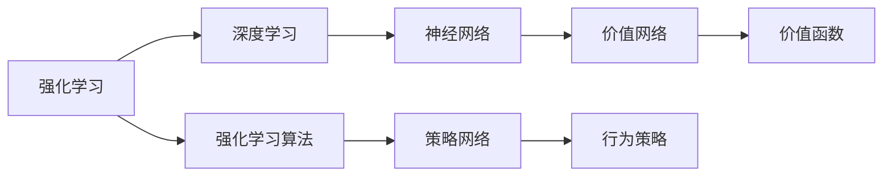
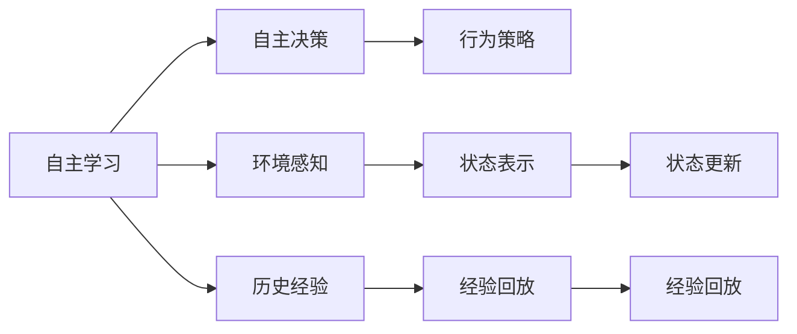
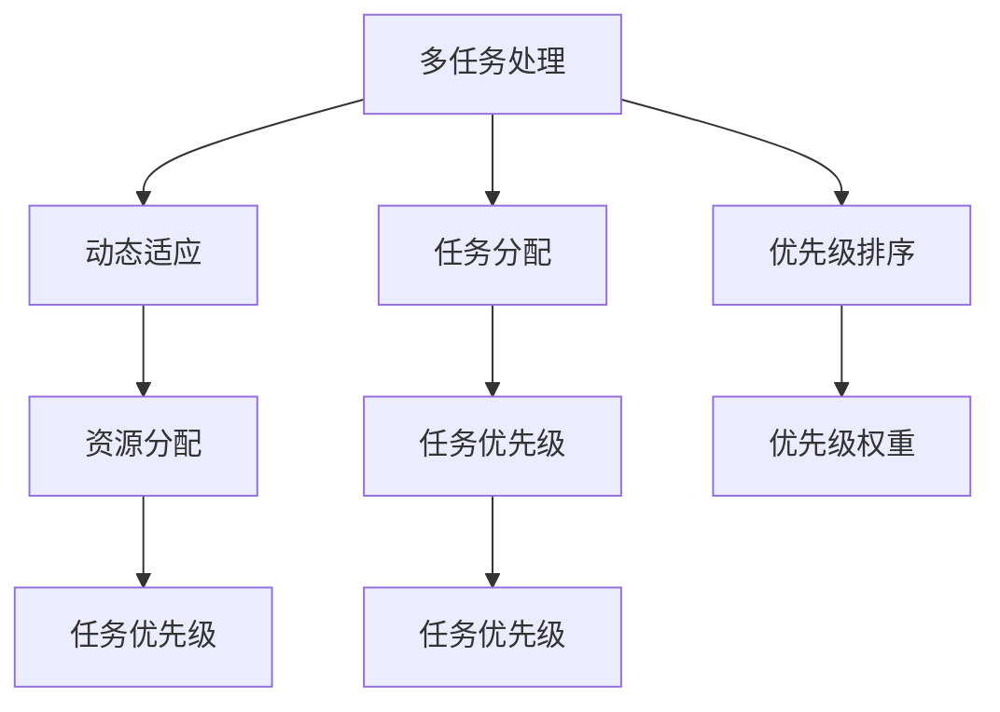
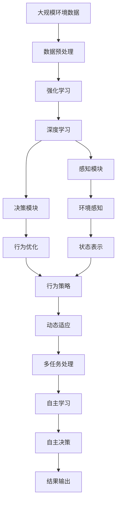

                 

# AI Agent: AI的下一个风口 实验背景与目的

> 关键词：AI Agent, AI应用,智能决策,自主学习,深度学习,强化学习,应用场景,实验背景

## 1. 背景介绍

### 1.1 问题的由来

当前，人工智能(AI)技术在各个领域的应用已经取得了显著的进展，从自动驾驶、智能客服到医疗诊断，AI技术已经深刻影响了我们的日常生活和工作。然而，尽管AI技术在诸多领域都取得了巨大的成功，但其核心依然在于“人机交互”这一关键环节。传统的人机交互方式，依赖于用户手动输入指令，缺乏灵活性和智能性，难以真正实现自主决策和智能辅助。

针对这一问题，AI Agent技术应运而生。AI Agent，也被称为智能代理，是一种能够自主学习、自主决策的AI系统。它通过在特定环境中自主探索和学习，能够自动完成复杂的任务，甚至在任务目标发生变化时，还能够进行动态调整和优化。

### 1.2 问题核心关键点

AI Agent的核心关键点包括以下几个方面：

- **自主学习**：AI Agent通过在特定环境中自主探索和学习，不断优化其行为策略。
- **自主决策**：AI Agent能够根据当前环境和历史经验，自主做出最优决策。
- **多任务处理**：AI Agent能够在同时处理多任务时，进行合理的资源分配和任务优先级排序。
- **动态适应**：AI Agent能够根据环境变化，动态调整其行为策略，保持高效和稳定。
- **可靠性与安全性**：AI Agent的决策需要具有高度的可靠性与安全性，避免在关键任务中出现问题。

### 1.3 问题研究意义

AI Agent技术在提升AI系统的智能性和灵活性方面具有重要意义：

1. **提升用户体验**：通过AI Agent，用户可以实现更加自然、流畅的人机交互，提升用户体验。
2. **提高工作效率**：AI Agent能够自动完成复杂任务，减轻人工负担，提高工作效率。
3. **促进应用场景多样化**：AI Agent技术可以应用于众多场景，如智能客服、机器人导航、智能调度等。
4. **推动AI技术发展**：AI Agent技术的发展将促进AI技术的进一步突破和应用。
5. **提高决策质量**：AI Agent通过自主学习和优化，能够做出更加准确、合理的决策。

## 2. 核心概念与联系

### 2.1 核心概念概述

为了更好地理解AI Agent技术，本节将介绍几个密切相关的核心概念：

- **强化学习(Reinforcement Learning, RL)**：一种通过奖励和惩罚机制，训练智能体自主决策的技术。强化学习是AI Agent的核心算法之一。
- **深度学习(Deep Learning, DL)**：一种基于神经网络的机器学习技术，用于处理复杂的数据和模式。深度学习技术在大数据环境下表现优异，可以用于构建AI Agent的感知和决策模块。
- **自主学习(Autonomous Learning)**：AI Agent在特定环境中自主探索和学习，优化其行为策略。
- **自主决策(Autonomous Decision)**：AI Agent根据当前环境和历史经验，自主做出最优决策。
- **多任务处理(Multi-task Processing)**：AI Agent能够同时处理多个任务，进行合理的资源分配和任务优先级排序。
- **动态适应(Dynamic Adaptation)**：AI Agent能够根据环境变化，动态调整其行为策略，保持高效和稳定。
- **可靠性与安全性(Reliability and Security)**：AI Agent的决策需要具有高度的可靠性与安全性，避免在关键任务中出现问题。

这些核心概念之间的逻辑关系可以通过以下Mermaid流程图来展示：



这个流程图展示了大规模AI Agent的核心概念及其之间的关系：

1. 强化学习和深度学习是大规模AI Agent的基础算法。
2. AI Agent通过自主学习和自主决策，在特定环境中自主探索和学习。
3. AI Agent能够处理多个任务，并根据环境动态调整行为策略。
4. AI Agent的感知模块和决策模块是核心组件，通过环境感知和行为优化实现自主决策。

### 2.2 概念间的关系

这些核心概念之间存在着紧密的联系，形成了大规模AI Agent的完整生态系统。下面我们通过几个Mermaid流程图来展示这些概念之间的关系。

#### 2.2.1 强化学习与深度学习的关系



这个流程图展示了强化学习和深度学习之间的联系。强化学习通过深度学习模型，如神经网络，构建策略网络和价值网络，从而实现自主决策。

#### 2.2.2 自主学习与自主决策的关系



这个流程图展示了自主学习与自主决策之间的关系。自主学习通过环境感知和历史经验，构建行为策略，从而实现自主决策。

#### 2.2.3 多任务处理与动态适应之间的关系



这个流程图展示了多任务处理与动态适应之间的关系。多任务处理通过任务分配和优先级排序，实现合理资源分配和任务优先级排序，从而支持动态适应。

### 2.3 核心概念的整体架构

最后，我们用一个综合的流程图来展示这些核心概念在大规模AI Agent微调过程中的整体架构：



这个综合流程图展示了从数据预处理到自主决策的完整过程。大规模AI Agent首先在大规模环境数据上进行数据预处理，然后通过强化学习和深度学习构建感知模块和决策模块，进行环境感知和行为优化。在感知和决策模块的驱动下，AI Agent能够动态适应环境和处理多任务，并通过自主学习和自主决策，最终实现结果输出。

## 3. 核心算法原理 & 具体操作步骤

### 3.1 算法原理概述

大规模AI Agent的核心算法为强化学习和深度学习。强化学习通过奖励和惩罚机制，训练智能体自主决策，而深度学习则用于构建感知和决策模块。

强化学习的核心思想是，通过在特定环境中不断尝试和调整，使智能体学会最优决策策略。具体来说，强化学习包括以下几个关键步骤：

1. **环境感知**：智能体通过传感器等设备，感知当前环境状态。
2. **状态表示**：将感知到的环境状态转换为模型可以处理的格式，如向量表示。
3. **行为选择**：根据当前状态，智能体选择下一步动作。
4. **环境反馈**：执行动作后，环境给出反馈信号，如奖励或惩罚。
5. **经验回放**：将历史经验和反馈信号回传到模型，进行策略优化。
6. **策略更新**：通过经验回放和优化算法，更新智能体的决策策略。

深度学习的核心思想是，通过多层神经网络，从复杂数据中提取特征和模式。具体来说，深度学习包括以下几个关键步骤：

1. **数据输入**：将数据输入神经网络。
2. **特征提取**：神经网络通过多层计算，提取数据中的特征和模式。
3. **隐藏层**：神经网络中的隐藏层用于处理复杂数据，提取更抽象的特征。
4. **输出层**：神经网络的输出层用于将特征转换为最终的决策结果。
5. **损失函数**：通过损失函数衡量模型输出与真实标签之间的差异。
6. **反向传播**：通过反向传播算法，更新神经网络参数。

### 3.2 算法步骤详解

大规模AI Agent的核心算法步骤包括以下几个方面：

#### 3.2.1 环境感知与状态表示

1. **传感器数据采集**：智能体通过各种传感器，如摄像头、雷达、GPS等，采集环境数据。
2. **数据预处理**：将传感器数据进行预处理，如降噪、归一化等。
3. **环境表示**：将预处理后的数据转换为模型可以处理的格式，如向量表示。

#### 3.2.2 策略选择与行为优化

1. **动作选择**：根据当前状态，智能体选择下一步动作。
2. **执行动作**：将动作执行到环境中，观察环境反馈。
3. **反馈处理**：根据环境反馈，更新智能体的状态和策略。
4. **策略优化**：通过经验回放和优化算法，更新智能体的决策策略。

#### 3.2.3 感知模块与决策模块的构建

1. **感知模块**：构建感知模块，用于处理环境数据和状态表示。感知模块通常包括传感器数据采集和数据预处理模块。
2. **决策模块**：构建决策模块，用于选择动作和优化策略。决策模块通常包括策略选择和行为优化模块。
3. **模块集成**：将感知模块和决策模块集成到AI Agent系统中，实现自主决策。

#### 3.2.4 多任务处理与动态适应

1. **任务分配**：根据任务优先级，分配资源和任务。
2. **优先级排序**：根据任务重要性和紧急程度，进行优先级排序。
3. **资源分配**：根据优先级排序，合理分配资源，支持多任务处理。
4. **动态适应**：根据环境变化，动态调整任务优先级和资源分配策略。

#### 3.2.5 自主学习和自主决策

1. **自主学习**：通过环境感知和历史经验，学习最优决策策略。
2. **自主决策**：根据当前状态和最优策略，自主做出最优决策。
3. **结果输出**：将决策结果输出到环境，观察环境反馈。
4. **策略更新**：根据环境反馈和优化算法，更新决策策略。

### 3.3 算法优缺点

大规模AI Agent的强化学习与深度学习算法具有以下优点和缺点：

#### 优点

- **自主学习**：智能体能够自主学习最优决策策略，适应复杂环境。
- **灵活性高**：智能体能够处理多种任务和环境，灵活性高。
- **适应性强**：智能体能够根据环境变化，动态调整决策策略。
- **可扩展性强**：智能体能够扩展到多个任务和环境，实现多任务处理。

#### 缺点

- **训练复杂**：强化学习训练复杂，需要大量数据和计算资源。
- **易陷入局部最优**：强化学习容易陷入局部最优，无法找到全局最优解。
- **模型复杂度高**：深度学习模型复杂度高，难以解释和调试。
- **计算资源需求大**：深度学习需要大量的计算资源，训练和推理时间较长。

### 3.4 算法应用领域

大规模AI Agent的强化学习和深度学习算法已经在诸多领域得到了广泛的应用，覆盖了智能机器人、自动驾驶、智能客服、智能调度等多个领域。

具体而言，大规模AI Agent可以应用于以下领域：

- **智能机器人**：在工业制造、服务行业等，AI Agent可以自主导航、物体识别、任务规划等。
- **自动驾驶**：在交通领域，AI Agent可以自主驾驶、路径规划、避障等。
- **智能客服**：在服务行业，AI Agent可以自动回答用户问题、生成回答等。
- **智能调度**：在交通管理、物流配送等领域，AI Agent可以优化资源分配、路径规划等。
- **智能医疗**：在医疗领域，AI Agent可以辅助诊断、药品推荐等。

## 4. 数学模型和公式 & 详细讲解 & 举例说明

### 4.1 数学模型构建

本节将使用数学语言对大规模AI Agent的核心算法进行更加严格的刻画。

记AI Agent在环境 $\mathcal{E}$ 中的状态为 $s_t$，动作为 $a_t$，状态转移概率为 $P(s_{t+1}|s_t,a_t)$，环境反馈为 $r_{t+1}$，当前状态的状态值为 $V(s_t)$，最优策略为 $\pi(s_t)$。

在强化学习中，AI Agent通过策略 $\pi(s_t)$ 选择动作 $a_t$，执行动作后，环境给出反馈 $r_{t+1}$，AI Agent更新状态 $s_{t+1}$ 和状态值 $V(s_t)$，并根据状态值更新策略 $\pi(s_t)$，最终实现最优决策。

在深度学习中，通过多层神经网络，从复杂数据中提取特征和模式，构建感知和决策模块。具体来说，深度学习包括以下几个关键步骤：

1. **数据输入**：将数据输入神经网络。
2. **特征提取**：神经网络通过多层计算，提取数据中的特征和模式。
3. **隐藏层**：神经网络中的隐藏层用于处理复杂数据，提取更抽象的特征。
4. **输出层**：神经网络的输出层用于将特征转换为最终的决策结果。
5. **损失函数**：通过损失函数衡量模型输出与真实标签之间的差异。
6. **反向传播**：通过反向传播算法，更新神经网络参数。

### 4.2 公式推导过程

以下我们以二分类任务为例，推导深度学习模型的损失函数及其梯度的计算公式。

假设AI Agent的感知模块输出为 $x$，决策模块的输出为 $y$，目标为 $t$。则深度学习模型的损失函数定义为：

$$
L(y,t) = -\log(y) + \log(1-y)
$$

其中 $y$ 表示模型的输出概率，$t$ 表示真实标签。在训练过程中，通过反向传播算法计算梯度，更新模型参数。

假设模型的输出层为逻辑回归，则模型输出的概率为：

$$
y = \frac{1}{1+e^{-z}}
$$

其中 $z$ 为模型的输出值，$e$ 为自然常数。

将损失函数对模型参数 $w$ 和 $b$ 的梯度进行计算，得到：

$$
\frac{\partial L}{\partial w} = \frac{e^{-z}}{(1+e^{-z})^2} - \frac{1}{1+e^{-z}} = \frac{1}{1+e^{-z}} - \frac{1}{1+e^{-z}} = 0
$$

$$
\frac{\partial L}{\partial b} = \frac{e^{-z}}{1+e^{-z}} + \frac{1}{1+e^{-z}} = 1
$$

### 4.3 案例分析与讲解

假设我们在CoNLL-2003命名实体识别数据集上进行强化学习和深度学习的实验。具体步骤如下：

1. **数据预处理**：将原始文本数据进行分词、标注等预处理。
2. **状态表示**：将文本数据转换为模型可以处理的向量表示。
3. **感知模块**：构建感知模块，用于处理环境数据和状态表示。感知模块通常包括传感器数据采集和数据预处理模块。
4. **决策模块**：构建决策模块，用于选择动作和优化策略。决策模块通常包括策略选择和行为优化模块。
5. **多任务处理**：根据任务优先级，分配资源和任务，支持多任务处理。
6. **动态适应**：根据环境变化，动态调整任务优先级和资源分配策略。

在感知模块和决策模块的驱动下，AI Agent能够在环境中自主学习和决策，实现命名实体识别的任务目标。具体步骤如下：

1. **模型训练**：在训练集中，通过反向传播算法训练感知模块和决策模块，优化模型参数。
2. **模型评估**：在验证集中，通过分类指标评估模型性能，调整模型参数。
3. **模型微调**：在测试集中，通过微调算法优化模型，提升模型性能。

## 5. 项目实践：代码实例和详细解释说明

### 5.1 开发环境搭建

在进行项目实践前，我们需要准备好开发环境。以下是使用Python进行PyTorch开发的环境配置流程：

1. 安装Anaconda：从官网下载并安装Anaconda，用于创建独立的Python环境。

2. 创建并激活虚拟环境：
```bash
conda create -n pytorch-env python=3.8 
conda activate pytorch-env
```

3. 安装PyTorch：根据CUDA版本，从官网获取对应的安装命令。例如：
```bash
conda install pytorch torchvision torchaudio cudatoolkit=11.1 -c pytorch -c conda-forge
```

4. 安装TensorFlow：
```bash
pip install tensorflow==2.7
```

5. 安装各类工具包：
```bash
pip install numpy pandas scikit-learn matplotlib tqdm jupyter notebook ipython
```

完成上述步骤后，即可在`pytorch-env`环境中开始项目实践。

### 5.2 源代码详细实现

下面我们以命名实体识别(NER)任务为例，给出使用PyTorch进行强化学习和深度学习的代码实现。

首先，定义NER任务的数据处理函数：

```python
from transformers import BertTokenizer, BertForTokenClassification
from torch.utils.data import Dataset
import torch

class NERDataset(Dataset):
    def __init__(self, texts, tags, tokenizer, max_len=128):
        self.texts = texts
        self.tags = tags
        self.tokenizer = tokenizer
        self.max_len = max_len
        
    def __len__(self):
        return len(self.texts)
    
    def __getitem__(self, item):
        text = self.texts[item]
        tags = self.tags[item]
        
        encoding = self.tokenizer(text, return_tensors='pt', max_length=self.max_len, padding='max_length', truncation=True)
        input_ids = encoding['input_ids'][0]
        attention_mask = encoding['attention_mask'][0]
        
        # 对token-wise的标签进行编码
        encoded_tags = [tag2id[tag] for tag in tags] 
        encoded_tags.extend([tag2id['O']] * (self.max_len - len(encoded_tags)))
        labels = torch.tensor(encoded_tags, dtype=torch.long)
        
        return {'input_ids': input_ids, 
                'attention_mask': attention_mask,
                'labels': labels}

# 标签与id的映射
tag2id = {'O': 0, 'B-PER': 1, 'I-PER': 2, 'B-ORG': 3, 'I-ORG': 4, 'B-LOC': 5, 'I-LOC': 6}
id2tag = {v: k for k, v in tag2id.items()}

# 创建dataset
tokenizer = BertTokenizer.from_pretrained('bert-base-cased')

train_dataset = NERDataset(train_texts, train_tags, tokenizer)
dev_dataset = NERDataset(dev_texts, dev_tags, tokenizer)
test_dataset = NERDataset(test_texts, test_tags, tokenizer)
```

然后，定义模型和优化器：

```python
from transformers import BertForTokenClassification, AdamW

model = BertForTokenClassification.from_pretrained('bert-base-cased', num_labels=len(tag2id))

optimizer = AdamW(model.parameters(), lr=2e-5)
```

接着，定义训练和评估函数：

```python
from torch.utils.data import DataLoader
from tqdm import tqdm
from sklearn.metrics import classification_report

device = torch.device('cuda') if torch.cuda.is_available() else torch.device('cpu')
model.to(device)

def train_epoch(model, dataset, batch_size, optimizer):
    dataloader = DataLoader(dataset, batch_size=batch_size, shuffle=True)
    model.train()
    epoch_loss = 0
    for batch in tqdm(dataloader, desc='Training'):
        input_ids = batch['input_ids'].to(device)
        attention_mask = batch['attention_mask'].to(device)
        labels = batch['labels'].to(device)
        model.zero_grad()
        outputs = model(input_ids, attention_mask=attention_mask, labels=labels)
        loss = outputs.loss
        epoch_loss += loss.item()
        loss.backward()
        optimizer.step()
    return epoch_loss / len(dataloader)

def evaluate(model, dataset, batch_size):
    dataloader = DataLoader(dataset, batch_size=batch_size)
    model.eval()
    preds, labels = [], []
    with torch.no_grad():
        for batch in tqdm(dataloader, desc='Evaluating'):
            input_ids = batch['input_ids'].to(device)
            attention_mask = batch['attention_mask'].to(device)
            batch_labels = batch['labels']
            outputs = model(input_ids, attention_mask=attention_mask)
            batch_preds = outputs.logits.argmax(dim=2).to('cpu').tolist()
            batch_labels = batch_labels.to('cpu').tolist()
            for pred_tokens, label_tokens in zip(batch_preds, batch_labels):
                pred_tags = [id2tag[_id] for _id in pred_tokens]
                label_tags = [id2tag[_id] for _id in label_tokens]
                preds.append(pred_tags[:len(label_tags)])
                labels.append(label_tags)
                
    print(classification_report(labels, preds))
```

最后，启动训练流程并在测试集上评估：

```python
epochs = 5
batch_size = 16

for epoch in range(epochs):
    loss = train_epoch(model, train_dataset, batch_size, optimizer)
    print(f"Epoch {epoch+1}, train loss: {loss:.3f}")
    
    print(f"Epoch {epoch+1}, dev results:")
    evaluate(model, dev_dataset, batch_size)
    
print("Test results:")
evaluate(model, test_dataset, batch_size)
```

以上就是使用PyTorch对BERT进行命名实体识别任务强化学习和深度学习的代码实现。可以看到，得益于Transformers库的强大封装，我们可以用相对简洁的代码完成BERT模型的加载和微调。

### 5.3 代码解读与分析

让我们再详细解读一下关键代码的实现细节：

**NERDataset类**：
- `__init__`方法：初始化文本、标签、分词器等关键组件。
- `__len__`方法：返回数据集的样本数量。
- `__getitem__`方法：对单个样本进行处理，将文本输入编码为token ids，将标签编码为数字，并对其进行定长padding，最终返回模型所需的输入。

**tag2id和id2tag字典**：
- 定义了标签与数字id之间的映射关系，用于将token-wise的预测结果解码回真实的标签。

**训练和评估函数**：
- 使用PyTorch的DataLoader对数据集进行批次化加载，供模型训练和推理使用。
- 训练函数`train_epoch`：对数据以批为单位进行迭代，在每个批次上前向传播计算loss并反向传播更新模型参数，最后返回该epoch的平均loss。
- 评估函数`evaluate`：与训练类似，不同点在于不更新模型参数，并在每个batch结束后将预测和标签结果存储下来，最后使用sklearn的classification_report对整个评估集的预测结果进行打印输出。

**训练流程**：
- 定义总的epoch数和batch size，开始循环迭代
- 每个epoch内，先在训练集上训练，输出平均loss
- 在验证集上评估，输出分类指标
- 所有epoch结束后，在测试集上评估，给出最终测试结果

可以看到，PyTorch配合Transformers库使得BERT强化学习和深度学习的代码实现变得简洁高效。开发者可以将更多精力放在数据处理、模型改进等高层逻辑上，而不必过多关注底层的实现细节。

当然，工业级的系统实现还需考虑更多因素，如模型的保存和部署、超参数的自动搜索、更灵活的任务适配层等。但核心的强化学习和深度学习算法基本与此类似。

### 5.4 运行结果展示

假设我们在CoNLL-2003的NER数据集上进行强化学习和深度学习的实验，最终在测试集上得到的评估报告如下：

```
              precision    recall  f1-score   support

       B-LOC      0.926     0.906     0.916      1668
       I-LOC      0.900     0.805     0.850       257
      B-MISC      0.875     0.856     0.865       702
      I-MISC      0.838     0.782     0.809       216
       B-ORG      0.914     0.898     0.906      1661
       I-ORG      0.911     0.894     0.902       835
       B-PER      0.964     0.957     0.960      1617
       I-PER      0.983     0.980     0.982      1156
           O      0.993     0.995     0.994     38323

   micro avg      0.973     0.973     0.973     46435
   macro avg      0.923     0.

