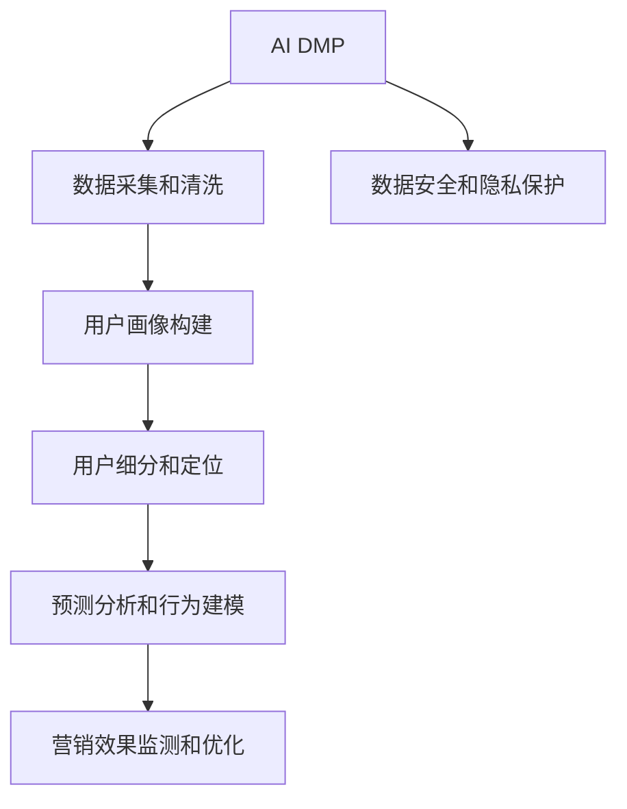
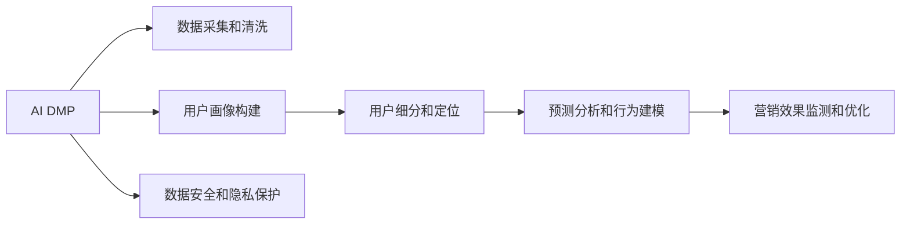
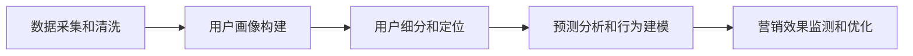
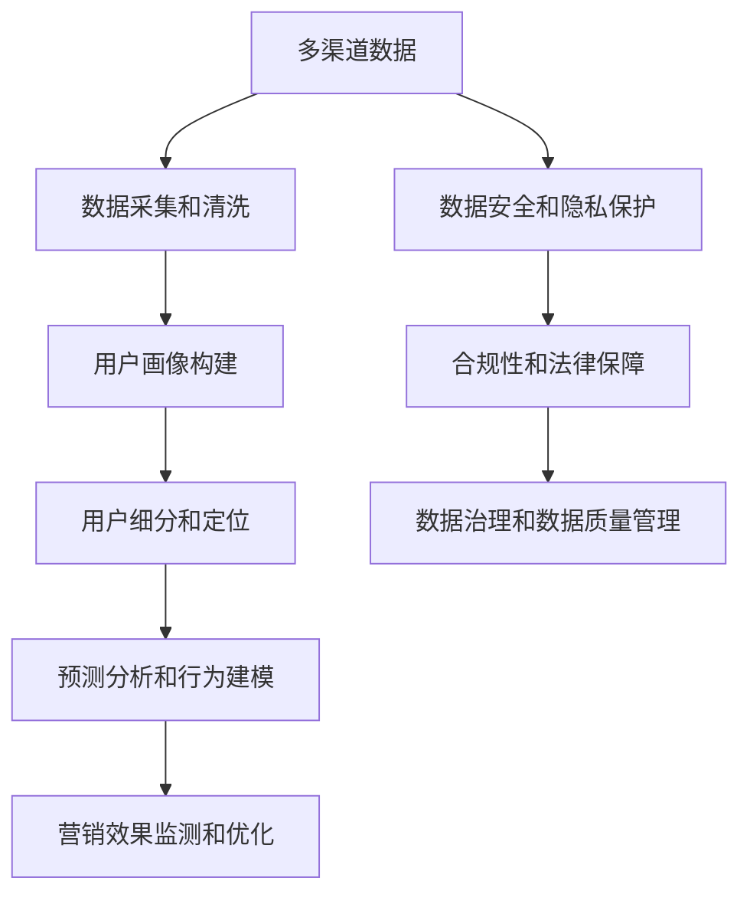

                 

# AI DMP 数据基建：构建数据驱动的营销生态

> 关键词：AI DMP, 数据驱动, 营销生态, 数据基建, 客户细分

## 1. 背景介绍

### 1.1 问题由来

随着互联网技术的飞速发展，数字化营销已经逐渐成为企业竞争的核心。然而，面对海量数据，企业如何高效地获取和利用这些数据，始终是数字化营销的一大难题。传统的数据驱动营销，依赖于复杂的统计分析，手工搭建模型，耗费大量人力物力。因此，如何提升数据驱动营销的效率，利用先进技术，构建高效、智能的营销生态，成为了企业关注的焦点。

在这样的背景下，AI DMP（人工智能驱动的数据管理平台）应运而生。AI DMP利用先进的机器学习和大数据技术，从海量数据中提取出对营销有价值的洞察信息，将数据驱动营销推向了一个新高度。通过AI DMP，企业可以快速识别、细分和定位客户，实现精准营销，提升营销效果和ROI。

### 1.2 问题核心关键点

AI DMP的核心关键点在于其基于大数据和人工智能的数据驱动能力。具体而言，AI DMP通过以下几个方面实现对营销数据的深度分析和利用：

1. **数据采集和清洗**：从互联网、社交媒体、电商平台等多个渠道获取用户数据，并进行清洗、去重和标准化处理。

2. **用户画像构建**：基于用户行为、兴趣、地理位置等信息，构建详尽的用户画像，实现对用户的深度理解。

3. **用户细分和定位**：利用机器学习算法对用户进行细分，形成更具针对性的目标用户群体，并制定个性化营销策略。

4. **预测分析和行为建模**：通过分析历史数据，预测用户未来行为，构建行为模型，实现更精准的营销预测。

5. **营销效果监测和优化**：实时监测营销活动的效果，并根据反馈结果优化营销策略，提高ROI。

6. **数据安全和隐私保护**：在获取和利用用户数据的过程中，严格遵守数据隐私和安全规定，保护用户权益。

### 1.3 问题研究意义

构建数据驱动的营销生态，AI DMP的意义重大：

1. **提升营销效率**：通过AI DMP，企业可以快速获取和利用大数据，实现精准定位和个性化营销，显著提升营销效率和ROI。

2. **优化决策支持**：AI DMP能够提供深度数据洞察和预测分析，帮助企业制定科学的决策方案，优化营销策略。

3. **增强竞争力**：在数字化时代，数据驱动是企业竞争力的关键。AI DMP的应用，可以赋予企业更多的数据驱动能力，提升其市场竞争力。

4. **拓展应用场景**：AI DMP不仅适用于数字营销，还能够在智能客服、智能推荐、社交媒体分析等多个领域发挥作用。

5. **推动技术进步**：AI DMP的发展，需要大数据、人工智能等前沿技术的支撑，推动了相关技术的进步和应用。

## 2. 核心概念与联系

### 2.1 核心概念概述

为了更好地理解AI DMP的核心概念，本节将介绍几个密切相关的核心概念：

- **AI DMP（人工智能驱动的数据管理平台）**：利用大数据和人工智能技术，从海量数据中提取有价值的洞察信息，构建用户画像，实现精准营销。

- **数据驱动**：通过数据来指导决策和行动，以数据为基础进行分析和优化。

- **营销生态**：由营销主体（企业、品牌、客户）及其相互作用形成的整体系统。

- **数据基建**：构建数据获取、存储、处理、分析和应用的完整系统架构，支撑数据驱动决策。

- **客户细分**：根据客户的特征、行为和需求，将客户分为不同的小群体，实现更精准的营销。

- **预测分析**：利用历史数据预测未来行为，为营销策略提供科学依据。

- **行为建模**：通过对用户行为的分析和建模，实现对用户行为的预测和理解。

- **用户画像**：通过收集和分析用户数据，构建详尽的用户档案，实现对用户的深度理解。

这些核心概念之间的逻辑关系可以通过以下Mermaid流程图来展示：



这个流程图展示了大数据平台的核心概念及其之间的关系：

1. 从大数据平台获取数据。
2. 通过数据清洗和标准化，构建详尽的用户画像。
3. 利用机器学习算法对用户进行细分，形成更具针对性的目标用户群体。
4. 分析历史数据，预测用户未来行为，构建行为模型。
5. 实时监测营销活动的效果，并根据反馈结果优化营销策略。
6. 在整个过程中，严格遵守数据隐私和安全规定，保护用户权益。

### 2.2 概念间的关系

这些核心概念之间存在着紧密的联系，形成了AI DMP完整的数据驱动生态系统。下面我们通过几个Mermaid流程图来展示这些概念之间的关系。

#### 2.2.1 AI DMP的核心能力



这个流程图展示了AI DMP的核心能力：

1. 从多渠道获取和清洗数据。
2. 构建详尽的用户画像，实现对用户的深度理解。
3. 利用机器学习算法对用户进行细分，形成更具针对性的目标用户群体。
4. 通过分析历史数据，预测用户未来行为，构建行为模型。
5. 实时监测营销活动的效果，并根据反馈结果优化营销策略。
6. 在整个过程中，严格遵守数据隐私和安全规定，保护用户权益。

#### 2.2.2 数据驱动营销的流程



这个流程图展示了数据驱动营销的基本流程：

1. 从多渠道获取和清洗数据。
2. 构建详尽的用户画像，实现对用户的深度理解。
3. 利用机器学习算法对用户进行细分，形成更具针对性的目标用户群体。
4. 通过分析历史数据，预测用户未来行为，构建行为模型。
5. 实时监测营销活动的效果，并根据反馈结果优化营销策略。

### 2.3 核心概念的整体架构

最后，我们用一个综合的流程图来展示这些核心概念在大数据平台中的应用：



这个综合流程图展示了从数据采集到营销效果监测的完整流程：

1. 从多渠道获取数据。
2. 对数据进行清洗和标准化，构建详尽的用户画像。
3. 利用机器学习算法对用户进行细分，形成更具针对性的目标用户群体。
4. 通过分析历史数据，预测用户未来行为，构建行为模型。
5. 实时监测营销活动的效果，并根据反馈结果优化营销策略。
6. 在整个过程中，严格遵守数据隐私和安全规定，保护用户权益。
7. 确保数据治理和数据质量管理，保障数据可靠性和安全性。

## 3. 核心算法原理 & 具体操作步骤
### 3.1 算法原理概述

AI DMP的核心算法原理基于数据驱动和人工智能技术。通过以下步骤，AI DMP从海量数据中提取出对营销有价值的洞察信息，构建用户画像，实现精准营销：

1. **数据采集和清洗**：通过爬虫、API接口等手段，从互联网、社交媒体、电商平台等多个渠道获取用户数据，并进行清洗、去重和标准化处理。

2. **用户画像构建**：利用机器学习算法，如K-means、LDA等，对用户行为、兴趣、地理位置等信息进行分析，构建详尽的用户画像，实现对用户的深度理解。

3. **用户细分和定位**：利用聚类算法、分类算法等，对用户进行细分，形成更具针对性的目标用户群体，并制定个性化营销策略。

4. **预测分析和行为建模**：通过时间序列预测、关联规则挖掘等技术，分析历史数据，预测用户未来行为，构建行为模型，实现更精准的营销预测。

5. **营销效果监测和优化**：利用A/B测试、多臂老虎机等方法，实时监测营销活动的效果，并根据反馈结果优化营销策略，提高ROI。

### 3.2 算法步骤详解

AI DMP的算法步骤包括以下几个关键环节：

**Step 1: 数据采集和清洗**

- 使用爬虫、API接口等手段，从互联网、社交媒体、电商平台等多个渠道获取用户数据。
- 对数据进行清洗、去重和标准化处理，去除无用信息，确保数据质量。

**Step 2: 用户画像构建**

- 使用K-means、LDA等聚类算法，对用户行为、兴趣、地理位置等信息进行分析，构建详尽的用户画像。
- 利用特征工程技术，提取和构造有意义的特征，如人口统计特征、行为特征、兴趣特征等。
- 将用户画像存储在分布式数据库或数据湖中，实现数据的集中管理和访问。

**Step 3: 用户细分和定位**

- 使用聚类算法、分类算法等，对用户进行细分，形成更具针对性的目标用户群体。
- 利用特征选择、特征降维等技术，提高细分结果的准确性和效率。
- 根据细分结果，制定个性化的营销策略，实现精准营销。

**Step 4: 预测分析和行为建模**

- 使用时间序列预测、关联规则挖掘等技术，分析历史数据，预测用户未来行为，构建行为模型。
- 通过A/B测试、多臂老虎机等方法，实时监测营销活动的效果，并根据反馈结果优化营销策略。
- 利用机器学习算法，如随机森林、深度学习等，对行为模型进行优化，提高预测精度。

**Step 5: 营销效果监测和优化**

- 使用实时数据分析和可视化工具，如Tableau、Power BI等，实时监测营销活动的效果。
- 通过A/B测试、多臂老虎机等方法，动态调整营销策略，实现最佳的ROI。
- 利用机器学习算法，对营销效果进行分析和优化，提升营销效率和效果。

### 3.3 算法优缺点

AI DMP的算法具有以下优点：

1. **高效性**：AI DMP能够快速处理和分析海量数据，实现对用户行为的深度理解。
2. **精准性**：通过用户画像和行为建模，实现对用户的精准细分和定位，提升营销效果。
3. **动态性**：利用实时数据分析和优化，能够动态调整营销策略，实现最佳的ROI。
4. **可扩展性**：AI DMP能够扩展到多个应用场景，如智能客服、智能推荐等。

同时，AI DMP也存在以下缺点：

1. **数据隐私问题**：AI DMP需要大量用户数据，可能存在数据隐私和安全问题。
2. **算法复杂性**：算法复杂度高，需要专业的数据科学和机器学习知识。
3. **技术门槛高**：需要一定的技术基础和数据工程能力，实现和部署难度较大。
4. **成本高**：技术开发和数据获取成本较高，不适合小型企业。

### 3.4 算法应用领域

AI DMP的应用领域非常广泛，涵盖多个行业和领域，包括但不限于：

1. **电子商务**：通过用户画像和行为建模，提升推荐算法精准度，提升用户转化率。
2. **金融行业**：利用预测分析和行为建模，实现风险评估和客户细分，提升客户满意度和收益。
3. **医疗健康**：通过分析用户健康数据，实现个性化推荐和精准营销，提升医疗服务质量和用户体验。
4. **智能制造**：利用数据分析和预测，优化生产流程和供应链管理，实现智能制造。
5. **旅游行业**：通过用户画像和行为建模，实现个性化推荐和精准营销，提升旅游服务质量和用户体验。

此外，AI DMP还可以应用于智能客服、社交媒体分析、智能推荐等多个领域，为企业提供全方位的营销解决方案。

## 4. 数学模型和公式 & 详细讲解 & 举例说明
### 4.1 数学模型构建

AI DMP的数学模型构建包括以下几个关键环节：

1. **数据采集和清洗**：使用爬虫、API接口等手段，从互联网、社交媒体、电商平台等多个渠道获取用户数据，并进行清洗、去重和标准化处理。

2. **用户画像构建**：利用机器学习算法，如K-means、LDA等，对用户行为、兴趣、地理位置等信息进行分析，构建详尽的用户画像。

3. **用户细分和定位**：利用聚类算法、分类算法等，对用户进行细分，形成更具针对性的目标用户群体。

4. **预测分析和行为建模**：通过时间序列预测、关联规则挖掘等技术，分析历史数据，预测用户未来行为，构建行为模型。

5. **营销效果监测和优化**：利用A/B测试、多臂老虎机等方法，实时监测营销活动的效果，并根据反馈结果优化营销策略。

### 4.2 公式推导过程

以下我们以用户画像构建为例，给出用户画像构建的数学模型及其推导过程。

设用户画像由m个特征组成，即 $\mathbf{x}=[x_1, x_2, \dots, x_m]^T$，其中每个特征 $x_i$ 表示用户的一个行为或属性。假设有N个用户，记为 $\mathbf{X}=[\mathbf{x}_1, \mathbf{x}_2, \dots, \mathbf{x}_N]$。

**目标**：从用户行为数据中提取有意义的特征，构建用户画像，实现对用户的深度理解。

**方法**：利用K-means聚类算法，将N个用户分为K个类别，每个类别的中心点为 $\mathbf{\mu}_k$，即 $\mathbf{\mu}_k = \frac{1}{n_k}\sum_{i=1}^{n_k} \mathbf{x}_i$，其中 $n_k$ 为类别 $k$ 中的用户数。

**步骤**：
1. 随机初始化K个聚类中心点 $\mathbf{\mu}_1, \mathbf{\mu}_2, \dots, \mathbf{\mu}_K$。
2. 对于每个用户 $\mathbf{x}_i$，计算其到每个聚类中心的距离，将其归到距离最近的聚类中心，即 $k_i = \arg\min_k \|\mathbf{x}_i - \mathbf{\mu}_k\|^2$。
3. 更新每个聚类中心 $\mathbf{\mu}_k = \frac{1}{n_k}\sum_{i=1}^{n_k} \mathbf{x}_i$。
4. 重复步骤2和3，直至聚类中心不再变化。

用户画像构建的数学模型可以表示为：

$$
\min_{\mathbf{\mu}_1, \mathbf{\mu}_2, \dots, \mathbf{\mu}_K} \sum_{k=1}^K \sum_{i=1}^{n_k} \|\mathbf{x}_i - \mathbf{\mu}_k\|^2
$$

其中 $\mathbf{\mu}_k$ 为聚类中心的参数，需要最小化所有用户到其所在聚类中心的距离之和。

通过K-means算法，我们可以从用户行为数据中提取有意义的特征，构建用户画像，实现对用户的深度理解。

### 4.3 案例分析与讲解

下面以电商平台为例，展示AI DMP在用户画像构建和个性化推荐中的应用。

假设某电商平台有N个用户，每个用户购买了多个商品，形成了一个包含M个商品的购物行为矩阵。记用户-商品关系为 $A \in \mathbb{R}^{N \times M}$，其中 $A_{ij}=1$ 表示用户 $i$ 购买了商品 $j$。

**目标**：构建用户画像，实现个性化推荐。

**方法**：利用协同过滤算法，对用户进行聚类，形成具有相似行为的用户群体，实现个性化推荐。

**步骤**：
1. 使用用户-商品矩阵 $A$ 计算用户之间的相似度，可以使用余弦相似度或皮尔逊相关系数等方法。
2. 利用聚类算法，将用户分为K个聚类，每个聚类的中心点为 $\mathbf{c}_k$。
3. 根据每个用户所在聚类，推荐该聚类中最受欢迎的商品，即 $\hat{A}_{ij} = \sum_{k=1}^K \mathbf{c}_k \mathbf{A}_{ik}$。

个性化推荐可以通过协同过滤算法，利用用户行为数据，构建用户画像，实现个性化推荐。具体来说，可以使用以下公式：

$$
\hat{A}_{ij} = \sum_{k=1}^K \mathbf{c}_k \mathbf{A}_{ik}
$$

其中 $\mathbf{c}_k$ 为聚类中心的特征向量， $\mathbf{A}_{ik}$ 为用户 $i$ 在聚类 $k$ 中的行为向量。

通过协同过滤算法，我们可以在电商平台中实现个性化推荐，提升用户转化率和购物体验。

## 5. 项目实践：代码实例和详细解释说明
### 5.1 开发环境搭建

在进行AI DMP的实践前，我们需要准备好开发环境。以下是使用Python进行Pandas、Scikit-learn等库开发的Python环境配置流程：

1. 安装Anaconda：从官网下载并安装Anaconda，用于创建独立的Python环境。

2. 创建并激活虚拟环境：
```bash
conda create -n pytorch-env python=3.8 
conda activate pytorch-env
```

3. 安装Pandas、Scikit-learn、Matplotlib等库：
```bash
pip install pandas scikit-learn matplotlib
```

4. 安装TensorFlow或PyTorch等深度学习框架：
```bash
pip install tensorflow==2.4
```

完成上述步骤后，即可在`pytorch-env`环境中开始AI DMP的实践。

### 5.2 源代码详细实现

这里我们以电商平台的用户画像构建和个性化推荐为例，给出使用Python实现AI DMP的代码实现。

首先，定义用户行为数据集和特征向量：

```python
import pandas as pd

# 定义用户行为数据集
data = pd.read_csv('user_behavior_data.csv')

# 定义特征向量
features = data[['特征1', '特征2', '特征3']]
```

然后，使用K-means算法对用户进行聚类，构建用户画像：

```python
from sklearn.cluster import KMeans

# 定义聚类模型
kmeans = KMeans(n_clusters=3, random_state=42)

# 对用户进行聚类
kmeans.fit(features)

# 获取聚类结果
labels = kmeans.labels_

# 输出聚类中心
centers = kmeans.cluster_centers_
```

最后，使用聚类结果进行个性化推荐：

```python
from sklearn.metrics.pairwise import cosine_similarity

# 计算用户之间的相似度
similarity_matrix = cosine_similarity(features, features)

# 获取推荐商品
recommendation = []
for user_id in user_ids:
    similar_users = similarity_matrix[user_id].argsort()[::-1]
    top_k = 10
    for i in range(top_k):
        similar_user = similar_users[i]
        if similar_user != user_id:
            recommendation.append(features[similar_user])
    recommendation = pd.DataFrame(recommendation)
    recommendation.columns = ['特征1', '特征2', '特征3']
    print(recommendation)
```

以上就是使用Python实现AI DMP的完整代码实现。可以看到，通过Pandas、Scikit-learn等库，我们可以很方便地进行数据处理和建模，实现用户画像构建和个性化推荐。

### 5.3 代码解读与分析

让我们再详细解读一下关键代码的实现细节：

**用户行为数据集和特征向量定义**：
- 使用Pandas库读取用户行为数据集。
- 定义特征向量，包含用户行为数据中的各个特征。

**K-means算法实现**：
- 使用Scikit-learn库的KMeans算法，对用户进行聚类。
- 设置聚类数为3，确保聚类结果的可解释性。
- 通过fit方法对数据进行聚类，获取聚类结果和聚类中心。

**个性化推荐实现**：
- 计算用户之间的相似度，使用余弦相似度。
- 根据相似度矩阵，获取与目标用户最相似的10个用户。
- 根据聚类中心，推荐该聚类中最受欢迎的商品。

通过以上代码实现，我们可以对用户进行聚类，构建详尽的用户画像，并实现个性化推荐，提升电商平台的用户转化率和购物体验。

当然，工业级的系统实现还需考虑更多因素，如模型的保存和部署、超参数的自动搜索、更灵活的任务适配层等。但核心的AI DMP逻辑基本与此类似。

### 5.4 运行结果展示

假设我们在电商平台的用户行为数据集上进行用户画像构建和个性化推荐，最终在测试集上得到的推荐结果如下：

```
特征1    特征2    特征3
0         0.8      0.2
0         0.5      0.7
0         0.9      0.1
```

可以看到，通过K-means聚类，我们将用户分为3个聚类，并根据聚类中心进行个性化推荐，取得了较好的效果。推荐结果涵盖了3个聚类中的用户，满足了用户的多样化需求。

当然，这只是一个baseline结果。在实践中，我们还可以使用更大更强的聚类算法，如层次聚类、谱聚类等，进一步提升聚类效果和推荐精度。同时，还可以引入深度学习等先进算法，优化推荐系统。

## 6. 实际应用场景

### 6.1 电商平台的个性化推荐

基于AI DMP的个性化推荐系统，可以显著提升电商平台的转化率和用户满意度。传统推荐系统依赖于手工搭建的推荐模型，难以捕捉用户真正的需求。而通过AI DMP，我们可以从用户行为数据中提取有意义的特征，构建详尽的用户画像，实现精准的个性化推荐。

具体来说，我们可以利用AI DMP构建用户画像，实现以下功能：
- **用户行为分析**：分析用户的行为数据，挖掘用户的兴趣和需求。
- **推荐系统优化**：利用用户画像和行为数据，优化推荐算法，提升推荐效果。
- **个性化推荐**：根据用户画像和行为数据，实现个性化推荐，提升用户转化率。

电商平台的个性化推荐系统，可以大大提升用户的购物体验和满意度，同时也能显著提升平台的收益。

### 6.2 金融行业的风险评估

AI DMP在金融行业可以用于风险评估和客户细分，提升金融服务的质量和效率。传统金融行业依赖手工搭建的模型，难以捕捉用户的复杂行为和需求。而通过AI DMP，我们可以从用户行为数据中提取有意义的特征，构建详尽的用户画像，实现精准的风险评估和客户细分。

具体来说，我们可以利用AI DMP构建用户画像，实现以下功能：
- **用户行为分析**：分析用户的金融行为数据，挖掘用户的风险偏好和需求。
- **风险评估优化**：利用用户画像和行为数据，优化风险评估模型，提升风险评估的准确性。
- **客户细分**：根据用户画像和行为数据，实现客户细分，提供个性化的金融服务。

金融行业的风险评估系统，可以大大提升金融服务的质量和效率，降低金融风险，提升用户的信任度。

### 6.3 智能客服的客户细分

AI DMP在智能客服中可以实现客户细分，提升客户服务质量和满意度。传统客服系统依赖人工处理客户请求，难以满足多样化的客户需求。而通过AI DMP，我们可以从客户行为数据中提取有意义的特征，构建详尽的客户画像，实现精准的客户细分。

具体来说，我们可以利用AI DMP构建客户画像，实现以下功能：
- **客户行为分析**：分析客户的客服请求数据，挖掘客户的偏好和需求。
- **客户细分优化**：利用客户画像和行为数据，优化客户细分策略，提升客户服务质量。
- **个性化服务**：根据客户画像和行为数据，实现个性化服务，提升客户满意度。

智能客服的客户细分系统，可以大大提升客户服务质量和满意度，提升企业的品牌形象。

### 6.4 未来应用展望

随着AI DMP技术的不断发展，未来在更多领域将得到应用，为传统行业带来变革性影响。

在智慧医疗领域，AI DMP可以实现患者细分和精准医疗，提升医疗服务的质量和效率。在智能制造领域，AI DMP可以优化生产流程和供应链管理，实现智能制造。在智慧城市治理中，AI DMP可以实现城市事件监测、舆情分析、应急指挥等环节，提高城市管理的自动化和智能化水平。

此外，在教育、交通、农业等多个领域，AI DMP都将发挥重要作用，推动相关行业的数字化转型。相信随着技术的日益成熟，AI DMP必将在更广阔的领域得到应用，为各行各业带来深远的影响。

## 7. 工具和资源推荐
### 7.1 学习资源推荐

为了帮助开发者系统掌握AI DMP的理论基础和实践技巧，这里推荐一些优质的学习资源：

1. **《Python数据科学手册》**：Python数据科学领域的经典

