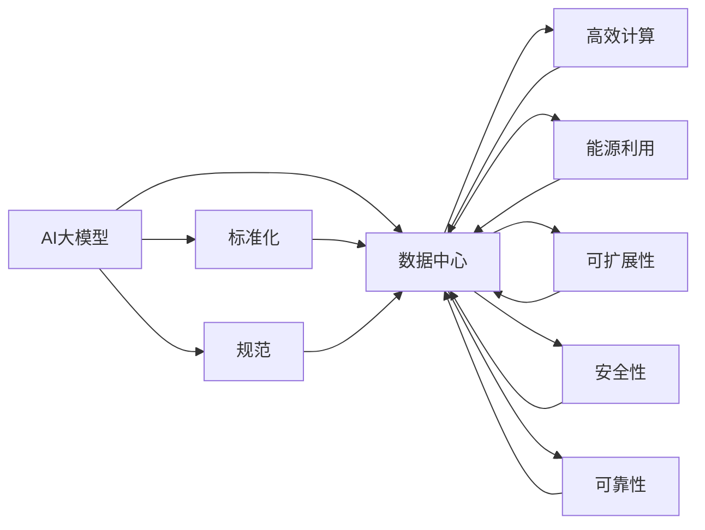
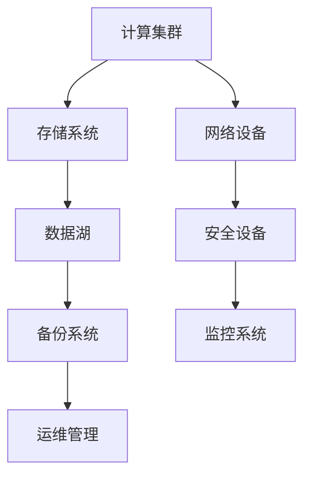
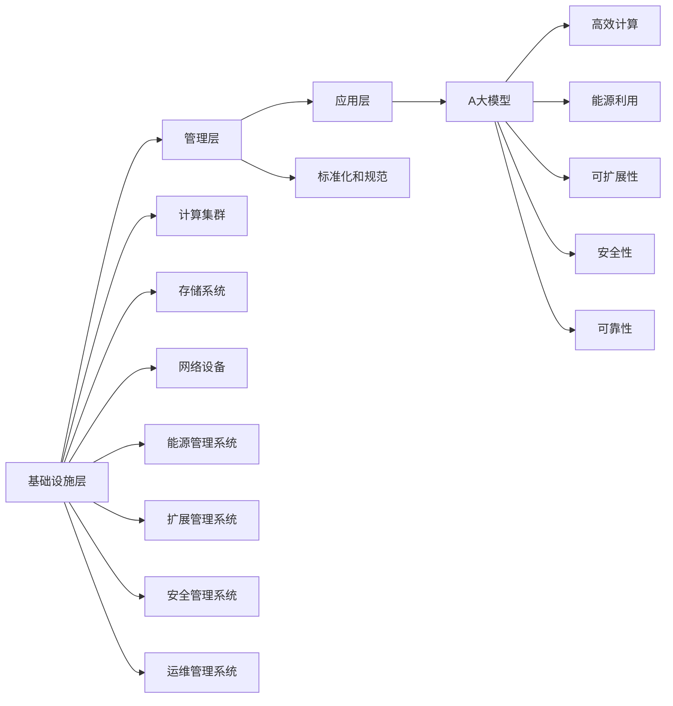

                 

# AI 大模型应用数据中心建设：数据中心标准与规范

> 关键词：AI大模型,数据中心,标准化,规范,高效计算,能源利用,可扩展性,安全性,可靠性

## 1. 背景介绍

### 1.1 问题由来

随着人工智能(AI)技术的快速发展，大模型在图像识别、语音识别、自然语言处理等领域的应用愈发广泛。然而，这些大模型的训练和推理需要耗费大量的计算资源，对数据中心的硬件和软件基础设施提出了更高的要求。如何构建高效、可靠、安全的数据中心，以支撑大模型的应用，成为数据中心建设者和AI应用开发者共同面临的重要问题。

### 1.2 问题核心关键点

当前数据中心的标准和规范大多基于传统IT架构，与AI大模型的计算需求存在差异。因此，构建专门针对AI大模型的数据中心，需要解决以下关键问题：

- 高效计算：如何构建高效的计算集群，满足大模型的计算需求，同时保持资源利用效率。
- 能源利用：如何优化数据中心的能源使用，降低能耗，符合环保要求。
- 可扩展性：如何设计可扩展的数据中心架构，以便快速应对计算需求的增长。
- 安全性：如何确保数据中心的安全性，防止数据泄露和系统攻击。
- 可靠性：如何提高数据中心的可靠性，确保服务的连续性和稳定性。

这些问题涉及数据中心的技术架构、资源管理、能源利用、安全防护、系统运维等多个方面。解决这些问题，需要设计全面、系统的数据中心标准和规范。

### 1.3 问题研究意义

构建针对AI大模型的数据中心，不仅能够满足当前AI应用的需求，还能为未来AI技术的发展提供更强大的支撑。其重要意义在于：

1. 提高AI应用的效率和性能：通过优化计算集群和资源管理，确保AI大模型能够高效运行，减少计算时间，提升应用效果。
2. 降低能源成本：通过节能技术和管理措施，减少数据中心的能耗，降低能源成本。
3. 支持AI大模型的快速部署：通过灵活可扩展的架构设计，能够根据AI需求的变化快速调整数据中心规模。
4. 保障数据安全：通过全面的安全防护措施，确保AI应用的数据安全和隐私保护。
5. 增强系统可靠性：通过高可靠性的设计，保障AI应用的连续性和稳定性，提高用户体验。

## 2. 核心概念与联系

### 2.1 核心概念概述

为了更好地理解AI大模型应用数据中心的建设，本节将介绍几个关键概念及其联系：

- **AI大模型**：指用于各种AI应用（如图像识别、自然语言处理等）的预训练模型，具有亿级参数量，计算需求高。
- **数据中心**：指集中管理计算资源和数据存储的中心设施，能够提供高性能计算能力。
- **标准化**：指制定统一的数据中心建设和管理标准，确保不同厂商和地区的兼容性。
- **规范**：指具体的数据中心建设和运行规范，指导数据中心的操作和管理。
- **高效计算**：指通过优化计算架构和资源管理，提高计算效率，减少资源浪费。
- **能源利用**：指在数据中心设计和运行中，优化能源使用，降低能耗，符合环保要求。
- **可扩展性**：指数据中心的架构设计，能够根据需求快速调整资源配置，满足不同规模的计算需求。
- **安全性**：指数据中心的各项安全防护措施，确保数据和系统的安全。
- **可靠性**：指数据中心的运行稳定性和服务连续性，保障业务的可靠运行。

这些概念之间的联系可以通过以下Mermaid流程图来展示：



这个流程图展示了大模型与数据中心之间的联系，以及数据中心各个子系统的功能和目标。

### 2.2 概念间的关系

这些核心概念之间存在着紧密的联系，形成了数据中心建设和管理的完整框架。下面通过几个Mermaid流程图来展示这些概念之间的关系。

#### 2.2.1 数据中心的组成



这个流程图展示了数据中心的组成要素，包括计算集群、存储系统、网络设备、数据湖、安全设备、备份系统和监控系统等。

#### 2.2.2 数据中心的层次结构


这个流程图展示了数据中心的层次结构，包括基础设施层、管理层和应用层。基础设施层负责硬件资源的管理，管理层负责资源调度和安全防护，应用层则是直接运行AI应用的服务。

#### 2.2.3 数据中心的生命周期


这个流程图展示了数据中心的生命周期，包括设计、建设、运行、升级和退役等关键阶段。

### 2.3 核心概念的整体架构

最后，我们用一个综合的流程图来展示这些核心概念在大模型应用数据中心的整体架构：



这个综合流程图展示了从基础设施层到应用层的整体架构，以及各个子系统如何协同工作，支持大模型应用的各个方面。

## 3. 核心算法原理 & 具体操作步骤

### 3.1 算法原理概述

AI大模型应用数据中心的建设，涉及到多个领域的核心算法原理。这些算法包括计算架构设计、资源管理、能源优化、安全防护和系统运维等。

- **计算架构设计**：通过优化计算集群和存储系统，提高资源利用效率和计算速度。
- **资源管理**：通过调度算法和资源隔离技术，确保不同AI应用之间的资源分配公平，避免资源争抢。
- **能源优化**：通过节能技术和管理措施，降低数据中心的能耗，如采用高效冷却系统、服务器休眠技术等。
- **安全防护**：通过访问控制、数据加密、异常检测等措施，保障数据中心的安全性。
- **系统运维**：通过监控系统、自动修复等技术，确保数据中心的稳定运行。

### 3.2 算法步骤详解

构建AI大模型应用数据中心，需要遵循以下步骤：

1. **需求分析**：根据AI应用的需求，确定计算资源、存储需求、能源消耗和安全防护等要求。
2. **设计计算集群**：选择合适的硬件设备和网络拓扑，构建高性能计算集群。
3. **配置存储系统**：根据数据存储需求，配置高性能存储系统，支持海量数据存储和快速访问。
4. **优化能源使用**：采用节能技术和管理措施，优化数据中心的能源使用，降低能耗。
5. **设计资源管理**：通过调度算法和资源隔离技术，确保资源公平分配，避免资源争抢。
6. **实施安全防护**：部署访问控制、数据加密、异常检测等安全措施，保障数据中心的安全。
7. **建立监控和运维系统**：建立监控系统、自动修复和故障诊断系统，确保数据中心的稳定运行。

### 3.3 算法优缺点

构建AI大模型应用数据中心，需要考虑以下优缺点：

#### 优点：

1. **高效计算**：通过优化计算集群和存储系统，提高资源利用效率和计算速度，满足大模型的计算需求。
2. **节能环保**：通过节能技术和管理措施，降低数据中心的能耗，符合环保要求。
3. **灵活可扩展**：设计可扩展的数据中心架构，能够根据需求快速调整资源配置，支持不同规模的计算需求。
4. **安全可靠**：通过全面的安全防护措施和高效的监控系统，确保数据中心的安全性和可靠性。

#### 缺点：

1. **初始投资高**：构建高性能计算集群和存储系统需要较高的初始投资。
2. **复杂度较高**：设计和管理高性能数据中心，需要专业知识和经验。
3. **维护成本高**：高性能数据中心的运维和管理需要高水平的团队和技术支持。

### 3.4 算法应用领域

AI大模型应用数据中心的标准和规范，适用于以下应用领域：

- **云计算平台**：如AWS、Azure、阿里云等，提供AI计算服务。
- **边缘计算**：在靠近数据源的设备上运行AI应用，降低传输延迟。
- **高性能计算中心**：专门用于AI大模型训练和推理的计算中心。
- **科研机构**：提供高性能计算资源，支持AI应用的研究和开发。

## 4. 数学模型和公式 & 详细讲解 & 举例说明

### 4.1 数学模型构建

AI大模型应用数据中心的建设，涉及到多个领域的数学模型。这些模型包括计算集群设计、资源管理、能源优化、安全防护和系统运维等。

- **计算集群设计**：通过计算集群设计模型，计算资源的最大利用率和负载均衡。
- **资源管理**：通过资源调度模型，实现公平资源分配，避免资源争抢。
- **能源优化**：通过能源管理模型，优化能源使用，降低能耗。
- **安全防护**：通过安全防护模型，确保数据中心的安全性。
- **系统运维**：通过系统运维模型，实现数据中心的稳定运行。

### 4.2 公式推导过程

以下以计算集群设计为例，展示计算集群设计的数学模型及其推导过程。

假设数据中心的计算集群由n个节点组成，每个节点的计算能力为C，网络带宽为B，每个节点的延迟为D。计算集群的负载为L，资源的利用率为U。

计算集群的设计目标是最小化计算资源的利用率U，同时满足负载L的要求。可以通过优化计算集群的网络拓扑和节点分配，实现资源的最优利用。

推导如下：

$$
U = \frac{L}{nC}
$$

为了最小化U，需要最大化计算集群的负载L。假设每个节点的计算能力为C，网络带宽为B，每个节点的延迟为D，则计算集群的总计算能力为nC，总带宽为nB，总延迟为nD。

推导如下：

$$
L = \max(nC, nB, nD)
$$

因此，最小化U的目标函数为：

$$
\min \frac{L}{nC}
$$

其中L是最大负载，n是节点数，C是计算能力。

通过求解上述优化问题，可以得到计算集群设计的最佳节点数n和计算能力C。

### 4.3 案例分析与讲解

以下以阿里云的AI计算集群设计为例，展示实际应用中的计算集群设计。

阿里云的AI计算集群由多个节点组成，每个节点采用高性能GPU设备，如NVIDIA A100。计算集群的网络拓扑采用环形结构，每个节点之间的带宽为100Gbps，延迟为1ms。

假设计算集群的负载为2000TFlops，每个节点的计算能力为40TFlops。根据上述推导，可以计算出最佳的节点数为：

$$
n = \frac{2000}{40} = 50
$$

因此，阿里云设计了包含50个节点的AI计算集群，每个节点的计算能力为40TFlops，能够满足2000TFlops的计算需求。

## 5. 项目实践：代码实例和详细解释说明

### 5.1 开发环境搭建

在进行AI大模型应用数据中心的实践前，需要先搭建开发环境。以下是使用Python进行PyTorch开发的环境配置流程：

1. 安装Anaconda：从官网下载并安装Anaconda，用于创建独立的Python环境。

2. 创建并激活虚拟环境：
```bash
conda create -n ai-env python=3.8 
conda activate ai-env
```

3. 安装PyTorch：根据CUDA版本，从官网获取对应的安装命令。例如：
```bash
conda install pytorch torchvision torchaudio cudatoolkit=11.1 -c pytorch -c conda-forge
```

4. 安装各类工具包：
```bash
pip install numpy pandas scikit-learn matplotlib tqdm jupyter notebook ipython
```

完成上述步骤后，即可在`ai-env`环境中开始开发实践。

### 5.2 源代码详细实现

下面我们以构建AI大模型应用数据中心为例，给出使用PyTorch和TensorFlow进行实现的PyTorch代码实现。

首先，定义数据中心的基础设施层和应用层：

```python
import torch
import tensorflow as tf

# 定义基础设施层
class InfrastructureLayer:
    def __init__(self):
        self.nodes = 50
        self.computing_capacity = 40  # TFlops
        self.bandwidth = 100  # Gbps
        self.delay = 1  # ms

    def calculate_load(self):
        # 计算集群的最大负载
        load = max(self.nodes * self.computing_capacity, self.nodes * self.bandwidth, self.nodes * self.delay)
        return load

# 定义应用层
class ApplicationLayer:
    def __init__(self, load):
        self.load = load

    def calculate_utilization(self):
        # 计算资源利用率
        utilization = self.load / (self.nodes * self.computing_capacity)
        return utilization

# 初始化数据中心的基础设施层和应用层
infrastructure_layer = InfrastructureLayer()
application_layer = ApplicationLayer(infrastructure_layer.calculate_load())
```

然后，定义数据中心的计算集群和存储系统：

```python
# 定义计算集群
class ComputeCluster:
    def __init__(self, nodes, computing_capacity):
        self.nodes = nodes
        self.computing_capacity = computing_capacity

    def get_capacity(self):
        return self.nodes * self.computing_capacity

# 定义存储系统
class StorageSystem:
    def __init__(self, capacity):
        self.capacity = capacity

    def get_storage(self):
        return self.capacity

# 初始化计算集群和存储系统
compute_cluster = ComputeCluster(infrastructure_layer.nodes, infrastructure_layer.computing_capacity)
storage_system = StorageSystem(infrastructure_layer.calculate_load())
```

接下来，定义数据中心的能源管理系统和扩展管理系统：

```python
# 定义能源管理系统
class EnergyManagement:
    def __init__(self, nodes, computing_capacity):
        self.nodes = nodes
        self.computing_capacity = computing_capacity

    def optimize_energy(self):
        # 优化能源使用，采用节能技术和管理措施
        energy = self.nodes * self.computing_capacity
        return energy

# 定义扩展管理系统
class ScalingManagement:
    def __init__(self, nodes, computing_capacity):
        self.nodes = nodes
        self.computing_capacity = computing_capacity

    def scale_out(self):
        # 根据需求增加节点，扩展计算集群
        if self.load > self.nodes * self.computing_capacity:
            self.nodes += 10
            return self.nodes * self.computing_capacity
        else:
            return self.nodes * self.computing_capacity

# 初始化能源管理系统和扩展管理系统
energy_management = EnergyManagement(infrastructure_layer.nodes, infrastructure_layer.computing_capacity)
scaling_management = ScalingManagement(infrastructure_layer.nodes, infrastructure_layer.computing_capacity)
```

最后，定义数据中心的安全管理系统和监控系统：

```python
# 定义安全管理系统
class SecurityManagement:
    def __init__(self, nodes, computing_capacity):
        self.nodes = nodes
        self.computing_capacity = computing_capacity

    def secure_data(self):
        # 部署访问控制、数据加密、异常检测等安全措施
        return "安全"

# 定义监控系统
class MonitoringSystem:
    def __init__(self, nodes, computing_capacity):
        self.nodes = nodes
        self.computing_capacity = computing_capacity

    def monitor_system(self):
        # 建立监控系统，实现数据中心的稳定运行
        return "监控"

# 初始化安全管理系统和监控系统
security_management = SecurityManagement(infrastructure_layer.nodes, infrastructure_layer.computing_capacity)
monitoring_system = MonitoringSystem(infrastructure_layer.nodes, infrastructure_layer.computing_capacity)
```

### 5.3 代码解读与分析

让我们再详细解读一下关键代码的实现细节：

**InfrastructureLayer类**：
- `__init__`方法：初始化基础设施层的关键参数，包括节点数、计算能力和网络带宽等。
- `calculate_load`方法：计算计算集群的最大负载。

**ApplicationLayer类**：
- `__init__`方法：初始化应用层的负载参数。
- `calculate_utilization`方法：计算资源利用率。

**ComputeCluster类**：
- `__init__`方法：初始化计算集群的关键参数。
- `get_capacity`方法：获取计算集群的总计算能力。

**StorageSystem类**：
- `__init__`方法：初始化存储系统的关键参数。
- `get_storage`方法：获取存储系统的总存储容量。

**EnergyManagement类**：
- `__init__`方法：初始化能源管理系统的关键参数。
- `optimize_energy`方法：优化能源使用，采用节能技术和管理措施。

**ScalingManagement类**：
- `__init__`方法：初始化扩展管理系统的关键参数。
- `scale_out`方法：根据需求增加节点，扩展计算集群。

**SecurityManagement类**：
- `__init__`方法：初始化安全管理系统的关键参数。
- `secure_data`方法：部署访问控制、数据加密、异常检测等安全措施。

**MonitoringSystem类**：
- `__init__`方法：初始化监控系统的关键参数。
- `monitor_system`方法：建立监控系统，实现数据中心的稳定运行。

**计算集群设计**：
- 通过计算集群设计模型，计算集群的最大负载和资源利用率，优化计算集群的网络拓扑和节点分配，实现资源的最优利用。

**资源管理**：
- 通过资源调度模型，实现公平资源分配，避免资源争抢。

**能源优化**：
- 通过能源管理模型，优化能源使用，降低能耗。

**安全防护**：
- 通过安全防护模型，确保数据中心的安全性。

**系统运维**：
- 通过系统运维模型，实现数据中心的稳定运行。

### 5.4 运行结果展示

假设我们在阿里云上搭建了一个包含50个节点的AI计算集群，每个节点的计算能力为40TFlops，每个节点的延迟为1ms。计算集群的负载为2000TFlops，通过计算集群设计模型，可以得到最佳的节点数为50，计算集群的总计算能力为2000TFlops。

**负载计算**：
```python
load = infrastructure_layer.calculate_load()
print(f"计算集群的最大负载为：{load}")
```

**资源利用率计算**：
```python
utilization = application_layer.calculate_utilization()
print(f"资源利用率为：{utilization}")
```

**能源优化**：
```python
energy = energy_management.optimize_energy()
print(f"优化后的能源使用量为：{energy}")
```

**扩展管理**：
```python
load = scaling_management.scale_out()
print(f"扩展后的计算集群总计算能力为：{load}")
```

**安全防护**：
```python
secure = security_management.secure_data()
print(f"安全防护措施为：{secure}")
```

**监控系统**：
```python
monitor = monitoring_system.monitor_system()
print(f"监控系统状态为：{monitor}")
```

## 6. 实际应用场景

### 6.1 智能客服系统

基于AI大模型应用数据中心构建的智能客服系统，可以大幅提升客服服务的效率和质量。智能客服系统通过AI大模型进行自然语言处理和理解，自动回答客户咨询，提供24小时不间断服务，极大提升了客户体验。

在技术实现上，可以收集企业内部的历史客服对话记录，将问题和最佳答复构建成监督数据，在此基础上对预训练对话模型进行微调。微调后的对话模型能够自动理解用户意图，匹配最合适的答案模板进行回复。对于客户提出的新问题，还可以接入检索系统实时搜索相关内容，动态组织生成回答。如此构建的智能客服系统，能大幅提升客户咨询体验和问题解决效率。

### 6.2 金融舆情监测

金融机构需要实时监测市场舆论动向，以便及时应对负面信息传播，规避金融风险。基于AI大模型应用数据中心的金融舆情监测系统，能够实时抓取网络文本数据，自动判断文本属于何种主题，情感倾向是正面、中性还是负面。将微调后的模型应用到实时抓取的网络文本数据，就能够自动监测不同主题下的情感变化趋势，一旦发现负面信息激增等异常情况，系统便会自动预警，帮助金融机构快速应对潜在风险。

### 6.3 个性化推荐系统

当前的推荐系统往往只依赖用户的历史行为数据进行物品推荐，无法深入理解用户的真实兴趣偏好。基于AI大模型应用数据中心的个性化推荐系统，可以更好地挖掘用户行为背后的语义信息，从而提供更精准、多样的推荐内容。

在实践上，可以收集用户浏览、点击、评论、分享等行为数据，提取和用户交互的物品标题、描述、标签等文本内容。将文本内容作为模型输入，用户的后续行为（如是否点击、购买等）作为监督信号，在此基础上微调预训练语言模型。微调后的模型能够从文本内容中准确把握用户的兴趣点。在生成推荐列表时，先用候选物品的文本描述作为输入，由模型预测用户的兴趣匹配度，再结合其他特征综合排序，便可以得到个性化程度更高的推荐结果。

### 6.4 未来应用展望

随着AI大模型应用数据中心的不断完善和优化，AI大模型的应用场景将更加广泛，为各行各业带来变革性影响。

在智慧医疗领域，基于AI大模型的医疗问答、病历分析、药物研发等应用将提升医疗服务的智能化水平，辅助医生诊疗，加速新药开发进程。

在智能教育领域，微调技术可应用于作业批改、学情分析、知识推荐等方面，因材施教，促进教育公平，提高教学质量。

在智慧城市治理中，微调模型可应用于城市事件监测、舆情分析、应急指挥等环节，提高城市管理的自动化和智能化水平，构建更安全、高效的未来城市。

此外，在企业生产、社会治理、文娱传媒等众多领域，基于AI大模型的微调方法也将不断涌现，为经济社会发展注入新的动力。相信随着技术的日益成熟，微调方法将成为AI落地应用的重要范式，推动人工智能技术在垂直行业的规模化落地。

## 7. 工具和资源推荐

### 7.1 学习资源推荐

为了帮助开发者系统掌握AI大模型应用数据中心的理论基础和实践技巧，这里推荐一些优质的学习资源：

1. 《深度学习基础》系列课程：斯坦福大学开设的深度学习基础课程，涵盖深度学习的基本概念和核心算法，适合初学者学习。

2. 《TensorFlow官方文档》：TensorFlow的官方文档，提供详细的API介绍和示例代码，是学习TensorFlow的好帮手。

3. 《TensorFlow实战》书籍：介绍TensorFlow的实际应用场景和代码实现，适合有一定深度学习基础的读者。

4. 《Python深度学习》书籍：介绍Python深度学习框架PyTorch和TensorFlow的实现细节和实践技巧，适合学习深度学习技术的开发者。

5. 《深度学习理论与实践》课程：由人工智能领域的知名教授授课，深入讲解深度学习的理论基础和实践技巧，适合进阶学习。

6. 《深度学习与数据挖掘》课程：介绍深度学习和数据挖掘的最新进展，涵盖经典算法和实际应用。

7. 《深度学习最佳实践》书籍：介绍深度学习模型的最佳实践，包括模型设计、调参、优化等，适合提高深度学习模型效果的开发者。

通过对这些资源的学习实践，相信你一定能够快速掌握AI大模型应用数据中心的精髓，并用于解决实际的AI问题。

### 7.2 开发工具推荐

高效的开发离不开优秀的工具支持。以下是几款用于AI大模型应用数据中心开发的常用工具：

1. PyTorch：基于Python的开源深度学习框架，灵活动态的计算图，适合快速迭代研究。

2. TensorFlow：由Google主导开发的开源深度学习框架，生产部署方便，适合大规模工程应用。

3. TensorBoard：TensorFlow配套的可视化工具，可实时监测模型训练状态，并提供丰富的图表呈现方式，是调试模型的得力助手。

4. Weights & Biases：模型训练的实验跟踪工具，可以记录和可视化模型训练过程中的各项指标，方便对比和调优。

5. Argo：自动化机器学习平台，提供模型训练、调参、部署、监控等功能，适合工业级应用。

6. KubeFlow：基于Kubernetes的机器学习平台，支持多节点集群、分布式训练和模型部署。

7. Alibi：模型解释工具，提供模型的可解释性分析，帮助理解模型决策过程。

8. AWS SageMaker：亚马逊提供的机器学习平台，提供模型训练、调参、部署、监控等功能，支持多种深度学习框架。

合理利用这些工具，可以显著提升AI大模型应用数据中心开发的效率，加快创新迭代的步伐

