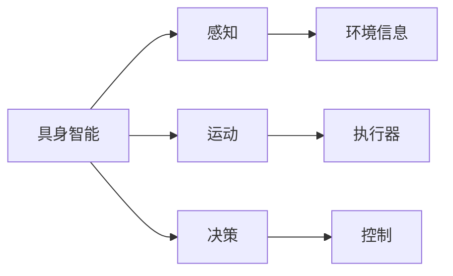

# AI Agent: AI的下一个风口 具身智能在硬件设计中的应用

作者：禅与计算机程序设计艺术 / Zen and the Art of Computer Programming

## 1. 背景介绍

### 1.1 问题的由来

随着人工智能（AI）技术的飞速发展，AI应用已渗透到各个领域，从语音助手、自动驾驶到医疗诊断，AI都在不断改变着我们的生活。然而，目前大多数AI应用还停留在虚拟环境中，缺乏与真实世界的交互能力。为了使AI更好地适应现实世界，我们需要将AI技术与物理世界相结合，实现具身智能（Embodied AI）。本文将探讨具身智能在硬件设计中的应用，并分析其发展趋势与挑战。

### 1.2 研究现状

近年来，随着机器学习、传感器技术、机器人技术等领域的快速发展，具身智能逐渐成为研究热点。目前，具有代表性的具身智能系统包括：

- **机器人**：具有视觉、听觉、触觉等感知能力，可以自主移动和执行任务。
- **无人机**：具有飞行能力，可用于物流、巡检等领域。
- **可穿戴设备**：如智能眼镜、手环等，可以收集人体生理数据，用于健康监测、运动辅助等。
- **智能家居**：可以通过语音、图像等信号与人类进行交互，实现家居自动化。

### 1.3 研究意义

具身智能在硬件设计中的应用具有以下重要意义：

- **拓展AI应用场景**：将AI与物理世界相结合，使得AI能够更好地适应现实环境，拓展AI应用场景。
- **提升AI决策能力**：通过感知设备获取更多信息，使AI能够更全面地了解环境，从而做出更准确的决策。
- **推动硬件技术发展**：具身智能的研究将推动传感器技术、机器人技术、材料科学等领域的发展。

### 1.4 本文结构

本文将首先介绍具身智能的核心概念与联系，然后详细阐述具身智能在硬件设计中的应用原理和具体操作步骤。接着，我们将介绍相关的数学模型和公式，并结合实际案例进行分析。最后，我们将探讨具身智能在硬件设计中的应用场景、未来发展趋势与挑战。

## 2. 核心概念与联系

### 2.1 核心概念

- **具身智能（Embodied AI）**：指将AI与物理世界相结合，使AI具备感知、运动和决策能力。
- **感知**：通过传感器获取环境信息，如视觉、听觉、触觉等。
- **运动**：通过执行器（如电机、舵机等）控制物理设备进行动作。
- **决策**：根据感知信息，进行决策并控制设备执行任务。

### 2.2 联系

以下是具身智能相关概念之间的逻辑关系图：



从图中可以看出，具身智能将感知、运动和决策三个环节有机地结合在一起，使AI具备适应物理世界的能力。

## 3. 核心算法原理 & 具体操作步骤

### 3.1 算法原理概述

具身智能在硬件设计中的应用主要基于以下原理：

1. **感知**：通过传感器获取环境信息，如视觉、听觉、触觉等。
2. **数据处理**：对感知数据进行预处理、特征提取和融合，为决策提供依据。
3. **决策**：根据处理后的数据，使用机器学习算法进行决策，控制执行器执行任务。
4. **运动**：根据决策结果，控制执行器进行相应的动作。

### 3.2 算法步骤详解

1. **感知**：选择合适的传感器，如摄像头、麦克风、触摸屏等，获取环境信息。
2. **数据处理**：对感知数据进行预处理，如去噪、降维等，然后进行特征提取，提取出对任务有用的信息。常用的特征提取方法包括卷积神经网络（CNN）、循环神经网络（RNN）等。
3. **决策**：根据处理后的数据，使用机器学习算法进行决策。常用的算法包括支持向量机（SVM）、决策树、神经网络等。
4. **运动**：根据决策结果，控制执行器进行相应的动作。常用的执行器包括电机、舵机、伺服系统等。

### 3.3 算法优缺点

- **优点**：
  - 具备适应现实世界的能力。
  - 能够根据环境变化进行决策和行动。
  - 能够实现复杂任务自动化。
- **缺点**：
  - 传感器成本较高。
  - 数据处理和决策算法复杂。
  - 执行器控制精度和稳定性有待提高。

### 3.4 算法应用领域

具身智能在以下领域具有广泛的应用：

- **机器人**：如工业机器人、服务机器人、巡检机器人等。
- **无人机**：如物流无人机、农业无人机、搜救无人机等。
- **可穿戴设备**：如智能眼镜、手环、健康监测设备等。
- **智能家居**：如智能音响、智能门锁、智能灯光等。

## 4. 数学模型和公式 & 详细讲解 & 举例说明

### 4.1 数学模型构建

具身智能的数学模型主要包括以下几部分：

- **感知模型**：描述传感器获取环境信息的过程。
- **数据处理模型**：描述对感知数据进行预处理、特征提取和融合的过程。
- **决策模型**：描述决策算法的工作过程。
- **运动模型**：描述控制执行器执行动作的过程。

### 4.2 公式推导过程

以下以视觉感知模型为例，介绍公式推导过程：

1. **图像采集**：使用摄像头采集图像。
2. **图像预处理**：对图像进行去噪、降维等处理。
3. **特征提取**：使用卷积神经网络提取图像特征。

假设图像特征表示为 $F(x)$，其中 $x$ 为图像数据。则特征提取公式为：

$$
F(x) = \phi(\theta, x)
$$

其中，$\theta$ 为卷积神经网络的参数。

### 4.3 案例分析与讲解

以下以智能机器人避障为例，介绍具身智能在硬件设计中的应用。

**案例背景**：一个智能机器人需要在复杂环境中进行导航和避障。

**解决方案**：

1. **感知**：使用摄像头采集周围环境图像。
2. **数据处理**：对图像进行预处理和特征提取，提取障碍物信息。
3. **决策**：根据提取到的障碍物信息，使用机器学习算法进行决策，控制机器人避开障碍物。
4. **运动**：根据决策结果，控制机器人的运动方向。

### 4.4 常见问题解答

**Q1：如何选择合适的传感器？**

A：选择传感器时，需要考虑以下因素：

- **任务需求**：根据具体任务选择合适的传感器，如视觉、听觉、触觉等。
- **环境因素**：考虑传感器的工作环境，如温度、湿度、光照等。
- **成本**：根据预算选择合适的传感器。

**Q2：如何处理大量感知数据？**

A：可以使用以下方法处理大量感知数据：

- **数据降维**：使用主成分分析（PCA）等方法降低数据维度。
- **数据采样**：对数据进行采样，减少数据量。
- **数据压缩**：使用数据压缩算法压缩数据，减少存储空间。

## 5. 项目实践：代码实例和详细解释说明

### 5.1 开发环境搭建

以下使用Python和OpenCV库进行图像采集和处理，使用TensorFlow库进行机器学习算法训练。

```python
pip install opencv-python tensorflow
```

### 5.2 源代码详细实现

```python
import cv2
import numpy as np
import tensorflow as tf

# 摄像头采集图像
cap = cv2.VideoCapture(0)

while True:
    ret, frame = cap.read()
    if not ret:
        break

    # 图像预处理
    gray = cv2.cvtColor(frame, cv2.COLOR_BGR2GRAY)
    blurred = cv2.GaussianBlur(gray, (5, 5), 0)

    # 特征提取
    hog = cv2.HOGDescriptor()
    hog_features = hog.compute(blurred)

    # 机器学习算法训练
    model = tf.keras.Sequential([
        tf.keras.layers.Dense(64, activation='relu', input_shape=(hog_features.shape[0],)),
        tf.keras.layers.Dense(1, activation='sigmoid')
    ])
    model.compile(optimizer='adam', loss='binary_crossentropy', metrics=['accuracy'])
    model.fit(hog_features, labels, epochs=10)

    # 显示图像
    cv2.imshow('Image', frame)
    if cv2.waitKey(1) & 0xFF == ord('q'):
        break

cap.release()
cv2.destroyAllWindows()
```

### 5.3 代码解读与分析

以上代码使用OpenCV库进行图像采集，使用HOG（Histogram of Oriented Gradients）算法提取图像特征，使用TensorFlow库进行机器学习算法训练。

1. 首先，导入所需的库。
2. 使用OpenCV库的`cv2.VideoCapture`函数打开摄像头，采集实时图像。
3. 对图像进行预处理，包括灰度化和高斯模糊。
4. 使用HOG算法提取图像特征。
5. 使用TensorFlow库定义机器学习模型，并进行训练。
6. 最后，显示采集到的图像。

### 5.4 运行结果展示

运行上述代码，可以实时采集摄像头图像，并对图像进行特征提取和机器学习算法训练。

## 6. 实际应用场景

### 6.1 机器人导航

智能机器人可以在复杂环境中进行导航和避障，如清洁机器人、送餐机器人等。

### 6.2 无人机巡检

无人机可以用于电力线路、石油管道等基础设施的巡检，提高巡检效率。

### 6.3 可穿戴设备

可穿戴设备可以用于健康监测、运动辅助等，提升人类生活质量。

### 6.4 智能家居

智能家居可以用于家庭自动化，提高生活便利性。

## 7. 工具和资源推荐

### 7.1 学习资源推荐

- 《机器学习》（周志华著）
- 《深度学习》（Ian Goodfellow等著）
- 《计算机视觉：算法与应用》（Richard Szeliski著）

### 7.2 开发工具推荐

- OpenCV：图像处理库
- TensorFlow：机器学习库
- ROS（Robot Operating System）：机器人操作系统

### 7.3 相关论文推荐

- Embodied AI: An Introduction (David Ha等著)
- The Case for Embodied AI (Pieter Abbeel等著)

### 7.4 其他资源推荐

- GitHub：开源代码和项目
- arXiv：论文预印本

## 8. 总结：未来发展趋势与挑战

### 8.1 研究成果总结

本文介绍了具身智能在硬件设计中的应用，包括核心概念、算法原理、实际应用场景等。通过项目实践，展示了如何使用Python和OpenCV库进行图像采集和处理，使用TensorFlow库进行机器学习算法训练。

### 8.2 未来发展趋势

- **多模态感知**：融合视觉、听觉、触觉等多模态信息，提高感知能力。
- **强化学习**：使用强化学习算法，使机器人具备自主学习和决策能力。
- **人机协作**：实现人机协同作业，提高工作效率。

### 8.3 面临的挑战

- **传感器成本**：高质量传感器成本较高，限制了具身智能在工业领域的应用。
- **数据处理**：多模态数据的融合和处理是一个复杂的问题。
- **决策算法**：决策算法的复杂性和鲁棒性有待提高。

### 8.4 研究展望

具身智能在硬件设计中的应用前景广阔，有望推动人工智能技术在更多领域得到应用。未来，随着技术的不断进步，具身智能将在机器人、无人机、可穿戴设备、智能家居等领域发挥越来越重要的作用。

## 9. 附录：常见问题与解答

**Q1：什么是具身智能？**

A：具身智能是指将AI与物理世界相结合，使AI具备感知、运动和决策能力。

**Q2：具身智能有哪些应用场景？**

A：具身智能在机器人、无人机、可穿戴设备、智能家居等领域具有广泛的应用。

**Q3：如何实现具身智能？**

A：实现具身智能需要以下步骤：

1. 选择合适的传感器。
2. 进行数据处理和特征提取。
3. 使用机器学习算法进行决策。
4. 控制执行器执行动作。

**Q4：具身智能有哪些挑战？**

A：具身智能面临的挑战包括传感器成本、数据处理、决策算法等。

**Q5：具身智能的未来发展趋势是什么？**

A：具身智能的未来发展趋势包括多模态感知、强化学习、人机协作等。

作者：禅与计算机程序设计艺术 / Zen and the Art of Computer Programming